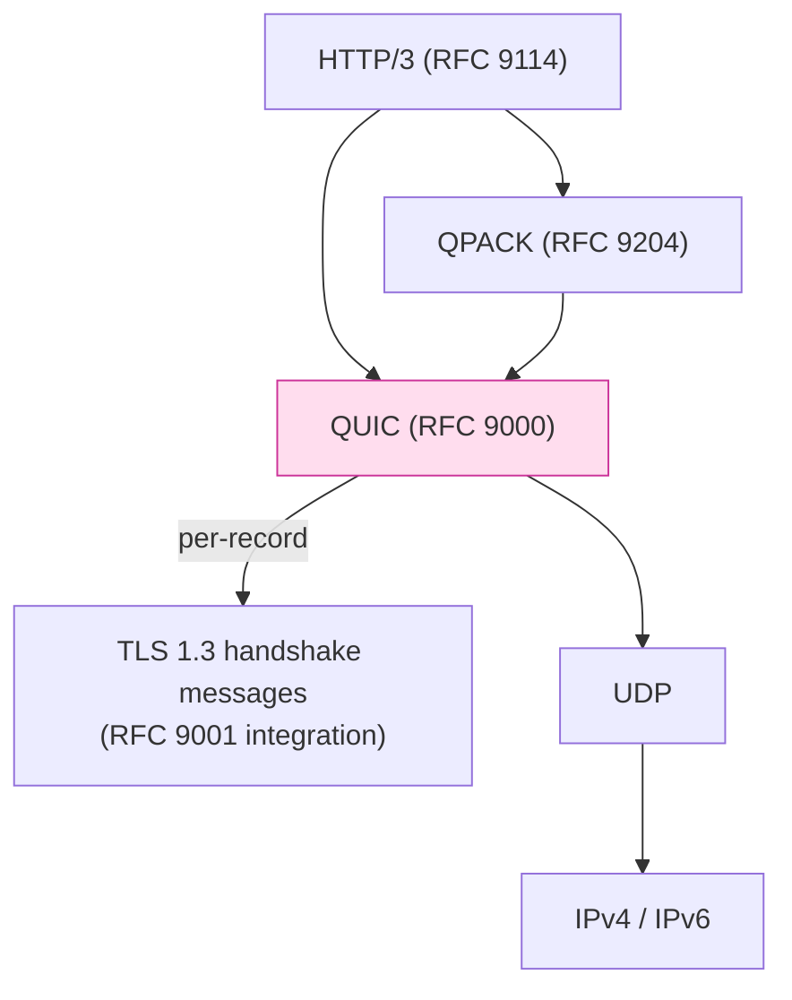
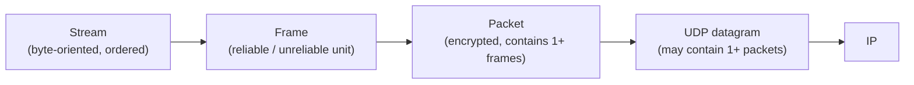

# 課堂 4.7 — QUIC 完整解剖（一）：transport 層

## 學前知道
- 前置課：
  - [4.1–4.6](./4.1-tls-history-bloodshed.md) TLS 系列（QUIC 整合 TLS 1.3 為唯一 secure handshake；不熟 4.3 先回去看）
  - [Part 1 網路基礎](../../SYLLABUS.md#part-1--網路基礎15-堂) — TCP / UDP / IP / NAT（部分已寫）
- 預計閱讀時間：**60 分鐘**
- 必讀規格：
  - **RFC 9000** — *QUIC: A UDP-Based Multiplexed and Secure Transport*（Iyengar, Thomson, May 2021）
  - **RFC 9002** — *QUIC Loss Detection and Congestion Control*（Iyengar, Swett, May 2021）
  - **RFC 8999** — *Version-Independent Properties of QUIC*（Thomson, May 2021）
- 必讀論文：
  - **Langley et al.** *The QUIC Transport Protocol: Design and Internet-Scale Deployment*. SIGCOMM 2017. precis: [`notes/papers/langley-quic-sigcomm.md`](../../notes/papers/langley-quic-sigcomm.md)
  - **Kakhki et al.** *Taking a Long Look at QUIC*. IMC 2017 — Google QUIC 同年的 critical assessment
- 必讀原始碼：
  - **quic-go**（純 Go 實作）：https://github.com/quic-go/quic-go — Part 4.11 全 part 精讀
  - **quinn**（純 Rust 實作）：https://github.com/quinn-rs/quinn
  - **lsquic**（純 C 實作，Akamai）：https://github.com/litespeedtech/lsquic
  - **MsQuic**（純 C 實作，Microsoft）：https://github.com/microsoft/msquic
  - **boringssl + quiche**（Rust, Cloudflare）：https://github.com/cloudflare/quiche

## 動機

如果說 TLS 1.3 是 1995–2018 密碼學社群 23 年的累積教訓，**QUIC 是 1981 TCP 出生以來 36 年 transport 設計教訓的總集**。QUIC 砍掉重練的東西包括：
- TCP head-of-line blocking
- TCP 跟 TLS 分層的 1-3 RTT
- TCP 的 kernel implementation 鎖死
- TCP 的 5-tuple binding 對 mobile 不友善
- TCP packet number / sequence 明文洩漏

讀完應該回答：
- 為什麼是 UDP 而不是新發明 L4 protocol
- packet number 的 design 為什麼這樣 — 跟 TCP sequence number 哪裡不同
- streams、frames、packets 三層 abstraction 在 wire 上怎麼合
- congestion control 為何 1.3 後仍可繼續演化（BBR、CUBIC、Prague）

---

## 核心概念

### 1. QUIC 在協議堆疊的位置



注意：
- QUIC 不在 IP 直接之上，**走 UDP**——這是 deployment-driven 決定（middlebox 認 UDP，不認新 protocol number）
- TLS 1.3 在 QUIC 內部，**不是 wrapper**——QUIC 把 TLS 1.3 handshake message 當 frame，放進 Initial / Handshake packets
- HTTP/3 跟 QPACK 都基於 QUIC streams；但 QUIC 本身不知道 HTTP

### 2. 包裝 — packet、frame、stream 三層

QUIC 的核心 abstraction 是 **三層**：



**Stream** = TCP-like byte stream，**但每個 connection 可以同時有多個 streams**（HTTP/3 每個 request 一條 stream）。
**Frame** = QUIC 內部的「dish unit」。一個 packet 可以含多個 frame。Frames 涵蓋 stream data、ACK、connection close、flow control 等。
**Packet** = QUIC 的加密單位。每個 packet 有自己的 packet number + AEAD nonce。一個 UDP datagram 可以含 **多個 packet**（coalescing）。

### 3. Packet types

QUIC 的 packet 分兩大類：**long header** 與 **short header**。

#### Long header packets

握手期間使用，包含完整 version + connection ID：

```
+-+-+-+-+-+-+-+-+
|1|1|T T|X X X X|              <-- byte 0: header form (=1) + fixed (=1) + type + reserved
+-+-+-+-+-+-+-+-+
|         Version (32)         |
+-+-+-+-+-+-+-+-+
| DCID Len (8)  |
+-+-+-+-+-+-+-+-+
| Destination Connection ID (variable, 0-160 bits)
+-+-+-+-+-+-+-+-+
| SCID Len (8)  |
+-+-+-+-+-+-+-+-+
| Source Connection ID (variable, 0-160 bits)
+-+-+-+-+-+-+-+-+
... type-specific stuff ...
| Payload (encrypted)          |
```

Long header types (RFC 9000 §17.2):
- `0b00` Initial — handshake 起步，加 Token field
- `0b01` 0-RTT — 0-RTT data
- `0b10` Handshake — handshake 後半
- `0b11` Retry — server 要求 client 重發含 token

#### Short header packets

握手完成後使用，省略 version / connection ID lengths（透過 connection state 維護）：

```
+-+-+-+-+-+-+-+-+
|0|1|S|R|R|K|P P|              <-- byte 0: header form (=0) + fixed (=1) + spin + reserved + key phase + packet num len
+-+-+-+-+-+-+-+-+
| Destination Connection ID (0..160)
+-+-+-+-+-+-+-+-+
| Packet Number (8..32)        |
+-+-+-+-+-+-+-+-+
| Payload (encrypted)          |
```

注意：short header 沒 SCID（source connection ID）；server-to-client 的 connection ID 在 handshake 時 negotiate。

### 4. Connection ID — 為何 mobile-friendly

**TCP 的 connection 由 5-tuple (src IP, src port, dst IP, dst port, proto) 識別**。手機從 Wi-Fi 切到 4G → IP 變 → connection broken。

**QUIC 的 connection 由 Destination Connection ID 識別**。Client 從 Wi-Fi 到 4G → src IP/port 變 → 但 QUIC packet 內的 DCID 不變 → server 仍能識別這條 connection → **connection 不斷**。這就是 QUIC connection migration（Part 4.9 詳）。

Connection ID lifecycle (RFC 9000 §5.1):
- Client 初始 ClientHello (Initial) 帶 random `Destination Connection ID`（client 自選）+ random `Source Connection ID`
- Server 回應 `Source Connection ID` 變成 server 後續 want client 用的 DCID
- 雙方可以 **rotate** connection ID 用 `NEW_CONNECTION_ID` frame：發新 connection ID + retire 舊的
- Rotation 防 **passive traffic correlation**（攻擊者用 connection ID 追 mobile user 跨網路 transitions）

### 5. Packet number — 為什麼跟 TCP sequence number 不同

TCP sequence number = **byte offset in stream**，從一個 random ISN 開始，每傳 N bytes 加 N。

QUIC packet number = **packet 序號**，每個 packet **+1**，**不重複**，**獨立於 stream offset**。

為什麼這樣設計？

**痛點 1**：TCP retransmission 仍用同一個 sequence number → server 看到「重發」與「亂序」不可區分 → loss detection 需 ambiguous heuristics（fast retransmit、SACK 等）

**QUIC 解**：每個 packet **獨立** packet number。**retransmission 時用新 packet number 重新傳同樣內容**。Server 收到後查 frame，自己重組 stream。

**好處**：loss detection 變極簡——「packet number X 沒 ACK 過」就是 loss，不需 timing 啟發式。

**痛點 2**：TCP sequence number 明文洩漏（middlebox 識別 flow、修改 flow）。

**QUIC 解**：packet number **加密**（封包頭部 packet number 欄位用 header protection 加密；payload 用 AEAD 加密）。

#### Packet number space

QUIC 有 **三個獨立的 packet number space** (RFC 9000 §12.3):
- Initial space — Initial packets only
- Handshake space — Handshake packets only
- Application Data space — 0-RTT + 1-RTT (short header) packets

每個 space 的 packet number 從 0 開始，獨立增。為什麼分 3 space？
- 不同 space 用不同 keys (initial / handshake / application)
- 避免 cross-context replay 與 nonce reuse
- ACK 也按 space 分別管理

### 6. Frame types

QUIC 把 functionality 全切成 frames。常用 frame types (RFC 9000 §19):

| Type byte | Frame name | 用途 |
|---|---|---|
| 0x00 | PADDING | 填 padding |
| 0x01 | PING | 探活 |
| 0x02, 0x03 | ACK | 確認收到 packets |
| 0x04 | RESET_STREAM | 重設 stream |
| 0x05 | STOP_SENDING | 對端停止傳 |
| 0x06 | CRYPTO | 攜帶 TLS handshake message |
| 0x07 | NEW_TOKEN | server 給 client retry token |
| 0x08–0x0f | STREAM (with/without offset, len, fin) | stream data |
| 0x10 | MAX_DATA | connection-level flow control |
| 0x11 | MAX_STREAM_DATA | stream-level flow control |
| 0x12, 0x13 | MAX_STREAMS | 流數上限 |
| 0x14 | DATA_BLOCKED | flow control 告知對端我被堵 |
| 0x15 | STREAM_DATA_BLOCKED | stream-level 被堵 |
| 0x16, 0x17 | STREAMS_BLOCKED | 流數被堵 |
| 0x18 | NEW_CONNECTION_ID | 引入新 connection ID |
| 0x19 | RETIRE_CONNECTION_ID | 廢舊 connection ID |
| 0x1a | PATH_CHALLENGE | path validation 挑戰 |
| 0x1b | PATH_RESPONSE | path validation 回應 |
| 0x1c, 0x1d | CONNECTION_CLOSE | 關閉 connection |
| 0x1e | HANDSHAKE_DONE | server 告知 handshake 完成 |
| 0x30, 0x31 | DATAGRAM (with/without len) | unreliable datagram (RFC 9221) |

設計觀察：
- **PADDING (0x00) 永遠合法**——這支援 traffic shaping 與 anti-amplification
- **STREAM frame 涵蓋 1/3 byte type**（with/without offset/len/fin） — 為了 size optimization
- **CRYPTO 跟 STREAM 是不同 frame**——TLS handshake 不走 stream（每個 stream 是 application data 用，TLS handshake 是 transport-internal）

### 7. STREAM frame 結構

```
STREAM Frame {
  Type (i),                                  // 0x08-0x0f, bits = OFF/LEN/FIN flags
  Stream ID (i),                             // variable-length integer
  [Offset (i)],                              // optional, depends on OFF bit
  [Length (i)],                              // optional, depends on LEN bit
  Stream Data (..),
}
```

Stream ID 是 62-bit variable-length integer，每條 stream 全局唯一。

**Stream ID 的 low-bit semantics**:
```
00 — client-initiated bidirectional stream  (client 開的 request stream)
01 — server-initiated bidirectional stream  (server push, 較少用)
10 — client-initiated unidirectional stream (HTTP/3 control stream)
11 — server-initiated unidirectional stream
```

→ Stream ID 0 = client 第一條 bidi stream = HTTP/3 第一個 request stream。

### 8. ACK frame — 跟 TCP SACK 對比

```
ACK Frame {
  Type (i) = 0x02 or 0x03,
  Largest Acknowledged (i),
  ACK Delay (i),
  ACK Range Count (i),
  First ACK Range (i),
  ACK Range (..) ...,            // repeated, encoding gap + ack-len
  [ECN Counts (..)],             // if Type = 0x03
}
```

關鍵設計：
- **Largest Acknowledged** 是個 absolute packet number
- **ACK Range** 用 gap-and-range 編碼，可表達不連續確認
- **ACK Delay**: server 告訴 client「我從收到 packet 到送 ACK 等了多久」→ client 計算 RTT 時要減這個（避 server 處理延遲污染 RTT）
- **ECN Counts**: Explicit Congestion Notification 計數（ECT(0), ECT(1), CE）→ 為 ECN-based congestion control（DCTCP / Prague）

對比 TCP SACK：QUIC ACK 是 **first-class，不是 option**；最多可表達 64 個 range（TCP SACK 限 3-4 個）。QUIC loss recovery 因此比 TCP 精細很多。

### 9. Loss recovery (RFC 9002)

QUIC loss detection 兩個 trigger：
1. **Packet threshold**: 如果一個更新的 packet 被 ACK，但這個 packet 沒被 ACK，且 gap ≥ 3 packets → 標記 loss（類比 TCP fast retransmit）
2. **Time threshold**: 如果一個 packet 送出後超過 `kPacketThreshold * smoothed_rtt` 未 ACK → loss

Probe Timeout (PTO): 沒有 outstanding packet 被 ACK 後一段時間就送 PING-style probe 觸發 ACK，避 deadlock。

關鍵：QUIC **不像 TCP 那樣依賴 dupack threshold**，因為 packet number 不重用，每個 packet number 對應唯一 transmission。重發資料用新 packet number。

### 10. Congestion control

RFC 9002 §B 提供 reference congestion controller：**NewReno-style**。但 spec 不強制；implementation 可以自己用：
- **CUBIC** (RFC 8312)：Linux 默認，high-bandwidth-delay-product 友善
- **BBR** (Cardwell, Cheng et al. 2017)：Google 默認；基於 bottleneck-bandwidth + round-trip propagation time 估計
- **Prague / DCTCP-style** + ECN：data-center / 5G 友善
- **Copa**：Arun-Balakrishnan SIGCOMM 2018，delay-based

QUIC 把 congestion control 移到 **user-space**，所以新 controller 部署只需要 application 升級——這是 Langley 2017 paper 主打的賣點之一。

### 11. Flow control — connection 與 stream 雙層

QUIC 有 **兩層 flow control**：
1. **Stream-level**：每條 stream 有自己的 `MAX_STREAM_DATA` window；receiver 收到資料後送 `MAX_STREAM_DATA` 更新 window
2. **Connection-level**：整個 connection 有 `MAX_DATA` 上限；同樣 receiver 控制

Sender 必須兩個都 respect。`STREAM_DATA_BLOCKED` / `DATA_BLOCKED` frame 用來告知對端「我想送但被 flow control 堵住」（透露 sender 狀態，幫助 receiver tuning）。

### 12. Packet header protection — 把 packet number 也藏起來

RFC 9001 §5.4 規定 packet number、reserved bits、key phase 都要 **header protection**（除了 packet 頭部 byte 0 的 type bits）：

```
HP_key = HKDF-Expand-Label(secret, "quic hp", "", key_length)

mask = HP_function(HP_key, sample)
  where sample = ciphertext[4:4+sample_length]  (典型 16 bytes)

byte 0 ^= (mask[0] & 0x0F)  // 對 short header；long header 用 0x1F
packet_number_field ^= mask[1..1+pn_length]
```

效果：**packet number 在 wire 上是加密的**。Passive observer 不能從 packet number 追 connection、不能 fingerprint 客戶端 packet 序號 pattern。

→ 這就是 QUIC 比 TCP/TLS 更難被 middlebox modify 的關鍵——middlebox 看不到 packet number，無法注入「假 ACK」「Reset」（這也是 GFW 對 QUIC 不能用 TCP RST injection 的原因；Part 9 詳）。

### 13. Spin bit — 唯一明文 RTT 信號

RFC 9000 §17.4 規範：short header 的 byte 0 bit 5 是 **spin bit**。
- Client 對 server-to-client packet 的 spin bit 做特定翻轉規則
- 觀察 wire 上 spin bit pattern 可以**外部觀察者測 RTT**

設計用途：給 ISP / measurement 工具 a single bit of RTT signal，避免**完全黑箱化 transport** 引發 ISP 的 deployment 反彈（Langley 2017 經驗）。

Spin bit 在 RFC 9000 是 **optional**，且 client/server 可以 opt-out（每個 connection 一定機率 random 處理 spin bit）。某些 privacy-sensitive 部署完全關掉 spin bit。

### 14. Connection close 與 stateless reset

兩種關閉：

#### Graceful close
雙方互送 `CONNECTION_CLOSE` frame；close 後 connection 進入 draining state（拒絕新 packet，但仍可發 close echo）。

#### Stateless reset
Server 可能因 crash / state loss 不記得某個 connection ID。收到 unknown DCID 的 packet 時，server 送 **stateless reset packet**：
```
Stateless Reset {
  Random (38..),                   // 隨機 bytes，看起來像加密 short header
  Stateless Reset Token (128),     // 16-byte pre-shared token
}
```

`Stateless Reset Token` 是 server 在 connection establishment 時透過 `NEW_CONNECTION_ID` frame 告訴 client 的（per-CID）。Client 收到 unknown packet 但末 16 bytes 匹配 known token → 知道 server 真的 reset，可以放棄 connection。

設計動機：避免 server 維護「connection 已死」的 long-lived state；同時讓 attacker 無法偽造 stateless reset（必須知 token）。

---

## 與我們協議設計的關聯

到此堂結論：

| QUIC design choice | 我們協議的繼承 |
|---|---|
| UDP-based, user-space | ✅ 繼承 |
| Streams + frames + packets 三層 | ✅ 繼承 |
| Packet number 加密 | ✅ 繼承 + 進一步把 connection ID 也搬到加密層 |
| Connection ID-based migration | ✅ 繼承 |
| Flow control 雙層 | ✅ 繼承 |
| TLS 1.3 intrinsic | ✅ 但 inner handshake 加 anti-fingerprint shaping |
| Multiple packet number spaces | ✅ 繼承（為避 nonce reuse） |
| Spin bit | ❓ 對 anti-censorship 是否要 keep？洩漏 RTT 可能利己也可能利敵 |
| Stateless reset token | ✅ 繼承 |
| Header protection | ✅ 強化（連 connection ID 也每 packet rotate） |

特別對 anti-censorship 場景：
- **QUIC 的 long header 仍明文 version + DCID/SCID lengths**（initial 階段）—— 這對 GFW 識別 QUIC 流量是「黃金 7 bytes」（Wu-FEP 2023 的 features 包含這部分）
- 我們協議要不要保留 long header? Part 4.9 + Part 8 詳論

---

## 動手（60 分鐘）

### 練習 A：用 Wireshark 抓 Cloudflare QUIC 流量

```bash
# 強制用 HTTP/3 (QUIC)
sudo tcpdump -i en0 -w /tmp/quic.pcap "udp port 443" &
curl --http3 https://cloudflare-quic.com/ -o /dev/null
sudo killall tcpdump
wireshark /tmp/quic.pcap
```

Wireshark filter `quic` 後右側 panel 對每個 packet 拆出 long/short header + frame list。
- 看 Initial packet 的 version field
- 看 Connection ID
- 看 packet number（dissector 解密前是 raw bytes）

> redaction：pcap 含本地 IP，不要 commit。

### 練習 B：用 quic-go 跑 echo server

```bash
mise use go@latest
git clone https://github.com/quic-go/quic-go
cd quic-go
go run example/echo/echo.go
```

對另一個 terminal:
```bash
go run example/echo-client/main.go
```

讀 `example/echo/echo.go` source code，對應 RFC 9000 的 Listener / Connection / Stream API。

### 練習 C：用 `qlog` 看 connection 內部

quic-go 支援 [qlog](https://github.com/quicwg/qlog) format。export environment：
```bash
QUIC_GO_LOG_LEVEL=debug ./your-quic-app
```

或在 code 設 `quic.Config.Tracer`。生成 `.qlog` 檔後用 https://qvis.quictools.info/ 上傳 → 視覺化 packet flow、stream multiplexing、loss recovery。

### 練習 D：對讀 RFC 9000 跟 quic-go 的 packet handling

開 `quic-go/internal/wire/header.go`，找 `ParseConnectionID()`, `Header.Write()` etc. 對照 RFC 9000 §17. 看 quic-go 怎麼處理 long header parsing。

---

## 自我檢查

1. **為什麼 QUIC 走 UDP 而不是新發明 IP protocol number？** 列出 3 個 middlebox 與部署原因。
2. **TCP sequence number 跟 QUIC packet number 在 wire 上有什麼結構差別**？描述兩者對 loss recovery 演算法的影響。
3. **QUIC 有三個 packet number space**。如果只用一個 space 會發生什麼？描述 cross-context nonce reuse scenario。
4. **Spin bit 是一個 privacy / measurement trade-off**。如果完全關掉 spin bit，ISP 怎麼診斷網路問題？
5. **Stateless reset token 必須在 connection establishment 階段送出**。如果 attacker 在握手過程截獲 token，可以做什麼？提示：考慮 connection migration scenario。
6. **QUIC header protection 把 packet number 加密**。Middlebox 因此不能注入 RST，但也不能做 TCP-style retransmission detection。這對「QUIC over TCP-friendly Internet」是優還是劣？

---

## 延伸閱讀

- Langley et al. SIGCOMM 2017
- Kakhki et al. *Taking a Long Look at QUIC*. IMC 2017 — 對 Google QUIC 早期版本的 critical assessment
- Rüth et al. *A First Look at QUIC in the Wild*. PAM 2018
- Marx et al. *Same Standards, Different Decisions: A Study of QUIC and HTTP/3 Implementation Diversity*. EPIQ 2020
- Iyengar & Swett. *QUIC loss recovery* (RFC 9002 + companion blog)
- Cardwell et al. *BBR: Congestion-Based Congestion Control*. CACM 2017
- quic-go 系列 blog: https://quic-go.net/
- IETF QUIC WG mailing list

---

## 研究級補遺

### 1. 學界詞彙

| 口語 | 學界用詞 |
|---|---|
| 「QUIC 把 TLS 包進來」 | **TLS as an intrinsic component / integrated handshake** |
| 「stream 串接」 | **Multiplexed bytestreams** |
| 「packet number 是封包序號」 | **Packet sequence number / packet identifier** |
| 「connection 跨 IP 移動」 | **Connection migration / path migration** |
| 「短 header」 | **1-RTT packet** (in RFC terminology) |
| 「短 header 跟 long header 切換」 | **Handshake confirmation / handshake completion** |
| 「擁塞控制演算法可換」 | **Pluggable congestion control / user-space CC** |
| 「Spin bit」 | **Latency spin bit** (RFC 9000 §17.4) |

### 2. 對手分類學

對 QUIC transport 的對手能力：

| 等級 | 能力 |
|---|---|
| Q1 | passive (read) — 看 long header version、CID length pattern |
| Q2 | active drop / reorder / inject — 可丟 packet 但不能改 header（header protection 防） |
| Q3 | endpoint-aware — 知道 client/server 公開 endpoint 但不知 inner state |
| Q4 | stateful filter — 對 long header pattern + initial packet 內容做 DPI |
| Q5 | active probing — 對可疑 server 發 stateless reset 探測 |
| Q6 | global passive correlation — 追 connection migration |

### 3. 形式化定義

QUIC 的 **transport security properties**（RFC 9001 + Davis-Günther 2021 paper）：

- **Channel confidentiality**: 1-RTT data IND-CPA secure under handshake key derivation
- **Channel integrity**: 1-RTT data INT-CTXT secure under AEAD
- **Packet number unlinkability**: passive observer 不能從 packet number 區分兩個 connection 是否同一 client
- **Migration unlinkability**: client 切 IP 後，passive observer 不能 link 新舊 path（前提：CID rotation 啟用 + spin bit 處理）

### 4. 領域的關鍵論文 / RFC

| 引用 | 為何必追 | 之後在哪堂精讀 |
|---|---|---|
| RFC 9000 | QUIC core | 本堂 / 4.8 / 4.9 |
| RFC 9001 | QUIC + TLS 1.3 | 4.8 |
| RFC 9002 | loss + congestion | 本堂 |
| RFC 8999 | version-independent invariants | 本堂 |
| RFC 9221 | datagram extension | 4.9 |
| Langley et al. SIGCOMM 2017 | 起源 | 本堂 |
| Kakhki et al. IMC 2017 | critical assessment | 本堂 |
| Davis-Günther *Tighter Proofs for the QUIC Handshake*. PKC 2022 (假設 follow-up) | 形式化 | Part 5 |

### 5. 我們協議的座標

到此堂收窄：
- ✅ UDP + user-space transport
- ✅ Multi-stream multiplexing
- ✅ Packet number 加密
- ✅ Connection ID-based migration
- ✅ Pluggable congestion control（採 BBRv3）
- ❓ 是否保留 long header pattern（GFW 識別 entry point）
- ❓ Spin bit on/off

### 6. 必追資源 / 社群入口

- IETF QUIC WG: https://datatracker.ietf.org/wg/quic/
- QUIC interop test runner: https://interop.seemann.io/
- qlog / qvis 工具鏈
- EPIQ workshop (yearly 學術 venue)
- Bishop's QUIC blog

### 7. 開放問題

- **Multi-path QUIC** (draft-ietf-quic-multipath)：production 部署的擴展瓶頸
- **QUIC + post-quantum handshake** size 對 PMTU 影響（1-RTT 變 2-RTT 風險）
- **GFW 對 QUIC long header 的識別** 是否能由 wire-format obfuscation 完全規避（Part 8 詳）
- **Connection migration 在 NAT-rebinding 場景** 的真實成功率 measurement

---

> 下一堂（Part 4.8）：QUIC + TLS 1.3 整合的細節。Initial / Handshake / 1-RTT 三套 keys 的演化，Retry token 的設計。
