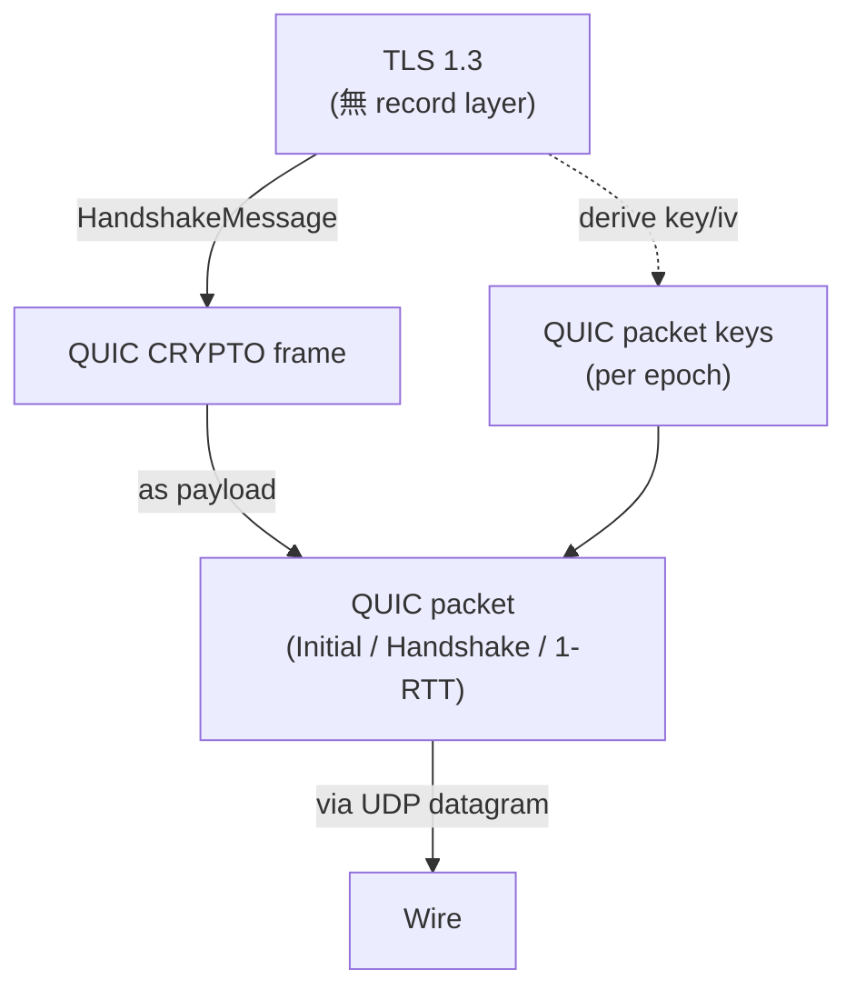
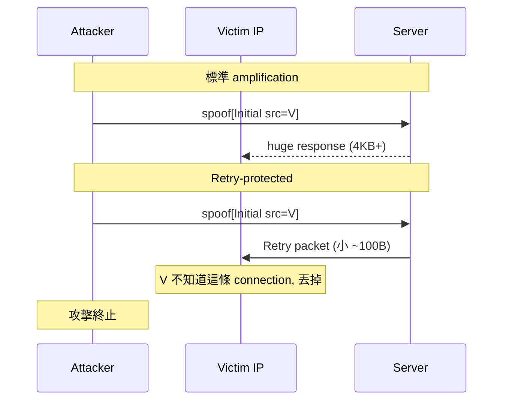

# 課堂 4.8 — QUIC 完整解剖（二）：握手與 TLS 1.3 整合

## 學前知道
- 前置課：
  - [4.7 QUIC transport](./4.7-quic-transport.md)
  - [4.3 TLS 1.3 握手逐 byte 解剖](./4.3-tls13-handshake-byte-level.md)
  - [4.5 0-RTT 與 replay](./4.5-zero-rtt-and-replay.md)
- 預計閱讀時間：**60 分鐘**
- 必讀規格：
  - **RFC 9001** — *Using TLS to Secure QUIC*（Thomson, Turner, May 2021）
  - **RFC 9000** §17 (Packet Formats) + §7 (Cryptographic and Transport Handshake)
  - **RFC 8446** TLS 1.3
- 必讀論文：
  - **Davis & Günther**. *Tighter Proofs for the QUIC Handshake*. EUROCRYPT 2022 — formal proof QUIC handshake key derivation
  - **Lychev, Jero, Boldyreva, Nita-Rotaru**. *How Secure and Quick is QUIC? Provable Security and Performance Analyses*. IEEE S&P 2015 — 對 Google QUIC 的早期分析
- 必讀原始碼：
  - quic-go `internal/handshake/`
  - quinn `quinn-proto/src/crypto/rustls.rs`
  - boringssl `ssl/handshake.cc` 對應 QUIC API

## 動機

4.7 講了 QUIC transport layer：packet、frame、stream。但 QUIC 的「secure」要靠 TLS 1.3 — 而且不是 "TLS 1.3 跑在 QUIC 上" 那麼簡單。**QUIC 把 TLS 1.3 拆開，每個 handshake message 變成 QUIC frame，每個階段對應一套 keys**。

這堂課把 QUIC handshake 完整拆開：
- Initial / Handshake / 1-RTT 三組 keys 怎麼算
- TLS 1.3 record layer **不存在**——TLS message 直接走 QUIC CRYPTO frame
- Initial key 是用 well-known salt + DCID derive 出來——「明文加密」是怎麼回事
- Retry token 機制如何防 amplification attack

讀完應該回答：
- 為什麼 QUIC initial 用「公開可推導」的 key 加密
- Server 怎麼用 Retry token 驗 client IP
- 0-RTT 在 QUIC 跟 TLS 1.3 有何不同
- 為何 QUIC handshake 加密 key 從 TLS 1.3 secret 衍生而不直接用

---

## 核心概念

### 1. QUIC + TLS 1.3 的整合架構



關鍵：
- **TLS 1.3 record layer 在 QUIC 中不存在**。TLS 1.3 在 QUIC 中只負責 handshake 與 key derivation。
- TLS 1.3 不送 `ChangeCipherSpec`（QUIC 不需要 middlebox dummy）
- TLS 1.3 不送 KeyUpdate（QUIC 用自己的 KeyUpdate via Key Phase bit）
- TLS 1.3 不送 NewSessionTicket（QUIC 仍可在 application stream 上送，但用 QUIC frame 結構）

### 2. 三組 packet keys

QUIC handshake 經過三個 **epoch**，每個 epoch 用獨立 keys：

| Epoch | Packet type | TLS 1.3 secret 來源 |
|---|---|---|
| **Initial** | Initial packets | 從 well-known salt + DCID derive |
| **Handshake** | Handshake packets | `client_handshake_traffic_secret` / `server_handshake_traffic_secret` |
| **Application** | 0-RTT, 1-RTT (short header) | `client_application_traffic_secret_0` / `server_application_traffic_secret_0` |
| **(0-RTT)** | 0-RTT packets | `client_early_traffic_secret` |

每個 epoch 的 keys：
- AEAD key
- AEAD iv (用於 nonce)
- header protection key (HP)

從 TLS 1.3 secret 衍生：
```
key = HKDF-Expand-Label(secret, "quic key", "", key_length)
iv  = HKDF-Expand-Label(secret, "quic iv",  "", iv_length)
hp  = HKDF-Expand-Label(secret, "quic hp",  "", key_length)
```

注意 label 是 `"quic key"` 而非 `"key"`——對應 RFC 8446 的 `"tls13 key"` label，QUIC 用自己的 namespace `"quic "` 前綴，**防 cross-protocol attack**。

### 3. Initial keys — 「明文加密」的本質

**Problem**：第一個 Initial packet 必須是加密的（QUIC spec 要求所有 packet 都加密；不允許明文 control plane）。但 client/server 還沒做完 ECDHE，沒有共享 secret。

**Solution**：Initial keys 從 **client's Destination Connection ID + 公開 salt** derive。

```
initial_salt = 0x38762cf7f55934b34d179ae6a4c80cadccbb7f0a    # RFC 9001 §5.2, QUIC v1
initial_secret = HKDF-Extract(initial_salt, client_dst_connection_id)

client_initial_secret = HKDF-Expand-Label(initial_secret, "client in", "", 32)
server_initial_secret = HKDF-Expand-Label(initial_secret, "server in", "", 32)

client_initial_key = HKDF-Expand-Label(client_initial_secret, "quic key", "", 16)
client_initial_iv  = HKDF-Expand-Label(client_initial_secret, "quic iv", "",  12)
client_initial_hp  = HKDF-Expand-Label(client_initial_secret, "quic hp", "",  16)
# 同樣對 server 算
```

**「明文加密」的意義**：

- 任何 observer 知道 client DCID 就能 derive 同一個 key → **Initial packets 對任何 observer 都可解**
- 為什麼還加密? **防 middlebox modification + 防 trivial pattern injection**——middlebox 可以解但要嘗試 modify 並重 encrypt 仍要對 AEAD 簽，否則對方收到不通過 AEAD verification
- 真實 security 仍由內部 TLS 1.3 handshake message 承擔

**這是 QUIC 對 ossification 的關鍵設計**：所有 packet 都加密，middlebox 看不見 packet header pattern 修改→middlebox 無法 inject 假 RST 或 modify packet number。

### 4. Initial packet 結構

```
Initial Packet {
  Header Form (1) = 1,
  Fixed Bit (1) = 1,
  Long Packet Type (2) = 0,       # 0 = Initial
  Reserved Bits (2),
  Packet Number Length (2),
  Version (32) = 0x00000001,      # QUIC v1
  Destination Connection ID Length (8),
  Destination Connection ID (0..160),
  Source Connection ID Length (8),
  Source Connection ID (0..160),
  Token Length (i),               # variable-length integer
  Token (..),                     # Retry / NEW_TOKEN issued earlier
  Length (i),                     # payload + packet number length
  Packet Number (8..32),
  Packet Payload (8..),           # AEAD encrypted
}
```

`Token` 欄位：
- 第一次 client 發 Initial → 空 token（length=0）
- Server 發 Retry → client 再發 Initial 帶 Retry token
- Server 在 connection close 前用 `NEW_TOKEN` frame 給 client 一個 token，下次 connection establish 帶來作為「我之前來過」的 evidence

`Packet Payload` 解密後是 **CRYPTO frame 含 ClientHello**（client 端）或 **CRYPTO frame 含 ServerHello/EncryptedExtensions/Cert/CV/Finished**（server 端）。

### 5. CRYPTO frame — TLS message 的搬運工

```
CRYPTO Frame {
  Type (i) = 0x06,
  Offset (i),
  Length (i),
  Crypto Data (..),
}
```

設計觀察：
- Crypto data 是 **byte-stream**，每個 frame 一段 offset + bytes，跟 STREAM frame 結構一樣
- 但 **不在 QUIC stream 內** — 不占 stream ID，獨立於 application stream
- 每個 packet number space 有自己的 CRYPTO stream（Initial / Handshake / Application 各一條）
- TLS handshake message 可能跨多個 CRYPTO frame（如果 ClientHello > MTU）

### 6. 完整 handshake 序列

```mermaid
sequenceDiagram
    autonumber
    participant C as Client
    participant S as Server

    Note over C,S: Epoch 0: Initial keys (derived from DCID + salt)
    C->>S: Initial[CRYPTO[ClientHello]]
    S->>C: Initial[CRYPTO[ServerHello], ACK]
    Note over C,S: TLS handshake_traffic_secret derived → switch to Handshake epoch
    S->>C: Handshake[CRYPTO[EncryptedExtensions, Cert, CV, Finished]]
    C->>S: Handshake[CRYPTO[Finished], ACK]
    Note over C,S: TLS application_traffic_secret_0 derived → switch to Application epoch
    S->>C: 1-RTT[HANDSHAKE_DONE, NEW_CONNECTION_ID, NEW_TOKEN, ...]
    C->>S: 1-RTT[STREAM data, ACK, ...]
    Note over C,S: Subsequent traffic uses Application keys; key updates via Key Phase bit
```

特別注意：
- **packet coalescing**：一個 UDP datagram 可以包含 Initial + 0-RTT + Handshake packets（在 client 端）；server 端可以包 Initial + Handshake
- **不同 epoch 的 packet 用對應 epoch 的 keys 加密**——一個 datagram 內各 packet 各自加密
- **ACK 在每個 epoch 分別管**：Initial epoch 的 ACK 走 Initial packet space

### 7. Retry mechanism — 防 amplification attack

**Amplification attack** scenario：
- Attacker spoofs IP `V`（victim）發 Initial 給 server
- Server 回應 includes ServerHello + Certificate + CertificateVerify + Finished → 可能 **數 KB**
- Server 把 KB 級 response 發到 victim → attacker amplification factor ~10x+

QUIC 防禦：**Retry**



`Retry packet` 結構：
```
Retry Packet {
  Header Form (1) = 1,
  Fixed Bit (1) = 1,
  Long Packet Type (2) = 3,
  Unused (4),
  Version (32),
  Destination Connection ID Length (8),
  Destination Connection ID (0..160),
  Source Connection ID Length (8),
  Source Connection ID (0..160),
  Retry Token (..),
  Retry Integrity Tag (128),       # AEAD tag over Original DCID + Retry pseudo-packet
}
```

**Retry Token** 由 server 構造，包含 client IP + timestamp + 加密 token（server-only secret）。Client 收到 Retry 後**用同樣 DCID + Token 重發 Initial**。Server 對 second Initial 驗 token：
- Token 含的 IP == 真實收到 Initial 的 src IP → 確認 client 真的在那個 IP
- Token timestamp 在容忍窗內 → 防 replay

**Anti-amplification**: RFC 9000 §8.1 限制 server 在 client address validation 之前**只能發 3x 收到的 bytes**。Retry 後 client address 已 validated，可解除限制。

### 8. NEW_TOKEN — pre-validation for resumption

Connection 完成 + 一段時間後，server 可以發 `NEW_TOKEN` frame 給 client：
```
NEW_TOKEN Frame {
  Type (i) = 0x07,
  Token Length (i),
  Token (..),
}
```

下次 client 對同一 server 開新 connection，**第一個 Initial 就帶這個 token** → server 看到 token 有效 → 跳過 Retry 步驟 → 直接 send response → 1-RTT 連線。

對比 Retry token 與 NEW_TOKEN token：
- **Retry token**：current connection 用，token validation 後 client 才能繼續
- **NEW_TOKEN token**：long-lived，跨 connection；只在 client repeat-visit 用

### 9. Version negotiation

QUIC packet header `Version` field 32 bits。RFC 9000 規範 `0x00000001` = QUIC v1。其他版本：
- `0x00000000` = **Version Negotiation Packet** type
- `0x6b3343cf` = QUIC v2 (RFC 9369)
- `0xff000000 + n` = draft-ietf-quic-transport-n

如果 server 收到 client 不支援的 version：
1. Server 發 **Version Negotiation packet**：header version = 0, 列出 server 支援的 versions
2. Client 收到後重新發 Initial 用新 version

但 Version Negotiation 本身**容易被攻擊** — attacker spoof Version Negotiation 把 client downgrade。對抗：RFC 9000 §6.3 要求 client 把 server's 支援 version list 跟 TLS 1.3 transcript-hash bind。

### 10. 0-RTT in QUIC

QUIC 0-RTT 跟 TLS 1.3 0-RTT 概念一樣，但 wire 結構不同：
- 0-RTT packet 用 long header, `Long Packet Type = 0b01`
- 0-RTT key 從 `client_early_traffic_secret` derive
- 0-RTT 必須在同一 UDP datagram 跟 Initial 一起發（packet coalescing）
- Server 回 ACK 是 1-RTT packet（server 沒對 0-RTT 直接 ACK）

對 application:
- 0-RTT 可以開 **stream**（不像 TLS 1.3 只 raw bytes）
- 0-RTT stream 受 transport parameters 限制：`max_streams_bidi_remote` / `max_streams_uni_remote` 等需 server cached

**0-RTT 的 replay 風險跟 TLS 1.3 相同**——RFC 9001 §9.2 明確警語：**「Application protocols MUST NOT use 0-RTT data for any operation that is not safe to retry」**。

### 11. Key Update — QUIC 的 rekey 機制

QUIC 1-RTT packet header byte 0 bit 2 是 **Key Phase**。每方獨立 toggle：
- Key Phase = 0：用 application keys epoch 0
- 想 rekey：把 Key Phase flip 到 1，**新 keys 從舊 secret 衍生**：
  ```
  application_traffic_secret_N+1 = HKDF-Expand-Label(
      application_traffic_secret_N,
      "quic ku", "", Hash.length)

  new_key = HKDF-Expand-Label(secret_N+1, "quic key", "", key_length)
  new_iv  = HKDF-Expand-Label(secret_N+1, "quic iv",  "",  iv_length)
  ```

- 收到 Key Phase 翻轉的 packet → 對方先試新 keys 解，不行 → 試舊 keys
- 雙方各自獨立 rekey；可以一方 rekey 而另一方還在舊 phase

設計目的：跟 TLS 1.3 KeyUpdate 同樣是 AEAD nonce reuse 上界控制 + cryptographic agility。

### 12. Transport parameters — handshake 中的 negotiation

`transport_parameters` 是 TLS 1.3 extension (RFC 9001 §8.2)，雙方在 ClientHello / EncryptedExtensions 互送：

```
struct {
    uint16 parameter_id;
    opaque parameter_value<0..2^16-1>;
} TransportParameter;
```

關鍵 parameters (RFC 9000 §18.2):
- `0x00` `original_destination_connection_id`
- `0x01` `max_idle_timeout`
- `0x02` `stateless_reset_token` (16 bytes)
- `0x03` `max_udp_payload_size`
- `0x04` `initial_max_data`
- `0x05`~`0x08` 各種 `initial_max_stream_data_*`
- `0x09`~`0x0a` `initial_max_streams_*`
- `0x0b` `ack_delay_exponent`
- `0x0c` `max_ack_delay`
- `0x0d` `disable_active_migration`
- `0x0e` `preferred_address`
- `0x0f` `active_connection_id_limit`
- `0x10` `initial_source_connection_id`
- `0x11` `retry_source_connection_id`

注意 `transport_parameters` 在 TLS 1.3 EncryptedExtensions 內部 → **加密 + transcript-bound**。Middlebox 看不到 server 公佈的 flow control limit，因此不能依此調整 buffer。

### 13. Header protection cipher

不同 cipher suite 用不同 HP function:
- **AES-128-GCM**: HP = AES-128-ECB-encrypt(HP_key, sample)
- **AES-256-GCM**: HP = AES-256-ECB-encrypt(HP_key, sample)
- **ChaCha20-Poly1305**: HP = ChaCha20(HP_key, counter=sample[0..4], nonce=sample[4..16])

`sample` 是 packet payload 開頭 16 bytes（在 packet number 後）。

實作上 HP 跟 payload AEAD 是不同 keys——但 derive 同一個 secret。

---

## 與我們協議設計的關聯

| QUIC handshake choice | 我們協議的設計取捨 |
|---|---|
| 用 well-known salt + DCID derive Initial keys | ✅ 繼承，但對 anti-fingerprint 場景可能改：用 server-issued shared key 增加混淆 |
| 三個 packet number space（Initial/Handshake/Application） | ✅ 繼承 |
| 加密 packet number via header protection | ✅ 繼承 + 強化（包 connection ID） |
| Retry token 防 amplification | ✅ 繼承，但 token wire 結構自定避指紋 |
| NEW_TOKEN 跨 connection resumption | ✅ 繼承 |
| Transport parameters in TLS 1.3 EncryptedExtensions | ✅ 繼承 |
| Key Phase bit for rekey | ✅ 繼承 |
| 0-RTT optional | ✅ optional + replay-safe semantics + traffic shaping |

**對 anti-censorship 特殊考量**:
- **QUIC long header pattern 是 GFW 識別關鍵**：byte 0 高 bit、Version field、固定 salt 推 Initial keys → GFW 可推 client DCID 並嘗試解 Initial frame → 看到 ClientHello SNI
- **我們協議解法**: 走 ECH-style outer SNI + 不用標準 salt (server 私有 salt + connection-specific) → Part 8 詳

---

## 動手（30 分鐘）

### 練習 A：手動推 QUIC Initial keys

選定一個 client DCID，例如 `8394c8f03e515708`（RFC 9001 Appendix A 範例），用 Python `cryptography`:

```python
from cryptography.hazmat.primitives.kdf.hkdf import HKDFExpand, HKDF
from cryptography.hazmat.primitives import hashes
from cryptography.hazmat.primitives.hmac import HMAC

initial_salt = bytes.fromhex('38762cf7f55934b34d179ae6a4c80cadccbb7f0a')
client_dst_cid = bytes.fromhex('8394c8f03e515708')

# HKDF-Extract
h = HMAC(initial_salt, hashes.SHA256())
h.update(client_dst_cid)
initial_secret = h.finalize()
print("initial_secret:", initial_secret.hex())

def expand_label(secret, label, length):
    full_label = b'\x00' + bytes([length]) + bytes([len(label) + 6]) + b'tls13 ' + label + b'\x00'
    h = HKDFExpand(algorithm=hashes.SHA256(), length=length, info=full_label)
    return h.derive(secret)

# Wait, QUIC uses "tls13" prefix? No - check RFC 9001 §5.2
# It's "tls13 " for HKDF-Expand-Label but the labels are "client in", "server in", "quic key", "quic iv", "quic hp"
```

對 RFC 9001 Appendix A 的 test vectors 驗算，**重現 client_initial_key**。

### 練習 B：用 ngtcp2 觀察 packet 加密 trace

ngtcp2 (https://github.com/ngtcp2/ngtcp2) 是 C 的 QUIC implementation, debug log 印 packet hex + decrypted CRYPTO frame。跑 `examples/client` 連 Cloudflare 並開 `--show-secret`。

### 練習 C：對讀 quic-go `internal/handshake/crypto_setup.go`

讀 `quic-go/internal/handshake/crypto_setup.go` 中 `installInitialSealer` 與 `installHandshakeSealer` 函數，對應 RFC 9001 §5.2 / §5.3 看 key derivation 流程。

### 練習 D：用 Wireshark 解密 QUIC

從 Chrome 啟用 `SSLKEYLOGFILE`：
```bash
export SSLKEYLOGFILE=/tmp/keys.log
google-chrome
```

訪問 HTTP/3 site，停止 Chrome。把 `keys.log` 載入 Wireshark Preferences → Protocols → TLS → "(Pre)-Master-Secret log filename"。然後 reload pcap → Wireshark 會解 QUIC payload 並顯示 inner TLS messages + STREAM frames。

> redaction: SSLKEYLOGFILE 含真實 session secrets，永遠不要 commit。

---

## 自我檢查

1. **Initial keys 由公開 salt + DCID derive，所有 observer 都能解**。為什麼 Initial packets 仍要加密？描述 middlebox 想 modify Initial packet 的失敗模式。
2. **CRYPTO frame 在三個 packet number space 各自獨立**。如果 client 把 TLS ClientHello 拆成兩個 CRYPTO frame，一個放 Initial packet，一個放 Handshake packet，會發生什麼？
3. **Retry token 含 client IP**。如果 client behind NAT，NAT 的 public IP 跟 server 看到的 IP 一致，token 仍 work。但如果 client 在 mobility scenario 中 IP 變了？描述 Retry 機制如何處理 NAT rebind。
4. **Key Phase bit 是 1 bit**。Attacker 把 packet 的 Key Phase bit 翻轉會怎樣？提示：header protection 涵蓋 Key Phase。
5. **Version Negotiation packet 不加密**。為什麼這仍 secure?（提示：TLS 1.3 transcript hash）
6. **QUIC 把 TLS 1.3 record layer 拿掉**，但 TLS 1.3 NewSessionTicket 是 record-layer message。QUIC 怎麼傳 NewSessionTicket?

---

## 延伸閱讀

- RFC 9001 — *Using TLS to Secure QUIC*
- RFC 9001 Appendix A — Sample handshake
- Davis & Günther. *Tighter Proofs for the QUIC Handshake*. EUROCRYPT 2022
- Lychev et al. *How Secure and Quick is QUIC?*. IEEE S&P 2015
- Bishop. *QUIC's Crypto: A Deeper Look*. https://daniel.haxx.se/blog/...
- Ian Swett. *QUIC: Multiplexed and Encrypted Transport for HTTP*. Google research talk

---

## 研究級補遺

### 1. 學界詞彙

| 口語 | 學界用詞 |
|---|---|
| 「QUIC handshake 整合 TLS 1.3」 | **Combined transport-and-key-exchange protocol** |
| 「Initial key 從公開資料 derive」 | **Public-knowledge key derivation for protocol observability** |
| 「Retry token 防偽 IP」 | **Server-side address validation token** |
| 「Anti-amplification limit」 | **3x amplification cap** (RFC 9000 §8.1) |
| 「QUIC 0-RTT」 | **Pre-handshake encrypted data** |
| 「Key Phase」 | **Phase bit / key epoch indicator** |

### 2. 對手分類學

QUIC handshake 對手能力：

| 等級 | 能力 |
|---|---|
| QH1 | passive observer — 看 Initial 明文 + 推 keys |
| QH2 | active spoofer — 偽 IP 發 Initial 試 amplification |
| QH3 | on-path active — 改 packet（但 AEAD 防 modification） |
| QH4 | adaptive on-path — 用 padding probe 推 connection ID |
| QH5 | replay attacker — 重發 captured 0-RTT |
| QH6 | downgrade — 偽 Version Negotiation |

### 3. 形式化定義

QUIC handshake security (Davis-Günther EUROCRYPT 2022):

> $\forall A$ PPT adversary，QUIC handshake $\Pi$ 在 multi-stage key exchange model 下，每個 epoch 的 session key 對 $A$ indistinguishable from random，前提：
> - $A$ 不能 break HKDF as random oracle
> - $A$ 不能 break TLS 1.3 ECDHE
> - $A$ 不能 break AEAD INT-CTXT
>
> 證明 reduction tighter than Lychev et al. 2015 (Google QUIC)，因 IETF QUIC keys 從 distinct labels derive，避免 cross-context attack。

### 4. 領域的關鍵論文 / RFC

| 引用 | 為何必追 | 之後在哪堂精讀 |
|---|---|---|
| RFC 9001 | QUIC + TLS 整合 spec | 本堂 |
| Davis-Günther EUROCRYPT 2022 | formal proof tighter | Part 5.7 |
| Lychev et al. S&P 2015 | Google QUIC 早期分析 | Part 5 |
| Bhargavan et al. *miTLS for QUIC*（假設 follow-up） | verified QUIC implementation | Part 5 |
| RFC 9369 | QUIC v2 | 4.9 |

### 5. 我們協議的座標

- ✅ 三 epoch keys 分離
- ✅ Header protection
- ✅ Retry-style anti-amplification（強制）
- ✅ Transport parameters in EncryptedExtensions
- ❓ Initial key 是否 derive 自 公開 salt（GFW 識別點）vs server private salt（破壞 interop 但 anti-censorship）

### 6. 必追資源 / 社群入口

- IETF QUIC WG mailing list
- quic-tracker tool: https://quic-tracker.info.ucl.ac.be/
- QUIC interop test runner
- IACR ePrint QUIC search

### 7. 開放問題

- Post-quantum QUIC handshake size 對 PMTU 影響（Initial packet 可能 fragment）
- QUIC + ECH 整合 — Initial 應該模仿 outer ClientHello 還是另設層
- QUIC Initial key derivation 的 anti-fingerprint 重設計（Part 8 開放議題）

---

> 下一堂（Part 4.9）：QUIC 進階——connection migration、QUIC v2、datagram extension (RFC 9221)、Multi-path QUIC。
