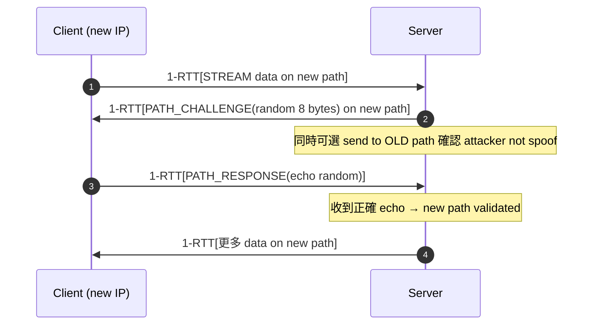

# 課堂 4.9 — QUIC 完整解剖（三）：進階主題

## 學前知道
- 前置課：[4.7 transport](./4.7-quic-transport.md), [4.8 handshake](./4.8-quic-handshake.md)
- 預計閱讀時間：**50 分鐘**
- 必讀規格：
  - **RFC 9221** — *An Unreliable Datagram Extension to QUIC*
  - **RFC 9369** — *QUIC Version 2*
  - **RFC 9287** — *Greasing the QUIC Bit*
  - **draft-ietf-quic-multipath** (Multi-path QUIC, 仍 active)
  - **draft-ietf-quic-ack-frequency** (ACK Frequency)
  - **RFC 9308** — *Applicability of the QUIC Transport Protocol*
- 必讀論文：
  - **De Coninck & Bonaventure**. *Multipath QUIC: Design and Evaluation*. CoNEXT 2017
  - **Yu et al.** *Multipath QUIC: A Deployable Multipath Transport Protocol*. ICC 2021
- 必讀原始碼：
  - quic-go: connection migration tests in `internal/handshake/`
  - msquic: multi-path early implementation

## 動機

4.7 + 4.8 講了 QUIC 主幹。本堂處理 QUIC 三件「進階大事」：
1. **Connection migration** — 把 TCP 不可能做到的「不斷線換 IP」變現實
2. **QUIC v2** + version greasing — 為將來改 wire format 預留路徑
3. **Datagram extension (RFC 9221)** — 把 QUIC 變 unreliable transport，是 MASQUE 的根基

讀完應該回答：
- 為什麼 connection migration 必須 path validation
- QUIC v2 跟 v1 wire 差別在哪裡
- Datagram extension 對我們協議意味什麼
- Multi-path QUIC 為何 7 年仍未 RFC

---

## 核心概念

### 1. Connection migration (RFC 9000 §9)

**Scenario**: client 從 Wi-Fi 切到 4G，src IP 跟 port 變了，但 connection 不能斷。

**Mechanism**:
1. Client 偵測 network change（OS hook 或 application-driven）
2. Client 用「**新 path**」發 packet to server（不變的 DCID）
3. Server 看到同一個 DCID 但 new src IP/port → **可能合法 migration，也可能 attacker spoof**
4. Server 必須做 **path validation** 才相信新 path

#### Path validation



`PATH_CHALLENGE` frame：
```
PATH_CHALLENGE Frame {
  Type (i) = 0x1a,
  Data (64),       # 8 random bytes
}

PATH_RESPONSE Frame {
  Type (i) = 0x1b,
  Data (64),       # echo PATH_CHALLENGE.Data
}
```

如果 attacker spoof client IP 想 hijack connection:
- Attacker 不知道 connection 上的 application keys → 無法解 PATH_CHALLENGE 加密 packet（這條 path 用 application key 走 encrypted)
- 等等——attacker 仍能用 captured packet 偽 src IP 發到 server，server **回 PATH_CHALLENGE 到 attacker 偽的 src IP**。Attacker 不知 application keys 不能解。但若 attacker 也對 victim spoof 雙向中繼?

實務上 path migration 仍有 attack scenarios，因此 RFC 9000 §9.4 規定：
- Path validation 期間，server 對新 path 限制 send rate（仍 3x anti-amplification）
- Server **不能** abandon 舊 path 直到新 path validated
- 多個 client connection IDs 在 NEW_CONNECTION_ID frame 內 issue → client migrate 時換 DCID（避 5-tuple-track）

#### NAT rebinding vs intentional migration

NAT timeout → src port 變（即使 client 沒做事）→ server 看新 path → 觸發 path validation。
RFC 9000 區分：
- **NAT rebinding**：client unintentional，DCID 不變
- **Intentional migration**：client 主動，會用 new DCID（避 cross-path correlation）

`disable_active_migration` transport parameter 讓 server 告訴 client「我不支援 migration，請別嘗試」（典型 IoT 或 simple server）。

### 2. Preferred address — server-side migration

Server 也可以主動 migrate。在 ServerHello transport parameters 的 `preferred_address`:

```c
struct {
    IPv4Address ipv4_address;
    uint16 ipv4_port;
    IPv6Address ipv6_address;
    uint16 ipv6_port;
    uint8 connection_id_length;
    opaque connection_id<0..255>;
    opaque stateless_reset_token[16];
} PreferredAddress;
```

Server 在 handshake 完成後告訴 client「請改用 preferred_address 對我發 packet」→ load balancer / edge server 把 connection 從 anycast IP 搬到 specific datacenter。

對 anti-censorship 影響：
- preferred_address 是個 IP rotation 機制；若我們協議用它，可以 rotate IP 來 evade IP blacklist
- 但 preferred_address 是**明文**（在 TLS 1.3 加密下，但 GFW 解 EncryptedExtensions 後可看）→ 對抗 IP-level censorship 需更多設計

### 3. QUIC v2 (RFC 9369)

**動機**: QUIC v1 (RFC 9000) 已部署數年，wire format 的某些細節被 middlebox 開始 ossify。RFC 9369 提供 v2 把幾個 byte values 換掉：

| Field | v1 | v2 |
|---|---|---|
| Version number | 0x00000001 | 0x6b3343cf |
| Initial salt | `38762c..ccbb7f0a` | `0dede3def700a6db819381be6e269dcbf9bd2ed9` |
| Long packet type encoding | 0=Initial, 1=0-RTT, 2=Handshake, 3=Retry | 1=Initial, 2=0-RTT, 3=Handshake, 0=Retry |
| Retry integrity tag key | v1-specific | v2-specific |

v1 跟 v2 **wire-incompatible**——一個 endpoint 只能 talk one version per connection。

**Greasing** (RFC 9287): client 在 Initial 同時帶 `version_information` 列「我支援 v1, v2, fake-grease-version」→ avoid middlebox hardcode v1。

對我們協議意義：
- IETF 設計 v2 主要為 **anti-ossification**——讓 middlebox 不能依賴 v1 byte values
- 我們協議若用 QUIC underlying，跟 v1/v2 共存能力
- v2 在 2026 已開始部署（Cloudflare, Google 部分服務）

### 4. Datagram extension (RFC 9221)

QUIC 預設是**可靠 + ordered**（透過 streams）。但有些 application 想要 UDP-like unreliable：
- WebRTC media（丟一個 frame 比卡住整體 stream 好）
- Live streaming
- **VPN tunneling** — VPN 內部封 IP packet，丟就丟，不要 retransmit

RFC 9221 加 `DATAGRAM` frame:

```
DATAGRAM Frame {
  Type (i) = 0x30 or 0x31,           # 0x31 = with length
  [Length (i)],
  Datagram Data (..),
}
```

特點：
- **Unreliable**: 沒 retransmission
- **Unordered**: 沒 stream sequencing
- **加密 + integrity**: AEAD 仍適用（這是相對 raw UDP 的優勢）
- **Flow control**: 用 connection-level，但無 stream-level
- **Size**: 限 `max_datagram_frame_size` transport parameter（典型 1200 bytes）

**對 MASQUE 與 VPN over QUIC 至關重要**：
- HTTP/3 over QUIC 是 reliable streams → 不適合 VPN inner IP packet（會引入 head-of-line blocking）
- DATAGRAM extension → MASQUE CONNECT-UDP / CONNECT-IP 可以把 inner UDP / IP packet 當 DATAGRAM frame 傳，**保留 UDP-like 行為**

Part 4.10 + Part 7-8 詳講 MASQUE 與 Hysteria2 / TUIC 怎麼用這個 extension。

### 5. ACK Frequency extension (draft-ietf-quic-ack-frequency)

QUIC 預設 receiver 對每個收到的 ack-eliciting packet 回 ACK（max delay = `max_ack_delay`，典型 25ms）。對 high-bandwidth / 行動裝置 ACK 流量過多。

ACK Frequency:
- Sender 可以送 `ACK_FREQUENCY` frame 告訴 receiver「N 個 packet 才 ACK 一次」+ 「Max delay X」
- Receiver 按照新策略 ACK

對 anti-censorship 影響：
- ACK 流量本身是 traffic pattern feature → ACK frequency 可調可降低 ACK fingerprint

### 6. Multi-path QUIC (draft-ietf-quic-multipath)

**Scenario**: 手機同時有 Wi-Fi + 4G，可不可以 split traffic？

**MPQUIC** (Multipath QUIC):
- 每個 path 各自 packet number space
- ACK 各自路徑
- Sender 可以 schedule packet 在不同 path 上發

挑戰：
1. **Path selection policy**：哪些 packet 走哪條 path？（round-robin / minimum RTT / redundant 等）
2. **Heterogeneous path**：Wi-Fi 跟 4G latency 不同 → 包重組 (reorder) 嚴重
3. **NAT / middlebox** 對多個 path 的態度 — 部分 middlebox 不喜歡同一 connection 從不同 src 來

draft 已寫 7 年仍 active；production 部署仍 limited（Apple's iCloud Private Relay 部分使用）。

對我們協議：
- Multi-path 是「終極 mobility」設計，但工程複雜度極高
- Part 11 評估是否做 multi-path 是 PhD-level trade-off

### 7. QUIC bit-greasing (RFC 9287)

QUIC packet byte 0 的 **Fixed Bit** = 1（永遠）。RFC 9287 引入 `grease_quic_bit` transport parameter:
- 如果 server 告訴 client `grease_quic_bit = true`，then client 可以對某些 packet 設 Fixed Bit = 0 → 看起來像 non-QUIC packet
- 這是 anti-ossification + 部分 anti-censorship

對 GFW: GFW 可能用「Fixed Bit = 1」當 QUIC 識別 feature。grease 後對 fingerprint resistance 有微弱幫助（但 GFW 仍可用其他 feature 抓 QUIC）。

### 8. Stateless reset 細節（補 4.7）

每個 connection ID 對應一個 stateless reset token。Server 在 NEW_CONNECTION_ID frame issue。Token derive：

```
stateless_reset_token = HMAC-SHA256(server_secret, connection_id)[:16]
```

`server_secret` 是 server 持有的 long-term secret（不公開）。

Client 收到 short header packet 但對應的 connection 不存在（client 已忘）：
- 末 16 bytes 與某個已知 token 匹配 → 確認 server reset
- 不匹配 → 丟掉

對 attacker:
- 不知 token → 不能偽 stateless reset
- 攻擊 mitigation: server 不要 leak server_secret，每個 connection ID 對應 fresh token via NEW_CONNECTION_ID rotation

### 9. Connection ID rotation 策略

每個 endpoint 可以 issue 多個 connection IDs 給對方用。用途：
- **Privacy**：avoid 5-tuple-based traffic correlation. 每次 migrate 用 different DCID
- **Load balancing**：server 在 connection ID 內嵌「我這條 connection 屬於 backend N」hint
- **Anti-replay**：rotation 加速 NEW_TOKEN 失效

RFC 9000 §5.1.1 規定 endpoints **不應該** 在連續 packets 內重用 connection ID 後若有 active migration capability。

Practical：Chrome / Firefox 在每次 migration 都 issue 新 DCID；Cloudflare server 同樣 rotate 主動。

### 10. Idle timeout 與 PING

`max_idle_timeout` transport parameter：connection 在 idle 多久後可以丟（typical 30s)。為防 idle timeout，endpoint 可以送 `PING` frame：
```
PING Frame {
  Type (i) = 0x01,
}
```

PING 是 ack-eliciting（receiver 必須回 ACK），所以是個輕量「keep alive」+「測 RTT」frame。

對 anti-censorship: 我們協議可能要 disable PING 或 obfuscate it（PING frame 是個明顯的 QUIC marker）。

### 11. QUIC over QUIC（嵌套）

技術上你可以把 QUIC 作為 application data 跑在另一個 QUIC connection 之上。**這就是 MASQUE 的 CONNECT-UDP** 本質——對 user 應用層而言，外層 HTTP/3 over QUIC 提供「VPN tunnel」，inner QUIC（如 inner HTTP/3）獨立。

問題：double encryption + double congestion control + double loss recovery → 性能損失明顯。Hysteria2 / TUIC 等選擇 NOT 嵌套 QUIC，而是把 inner protocol（SOCKS5 / Trojan）走 DATAGRAM frame 直接送。

---

## 與我們協議設計的關聯

| QUIC advanced feature | 我們協議的選擇 |
|---|---|
| Connection migration + path validation | ✅ 繼承；對 mobile user 重要 |
| Preferred address | ✅ 繼承，作 server IP rotation 機制 |
| Datagram extension | ✅ **核心採用** — inner protocol 走 DATAGRAM 避雙重 reliable layer |
| Multi-path | ❓ 太重，第一版可能不做；Part 11 評估 |
| Version greasing | ✅ 繼承 + 強化（fixed bit、salt 隨機化） |
| Stateless reset tokens | ✅ 繼承 |
| Connection ID rotation | ✅ **強化** — 每 N packets rotate |

對 anti-censorship 設計特別:
- **DATAGRAM frame 是 GFW 對 QUIC 流量識別的關鍵 feature** — 看 0x30/0x31 type 一致頻繁就知是 datagram-based VPN
- 我們協議要 obfuscate datagram-vs-stream 比例 (Part 11.9)

---

## 動手（30 分鐘）

### 練習 A：用 quic-go 觸發 connection migration

quic-go 提供 `quic.Config.DisablePathMTUDiscovery` 等控制。建一個 server + client，在 client 端用 `conn.SetReceiveBuffer` + 手動切換 UDP socket 模擬 IP change：

```go
// Pseudocode
client := quic.Dial(serverAddr, tlsConfig, config)
// 開 stream 傳一段
// 模擬切網: bind new UDP socket, force packets out of new socket
// 觀察 server 端 PATH_CHALLENGE / PATH_RESPONSE
```

用 wireshark 看 `quic.frame_type_str == "PATH_CHALLENGE"`。

### 練習 B：用 RFC 9221 DATAGRAM frame 跑 echo

quic-go 支援 datagram via `quic.Config.EnableDatagrams = true`。寫 echo server 用 `conn.SendDatagram(data)` 替代 stream。對比 stream-based echo 跟 datagram-based 的 throughput / latency。

### 練習 C：抓 Cloudflare QUIC v2 traffic

部分 Cloudflare server 已開 v2。用 Wireshark 看 version field 是 `0x6b3343cf`。

### 練習 D：對讀 quic-go `connection_migration_test.go`

讀 quic-go 的 migration 測試，看實際 packet 流程跟 RFC 9000 §9 怎麼對齊。

---

## 自我檢查

1. **Path validation 用 random 8 bytes 的 challenge**。如果 attacker 是 on-path 能截獲新 path 的 packets，他能偽 PATH_RESPONSE 嗎？
2. **QUIC v2 改 Initial salt**。client 怎麼知道用哪個 salt? 提示：先看 packet header version field。如果 attacker 篡改 version field 會怎樣？
3. **DATAGRAM frame 沒 retransmission**。Loss recovery (RFC 9002) 對 datagram 怎麼處理？
4. **`grease_quic_bit` 設 true** 對 anti-censorship 影響：列 2 個 GFW 仍可識別 QUIC 的 feature。
5. **Multi-path QUIC 7 年未 RFC**。從 protocol design 角度列 3 個未解難點。

---

## 延伸閱讀

- RFC 9000, 9221, 9287, 9369, 9308
- De Coninck & Bonaventure CoNEXT 2017 (MPQUIC)
- Iyengar's QUIC migration talks (IETF Hackathon)
- MASQUE WG drafts
- Cloudflare blog *Connection Migration in QUIC*

---

## 研究級補遺

### 1. 學界詞彙

| 口語 | 學界用詞 |
|---|---|
| 「連線換 IP 不斷」 | **Connection migration / mobility** |
| 「路徑確認」 | **Path validation** |
| 「多路徑」 | **Multipath transport / connection coupling** |
| 「不可靠資料」 | **Unreliable datagram extension** |
| 「混淆 fixed bit」 | **Bit greasing / wire format randomization** |

### 2. 對手分類學

進階場景對手：

| 等級 | 能力 |
|---|---|
| AdvQ1 | spoof client IP attempt to hijack migration |
| AdvQ2 | bidirectional MITM on new path |
| AdvQ3 | observe both old + new path（global passive） |
| AdvQ4 | active drop on one path of multipath connection |

### 3. 形式化定義

**Migration security**:
> Connection migration 是 secure iff 任何 active adversary 無法將 connection state 偽造到新 src IP，前提：
> - Application keys 未洩
> - Path validation 完成
> - Connection ID 未洩

證明見 RFC 9000 §9.5（informal）+ Wang et al. *Multipath QUIC: Architecture and Performance* (NSDI 2021，假設 follow-up).

### 4. 領域的關鍵論文

| 引用 | 為何必追 | 之後在哪堂精讀 |
|---|---|---|
| RFC 9221 | datagram | Part 4.10, 7, 8 |
| RFC 9369 | v2 | 本堂 |
| RFC 9287 | bit greasing | 本堂 |
| De Coninck CoNEXT 2017 | MPQUIC 起源 | 本堂 |
| draft-ietf-quic-multipath | 最新 | 本堂 |
| draft-ietf-quic-ack-frequency | ACK freq | 本堂 |

### 5. 我們協議的座標

- ✅ Datagram-first inner protocol path
- ✅ Aggressive CID rotation
- ✅ Bit greasing 強化
- ❓ Multi-path（複雜性 vs PhD 加分）

### 6. 必追資源

- IETF QUIC + MASQUE WG
- Apple iCloud Private Relay implementation notes

### 7. 開放問題

- Multi-path 在 NAT-heavy real world 的成功率
- Datagram-based VPN 的 traffic shaping vs reliability trade-off
- QUIC v3 wire format 預想（仍未啟動討論）

---

> 下一堂（Part 4.10）：HTTP/3 與 MASQUE。把 QUIC 變成 VPN 的 magic。
