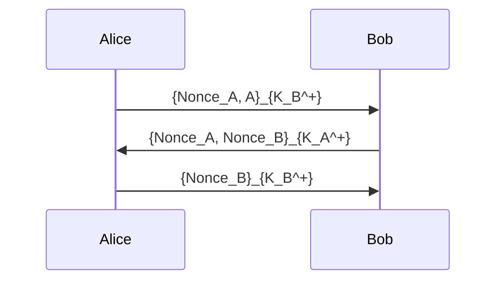
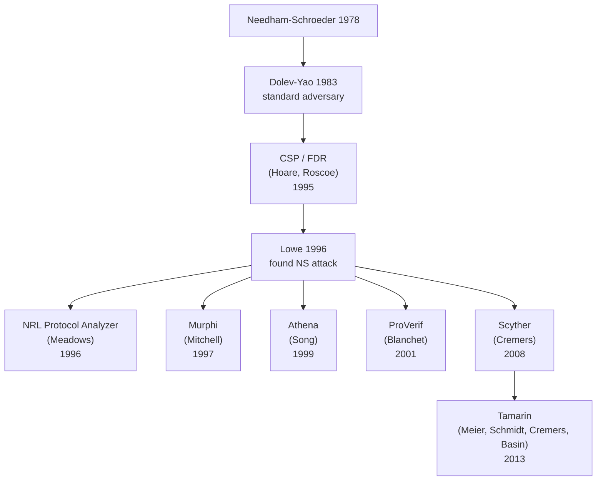
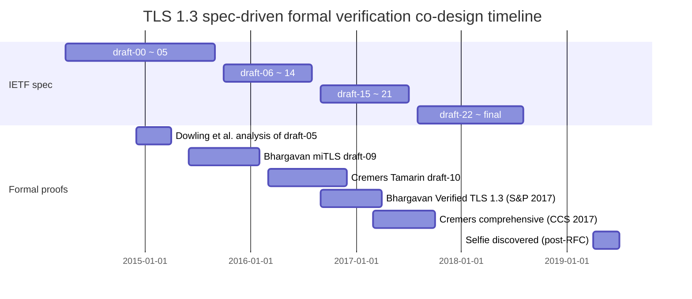

# 課堂 5.1 — 為什麼要形式化？Needham-Schroeder 17 年的教訓

## 學前知道
- 前置課：[Part 4 全部](../part-4-tls-quic/)（必懂 TLS 1.3 的 attack 史，本堂會反覆引用）
- 預計閱讀時間：**40 分鐘**
- 必讀論文：
  - Needham & Schroeder. *Using Encryption for Authentication in Large Networks of Computers*. CACM 1978 — 整個 authenticated key exchange 領域的起源
  - **Lowe**, G. *Breaking and Fixing the Needham-Schroeder Public-Key Protocol Using FDR*. TACAS 1996 — 17 年後找到 attack。precis: [`notes/papers/lowe-ns.md`](../../notes/papers/lowe-ns.md)
  - Bhargavan, Beurdouche, Naldurg et al. *Implementing TLS with verified cryptographic security*. S&P 2013, S&P 2014 系列 — TLS 1.2 的 implementation-level formal verification 起源
  - Cremers, Horvat, Hoyland, Scott, van der Merwe. *A Comprehensive Symbolic Analysis of TLS 1.3*. CCS 2017 — precis: [`notes/papers/cremers-tls13-symbolic.md`](../../notes/papers/cremers-tls13-symbolic.md)（Part 4.1 已建立）
- 必讀方法論：
  - Lamport. *Specifying Concurrent Systems with TLA+*. 1999 — TLA+ 設計動機
  - Blanchet. *Modeling and Verifying Security Protocols with the Applied Pi Calculus and ProVerif*. Foundations and Trends in Privacy and Security, 2016 — ProVerif 整套方法論

## 動機

Part 4 整段教 TLS 1.3 是「第一個 spec-driven formal verification co-design 的 IETF 協議」。**本堂課的目的是把「為什麼」拆透：**

> 沒有形式化驗證的協議，bug 的發現靠**機會**——通常等到產業已大規模部署、攻擊已造成損失，研究員才偶然發現。

我們用三條教訓開場：
1. **Needham-Schroeder 1978 → Lowe 1996**：一個被學界寫進教科書 17 年的協議，1996 才被人用 model checker 發現 man-in-the-middle 攻擊
2. **SSL/TLS 1.0–1.2 死亡史**（Part 4.1）：每個版本都被 paper 拆，連 1.0 (1999) 都還用 SSL 3.0 的設計慣性
3. **TLS 1.3 是 turning point**：draft-05 ~ draft-23 期間就跟 ProVerif / Tamarin / CryptoVerif 共同進化，**多輪 attack 在 spec finalize 前就被 tool 抓出來**

**對我們協議設計（Part 11）的意義**：spec-first + 同時提交 formal proof + verified implementation 是 PhD-level 標準，不是 optional bonus。

> **Failure framing**: formal verification 不是萬靈丹。**Selfie attack (Drucker-Gueron 2019, Part 4.1)** 顯示即使 TLS 1.3 經過多輪 formal verification 仍可能有 corner case；formal model 的 assumption 漏掉一條（PSK role binding），整個 proof 就有 gap。Formal methods 提供 **bound on the gap**，不是 zero。

---

## 核心概念

### 1. Needham-Schroeder 公鑰協議（1978 原版）

論文：Needham, Roger; Schroeder, Michael. *Using Encryption for Authentication in Large Networks of Computers*. CACM 21(12), 1978.

**設計目標**：Alice (A) 跟 Bob (B) 透過公開網路建立 mutual authentication + session key。

**前提**：雙方已知對方公鑰（$K_A^+$, $K_B^+$），各自持私鑰（$K_A^-$, $K_B^-$）。

**簡化版三步協議**（原版有 7 步含 KDC，這裡只取核心三步）：



**邏輯**：
1. Alice 生 nonce $N_A$，用 Bob 公鑰加密「$\{N_A, A\}$」送 Bob
2. Bob 解密拿到 $N_A$，生自己的 nonce $N_B$，用 Alice 公鑰加密「$\{N_A, N_B\}$」送 Alice
   - **Alice 看到回應含 $N_A$ → 確信對方是 Bob**（只有 Bob 能解 message 1）
3. Alice 用 Bob 公鑰加密 $\{N_B\}$ 送 Bob
   - **Bob 看到回應含 $N_B$ → 確信對方是 Alice**（只有 Alice 能解 message 2）

之後 $f(N_A, N_B)$ 作 session key。

**1978 論文認為**：在 Dolev-Yao adversary 模型下，這個協議滿足 mutual authentication。**業界相信、抄、寫進教科書**。

### 2. Lowe 1996 的反擊

論文：Lowe, Gavin. *Breaking and Fixing the Needham-Schroeder Public-Key Protocol Using FDR*. TACAS 1996.

Lowe 用 **FDR**（一個 CSP-based refinement checker）對 NS 協議做 mechanical analysis，**發現一個 17 年沒人看到的 MITM 攻擊**。

#### Lowe 的攻擊

兩個 honest agent: Alice 跟 Bob。攻擊者 Eve（intruder I）。Alice 主動發起跟 **Eve** 的握手，Eve 利用這個跟 Bob 偽裝為 Alice：

```mermaid
sequenceDiagram
    participant A as Alice
    participant I as Eve (intruder)
    participant B as Bob

    Note over A,B: Run α: A initiates with I; Run β: I impersonates A to B (interleaved)

    A->>I: α.1: {N_A, A}_{K_I^+}
    Note over I: Eve 解密拿 N_A
    I->>B: β.1: {N_A, A}_{K_B^+}  (重新加密給 Bob)
    Note over B: Bob 以為 Alice 主動找他
    B->>I: β.2: {N_A, N_B}_{K_A^+}  (Bob 回給 "Alice"=I)
    I->>A: α.2: {N_A, N_B}_{K_A^+}  (Eve 把 Bob 的 message 2 原封不動轉發給 Alice)
    Note over A: Alice 解開看到 N_A → 確信對方是 I (對！她以為自己跟 Eve 通話)
    A->>I: α.3: {N_B}_{K_I^+}
    Note over I: Eve 解密拿 N_B
    I->>B: β.3: {N_B}_{K_B^+}
    Note over B: Bob 看到 N_B → 確信對方是 Alice (錯! 其實是 Eve)
```

**攻擊結果**：
- Alice 跟 Eve 完成一次 handshake（合法 — Alice 知道她在跟 Eve 通話）
- Bob 認為自己跟 Alice 完成 handshake（被騙 — 實際是跟 Eve）
- Eve 知道 $f(N_A, N_B)$，**Bob 跟「Alice」之後的所有 session 流量 Eve 都能看 + 偽造**

#### Lowe 的修補

Lowe 提出 **NSL (Needham-Schroeder-Lowe)** 修正：把 **responder identity 加進 message 2**：

```
B → A: {N_A, N_B, B}_{K_A^+}
```

Alice 解 message 2 時檢查 **identity 欄位 == 她想要跟的 responder**。如果 Alice 主動找 Eve，但收到 message 含 identity = B（不是 I），她直接 abort。

**Lowe 用 FDR 在 NSL 上重跑 model checking 找不到 attack**，並證明 **「small system 沒 attack ⇒ arbitrary size 沒 attack」** 的 lemma（這是 protocol verification 的 well-formed-ness 結果）。

### 3. 為什麼這 17 年沒人發現？

幾個原因：
1. **人類腦力跟得上小型 protocol，跟不上 interleave**：Lowe 的 attack 是兩個 run interleave。人 reading spec 時自然分析「單一 run」 而非「多 run 並發」。
2. **「Authentication」沒形式化定義**：1978 年「Alice 確信對方是 Bob」是直覺概念。formal definition「after handshake, both parties agree on identity AND no third party can also commit to that session」要等 Lowe 自己 1997 才完整提出。
3. **沒有自動化工具**：FDR (Failures-Divergences Refinement) 1995 才成熟。在那之前 protocol analysis 靠手寫 inductive proof，慢且容易漏 case。
4. **Dolev-Yao 模型 1983 才提出**：在這之前甚至沒有 standard adversary model。

### 4. Lowe 1996 之後：工具鏈大爆發

NS attack 被發現後，整個 protocol verification 領域開始演化：



並行還有 **computational model** 路線：
- Bellare-Rogaway 1993：第一個 formal authenticated key exchange definition
- Canetti-Krawczyk 2001：universal composability framework
- **CryptoVerif**（Blanchet, 2008+）：在 computational model 自動證明

### 5. 第一條教訓：人類直覺 ≠ 形式化定義

NS 1978 寫的「mutual authentication」直覺上對。Lowe 用 FDR 形式化「agreement」屬性：

> **(Lowe 1997)** Protocol provides **injective agreement** on data $D$ for $A$ with $B$ iff：每次 $A$ 完成一個 run "with $B$" 並 commit 到 data $D$，**對應到 $B$ 有一個 run "with $A$" 也 commit 到 $D$**，且 $A$ 的 commit 不重複。

NS 1978 違反這條：A 完成 run "with $I$" commit 到 $N_A, N_B$；B 完成 run "with $A$" commit 到同樣 $N_A, N_B$ → 兩者 commit 對應的對端不一致。

**「形式化定義」的價值**：把模糊的「authentication」拆成 aliveness / weak agreement / non-injective agreement / injective agreement 四個 hierarchy，每層對 attack 的免疫度不同。沒有形式化定義就沒有「我這個協議 prove 了什麼」可說。

### 6. 第二條教訓：「我看了 spec 沒看到 bug」沒意義

人類 review spec 的能力 bounded。經驗 review：
- TLS 1.0 SPec 1999；BEAST 2011 才公開（**12 年**）
- TLS RSA-KE 1995；Bleichenbacher 1998 攻擊；ROBOT 2018（**20 年仍存活**）
- Heartbleed 是 RFC 6520 (2012)；2014 被發現（implementation bug，但 implementation 跟 spec ambiguity 互動）
- Selfie attack on TLS 1.3 PSK：spec 2018；attack 2019（**spec 漏掉 role binding assumption**）

**對我們的設計**：「我們自己 review 過好幾遍 spec 沒問題」**完全不是證據**。必須 mechanical verification。

### 7. 第三條教訓：TLS 1.3 是 turning point

Part 4.1 提過，這裡細看：



**關鍵**：每輪 draft 都有 paper 配套，每篇 paper 都對 spec 進言。**spec 改動 → formal model 更新 → 找到新 attack/gap → 回頭改 spec**。這個 loop 跑了 4 年。

**結果**：TLS 1.3 RFC 8446 是 spec 史上 paper 引用最多的協議之一（一個 RFC, 100+ 對應 paper）。

### 8. Formal verification 不是只給 PhD 看的

從 industry 採用視角:
- **AWS s2n-tls**：record layer formal model in F*/Coq
- **Cloudflare quiche**：spec compliance test 自動化
- **Project Everest**：TLS 1.3 record + HPKE in F* → 編譯到 C → OpenSSL/Mozilla NSS 採用 HACL\*
- **Apple**：MLS 部署前用 Tamarin proof
- **Signal**：Marlinspike + Cohn-Gordon 等對 X3DH + Double Ratchet 出 paper

但仍非主流：
- **WireGuard** 是 Donenfeld 個人專案，formal verification 是後續學者 (Donenfeld-Milner 2018, Lipp-Blanchet-Bhargavan 2019) 補上
- **Noise framework** 由 Trevor Perrin 設計，formal model 由 Kobeissi-Bhargavan-Blanchet 2019 (Noise Explorer) 補上

**模式**：通常設計者 set spec → 後人 verify → 設計者根據 verify 結果 patch。**TLS 1.3 是第一個從設計階段就 co-design 的**。

### 9. 對我們協議的方法論承諾

**Part 11 的方法論流程**:

```mermaid
flowchart LR
    T["威脅模型<br/>(Dolev-Yao + statistical)"] --> S["Spec<br/>(prose + ASN.1-style)"]
    S --> M["Formal model<br/>(ProVerif + Tamarin + TLA+)"]
    M --> P["Proofs<br/>(secrecy, auth, FS, PFS, anti-replay)"]
    P --> Iter["Iterate<br/>(找 gap → 修 spec → re-verify)"]
    Iter --> Final["Final spec + companion proof artifacts"]
    Final --> Impl["Implementation<br/>(Go fork of quic-go)"]
    Impl --> Test["Adversarial testing<br/>(對抗 Wu-FEP-style classifier)"]

    classDef ours fill:#fde,stroke:#c39;
    class T,S,M,P,Iter,Final,Impl,Test ours;
```



接下來 7 堂課（5.2–5.8）覆蓋這條 pipeline 的每一塊工具。

---

## 與我們協議設計的關聯

到此堂結束，**我們已對自己作出以下方法論承諾**：

1. **每個安全屬性都有 formal definition**：不允許 spec 內出現未定義的「authentication」「privacy」等模糊術語
2. **每個關鍵 invariant 有 mechanical proof**（ProVerif / Tamarin / TLA+ 至少一個）
3. **Spec 跟 formal model 共同 release**：同一個 git repo，同一個版本
4. **每次 spec 變動 trigger re-verification**
5. **Adversarial assumption 列為 spec 第一節**：清楚標明「我們 prove 了什麼 against 什麼 attacker」

這條 commitment 在 Part 11.10 跟 Part 12 全部執行。

---

## 動手（30 分鐘）

### 練習 A：手寫 NS 攻擊跡

不開工具，純紙筆：對著 NS 1978 原版三步協議，自己寫出 Lowe 1996 attack 的兩條 interleaved run。每一條 message 標明 plaintext / ciphertext-with-key / 攻擊者知道的 secret。

完成後查 Lowe 1996 paper Fig. 1，對你自己的 trace 是否完全一致。

### 練習 B：列你自己舊「協議草稿」的 implicit assumption

如果你過去寫過任何 "認證流程"（即使只是 web app 的 session cookie + CSRF token），把它寫成 message 序列。找出至少 3 個你隱含但沒寫的假設（例：「我假設 client 不會把 token 寫進 URL」、「我假設 cookie path 設對」）。

每個假設想：「如果 attacker 違反這個假設，會發生什麼？」

這個練習讓你體會 formal model 的價值——強迫 assumption 顯式化。

### 練習 C：讀 TLS 1.3 RFC 8446 附錄 D

RFC 8446 Appendix D「Compatibility Considerations」+ Appendix E「Backward Compatibility」全是「我們考慮過的 attack vectors」。每一段你都要能對應到 Part 4.1 列的某個歷史 attack。

### 練習 D：讀 Cremers et al. CCS 2017 的 Section 2

`notes/papers/cremers-tls13-symbolic.md` precis 引的 paper Section 2 列出 8 個 TLS 1.3 應該保證的安全屬性。每個用一句中文翻譯，並對著 Part 4.1-4.3 找對應「為什麼這條屬性需要」的歷史脈絡。

---

## 自我檢查

研究級題目：

1. **Lowe 攻擊裡 Alice 主動找 Eve 是合法的**（Alice 知道自己在跟 Eve 通話）。為什麼這條合法行為仍導致 Bob 被騙？描述「authentication 的非對稱性」這個 concept。
2. **如果 Alice 用 Eve 公鑰加密 message 1 時帶上 Bob 的 identity（而不是只有 Alice 的）會怎樣？** 這是 NSL fix 的反向版——能擋住 attack 嗎？
3. **Lowe 證明 「small system 沒 attack ⇒ arbitrary size 沒 attack」**。直覺上這個結果對任意 protocol 成立嗎？提示：考慮 stateful protocol with replay window。
4. **「Authentication」的 4 層 hierarchy** (Lowe 1997): aliveness / weak agreement / non-injective agreement / injective agreement。對應 TLS 1.3 提供哪一層？對應 Selfie attack 違反哪一層？
5. **如果 TLS 1.3 在 draft-05 就 finalize 不再改**，Cremers 2017 的 attack 會發生嗎？這個假設讓你怎麼看「formal verification 的價值」？

---

## 延伸閱讀

- Needham & Schroeder. *Using Encryption for Authentication in Large Networks of Computers*. CACM 1978
- Lowe. *Breaking and Fixing the Needham-Schroeder Public-Key Protocol Using FDR*. TACAS 1996
- Lowe. *A Hierarchy of Authentication Specifications*. CSFW 1997 — 4 層 authentication definition
- Burrows, Abadi, Needham. *A Logic of Authentication*. ACM TOCS 1990 — BAN logic, 第一個 protocol verification logic（但有局限）
- Meadows. *The NRL Protocol Analyzer: An Overview*. JLP 1996
- Mitchell, Mitchell, Stern. *Automated Analysis of Cryptographic Protocols Using Murphi*. S&P 1997
- Abadi & Fournet. *Mobile Values, New Names, and Secure Communication*. POPL 2001 — applied pi-calculus 起源
- Bhargavan et al. *Implementing TLS with Verified Cryptographic Security*. S&P 2013 — TLS 1.2 formal verification 起源
- Beurdouche et al. *A Messy State of the Union: Taming the Composite State Machines of TLS*. S&P 2015 (SMACK)
- Cremers et al. CCS 2017 — TLS 1.3 Tamarin

---

## 研究級補遺

### 1. 學界詞彙

| 口語 | 學界用詞 |
|---|---|
| 「形式化驗證」 | **Formal verification / formal analysis** |
| 「形式化模型」 | **Formal model**（symbolic / computational 兩大類） |
| 「對手能力」 | **Adversary capability / threat model** |
| 「攻擊」 | **Trace attack** (symbolic) / **Distinguishing advantage** (computational) |
| 「不變量」 | **Safety property** vs **Liveness property** (Lamport 1977 經典分類) |
| 「Lemma 證不出來」 | **Non-termination of proof search** |
| 「模型 over-approximate」 | **False positives in protocol analysis**（symbolic 常見） |
| 「FDR」 | **Failures-Divergences Refinement checker** |

### 2. 對手分類學

formal model 的 adversary 分類：

| 模型 | 抽象等級 | 適合工具 |
|---|---|---|
| **Dolev-Yao symbolic** | 攻擊者完全控制 wire，密碼學原語視 ideal | ProVerif, Tamarin, Scyther |
| **Computational** | 攻擊者 PPT，密碼學原語有 specific assumption | CryptoVerif, EasyCrypt |
| **Hybrid (UC, GNUC)** | universal composability 框架 | EasyCrypt, manual |
| **Side-channel-aware** | 加入 timing / cache / memory | ctgrind, manual + game-based |
| **Quantum** | quantum adversary | post-quantum proof, manual |

Part 5.4-5.6 是 Dolev-Yao；Part 5.7 是 computational。

### 3. 形式化定義

**Lowe's hierarchy of authentication**（CSFW 1997）：

對於 protocol $P$, agent $A$ 完成 a run "with $B$" commit to data $D$，定義 4 層：

1. **Aliveness**: 在過去某時 $B$ 至少完成過一次 protocol 的某個 run（不一定 with $A$，不一定 with $D$）
2. **Weak agreement**: $B$ 過去執行過 protocol 的某個 run "with $A$"（仍不限 data）
3. **Non-injective agreement**: $B$ 過去執行過 run "with $A$" commit to $D$
4. **Injective agreement**: 每個 $A$ commit 對應 distinct $B$ run（防 replay）

NS 1978 違反 Non-injective agreement（Bob commit "with Alice" but Alice 沒 commit "with Bob"）。
NSL fix 達 Injective agreement on $(N_A, N_B)$.

### 4. 領域的關鍵論文

| 引用 | 為何必追 | 之後在哪堂精讀 |
|---|---|---|
| Needham-Schroeder CACM 1978 | foundational | 本堂 |
| Dolev-Yao IEEE TIT 1983 | standard adversary model | 本堂 + 5.4 |
| Lowe TACAS 1996 | mechanized verification 起點 | 本堂 |
| Lowe CSFW 1997 | authentication hierarchy | 本堂 |
| Lamport 1999 TLA+ | spec language | 5.2 |
| Blanchet CSFW 2001 ProVerif | Horn clause-based | 5.4 |
| Meier-Schmidt-Cremers-Basin CAV 2013 Tamarin | multiset rewriting | 5.6 |
| Bhargavan et al. S&P 2013/2014 TLS impl | implementation-level | 5.7 |
| Cremers CCS 2017 TLS 1.3 | spec-driven co-design | 本堂 / 5.6 |
| Drucker-Gueron 2019 Selfie | proof gap 的反例 | 本堂 / 4.5 |

### 5. 我們協議的座標

到此堂方法論承諾：
- ✅ Spec 含 formal model
- ✅ Mechanical proof artifact
- ✅ Adversary 明確列出
- ✅ Iterate cycle
- ❓ Tool 選擇（next 7 堂決定）

### 6. 必追資源 / 社群入口

- **Awesome formal methods**: https://github.com/ligurio/awesome-formal-software-engineering
- **Tamarin tutorials**: https://tamarin-prover.com/manual/
- **ProVerif manual**: https://bblanche.gitlabpages.inria.fr/proverif/manual.pdf
- **TLA+ Examples**: https://github.com/tlaplus/Examples
- **F\* / Project Everest**: https://project-everest.github.io/
- **EasyCrypt**: https://www.easycrypt.info/

### 7. 開放問題

- **Formal verification of statistical traffic indistinguishability**：目前無 framework；symbolic 太 abstract，computational 太具體
- **Verified compilation from formal model to network bytes**：spec ⇒ implementation 的 trustworthy 鏈條仍 incomplete
- **Adaptive ML adversary 的 formal model**：未存在通用 framework
- **Quantum-resistant proof composition**：post-quantum 階段的 proof reuse 仍開放

---

> 下一堂（5.2）：TLA+ 入門。Lamport 的 specification language。State machine + temporal logic。用 TLA+ 建模一個 SOCKS5 握手。
