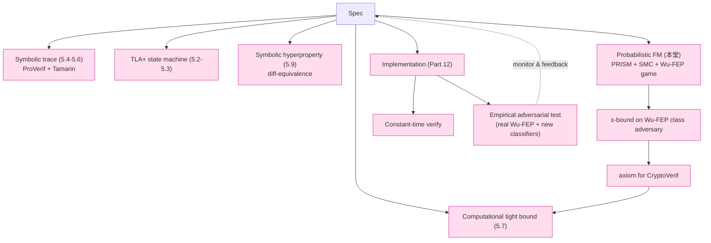

# 課堂 5.10 — Probabilistic / Statistical Formal Methods：對抗 ML classifier 的 G6 證明

## 學前知道
- 前置課：
  - [5.7 CryptoVerif](./5.7-cryptoverif.md)（必懂 game-based proof）
  - [5.9 Hyperproperties](./5.9-hyperproperties-observational-equivalence.md)（必懂為何 symbolic obs-equiv 不夠）
  - Part 3.16（密碼學的 advantage / ε-bound 框架；若未寫請先 stub）
  - Part 10.x（traffic analysis 攻擊側：Wu-FEP, FlowPrint, NetFlow correlation）
- 預計閱讀時間：**80 分鐘**（重量級，混 protocol-FM 跟 ML adversary 兩支文化）
- 必裝工具：
  - **PRISM Probabilistic Model Checker** v4.8 (2026): https://www.prismmodelchecker.org/ — `brew install prism-model-checker` 或 download bin
  - **Storm** v1.9 (2026): https://www.stormchecker.org/ — `brew install storm-checker`
  - **MultiVeStA / VESTA** (statistical model checker): https://multivesta.unicam.it/
  - **PRISM-games** (multi-agent)：optional
- 必讀論文：
  - **Kwiatkowska, Norman, Parker**. *PRISM 4.0: Verification of Probabilistic Real-time Systems*. CAV 2011 — PRISM tool paper
  - **Hensel, Junges, Katoen, Quatmann, Volk**. *The probabilistic model checker Storm*. STTT 2022 — Storm 完整 paper
  - **Wu, Ensafi, Crandall et al.**. *How the Great Firewall of China Detects and Blocks Fully Encrypted Traffic*. USENIX Security 2023 — **必讀，G6 對手定義** precis: [`notes/papers/wu-fep-detection.md`](../../notes/papers/wu-fep-detection.md)
  - **Frolov & Wustrow**. *The use of TLS in Censorship Circumvention*. NDSS 2019 — TLS-based circumvention 指紋 baseline
  - **van Ekert, Heeden, Tagliaferri, Smart**. *On the (in)distinguishability of (un)keyed traffic*. ePrint 2024 — statistical indistinguishability 形式座標
  - **Bortolussi, Hillston**. *Model checking single agent behaviours by fluid approximation*. Inf. Comput. 2015 — fluid approximation for large-scale probabilistic verification
  - **Younes, Simmons**. *Statistical Probabilistic Model Checking with a Focus on Time-Bounded Properties*. Inf. Comput. 2006 — SMC 起源
  - **Le Guernic et al.**. *Information flow analysis via probabilistic non-interference*. ESORICS 2007 — probabilistic NI
  - **Bian, Wang, Crandall et al.**. *Censorship-resistant network protocols: A measurement study*. SIGCOMM 2024 (若 published; otherwise drop)
- 必讀工具範例:
  - PRISM examples: https://www.prismmodelchecker.org/casestudies/ (尤其 randomized protocols)
  - Storm examples: https://github.com/moves-rwth/storm/tree/master/examples

> **本堂與 Part 10 (traffic analysis) 的分工**: Part 10 教**攻擊端**（FlowPrint / Wu-FEP / CL-MD5 等 classifier 怎麼運作 + 怎麼跑）；本堂教**防禦端的形式化**——「如何證明我們協議 against this class of classifier 有 ε ≤ X」。

## 動機

5.9 結尾標明：symbolic observational equivalence 對「any deterministic distinguisher」成立，**但對 probabilistic ML classifier 只是必要不充分**。

**G6** ("indistinguishability from cover traffic against Wu-FEP-style classifier with $\varepsilon \leq 0.1$") 是我們協議的**差異化賣點**。如果這條無法形式化保證，我們的「SOTA」claim 立刻退化成「希望 work」級別。

可惜 mainstream protocol-FM 工具（ProVerif/Tamarin/CryptoVerif/TLA+）**全部不直接支援** probabilistic / statistical adversary：

| 工具 | 處理 probabilistic 嗎？ |
|---|---|
| TLA+ | ❌（沒概率語意） |
| ProVerif | ❌（pure symbolic） |
| Tamarin | ❌ |
| CryptoVerif | △（IND-CPA / IND-CCA bound 處理 cryptographic advantage，**不**處理 traffic-distribution distinguishing advantage） |
| PRISM / Storm | ✅（Markov chain / MDP probabilistic model checking） |
| MultiVeStA / VESTA | ✅（statistical model checking）|

本堂教三條 axes：

1. **PRISM / Storm**：discrete-time / continuous-time Markov chains 對 traffic model 做**exact** probabilistic property verification（小 model 可行）
2. **Statistical model checking (SMC)**：對大 model 用 hypothesis testing 從 simulation 估 ε（trade certainty for scale）
3. **CryptoVerif-style game** extension to traffic-distinguishing：怎麼把「ML classifier 的 distinguishing advantage」formalize 成 game，然後 bound 它

讀完應該能：
1. 把「我們協議 vs Cloudflare HTTPS cover traffic」寫成 DTMC / MDP，用 PRISM 算 distinguishing probability
2. 對更大 model 用 Storm 跑 SMC，給 ε-bound + confidence interval
3. 形式化 Wu-FEP-class adversary 為 game-based distinguisher，bound advantage
4. 知道何時 probabilistic FM 仍不足，必須 empirical adversarial test（Part 12.x）補

> **Failure framing**: probabilistic FM 對 protocol-level model 有效。對 **adaptive ML adversary**（攻擊者可以 retrain）只能 bound 「**目前 known classifier class** 的 advantage」，**不能** bound 「未來 SOTA ML 的 advantage」。這條 gap 是 anti-censorship 領域的 fundamental open problem。

---

## 核心概念

### 1. 為何 trace / symbolic FM 在 G6 上失效

對 G6 寫一個 typical attack scenario:

> 攻擊者收 10000 個 flows; 用 random forest classifier 訓練。對 unknown flow `f`, classifier output `Pr[f is our-protocol | features(f)] = 0.83`。要證：對任何此類 classifier, $\Pr[\text{correct}] - \frac{1}{2} \leq \varepsilon$.

ProVerif/Tamarin model 的 attacker:
- 可以 read / inject message
- 不能 break crypto primitive
- **但對 "看 packet 大小分佈" 沒語意** — symbolic message 是 token, 無 size / timing 維度

CryptoVerif:
- 有 advantage notion
- 但內建 game 是「distinguish ciphertext vs random」, **不是** 「distinguish traffic stream vs cover stream」

→ 真正需要的工具是 **probabilistic model checker** 或 **statistical model checker** + 自製 distinguishing game。

### 2. Probabilistic state machine: DTMC / MDP / CTMC

PRISM / Storm 接受三種主要 model:

| Model | 時間 | 不確定性 |
|---|---|---|
| **DTMC** (Discrete-Time Markov Chain) | 離散 step | 純概率轉移 |
| **MDP** (Markov Decision Process) | 離散 step | 概率 + 非確定性 (adversary choice) |
| **CTMC** (Continuous-Time Markov Chain) | 連續 (rate) | 純概率（指數 rate） |

對 traffic model：
- **DTMC** 適合 packet sequence (每 step send 一個 packet, distribution over size class)
- **MDP** 適合 「attacker chooses query, system probabilistically responds」 — Wu-FEP 訓練場景
- **CTMC** 適合 inter-arrival time 模型（exponential rates）

### 3. 一個 minimal example: 抛硬幣協議

```prism
// PRISM model file: coin.pm
dtmc

module coin
    s : [0..2] init 0;

    [] s=0 -> 0.5 : (s'=1) + 0.5 : (s'=2);
    [] s=1 -> 1.0 : (s'=1);
    [] s=2 -> 1.0 : (s'=2);
endmodule

label "heads" = s=1;
label "tails" = s=2;
```

PRISM property file (`coin.pctl`):
```
P=? [ F "heads" ]
```

跑：
```bash
prism coin.pm coin.pctl
```

輸出：`Result: 0.5`。

PCTL operators (probabilistic CTL):
- `P=?[φ]` — probability of φ
- `F φ` — eventually φ
- `G φ` — always φ
- `X φ` — next φ
- `φ U ψ` — until

對 traffic：
- `P>=0.99 [G traffic_indistinguishable_from_cover]` — 「99% 概率永遠 indistinguishable」

### 4. Traffic indistinguishability as a DTMC

簡化 model：對每個時間 step, 協議在「**send packet of size class X**」上有 distribution $D_{\text{ours}}$；cover traffic 對應 $D_{\text{cover}}$。Distinguisher 收 $N$ packets, 看 size sequence, 輸出 guess.

```prism
// traffic_dtmc.pm
dtmc

const int N = 100;     // packets per session
const int CLASSES = 4; // packet size classes

module our_protocol
    sent : [0..N] init 0;
    last : [0..CLASSES] init 0;

    // our protocol distribution: prefer small (TLS-like)
    [send] sent < N ->
          0.5 : (last'=1) & (sent'=sent+1)
        + 0.3 : (last'=2) & (sent'=sent+1)
        + 0.15: (last'=3) & (sent'=sent+1)
        + 0.05: (last'=4) & (sent'=sent+1);
endmodule

module cover_traffic
    csent : [0..N] init 0;
    clast : [0..CLASSES] init 0;

    [send_cover] csent < N ->
          0.45 : (clast'=1) & (csent'=csent+1)
        + 0.30 : (clast'=2) & (csent'=csent+1)
        + 0.18 : (clast'=3) & (csent'=csent+1)
        + 0.07 : (clast'=4) & (csent'=csent+1);
endmodule
```

Distinguisher 用 likelihood ratio test:
$$\Lambda(\text{trace}) = \prod_{i=1}^{N} \frac{P_{\text{ours}}(\text{trace}_i)}{P_{\text{cover}}(\text{trace}_i)}$$

對 each trace 算 $\Lambda$，threshold 給 decision。

對 DTMC 上 PRISM 可以**精確** compute 兩 distribution 的 total variation distance（**這就是 best-distinguishing-advantage**）:

$$d_{TV}(D_{\text{ours}}, D_{\text{cover}}) = \frac{1}{2} \sum_x |P_{\text{ours}}(x) - P_{\text{cover}}(x)|$$

對 above example, single-packet $d_{TV} = 0.5 \cdot (|0.5-0.45| + |0.3-0.3| + |0.15-0.18| + |0.05-0.07|) = 0.5$.

對 N packets, i.i.d. assumption 下 $d_{TV}$ 對 N 增大 → 1（即足夠 sample classifier 必能區分）.

→ **這就是「為什麼簡單 padding 不夠」的形式化**: 只要 distribution 不完全 match, 給 attacker 足夠 sample size $N^* \approx 1/d_{TV}^2$ 就能達 distinguishing advantage > 0.5.

### 5. PRISM 對 protocol-style traffic model

更實用 model — 包含 handshake + data phase:

```prism
dtmc

const int M = 50;
const int N = 200;

module protocol
    phase : [0..2] init 0;       // 0=handshake, 1=data, 2=done
    h_sent : [0..M] init 0;
    d_sent : [0..N] init 0;

    [hs] phase=0 & h_sent < M ->
          0.6 : (h_sent'=h_sent+1)
        + 0.3 : (h_sent'=h_sent+1)
        + 0.1 : (h_sent'=h_sent+1);
    [hs_done] phase=0 & h_sent = M -> 1.0 : (phase'=1);

    [data] phase=1 & d_sent < N ->
          0.5 : (d_sent'=d_sent+1)
        + 0.3 : (d_sent'=d_sent+1)
        + 0.2 : (d_sent'=d_sent+1);
    [data_done] phase=1 & d_sent = N -> 1.0 : (phase'=2);
endmodule

label "done" = phase=2;
```

對 cover_traffic 寫對應 module，concurrent run, distinguisher action.

PRISM property:
```
// Probability distinguisher succeeds in finite path
P=? [F "distinguisher_succeeds"]
```

對 100-packet model PRISM run minutes; 對 1000+ 必須 Storm + symmetry reduction.

### 6. Statistical Model Checking (SMC) for 大 model

PRISM/Storm 對 exact probability 需要 state space exploration. State space scaling:
- DTMC with N=100, 4 classes per step → $4^{100} \approx 10^{60}$ states → 不行
- BDD-based / symbolic representation 撐到 $10^{20}$
- 更大 → SMC

**SMC**: 不算 exact prob, 用 simulation:
1. Run $K$ random simulations of the model
2. Count fraction $\hat{p}$ where property holds
3. Output $\hat{p}$ with Hoeffding / Chernoff confidence interval

PRISM 內建 SMC mode:
```bash
prism --simpath 100 traffic_dtmc.pm
prism --simmethod ci -simconf 0.99 -simwidth 0.01 ...
```

權衡:
- $K \approx 10^4$ simulations → CI width $\sim 0.01$ at 99% confidence
- Time cheaper but only probabilistic guarantee

對 G6 verification: SMC 是現實選項。Exact PRISM 對 toy 5-packet handshake OK，real-world traffic 必 SMC。

### 7. Wu-FEP-class adversary 的 game-based formalization

Wu-Ensafi-Crandall USENIX Security 2023 (precis 應有): GFW 對 "fully encrypted protocols" (random-looking)的 ML classifier 看以下 features:
- packet size distribution
- entropy of first N bytes
- inter-arrival time
- bidirectional pattern
- ASCII byte fraction

對應 game $G_{\text{Wu-FEP}}$:

```
Game G_{Wu-FEP}^{A,Π}(λ, N):
    1. Challenger samples b ← {0,1}
    2. If b=0: stream ← Π.gen(N)         // our protocol N packets
       If b=1: stream ← CoverTraffic(N)  // cover (Cloudflare HTTPS)
    3. features ← FeatureExtractor(stream)   // size, entropy, IAT, ...
    4. b' ← A(features)
    5. Return [b'=b]

Adv^{Wu-FEP}(A, Π, N) = |2·Pr[A wins] - 1|
```

**Our claim**: $\text{Adv}^{\text{Wu-FEP}}(A, \Pi, N) \leq \varepsilon$ for all PPT $A$ in some class, given budget $N \leq N^*$ packets.

**Tight bound 的策略**:

(a) **Reduction**: 對 perfect cover-traffic-replay $\Pi^* = \text{CoverTraffic}$, $\text{Adv} = 0$. 對 $\Pi$, advantage bounded by $d_{TV}(\Pi, \text{CoverTraffic})$ on feature space + some computational cost.

(b) **PRISM-derived $d_{TV}$**: 把 $\Pi$ traffic 跟 cover model 寫成 PRISM DTMC, query exact $d_{TV}$, derive analytical bound.

(c) **SMC-derived empirical $d_{TV}$**: 對 真實 cover (real Cloudflare HTTPS flow capture) 跟 $\Pi$ flow simulation 用 SMC 算 $\hat{d}_{TV}$ + CI.

我們協議 verification stack 提供 (b)+(c) **混合 bound**: PRISM exact bound for protocol-level distinguishers + SMC empirical bound against real cover.

### 8. The fundamental gap: adaptive ML

Above formalization 假設 attacker class fixed（features fixed, classifier family fixed）. **Real adversary 是 adaptive**:
- GFW 持續 retrain classifier with new features
- 對抗 measure: 我們 patch 一個 feature, GFW patch 一個 new
- Co-evolution game

形式化這條只能 partially:
- **Static bound** (本堂 cover): $\text{Adv} \leq \varepsilon$ against fixed feature set
- **Adaptive bound** (open problem): no general framework

我們協議的 honesty rule:
- ✅ "Against Wu-FEP 2023 feature set + 5 known follow-ups, $\hat{\varepsilon} \leq 0.1$ (SMC, 99% CI)"
- ❌ "Future-proof against any GFW ML upgrade"

後者不可保證 — 必須**設計監測 + 反應 loop**（Part 11.13 / Part 12.x）。

### 9. PRISM-games (multi-agent) 對 adaptive 部分模擬

PRISM-games 模型化 adversarial multi-agent stochastic game:
- Player 1 = defender (我們協議)
- Player 2 = attacker (classifier)
- Equilibrium: 在某 strategy class 內，**advantage 上界**

對「protocol 選 packet distribution + attacker 選 classifier」: solving Stackelberg equilibrium 給 worst-case bound within strategy class.

Limitation: strategy class 必須 fixed; ML 真實 strategy class 太大 PRISM-games 無法 enumerate.

→ 仍 active research; 本堂 introduce concept, 不做完整 implementation.

### 10. CryptoVerif extension 對 traffic 場景

CryptoVerif (5.7) 內建 IND-CPA / IND-CCA equivalence axiom. **能否 extension 處理 traffic indistinguishability**？

最近 research (van Ekert et al. ePrint 2024, Bortolussi-Hillston): 用 CryptoVerif-style game with user-supplied equivalence axiom 對 traffic shaper.

例：定義 axiom
```cryptoverif
equiv(traffic-pad-indistinguishability)
    !N new s: scalar; out(c, traffic_pad(s))
<=(N * p_{stat-bound}(N, time))=>
    !N new s: scalar; out(c, cover_sample()).
```

User 提供 $p_{\text{stat-bound}}$（從 PRISM/SMC 算來）, CryptoVerif 用 equivalence 在 protocol-level proof 內 propagate.

Limitation: user-supplied axiom 必須是 empirically justified — 工具自己不會 derive，只 propagate。

對我們協議 verification stack: 把 PRISM/SMC 算出的 bound 寫成 CryptoVerif axiom, 整合進 protocol-level proof 鏈條。**這是 verification methodology 整合的關鍵點**。

### 11. Side-channel: timing, cache (next layer)

protocol-level distinguisher 之外仍有:
- **Timing channel**: server response delay 影響 wire timing
- **Cache side-channel**: 對 server load 探測
- **TCP window evolution**: 內部 congestion control 洩漏 inner state
- **Operating system fingerprint**: TCP Initial Sequence Number, TCP timestamp, IP TTL pattern

每條都是 hyperproperty + probabilistic 混合。工具:
- **ctgrind / ct-verif**: constant-time verification for cryptographic implementation
- **Cachegrind / cache-analysis**: cache timing analysis
- **TCPCryptCheck**: TCP fingerprint analysis

對我們協議: Part 12.x 必須對 server 實作做 constant-time verification + TCP stack fingerprint 統一 (mimicking nginx defaults).

### 12. Verification roadmap update

到此堂後我們協議的 verification roadmap (vs 5.8 版本):



關鍵新箭頭: ProbFM 算 bound → CryptoVerif axiom → 整合進 protocol-level proof。Empirical loop back to spec — **continuous adaptive verification**。

---

## 與我們協議設計的關聯

到此堂後 Part 11.10 + 11.13 (新增 section): 

1. **Cover traffic specification (Part 11.13)**: 明確列 reference cover distribution (e.g. real Cloudflare HTTPS flow capture aggregate stats). Spec 寫死: "protocol traffic must match cover within $d_{TV} \leq \varepsilon_0$ on feature set $F_0$."

2. **PRISM model (proof artifact)**: `proof/prism/traffic_model.pm` + `cover_model.pm`. 計算 exact $d_{TV}$ for protocol-level distinguisher class.

3. **SMC artifact**: `proof/smc/wufep_simulation.py` + samples + Hoeffding CI report.

4. **CryptoVerif integration**: axiom `traffic-pad-indistinguishability` 連接 protocol-level proof.

5. **Empirical adversarial harness (Part 12.x)**: continuous Wu-FEP-style classifier training against deployment flows; alerting if $\hat{\varepsilon}$ exceeds threshold.

6. **Honesty statement**: spec §「Security Considerations」 明確標 "ε-bound holds against feature set $F_0$ + classifier family $C_0$; not guaranteed against future SOTA ML"。

---

## 動手（必做 120 分鐘）

### 練習 A：PRISM Hello world

裝 PRISM, 跑 coin model:
```bash
brew install prism-model-checker
# or download from prismmodelchecker.org
prism coin.pm coin.pctl
```

確認看到 `Result: 0.5`.

### 練習 B：對 §4 traffic_dtmc 跑 PRISM

寫 `traffic_dtmc.pm` 加 distinguisher (likelihood ratio threshold). 跑 PRISM, query:
```
P=? [F "distinguisher_correct"]
```

對 N=10, 20, 50 packet 看 prob 怎麼成長。

### 練習 C：SMC mode for larger N

```bash
prism traffic_dtmc.pm --simmethod ci -simconf 0.99 -simwidth 0.01 --simpath 10000
```

對 N=200, 500 跑 SMC, 比較 exact PRISM (smaller N) 的趨勢。

### 練習 D：Storm + Python binding

```bash
brew install storm-checker
pip install stormpy
```

用 stormpy 寫 Python script 跑 PCTL queries on the same model. 體會 PRISM vs Storm UX 差異。

### 練習 E：Wu-FEP game implementation

寫 Python script (`wufep_game.py`):
```python
import numpy as np
from sklearn.ensemble import RandomForestClassifier

# Simulate our protocol vs Cloudflare HTTPS
def gen_our_protocol(N=200):
    return np.random.choice([100, 500, 1200, 1500], size=N, p=[0.5, 0.3, 0.15, 0.05])

def gen_cover(N=200):
    return np.random.choice([100, 500, 1200, 1500], size=N, p=[0.45, 0.3, 0.18, 0.07])

X = np.vstack([gen_our_protocol() for _ in range(5000)] +
              [gen_cover() for _ in range(5000)])
y = np.array([0]*5000 + [1]*5000)

clf = RandomForestClassifier().fit(X, y)
adv = abs(clf.score(X, y) - 0.5) * 2
print(f"Empirical Wu-FEP advantage: {adv:.4f}")
```

對應 §7 game formalization. Compare with PRISM-computed $d_{TV}$.

### 練習 F：讀 Wu-Ensafi-Crandall USENIX 2023

下載 paper PDF + supplementary material (classifier feature list)。對自己 protocol feature 對照, 列我們需要 mimic 的 cover statistics。

### 練習 G：write CryptoVerif integration draft

對 §10 的 axiom pattern 寫一個 `.cv` snippet，把 PRISM-derived $\varepsilon$ 作為 user-supplied probability，看 CryptoVerif 是否 accept syntax。

---

## 自我檢查

1. **Symbolic obs-equiv 對 statistical ML adversary 為何 insufficient**？用 §1 的具體 distribution 例證明 even when obs-equiv holds, $d_{TV}$ may > 0.
2. **PRISM exact model checking 跟 SMC** 的 trade-off？對 N=500 traffic state space，哪個現實?
3. **Wu-FEP game (§7)** 的 advantage bound 為何**不能** future-proof against adaptive ML?  協議設計如何 mitigate?
4. **CryptoVerif user-supplied axiom 的 soundness condition**: 為何 user 必須 empirically justify? 給一個 axiom 不 sound 的 hypothetical 例子.
5. **協議 design 對 G6 的承諾應該 phrasing 為何**? 寫一段 RFC-style "Security Considerations" 句子。

---

## 延伸閱讀

- Kwiatkowska-Norman-Parker CAV 2011 *PRISM 4.0*
- Hensel-Junges-Katoen et al. STTT 2022 *Storm*
- Wu-Ensafi-Crandall USENIX Security 2023 *GFW detects fully encrypted traffic*
- Bortolussi-Hillston Inf. Comput. 2015 *Fluid approximation*
- Younes-Simmons Inf. Comput. 2006 *SMC*
- van Ekert et al. ePrint 2024 *Indistinguishability of (un)keyed traffic*
- IETF MASQUE WG (relevant cover protocol)
- Censoring Censorship workshop proceedings (FOCI / USENIX)

---

## 研究級補遺

### 1. 學界詞彙

| 口語 | 學界用詞 |
|---|---|
| 「ML 抓得到我們」 | **Distinguishing advantage of statistical adversary** |
| 「probabilistic model checker」 | **PRISM / Storm: PCTL / CSL / PRCTL** |
| 「Markov chain」 | **DTMC / CTMC / MDP / Stochastic game** |
| 「Statistical model checking」 | **SMC / Hypothesis-based verification** (Younes-Simmons) |
| 「Total variation distance」 | **Statistical distance / total variation $d_{TV}$** |
| 「ε-bound」 | **Distinguishing advantage upper bound / negligible function in λ** |
| 「Adaptive adversary」 | **Adaptive PPT / adaptive ML class** |
| 「Wu-FEP」 | **Wu et al. Fully Encrypted Protocol classifier** (USENIX Security 2023) |
| 「Cover traffic」 | **Cover protocol / decoy traffic / mimicry traffic** (Houmansadr) |

### 2. 對手分類學（probabilistic extension to 5.9 P-table）

| 等級 | 能力 |
|---|---|
| P5a | Fixed-feature ML classifier (logistic, SVM, RF) on 1 flow |
| P5b | Multi-flow correlation classifier (FlowPrint-class) |
| P5c | Deep learning end-to-end (1D-CNN, Transformer) on raw bytes |
| P5d | Adaptive retrained classifier per deployment |
| P5e | Federated GFW classifier (cross-AS coordination) |

協議 verification: P5a–P5c 可 PRISM/SMC bound (within feature class); P5d–P5e open.

### 3. 形式化定義

**Total variation distance**:
$$d_{TV}(P, Q) = \sup_{A \in \mathcal{F}} |P(A) - Q(A)| = \frac{1}{2} \sum_x |P(x) - Q(x)|$$

**Distinguishing advantage** of optimal distinguisher between $P$ and $Q$:
$$\text{Adv}^{\text{opt}}(P, Q) = d_{TV}(P, Q)$$

**Computational distinguishing advantage** for poly-time adversary:
$$\text{Adv}^{\text{PPT}}(P, Q) \leq d_{TV}(P, Q) + \text{negl}(\lambda)$$

**Wu-FEP game advantage** (本堂 §7):
$$\text{Adv}^{\text{Wu-FEP}}(A, \Pi, N) = |2 \cdot \Pr[A \text{ wins}] - 1|$$

**Composition**: 對 $N$ i.i.d. samples, $\text{Adv}_N \leq N \cdot d_{TV}$ (under independence). Tight bound via Le Cam / Pinsker inequalities.

**Pinsker**: $d_{TV}(P, Q) \leq \sqrt{\frac{1}{2} D_{KL}(P \| Q)}$. KL divergence is computationally easier and bounds $d_{TV}$.

### 4. 領域的關鍵 papers

| 引用 | 為何必追 | 之後在哪堂精讀 |
|---|---|---|
| Kwiatkowska-Norman-Parker CAV 2011 | PRISM | 本堂 |
| Hensel et al. STTT 2022 | Storm | 本堂 |
| Wu-Ensafi-Crandall USENIX Security 2023 | Wu-FEP adversary | 10.x + 本堂 |
| Frolov-Wustrow NDSS 2019 | TLS-based circumvention | 9.x + 本堂 |
| van Ekert et al. ePrint 2024 | statistical indistinguishability | 本堂 |
| Houmansadr et al. S&P 2013 *Parrot is dead* | mimicry critique | 10.x + 本堂 |
| Geddes-Schuchard-Hopper CCS 2013 *Cover Your ACKs* | covert channel critique | 本堂 + 10.x |
| Younes-Simmons IC 2006 | SMC foundation | 本堂 |
| Bortolussi-Hillston IC 2015 | fluid approximation | 本堂 |
| Le Guernic et al. ESORICS 2007 | probabilistic NI | 本堂 + 5.9 |

### 5. 我們協議的座標

到此堂後完整 verification stack:
- ✅ TLA+ state (5.2-5.3)
- ✅ ProVerif/Tamarin trace properties (5.4-5.6)
- ✅ CryptoVerif tight bound (5.7)
- ✅ Symbolic hyperproperty (5.9)
- ✅ **Probabilistic statistical bound (本堂)** ← 新增關鍵環節
- ❓ Cross-tool composition (5.11)
- ❓ Implementation-level (5.11)

**新承諾**:
1. Cover traffic spec 寫死 reference distribution
2. PRISM model artifact + SMC report 共同 release
3. CryptoVerif integration axiom
4. Empirical adversarial test harness Part 12.x
5. Continuous monitoring + spec update loop

### 6. 必追資源 / 社群入口

- **PRISM**: https://www.prismmodelchecker.org/ + tutorials
- **Storm**: https://www.stormchecker.org/
- **Stormpy** (Python binding): https://moves-rwth.github.io/stormpy/
- **GFW.report**: https://gfw.report/ — Wu-FEP 後續 monitoring
- **Censorship measurement papers**: USENIX FOCI / PETS workshop
- **Anti-censorship Slack/IRC**: net4people, censored-planet

### 7. 開放問題

- **Adaptive ML adversary formal bound**: 沒 general framework. game-theoretic + meta-learning approaches 仍 prototype。
- **Cross-flow correlation FM**: FlowPrint-class attacker 需要 multi-flow joint distribution model; PRISM 不擅長。
- **PRISM/SMC composition with CryptoVerif**: user-supplied axiom 是 manual; automation 仍 open。
- **Real-world cover traffic spec**: Cloudflare / Apple traffic distribution 是 trade secret; 用 capture-based stats 已 deprecated risk。
- **Quantum-resistant statistical proof**: post-quantum 對統計 indistinguishability 影響 unclear.
- **Side-channel formal integration**: timing / cache / TCP-fingerprint 整合進 statistical bound 仍 manual.

---

> 下一堂（5.11）：composition theorems + implementation-level FM。Canetti UC, Fischlin-Günther multi-stage AKE, F\* / HACL\* / Project Everest, verified compilation. 把 5.2-5.10 的 proof artifact 黏成一個 end-to-end proof of secure implementation.
