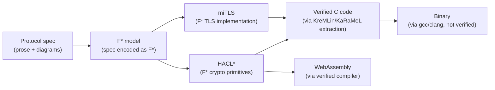
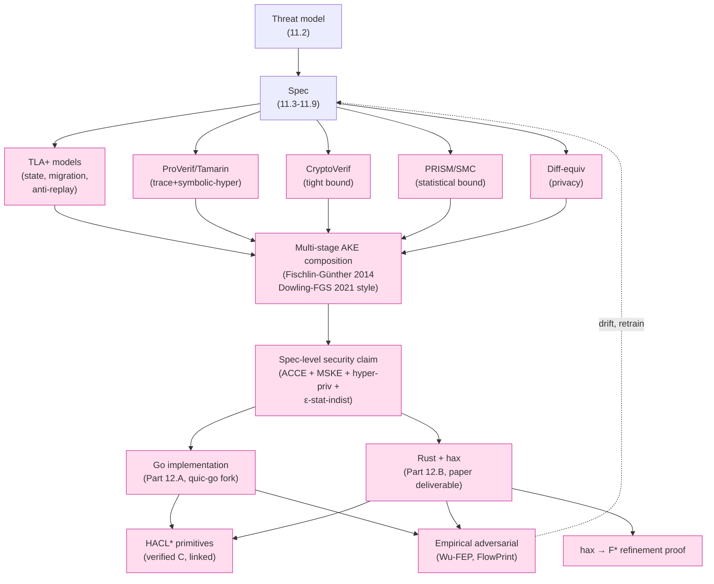

# 課堂 5.11 — Composition + Implementation-level FM：把 proof 黏成 verified bytes

## 學前知道
- 前置課：5.1–5.10 全部
- 預計閱讀時間：**80 分鐘**（capstone-level，把整個 Part 5 黏起來）
- 必裝工具（不必全裝；列出讓你知道生態）:
  - **F\***: https://www.fstar-lang.org/ — `brew install fstar` 或 docker
  - **HACL\***: https://github.com/hacl-star/hacl-star — F\* 寫的 verified crypto lib, 生成 C / Rust 用
  - **Coq / Rocq Prover**: https://coq.inria.fr/ + Coq 8.20 → 改名 Rocq Prover (2024+)
  - **Lean 4**: https://leanprover.github.io/
  - **Isabelle/HOL**: https://isabelle.in.tum.de/
  - **EasyCrypt**: https://www.easycrypt.info/
  - **TLAPS**: TLA+ proof system
  - **Cryspen / hax**: Rust → F\* / Coq translation
- 必讀論文：
  - **Canetti**. *Universally Composable Security: A New Paradigm for Cryptographic Protocols*. FOCS 2001 + journal 2020 — UC framework 起源
  - **Canetti, Krawczyk**. *Universally Composable Notions of Key Exchange and Secure Channels*. EUROCRYPT 2002 — UC key exchange
  - **Fischlin, Günther**. *Multi-Stage Key Exchange and the Case of Google's QUIC Protocol*. CCS 2014 — multi-stage AKE composition
  - **Dowling, Fischlin, Günther, Stebila**. *A Cryptographic Analysis of the TLS 1.3 Handshake Protocol*. JCS 2021 — TLS 1.3 multi-stage analysis, paper of record
  - **Brzuska, Fischlin, Smart, Warinschi, Williams**. *Less is More: Relaxed yet Composable Security Notions for Key Exchange*. IJIS 2013 — alternative to UC composition
  - **Bhargavan et al.**. *Everest: Towards a Verified, Drop-in Replacement of HTTPS*. SNAPL 2017 — full vision
  - **Protzenko, Beurdouche, Merigoux, Bhargavan**. *Formally Verified Cryptographic Web Applications in WebAssembly*. S&P 2019 — HACL\* → WebAssembly
  - **Polubelova, Bhargavan, Protzenko et al.**. *HACLxN: Verified Generic SIMD Crypto*. CCS 2020 — HACL\* SIMD verified
  - **Cremers, Düzlü, Fiedler, Fischlin, Janson**. *BUFFing signature schemes beyond unforgeability and the case of post-quantum signatures*. S&P 2021 — PQC signature composition
  - **Stebila, Mosca**. *Post-quantum key exchange for the Internet and the Open Quantum Safe project*. SAC 2016 — OQS overview
  - **Bos, Stebila et al.**. *Hybrid key encapsulation mechanisms and authenticated key exchange*. PQCrypto 2020 — hybrid KEM composition
  - **Schwabe, Stebila, Wiggers**. *Post-quantum TLS without handshake signatures*. CCS 2020 (KEMTLS) — PQC handshake redesign
- 必讀規格 / 範例:
  - HACL\* source: ChaCha20, Poly1305, Curve25519, Ed25519, SHA-2, HKDF
  - F\* miTLS spec
  - Project Everest end-to-end demo: https://project-everest.github.io/
  - Open Quantum Safe (liboqs): https://openquantumsafe.org/
  - X-Wing hybrid KEM: https://github.com/dconnolly/draft-connolly-cfrg-xwing-kem

## 動機

5.1–5.10 教你 6 個 verification 工具:
- TLA+, ProVerif, Tamarin, CryptoVerif, PRISM/Storm, HyperLTL/diff-equiv

每個工具給你一**塊** assurance:
- TLA+: state machine safety / liveness
- ProVerif/Tamarin: symbolic trace properties (secrecy, auth)
- CryptoVerif: computational tight bound on key indistinguishability
- PRISM/SMC: statistical bound against ML adversary
- ProVerif/Tamarin diff-equiv: symbolic hyperproperty

**問題**: 這 6 塊 assurance 是 **不同 model、不同 adversary、不同語法**。如何聲稱「整個協議是 secure」？

兩條路徑:
1. **Composition theorem** (e.g. Canetti UC, Fischlin-Günther multi-stage AKE): 形式化證明 "若 sub-protocols 各自 secure (within model)，則 composition secure (within composed model)"
2. **Verified implementation chain** (F\* / HACL\* / Project Everest 路線): spec → F\* → verified C → executed binary, 每個 link 有 mechanical proof

本堂教兩條 + 把它們合進**我們協議的 end-to-end verification roadmap**。

額外:
3. **Post-quantum hybrid** verification: hybrid KEM composition + classical signature 改 KEMTLS 之類, 這條對 2027-2028 ship 的協議 mandatory

讀完應該能：
1. 用一句話解釋 Canetti UC framework 的核心 idea
2. 對 multi-stage AKE 寫 composition lemma sketch (Fischlin-Günther style)
3. 知道 F\* / HACL\* / Project Everest 的分工，並能對應 crypto primitive 找 HACL\* 中的 verified C 來源
4. 對 PQC hybrid handshake (X-Wing / KEMTLS) 寫 Tamarin model 的 composition sketch
5. 對我們協議 verification stack 寫完整 end-to-end claim chain, 標明每個 link 的 strength + caveat

> **Failure framing**: composition theorem 是「sufficient condition」proof — meeting 它 ⇒ composed secure；不 meeting **不代表** insecure (可能仍 secure but 用其他 framework 才能證). UC 是 strongest 但 most restrictive. **實務上 protocol verification 常採 weaker composition (e.g. Brzuska-Fischlin-Smart "Less is More"), trading strict guarantees for tractable proofs.**

---

## 核心概念

### 1. 為什麼 composition 重要

設想我們協議 verification stack output:
- TLA+ proves: transport state machine safe ✅
- ProVerif proves: handshake secrecy + auth ✅
- Tamarin proves: handshake DH + multi-stage ✅
- CryptoVerif proves: record layer IND-CCA $\varepsilon_{rec}$ ✅
- PRISM proves: traffic vs cover $d_{TV} \leq \varepsilon_{stat}$ ✅
- Diff-equiv proves: inner SNI privacy ✅

問題: **沒有 single theorem** says 「整個 protocol secure」.

具體 issues:
- TLA+ 假設 attacker 不破密碼學; ProVerif 假設 attacker 不破 state machine — **inconsistent attacker models**
- CryptoVerif advantage $\varepsilon_{rec}$ + Tamarin handshake secrecy — **how to combine to "channel secure"?**
- Multi-stage keys (Initial / Handshake / Application) — Tamarin 證每個 stage key secret，**但 stage 之間 key independence 是 separate property**

→ 需要 composition framework。

### 2. Canetti UC framework: strongest composition guarantee

**Universal Composability (UC)** (Canetti FOCS 2001): a definitional framework where **secure realization of an ideal functionality composes universally**.

核心 idea:
- 定義 **ideal functionality** $\mathcal{F}$ — abstract "what the protocol should do" (e.g. secure channel: takes plaintext, outputs plaintext at the other end, leaks only length to attacker)
- 協議 $\pi$ **UC-realizes** $\mathcal{F}$ iff $\forall$ adversary $A$ for $\pi$, $\exists$ simulator $S$ for $\mathcal{F}$ such that **environment $\mathcal{Z}$ cannot distinguish** $(\pi, A)$ from $(\mathcal{F}, S)$.
- **UC theorem**: if $\pi$ UC-realizes $\mathcal{F}$, then any larger protocol using $\pi$ as a subroutine 跟 using $\mathcal{F}$ directly 等價 (in security sense).

對協議設計意義：
- 對 handshake 證 UC-realize "ideal AKE functionality"
- 對 record 證 UC-realize "secure channel functionality"
- 對 transport 證 UC-realize "ideal byte-stream"
- **Composition** 自動成立：full protocol UC-realizes "ideal communication"

Cost:
- UC definitions **very restrictive** — many "secure" protocols don't meet UC
- Simulator 要 efficient — 不容易 construct
- UC framework 有 setup assumption (CRS / random oracle / trusted party) — TLS 1.3 不滿足 CRS 假設, 只 partial UC.

### 3. UC 在 TLS 1.3 / WireGuard 上的實際情況

- **TLS 1.3 不滿足 full UC** (no CRS); 用 **weaker composition** notions:
  - Bellare-Rogaway 1993 entity authentication
  - Canetti-Krawczyk 2001 ACCE (Authenticated Confidential Channel Establishment)
  - Fischlin-Günther multi-stage AKE
  - Brzuska et al. "Less is More" relaxed composition
- **WireGuard** 也類似 — 用 ACCE 框架.
- **Signal** Cohn-Gordon et al. 2017 證 X3DH 在 modified UC framework (GNUC by Hofheinz-Shoup) 內 composable.

對我們協議: **不追 UC perfection**. 用 Brzuska-Fischlin-Smart-style relaxed composition + Fischlin-Günther multi-stage. 這跟 TLS 1.3 + WireGuard 同一 family, proof artifacts 可以直接 reuse pattern.

### 4. Fischlin-Günther multi-stage AKE composition

針對 TLS 1.3 / QUIC / Noise 這類**多階段** key exchange，Fischlin-Günther CCS 2014 提出 **Multi-Stage Key Exchange (MSKE)** model:

> 協議產出 sequence of keys $k_1, k_2, ..., k_n$. 每個 key 有獨立的 secrecy / authentication / FS / replayability 屬性. Composition theorem 給出**整個 multi-stage 的 security definition** + **how to compose with channel using $k_i$**.

關鍵 properties (各 stage 各自證):
- **stage-$i$ key secret**: $k_i$ indistinguishable from random
- **stage-$i$ authentication**: peer agrees on $k_i$
- **stage-$i$ forward secrecy**: $k_i$ secret even after later key compromise
- **stage-$i$ replayability**: stage 是否允許 0-RTT replay (e.g. TLS 1.3 Application key vs Handshake key)

對 TLS 1.3, Dowling-Fischlin-Günther-Stebila JCS 2021 是 paper of record — 12 個 stage properties 全 verify.

對我們協議 Part 11.10 / 11.11 (拆 Part 11 後新增 section):
- 列我們的 stages: Outer / Inner-Handshake / Inner-Application / 0-RTT
- 每個 stage 寫 Tamarin/ProVerif spec 證個別 property
- 用 Fischlin-Günther composition lemma argue **整個 multi-stage secure**

### 5. Composition for record layer: ACCE

**ACCE** (Authenticated Confidential Channel Establishment, Jager-Kohlar-Schäge-Schwenk CRYPTO 2012): channel-level security model.

> Protocol $\pi$ provides ACCE iff (a) AKE produces strong session key, (b) record protocol using session key provides authenticated encryption with associated data (AEAD).

**Composition theorem (Jager et al.)**: AKE-secure + AEAD-secure record ⇒ ACCE-secure full protocol.

對我們協議:
- handshake: Tamarin AKE-secure proof (5.5/5.6)
- record: CryptoVerif AEAD-secure tight bound (5.7)
- ACCE composition: invoked to argue "complete authenticated channel secure"

**Limitation**: ACCE 是 single-stage; for multi-stage 用 Fischlin-Günther extension.

### 6. PRISM/SMC bound + CryptoVerif axiom integration

5.10 提到把 PRISM/SMC 算的 statistical bound 餵進 CryptoVerif 作 user-supplied axiom. **這條 chain 的 soundness**:

```
PRISM model:    real_protocol_traffic ≈_{d_TV ≤ ε_stat} cover_traffic
                  ↓ (user-supplied axiom)
CryptoVerif:    Adv^{Wu-FEP} ≤ ε_stat + Adv^{primitive}
                  ↓ (CryptoVerif game transformations)
Final:          Adv^{TLS-like-channel} ≤ ε_stat + ε_HKDF + ε_ChaCha + ε_Poly + negl
```

**Composition rule** (informal): 把 statistical bound 視為 cryptographic advantage, 用 hybrid argument 累加.

Soundness condition:
- PRISM model 必須**忠實反映**真實 protocol's traffic distribution
- Cover_traffic distribution 必須**忠實反映**真實 cover 的 stats (e.g. real Cloudflare HTTPS)
- Feature space 必須 cover real attacker 的 feature set (or 至少 quantify gap)

→ 這條 soundness 是 **assumption**, 不是 theorem. 我們協議 spec 必須**明確標**這些 assumption.

### 7. Implementation-level verification: F\* / HACL\* / Project Everest

到此為止所有 proof 都在 **spec level**. 真實 deployment 是**機器碼**. spec ≠ impl 是 gap.

**Project Everest** (Bhargavan, Fournet, Hawblitzel et al. 2014+) 的解：



每個 arrow 有 mechanical proof:
- Spec → F\*: hand-translation (not verified — gap, but **annotated**)
- F\* → C: KreMLin verified compiler (proof artifact)
- C → binary: gcc / clang (**not verified** — TCB gap)

**HACL\*** 是 Project Everest 的 crypto primitive library:
- ChaCha20, Poly1305, Curve25519, Ed25519, SHA-2/3, HKDF, AES-GCM (via vectorized + HACLxN)
- 全部 F\* 寫, 提取出 verified C / Rust / WebAssembly
- **production deployments**: Mozilla NSS (Curve25519 跟 Poly1305 用 HACL\*), Wireguard kernel (部分), Linux 內核 ChaCha20 用 HACL\* 衍生 implementation

**對我們協議**:
- crypto primitives: 必須 reuse HACL\*, 不寫自己的 ChaCha20 etc
- protocol logic: F\* miTLS / Project Everest TLS 1.3 implementation 可作 reference 但**直接 fork 風險高**
- 折衷: **manual Go implementation** + **constant-time review + property test** against HACL\* outputs

### 8. Cryspen / hax: Rust → F\* / Coq

新的選項 (2024-2026): **Cryspen hax** (https://hacspec.org/hax/) — Rust 子集到 F\* / Coq 的翻譯工具. 允許「寫 Rust impl, 自動產出 F\* model for verification」.

對我們協議 implementation:
- 若選 Rust 寫: hax 提供 verification path
- 若選 Go (依 Part 11 預設 quic-go fork): 沒有同等工具; manual review

**設計取捨** (Part 12.x):
- Go: 生態好, quic-go base, 但 verification path 弱
- Rust: 生態 OK (quinn), verification path 強 (hax), 但 require port from quic-go

折衷推薦: **two-phase implementation**
- Phase A (early Part 12): Go fork of quic-go, focus on correctness + performance
- Phase B (mature Part 12): Rust rewrite using quinn + hax verification, for **paper deliverable**

### 9. Post-quantum hybrid handshake formal model

NIST PQC standardization:
- **ML-KEM** (FIPS 203, 2024) — formerly Kyber, key encapsulation
- **ML-DSA** (FIPS 204) — formerly Dilithium, signature
- **SLH-DSA** (FIPS 205) — SPHINCS+, stateless signature

對 ship 2027-2028 的 SOTA 協議, **ignore PQC = obsolete-on-arrival**. 但 PQC primitives 改變 protocol structure 顯著:
- ML-KEM ciphertext ~1KB (vs Curve25519 32 bytes) — handshake size 變大
- ML-DSA signature ~2.5KB (vs Ed25519 64 bytes) — significantly affects flight 1
- **Solution**: hybrid (PQC + classical), or KEMTLS (signature-free handshake)

**X-Wing hybrid KEM** (Connolly et al. draft-cfrg-2024): ML-KEM-768 + X25519 hybrid, output single shared secret. Formal verification:
- Bos-Stebila et al. PQCrypto 2020: hybrid KEM composition theorem (sequential combiner secure if both sub-KEMs secure)
- Cremers et al. 對 X-Wing 寫 Tamarin model (forthcoming)

**KEMTLS** (Schwabe-Stebila-Wiggers CCS 2020): replace TLS 1.3 server signature with KEM. Reduces handshake signature size. Formal proof in Tamarin completed.

對我們協議 Part 11.4 design:
- **default**: hybrid KEM (X-Wing) + Ed25519 signature
- **eventually**: KEMTLS-style (signature-free)
- Tamarin model 包含 PQC composition lemma

### 10. End-to-end verification claim chain

整個 Part 5 + Part 11.10/11.11 + Part 12 完整 claim chain:



每個 link 的 strength + caveat:

| Link | Strength | Caveat |
|---|---|---|
| Spec ⇒ TLA+ | manual translation | annotated cross-reference |
| TLA+ ⇒ state machine safety | TLC / Apalache mechanical | bounded model checking unless inductive invariant proven |
| Spec ⇒ ProVerif/Tamarin | manual + Noise Explorer auto | symbolic model, Dolev-Yao assumption |
| CryptoVerif tight bound | mechanical from primitive axioms | axioms assume IND-CPA/CCA of underlying crypto |
| PRISM/SMC bound | partial mechanical + simulation | fixed feature set + cover model assumption |
| Diff-equiv | mechanical | static process structure |
| Composition (Fischlin-Günther etc) | hand proof guided by template | TLS 1.3 / WireGuard pattern reused |
| Implementation Go | manual review + property test | not formally verified |
| Implementation Rust + hax | hax-generated F* refinement | TCB: Rust → binary 未 verified |
| HACL\* primitives | F\*+KreMLin mechanical | C compiler 未 verified |
| Empirical adversarial | continuous monitoring | only current-known classifier class |

### 11. Pragmatic constraints

對 PhD-track 4-year project, 完整 chain 不現實. Pragmatic prioritization:

**MUST have (Phase III deliverable):**
- Spec + Tamarin handshake proof + CryptoVerif record bound
- TLA+ for transport state
- PRISM/SMC for G6 (key differentiator)
- diff-equiv for privacy
- Implementation in Go (correctness + perf)
- Empirical adversarial harness
- Composition by hand proof (Fischlin-Günther template)

**NICE to have (extension or post-PhD):**
- Rust port + hax
- HACL\* direct integration (vs external libsodium)
- Full UC formalization
- Post-quantum complete proof

**ESCAPE valve:**
- 任何 link 若 timebox 超出 → 改用 informal argument + clearly state in Security Considerations

### 12. Common pitfalls

跟 5.8 §9 列的補充:

1. **Composition mismatch**: TLA+ assume "attacker plays by spec rules"; CryptoVerif allow IND-CCA — combining 兩者需要 careful argument.
2. **Statistical axiom overclaim**: PRISM bound 計算的是「protocol traffic vs cover model」, 但 cover model 是 simplified. 真實 deployment 對 P5b/c/d adversary advantage 可能高過 PRISM bound.
3. **Implementation timing leak**: spec say "constant-time", impl 用 non-constant-time `if` branch → side-channel attack, formal proof "missed".
4. **HACL\* version drift**: HACL\* update primitive API; protocol 寫死 old API → integration break 或 fall back to non-verified impl.
5. **PQC primitive immaturity**: ML-KEM 在 2026 RFC final 但 implementation 仍 churning. 早綁 specific impl → re-verify 成本高.

### 13. 工程 checklist before Phase III

```
[ ] 1. Threat model finalized + 1-pager committed (Part 11.2)
[ ] 2. Spec >= 90% prose complete + annotated (Part 11.3-11.9)
[ ] 3. TLA+ modules drafted for top-3 invariants
[ ] 4. ProVerif/Tamarin handshake model PASS on baseline
[ ] 5. CryptoVerif record bound numerically computed
[ ] 6. PRISM model + SMC report on cover model (initial)
[ ] 7. Diff-equiv on inner SNI privacy PASS
[ ] 8. Composition lemma sketch (informal, Fischlin-Günther template)
[ ] 9. Implementation choice fixed (Go vs Rust)
[ ] 10. HACL* dependency planned
[ ] 11. Empirical adversarial harness skeleton
[ ] 12. Security Considerations draft including assumption list
```

到 Phase III 結束 (Part 12 末) 應該全 ✅.

---

## 與我們協議設計的關聯

到此堂 Part 5 完成. 對 Part 11 + Part 12 完整 deliverable:

```
network-from-scratch/
├── spec/
│   ├── 00_threat_model.md
│   ├── 01_overview.md
│   ├── 02_handshake.md
│   ├── 03_record_layer.md
│   ├── 04_transport.md
│   ├── 05_privacy_layer.md      (ECH + GREASE + unlinkability)
│   ├── 06_traffic_shaping.md    (cover spec + ε_stat target)
│   ├── 07_pqc_hybrid.md
│   └── 08_security_considerations.md  (assumption list)
├── proof/
│   ├── tla/
│   ├── proverif/
│   ├── tamarin/
│   ├── cryptoverif/
│   ├── prism/
│   ├── smc/
│   ├── diff_equiv/
│   └── composition.md           (Fischlin-Günther-style hand proof)
├── impl/
│   ├── go/                       (Phase A)
│   └── rust/                     (Phase B, hax)
└── tests/
    ├── interop/
    ├── property/
    ├── adversarial/              (Wu-FEP harness)
    └── side_channel/
```

---

## 動手（60 分鐘）

### 練習 A：閱讀 Canetti UC tutorial

讀 Canetti 2020 journal version §2 (definitions). 不必看 proof, 只看 model.

### 練習 B：讀 Fischlin-Günther CCS 2014 §3

Fischlin-Günther 對 QUIC 早期版本的 MSKE analysis. 注意 stage table.

### 練習 C：讀 Dowling-Fischlin-Günther-Stebila JCS 2021 §1-2

TLS 1.3 完整 MSKE analysis. 對應 RFC 8446 sections 4-7.

### 練習 D：用 HACL\* 寫 ChaCha20 demo

```bash
git clone https://github.com/hacl-star/hacl-star
cd hacl-star
# 找 dist/karamel/Hacl_Chacha20.c
# 寫一個 C demo 呼叫 verified ChaCha20
```

### 練習 E：用 hax 翻譯 simple Rust crypto

裝 hax (cryspen/hax), 對一個 simple Rust function (e.g. HKDF expand) 跑 `hax into fstar`. 讀 F\* 輸出.

### 練習 F：寫 composition sketch

對你 hypothetical 協議, 寫一頁 Fischlin-Günther-style composition sketch:
- List stages (Initial, Handshake, Application, 0-RTT)
- For each stage, list properties (secrecy, auth, FS, replay)
- Cite which tool proves which property
- Statement of composition (informal)

---

## 自我檢查

1. **Canetti UC 的核心 idea** 在一句話內描述。為何 TLS 1.3 不滿足 full UC?
2. **Multi-stage AKE composition (Fischlin-Günther)** 對 0-RTT 為何特別重要? 哪個 stage property 不對 0-RTT key 成立?
3. **HACL\* 的 trust boundary**: HACL\* C output → executed binary 之間 verification 缺什麼? 為何工程上接受?
4. **PRISM bound → CryptoVerif axiom 的 soundness** 取決於什麼 assumption? 列 3 條 assumption 必須 explicit state in spec.
5. **PQC hybrid (X-Wing) vs KEMTLS** 對 handshake size + verification 各自 trade-off? 我們協議 Part 11.4 該選哪個 baseline?

---

## 延伸閱讀

- Canetti FOCS 2001 + journal 2020 — UC paradigm
- Canetti-Krawczyk EUROCRYPT 2002 — UC AKE
- Fischlin-Günther CCS 2014 — multi-stage
- Dowling-Fischlin-Günther-Stebila JCS 2021 — TLS 1.3 MSKE
- Brzuska et al. IJIS 2013 — Less is More
- Bhargavan et al. SNAPL 2017 — Everest
- Protzenko et al. S&P 2019 — HACL\* WebAssembly
- Polubelova et al. CCS 2020 — HACLxN SIMD
- Schwabe-Stebila-Wiggers CCS 2020 — KEMTLS
- Bos-Stebila et al. PQCrypto 2020 — hybrid KEM composition
- Connolly et al. *X-Wing: General-Purpose Hybrid Post-Quantum KEM*. IETF CFRG draft 2024
- IETF UTA / TLS / PQUIP WG

---

## 研究級補遺

### 1. 學界詞彙

| 口語 | 學界用詞 |
|---|---|
| 「黏起來」 | **Composition** (sequential / parallel / universal) |
| 「universal composability」 | **UC / GNUC / UC with joint state** |
| 「multi-stage AKE」 | **MSKE / Multi-Stage Key Exchange** (Fischlin-Günther) |
| 「ACCE」 | **Authenticated Confidential Channel Establishment** (Jager et al.) |
| 「verified implementation」 | **Mechanized refinement / verified compilation** |
| 「constant-time」 | **Side-channel free / cryptographic constant-time discipline** |
| 「PQC hybrid」 | **Hybrid PQ/classical KEM** (Bindel et al.) |
| 「KEMTLS」 | **Signature-free post-quantum TLS** (Schwabe-Stebila-Wiggers) |
| 「TCB」 | **Trusted Computing Base** |

### 2. 對手分類學（composition + impl-level）

到 Part 5 結束**全完整**:

| 等級 | 能力 | 對應 lesson |
|---|---|---|
| L1 | Dolev-Yao symbolic | 5.4-5.6 |
| L2 | Computational PPT | 5.7 |
| L3 | Side-channel (timing, cache) | 5.11 §11, §12-3 |
| L4 | Statistical traffic analyzer (Wu-FEP-class) | 5.10 |
| L5 | Adaptive ML classifier | 5.10 §8 (open) |
| L6 | Quantum PPT | 5.11 §9 |
| L7 | Implementation-bug exploit | 5.11 (HACL\* mitigates crypto, others manual) |
| L8 | Endpoint compromise | outside scope |
| L9 | Global passive correlation | 5.10 §11 mention |
| L10 | Nation-state CDN cooperation | outside scope |

我們協議目標：L1-L5 verified within stated assumption; L6 partial via PQC hybrid; L7 best-effort via HACL\* + property test; L8-L10 explicit non-goal.

### 3. 形式化定義

**UC realization** (Canetti 2020):

Protocol $\pi$ UC-realizes ideal functionality $\mathcal{F}$ in environment $\mathcal{Z}$ iff:
$$\forall \text{ PPT } A, \exists \text{ PPT } S: \text{REAL}_{\pi, A, \mathcal{Z}} \approx_c \text{IDEAL}_{\mathcal{F}, S, \mathcal{Z}}$$

where $\approx_c$ is computational indistinguishability.

**MSKE security** (Fischlin-Günther 2014): protocol $\pi$ is multi-stage secure iff $\forall$ stage $i$, $\forall$ session $s$, key $k_i^s$ satisfies stage-$i$ secrecy + authentication + (optionally) FS, against adversary controlling all other sessions + (optionally) revealing some keys.

**ACCE** (Jager et al.): $\pi$ provides ACCE iff (a) underlying AKE is BR-secure, (b) record-layer is stateful AEAD-secure.

**Hybrid KEM combiner** (Bindel et al.): $K_{\text{hybrid}} = \text{KDF}(K_{\text{classical}} \| K_{\text{PQ}} \| \text{transcript})$. Security: $\text{Adv}_{\text{hybrid}} \leq \min(\text{Adv}_{\text{classical}}, \text{Adv}_{\text{PQ}})$.

### 4. 領域的關鍵 papers

| 引用 | 為何必追 | 之後在哪堂精讀 |
|---|---|---|
| Canetti FOCS 2001 / JCRYP 2020 | UC framework | 本堂 |
| Canetti-Krawczyk EUROCRYPT 2002 | UC AKE | 本堂 |
| Fischlin-Günther CCS 2014 | MSKE | 本堂 |
| Dowling-Fischlin-Günther-Stebila JCS 2021 | TLS 1.3 MSKE definitive | 本堂 |
| Brzuska et al. IJIS 2013 | relaxed composition | 本堂 |
| Jager-Kohlar-Schäge-Schwenk CRYPTO 2012 | ACCE | 本堂 |
| Bhargavan et al. SNAPL 2017 | Everest vision | 5.8 + 本堂 |
| Protzenko et al. S&P 2019 | HACL\* WebAssembly | 本堂 |
| Polubelova et al. CCS 2020 | HACLxN SIMD | 本堂 |
| Schwabe-Stebila-Wiggers CCS 2020 | KEMTLS | 本堂 + 11.4 |
| Bos-Stebila et al. PQCrypto 2020 | hybrid KEM | 本堂 + 11.4 |
| Cremers et al. S&P 2021 BUFF | PQ signature composition | 本堂 |
| Connolly et al. 2024 X-Wing | hybrid KEM standard | 本堂 + 11.4 |
| Cohn-Gordon et al. 2017 Signal | UC-style AKE example | optional |

### 5. 我們協議的座標（Part 5 結束）

完整 verification stack:
- ✅ TLA+ (state)
- ✅ ProVerif (symbolic trace)
- ✅ Tamarin (DH + multi-stage symbolic)
- ✅ CryptoVerif (computational bound)
- ✅ Diff-equiv (symbolic hyperproperty)
- ✅ HyperLTL (state-machine hyperproperty)
- ✅ PRISM / SMC (statistical bound)
- ✅ Composition (MSKE + ACCE + hybrid)
- ✅ Impl-level (HACL\* baseline + hax extension)
- ✅ Empirical adversarial loop

到此 Part 5 **方法論完備**. 接下來 Phase II (Part 6-9) 用這些 vocabulary 拆 SOTA; Phase III (Part 10-12) 真實 build + verify + measure.

### 6. 必追資源 / 社群入口

- **Project Everest**: https://project-everest.github.io/
- **HACL\* repo**: https://github.com/hacl-star/hacl-star
- **Cryspen hax**: https://hacspec.org/hax/
- **Open Quantum Safe**: https://openquantumsafe.org/
- **NIST PQC**: https://csrc.nist.gov/projects/post-quantum-cryptography
- **IETF PQUIP WG**: https://datatracker.ietf.org/wg/pquip/
- **CRYPTREC PQC docs**: https://www.cryptrec.go.jp/
- **IACR ePrint composition papers feed**

### 7. 開放問題

- **UC 對 multi-stage + hyper + statistical** 統一 framework 仍 incomplete
- **Cross-tool composition automation**: TLA+ + ProVerif + Tamarin + CryptoVerif + PRISM 結論的 sound combination 仍 manual
- **PQC complete formal proof at impl-level**: HACL\* ML-KEM 2025+ ongoing, not yet production stable
- **Verified compilation Rust → binary**: gcc/clang TCB 仍 outside formal verification (CompCert 是 C → assembly verified but limited scope)
- **Side-channel formal integration with main protocol proof**: ctgrind/ct-verif 是 isolated; integration with TLA+/Tamarin manual
- **Adaptive PQC**: PQC primitives 跟 classical 的 composition under adaptive corruption 仍 open
- **Continuous verification CI/CD**: 對 large protocol 跑 verification on every PR 仍 expensive — 工程化挑戰

### Part 5 結語

Part 5 = 你已經知道:
- 6 個 verification tools + 它們的分工
- Composition theorems 把 partial proofs 黏起來
- Implementation-level chain (F\* / HACL\*) 把 spec → bytes
- PQC hybrid 的 formal model
- 完整 end-to-end claim chain + caveat

**Phase I (Part 0-5) 到此完整**。Phase II 開始。

> Phase II 開始 — 用以上 vocabulary 拆 SOTA 協議。
