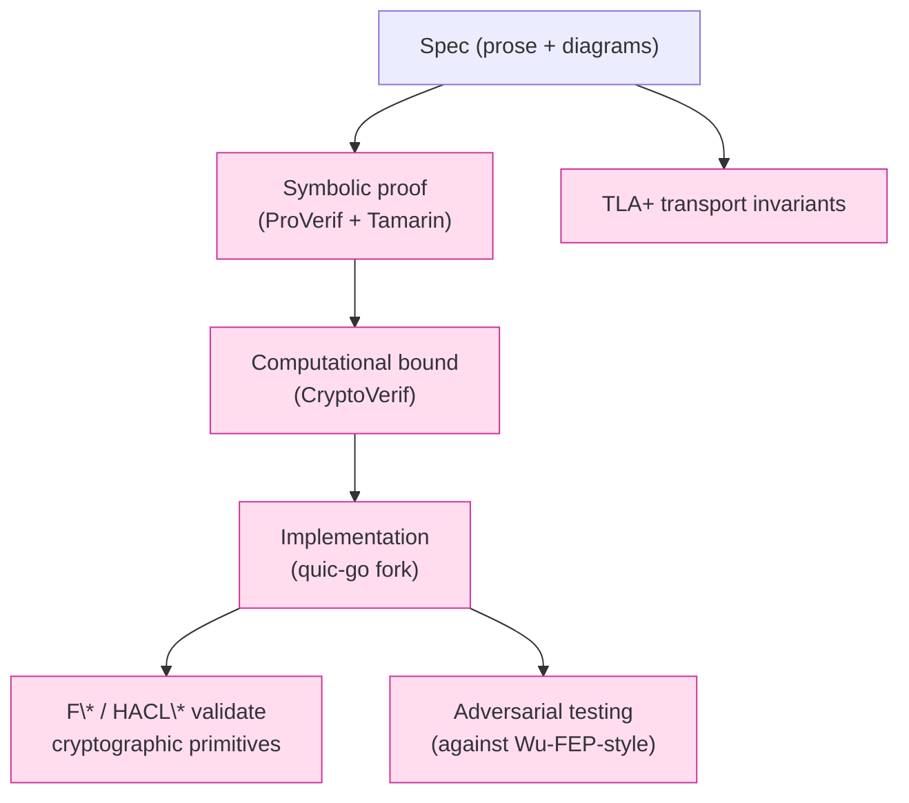

# 課堂 5.7 — CryptoVerif：computational model 與 game-based proof

## 學前知道
- 前置課：[5.4 ProVerif](./5.4-applied-pi-calculus-proverif.md)、[5.6 Tamarin](./5.6-tamarin-prover.md)
- 預計閱讀時間：**60 分鐘**（concept-heavy, less hands-on）
- 必裝工具:
  - **CryptoVerif** (v2.x at 2026)：https://bblanche.gitlabpages.inria.fr/cryptoverif/
- 必讀:
  - **Blanchet**. *A Computationally Sound Mechanized Prover for Security Protocols*. IEEE TDSC 2008
  - **Bhargavan, Blanchet, Kobeissi**. *Verified Models and Reference Implementations for the TLS 1.3 Standardization Candidate*. IEEE S&P 2017 — ProVerif + CryptoVerif 雙工具 TLS 1.3 proof
  - **Lipp, Blanchet, Bhargavan**. *A Mechanised Cryptographic Proof of the WireGuard Virtual Private Network Protocol*. EuroS&P 2019 — CryptoVerif 部分
  - **Bellare & Rogaway**. *Entity Authentication and Key Distribution*. CRYPTO 1993 — game-based security definitions 起源
  - **Bellare**. *Code-Based Game-Playing Proofs and the Security of Triple Encryption*. EUROCRYPT 2006
  - **Halevi**. *A Plausible Approach to Computer-Aided Cryptographic Proofs*. ePrint 2005/181 — code-based 證明的工程方法
- 必讀對比工具:
  - **EasyCrypt** (https://www.easycrypt.info/) — 同 computational model 主要競爭者
  - **F\* / Project Everest** — verified implementation 路線
  - **SSProve / ssprove-rs** — Rust-based, dependent type computational

## 動機

ProVerif 跟 Tamarin 都在 **symbolic model** 工作：
- 加密 = ideal primitive (no collisions, no oracle attack)
- Attacker 推導 = Dolev-Yao closure
- 結論 = boolean (secret/not secret, auth/not auth)

但真實 cryptographic primitive 是 **computational object**:
- AES 不是 perfect block cipher (有 distinguishing advantage)
- ECDSA 不是 perfect signature (有 forgery advantage bounded by DLP)
- Reduction 證明結論：「**advantage of attacker A** 至多 $\epsilon$ + advantage against underlying assumption」

**CryptoVerif** 在這個 computational model 自動化 reasoning。

讀完應該能:
1. 理解 game-based security definition (IND-CPA, IND-CCA, UF-CMA)
2. 看懂 CryptoVerif game transformation
3. 知道 CryptoVerif vs ProVerif/Tamarin 何時用哪個
4. 對 TLS 1.3 / WireGuard 的 CryptoVerif proof 有概念

---

## 核心概念

### 1. Symbolic vs Computational model

| 維度 | Symbolic (ProVerif, Tamarin) | Computational (CryptoVerif, EasyCrypt) |
|---|---|---|
| Primitive | Ideal black-box (no collisions, no oracle) | Concrete (PRF, PRG, AEAD with bounded advantage) |
| Attacker | Dolev-Yao (algebra-bounded) | PPT (polynomial-time) |
| Conclusion | Yes / No (formal logic) | $\epsilon$-advantage (probability bound) |
| Crypto assumption | None internal | DDH, computational DH, EUF-CMA, etc. |
| Scope | Protocol-level reasoning | Reduction to underlying assumption |
| Speed | Fast | Slow (game transformations) |

**Symbolic 的限制 case**:
- Hash collision attack (computational only)
- Distinguishing IND-CPA from IND-CCA (computational)
- Quantitative bounds (computational)
- Computational secrecy under specific advantage budget

**Computational 的限制 case**:
- Hard to reason about unbounded sessions
- Decision procedures less complete
- Tools heavy / require user expertise

實際 protocol verification: 通常**先用 symbolic 抓 trace-level attack**，再**用 computational 證 tight bound**。

### 2. Game-based security definition

Game-based proof 是 modern 密碼學 standard 寫法。Example: IND-CPA security of AES.

**Game $G_0$ (Real)**:
```
Challenger:
    sample key k ← {0,1}^128
Adversary A:
    (m0, m1) ← A^Enc(k, ·)()    // adversary queries encryption oracle
    b ← {0,1}                      // challenger flip coin
    c* ← Enc(k, m_b)              // challenge ciphertext
    b' ← A(c*)
return [b' == b]
```

**Adversary advantage**: 
$$\text{Adv}^{\text{IND-CPA}}_A = \left|\Pr[b' = b] - \frac{1}{2}\right|$$

**Cipher 是 IND-CPA secure** iff 對所有 PPT $A$, $\text{Adv}^{\text{IND-CPA}}_A < \epsilon(\lambda)$ for negligible $\epsilon$.

CryptoVerif 把 protocol step 也視為 game step，**自動 derive game transformations** 把 protocol game 化簡到 underlying primitive game，最後 yield $\epsilon$ bound.

### 3. Game transformations

CryptoVerif 的核心 reasoning step:
1. **Indistinguishability transformation**: 把一個 random function call 替換為 truly random — 引入 $\epsilon_{\text{PRF}}$ advantage cost
2. **Cryptographic transformation**: replace primitive 用 ideal version (e.g., 把 PRF call 換成 random oracle)
3. **Code rewriting**: equivalent program transformations
4. **Final step**: bound prob ≤ sum of accumulated $\epsilon$ + game-trivial bound

例：對 TLS 1.3 record layer (Bhargavan-Delignat-Lavaud et al. S&P 2017):
- $G_0$ = real TLS 1.3 record layer
- $G_1$ = same but Poly1305 MAC replaced by random function ($\epsilon_{\text{Poly1305}}$)
- $G_2$ = ChaCha20 PRF replaced by random function ($\epsilon_{\text{ChaCha20}}$)
- $G_3$ = key derivation HKDF replaced by random ($\epsilon_{\text{HKDF}}$)
- $G_\infty$ = ideal channel (perfect secrecy by definition)
- $\text{Adv}^{\text{TLS-record}} \leq \epsilon_{\text{Poly}} + \epsilon_{\text{ChaCha}} + \epsilon_{\text{HKDF}} + \text{negligible}$

得到 concrete $\epsilon$ bound。

### 4. CryptoVerif input language

CryptoVerif input 跟 ProVerif applied pi-calculus 類似，但加 **probability model + game equivalence rules**.

簡化 spec:
```cryptoverif
proof {
    crypto enc(...) k;   (* apply IND-CPA reasoning to encryption with key k *)
    SArename ... ;
    simplify;
    success.
}

(* Cryptographic primitives with computational assumptions *)
proba pCollHash.
fun hash(bitstring): bitstring [data].
collision m1, m2; hash(m1) = hash(m2) ==> m1 = m2 [pCollHash].

(* Encryption *)
type key [large, fixed].
proba pENC.
fun enc(bitstring, key): bitstring.
equiv(ind-cpa(enc))
    !N new k:key; !O1 Oenc(m: bitstring) := enc(m, k)
<=(N * pENC(time + (N-1) * time(enc)))=>
    !N new k:key; !O1 Oenc(m: bitstring) := enc(Z(m), k).
```

最後一段叫 **cryptographic equivalence axiom**: 「N 個 sessions 用同一 key 加密 message m, 跟用 same key 加密 zero pattern (`Z(m)`) 對 attacker is indistinguishable except for advantage at most $N \cdot p_{\text{ENC}}(...)$」。

User 提供這個 equivalence (對 underlying primitive)，CryptoVerif 用它 transform game.

### 5. TLS 1.3 在 CryptoVerif: Bhargavan-Blanchet-Kobeissi S&P 2017

paper 用 **dual approach**:
- **ProVerif** model: protocol-level secrecy + authentication (symbolic)
- **CryptoVerif** model: record layer + key derivation tight bound (computational)

Record layer CryptoVerif proof:
- 從 TLS 1.3 record layer game 經過 30+ transformation
- 最後 reduce 到 ChaCha20 PRF advantage + Poly1305 MAC advantage + HKDF security
- 得到 concrete numerical bound: 對 $2^{24.5}$ records, advantage $< 2^{-50}$

**這就是 RFC 8446 §5.5 record limit 的來源**：CryptoVerif proof 給 spec 一個 concrete numerical recommendation。

### 6. WireGuard CryptoVerif proof: Lipp-Blanchet-Bhargavan 2019

paper Section 5 用 CryptoVerif 證:
- **Key indistinguishability**: derived traffic key 對 attacker bounded advantage
- **Concrete bound**: 對 Q queries, advantage $\leq Q^2 / 2^{256}$ (Curve25519 collision-free)
- **Composition with implementation**: F\* (Project Everest) verified ChaCha20-Poly1305 implementation 跟 CryptoVerif proof 結合

→ WireGuard 是少數 **同時有 symbolic verification (ProVerif + Tamarin) + computational tight bound (CryptoVerif) + verified implementation (F\*)** 的 protocol。

### 7. CryptoVerif 跟 EasyCrypt 對比

| 工具 | 強項 | 弱項 |
|---|---|---|
| **CryptoVerif** | Automated, game transformation | Limited expressiveness; user must provide cryptographic axioms |
| **EasyCrypt** | More expressive, supports arbitrary game-based proof, has IDE | Heavier user intervention, slow proof process |

**選擇 heuristic**:
- AKE protocol with simple primitives → CryptoVerif
- Complex cryptographic constructions (零知識證明, MPC) → EasyCrypt or F*

### 8. 何時 NOT 用 computational

- **Trace-level secrecy** 已經夠（unbounded sessions, no quantitative bound）→ symbolic 足夠
- **Spec design phase**: 還在改 protocol structure → symbolic 比 computational 容易 iterate
- **Implementation correctness**: 用 F\* / Coq 等 dependent types 更直接
- **Probabilistic property** (anonymity set 概率) → CryptoVerif 不擅長; specialized tools (Aplus, PRISM)

### 9. 我們協議的 verification roadmap

Part 11.10 + Part 12 完整 verification stack:



每層提供不同 assurance:
- TLA+: state machine correctness
- ProVerif: secrecy / authentication (unbounded, fast)
- Tamarin: DH algebraic + multi-stage
- CryptoVerif: tight numerical bound
- F\* / HACL\*: implementation matches spec
- Adversarial test: empirical robustness against statistical classifier (Part 10)

### 10. CryptoVerif 的 limitation

- **Learning curve**: 比 ProVerif 陡很多
- **Cryptographic axiom assertions**: 必須 manually 寫 equivalence axiom
- **Slow**: 對 complex protocol 跑 minutes - hours
- **No quantum**: post-quantum 階段需要 specialized treatment

對我們協議: CryptoVerif 用於 **核心 handshake key derivation tight bound**；其他 property 用 ProVerif/Tamarin。

---

## 與我們協議設計的關聯

Part 11.10 CryptoVerif proof 覆蓋:
1. **Handshake key indistinguishability**: tight bound $\leq Q^2 / 2^{256}$
2. **Record layer advantage**: 類比 TLS 1.3 RFC 8446 §5.5 record limit derivation
3. **0-RTT key tight bound**: PSK + ECDHE 混合 derivation 的 concrete bound
4. **AEAD nonce reuse bound**: 對 $2^{n}$ record 後 must rekey 的 concrete $n$

每條都對應 RFC-level concrete recommendation (rekey at N records).

---

## 動手（45 分鐘）

### 練習 A：安裝 CryptoVerif

```bash
# CryptoVerif 是 OCaml; 需先裝 OCaml
brew install opam
opam init
opam switch create 4.14.0
opam install ocamlfind

# Download CryptoVerif from https://bblanche.gitlabpages.inria.fr/cryptoverif/
# Build per README
```

或用 docker:
```bash
docker pull blanchet/cryptoverif
```

### 練習 B：跑 CryptoVerif tutorial example

CryptoVerif 自帶 examples (e.g., `examples/basic-encrypt-then-mac/`). 跑：
```bash
cryptoverif examples/basic-encrypt-then-mac.cv
```

讀 output 中 game transformation 序列。

### 練習 C：對讀 WireGuard CryptoVerif proof

下載 Lipp-Blanchet-Bhargavan 2019 supplementary material (CryptoVerif spec)。讀 lemma 結構與 game transformation。

### 練習 D：理解 RFC 8446 §5.5 record limit

讀 RFC 8446 §5.5「Limits on Key Usage」，找到 record-limit 數字 ($2^{24.5}$ AES-GCM 對應 $2^{-50}$ advantage)。對應 Bhargavan-Delignat-Lavaud et al. 2017 paper Section 5。**理解 "$2^{-50}$ advantage" 是怎麼 derive 出來**。

---

## 自我檢查

1. **Symbolic vs computational model** 對「ChaCha20 vs textbook RC4」哪個能區分？描述一個 attack scenario.
2. **Game-based proof 的 hop**: 從 protocol game 經過 game transformation 到 ideal game，每 hop 是什麼動作？
3. **TLS 1.3 RFC 8446 §5.5 record limit**: $2^{24.5}$ records 對 AES-128-GCM。對應 advantage 多少? bound 怎麼來?
4. **CryptoVerif 對 protocol designer 提供什麼**, **ProVerif 不提供的**? (回答 quantitative)
5. **我們協議 verification stack 中 CryptoVerif 角色**: spec design phase 必須用嗎? 或 final verification 時用?

---

## 延伸閱讀

- Blanchet IEEE TDSC 2008 CryptoVerif
- Bhargavan-Blanchet-Kobeissi S&P 2017
- Halevi 2005 ePrint computer-aided proofs
- Bellare-Rogaway CRYPTO 1993 entity authentication
- EasyCrypt: https://www.easycrypt.info/
- *Foundations of Cryptography* by Goldreich

---

## 研究級補遺

### 1. 學界詞彙

| 口語 | 學界用詞 |
|---|---|
| 「Symbolic model」 | **Dolev-Yao model / formal/symbolic security** |
| 「Computational model」 | **Standard model / concrete-security model** |
| 「Game-based proof」 | **Game-playing / code-based game-playing (Bellare-Rogaway)** |
| 「Advantage」 | **Distinguishing advantage / success probability gap** |
| 「Reduction」 | **Cryptographic reduction / black-box reduction** |
| 「Random oracle」 | **Random Oracle Model (ROM) / Standard Model distinction** |

### 2. 對手分類學

Computational adversary classes:
- **PPT** (probabilistic polynomial-time): standard
- **Subexponential**: stronger
- **Quantum PPT**: for post-quantum
- **Bounded query**: query budget $Q$
- **Adaptive vs static**: chosen-plaintext adaptive vs upfront

### 3. 形式化定義

**IND-CPA security of symmetric encryption** $\Pi$:

$$\text{Adv}^{\text{IND-CPA}}_{\Pi, A} = \left| 2 \Pr[A \text{ wins IND-CPA game}] - 1 \right|$$

$\Pi$ is **IND-CPA secure** iff $\forall$ PPT $A$, $\text{Adv}^{\text{IND-CPA}}_{\Pi, A}$ is negligible function of security parameter.

**Concrete-security version**: $\text{Adv}^{\text{IND-CPA}}_{\Pi, A} \leq f(t, q)$ for some function $f$, time bound $t$, query bound $q$.

### 4. 領域的關鍵 papers

| 引用 | 為何必追 | 之後在哪堂精讀 |
|---|---|---|
| Bellare-Rogaway CRYPTO 1993 | 起源 | 本堂 |
| Bellare EUROCRYPT 2006 code-based | methodology | 本堂 |
| Blanchet TDSC 2008 CryptoVerif | tool | 本堂 |
| Bhargavan-Blanchet-Kobeissi S&P 2017 TLS 1.3 | TLS application | 本堂 |
| Lipp et al. EuroS&P 2019 WireGuard | WireGuard application | 5.5 + 本堂 |
| Dowling-Fischlin-Günther-Stebila JCS 2021 *MSKE* | TLS 1.3 multi-stage | 本堂 + 4.5 |

### 5. 我們協議的座標

到此 5 個工具完整:
- ✅ TLA+ (state machine)
- ✅ ProVerif (symbolic secrecy + auth)
- ✅ Tamarin (symbolic + DH + multi-stage)
- ✅ CryptoVerif (computational tight bound)
- ✅ F\* / HACL\* (implementation primitives)
- ❓ Hybrid orchestration (Part 11.10 詳)

### 6. 必追資源 / 社群入口

- CryptoVerif 主頁 + manual
- EasyCrypt 主頁
- IACR ePrint computational proofs
- F\* / Project Everest

### 7. 開放問題

- **Composition of symbolic + computational**: 仍 active research
- **Quantum game-based proof**: 部分工具支援
- **Tighter bounds for hash function**: hash 通常 ROM, standard model 仍困難

---

> 下一堂（5.8，Part 5 最後一堂）：spec-first 方法論——把整個 5.1-5.7 的工具串成 PhD-level 設計流程，餵給 Part 11 我們協議設計。
