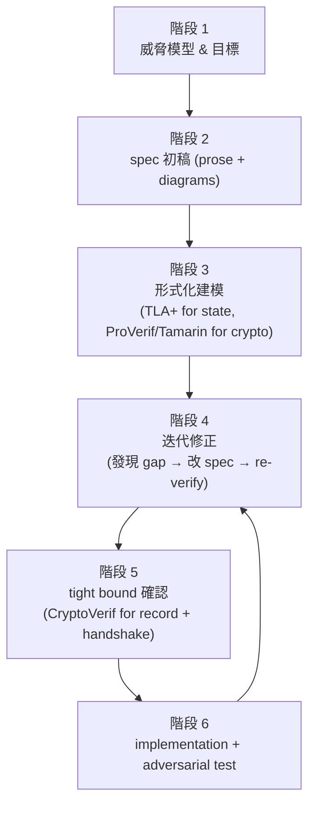

# 課堂 5.8 — Spec-first 設計協議的方法論

## 學前知道
- 前置課：5.1–5.7 全部
- 預計閱讀時間：**50 分鐘**（這是 Part 5 的 capstone，integrative）
- 必讀:
  - **Bhargavan, Bond, Delignat-Lavaud, Fournet, Hawblitzel, Hritcu, Ishtiaq, Kohlweiss, Leino, Lorch, Maillard, Pan, Parno, Protzenko, Ramananandro, Rane, Rastogi, Swamy, Thompson, Wang, Zanella-Béguelin, Zinzindohoué**. *Everest: Towards a Verified, Drop-in Replacement of HTTPS*. SNAPL 2017 — Project Everest 全圖
  - **Newcombe et al.** *How Amazon Web Services Uses Formal Methods*. CACM 2015 — industry pragmatic flow
  - **Bornholt et al.** *Using Lightweight Formal Methods to Validate a Key-Value Storage Node in Amazon S3*. SOSP 2021 — spec + executable model 結合
  - **IETF: TLS 1.3 design discussions**: RFC 8446 + WG mailing list — spec-driven verification 範例
  - **Donenfeld**. *WireGuard*. NDSS 2017 — narrow-scope formally verified VPN
- 自我反省問題:
  - 你過去寫過任何 "協議" 嗎? (網頁 session, App 認證, ...) 是否曾形式化過 properties? 列出三個 implicit assumption.

## 動機

Part 5 前 7 堂教你 6 個 verification tools。但 **「會用工具」≠「設計 protocol 的方法論」**。本堂課把 5.1–5.7 串成一條 **spec-first design pipeline**:

1. 從威脅模型出發
2. 制定 spec
3. 用形式化工具迭代
4. 對 spec 寫 implementation
5. 對 implementation 做 adversarial testing
6. Iterate

這條 pipeline 是 PhD-level 設計協議的 standard。Part 11 把它套用到我們協議。

讀完應該對 Part 11 完整流程**有 mental model**:
- 知道哪一堂用哪個工具
- 知道每個 iteration step 有 deliverable
- 知道何時 spec-design 跟 implementation-design 分離

---

## 核心概念

### 1. Spec-first 設計的核心承諾

> **「Specification 是 first-class artifact，跟 code 同樣重要 — 且 spec 變化時 verification 必須同步更新。」**

具體實踐：
- Spec 跟 verification artifact 共存於同一 git repo
- Spec 變化 → 觸發 verification re-run
- Verification 找到 gap → 改 spec → 重新 verify
- Implementation 只在 spec 穩定後才開始
- Implementation 對 spec refine (理想上 verified compilation; 至少 testable correspondence)

### 2. 6 階段 spec-first pipeline



### 階段 1: 威脅模型 & 目標

**Deliverable**: 一份 1-2 頁的 **threat model document**。

包含:
- **Adversary capabilities**: passive/active, on-path/off-path, computational power, side-channel access
- **Trust assumptions**: 哪些 party 是 trusted, 哪些 channel 是 secure
- **Goals**: confidentiality / authentication / FS / KCI resistance / privacy / anti-replay / DoS resistance
- **Non-goals**: 明確排除（如「不防 quantum adversary」「不防 nation-state physical access」）

例（我們協議的 threat model 草稿，Part 11.2 完整）：

```
== Threat Model ==

Adversaries:
  A1: passive Internet observer (GFW level 1)
  A2: active on-path (TCP RST / QUIC Initial drop / DNS poisoning)
  A3: active probing (probing 客戶端 IP / 對 server inject probe)
  A4: statistical traffic analyzer (Wu-FEP-style ML classifier)
  A5: adaptive ML-based classifier (next-gen GFW)
  A6: long-term key compromise (post-incident)

Trust Assumptions:
  T1: client device 是 trusted (no malware)
  T2: server-side proxy 是 trusted (operator-deployed)
  T3: 廣大 CDN traffic 是 cover (e.g. Cloudflare / Apple)
  T4: TLS 1.3 + Curve25519 + ChaCha20-Poly1305 cryptographic primitive 安全

Goals:
  G1: inner application data 對 A1-A5 保密
  G2: mutual authentication between client and server
  G3: forward secrecy (FS): A6 後過去 sessions 仍保密
  G4: KCI resistance
  G5: server identity privacy (對 A1-A4)
  G6: indistinguishability from cover traffic against A4 with $\epsilon \leq 0.1$
  G7: anti-replay for 0-RTT
  G8: DoS resistance (amplification limit 3x)

Non-Goals:
  N1: 不防 quantum adversary (defer to v2)
  N2: 不防 client device compromise
  N3: 不對抗 IP-level censorship of CDN cover (assumes CDN 仍 accessible)
```

### 階段 2: Spec 初稿

**Deliverable**: prose-level **spec document** (~ 10-30 pages, RFC-style)

寫法:
- **Notation**: 預先定義所有 symbol (e.g. `ε`, `→`, `||`)
- **Wire format**: byte-level diagram for every message
- **State machine**: per-role FSM diagram
- **Cryptographic primitives used**: 列每個 + version + assumption
- **Pseudocode**: 主要 procedure 含 explicit error handling
- **Recommendations**: 對 deploy operator 的指引（cipher suite, anonymity set size, etc.）

**典型錯誤**:
- "Encryption is performed using AES" — 太模糊 (mode? IV? padding?)
- "Server responds with appropriate error message" — 不明確 (timing? content?)
- "Implementation must rate-limit" — spec 不能用 "should/may" 對 security 屬性

**TLS 1.3 spec 是 best-in-class example**: 90+ pages, byte-level diagrams, explicit cryptographic computations, every action explicit.

### 階段 3: 形式化建模

對 spec 寫 **multi-tool model**:
- **TLA+ module**: transport state machine + invariants
- **ProVerif spec**: secrecy + authentication queries
- **Tamarin spthy**: DH-rich + multi-stage key derive
- **(optional) CryptoVerif**: tight bound on key indistinguishability

**Best practice**:
- 每個 tool 各寫 minimal model 對 specific properties
- **annotated correspondence**: spec prose section X.Y → TLA+ module Y / ProVerif process Z
- 每個 model 跟 spec 同 repo, 同 PR review

例如 TLS 1.3 Cremers et al. CCS 2017 提供 `https://tls13tamarin.github.io/TLS13Tamarin/` 含 annotated RFC + Tamarin source。

### 階段 4: 迭代修正

跑 tools, 發現 gap, 改 spec。**這就是 spec-first 的真實價值** — 每個 iteration 揭露 spec 不完整 / 隱含 assumption.

**真實 case studies**:

#### TLS 1.3 draft-10 → draft-23
- ~10 個 protocol-level issue 在 verification 過程中發現
- 主要在 0-RTT + PSK 部分
- 修正 spec 之後 re-verify

#### Signal Double Ratchet
- 設計 2014; formal verification 2017 才完整
- 發現「unique session key」屬性在某些 race condition 不成立
- Spec 修正：明確規定 KeyUpdate 順序

#### WireGuard
- spec 2017; Tamarin 2018 + ProVerif 2019
- 發現幾個 spec ambiguity，無 fundamental flaw
- Spec 修正：明確 timestamp anti-replay tolerance window

**iteration 速度**: TLS 1.3 平均每 1-2 個月 1 個 draft, 每個 draft 對應一輪 verification → 4 年 完成。我們協議目標 12-18 個月完成 spec + verification iteration.

### 階段 5: Computational tight bound

CryptoVerif (5.7) 對 key indistinguishability tight bound。Output 是**concrete numerical recommendation**:
- 「rekey at $2^{n}$ records」
- 「fresh ephemeral every Y seconds」
- 「PSK lifetime ≤ Z hours」

Spec 把這些 numerical bound 寫進 mandatory operator guidance.

### 階段 6: Implementation + adversarial test

Spec finalize 後寫 implementation:
- **Refine spec to code**: 若有 verified compilation (F\* → C) 用; 否則 manual translation + cross-check
- **Implementation correctness**: 對 spec wire format 做 fuzzing (libFuzzer, syzkaller) + property test
- **Adversarial empirical test**: 對 Wu-FEP-style classifier 跑 traffic samples, measure indistinguishability
- **Real-world deployment trial**: 對中國 user 群跑 1-2 個月 monitor

實作層 verification:
- HACL\* / Project Everest 為 cryptographic primitive
- (Optional) F\* spec verification for record layer
- Manual review for transport state machine (跟 TLA+ refinement)

### 3. Lightweight formal methods (LFM)

Bornholt et al. SOSP 2021 對 AWS S3 提出「Lightweight Formal Methods」概念:

> **不必對整個 system 做完整 formal verification; 對 critical component 做 partial verification, 用 executable model + property-based test 補足。**

具體:
- Spec → TLA+ + executable Rust model (Stateright)
- 對 Rust impl 做 property-based test against executable model
- Test cases 由 model exploration generated

對我們協議: 全完整 verify 可能 cost 過高（PhD 4 年 budget 不夠）；採 hybrid:
- **Core handshake**: 完整 verify (ProVerif + Tamarin + CryptoVerif)
- **Transport state machine**: TLA+ + property test (lightweight)
- **Implementation**: manual review + adversarial test (lightweight)

### 4. Annotated RFC: spec ↔ proof 鏈

從 TLS 1.3 Cremers CCS 2017 學的 best practice: **annotated RFC**.

每段 RFC prose 邊上標 Tamarin rule / ProVerif process:

```
RFC 8446 §4.1.2 ClientHello:
   ... opaque legacy_session_id<0..32>;  // ProVerif: legacy_session_id_var
   ... CipherSuite cipher_suites<2..2^16-2>;  // Tamarin rule: client_send_cipher_list
```

實踐：寫一個 cross-reference table 在 spec 後附錄，列「spec section → proof artifact」。

對 reviewer (USENIX Security PC) 來說，這條 traceability **比 verification proof 本身更重要** — 證明 spec 不光是 formal model, formal model 也不光是 abstract spec。

### 5. Workflow tool integration

Modern protocol research 工具鏈 (2026):
- **Spec format**: Markdown + ASN.1 for byte format; SVG diagrams
- **Version control**: git with multi-branch (spec / impl / proof 各自 branch)
- **CI/CD**: 每 PR 自動 run TLA+ + ProVerif (timeout 30 min); Tamarin / CryptoVerif manual trigger
- **Test infrastructure**: docker-based interop test runner; adversarial test bed

對我們協議 Part 12 setup:
```
network-from-scratch/
├── spec/
│   ├── protocol.md         (prose RFC-style)
│   ├── handshake.md
│   ├── transport.md
│   └── threats.md
├── proof/
│   ├── tla/
│   │   ├── PnSpace.tla
│   │   ├── Migration.tla
│   │   └── AntiReplay.tla
│   ├── proverif/
│   │   ├── secrecy.pv
│   │   ├── authentication.pv
│   │   └── privacy.pv
│   ├── tamarin/
│   │   ├── handshake.spthy
│   │   ├── multi_stage_keys.spthy
│   │   └── pq_hybrid.spthy
│   └── cryptoverif/
│       └── record_layer.cv
├── proof_summary.md        (annotated RFC mapping)
├── impl/                    (Go fork of quic-go)
└── tests/
    ├── interop/
    ├── adversarial/
    └── property_based/
```

### 6. 與 RFC 流程整合（若想 IETF 標準化）

若我們協議目標 USENIX Security / NDSS paper 並後續走 IETF:
1. **Internet-Draft** (I-D): spec 寫成 draft-icarus-anticensorship-v01
2. **WG charter**: 找到 willing WG (perhaps QUIC WG 或 newly-formed)
3. **Interop testing**: 至少 2 個 independent implementation
4. **Security analysis**: formal proof artifacts 提交 (TLS 1.3 範本)
5. **WGLC** (Working Group Last Call) → **IETF LC** → **AD review** → **RFC**

實際 timeline: 3-5 年 from draft to RFC（TLS 1.3 用 4 年）。我們協議第一階段不必走 IETF，但要為 future RFC 化保留可能性 — spec 寫法跟 RFC 風格 compatible.

### 7. 對 academic publication 的 alignment

我們協議要投 USENIX Security / NDSS / S&P:

**論文結構**:
- Introduction: 問題 + motivation
- Background: TLS 1.3 / QUIC / GFW / Wu-FEP recap
- Threat model: formal statement
- Design: spec 簡化版 + rationale
- Formal analysis: ProVerif + Tamarin + CryptoVerif results
- Implementation: design choices + benchmark
- Evaluation: against adversarial test bed
- Discussion: limitations + future work
- Related work
- Conclusion

**Artifact evaluation** (USENIX 2024+ 強制): submit reproducible Docker image + test data + proof scripts.

→ Part 11.10 + Part 12 完整 alignment：spec / proof / impl 全部 reproducible artifact-style.

### 8. 「**Pragmatic spec-first**」: 不必 perfect

real-world 經驗教訓:
- **Spec 寫到 90% 就開始 verification**: 不要等 100% perfect — iteration 比 first-cut perfection 重要
- **Verification 找到 90% 屬性 OK 就先寫 impl**: 邊寫 impl 邊 deepen verification
- **Implementation deployment 跑 90% 案例 OK 就 publish paper**: 開放 source 讓 community 找 edge case
- **每階段 deliverable 要 timeboxed**: 不能無止盡 polish

**反例**: 學界一些 protocol 因「verification still ongoing」而從未 finalize, 喪失 momentum。

### 9. Common pitfalls

從 industry 跟 academic case studies 抽出:

1. **Verifying wrong property**: 證了 "key is secret" 但沒證 "key uniquely identifies session" → Selfie attack scenario
2. **Inconsistent threat model across artifacts**: TLA+ 假設 honest party always available; ProVerif 假設 adversary 能 force crash — 不一致
3. **Spec ambiguity 在 impl 不一致**: 兩個 implementation 對 spec interpret 不同 → interop fail (TLS 1.0 早期 fragmentation 問題)
4. **Test bed unrealistic**: adversarial test 用 toy classifier 不對應 real-world GFW
5. **Premature optimization**: spec 加 micro-optimization 之前 verification 沒 cover → bug 隱藏
6. **Single tool dependence**: 只用 ProVerif/Tamarin/TLA+ 之一 — 工具有盲點

### 10. Part 5 學到的所有 building blocks

整理一下:

| Block | Tool | 用途 |
|---|---|---|
| State machine invariants | TLA+ | Transport, anti-replay, flow control |
| Symbolic secrecy | ProVerif | Dolev-Yao secrecy, basic auth |
| Symbolic auth + DH | Tamarin | Multi-stage AKE, DH algebraic, stateful |
| Computational tight bound | CryptoVerif | Numerical advantage on key derivation |
| Implementation crypto | HACL\* / F\* | Primitive correctness |
| Property-based test | quickcheck-style | Implementation property |
| Adversarial empirical | wu-fep-style classifier | Statistical indistinguishability |

每 block 對應 properties:
- TLA+: liveness + safety on state
- ProVerif: trace secrecy + auth
- Tamarin: multi-stage + DH + stateful
- CryptoVerif: ε-bound
- HACL\*: code matches primitive spec
- PB test: impl property matches spec
- Adversarial: empirical robustness

**整套 = 我們協議 Part 11.10 + Part 12 的工程交付物**。

---

## 與我們協議設計的關聯

到此 Part 5 結束。我們具備:
1. ✅ 6 個 formal verification tools 的 vocabulary
2. ✅ Spec-first methodology 完整 pipeline
3. ✅ 對 TLS 1.3 / WireGuard / Signal 等 verified protocol 的 mental model
4. ✅ Part 11.10 + Part 12 implementation 計畫

接下來 Phase II (Part 6-9) 把以上 vocabulary 套用到「拆解 SOTA 翻牆協議」:
- Part 6: VPN internals (wireguard-go 通讀)
- Part 7: 各 proxy protocols 拆 (SS / Trojan / VLESS / REALITY)
- Part 8: QUIC-based proxy (Hysteria2 / TUIC)
- Part 9: GFW 完整研究

Part 10-12: 對抗測試 + 設計 + 實作。

---

## 動手（30 分鐘）

### 練習 A：寫你自己「mini protocol」的 threat model

選一個你過去寫過的 protocol（網頁 session, App auth）。寫一頁 threat model:
- Adversary capabilities (A1-A5)
- Trust assumptions
- Goals
- Non-goals

完成後 self-review: 哪些 goal 你過去 implicit 假設沒 explicitly state?

### 練習 B：選一個 RFC 把 spec 跟 verification artifact 對應

對 RFC 8446 (TLS 1.3) 或 RFC 9000 (QUIC)，找對應的 formal verification artifact (Tamarin / ProVerif source)。**寫一張 cross-reference table** 列 RFC section → proof artifact rule / lemma。

選 5 個 RFC sections 即可。這個練習讓你體會 annotated RFC 的工作量。

### 練習 C：對你協議的 verification roadmap

對假想中「我們協議」寫一份 verification roadmap (1 頁):
- 12 個月 timeline
- Per quarter deliverable
- 哪個工具用於哪個 property
- Risk + fallback

把這份 doc 放到 `projects/5-formal/roadmap.md` (本練習自用)。

---

## 自我檢查

1. **Spec-first 的核心承諾** 在 1 句話內描述。為何 implementation-first 在 protocol design 是 anti-pattern?
2. **Annotated RFC + cross-reference table** 對 reviewer 的價值是什麼? 為何 verification proof 本身 alone 不夠?
3. **Lightweight Formal Methods (LFM)** 跟 full formal verification 的 trade-off。我們協議哪些 component 用 LFM 夠, 哪些必須 full?
4. **Verification 過程發現 spec gap → 改 spec 的 iteration cost** 在我們協議目標 12-18 個月內怎麼控制?
5. **Single tool dependence 是 common pitfall**。為何同一個 protocol 需要 ProVerif + Tamarin + CryptoVerif 三個工具 verify?

---

## 延伸閱讀

- Bhargavan et al. *Everest: Towards a Verified, Drop-in Replacement of HTTPS*. SNAPL 2017
- Newcombe et al. CACM 2015
- Bornholt et al. SOSP 2021
- IETF *Best Current Practice for Writing Security Considerations Section*
- Annotated RFC examples (TLS 1.3 Tamarin annotations)
- *Practical TLA+* by Hillel Wayne

---

## 研究級補遺

### 1. 學界詞彙

| 口語 | 學界用詞 |
|---|---|
| 「spec-first」 | **Specification-driven development / spec-then-implement** |
| 「形式化迭代」 | **Iterative formal refinement** |
| 「annotated RFC」 | **Cross-referenced specification** |
| 「lightweight formal methods」 | **Lightweight verification (LFM, Stateright, executable model)** |
| 「adversarial test」 | **Red-team empirical evaluation** |
| 「artifact」 | **Reproducible research artifact** |

### 2. 對手分類學

到 Part 5 結束的完整 adversary taxonomy:

| 等級 | 能力 |
|---|---|
| L1 | Dolev-Yao symbolic |
| L2 | Computational PPT |
| L3 | Side-channel (timing, cache) |
| L4 | Statistical traffic analyzer |
| L5 | Adaptive ML classifier |
| L6 | Quantum PPT |
| L7 | Implementation-bug exploit |
| L8 | Endpoint compromise |
| L9 | Global passive correlation |
| L10 | Nation-state CDN cooperation |

我們協議目標：L1-L5 全 verified；L6-L7 部分；L8-L10 outside scope.

### 3. 形式化定義

**Spec-first design pipeline** 形式化定義:

$$\text{Pipeline} = \langle T, S_0, \{S_i\}_{i \in I}, \{V_i\}_{i \in I}, Impl \rangle$$

where $T$ is threat model, $S_0$ is initial spec, $S_i$ are iterative refinements with verification artifacts $V_i$, and $Impl$ is final implementation. Pipeline is **complete** iff $T \rightarrow S_n \rightarrow V_n \rightarrow Impl$ 整條 traceable + auditable.

### 4. 領域的關鍵 papers

| 引用 | 為何必追 | 之後在哪堂精讀 |
|---|---|---|
| Bhargavan et al. SNAPL 2017 Everest | full vision | 本堂 |
| Newcombe AWS CACM 2015 | industry case | 本堂 |
| Bornholt S3 SOSP 2021 | LFM | 本堂 |
| TLS 1.3 spec + Cremers CCS 2017 | reference | 4.1 + 5.6 + 本堂 |
| WireGuard NDSS 2017 + Donenfeld-Milner 2018 | narrow scope success | 5.5 + 本堂 |

### 5. 我們協議的座標（Part 5 結束）

完整方法論承諾:
- ✅ Threat model 寫死
- ✅ Spec 跟 verification artifact 同 repo
- ✅ Multi-tool verification (TLA+ + ProVerif + Tamarin + CryptoVerif)
- ✅ Annotated cross-reference
- ✅ Lightweight Formal Methods for less critical parts
- ✅ Artifact-reviewed-publication-ready
- ✅ 12-18 個月 timeboxed iteration

### 6. 必追資源 / 社群入口

- Project Everest
- AWS automated reasoning team
- IETF QUIC / TLS / MASQUE WGs (spec writing best practice)
- USENIX artifact evaluation criteria
- NDSS reproducibility guidelines

### 7. 開放問題

- **Cross-tool composition**: TLA+ + ProVerif + Tamarin 結論的 sound composition 仍 manual
- **Continuous verification CI/CD**: 對 large protocol 跑 verification on every PR 仍 expensive
- **Educational**: spec-first 訓練 industrial protocol designer 速度跟得上嗎? (PhD-level 訓練是稀缺 resource)

---

## Part 5 結語

完成 Part 5 = 你已經知道:
- 為何 formal verification 是 PhD-level 設計協議的 standard
- TLA+ 對 state machine
- ProVerif 對 secrecy/auth
- Tamarin 對 DH + multi-stage
- CryptoVerif 對 tight bound
- Spec-first methodology 把以上串成 pipeline

**Phase I (Part 0-5) 到此完整**。你已具備：
- 網路基礎 (Part 1)
- 高效能 I/O (Part 2)
- 密碼學紮實基礎 (Part 3)
- TLS / QUIC 完整 (Part 4)
- 形式化方法 (Part 5)

接下來 **Phase II (Part 6-9)** 把這些 vocabulary 餵給「拆解 SOTA」：WireGuard internals、各 proxy 協議、GFW 完整研究。

> Phase II 開始。
