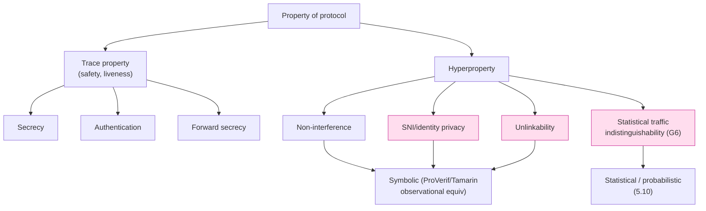

# 課堂 5.9 — Hyperproperties 與 Observational Equivalence：privacy 怎麼證

## 學前知道
- 前置課：[5.4 ProVerif](./5.4-applied-pi-calculus-proverif.md)、[5.6 Tamarin](./5.6-tamarin-prover.md)、[Part 4.4 ECH](../part-4-tls-quic/)
- 預計閱讀時間：**70 分鐘**
- 必裝工具：
  - **ProVerif** 已裝（5.4）— 用其 `choice` / `equivalence` mode
  - **Tamarin** 已裝（5.6）— 用其 `diff-equivalence` lemma
  - **MoChA / HyperQube**（optional, HyperLTL model checker, https://github.com/reactive-systems/hyperqube）
- 必讀論文：
  - **Clarkson & Schneider**. *Hyperproperties*. CSF 2008 + JCS 2010 — hyperproperty 的座標起點
  - **Goguen & Meseguer**. *Security Policies and Security Models*. S&P 1982 — non-interference 原始 paper
  - **Abadi & Fournet**. *Mobile Values, New Names, and Secure Communication*. POPL 2001 — applied pi-calculus 的 observational equivalence
  - **Blanchet, Abadi, Fournet**. *Automated Verification of Selected Equivalences for Security Protocols*. JLAP 2008 — ProVerif 的 diff-equivalence
  - **Basin, Dreier, Sasse**. *Automated Symbolic Proofs of Observational Equivalence*. CCS 2015 — Tamarin observational equivalence
  - **Bhargavan, Cheval, Wood**. *A Symbolic Analysis of Privacy for TLS 1.3 with Encrypted Client Hello*. CCS 2022 — precis: [`notes/papers/bhargavan-ech-privacy.md`](../../notes/papers/bhargavan-ech-privacy.md)
  - **Finkbeiner, Rabe, Sánchez**. *Algorithms for Model Checking HyperLTL and HyperCTL\**. CAV 2015 — HyperLTL model checking
  - **Hirschi, Baelde, Delaune**. *A Method for Verifying Privacy-type Properties: The Unbounded Case*. S&P 2016 — unlinkability methodology
- 必讀規格 / 範例：
  - ProVerif manual §6「Observational equivalence」
  - Tamarin manual §11「Observational Equivalence」
  - tamarin-prover examples `examples/ake/diffie-hellman-observational.spthy`

## 動機

5.4-5.7 教的 **secrecy** / **authentication** / **forward secrecy** 都是 **trace properties**——「對協議的每一條 trace，property holds」。

但 anti-censorship 協議的核心威脅模型不只是「key 不洩漏」。它是 **「攻擊者無法區分兩種情境」**：

| 屬性 | trace 還是 hyper？ | 為何重要 |
|---|---|---|
| Inner key secret | trace | 不是 G5 / G6 的核心 |
| Outer SNI 看起來像 cdn.example.com | **hyper**（要 distinguish 兩個 world） | **G5（server identity privacy）** |
| Inner SNI A vs inner SNI B 在 wire 上不可區分 | **hyper** | ECH 核心保證 |
| Tunnel traffic 看起來像 Cloudflare HTTPS | **hyper**（probability over two distributions） | **G6（statistical indistinguishability）** |
| 不同 user / 不同 session 在 wire 上不可關聯 | **hyper**（k-anonymity / unlinkability） | privacy-via-anonymity |

> **核心 takeaway**：**privacy = hyperproperty，secrecy = trace property**。Part 5.4-5.7 的工具 90% 處理 trace properties；privacy 需要不同 framework。

> **Failure framing**：本堂教的 observational equivalence (symbolic) 處理「**any deterministic distinguisher**」；對「**any probabilistic ML classifier**」要等 5.10 的 statistical methods 才完整。本堂是 G5 / privacy 的基線，**不是** G6 的完整解。

讀完應該能：
1. 區分 trace property vs hyperproperty 的形式化定義
2. 在 ProVerif 用 `choice[A, B]` 寫 diff-equivalence query
3. 在 Tamarin 用 `diff` operator + `Observational_equivalence` lemma 證 indistinguishability
4. 對 ECH outer/inner SNI privacy 寫一個 minimal ProVerif spec 並驗證
5. 知道 hyperproperty 為何 ProVerif/Tamarin 的 symbolic equivalence ≠ G6 的統計 indistinguishability，但仍是必要 baseline

---

## 核心概念

### 1. Trace property vs Hyperproperty (Clarkson-Schneider 2008)

**Trace property** $P$ = predicate over **single** trace。
協議 $\Pi$ 滿足 $P$ iff $\forall t \in \text{Traces}(\Pi): P(t)$。

例：secrecy 是 trace property —— 對每條 trace，attacker 不能 derive 出 secret。

**Hyperproperty** $H$ = predicate over **set of traces**。
協議 $\Pi$ 滿足 $H$ iff $\text{Traces}(\Pi) \in H$。

例：**non-interference**「high-level input 對 low-level output 沒影響」——需要比較 high=0 跟 high=1 兩個 trace set。

**為何不能用 trace property 表達 non-interference**：對任何單一 trace 你看不出「high 變動影響不到 low」，那需要看「不同 high 對應 low 是否相同」——本質上是 trace **pair** 的關係。

Clarkson-Schneider 證明 hyperproperty $\supsetneq$ trace property —— 嚴格更廣的 class。

### 2. Hyperproperty 在 anti-censorship 的位置



本堂處理 left-bottom column（symbolic hyperproperty）。Right-bottom（statistical, G6）留給 5.10。

### 3. Observational equivalence in applied pi-calculus

Applied pi-calculus（Abadi-Fournet POPL 2001, 已在 5.4 過）對 hyperproperty 的 native primitive 是 **observational equivalence**（記 $P \approx Q$）：

> **Definition (informal)**: $P \approx Q$ iff 對所有 evaluation context $C[\cdot]$ (即「攻擊者觀察方式」), $C[P]$ 跟 $C[Q]$ 產生 indistinguishable observations。

「Indistinguishable」精確化方式有三種：
- **Strong bisimilarity**: 每步 transition matchable
- **May testing equivalence**: 「能 reach observable action」same set
- **Labeled bisimilarity** (Abadi-Fournet 主推): observable action sequence indistinguishable

**對 privacy 的意義**：要證 「協議在 inner SNI = `secret.com`」 跟 「inner SNI = `dummy.com`」對攻擊者**無法區分** → 寫兩個 process $P_{\text{secret}}$ 跟 $P_{\text{dummy}}$, 證 $P_{\text{secret}} \approx P_{\text{dummy}}$。

### 4. ProVerif 的 diff-equivalence: `choice[A, B]`

ProVerif 用 **biprocess** 技巧避免寫兩個 process。**`choice[A, B]`** 表示「左邊 world 用 A, 右邊 world 用 B」，ProVerif 同時 model 兩個 world，驗 observational equivalence。

```proverif
(* Goal: 證 attacker 無法區分 "send secret_A" 跟 "send secret_B" *)

free c: channel.
free secret_A: bitstring [private].
free secret_B: bitstring [private].

type key.
fun senc(bitstring, key): bitstring.
reduc forall m: bitstring, k: key; sdec(senc(m, k), k) = m.

process
    new k: key;
    out(c, senc(choice[secret_A, secret_B], k))
```

跑 ProVerif:
```bash
proverif diff_simple.pv
```

結果:
```
RESULT Observational equivalence is true.
```

意義：因為 attacker 沒 `k`，他看到的 ciphertext 在 secret_A 跟 secret_B 兩 world 中 indistinguishable。

**若你 leak `k`**（把 `out(c, k)` 加進來），ProVerif 印 `false` + attack trace。

**ProVerif 對 biprocess 的限制**：
- 兩個 world 的 process 結構**必須一致** —— 只能在 leaf value 用 `choice`，不能 if-then-else 分支結構
- 處理 stateful 困難（同 5.4 的限制）

對更 flexible bisimulation，用 Tamarin 或 DEEPSEC（Cheval-Kremer-Rakotonirina S&P 2018）。

### 5. ProVerif 實戰：ECH 風格 outer/inner SNI privacy

對 ECH (RFC 9460 + draft-ietf-tls-esni-18+) 核心 claim：「outer ClientHello 內的 outer SNI 跟 encrypted inner_SNI 對 passive observer 看起來 same distribution，**無論 inner_SNI 真實值是什麼**」。

寫一個 minimal model:

```proverif
(* ECH-style outer/inner SNI privacy *)

free pub_channel: channel.

(* Two possible inner SNIs the user might want to reach *)
free sni1: bitstring [private].
free sni2: bitstring [private].

(* Server's ECH public key (公開) *)
free ech_pk: bitstring.

fun hpke_seal(bitstring, bitstring): bitstring.
fun pub_of(bitstring): bitstring.
reduc forall m: bitstring, sk: bitstring;
    hpke_open(hpke_seal(m, pub_of(sk)), sk) = m.

(* The outer ClientHello: outer_sni constant + encrypted inner *)
free outer_sni: bitstring.   (* e.g. "cloudflare-ech.com" *)

let client(inner_sni: bitstring) =
    let encrypted_inner = hpke_seal(inner_sni, ech_pk) in
    out(pub_channel, (outer_sni, encrypted_inner)).

(* Biprocess: 左 world send sni1, 右 world send sni2 *)
process
    client(choice[sni1, sni2])
```

跑 ProVerif，預期 PASS（observational equivalence holds）—— attacker 無 ECH 私鑰，HPKE ciphertext 在兩 world 不可區分。

**真實 ECH 的更完整 model** 看 Bhargavan-Cheval-Wood CCS 2022 supplementary material。他們證明 **5 個 privacy property**:

1. **GREASE indistinguishability**: 不啟用 ECH 的 client (用 GREASE filler) 跟啟用 ECH 的 client 在 outer ClientHello 不可區分
2. **Inner SNI privacy under passive observer**
3. **Inner SNI privacy under active MITM** (attacker 不知 ECH config)
4. **ECH retry resistance**
5. **Don't-stick-out property** — 個別 connection 不會 betray ECH 使用本身

他們在 paper 中**找到 1 個 ECH draft 之前版本的 privacy issue**（retry 流程下 active attacker 可推 inner SNI），推動 IETF 修 draft。**這個 result 直接 inform 我們協議 Part 11.4 的設計**。

### 6. Tamarin observational equivalence

Tamarin 對 hyperproperty 也支援。語法用 **`diff(t1, t2)`** term 表示 biprocess。

```tamarin
theory ECH_PrivacyTamarin
begin

builtins: hashing, asymmetric-encryption

functions: hpke_seal/2, hpke_open/2

equations: hpke_open(hpke_seal(m, pk(sk)), sk) = m

rule Setup_ECH_Server:
    [ Fr(~sk) ]
  --[ ServerKey(~sk) ]->
    [ !Server(~sk), Out(pk(~sk)) ]

// Client sends ClientHello with diff(sni1, sni2) inner SNI
rule Client_Send:
    [ !Server(sk), In(pkS) ]
    --[ Sent(diff(<'sni1', 'outer'>, <'sni2', 'outer'>)) ]->
    [ Out(<'outer', hpke_seal(diff('sni1', 'sni2'), pkS)>) ]

// The diff-equivalence lemma is implicit when --diff is passed:
// prove the two projections are observationally equivalent.

end
```

跑：
```bash
tamarin-prover --prove --diff ech.spthy
```

`--diff` flag 觸發 diff-equivalence proof。Tamarin 對兩個 projection（左 world / 右 world）建 trace, 證 attacker 無法 distinguish。

**Tamarin 強過 ProVerif 在 hyperproperty**:
- 支援 mutable state inside diff
- DH algebraic property 在 hyperproperty 也 work
- Helper lemma 可以幫忙

**仍 share 的限制**: diff-equivalence 要求 process 結構對齊；對 truly 非對稱 world 不行。

### 7. 不只 ECH：anti-censorship 協議的 4 條 hyper-claim

設計我們協議時 hyperproperty claims：

| 編號 | Hyperproperty | 對應 spec property | 工具 |
|---|---|---|---|
| H1 | outer ClientHello 看起來像 Cloudflare CDN 流量 (cover-traffic indistinguishability) | G6（symbolic baseline） | ProVerif `choice` |
| H2 | inner SNI A vs inner SNI B 不可區分 | G5（identity privacy） | ProVerif/Tamarin |
| H3 | session A vs session B 不可 link（unlinkability） | privacy-via-anonymity | Tamarin diff-equivalence |
| H4 | enable ECH 跟 disable ECH 的 client 在 wire 不可區分 | "don't stick out" | ProVerif `choice` over branch |

H1 用 symbolic equivalence 只能證**「結構性 indistinguishability」** —— 「沒密鑰看不出差」。**統計 indistinguishability**（i.e. packet size / timing distribution 也要 match）必須 5.10 statistical methods 補。

H1 symbolic baseline 仍重要：是設計時的 **必要條件**（必要不充分）。

### 8. Non-interference 與 information flow

Non-interference (Goguen-Meseguer 1982): 對 system 分 **high-confidentiality** 跟 **low-confidentiality** 變數。

> Property: $\forall$ two runs differing only in high values, low-observable outputs are identical.

對 anti-censorship 場景:
- High = 「user 真正要 reach 的 site (inner SNI)」
- Low = 「passive observer 看到的 outer wire」
- Non-interference = 「low 不洩漏 high information」

工具:
- **Information-flow type systems** (Jif, FlowCaml, ifc-haskell): 不適合 protocol-level
- **HyperLTL / HyperCTL\* model checking** (Finkbeiner et al.): protocol level OK
- **Observational equivalence in pi-calculus**: 等價於 generalized non-interference

實務上 protocol verification 用 **observational equivalence 比 non-interference 直接** —— 更 native 在 pi-calculus / multiset rewriting。

### 9. HyperLTL：state-machine 級 hyperproperty

對 TLA+-style state machine 也可以 talk hyperproperty。**HyperLTL** (Finkbeiner-Rabe-Sánchez CAV 2015) 是 LTL 的 hyperproperty extension：

```
∀π. ∀π'.  G ((π.low = π'.low) → (π.output = π'.output))
```

意思「對任兩條 path π 跟 π', 若 low input 相同則 output 相同」(observational determinism)。

**Tool**: HyperQube, MCHyper, AutoHyper。

對我們協議 TLA+ model 哪些 property 適用 HyperLTL：
- transport state machine 對 inner application data 的「同樣 outer state 不洩漏 inner state」
- 仍 active research; 對 protocol size 中等 (~100 state) tool 撐得住

→ Part 11.10 的 ambition: 對 transport state machine 加一條 HyperLTL spec 作 **non-interference invariant**。

### 10. Unlinkability：privacy-via-anonymity 的形式化

**Unlinkability**: 「兩個 session 是否來自 same user/device」對 attacker 不可區分。

形式化 (Hirschi-Baelde-Delaune S&P 2016)：

> Protocol $\Pi$ provides **unlinkability** iff 對任意 distinct sessions $s_1, s_2$, $\Pi(s_1, s_2) \approx \Pi(s_1, s_1)$ 在 observational equivalence 意義下。

Application:
- RFID protocols
- Bluetooth LE pairing
- VPN session continuity vs anonymity tradeoff

對我們協議：
- WireGuard 默認 **不** 提供 unlinkability（peer pub key 是 session linker）
- TLS 1.3 + Resumption ticket 也 **不** 提供 unlinkability（ticket 跨 session 共用）
- 若我們要證 unlinkability，必須設計 ephemeral identifier per session

**設計取捨**（Part 11.4 詳）：unlinkability 是 nice-to-have，**但代價是 forfeit roaming + session resumption**。建議：採 "session-bounded unlinkability"（同一 long session 內 linkable, 跨 session 不 linkable），用 ratcheted pseudonym。

### 11. Bhargavan-Cheval-Wood CCS 2022 ECH 完整 analysis

paper 結構：
- Section 3: ECH spec model in applied pi-calculus
- Section 4: privacy properties 5 條（前述）
- Section 5: ProVerif scripts + execution time table
- Section 6: 發現 retry 流程下的 privacy issue + 推 IETF fix
- Section 7: real-world deployment implications

**Key takeaway** for 我們協議:
- ECH 不是 "outer SNI 看起來無關緊要" 那麼簡單 — 它本身是 active research target
- retry 流程需要小心 — `HelloRetryRequest` 之後 outer 內容變化能洩漏 inner
- GREASE 機制必須 always-on，不只是 ECH-disabled fallback

### 12. 限制：symbolic equivalence ≠ statistical indistinguishability

> **本堂教的 observational equivalence 對 deterministic distinguisher 成立** —— 即「攻擊者用任何 algorithm 看 wire 都區分不出」。

但 G6 真正威脅模型是 **probabilistic ML classifier**:
- 看 packet size distribution
- 看 inter-arrival time
- 看 sequence pattern
- 在 sufficient sample 上**可能達到 ε-advantage > 0**

Observational equivalence 對 ML 提供 **necessary condition**（若不滿足 obs-equiv, ML 一定能區分），但**非 sufficient condition**（即使 obs-equiv hold, 統計 distribution 不同仍可能被 ML 區分）。

→ 5.10 statistical / probabilistic FM 補這條 gap。

---

## 與我們協議設計的關聯

到此堂後 Part 11.10 ProVerif/Tamarin model 加：

```
queries:
    (* Trace properties from 5.4-5.6 — unchanged *)
    query attacker(inner_session_key).
    query inj-event(...) ==> inj-event(...).

    (* NEW: Hyperproperty queries *)
    query observational_equivalence
        (Client(choice[inner_sni_A, inner_sni_B])).   (* H2 *)

    query observational_equivalence
        (Session(choice[user_A, user_B])).             (* H3 unlinkability *)

    query observational_equivalence
        (Client_with_ECH choice Client_without_ECH).   (* H4 don't-stick-out *)
```

對 Part 11.4 (handshake design) 影響：
- 必須 **always-on GREASE** 機制
- **No persistent identifier** that linkable across sessions
- HelloRetryRequest 等價物**必須由 outer 完全控制**，inner 不影響 outer state transitions

---

## 動手（必做 90 分鐘）

### 練習 A：ProVerif diff-equivalence Hello World

寫 `diff_hello.pv`:
```proverif
free c: channel.
free secret_A, secret_B: bitstring [private].

type key.
fun senc(bitstring, key): bitstring.
reduc forall m: bitstring, k: key; sdec(senc(m, k), k) = m.

process
    new k: key;
    out(c, senc(choice[secret_A, secret_B], k))
```

跑：
```bash
proverif diff_hello.pv
```

確認印 `Observational equivalence is true`. 然後 leak key (`out(c, k);`)，重跑，看 attack。

### 練習 B：寫 ECH outer/inner SNI privacy spec

照 §5 寫 `ech_privacy.pv`，跑 ProVerif，理解 PASS/FAIL 機制。

**Stretch**: 修改 spec 加 `HelloRetryRequest` 機制，看 ProVerif 是否找到 retry 流程的 privacy issue（這是 paper 主結果）。

### 練習 C：Tamarin diff-equivalence

照 §6 寫 `ech.spthy`，跑：
```bash
tamarin-prover --prove --diff ech.spthy
```

對比 ProVerif 結果，看為何 Tamarin 對 mutable state 更 robust。

### 練習 D：讀 Bhargavan-Cheval-Wood CCS 2022 supplementary

下載 paper supplementary material（ProVerif scripts），讀 ~5 個 query 的 source。對應你自己 ECH spec。

### 練習 E：unlinkability hypothetical

對 WireGuard 寫一個 unlinkability biprocess（同一個 peer pub key 對應 session_1 跟 session_2），跑 ProVerif，**期望 fail**（WireGuard 沒提供 unlinkability）。讀 attack trace，理解 peer pub key 為何是 linker.

---

## 自我檢查

1. **Trace property 跟 hyperproperty 的 Clarkson-Schneider 定義差異** 在 1 句話內描述。給一個 hyperproperty 例子且**不能** rephrase 成 trace property.
2. **ProVerif `choice[A, B]` 跟 Tamarin `diff(A, B)`** 的 expressiveness 差異？對 mutable state，哪個更 powerful?
3. **ECH 的 "don't stick out" property** 屬於 4 條 hyper-claim 中的哪條？為何 GREASE 機制是「必要不充分」condition?
4. **WireGuard 不提供 unlinkability** —— peer public key 是 linker。如果改為 ratcheted pseudonym 修這條，有什麼 trade-off?
5. **Symbolic obs-equiv 對 statistical ML attacker 是 necessary 但 not sufficient**。給一個 specific scenario: obs-equiv hold 但 ML attacker 仍能 distinguish.

---

## 延伸閱讀

- Clarkson-Schneider JCS 2010 *Hyperproperties* — 形式座標
- Bhargavan-Cheval-Wood CCS 2022 — ECH privacy 完整 analysis
- Hirschi-Baelde-Delaune S&P 2016 — unlinkability methodology
- Cheval-Kremer-Rakotonirina S&P 2018 — DEEPSEC, 更強的 equivalence checker
- Finkbeiner-Rabe-Sánchez CAV 2015 — HyperLTL model checking
- Cortier-Smyth ESORICS 2011 — privacy in voting protocols

---

## 研究級補遺

### 1. 學界詞彙

| 口語 | 學界用詞 |
|---|---|
| 「隱私」 | **Privacy / unlinkability / anonymity / pseudonymity** (Pfitzmann-Köhntopp 2001 taxonomy) |
| 「攻擊者無法區分」 | **Observational equivalence / labeled bisimilarity / may-testing equivalence** |
| 「hyperproperty」 | **k-safety / k-hyperproperty** (Clarkson-Schneider) |
| 「非干擾」 | **Non-interference / information flow / generalized non-interference (McCullough)** |
| 「ECH」 | **Encrypted ClientHello / encrypted SNI extension** (RFC 9460, draft-ietf-tls-esni) |
| 「GREASE」 | **Generate Random Extensions And Sustain Extensibility** (RFC 8701) |
| 「diff-equivalence」 | **Diff-equivalence / biprocess equivalence** |
| 「Unlinkability」 | **Unlinkability** (Hirschi-Baelde-Delaune 形式化) |
| 「Anonymity set」 | **Anonymity set / crowd size / k-anonymity** (Sweeney 2002 / Chaum mix) |

### 2. 對手分類學（hyperproperty-specific）

privacy 攻擊者 specialization:

| 等級 | 能力 | 對應 hyper-claim |
|---|---|---|
| P1 | Passive observer of single session | H1, H2 baseline |
| P2 | Passive observer of multi-session | H3 unlinkability, P1 + correlation |
| P3 | Active MITM with no ECH config | H2, H4 |
| P4 | Active probe knowing ECH config-id | H4 stronger; ECH config rotation 重要 |
| P5 | Statistical ML classifier (Wu-FEP-class) | 不在本堂；5.10 |
| P6 | Cross-flow correlation (NetFlow + flow分析) | metadata correlation; outside symbolic |

本堂 P1-P4 在 symbolic equivalence scope；P5-P6 在 5.10。

### 3. 形式化定義

**Hyperproperty** (Clarkson-Schneider 2010):

A hyperproperty $H$ is a set of trace sets:
$$H \subseteq 2^{\text{Tr}}$$

A system $S$ satisfies $H$ iff $\text{Traces}(S) \in H$.

**k-safety hyperproperty**: $H$ is **k-safety** iff $\forall T \notin H, \exists T' \subseteq T, |T'| \leq k: \forall T'': T'' \supseteq T' \Rightarrow T'' \notin H$.

Non-interference 是 **2-safety** (對 trace pair 做 reasoning 足夠)。Observational equivalence 也是 2-safety。

**Observational equivalence** (Abadi-Fournet) for processes $P, Q$:
$$P \approx Q \iff \forall C[\cdot]: C[P] \text{ and } C[Q] \text{ produce same observations}$$

Labeled bisimilarity 是 sound and complete characterization of $\approx$ for applied pi-calculus.

**Diff-equivalence** (ProVerif): $\text{biprocess}(P, Q)$ satisfies diff-equivalence iff $P \approx Q$ AND structural alignment of process tree holds.

### 4. 領域的關鍵 papers

| 引用 | 為何必追 | 之後在哪堂精讀 |
|---|---|---|
| Goguen-Meseguer S&P 1982 | Non-interference 起源 | 本堂 |
| Abadi-Fournet POPL 2001 | applied pi-calculus + obs-equiv | 5.4 + 本堂 |
| Blanchet-Abadi-Fournet JLAP 2008 | ProVerif diff-equiv | 本堂 |
| Clarkson-Schneider JCS 2010 | hyperproperty 形式座標 | 本堂 |
| Basin-Dreier-Sasse CCS 2015 | Tamarin obs-equiv | 本堂 |
| Hirschi-Baelde-Delaune S&P 2016 | unlinkability | 本堂 |
| Finkbeiner-Rabe-Sánchez CAV 2015 | HyperLTL | 本堂 + 11.10 |
| Cheval-Kremer-Rakotonirina S&P 2018 | DEEPSEC | 本堂 |
| Bhargavan-Cheval-Wood CCS 2022 | ECH privacy real-world | 4.4 + 本堂 |
| Cortier-Smyth ESORICS 2011 | voting privacy | optional |

### 5. 我們協議的座標

到此堂後 verification 設計:
- ✅ Trace properties (secrecy, auth, FS, KCI): ProVerif + Tamarin（5.4-5.6）
- ✅ Hyperproperties symbolic baseline (H1-H4): ProVerif diff-equiv + Tamarin diff
- ✅ Non-interference for transport state: HyperLTL on TLA+ model
- ❓ Statistical / probabilistic indistinguishability (G6 full): 5.10
- ❓ Cross-tool composition: 5.11

Part 11.4 + 11.10 + 11.11 對應 sections（待補後 syllabus 更新）必須 anchor:
- always-on GREASE
- session-bounded unlinkability (ratcheted pseudonym)
- ECH retry 流程嚴格控制
- HyperLTL invariant on transport non-interference

### 6. 必追資源 / 社群入口

- **DEEPSEC**: https://deepsec-prover.github.io/
- **ProVerif equivalence manual**: https://bblanche.gitlabpages.inria.fr/proverif/manual.pdf §6
- **Tamarin equivalence**: https://tamarin-prover.com/manual/master/book/008_observational-equivalence.html
- **HyperLTL tools**: HyperQube, MCHyper, AutoHyper
- **TLS ECH IETF WG**: https://datatracker.ietf.org/wg/tls/
- **Privacy formal methods workshops**: ProveSec, HotSpot, WPES

### 7. 開放問題（research-level）

- **Hyperproperty + probabilistic adversary**: 沒有 mainstream tool。CryptoVerif 是 game-based but不直接做 hyperproperty。**Bridging symbolic obs-equiv to statistical bound 是 open**
- **Unlinkability + roaming**: roaming-friendly unlinkability formal model 仍 incomplete
- **HyperLTL for protocol scale**: scales to ~1000-state systems but spec encoding work-heavy
- **Composition of hyperproperty proofs**: 多個 hyper-claim 結合的 composition 仍 manual
- **Quantum adversary + hyperproperty**: post-quantum unlinkability 形式座標仍 open

---

> 下一堂（5.10）：probabilistic / statistical formal methods。PRISM, Storm, statistical model checking. 真正 attack G6 的工具，把 obs-equiv 推到 ε-bound on ML classifier.
