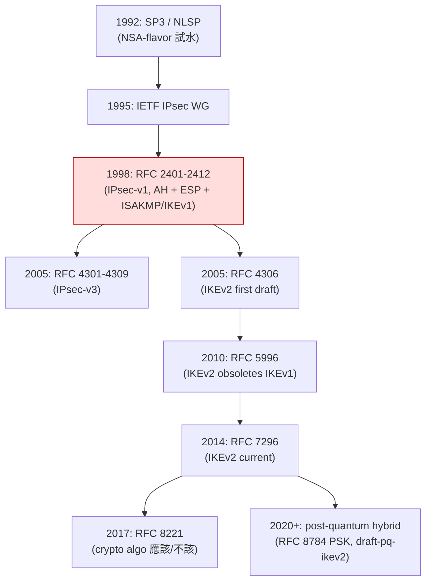
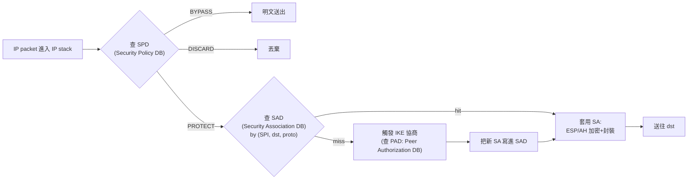
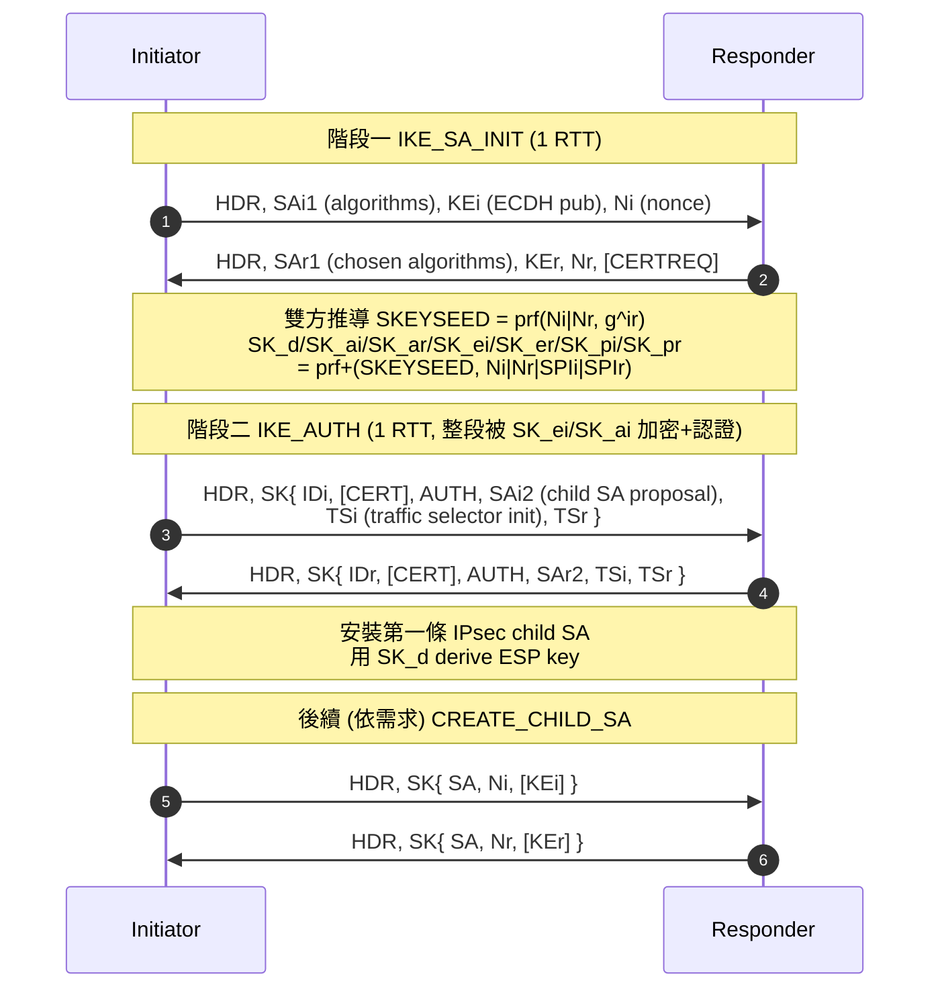

# 課堂 6.1 — IPsec 完整解剖：為什麼一個「真 VPN」變成 25 年配置噩夢

## 學前知道
- **前置課**：
  - [1.4 IP 層](../part-1-networking/1.4-ip-routing-graph.md)、[1.5 ARP/NDP/DHCP](../part-1-networking/1.5-arp-ndp-dhcp.md)（理解 IP packet 結構）
  - [3.2 對稱加密與 AEAD](../part-3-cryptography/3.2-symmetric-aead.md)（理解 ESP 為什麼要 AEAD 而不是 encrypt-then-MAC 或 encrypt-only）
  - [3.6 Key Exchange](../part-3-cryptography/3.6-key-exchange.md)（IKE 就是 DH 上面套了 30 年的政治產物）
  - [3.15 形式化驗證](../part-3-cryptography/3.15-formal-verification.md)（為什麼 IPsec 沒有任何 holistic 證明）
- **預計閱讀時間**：60~80 分鐘（這堂課故意寫長，因為 IPsec 是後續所有 VPN 的對照組）
- **必讀規格 / 論文**：
  - **RFC 4301**（Security Architecture for the Internet Protocol，IPsec-v3 主架構）
  - **RFC 4302**（AH）、**RFC 4303**（ESP）
  - **RFC 7296**（IKEv2 主規格，併入後續 7427/7634/8019 等）
  - **Bellovin 1996** *Problem Areas for the IP Security Protocols*（USENIX Security '96）
  - **Paterson & Yau 2006** *Cryptography in Theory and Practice: The Case of Encryption in IPsec*（Eurocrypt 2006）
  - **Degabriele & Paterson 2007** *Attacking the IPsec Standards in Encryption-only Configurations*（IEEE S&P 2007）
  - **Felsch et al. 2018** *The Dangers of Key Reuse: Practical Attacks on IPsec IKE*（USENIX Security '18）
- **必讀原始碼**：
  - Linux kernel `net/xfrm/`（IPsec 主框架）、`net/ipv4/esp4.c`、`net/ipv4/ah4.c`
  - **strongSwan**（IKEv2 reference 實作，~400k LoC，本堂只挑 `src/libcharon/sa/ikev2/keymat_v2.c` 與 `src/libcharon/sa/ikev2/tasks/ike_init.c`）

## 動機

我們進入 Phase II 的第一堂課，要先把所有後續 VPN / 翻牆協議的**對照組**講透。IPsec 是 1995 年 IETF IPsec WG 啟動、1998 年第一版 RFC 系列（RFC 2401~2412）落地的「真 VPN 之祖」。它在學術圈、企業、ISP、衛星鏈路、行動電信核網（3GPP IPUPS）都仍然是事實標準。

但對我們研究新 SOTA 翻牆協議的目標來說，IPsec 是**反面教材**：

1. **複雜度爆炸** → attack surface 大 → 形式化驗證困難。WireGuard 全部 ~4000 行 kernel code，strongSwan ~400k 行，相差 **100×**。
2. **協商一切** → downgrade attack 永遠存在。Logjam（CVE-2015-4000）告訴我們「ciphersuite negotiation」的代價有多大。
3. **NAT traversal 是貼補丁** → 原始設計沒考慮 NAT，後來用 UDP encapsulation（RFC 3948）和 NAT-T discovery 救火。
4. **規格寫得允許 encryption-only ESP** → 直接造成 Degabriele-Paterson 2007 的 ciphertext-only attack。
5. **GFW 對 IKE/ESP 的識別輕而易舉** → UDP 500/4500 + 固定 IKE header magic + 固定 SPI 模式，在 [Part 9.3 GFW 對 VPN 協議的封鎖] 會展開。

所以：學 IPsec 不是要「學會配置 strongSwan」，而是要學「**為什麼一個設計-by-committee、把所有 RFC 都做成 modular 的安全協議**，最後變成連大廠 (Cisco/Huawei/Juniper) 都會中招的災難」。Part 6.3 起學 WireGuard，你會立刻看到 Donenfeld 把這條路反過來走的選擇邏輯。

---

## 核心概念

### 1. IPsec 的歷史與政治背景（為什麼這麼亂）



幾個必須先理解的事實：

- **IPsec WG 同時要服務三批使用者**：(a) ISP 路由器之間的 site-to-site VPN、(b) 企業 remote access、(c) 行動裝置（IKEv2 的 MOBIKE, RFC 4555）。每一群有不同的威脅模型與性能假設。妥協的結果是「所有模式都支援」。
- **AH 與 ESP 並存的歷史包袱**：AH（RFC 4302）做「整個 IP 封包的 integrity 包含 outer header」，ESP（RFC 4303）只做 payload 的加密+認證。AH 在 NAT 後天生壞掉（因為 outer IP header 會被 NAT 改寫，integrity check 必然失敗），實務上幾乎沒人用，但規格還保留。
- **IKEv1 與 IKEv2 不相容**。IKEv1 有 Main Mode（6 訊息）、Aggressive Mode（3 訊息但洩漏 identity）、Quick Mode（後續 SA 協商）。IKEv2 重新設計成 IKE_SA_INIT（2 訊息）+ IKE_AUTH（2 訊息）+ CREATE_CHILD_SA（後續），但**v1 與 v2 共享同一組長期密鑰**這件事正是 Felsch et al. 2018 攻擊的入口。

> **研究級觀察**：Bellovin 1996 USENIX Security `Problem Areas for the IP Security Protocols` 在 IPsec 還沒落地前就警告：AH 與 ESP 的 anti-replay 視窗、IP fragmentation 與 IPsec 互動、ICMP 經過 IPsec 後語義不明 ——**每一條警告 25 年後依然成立**。Donenfeld 設計 WireGuard 時把 Bellovin 1996 與 Ferguson-Schneier 2003 *A Cryptographic Evaluation of IPsec* 當作「IPsec 不要做什麼」的清單。

### 2. IPsec-v3 架構：SAD / SPD / PAD



**三張表**：
| 縮寫 | 全名 | 內容 | 大小（典型企業閘道） |
|---|---|---|---|
| **SPD** | Security Policy Database | 「(src, dst, proto, port) → BYPASS/DISCARD/PROTECT」規則 | 數百~數千 entry |
| **SAD** | Security Association Database | per-SPI 的「演算法、key、序號、視窗、生命期」 | 每對 peer 雙向 2 個 SA |
| **PAD** | Peer Authorization Database | 「這個 ID 可以用哪種 auth method」 | 數十~數百 entry |

**Security Association (SA)** 是 IPsec 最核心的抽象：一個**單向**的 (SPI, destination address, protocol) 三元組對應到一組密碼學參數（algorithm + key + IV state + replay window + lifetime）。一條雙向 tunnel 至少需要 2 個 SA。如果你 site-to-site VPN 連 100 對 peer，SAD 就有 200 個 SA。如果還跑 IKE rekey，瞬間飆到 400。

> **跟我們協議設計的關聯**：WireGuard 把 SAD/SPD/PAD 三張表**完全摺疊**成「peer 設定」一張表，每個 peer 只記 `(static_pk, AllowedIPs, endpoint)`。代價是失去 fine-grained policy，收益是配置從 O(SAD × SPD × PAD) 降到 O(peers)。我們設計 G6 時，這是必須做的取捨：要 IPsec 的彈性還是 WireGuard 的可審計。

### 3. ESP packet 結構（byte 級）

ESP（RFC 4303 §2）在 IP header 後面接這個結構：

| Offset | 欄位 | 大小 | 說明 |
|---|---|---|---|
| 0 | SPI | 4 bytes | Security Parameter Index，配合 dst IP + proto 查 SAD |
| 4 | Sequence Number | 4 bytes | anti-replay 用，per-SA 單調遞增（ESN 模式 64 位元） |
| 8 | IV / nonce | 0~16 bytes | 視演算法而定（AES-CBC 16, AES-GCM 8, ChaCha20-Poly1305 0 implicit） |
| 8+iv | Payload Data | 變動 | 原 IP packet（tunnel mode）或 transport payload（transport mode） |
| ... | Padding | 0~255 bytes | 對齊到 block 大小或 4 bytes |
| ... | Pad Length | 1 byte | 上述 padding 的長度 |
| ... | Next Header | 1 byte | 原 payload 的 protocol number（4=IPv4, 41=IPv6, 6=TCP...） |
| ... | ICV (Integrity Check Value) | 12~32 bytes | HMAC-SHA256-128 / AES-GMAC-128 / Poly1305-128 |

**兩個關鍵設計缺陷**：
1. **Encryption-only 模式合法**（RFC 4303 §3.2 允許 NULL authentication）。Degabriele-Paterson 2007 IEEE S&P 利用這個漏洞，做出**ciphertext-only attack**：對 RFC-compliant 的 encryption-only ESP，只要能 eavesdrop + 注入封包，就能在 O(2^16) 次查詢內把 inner payload 還原。攻擊原理是利用 IP/TCP/ICMP 對 malformed header 的差異化錯誤回應作 padding-oracle。
2. **Next Header 在尾巴**（不是頭部）。為了不洩漏被加密的 protocol type，設計成最後一 byte。但 Pad Length 與 Next Header 都在 ICV 之外（早期版本，後修），意味著「authenticate-then-decrypt」做不對就會出事——這正是 Paterson-Yau 2006 攻擊 Linux 實作的入口。

> **研究級觀察**：Bellare-Namprempre 2000（[3.2 已讀](../part-3-cryptography/3.2-symmetric-aead.md)）證明 `Encrypt-then-MAC` 是唯一安全的 generic composition。IPsec 早期允許 `MAC-then-Encrypt`、`Encrypt-only`、`Encrypt-and-MAC`，每一種都有人實作，每一種都有人攻擊。WireGuard 直接寫死 AEAD（ChaCha20-Poly1305），徹底斷後路。

### 4. AH 為什麼還活著？

AH（Authentication Header，RFC 4302）只做 integrity，不做 confidentiality。它的**獨特賣點**：保護 outer IP header 的某些不可變欄位（version, header length, packet length, TOS/DSCP[原版], source/dest address, ICV 之外的 options）。

問題：
- **AH 與 NAT 互斥**。NAT 改 source/dest IP，AH ICV 必爆。
- **AH 與 IPv6 extension header** 的互動規格極不清晰。RFC 4302 §3.3.3 花了 5 頁解釋「mutable / immutable / mutable-but-predictable」三類欄位怎麼處理，幾乎沒人實作對。
- **ESP 已支援整段 integrity**（透過 AEAD），AH 多此一舉。

實務：**99% 的 IPsec deployment 只用 ESP，AH 純粹是規格遺產**。但你讀 strongSwan 源碼仍會看到 `src/libcharon/sa/ipsec/ipsec.c` 裡對 AH 的完整支援。這是 IPsec「設計不淘汰」哲學的代價。

### 5. IKEv2 完整握手（單一場景：PSK + ECDH）



**幾個被忽略的細節**：

1. **`SK_d` 是「derive child SA key 的母鑰」**。它**從不離開 IKE SA**。每次 CREATE_CHILD_SA 都用 `prf+(SK_d, Ni|Nr [|g^ir])` 推導新 SA key。如果攻擊者拿到 `SK_d`，所有後續 child SA 都完蛋（除非啟用 optional fresh DH，這是另一個配置選項）。

2. **`AUTH` payload 的計算是 IKE 最容易出錯的部分**。它對「整段第一封 IKE_SA_INIT 封包 || Nr || prf(SK_pi, IDi)」做 PRF。實作者經常把 hash 範圍弄錯，導致 cross-version replay。Felsch 2018 攻擊的入口之一就是「IKEv2 RSA signature 使用的 hash 值能被 IKEv1 RSA encryption 模式的 Bleichenbacher oracle 解出」。

3. **`SAi1` 是 ciphersuite proposal**。Initiator 列「我支援 AES-256-CBC + HMAC-SHA1, AES-128-GCM, ...」，Responder 挑一個。**這就是 downgrade attack 的天堂**：如果 responder 接受 weak option，MITM 即可剝掉強選項只留弱的。IKEv2 規格說 SA1 包進 AUTH 的 hash 範圍以防 tamper，但**實作不一定都做對**。

> **跟我們協議設計的關聯**：WireGuard 完全刪除這個 negotiation。spec v1 就是 `Curve25519 + ChaCha20-Poly1305 + BLAKE2s + Noise IK`，沒有 proposal，沒有 ciphersuite。要換密碼學？發 v2 protocol，不向後相容。這個極端選擇的代價是 cryptographic agility 失去，**收益是 downgrade attack 在設計層面被消滅**。Part 11.4 設計 G6 時，我們要不要學？答案大概是「學，但需要某種 PQ migration plan」——這是 Part 3.11 已伏筆的問題。

### 6. NAT-T 補丁：UDP encapsulation

原始 ESP 是 IP protocol 50（不是 UDP/TCP）。NAT 路由器看到 protocol 50 通常直接丟，因為它沒有 port 可以 demux。

解法（RFC 3947/3948）：把整段 ESP 包進 UDP port 4500。NAT-T detection 在 IKE_SA_INIT 階段透過 `NAT_DETECTION_SOURCE_IP` / `NAT_DETECTION_DESTINATION_IP` notify payload 完成。如果偵測到 NAT，後續通訊：

```text
[IP] [UDP src=4500 dst=4500] [ESP-in-UDP marker (4 bytes 0)] [ESP packet]
```

**為什麼這對 GFW 是禮物**：UDP/4500 是 IANA 註冊 port，IKE/IPsec 流量的 well-known signature；外加 ESP-in-UDP 開頭固定有 4 bytes 0 marker，**極易識別**。實際上 GFW 阻擋 IPsec 多年，企業 VPN 在中國境內幾乎全部失效（除非走專線）。

> **研究級觀察**：這也是為什麼 WireGuard 選 UDP（不是 protocol 50），可以走任何 UDP port，且 packet 第一 byte 是 message_type（1/2/3/4）而不是固定 magic——一個簡單到讓人感動的設計選擇，正是為了不重蹈 IPsec 覆轍。但**WireGuard 仍然有自己的 fingerprint problem**（[6.7 詳講](6.7-wireguard-blocked-china.md)）。

### 7. 攻擊面總覽（為什麼 IPsec 是密碼學考古現場）

| 年份 | 攻擊 | 影響範圍 | 修補方式 |
|---|---|---|---|
| 1996 | Bellovin USENIX Sec：anti-replay 視窗、fragmentation、ICMP 互動 | 設計層警告 | 後續 RFC 補丁 |
| 2003 | Ferguson-Schneier 評估：IPsec 太複雜 | 設計批評 | 部分由 IPsec-v3（RFC 4301）回應 |
| 2006 | Paterson-Yau Eurocrypt：Linux 實作的 encryption-only ESP | Linux 2.6.x | Linux patch |
| 2007 | Degabriele-Paterson S&P：**規格層級**的 encryption-only ESP 攻擊 | 所有 RFC-compliant impl | RFC 7321/8221 改成「必須有 ESP integrity」 |
| 2010 | Degabriele-Paterson CCS：MAC-then-Encrypt 模式不安全 | 規格層 | 規格修訂 |
| 2014 | Snowden 文件揭露 NSA 對 IPsec 的廣泛能力 | 政治層 | 推動 RFC 7321 → 8221 演算法清單 |
| 2018 | Felsch et al. USENIX Sec：跨版本 key reuse + Bleichenbacher | Cisco/Huawei/Clavister/ZyXEL（4 CVE） | vendor 個別 patch |
| 2024 | TunnelVision (CVE-2024-3661, Leviathan)：DHCP option 121 注入 + ICMP/route 旁路 | 所有 IP-layer VPN 包含 IPsec | 缺乏跨平台修補方案 |

**結構性問題**（為什麼這麼多攻擊都針對 IPsec）：
1. **規格允許不安全選項**（encryption-only ESP, weak DH groups, RSA-encrypted nonces）。  
2. **配置複雜**到 vendor 預設經常選錯。  
3. **演算法協商**讓 downgrade 永遠是攻擊面。  
4. **跨版本共享 key material**（IKEv1 vs IKEv2 用同把 RSA key）違反「不同 protocol 不共享 long-term key」原則。

> **研究級補充**：Felsch et al. 2018 是密碼工程史上最漂亮的攻擊之一。Bleichenbacher 1998（[3.4 已讀](../part-3-cryptography/3.4-rsa.md)）的 PKCS#1 v1.5 padding oracle 本來只破 TLS，他們發現 IKEv1 在 "Public Key Encryption" auth mode 下，responder 對解密失敗的 INVALID_KEY_INFORMATION notify 訊息**回應時間有差**——就是個 Bleichenbacher oracle。配合 IKEv2 RSA signature 重用同一把 RSA key，等於用一個 IKEv1 oracle 破 IKEv2 認證。**這個攻擊存在了 20 年沒人發現**——因為沒人會去交叉檢查兩個版本協議的安全性互動。

### 8. 為什麼 IPsec 沒有 holistic 形式化證明

[3.15 形式化驗證](../part-3-cryptography/3.15-formal-verification.md) 已提到：要對協議做完整 ProVerif/Tamarin 證明，protocol 必須**簡單且行為有限**。IPsec 的問題：

- **狀態空間爆炸**。每個 SA 都有 lifetime/rekey/cookie/NAT-T 等狀態。Tamarin 跑 IPsec 全模型至今沒成功。
- **規格多義**。RFC 7296 允許 N 種 auth method、M 種 cipher，互動由實作決定。ProVerif 沒辦法對「實作差異」建模。
- **既有結果都是局部**。Cremers 2011 用 Scyther 對 IKEv2 main mode 做了 trace property check，但只覆蓋 PSK + Auth-method=Signature 一條路徑。

對比：WireGuard 有 Donenfeld 自己用 Tamarin 做的形式化驗證，Lipp-Beurdouche-Blanchet-Bhargavan 2019 EuroS&P 用 F* + ProVerif 做了**機器檢驗的 computational 證明**。差距 = 設計簡潔的紅利。

---

## 與我們協議設計的關聯

到 Part 11 設計 G6（我們的新 SOTA 協議）時，IPsec 給我們的清單：

**「絕對不做」清單**：
1. ❌ 不要 ciphersuite negotiation（消除 downgrade，固定 PQ-hybrid + ChaCha20-Poly1305）。
2. ❌ 不要 protocol version sharing key material（每個 spec major version 一把 new key）。
3. ❌ 不要 encrypt-then-MAC / MAC-then-encrypt 古典模式，只用 AEAD。
4. ❌ 不要 SAD/SPD/PAD 三層分離 policy database，摺疊成「peer 設定」。
5. ❌ 不要 AH 這種「為了規格優雅而沒人用」的選項。
6. ❌ 不要把 NAT-T 當補丁（從 day 1 假設 UDP-only）。

**「謹慎吸收」清單**：
1. ✅ Anti-replay window（per-SA 64-bit sequence number + sliding window）。WireGuard 直接抄。
2. ✅ Tunnel mode vs transport mode 的概念（但我們可能只實作 tunnel）。
3. ✅ Lifetime / rekey 機制（時間 + bytes 雙閾值）。
4. ✅ Traffic selector（哪些 src/dst 走 tunnel）—— 但要極簡化（WireGuard 的 AllowedIPs 即可）。

**為什麼這堂課必須先講**：你接下來讀 WireGuard whitepaper 時，會發現 Donenfeld 每一個設計決定都在「打 IPsec 的臉」。沒有 IPsec 對照組，你看不出 WireGuard 的智慧；有了 IPsec 對照組，WireGuard 4000 行 kernel code 是必然。

---

## 動手（可選）

### 實驗 6.1.A：用 strongSwan 跑一條 site-to-site IPsec，抓包看 ESP

在兩台 Linux VM（建議 OrbStack）上裝 strongSwan：

```bash
# host A (10.0.0.1)
sudo apt install strongswan
cat > /etc/swanctl/conf.d/test.conf <<EOF
connections {
    test {
        remote_addrs = 10.0.0.2
        local {
            auth = psk
            id = a@example
        }
        remote {
            auth = psk
            id = b@example
        }
        children {
            ts {
                local_ts  = 10.0.0.1/32
                remote_ts = 10.0.0.2/32
                esp_proposals = aes256gcm16-prfsha256-modp2048
            }
        }
        version = 2
    }
}
secrets {
    ike-test {
        id-a = a@example
        id-b = b@example
        secret = "shared-secret-do-not-use-in-prod"
    }
}
EOF
sudo swanctl --load-all
sudo swanctl --initiate --child test

# 抓包
sudo tcpdump -i any -nn 'udp port 500 or udp port 4500 or proto esp' -w ipsec.pcap
```

用 Wireshark 開 `ipsec.pcap`，逐 byte 看 IKE_SA_INIT、IKE_AUTH，然後看 ESP 怎麼包 inner IP。**關鍵練習**：找出 SPI、Sequence Number、ICV 在哪幾個 byte。

### 實驗 6.1.B：故意設定 weak ciphersuite，看 strongSwan 是否拒絕

把 `esp_proposals` 改成 `null` 或 `des-md5`，重啟。觀察 strongSwan log。**研究問題**：規格允許 vs 實作允許的差距在哪？這正是 Degabriele-Paterson 攻擊與 vendor 預設的拉鋸。

### 實驗 6.1.C（推薦）：對著 RFC 7296 §1.2 的 IKE_SA_INIT/IKE_AUTH 圖，把你抓的封包逐欄位標出來。

這是判斷你是否真的「讀懂」IPsec 的標準。一小時內標完 = 你會了；超過兩小時 = 還要再讀一遍 RFC。

---

## 自我檢查

1. SAD 與 SPD 的職責差別是什麼？為什麼 IPsec 要把它們分開？WireGuard 怎麼摺疊？
2. ESP 與 AH 的設計目的差異？為什麼 AH 在 NAT 時代被冷凍？
3. IKEv2 IKE_SA_INIT 為什麼一定要 2 訊息而不能 1 訊息？提示：思考 cookie + DDoS 防護。
4. 若 IKEv2 的 `AUTH` payload 計算範圍漏掉 `SAi1`，能形成什麼攻擊？
5. Felsch et al. 2018 攻擊的本質是什麼？為什麼「跨版本共享 long-term key」是密碼工程的紅線？
6. 如果一個 RFC 允許 encryption-only ESP，這在規格層級違反了哪個 [3.2 已讀](../part-3-cryptography/3.2-symmetric-aead.md) 的定理？

---

## 延伸閱讀

- **書**：Kaufman, Perlman, Speciner *Network Security: Private Communication in a Public World* (2nd ed., 2002) — IPsec 設計者親述。
- **規格**：Frankel, Krishnan *IP Security (IPsec) and Internet Key Exchange (IKE) Document Roadmap* (RFC 6071) — 把 60+ 個 IPsec 相關 RFC 串成一張地圖。
- **論文**：Cremers 2011 *Key Exchange in IPsec Revisited: Formal Analysis of IKEv1 and IKEv2*（ESORICS）— Scyther 對 IKE 的局部證明。
- **原始碼**：Linux `net/xfrm/xfrm_policy.c`（SPD lookup 與 cache）、`net/ipv4/esp4.c`（ESP encapsulation 與 GRO 整合）。
- **GFW 視角**：[Part 9.3] 會展開 GFW 對 IPsec/IKE 流量的識別與封鎖機制。

---

## 研究級補遺

### 1. 學界詞彙

- **SA (Security Association)** vs **CHILD_SA**：IKE SA 是「協商管道」的 SA，CHILD_SA 是 ESP/AH「資料管道」的 SA。一個 IKE SA 可以管理多個 CHILD_SA。
- **PFS (Perfect Forward Secrecy)** in IKE = 每次 CREATE_CHILD_SA 都做新 DH。在 IKEv2 是 optional，看實作是否啟用（strongSwan 預設 on）。注意 PFS 在學術圈逐漸被 **FS (Forward Secrecy)** 取代，"perfect" 字眼被認為誤導；論文裡兩者通用。
- **KCI (Key Compromise Impersonation)**：對手取得 victim 的 long-term private key 後，能否冒充**別人**對 victim 通訊。IKEv2 標準 PSK 模式對 KCI 脆弱；signature 模式可抵抗。
- **MOBIKE** (RFC 4555)：行動裝置切換網路時保持 IPsec SA 不重新協商的擴充。
- **Childless IKE SA**：CREATE_CHILD_SA 失敗或被刻意延後時 IKE SA 仍存活。RFC 6023 規範。

### 2. 對手分類學 / 威脅模型精化

對 IPsec 的攻擊者可分：
| 等級 | 能力 | 對 IPsec 的後果 |
|---|---|---|
| **passive on-path** | 只能 eavesdrop | 看到 IKE/4500 流量存在 → trivial **VPN 存在性洩漏**；無法解密（若 AEAD） |
| **active on-path** | 可改寫 packet | 可能觸發 Degabriele-Paterson 2007 padding oracle（若 encryption-only） |
| **adaptive chosen-ciphertext** | 可注入精心構造的 ESP | Felsch 2018 等 |
| **server impersonator** | 假冒 responder | 在 PSK weak、ciphersuite weak 場景下可能成功 |
| **nation-state with cipher break** | 量子或 implementation backdoor | Snowden 文件指出 NSA 對 IPsec 的能力遠超公開研究 |

[Part 9.3] 會把 GFW 放進這個矩陣的特定格子（active on-path + 完整 router 控制 + 有限計算資源）。

### 3. 形式化定義

**IKEv2 key exchange 的 game-based 安全性目標**（Cremers 2011 用詞）：
- **Aliveness**: A 完成 protocol 後，B 確實參與過（recently）。
- **Weak agreement**: A 同意 transcript T 後，B 也同意過 transcript T（雖然不一定同一個 session）。
- **Injective agreement**: 1-to-1 mapping。
- **Session key indistinguishability** (real-or-random)。
- **Forward secrecy**: 即使 long-term key 之後洩漏，過去 session key 仍隨機。

IPsec 的問題是規格允許的某些組合（例如 PSK + Aggressive Mode IKEv1）連 weak agreement 都不滿足。

### 4. 領域的關鍵論文 / 規格 / 原始碼

| 文獻 | 為何追 | 之後在哪精讀 |
|---|---|---|
| RFC 4301 (IPsec arch) | 主架構規格 | 本堂 |
| RFC 4303 (ESP) | 資料格式規格 | 本堂 |
| RFC 7296 (IKEv2) | 控制協議規格 | 本堂 |
| Bellovin 1996 | 設計時代的警告 | 本堂、[Part 11.3 威脅模型] |
| Paterson-Yau 2006 | Linux 實作缺陷 | 本堂 |
| Degabriele-Paterson 2007 | 規格層攻擊 | 本堂 |
| Felsch et al. 2018 | 跨版本 key reuse 攻擊 | 本堂 |
| Cremers 2011 ESORICS | IKE 局部形式化 | [Part 5.6 Tamarin] 已伏筆 |
| RFC 8784 | post-quantum PSK for IKEv2 | [Part 3.11 PQC] |
| Linux `net/xfrm/` | reference 實作 | 本堂 + [6.6 TUN 整合對比] |

### 5. 我們協議的座標 / 設計取捨

G6 設計空間中，本堂收窄的選項：
- **協商**：**off**（學 WireGuard）。
- **協議分層**：**控制 + 資料合一**（學 WireGuard，不像 IKE+ESP 分離）。
- **AEAD**：**hard-code**（學 WireGuard）。
- **NAT traversal**：**UDP-only 預設**（學 WireGuard）。
- **狀態管理**：**peer-based**（學 WireGuard，不要 SAD/SPD/PAD）。

仍 open（後續 Part 處理）：
- ❓ 反審查混淆策略（IPsec/WireGuard 都不做）→ [6.7 WireGuard 為何被打]、[Part 7] 翻牆協議演化。
- ❓ Multipath / migration（IPsec MOBIKE vs QUIC connection migration）→ [Part 8.x QUIC 系協議]。

### 6. 必追資源 / 社群入口

- **IETF IPSECME WG**：https://datatracker.ietf.org/wg/ipsecme/ — 目前 active 議題包含 PQ-IPsec、IKEv2 effiency。
- **strongSwan mailing list**：reference 實作的 design review 都在這。
- **Linux netdev**（XFRM 維護者活躍的地方）：https://lore.kernel.org/netdev/
- **GFW.report**：對 IPsec/IKE 的封鎖事件記錄。

### 7. 開放問題（research-level）

1. **IPsec 整體 holistic 機器驗證至今未達成**。能否用 Tamarin/ProVerif + 模型抽象，覆蓋至少 50% 的 RFC 7296 allowed states？這是 PhD 級題目。
2. **IKEv2 PQ migration**（draft-pq-ikev2）的 KEM hybrid 構造，能否避免 1996 Bellovin 警告過的 fragmentation 問題？KEM 公鑰常 >1KB，IKE_SA_INIT 大概率 IP fragment，遇到 GFW 對 fragmented UDP 的策略會有麻煩。
3. **量化分析 IPsec 演算法演進**：從 1998 到 2026，RFC 7321/8221 把哪些算法從 MUST 降到 SHOULD NOT？這個演進速度跟 TLS（[Part 4.1](../part-4-tls-quic/4.1-tls-history-bloodshed.md)） 對比有沒有可量化的 lessons learned？
4. **TunnelVision (CVE-2024-3661)** 揭露 IPsec 在 routing table 層級的旁路。能否在 protocol 層解決，還是必然需要 OS-level 配合？這對我們 G6 的 TUN 整合是 immediate question。

---

**下一堂**：[6.2 OpenVPN 完整解剖](6.2-openvpn-anatomy.md) — 看另一條技術路線（在 TLS 上重建 VPN）為什麼也敗給 IPsec、又輸給 WireGuard。
