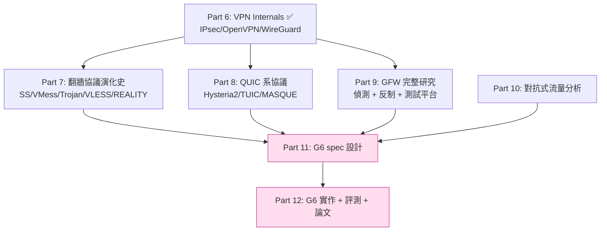

# 課堂 6.10 — WireGuard 給我們的啟示：Part 6 綜合與 G6 設計清單

## 學前知道
- **前置課**：[6.1](6.1-ipsec-anatomy.md)~[6.9](6.9-wireguard-linux-kernel.md) **全部讀完**。本堂是綜合，沒讀過前 9 堂沒法繼續。
- **預計閱讀時間**：40~60 分鐘
- **必讀**：無新材料，全是 [6.1-6.9] 已 cite 的論文與 source code

## 動機

Part 6 從 IPsec 開始（[6.1]）、經過 OpenVPN（[6.2]）、深入 WireGuard 的 spec（[6.3]）、3 堂原始碼（[6.4-6.6]）、討論為什麼被 GFW 打（[6.7]）、看 Cloudflare Rust 實作（[6.8]）、再到 kernel impl（[6.9]）。

到此你已具備：
1. 對「**真 VPN**」（線 A：IPsec/OpenVPN/WireGuard）的端到端理解。
2. 對「**WireGuard byte-level + line-level**」的精確掌握——可以閱讀並 patch wireguard-go / amneziawg-go / BoringTun / kernel WG。
3. 對「**為什麼 WireGuard 在抗審查維度不夠**」的明確認知。

本堂把這些拆成**G6（我們的新 SOTA 翻牆協議）設計清單**——這是進入 Part 7~9 之前的座標系。Part 7（翻牆協議演化史）會把這份清單與 SS/VMess/Trojan/VLESS/REALITY/Hysteria 的設計選擇對照；Part 11（spec 設計）會直接用這份清單作為起點。

---

## 核心概念

### 1. 三條技術路線的並排對照

| 維度 | IPsec | OpenVPN | WireGuard | **G6 目標** |
|---|---|---|---|---|
| 設計年代 | 1995-2014 | 2001-持續 | 2017-持續 | 2026-持續 |
| 規格複雜度 (LoC equiv) | ~150 RFC, 數百選項 | 自定 + TLS | 1 spec + Tamarin proof | 1 spec + ProVerif + Tamarin |
| Reference impl LoC | strongSwan ~400k | OpenVPN ~120k | WG-go ~10k / kernel ~4k | **G6-go ≤ 15k, G6-rs ≤ 12k** |
| KE | IKEv1/v2 + negotiation | TLS (full stack) | Noise IKpsk2 (hard-coded) | **Noise-style + KEM-hybrid (hard-coded)** |
| AEAD | 多 options (含 NULL!) | 多 options | ChaCha20-Poly1305 only | **ChaCha20-Poly1305 only** |
| 身分隱藏 | optional Aggressive Mode 洩漏 | TLS cert 洩漏 SNI | initiator static_i 加密 | **+ responder identity 借殼 (REALITY)** |
| Probe resistance | 無 | 弱（reset reply） | MAC1 (假設 server pk secret) | **無條件 probe resistance** |
| Active 對抗 | 完全不抗 | Xue 2022 死刑 | Wu 2023 適用 | **day-1 抗 entropy + size + timing** |
| Forward secrecy | optional PFS | TLS 提供 | rekey-based PCS | **強 PCS + cover traffic** |
| PQ readiness | RFC 8784 PSK | 無 | optional PSK | **強制 X25519 + ML-KEM-768 hybrid** |
| Formal verification | 局部 (Cremers 2011) | 無 | 全 (Donenfeld + Dowling + Lipp) | **CryptoVerif + Tamarin day-1** |
| Performance (Linux user-space) | 700 Mbps | 260 Mbps | 1000 Mbps | **≥ 700 Mbps with PQ + cover** |
| Mobile readiness | 弱 | 弱 | Wireguard.app 強 | **library-first like BoringTun** |
| Kernel readiness | mainline | 無 | mainline 5.6+ | **post-Phase III port plan** |
| 配置複雜度 | 數百選項 | 數百選項 | (peer pk, AllowedIPs, endpoint) | **同 WG 級** |

### 2. G6 設計清單（按優先級）

#### Priority 1：spec 層 hard constraints（**day-1 必須寫進 RFC**）

1. **Hard-coded ciphersuite**：`Noise-G6_X25519+MLKEM768_ChaCha20Poly1305_BLAKE2s`（或同等）；無 negotiation。
2. **Hybrid KEM**：每次 handshake 同時做 X25519 與 ML-KEM-768；要破要兩個都破。
3. **Probe resistance**：對 any probe（含 known server pk）的 response 計算上 indistinguishable from generic server。
4. **First-byte entropy uniform**：第一 byte 不能透露 protocol identity；過 Wu 2023 entropy test。
5. **Handshake message size variable**：MTU-fill padding，無 size fingerprint。
6. **Transport header encrypted**：type/cid/counter 在 AEAD 內。
7. **AEAD-only**：spec **禁止** encryption-only 或 MAC-then-Encrypt 選項。
8. **Per-protocol version key isolation**：v2 spec 不重用 v1 key material（防 Felsch 2018-class）。
9. **TAI64N replay timestamp**：沿用 WG。
10. **64-bit per-direction counter + 1024-bit sliding window**：沿用 WG。

#### Priority 2：anti-censorship 增強

11. **REALITY-style server identity 借殼**（[Part 7.10](../part-7-proxy-protocols/) 詳述）：handshake 偽裝成 inbound TLS 到 fronting domain。
12. **Cover traffic policy**：idle 時送統計上不可區分 cover；spec 給出 rate 與 size 分布規則。
13. **Padding policy**：每封 transport packet padding 到 MTU（或符合特定 distribution）。
14. **Multiple transport modes**：plain UDP / QUIC-borrow / HTTP/2-borrow / WebSocket-borrow，由 deployment 決定。
15. **Path validation**：roaming 時用 QUIC-style PATH_CHALLENGE 驗證新 endpoint，防 spoof redirect。

#### Priority 3：performance

16. **Sans-IO core**（學 BoringTun）：core protocol logic 不做 I/O。
17. **GSO/GRO 整合**（學 wireguard-go 進化）：Linux 5.0+ UDP segmentation/aggregation。
18. **Per-CPU worker affinity**（學 kernel）：thread-pinning 對 throughput-bound 場景。
19. **Pre-computed static-static DH**（學 WG）：handshake cold path 加速。
20. **In-place AEAD encrypt/decrypt**：零拷貝。

#### Priority 4：implementation 多樣性與形式化

21. **At least 2 user-space impl**（Go + Rust），byte-identical output（differential testing）。
22. **CryptoVerif spec written day-1**：每個 spec 修訂都重跑驗證。
23. **Tamarin model** for symbolic property（mutual auth, FS, KCI）。
24. **F\* / Verus mechanised verification** for at least core handshake state machine。
25. **Test vectors public**：每次 spec 修訂發 new test vectors。

#### Priority 5：deployment & ecosystem

26. **C ABI FFI surface**：mobile binding 友善。
27. **Netlink-style structured UAPI**：不要 ad-hoc text protocol。
28. **Audit-friendly module layout**：學 kernel WG 的 cleanly-separable files。
29. **No backwards compat 在 major version**：學 WG「v2 = 新 spec」。
30. **Public docs from day-1**：spec + threat model + 設計 rationale 全 markdown 公開。

### 3. 「絕對不做」清單（Part 6 的反面教材總結）

從 IPsec 學到：
- ❌ ciphersuite negotiation（→ Logjam/Felsch）
- ❌ 跨 protocol/version 共享 long-term key
- ❌ MAC-then-Encrypt / Encrypt-only
- ❌ AH-style 「規格優雅但沒人用」選項
- ❌ NAT-T 當補丁
- ❌ SAD / SPD / PAD 三層分離

從 OpenVPN 學到：
- ❌ Opcode 在 AEAD 外
- ❌ TLS 直接外露（OpenSSL bug surface）
- ❌ Server 對 unknown probe 回應任何內容
- ❌ TCP-over-TCP（head-of-line blocking）
- ❌ 百餘配置選項

從 WireGuard 學到（我們即將超越的）：
- ❌ First byte = type constant
- ❌ Handshake message size 寫死
- ❌ Server static pk 作為 probe-resistance gate
- ❌ Transport header 明文
- ❌ 16-byte multiple padding 弱

### 4. 從 [6.1-6.9] 推導的核心抽象

#### Abstraction 1: 「Identity Triple」

每個 peer 有三層 identity：

```
identity_static  : long-term public key (PQ-resistant via hybrid)
identity_session : per-session ephemeral
identity_outer   : envelope-level identity (TLS SNI / HTTP host)
```

**創新點**：outer identity 可以是任意 fronting domain（REALITY 思想擴展），inner identity 真正驗證 peer。**這是 G6 對「server identity 必然洩漏」假設的核心解法**。

#### Abstraction 2: 「Three Sizes」

封包 size 在 G6 規格層有三層：
```
inner_size  : 真實 user 載荷
transport_size : 加密 + padding 後（MTU-fill 或 distribution-sampled）
outer_size : envelope 後（TLS record 或 QUIC packet）
```

inner_size ≠ transport_size ≠ outer_size，**三者不能 trivially derivable**——這是流量分析抵抗的具體形式。

#### Abstraction 3: 「Threat Layered」

威脅模型按 layer 分離：
```
Crypto layer   : DDH / IND-CCA / collision resistance
Protocol layer : authentication / FS / replay / DoS
Identification layer : probe resistance / fingerprint
Traffic layer  : size / timing / cover
```

每一層獨立 reasoning + 各自 formal property。[Part 5.8 spec-first methodology](../part-5-formal-methods/5.8-spec-first-methodology.md) 已伏筆。

### 5. G6 spec structure（建議大綱，後續 Part 11 演進）

```
G6 Specification v0.1 (draft)

§1 Introduction
§2 Notation
§3 Cryptographic Primitives (hard-coded list)
§4 Threat Model (layered)
§5 Wire Format (with byte-level layout)
§6 Handshake Protocol
   §6.1 Outer Envelope (TLS-borrow / QUIC-borrow / plain)
   §6.2 Inner Noise-G6 (5 DH + 1 KEM)
   §6.3 Confirmation Message (Dowling-Paterson tweak)
§7 Transport Protocol
   §7.1 Header (encrypted)
   §7.2 Padding & Cover
   §7.3 Anti-replay
§8 Cookie / DoS (extended MAC1+MAC2 + outer-layer rate-limit)
§9 Timer State Machine (5 timers: WG's 4 + cover-traffic timer)
§10 Cryptokey Routing (extended for split-tunnel + outer identity)
§11 Probe Resistance Requirements (formal property)
§12 Security Considerations
   §12.1 Crypto layer
   §12.2 Protocol layer (referenced to CryptoVerif proof)
   §12.3 Identification layer (referenced to Tamarin model)
   §12.4 Traffic layer (cover traffic statistical property)
§13 Implementation Notes
§14 Test Vectors
§15 Migration & PQ Considerations
```

### 6. 從 Part 6 到 Part 7~12 的路徑



**Part 6 給 G6 的具體**：
- spec module layout（Identity Triple, Three Sizes, Threat Layered）
- AEAD + Noise + Hybrid KEM 的密碼學選擇
- Cryptokey routing + Anti-replay + Timer state machine 的 protocol 框架
- Implementation 多樣性策略

**Part 6 給 G6 的不夠**：
- 抗審查具體技巧（→ Part 7 REALITY 提供）
- 高速 UDP transport（→ Part 8 QUIC 系協議提供）
- GFW 偵測對抗（→ Part 9 GFW.report 群論文提供）
- 流量分析對抗（→ Part 10 Beauty/FlowPrint 等提供）

### 7. 對使用者（你）的具體建議

你（Icarus）現在能做的：
1. **Replay Part 6**：對每堂的「自我檢查」，紙筆答出來。答不出來那堂回頭再讀。
2. **架實驗環境**：兩台 Linux VM（OrbStack），跑 WG、AmneziaWG、OpenVPN（已被打的 baseline）。
3. **抓 pcap，做 fingerprint detection script**：實作 [6.7 §1] 的 6 條 fingerprint，看你能不能用 50 行 Python 識別 WG。
4. **讀 wireguard-go 與 BoringTun 真實 diff**：cherry-pick 一個 commit 試著理解 reviewer 在 push 什麼設計。
5. **準備進 Part 7**：開始接觸 SOCKS5（[7.1]）—— 雖然你 ccb 已在用，但 spec 級理解是 Part 7 的起點。

到 Part 12 結束，你應該能：
- 寫出 G6 spec v1.0（30+ pages, RFC-style）
- 寫出 g6-go reference impl（10000~15000 LoC Go）
- 寫出 GFW 測試平台（[Part 9.14] 詳述）
- 用 g6 跑通中國境內測試
- 寫出 ~30-page paper 投 USENIX Security 2027 / NDSS 2028

**Part 6 是這條路的第一座大山**。你已翻過去了。

---

## 與我們協議設計的關聯

本堂本身就是「與我們協議設計的關聯」總結。不重複。

直接行動項目（給後續 Part 用）：
- 把本堂的 30 條 G6 設計清單 commit 到 `notes/g6-design-checklist.md`，後續 Part 11 寫 spec 時逐項確認。
- 把「絕對不做」清單 commit 到 `notes/g6-antipatterns.md`。
- 在 [Part 11.1 設計目標](../part-11-design/) 開頭引用本堂結構。

---

## 動手（可選）

### 實驗 6.10.A：把本堂 §2 的 30 條清單抄到一張 1-page A4，貼在你 monitor 旁

每次寫 Part 7-12 lesson 時對照——確保沒違反清單。

### 實驗 6.10.B：對你目前 production-running 的 ccb（Clash）配置，按本堂清單 audit 一遍

- 它的 outbound protocol（VLESS / Hysteria / Shadowsocks）滿足幾條清單？
- 它最弱的維度是哪個？
- 如果 GFW 升級偵測，哪條會先死？

### 實驗 6.10.C：找 1 個 Part 6 沒涵蓋但你很好奇的 VPN 變種（如 Tailscale, Cloudflare WARP, ZeroTier），按本堂矩陣 §1 把它填進去

對比學到的設計選擇。**研究問題**：它對 Part 6 的「絕對不做」清單違反幾條？

### 實驗 6.10.D（推薦）：寫一份 1500-word essay 「為什麼 WireGuard 是 best-of-class spec design but unfit-for-purpose for anti-censorship」

這是 G6 paper introduction 的雛形。Part 12.20 寫 paper draft 時直接拿來改。

---

## 自我檢查

1. 不看本堂，列出 G6 spec 的 Priority 1（10 條 hard constraints）。能列出 ≥ 7 條算過關。
2. IPsec / OpenVPN / WireGuard 三條路線各為 G6 提供 1 條最重要的設計決策。哪三條？
3. 「Identity Triple」、「Three Sizes」、「Threat Layered」三個 abstraction 各自要解決什麼問題？哪個是 Part 6 完全沒提供解法的（要等後續 Part）？
4. 為什麼 G6 必須 day-1 寫 CryptoVerif spec？對應 [3.15] 與 [5.7] 的哪些觀點？
5. Part 6 給 G6 的「不夠」是 4 條。對應 Part 7-10 各補哪一條？
6. 你目前對 G6 spec 已能寫出多少 §（從 §1-§15）？哪些 § 需要等後續 Part 才能寫？

---

## 延伸閱讀

- Part 6 所有 cited papers 與 source code 重新 sweep 一次。
- 若有興趣：Linux netdev mailing list 對 WG 接受的歷史信件——讀 net-next maintainer 怎麼看 protocol upstream。
- Tailscale 的 founder Avery Pennarun 多篇 blog 對 WG 設計取捨的反思——是 WG 級別 protocol design 的優秀 secondary literature。

---

## 研究級補遺

### 1. 學界詞彙

- **Identity Triple / Three Sizes / Threat Layered**：本堂提出的 3 個 G6 設計抽象（**研究階段命名，可能在 Part 11 重新命名**）。
- **"Spec-first" methodology**（[5.8](../part-5-formal-methods/5.8-spec-first-methodology.md)）：spec → formal model → reference impl → test vectors 的設計順序。Part 11 全用此。
- **"Anti-pattern catalogue"**：把錯誤設計選擇彙整成清單，供未來 protocol 設計者避雷。Part 6 留下的最大研究價值之一。

### 2. 對手分類學 / 威脅模型精化

G6 要對抗的對手等級總結（Part 6 + 預讀 Part 9）：

| 等級 | 能力 | G6 需求 |
|---|---|---|
| L1: passive observer | 看流量 | confidentiality |
| L2: active MITM | 改流量 | mutual auth + replay |
| L3: passive DPI (byte/size) | Wu 2023 規則 | entropy uniform + size padding |
| L4: active prober (known endpoint) | Xue 2022 framework | probe resistance |
| L5: ISP-scale operator | 大量 IP 探測 | + outer identity 借殼 |
| L6: traffic analyzer | size/timing 序列 | cover traffic + size policy |
| L7: nation-state PQ-capable | 量子 + 商用 VPN purchase | hybrid PQ + REALITY-style |

**G6 必須對 L1-L7 全部 robust**。WireGuard 對 L1-L2 robust，L3-L7 各有缺陷。

### 3. 形式化定義

G6 的 ideal security goal（informal）：

> For all adversary A in classes {L1, ..., L7}, A's advantage in distinguishing a G6 session from {ideal encryption + ideal MAC + ideal cover protocol} is computationally negligible.

formalize 這條到 CryptoVerif 是 [Part 11.10](../part-11-design/) 與 [Part 12 implement](../part-12-implement-evaluate/) 的目標。

### 4. 領域的關鍵論文 / 規格 / 原始碼

不重複 [6.1-6.9] 的清單。新增引用：
- Tailscale 工程 blog 系列（secondary literature）
- Cloudflare WARP design talks（commercial deployment lessons）
- IETF MASQUE WG draft（HTTP/3-based VPN, [Part 4.10 已伏筆](../part-4-tls-quic/4.10-http3-and-masque.md)）
- Apple Private Relay design notes

### 5. 我們協議的座標 / 設計取捨

到本堂為止，G6 的設計座標：

```
G6 = (WireGuard's spec discipline)
   + (BoringTun's sans-IO + FFI)
   + (Linux kernel WG's per-CPU performance)
   + (REALITY's probe resistance via borrowing)
   + (PQ-WireGuard's hybrid KEM)
   + (QUIC's path validation + connection ID)
   + (Cover traffic + size padding from Part 10)
```

**沒有任何單一現有 protocol 滿足全部**。這是 G6 的研究價值——**整合既有最佳實踐 + 補足 anti-censorship/PQ 的 spec gap**。

### 6. 必追資源 / 社群入口

- IETF MASQUE WG / WireGuard Mailing List / GFW.report 等已列出
- Apple WWDC sessions on Network Extension Framework
- Cloudflare WARP design talks
- Tailscale blog
- Signal Protocol mailing list（雖然 Signal 不是 VPN，但 Identity Triple 與 ratcheting 思想相關）

### 7. 開放問題（research-level）

Part 6 留下未答的 6 個 open problem，將由 Part 7-10 部分回答：

1. **「Server identity 必然洩漏」前提下的 probe resistance**：[Part 7.10 REALITY](../part-7-proxy-protocols/) 提供一條路，還有別的嗎？
2. **PQ-readiness 與 spec simplicity 的取捨**：handshake size 從 240 飆到 ~2 KB，能否不破壞 simplicity？
3. **Cover traffic 的 provable bound**：對流量分析 attacker 的 advantage 給出 differential privacy 級 bound——這是 [Part 10 + Part 11] 的長期主題。
4. **Formal verification 對 implementation 的 gap**：spec 機械驗證了，**impl** 還沒。能否真正端到端 verify？
5. **Multi-impl byte-identical output**：spec 是否能寫到「任何 conformant impl 對同 input 必有 byte-identical output」？這是 differential testing 的 spec 級保證。
6. **Long-term protocol evolution**：v1 → v2 不向後相容，如何讓世界 fleet 同步升級？這在小規模 self-hosted 可行，在大規模商業 deployment 是 open question。

---

**Part 6 終結語**：你已具備閱讀任何 WireGuard 衍生協議 source code 的能力，理解了「真 VPN」三條路線的全部歷史教訓，並有了 G6 設計清單的雛形。**Part 7 開始**，我們進入翻牆協議的家譜——從 SOCKS5 到 REALITY，看人類如何在 GFW 壓力下迭代出 12 個世代的協議。
