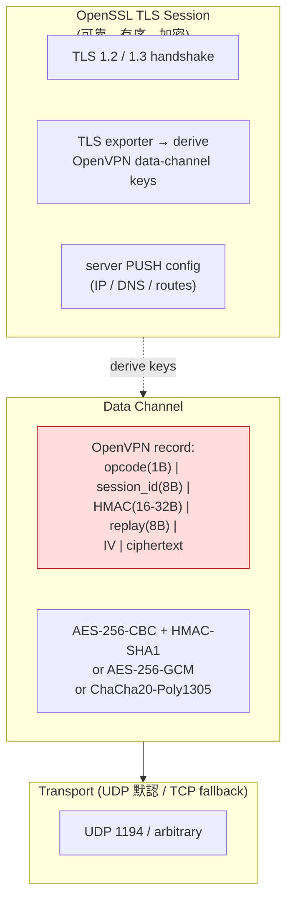
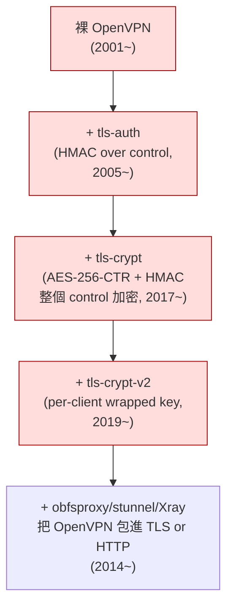
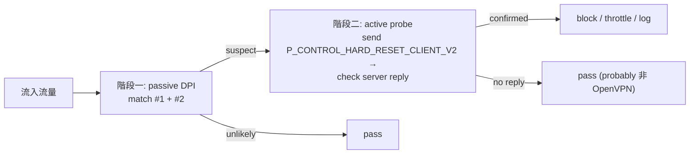

# 課堂 6.2 — OpenVPN 完整解剖：TLS-over-UDP 的 25 年人生與被 fingerprint 收割的下場

## 學前知道
- **前置課**：
  - [4.2 TLS 1.2 vs TLS 1.3](../part-4-tls-quic/4.2-tls12-vs-tls13.md)（OpenVPN 重度依賴 TLS）
  - [4.4 TLS 擴充與 JA3/JA4](../part-4-tls-quic/4.4-tls-extensions-ja3-ja4.md)（OpenVPN 把 TLS 直接搬上 UDP 帶來的 fingerprint 災難）
  - [6.1 IPsec 完整解剖](6.1-ipsec-anatomy.md)（OpenVPN 是「**不要 IPsec**」運動的第一波產物）
- **預計閱讀時間**：50~70 分鐘
- **必讀規格 / 論文**：
  - **OpenVPN protocol 文件**（非 IETF 規格，只有 docs + source；本堂的 byte-level layout 都從原始碼推導）
  - **Xue et al. 2022 USENIX Security** *OpenVPN is Open to VPN Fingerprinting*（**Distinguished Paper Award + Internet Defense Prize 一等獎**——這篇是 OpenVPN 死刑判決書）
  - **CVE-2019-14899** (Inferring and Hijacking VPN-tunneled TCP Connections) — Linux + macOS + iOS + Android 上對 OpenVPN/IPsec/WireGuard 的 side-channel 攻擊
  - **CVE-2024-3661** TunnelVision（DHCP option 121 注入；[1.5 已讀](../part-1-networking/1.5-arp-ndp-dhcp.md)）
- **必讀原始碼**：
  - **OpenVPN community edition**（C，~120k LoC）：`src/openvpn/ssl.c`（TLS 控制通道）、`src/openvpn/crypto.c`（資料通道）、`src/openvpn/forward.c`（封包路徑）、`src/openvpn/proto.h`（包頭格式）

## 動機

如果 IPsec 是「真 VPN 之祖」，OpenVPN 就是「我們不要 IETF 委員會，給我簡單能跑就好」運動的代表。它 2001 由 James Yonan 寫出，把 OpenSSL（TLS）當作 key agreement，自己定義一個極簡的 record layer 跑在 UDP（也可 TCP）上。

對使用者（你，正在用 ccb + Clash 的人）來說，OpenVPN 兩個身份：
1. **企業 remote-access VPN 第一選擇**（在 GFW 不是問題的地方）：Cisco AnyConnect / FortiClient 那一堆都是 OpenVPN 變種。
2. **早期翻牆嘗試**（2010~2018）：但 2022 Xue 那篇論文之後，**沒有一個嚴肅的翻牆服務還用裸 OpenVPN**。

對研究 Proteus 的目標來說，OpenVPN 是極好的教材：它示範了「**用 TLS 當 KE + 自製 record layer**」這條路為什麼**理論上聰明、實踐上致命**。WireGuard 用 Noise IK 而不是 TLS，VLESS 用 TLS+REALITY 而不是 OpenVPN 那種「裸 TLS-on-UDP」，都跟 OpenVPN 的教訓直接相關。

---

## 核心概念

### 1. 架構：TLS control + 自製 UDP/TCP data plane



兩個 channel **共享同一條 UDP socket**（這正是 fingerprint 災難起點）：

| Channel | 載荷 | 加密 | 可靠性 | 用於 |
|---|---|---|---|---|
| **Control** | TLS records（裝在 OpenVPN P_CONTROL_*）| TLS 1.2/1.3 完整加密 | OpenVPN 自製 ARQ（acked + retransmit） | KE、auth、push config、rekey |
| **Data** | Inner IP packet | AEAD（GCM/Poly1305）或 CBC+HMAC | UDP 模式無，TCP 模式靠 TCP | 實際 tunnel traffic |

**OpenVPN packet 第一個 byte 是 opcode 5-bit + key_id 3-bit**：

| Opcode | 名稱 | 用途 |
|---|---|---|
| 1 | P_CONTROL_HARD_RESET_CLIENT_V1 | client 首封（v1 已棄）|
| 2 | P_CONTROL_HARD_RESET_SERVER_V1 | server 回應（v1 已棄）|
| 3 | P_CONTROL_SOFT_RESET_V1 | TLS rekey |
| 4 | P_CONTROL_V1 | TLS record carrier |
| 5 | P_ACK_V1 | OpenVPN-level ACK |
| 6 | P_DATA_V1 | encrypted data |
| 7 | P_CONTROL_HARD_RESET_CLIENT_V2 | 現代 client 首封 |
| 8 | P_CONTROL_HARD_RESET_SERVER_V2 | 現代 server 回應 |
| 9 | P_DATA_V2 | 現代 data packet（含 peer-id） |
| 10 | P_CONTROL_HARD_RESET_CLIENT_V3 | v3 with tls-crypt-v2 |
| 11 | P_CONTROL_WKC_V1 | wrapped key client (tls-crypt-v2) |

**第一封封包的第一 byte 在實務上幾乎固定**：client_v2 reset = `0x38`（opcode 7 << 3 | key_id 0），server_v2 reset = `0x40`。這就是 Xue et al. 2022 三條 fingerprint 的第一條（"byte pattern fingerprint"）。

### 2. OpenVPN 的 5 種「鎧甲」（與它們的失效）

OpenVPN 知道自己會被 fingerprint，所以演化出多層防護：



| 機制 | 防禦目標 | 為什麼仍會被 Xue 2022 打 |
|---|---|---|
| **裸 OpenVPN** | 無 | 第一 byte = 0x38 / 0x40，傻瓜 DPI 都能識別 |
| **`tls-auth` (`--tls-auth` 直接 HMAC over control)** | DoS、半盲探測 | HMAC 的 64-byte key 是 pre-shared 但 **HMAC 結果接在明文後面**——明文 opcode 仍然外露 |
| **`tls-crypt` (整個 control 用 AES-256-CTR + HMAC 加密)** | 隱藏 TLS handshake 本身 | **opcode + session_id 仍是明文！**——packet 結構仍可識別 |
| **`tls-crypt-v2` (per-client wrapped key)** | 上一條的 per-client key 管理問題 | 結構不變，opcode 仍明文，**Xue 仍能識別** |
| **obfsproxy / stunnel / Xray-mux 外包** | 把整段流量再封一層 | 此時等於不是 OpenVPN，而是看你外層是什麼 → 變成「外層協議的 fingerprint 問題」 |

**研究級觀察**：tls-crypt 系列**沒有加密 opcode**，這是 design 層面的疏忽（為了讓接收端能判斷封包類型再嘗試解密）。但這正是 Xue et al. 找到的 byte-pattern fingerprint 的根源。如果重新設計，opcode 必須在 AEAD 內。**這是 Proteus day-1 規則**：所有「協議識別資訊」都在 AEAD 之內。

### 3. Xue et al. 2022 USENIX Security 三條 fingerprint 與兩階段框架

論文核心發現：即使 OpenVPN 啟用 `tls-crypt-v2`，仍可被 nation-state ISP 級對手以 **>85% recall + 極低 false positive** 識別與封鎖。

#### 三條 fingerprint：

| Fingerprint | 觀測位 | 通過 tls-crypt-v2 後？ | 對手成本 |
|---|---|---|---|
| **#1 byte pattern** | 第一封 packet 的 opcode 高位（0x38/0x40 等）| ✅ 還在 | DPI 1 byte 比對 |
| **#2 packet size** | 控制封包 size 分布的 ACK pattern + handshake length | ✅ 還在（tls-crypt 不改 size） | 統計 |
| **#3 server response** | active probing：偽 client_v2 reset → server 是否回 server_v2 reset | ✅ 還在（除非 server enable tls-crypt 且 client 沒帶正確 HMAC，但 protocol 要求 server 對某些 invalid packet 仍要回 reset） | 主動探測 |

#### 兩階段框架（論文 §4~§5）：



**為什麼這設計極強**：
- Phase 1 用低成本 DPI 過濾掉 99% 流量，只把 suspect 餵給 Phase 2。
- Phase 2 主動探測**確認** OpenVPN，把 false positive 降到 <0.1%。
- 整套框架在 1M-user ISP 規模實測，識別 ~85% 的 OpenVPN 流（含商業 VPN 服務）。

**Distinguished Paper Award + Internet Defense Prize 一等獎**——這是學界認可「OpenVPN 在 nation-state 對手下已死」的官方蓋章。

> **跟我們協議設計的關聯**：Xue 2022 的方法論對 Proteus 有兩個 implication：
> 1. **首封 packet 不能有 protocol-identifying byte**。WireGuard 第一 byte = 0x01（type=handshake_init），其實**也犯了同樣的錯**——只是 GFW 暫時不認真打。[6.7](6.7-wireguard-blocked-china.md) 詳講。我們 Proteus 必須讓第一 byte 看起來 entropy-uniform（這帶到 [Part 9.5 fully encrypted detection](../part-9-gfw-research/)）。
> 2. **必須對抗 active probing**。被 probe 時 server 不能回應「我認識你」。VMess 1.0 的「服務端強迫繼續回應」就是 IMC 2020 *How China Detects and Blocks Shadowsocks* 的攻擊入口。Proteus 必須像 REALITY 一樣 "probe-resistant by design"。

### 4. OpenVPN 的密碼學選擇（與 IPsec 對比的進步）

OpenVPN 預設 AEAD 自 2.4（2017）起：
- **`--cipher AES-256-GCM`**（預設於 2.5+）
- **`--cipher CHACHA20-POLY1305`**（軟體實作環境的最佳選擇）
- legacy: `AES-256-CBC + --auth SHA256`（仍可用但 deprecated）

KE：完全依賴 TLS。TLS 1.2 with `ECDHE-ECDSA-AES256-GCM-SHA384` 是企業預設；TLS 1.3 自 OpenVPN 2.5+ 支援。

**對比 IPsec/IKE 的進步**：
1. **TLS 一統的好處**：CA 系統、cert 驗證、cipher agility 都借用成熟基建。
2. **AEAD-only**（自 2.5）：徹底告別 Degabriele-Paterson 類攻擊。
3. **Static keys 模式（pre-shared key）** 仍存在但 deprecated，雖然規格允許但 vendor 多禁用。

**對比 WireGuard 的退步**：
1. **TLS 帶來巨大 attack surface**——OpenSSL bug 直接影響 OpenVPN（Heartbleed 2014 把 OpenVPN 也炸了，CVE-2014-0160）。
2. **配置複雜性**：tls-auth / tls-crypt / cipher / auth / static / push 等百餘個選項。
3. **TLS handshake 是固定 size pattern**——Xue 2022 第二條 fingerprint 的根。

### 5. 為什麼 GFW 對 OpenVPN「不感興趣到很感興趣」的歷史

時間軸：

| 年份 | GFW 對 OpenVPN 行為 | 工具 / 論文 |
|---|---|---|
| 2010-2014 | 主要靠 IP block 商業 VPN 公司的 endpoint | (沒公開文獻) |
| 2014-2017 | OpenVPN with stunnel 包裝開始流行 | obfsproxy 出現 |
| 2018 | GFW 開始 active probing：發 P_CONTROL_HARD_RESET_CLIENT_V2 → 看 server 回應 | 用戶觀察 |
| 2019-2021 | 多家中國商業 VPN 服務被批量封；OpenVPN over TCP 443 仍偶能用 | 站內回報 |
| **2022** | **Xue et al. USENIX Security 公佈完整 fingerprint 方法** | **這篇論文** |
| 2023-2025 | OpenVPN 在中國境內已不可用；商業 VPN 全轉 WG / SS / VLESS / Hysteria | GFW.report 觀察 |

> **研究級觀察**：Xue 2022 的影響超越 OpenVPN 本身。它建立了「**先 passive 後 active**」這個 two-phase framework 範式，後續 Wu et al. 2023 USENIX Security *How the Great Firewall of China Detects and Blocks Fully Encrypted Traffic* 直接沿用此 framework 分析 GFW 對 Shadowsocks / VMess / obfs4 的偵測。[Part 9.5] 完整精讀那篇。

### 6. OpenVPN 的其他遺產級問題

1. **CVE-2019-14899（Mathy Vanhoef 等）**：Linux/macOS/iOS 上對 OpenVPN/IPsec/WireGuard 都能透過 TCP SEQ 預測 + ICMP redirect 來推測 tunnel 內 TCP session 並注入。**不是 OpenVPN 獨有，但因 OpenVPN 廣布所以最容易被利用**。
2. **CVE-2024-3661 TunnelVision**（[1.5 已讀](../part-1-networking/1.5-arp-ndp-dhcp.md)）：rogue DHCP 推 option 121 注入 /1 路由繞過 default route → OpenVPN tunnel 整段被旁路。Android 例外（因為不支援 option 121）。
3. **`tls-crypt` 的 PSK 分發問題**：所有 client 共用同一把 64-byte key。一台被入侵 = 全 fleet 識別。`tls-crypt-v2` 用 wrapped key 解決，但 deployment 需要中心 CA-like infra。
4. **TCP-over-TCP 災難**：OpenVPN over TCP 模式遇到 inner TCP 也跑 TCP 時，雙層重傳放大延遲（head-of-line blocking）。[1.10 TCP congestion control] 已伏筆。

### 7. 原始碼地標（給之後 hands-on 用）

OpenVPN community edition 結構：

```
src/openvpn/
├── proto.h            ← packet 格式 (opcode/key_id macros)
├── ssl.c, ssl.h       ← TLS control channel; key derivation
├── ssl_pkt.c          ← control channel packet 處理 (P_CONTROL_*)
├── crypto.c, crypto.h ← data channel AEAD/HMAC
├── forward.c          ← data channel 流向 (read → decrypt → write tun)
├── tun.c              ← TUN/TAP integration
├── mudp.c, mtcp.c     ← UDP / TCP transport
├── manage.c           ← management interface (telnet-like control)
└── push.c             ← server PUSH config (IP/DNS/routes 等)
```

**關鍵 entry points**：
- `tls_session_init()` → `key_method_2_write()` → 真正寫 TLS Finished + 把 exporter 餵給 `generate_key_expansion()`。
- `openvpn_decrypt()` (`crypto.c:790~`) → AEAD decrypt 主路徑。
- `process_incoming_link()` (`forward.c:1066~`) → 任一 incoming UDP packet 的第一站，opcode 分支。

對比 WireGuard-go `device/receive.go:RoutineReceiveIncoming()` —— OpenVPN 一封封包要走 4 個 function、跨 3 個 .c 檔案、做 opcode 分派 + reassembly + decrypt + ACK；WireGuard 只有「type byte 分派 → handshake or data → decrypt → TUN」直線。**code 結構就是設計哲學的物質化**。

---

## 與我們協議設計的關聯

| OpenVPN 教訓 | Proteus 對應決策 |
|---|---|
| Opcode 在 AEAD 外 → fingerprintable | **所有 protocol-identifying bits 在 AEAD 內** |
| TLS handshake 直接外露 → 給 active probe 機會 | **不用 TLS 作為 inner KE**（用 Noise-like 或 KEM-hybrid） |
| 第一封 packet 高位元有固定值 | **全 entropy uniform 首封**（[Part 9.5 fully encrypted](../part-9-gfw-research/) 教我們怎麼做） |
| 配置選項百餘個 | **Proteus 用 single ciphersuite，no negotiation** |
| TLS-over-OpenSSL 引入 OpenSSL bug surface | **避開 OpenSSL，用 ring / rustls / 自製 minimal AEAD** |
| TCP-over-TCP HoL | **不允許 TCP transport（UDP-only），加 inner reliability 由 QUIC-like layer 提供** |
| 給 active probe 任何 response = 死 | **probe-resistant by design**（Reality-style "看不見的 server"） |

對研究路線的啟示：**閱讀 OpenVPN 的價值不是學它怎麼做，而是學它為什麼會被 Xue 2022 一次打死**。一個協議的死亡通常不來自密碼學被破，而來自「容易被識別+主動探測+集中式部署」三件事的乘積。

---

## 動手（可選）

### 實驗 6.2.A：跑一個 OpenVPN，抓首封 packet 的第一 byte

在 Linux VM 安裝 `openvpn`，server 端啟動 default config，client 端連線。tcpdump server 的 UDP/1194：

```bash
sudo tcpdump -i any -nn -X 'udp port 1194' -c 5
```

你會看到第一封來自 client 的 packet 第一 byte 是 `0x38`（P_CONTROL_HARD_RESET_CLIENT_V2 opcode 7 << 3）。**這就是 Xue 第一條 fingerprint**。

### 實驗 6.2.B：啟用 tls-crypt，重抓，確認 opcode 仍明文

在 server 與 client 各加 `--tls-crypt /etc/openvpn/ta.key`（用 `openvpn --genkey tls-crypt /etc/openvpn/ta.key` 產生）。重啟、重抓。**驗證**：第一 byte 仍是 0x38（雖然之後的內容看起來是亂數）。

### 實驗 6.2.C：寫一段 Python 重現 Xue 的 active probe

```python
import socket, struct
sk = socket.socket(socket.AF_INET, socket.SOCK_DGRAM)
sk.settimeout(2)
# P_CONTROL_HARD_RESET_CLIENT_V2: opcode 7 << 3 = 0x38, session_id = random 8 bytes
probe = bytes([0x38]) + os.urandom(8) + b"\x00\x00\x00\x00"  # 簡化版
sk.sendto(probe, ("server.ip", 1194))
try:
    data, _ = sk.recvfrom(1500)
    if data and data[0] == 0x40:  # P_CONTROL_HARD_RESET_SERVER_V2
        print("This is OpenVPN!")
except socket.timeout:
    print("Not OpenVPN (or tls-crypt protecting)")
```

**研究問題**：對啟用 tls-crypt 的 server，這個 probe 應該收不到 reply（因為 HMAC 不對 server 不回）。但 Xue 找到的方法是不同的——詳見論文 §5.2。

### 實驗 6.2.D（推薦）：把這 4 個觀察寫成 GitHub gist，做為 part-9.5 paper reading 的暖身。

---

## 自我檢查

1. OpenVPN control channel 與 data channel 各跑什麼？為什麼共享同一條 UDP socket 是 fingerprint 起點？
2. `tls-auth`、`tls-crypt`、`tls-crypt-v2` 三者保護目標差別？為什麼都沒能擋 Xue 2022？
3. Xue 2022 的 two-phase framework（passive + active）對我們設計 Proteus 的具體意義是什麼？
4. CVE-2019-14899 與 CVE-2024-3661 對 OpenVPN 同樣致命的原因？這是 protocol 問題還是 OS 問題？
5. OpenVPN 為什麼從 2017 起一定要用 AEAD（而非 CBC+HMAC）？對應 [3.2 已讀](../part-3-cryptography/3.2-symmetric-aead.md) 哪個定理？
6. 為什麼 OpenVPN 不能「直接把 opcode 放進 AEAD」？這個 backwards compatibility 問題對 Proteus 設計給了什麼警示（**day-1 寫對，沒有 fix 機會**）？

---

## 延伸閱讀

- Xue et al. 2022 USENIX Security（必讀；[notes/papers/xue-openvpn-2022.md](../../notes/papers/xue-openvpn-2022.md)）
- OpenVPN GitHub commits 對 `tls-crypt-v2` 的設計過程：https://github.com/OpenVPN/openvpn/pull/108 系列
- Vanhoef 2019 *Inferring and Hijacking VPN-tunneled TCP Connections* (CVE-2019-14899)
- Cronce & Moratti 2024 *TunnelVision* (Leviathan Security)（[1.5 已讀](../part-1-networking/1.5-arp-ndp-dhcp.md)）
- Wu et al. 2023 *How the Great Firewall of China Detects and Blocks Fully Encrypted Traffic*（[Part 9.5] 精讀）

---

## 研究級補遺

### 1. 學界詞彙

- **VPN fingerprinting**：辨識某條流量是 VPN（不一定知道哪家 vendor）。Xue 2022 之前主要是 ML approach，他們重新定義為「精確的、確定性的、bytes-level、probing-confirmed」流派。
- **Two-phase detection framework**：先 passive 後 active 的偵測流水線，2022 起成為 GFW 研究的標準分析範式。
- **TLS-over-UDP**：把 TLS records 包進 UDP 的非標準作法。OpenVPN、DTLS（RFC 6347）、AnyConnect 都是變種。
- **Probe-resistant**：對主動探測**沒有可區分回應**。REALITY 提出後成為翻牆協議的硬性要求；OpenVPN 完全不符合。
- **VPN active probing**：對手主動送精心構造封包到目標 IP，觀察回應以確認是否為 VPN server。GFW 對 Shadowsocks 用了多年（Ensafi-Crandall-Winter IMC 2015）。

### 2. 對手分類學 / 威脅模型精化

OpenVPN 在 Xue 2022 框架下面對的對手等級：

| 等級 | 能力 | 對 OpenVPN 的後果 |
|---|---|---|
| **passive L4 DPI** | match byte/size patterns | 識別 byte fingerprint #1 + #2 |
| **active prober** | 發任意 UDP 探測到目標 IP | 觸發 fingerprint #3 |
| **ISP-scale operator** | 同時做以上兩件事於 N 個 IP | Xue 2022 ISP 實驗的等級 |
| **nation-state** | + 持續記錄 + IP 黑名單 + 跨流量關聯 | GFW 對中國 OpenVPN 用戶的等級 |

OpenVPN **在「passive L4 DPI」這一級就已被打**——這是 protocol-level 死刑（不需要對手有更強能力）。

### 3. 形式化定義

**Probe resistance**（Frolov et al. 2019 *Conjure*；Xue 2022 引用）的非正式定義：

> A protocol P is **probe-resistant** if for any probe message m sent by an adversary A to a server S running P (without prior valid session), the response of S to m is **computationally indistinguishable** from the response of a generic non-P server (e.g., a default TCP/UDP echo server, or no response at all).

OpenVPN 違反此定義：server reset reply 與 generic UDP server 行為**明顯可區分**。

WireGuard 部分符合（無 reply for invalid handshake）但仍 leak through other channels（[6.7](6.7-wireguard-blocked-china.md)）。

Proteus 必須**嚴格滿足** probe resistance。

### 4. 領域的關鍵論文 / 規格 / 原始碼

| 文獻 | 為何追 | 之後在哪精讀 |
|---|---|---|
| Xue et al. 2022 USENIX Sec | OpenVPN 死刑判決書 | 本堂 + [Part 9.5] |
| Wu et al. 2023 USENIX Sec | Two-phase framework 進化版 | [Part 9.5] |
| Frolov et al. 2019 *Conjure* | probe resistance 對策（在 ISP refraction 層） | [Part 9.6] |
| Vanhoef 2019 CVE-2019-14899 | OS-level VPN side channel | 本堂 + [Part 11.7 implementation pitfalls] |
| Cronce-Moratti 2024 TunnelVision | DHCP-level VPN bypass | 本堂 + [1.5 已讀](../part-1-networking/1.5-arp-ndp-dhcp.md) |
| OpenVPN `src/openvpn/proto.h` | 唯一的 byte-level spec | 本堂 |
| Ensafi et al. 2015 IMC | active probing 的 GFW 起源 | [Part 9.2] |

### 5. 我們協議的座標 / 設計取捨

Proteus 在 OpenVPN 教訓下收窄的設計：

| 維度 | OpenVPN | WireGuard | **Proteus 目標** |
|---|---|---|---|
| First byte entropy | 固定 0x38/0x40 | 固定 0x01-0x04 | **uniform random** |
| Probe response | reset reply（無條件） | 無 reply for invalid handshake | **無 reply + cover traffic** |
| TLS 依賴 | 強依賴 OpenSSL | 不用 TLS | **不用 TLS（內 KE 用 Noise/KEM-hybrid）** |
| Negotiation | 百餘選項 | hard-coded | **hard-coded 但有 version 推進機制** |
| Inner reliability | 自製 ARQ for control | 無（純 L3 tunnel） | **QUIC-like inner stream + L3 tunnel 雙模式** |
| Anti-replay | 8-byte sequence | 8-byte counter | **沿用 WireGuard** |

### 6. 必追資源 / 社群入口

- **OpenVPN GitHub**（commit history 是 protocol evolution 的活化石）：https://github.com/OpenVPN/openvpn
- **OpenVPN-devel mailing list**
- **Xue 2022 第一作者 Diwen Xue 後續工作**（OpenVPN-DPI 對抗）：https://web.eecs.umich.edu/~ensafi/ 旗下 group
- **GFW.report**：對 OpenVPN 封鎖事件的最新觀察

### 7. 開放問題（research-level）

1. **OpenVPN 能否設計出 backwards-compatible 的 probe resistance 補丁**，而不破壞舊 client？答案大概率是「不能」——這正是 protocol 死亡的訊號。
2. **Xue 2022 framework 對 WireGuard 的可移植性**：把 byte pattern 換成 0x01（WG handshake init type），結構性威脅幾乎相同。[6.7](6.7-wireguard-blocked-china.md) 會回答。
3. **TLS-over-UDP（DTLS / OpenVPN）vs QUIC**：兩者都把 TLS 帶上 UDP，但 QUIC 把 TLS 1.3 handshake 嵌入加密 QUIC frame，從 day-1 不外露 TLS-shape。是否所有「未來的 OpenVPN」都應該重新基於 QUIC？這在 [Part 4.10 MASQUE] 已伏筆，到 [Part 8.x] 全面展開。
4. **TCP-over-TCP 重傳放大** 是個古老問題（Honda et al. 2014），但量化分析在 GFW 場景下仍稀缺。能否用 ns-3 / nsim 重現並量化各種 TCP CC 組合下的 HoL 放大？

---

**下一堂**：[6.3 WireGuard whitepaper 精讀](6.3-wireguard-whitepaper.md) — 我們正式進入這門課的核心對象。
