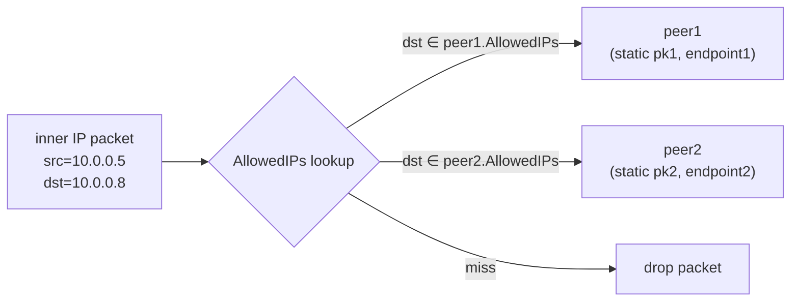
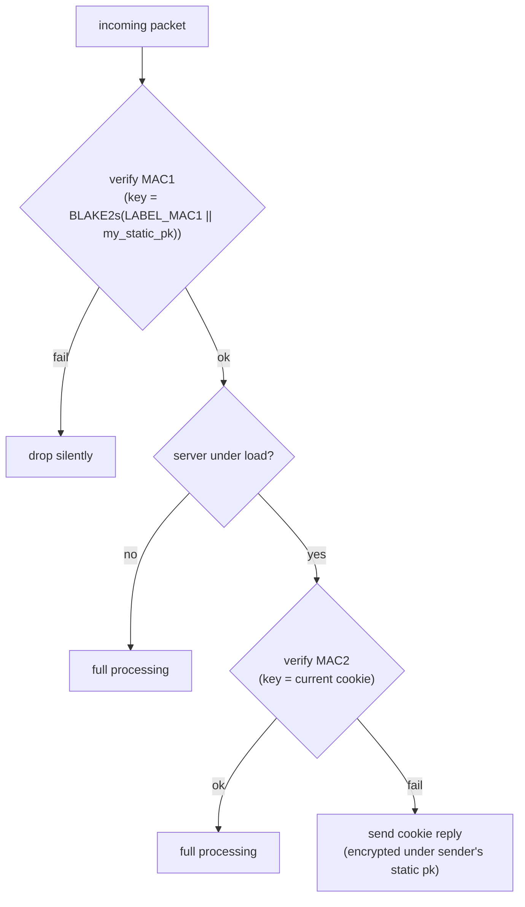
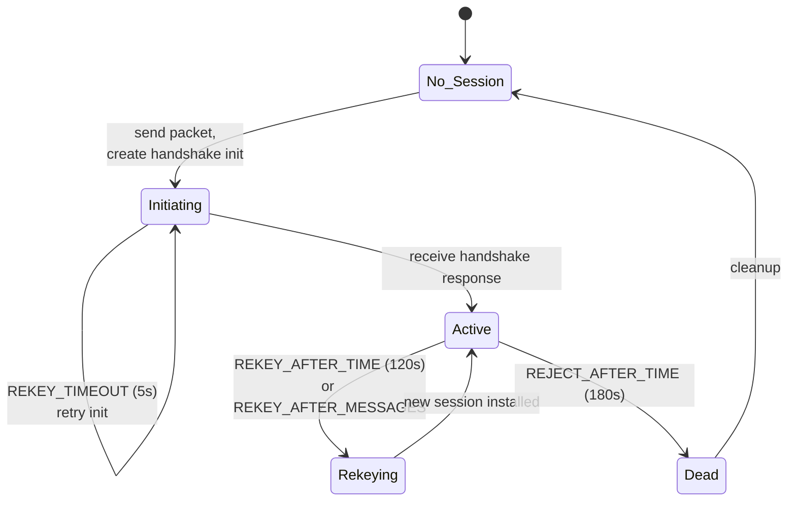

# 課堂 6.3 — WireGuard whitepaper 精讀：把 12 頁拆成設計決策樹

## 學前知道
- **前置課**：
  - [6.1 IPsec 完整解剖](6.1-ipsec-anatomy.md)（沒有這層對照，看不出 WireGuard 的設計取捨）
  - [6.2 OpenVPN 完整解剖](6.2-openvpn-anatomy.md)（同上）
  - [3.5 橢圓曲線](../part-3-cryptography/3.5-elliptic-curves.md) + [3.6 Key Exchange](../part-3-cryptography/3.6-key-exchange.md)（X25519 與 DH 基礎）
  - [3.8 Noise Protocol Framework](../part-3-cryptography/3.8-noise-protocol-framework.md)（**重要**：WireGuard 用 Noise_IK_25519_ChaChaPoly_BLAKE2s）
  - [3.15 形式化驗證](../part-3-cryptography/3.15-formal-verification.md)（Tamarin/ProVerif 是 WireGuard 證明的工具）
- **預計閱讀時間**：60~90 分鐘
- **必讀規格 / 論文**：
  - **Donenfeld 2017 NDSS** *WireGuard: Next Generation Kernel Network Tunnel*（[notes/papers/donenfeld-wireguard-2017.md](../../notes/papers/donenfeld-wireguard-2017.md)；本堂的核心對象，12 頁）
  - **Dowling-Paterson 2018 ACNS** *A Cryptographic Analysis of the WireGuard Protocol*（[notes/papers/dowling-paterson-wireguard-2018.md](../../notes/papers/dowling-paterson-wireguard-2018.md)）
  - **Lipp-Beurdouche-Blanchet-Bhargavan 2019 EuroS&P** *A Mechanised Cryptographic Proof of the WireGuard VPN Protocol*（[notes/papers/lipp-wireguard-2019.md](../../notes/papers/lipp-wireguard-2019.md)）
  - **Donenfeld 自己用 Tamarin 的形式化驗證** `assets/papers/wireguard-formal-verification.pdf`
- **必讀原始碼**：本堂只看 spec 行為；具體 source 由 [6.4~6.6] 接續。

## 動機

如果說 IPsec 是「規格 by committee 失敗的標本」、OpenVPN 是「個人寫工程一帆風順但漏 protocol-design 全局思維」，那 WireGuard 就是「**一個受密碼學家審查的 systems engineer 在 21 世紀重新發明 VPN 的範本**」。

WireGuard 帶來的真正震撼**不是某個技術發明**（Noise framework / X25519 / ChaCha20 都是別人的）——而是 Donenfeld **拒絕一切「但是…」**：
- 拒絕 cipher negotiation（IPsec 教訓）
- 拒絕 backwards compatibility（OpenVPN 教訓）
- 拒絕 TLS（OpenSSL bug surface 教訓）
- 拒絕 user-space 預設（performance 教訓）
- 拒絕 PKI（管理複雜度教訓）

結果是 4000 行 Linux kernel module，獲得 Linus Torvalds 罕見的稱讚（2020 年合併進 5.6）、被 Tamarin/ProVerif 機器驗證、性能在 Linux 上吊打 IPsec 與 OpenVPN。

但 WireGuard 也有它的盲區，最大的一塊就是**抗審查**：spec 設計時完全沒考慮 GFW 場景，這留給我們 Proteus 來補。所以本堂的目的是：**精讀 whitepaper，理解每個設計決策的理由，然後在 [6.7] 開始指出哪些決策對抗審查不利**。

---

## 核心概念

### 1. 設計目標宣言（whitepaper §1）

Donenfeld 在 introduction 列了 7 條目標。我們逐條對應到設計取捨：

| 目標 | 對應設計 | 對 Proteus 的啟示 |
|---|---|---|
| **Simple to use, manage, deploy** | 配置只剩 (peer pk, AllowedIPs, endpoint) | Proteus 也要追求 minimal config |
| **Strong, modern cryptography** | hard-coded Curve25519/ChaCha20-Poly1305/BLAKE2s/HKDF | Proteus 同樣 hard-coded，但要 PQ-hybrid |
| **Minimal attack surface** | 4000 LoC vs IPsec ~400k | Proteus 要 < 10k LoC for core |
| **High performance** | kernel impl + zero copy + AEAD inline | Proteus 要 user-space 但 io_uring/XDP 加速 |
| **Well-defined and thoroughly considered** | Tamarin/ProVerif 驗證 | Proteus day-1 寫 ProVerif 模型 |
| **Stealthy** ❓ | 對 passive observer "looks like noise" — **但對 active prober 完全暴露** | Proteus 不能止步於此 |
| **No bloat** | 拒絕 negotiation / extensibility / multi-cipher | Proteus 同樣，但要為 PQ migration 留空間 |

> **研究級觀察**：第 6 條 "Stealthy" 是 WireGuard 後來最大的 weakness。Donenfeld 的定義是「passive observer 看不出來這是 WireGuard」，但他**完全沒考慮 active prober**。Xue 2022 之後的 GFW 研究告訴我們：對 nation-state，"passive stealth" 完全不夠。Proteus 必須重新定義 stealth = passive + active probe resistance。

### 2. Cryptokey Routing（whitepaper §2.1）

WireGuard 的核心抽象**不是 SA**（IPsec）、**不是 session**（OpenVPN/TLS），而是 **cryptokey routing**：



**精髓**：「**接收一封 inner IP packet，根據 destination IP 查到 peer 的 static public key，用該 key 加密**」——這把 routing decision 與 crypto identity **綁定**。WireGuard 因此**沒有「allowed-by-policy 但 crypto 用別把 key」這種狀態**——這在 IPsec 是 SPD 與 SAD 解耦造成的常見配置 bug。

**雙向對稱性**：reverse 也成立。**收到** packet 解密後，inner src IP **必須**在發送方 peer 的 AllowedIPs 範圍內，否則丟棄。這個簡單規則排除了 inner IP spoofing。

**這個設計的副作用**：
- ❌ 沒有 routing protocol 動態能力（不能跑 BGP/OSPF）。
- ❌ 不能輕易做 split tunneling 的細粒度 policy。
- ✅ Configuration drift 幾乎為零——你看 config 就知道一切。
- ✅ ProVerif 建模容易——狀態空間小。

### 3. Noise IK：身分隱私 + 1-RTT + KCI 抵抗（whitepaper §5.1）

WireGuard 用 **Noise_IK_25519_ChaChaPoly_BLAKE2s**。`IK` 是 Noise pattern 名稱：

| Letter | 意義 |
|---|---|
| `I` (Initiator's static key) | **I**mmediately sent（初始者 static pk 馬上送，加密 under DH(eph_i, static_r)） |
| `K` (Responder's static key) | **K**nown out-of-band（接收者 static pk 預先已知，所以可立即用於 DH） |

「Static_r 預先已知」這條件**對 VPN 場景完美**：你想連 server 之前已經有 server 的 public key（從 server 部署時拿到，或 out-of-band 分發），就像 OpenSSH 你連之前要在 `known_hosts` 加 server fingerprint。

#### Handshake 訊息（whitepaper §5.4，逐 byte）

**Message 1 (initiator → responder)** size = **148 bytes**：
| Offset | 欄位 | Bytes | 內容 |
|---|---|---|---|
| 0 | msg_type | 1 | `0x01` |
| 1 | reserved | 3 | `0x00 0x00 0x00` |
| 4 | sender_index | 4 | initiator 給 responder 用的 32-bit session ID |
| 8 | ephemeral | 32 | `eph_i` Curve25519 公鑰（plaintext） |
| 40 | static (encrypted) | 32 + 16 | `AEAD(k1, 0, static_i, hash1)` |
| 88 | timestamp (encrypted) | 12 + 16 | `AEAD(k2, 0, TAI64N now, hash2)` |
| 116 | MAC1 | 16 | `MAC(BLAKE2s(LABEL_MAC1 || static_r), msg[0..116])` |
| 132 | MAC2 | 16 | `MAC(cookie, msg[0..132])` 或 0...0（無 cookie 時） |

**Message 2 (responder → initiator)** size = **92 bytes**：
| Offset | 欄位 | Bytes | 內容 |
|---|---|---|---|
| 0 | msg_type | 1 | `0x02` |
| 1 | reserved | 3 | `0x00 0x00 0x00` |
| 4 | sender_index | 4 | responder 的 session ID |
| 8 | receiver_index | 4 | echo initiator 的 ID |
| 12 | ephemeral | 32 | `eph_r` 公鑰 |
| 44 | empty (encrypted) | 0 + 16 | `AEAD(k3, 0, "", hash3)` — 認證且確認 |
| 60 | MAC1 | 16 | |
| 76 | MAC2 | 16 | |

**精髓**：
1. **148 + 92 = 240 bytes 完成 1-RTT 雙向認證 KE**。
2. **`static_i` 是被加密的**——initiator 的 identity 對 passive observer 隱形。
3. **`timestamp` 是 monotonic anti-replay**——TAI64N (12 bytes) 大於 last_seen 才接受，順帶防 replay 攻擊。
4. **每個訊息固定大小**——沒有 ciphersuite negotiation，沒有 extension list，**沒有 size variability**。

#### 從 5 個 DH 推導 transport keys

Noise IK 在 WireGuard 場景做 5 個 DH：
```text
ck₀  = hash("Noise_IK_25519_ChaChaPoly_BLAKE2s")
ck₁, k₁ = HKDF(ck₀, DH(eph_i, static_r))    [initiator: 我有 eph_i 與已知 static_r]
ck₂, k₂ = HKDF(ck₁, DH(static_i, static_r))  [這把 static-static DH 為 forward secrecy 補 noise]
ck₃, k₃ = HKDF(ck₂, DH(eph_i, eph_r))
ck₄, k₄ = HKDF(ck₃, DH(static_i, eph_r))     [responder 推導 transport key 時用到]
ck₅, k₅ = HKDF(ck₄, PSK)                     [optional pre-shared key 加入]
(T_send, T_recv) = HKDF(ck₅, "")
```

**為什麼 5 個 DH（不是 1 個）**：
- 1 個 `DH(eph_i, eph_r)` 給 forward secrecy。
- 1 個 `DH(static_i, static_r)` 把 long-term identity 綁進 key（防 KCI）。
- 跨 `eph × static` 的 cross 確保 active impersonation 必須同時破 ephemeral 與 long-term。
- 最後 `PSK` 可選——這是 WireGuard 對 **post-quantum 過渡**的伏筆：當量子打破 X25519 時，加上一個事先分發的 PSK 仍能保 confidentiality（雖然 authenticity 仍 broken）。

> **研究級觀察**：Dowling-Paterson 2018 ACNS 用 game-based proof 證明這 5 DH 組合滿足在標準 cryptographic assumptions（DDH on Curve25519 + AEAD security of ChaCha20-Poly1305）下的強 key indistinguishability + KCI resistance。**但**他們指出一個微妙的 modular proof barrier：第一封 data packet 兼任 key confirmation，使 KE component 無法 cleanly 分離證明。他們建議加一個 explicit confirmation message——Donenfeld 沒採納，理由是「實際上 transport data 第一封即完成 confirmation」。

### 4. MAC1 / MAC2：anti-DoS + identity hiding（whitepaper §5.4）



兩層機制：

#### MAC1：identity-based filter（永遠檢查）

MAC1 key = `BLAKE2s(LABEL_MAC1 || responder's static pk)`。**只有預先知道 responder static pk 的人能算出正確 MAC1**。**沒 MAC1 → silently drop**，不回任何東西。

這對 active probing 是**第一道防線**：probe 者不知道 responder static pk，發任意 packet 都過不了 MAC1，server 完全不回應。

#### MAC2：cookie-based load shedding（only under DoS）

當 server CPU > threshold（whitepaper §5.4.7）時，啟用 cookie 機制：
- Server 對「MAC1 對但 MAC2 錯」的 packet **回 cookie reply**（msg_type = 3, 64 bytes）。
- Cookie reply 內含的 cookie 用 sender 的 static_i 公鑰加密 + AEAD 認證（XChaCha20-Poly1305 with random nonce）。
- Sender 解密拿到 cookie，下次 handshake 帶 MAC2 = MAC(cookie, msg)。

**為什麼分兩層**：
- MAC1 永遠檢查 → 過濾 99.99% 探測。
- MAC2 只在被 DDoS 時啟用 → 平時零開銷。
- Cookie 是 stateless（server 不需 per-client state）：cookie = `MAC(R_t, source_ip)` where `R_t` 是 server 每 2 分鐘 rotate 的 secret。

> **研究級觀察**：MAC1 設計的副作用是「**server static pk 是 secret-ish**」——你要連 server 必須先有 server pk，這是 WireGuard 的 OOB 假設。但這在抗審查場景**反而是個 fingerprint 源頭**：對手如果能列出某 IP 的 server static pk（透過合法用戶 OOB 分發），就能精準對該 IP 構造 valid MAC1 探測——[6.7](6.7-wireguard-blocked-china.md) 會詳細分析。

### 5. Transport Data packet（whitepaper §5.4.6）

```text
msg_type (1) = 0x04
reserved (3) = 0x00 0x00 0x00
receiver_index (4)        ← session ID 從 handshake 取得
counter (8)               ← 64-bit per-direction nonce (LE)
encrypted_payload (var)   ← ChaCha20-Poly1305(key, nonce=00000000||counter, ad="", inner IP packet || padding)
```

**精髓**：
- 第一個 16 bytes 是固定結構的明文 header。
- counter 是 little-endian 64-bit，per session per direction，從 0 開始單調遞增。
- nonce 構造：8 bytes 0 || counter ——這正是 ChaCha20-Poly1305 的 96-bit nonce 規格。
- AAD = empty。**注意這意味著 receiver_index 不被 AEAD 認證**——但這在 spec 容忍範圍內因為 receiver_index 變了也只是 lookup 失敗。
- Padding：inner IP packet 後可加 0 bytes 到 16-byte multiple，**這就是 WireGuard 對 packet size 隱藏的全部努力**。

**Anti-replay**：接收端維護 1024-bit sliding window，counter 在 window 內視為 replay 拒絕，window 外（未來）接受並滑動 window。

**對比 IPsec ESP**：
| | IPsec ESP | WireGuard transport |
|---|---|---|
| Header size | 8 bytes（SPI + Seq）+ IV | 16 bytes（type + reserved + recv_idx + counter）|
| Sequence size | 32 or 64 bits | 64 bits |
| AEAD nonce | implicit / explicit / counter-based 三派 | 純 counter |
| Padding | 0~255 bytes | 0~16 bytes |
| AAD | header | empty |

WireGuard 故意把 header 設計成「**沒有任何協商**」——所有狀態都已在 handshake 確定。

### 6. Timer 狀態機（whitepaper §6）

WireGuard spec 定義 4 個關鍵 timer，所有 implementations 必須遵守：

| Timer | 觸發 | 動作 |
|---|---|---|
| **REKEY_AFTER_MESSAGES** (2^60) / **REKEY_AFTER_TIME** (120s) | 任一達到，且 outbound 有資料 | 啟動 handshake 換新 session |
| **REJECT_AFTER_MESSAGES** (2^64-2^4) / **REJECT_AFTER_TIME** (180s) | 任一達到 | 該 session 不再用於 send |
| **REKEY_TIMEOUT** (5s) | handshake init 後 5s 沒收到 response | 重發 handshake init |
| **KEEPALIVE_TIMEOUT** (10s) | persistent_keepalive 設定，且 idle 達 10s | 送一封空 transport packet 維持 NAT mapping |



**為什麼 timer constants 寫死**：避免 reimplementer 任意調整破壞 anti-replay 與 forward secrecy 假設。Dowling-Paterson 證明的 PCS（post-compromise security）正是基於這套固定 timer。

### 7. WireGuard 的密碼學「不換、不協商」哲學

Whitepaper §5 列出 hard-coded algorithms：

| 用途 | 演算法 | 為什麼這個 |
|---|---|---|
| KEM (DH) | Curve25519 | constant-time, no patent, secure 128-bit |
| AEAD | ChaCha20-Poly1305 | constant-time on every CPU; AES on no-AES-NI CPU 慢 |
| Hash | BLAKE2s | 比 SHA-2 快，安全等價 |
| KDF | HKDF (BLAKE2s) | RFC 5869 standard |

**未來怎麼換**：v2 protocol，完全不向後相容，全網要協調升級。對小規模 self-hosted 是可接受；對 mass deployment 是難題。**這正是 Proteus 必須解決的問題**——我們要設計能 PQ-migration 又不開放 negotiation 攻擊面的機制。

### 8. Implementation 規模對比（whitepaper §7）

| 實作 | 語言 | 大致行數 | 模式 |
|---|---|---|---|
| **WireGuard Linux kernel** | C | ~4000 LoC | kernel module |
| **wireguard-go** | Go | ~10000 LoC | user-space |
| **BoringTun (Cloudflare)** | Rust | ~15000 LoC | user-space |
| OpenVPN | C | ~120000 LoC | user-space |
| strongSwan (IPsec) | C | ~400000 LoC | user-space + kernel xfrm |

**100× 差距不是統計巧合**——是設計選擇的物質化。每多一個 negotiation 選項、每多一個 extension、每多一個 backwards compatibility 路徑，都要寫 N 倍 code。

### 9. Performance（whitepaper §8）

Donenfeld 2017 自報數據（單 CPU core, AES-NI 主機）：

| Protocol | Throughput | Ping |
|---|---|---|
| WireGuard | 1011 Mbps | 0.403 ms |
| IPsec (AES-GCM-128) | 881 Mbps | 0.501 ms |
| IPsec (ChaCha20-Poly1305) | 716 Mbps | 0.516 ms |
| OpenVPN (AES-256-GCM) | 258 Mbps | 1.541 ms |

WireGuard 的速度優勢來源：
1. **kernel-space**：不跨 user/kernel boundary。
2. **No per-packet state lookup beyond peer**：cryptokey routing 是 O(log N) trie lookup（用 patricia trie），ESP 是 O(SAD lookup)。
3. **Inline AEAD**：AVX/SSE 加速 ChaCha20-Poly1305。
4. **Zero copy**：用 skb 直接 in-place 加解密。

[6.6 TUN/UDP 整合](6.6-wireguard-tun-udp-integration.md) 與 [6.9 kernel 實作](6.9-wireguard-linux-kernel.md) 會深入。

### 10. Formal verification 狀況（whitepaper §5.5 + 後續 follow-up）

| 工作 | 模型 | 結果 |
|---|---|---|
| **Donenfeld 自己 2017** | Tamarin | symbolic-level proof of mutual authentication, KCI resistance, forward secrecy, replay resistance |
| **Dowling-Paterson 2018 ACNS** | game-based computational | strong key indistinguishability + forward secrecy under DDH + AEAD assumptions |
| **Lipp-Beurdouche-Blanchet-Bhargavan 2019 EuroS&P** | F* + ProVerif mechanised | computational proof of full handshake + transport |
| **後續**：Hülsing-Ning-Schwabe-Weber 2021 對 PQ-WireGuard 提案的分析 | game-based | PQ variant 安全分析 |

**意義**：WireGuard 是極少數**同時具備 symbolic + computational + mechanised proof** 的部署級 protocol。這是 IPsec 與 OpenVPN 永遠達不到的（因為 negotiation + extension 讓 state space 爆炸）。

---

## 與我們協議設計的關聯

WireGuard whitepaper 給 Proteus 的設計清單：

**「直接抄」清單**（這些 day-1 寫對，Proteus 沒理由重發明）：
1. ✅ Noise framework 為 handshake 基底（具體 pattern 待定，IK 是 candidate）。
2. ✅ Hard-coded ciphersuite，無 negotiation。
3. ✅ Cryptokey routing：identity → routing 綁定。
4. ✅ MAC1 對 active probe 過濾。
5. ✅ MAC2 cookie 對 DDoS shedding。
6. ✅ 4 個 timer 的設計（rekey, reject, init retry, keepalive）。
7. ✅ 64-bit counter + 1024-bit anti-replay window。
8. ✅ AEAD-only with empty AAD（簡單就是美）。
9. ✅ Per-direction key（防 reflection attack）。
10. ✅ Optional PSK 作為 post-quantum 過渡。

**必須升級 / 替換**（[Part 11 Proteus 設計] 詳述）：
1. ⚠️ Noise IK 的 first byte 0x01 = 固定 → **Proteus 要 entropy-uniform 首封**。
2. ⚠️ Handshake message size 固定 148/92 bytes → **Proteus 要 randomized padding**。
3. ⚠️ Server static pk 是某種 secret-but-leaks → **Proteus 要 ephemeral server identity 或 REALITY-style 借殼**。
4. ⚠️ X25519 only → **Proteus 要 hybrid X25519 + ML-KEM-768**（[3.11 PQC](../part-3-cryptography/3.11-post-quantum.md)）。
5. ⚠️ No probe resistance design → **Proteus day-1 加入**。
6. ⚠️ No traffic analysis resistance（packet size leak）→ **Proteus 要 padding policy + cover traffic**。

**WireGuard 永遠不會做的事（Proteus 也不一定要做）**：
- ❌ Multi-cipher negotiation。
- ❌ 動態 routing（BGP/OSPF on top）。
- ❌ Cert/PKI 整合。
- ❌ 為 corporate deployment 加 RADIUS / LDAP。

這些都是「保持精簡」的代價，**WireGuard 寧可被罵也不開後門**。Proteus 同樣應該。

---

## 動手（可選）

### 實驗 6.3.A：把 whitepaper §5.4 的 byte-level 圖逐欄位手畫一遍

紙筆畫 4 種 packet（handshake_init / handshake_response / cookie_reply / transport_data）每個 byte 的意義。完成後對照 `wireguard-go/device/noise-protocol.go` 確認你畫對了。

**標準**：1 小時內畫完且全對 = 你會了。

### 實驗 6.3.B：在兩台 OrbStack VM 上用 `wg-quick` 跑一條 WG，抓 handshake

```bash
# 雙方產生 key
wg genkey | tee privatekey | wg pubkey > publickey

# server (/etc/wireguard/wg0.conf):
[Interface]
PrivateKey = <server_priv>
ListenPort = 51820
Address    = 10.10.0.1/24

[Peer]
PublicKey  = <client_pub>
AllowedIPs = 10.10.0.2/32

# client (/etc/wireguard/wg0.conf):
[Interface]
PrivateKey = <client_priv>
Address    = 10.10.0.2/24

[Peer]
PublicKey  = <server_pub>
Endpoint   = <server_ip>:51820
AllowedIPs = 0.0.0.0/0

sudo wg-quick up wg0

# 同時抓
sudo tcpdump -i any -nn -X 'udp port 51820' -c 4 > wg-handshake.txt
```

對照 whitepaper §5.4，逐 byte 解出你抓到的 4 封 packet。

### 實驗 6.3.C：跑 Tamarin 對 WireGuard 的 spec model

下載 Donenfeld 在 https://www.wireguard.com/papers/wireguard-formal-verification.pdf 對應的 Tamarin source（github.com/WireGuard/wireguard-formal-analysis），執行：

```bash
tamarin-prover --prove wireguard.spthy
```

預期看到所有 lemmas 通過。**研究問題**：如果你把 MAC1 從 spec 拿掉，哪些 lemma 會失敗？這是 Part 5.6 Tamarin 的延伸。

---

## 自我檢查

1. WireGuard 的 cryptokey routing 與 IPsec 的 SAD/SPD 分離設計的取捨各是什麼？
2. Noise IK 的 5 個 DH 各自防什麼攻擊？拿掉哪一個會破壞 forward secrecy / KCI resistance？
3. MAC1 與 MAC2 的設計分工？為什麼 server "under load" 才啟用 MAC2？
4. WireGuard transport packet 為什麼 AAD = empty？這對 receiver_index 的整合性有什麼影響？實務上會出問題嗎？
5. 4 個 timer constants 為什麼一定要寫死？舉一個你能想到的安全失敗，如果某個 timer 被任意調整。
6. Dowling-Paterson 2018 ACNS 提到的 "modular proof barrier"（第一封 data packet 兼任 key confirmation）對 Proteus 的 implications？

---

## 延伸閱讀

- **NDSS 2017 talk video**（Donenfeld 親自講）：https://www.ndss-symposium.org/ndss2017/ndss-2017-programme/wireguard-next-generation-kernel-network-tunnel/
- **`wireguard-go` source**（[6.4~6.6] 詳讀）：https://git.zx2c4.com/wireguard-go
- **WireGuard test vectors**：https://www.wireguard.com/protocol/#test-vectors —— 給你 implement 時 cross-check。
- **Donenfeld 後續設計討論信件**（wireguard mailing list）：archive 在 https://lists.zx2c4.com/pipermail/wireguard/

---

## 研究級補遺

### 1. 學界詞彙

- **Noise pattern**：handshake pattern 命名規則。一字母前綴（N/K/X/I）標 initiator/responder 的 static key 處理方式。詳 [3.8 Noise framework](../part-3-cryptography/3.8-noise-protocol-framework.md)。
- **Cryptokey routing**：crypto identity 與 routing decision 綁定的 abstraction，由 WireGuard 推廣。學界相關概念：CCN/NDN 的 content-based routing。
- **PCS (Post-Compromise Security)** = forward secrecy 的「**未來**」對應：long-term key 一段時間後若不再使用，過去 session 仍安全。WireGuard 透過 rekey-after-time 達成粗粒度 PCS。Signal Protocol 透過 double ratchet 達成 fine-grained PCS。
- **KCI (Key Compromise Impersonation)**：對手取得 victim long-term sk 後能否冒充**別人**對 victim。Noise IK 對 KCI 抵抗的核心是 5 DH 組合。
- **Identity hiding** vs **identity protection**：前者是「passive observer 看不出 identity」，後者更強，「active attacker 也不能 extract identity」。Noise IK 提供 weak identity hiding for initiator（responder 已被假設 known）。

### 2. 對手分類學 / 威脅模型精化

WireGuard whitepaper §3 對手模型：
- **Passive eavesdropper**：能看流量。WireGuard 對此提供 confidentiality + forward secrecy。
- **Active MITM**：能改寫流量。WireGuard 對此提供 mutual authentication + replay resistance。
- **Compromised endpoint (one side)**：拿到一端 long-term sk。WireGuard 提供「該端可被冒充，但 forward secrecy 對過去 session 仍成立」。
- **PQ-capable adversary**：能跑量子破 ECDLP。WireGuard 對此**只有透過 optional PSK 提供 confidentiality（不是 authenticity）**。
- **GFW-style adversary (active prober + ISP-scale)**：**whitepaper 未涵蓋**。這是 [6.7] 的全部主題。

### 3. 形式化定義

WireGuard handshake 的 game-based 安全性目標（Dowling-Paterson 用詞）：

> **Theorem (informal)**: Under DDH on Curve25519 + IND-CCA security of ChaCha20-Poly1305 + collision resistance of BLAKE2s, WireGuard's key exchange provides:
> - **Mutual authentication** (matching session ID with consistent transcript)
> - **Session key indistinguishability** under reveal of any subset of {static_i, static_r, eph_i, eph_r, psk} that doesn't enable trivial attacks
> - **Forward secrecy**: post-session-key reveal of long-term keys preserves session key randomness
> - **KCI resistance**: long-term sk compromise of A doesn't allow impersonation **to** A

Lipp-Beurdouche-Blanchet-Bhargavan 2019 進一步 mechanise 這個 proof 在 F* 並對應到 verified implementation。

### 4. 領域的關鍵論文 / 規格 / 原始碼

| 文獻 | 為何追 | 之後在哪精讀 |
|---|---|---|
| Donenfeld 2017 NDSS | whitepaper 本身 | 本堂 |
| Dowling-Paterson 2018 ACNS | game-based computational analysis | 本堂 + [Part 5.7 CryptoVerif] |
| Lipp et al. 2019 EuroS&P | mechanised proof | 本堂 + [Part 5.7] |
| Donenfeld 2018 Tamarin verification | symbolic proof | [Part 5.6 Tamarin] 已伏筆 |
| Hülsing et al. 2021 PQ-WireGuard | PQ migration analysis | [Part 3.11 PQC] |
| WireGuard test vectors | implementation reference | [6.4~6.6] |
| `wireguard-go` | reference user-space impl | [6.4~6.6] |
| WireGuard Linux kernel `drivers/net/wireguard/` | kernel reference | [6.9] |

### 5. 我們協議的座標 / 設計取捨

Proteus 在 WireGuard 教訓下的收窄：

| 維度 | WireGuard 選擇 | Proteus 採用？ |
|---|---|---|
| Negotiation | 無 | **採用** |
| Crypto agility 機制 | major version 不相容 | **採用，但需 PQ-migration roadmap** |
| Handshake pattern | Noise IK | **採用 Noise-style，但 first byte uniform random** |
| Identity hiding | initiator（static_i 加密） | **採用，且 responder identity 也借殼** |
| Routing model | cryptokey routing | **採用** |
| DDoS protection | MAC1 + MAC2 cookie | **採用 + 加密 outer header 阻 prober** |
| AEAD | ChaCha20-Poly1305 | **採用** |
| Transport packet header | 16 bytes 明文 | **不採用——必須加密 type byte** |
| Anti-replay | 64-bit counter + 1024 window | **採用** |
| PSK | optional (PQ 過渡) | **強制 hybrid X25519 + ML-KEM-768** |

仍 open：
- ❓ Cover traffic / packet padding policy（[Part 10 流量分析](../part-10-traffic-analysis/) 才有答案）。
- ❓ Server identity 借殼方法（[Part 7.10 REALITY](../part-7-proxy-protocols/) 提供範本）。

### 6. 必追資源 / 社群入口

- **WireGuard mailing list** (lists.zx2c4.com/pipermail/wireguard)：Donenfeld 與 reviewers 的設計討論在這。
- **WireGuard GitHub** (github.com/WireGuard)：主 repo + 各 impl。
- **GFW.report 對 WireGuard 的觀察**：尤其 2021~2023 對中國境內 WG 流量被打的記錄。
- **Cloudflare BoringTun blog**：Cloudflare 寫 Rust impl 過程的 design notes。

### 7. 開放問題（research-level）

1. **WireGuard 的 PQ migration 路徑**：除了 Hülsing et al. 2021 PQ-WireGuard 提案，還有 Wiggers 2022 *Hybrid Key Exchange for WireGuard* 等。要怎麼**不破壞 simplicity** 又能 PQ？這是 PhD 級主題。
2. **WireGuard 與 active probing**：MAC1 對隨機探測有效，但對「**已知 server pk** 的對手」零防護。能否在 spec 層改寫 MAC1 為 onion-like 結構？
3. **WireGuard 的 traffic analysis vulnerability**：固定 16-byte transport header + 可預測 padding（0~15 bytes）使 packet size distribution 變 inner traffic 的鏡像。能否在不破壞效能下解決？[Part 10] 對應。
4. **WireGuard formal verification 對 implementation 的 gap**：所有 proof 都對 spec，不對 `wireguard-go` 與 kernel impl。能否用 F* / Verus / Coq 去 mechanise verify 真實 implementation？這是 Part 5.x 的長期主題。

---

**下一堂**：[6.4 WireGuard 原始碼通讀（一）：握手](6.4-wireguard-source-handshake.md) — 把 whitepaper 落在 `wireguard-go/device/noise-protocol.go` 的逐函數 walk。
