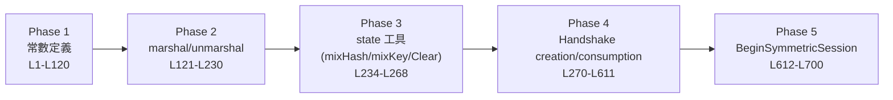

# 課堂 6.4 — WireGuard 原始碼通讀（一）：握手——把 spec 對應到 Go function

## 學前知道
- **前置課**：[6.3 WireGuard whitepaper 精讀](6.3-wireguard-whitepaper.md)。沒讀完別讀這堂——對你毫無意義。
- **預計閱讀時間**：60~90 分鐘 + 至少 1 小時打開編輯器自己跟著看
- **必讀原始碼版本**：`wireguard-go` commit **`f333402bd9cbe0f3eeb02507bd14e23d7d639280`**（2025-05-22 main HEAD；本堂所有行號以此 snapshot 為準）。Repo: https://git.zx2c4.com/wireguard-go
- **本堂涵蓋檔案**：
  - `device/noise-protocol.go`（718 行，handshake 主邏輯）
  - `device/noise-helpers.go`（108 行，KDF / HMAC / key 工具）
  - `device/noise-types.go`（78 行，NoisePrivateKey/NoisePublicKey 型別）
  - `device/cookie.go`（248 行，MAC1/MAC2 + cookie reply）
  - `device/receive.go:271-...` 中的 `RoutineHandshake`

## 動機

[6.3] 我們把 whitepaper 精讀完，知道了 spec 應該長什麼樣。本堂把每一條 spec 規則對應到實際的 Go function。你看完這堂後，**應該能在任何 WireGuard 衍生實作（如 amneziawg、BoringTun）裡認出對應位置**——這是後續 [6.7] 分析「WireGuard 為什麼被打 + 怎麼 mod 」與 [6.8/6.9] 對比實作的基礎。

更重要的研究價值：**WireGuard 的 Go 實作是極好的「乾淨 protocol code 範本」**。10000 行 Go，無依賴黑魔法、無 panic-prone 設計、所有 critical path 都用 sync primitive 嚴格保護。這對我們 G6 的 reference implementation 是無價對照。

---

## 核心概念

### 1. 全檔結構：5 個 phase

`noise-protocol.go` 可拆成 5 個 phase：



每個 phase 對應 whitepaper 的不同章節：
- Phase 1 ↔ whitepaper §5.2 (cryptographic primitives) + §5.4 (wire format constants)
- Phase 2 ↔ whitepaper §5.4 (wire format)
- Phase 3 ↔ Noise framework spec §5 (handshake state)
- Phase 4 ↔ whitepaper §5.4 (handshake messages)
- Phase 5 ↔ whitepaper §5.4.6 (transport key derivation)

### 2. 常數與型別（L49-L120）

```go
const (
    NoiseConstruction = "Noise_IKpsk2_25519_ChaChaPoly_BLAKE2s"  // L50
    WGIdentifier      = "WireGuard v1 zx2c4 Jason@zx2c4.com"     // L51
    WGLabelMAC1       = "mac1----"                                // L52
    WGLabelCookie     = "cookie--"                                // L53
)
```

**⚠️ 校正 [6.3]**：實際 Noise pattern 是 `Noise_IKpsk2_25519_ChaChaPoly_BLAKE2s`，**不是純 IK**。`psk2` 後綴指 PSK 套用在 pattern token 第 2 個位置（即 responder 的最後一輪）。當你沒設 PSK，spec 規定用 32 bytes 全零代入——這就是 Lipp 2019 證明中 "PSK absence" 的 corner case 起源。

```go
const (
    MessageInitiationType  = 1   // L58
    MessageResponseType    = 2   // L59
    MessageCookieReplyType = 3   // L60
    MessageTransportType   = 4   // L61
)

const (
    MessageInitiationSize      = 148                                      // L65
    MessageResponseSize        = 92                                       // L66
    MessageCookieReplySize     = 64                                       // L67
    MessageTransportHeaderSize = 16                                       // L68
    MessageTransportSize       = MessageTransportHeaderSize + poly1305.TagSize  // L69 = 32
    MessageKeepaliveSize       = MessageTransportSize                     // L70 = 32
)
```

**關鍵觀察**：所有 message size **編譯期常數**。reimplementer 沒辦法不小心打錯——這是 Donenfeld 抗 implementation bug 的工程選擇。對比 IPsec 與 OpenVPN 都允許動態 packet size，attack surface 大很多。

`MessageInitiation` struct 在 L85-93：
```go
type MessageInitiation struct {
    Type      uint32                                              // 第 1 byte + 3 byte reserved，用 LE uint32 表示
    Sender    uint32                                              // session ID
    Ephemeral NoisePublicKey                                      // 32 B
    Static    [NoisePublicKeySize + poly1305.TagSize]byte         // 32 + 16 = 48 B
    Timestamp [tai64n.TimestampSize + poly1305.TagSize]byte       // 12 + 16 = 28 B
    MAC1      [blake2s.Size128]byte                               // 16 B
    MAC2      [blake2s.Size128]byte                               // 16 B
}
// 總計：4 + 4 + 32 + 48 + 28 + 16 + 16 = 148 B  ✓ matches MessageInitiationSize
```

完美對應 whitepaper §5.4.2。**研究級觀察**：Go 的 fixed-size byte array 型別 (`[N]byte`) 是 WireGuard implementation 抗 buffer overflow 的核心——所有 marshal/unmarshal 都在 stack-allocated array 上做，沒有 length 計算錯誤的可能。對比 OpenVPN 的 `unsigned char *buf` + `int len` 風格，安全性差距巨大。

### 3. State 工具：mixHash / mixKey（L234-L268）

Noise framework 的核心狀態更新算子：

```go
func mixKey(dst, c *[blake2s.Size]byte, data []byte) {     // L234
    KDF1(dst, c[:], data)
}

func mixHash(dst, h *[blake2s.Size]byte, data []byte) {    // L238
    hash, _ := blake2s.New256(nil)
    hash.Write(h[:])
    hash.Write(data)
    hash.Sum(dst[:0])
}
```

`mixHash` 把當前 transcript hash `h` 與新資料 `data` 串接後 BLAKE2s。`mixKey` 用 `KDF1`（在 noise-helpers.go:43）更新 chain key。

`Clear()` 在 L246-253 把 handshake state 全部歸零並從 indexTable 移除——**這是 forward secrecy 的物質保證**：rekey 後舊 state 立即清除，記憶體 dump 不能恢復舊 key。

`init()` 在 L265-268 算出兩個 constants：
```go
InitialChainKey = blake2s.Sum256([]byte(NoiseConstruction))
mixHash(&InitialHash, &InitialChainKey, []byte(WGIdentifier))
```

對應 whitepaper §5.4.2：每個 handshake 從這兩個全網共享的常數開始。

### 4. CreateMessageInitiation（L270-L339）：initiator 第一步

這是 client 連 server 時，client 端建造第一封 handshake 的 function。**逐段拆**：

```go
// L270-271
func (device *Device) CreateMessageInitiation(peer *Peer) (*MessageInitiation, error) {
    device.staticIdentity.RLock()       // 我方 static identity，讀鎖
    defer device.staticIdentity.RUnlock()

    handshake := &peer.handshake
    handshake.mutex.Lock()              // peer 的 handshake state，寫鎖
    defer handshake.mutex.Unlock()
```

**研究級觀察**：**雙鎖順序**很關鍵。device-level static identity 鎖在前，peer-level handshake 鎖在後。倒過來會 deadlock（因為其他路徑可能反向取）。這是 Donenfeld 用 Go 的 channel-and-mutex 模型替代 Linux kernel 的 spinlock-and-rcu 模型的工程細節。

```go
// L283-288
handshake.hash = InitialHash
handshake.chainKey = InitialChainKey
handshake.localEphemeral, err = newPrivateKey()      // 產生 eph_i
if err != nil {
    return nil, err
}

handshake.mixHash(handshake.remoteStatic[:])         // h = HASH(h || static_r)
```

對應 Noise IK 第一步：mixHash with peer (responder) static pk。**注意**：peer 的 static pk 是 OOB 已知的（從 config 來），不在 wire 上傳——這正是 Noise IK 設計核心。

```go
// L291-294
msg := MessageInitiation{
    Type:      MessageInitiationType,
    Ephemeral: handshake.localEphemeral.publicKey(),
}

handshake.mixKey(msg.Ephemeral[:])   // ck = KDF1(ck, eph_i_pub)
handshake.mixHash(msg.Ephemeral[:])  // h = HASH(h || eph_i_pub)
```

```go
// L298-307
// encrypt static key
ss, err := handshake.localEphemeral.sharedSecret(handshake.remoteStatic)  // DH(eph_i, static_r)
if err != nil {
    return nil, err
}
var key [chacha20poly1305.KeySize]byte
KDF2(
    &handshake.chainKey,
    &key,
    handshake.chainKey[:],
    ss[:],
)                                                  // (ck, k1) = KDF2(ck, DH(eph_i, static_r))
aead, _ := chacha20poly1305.New(key[:])
aead.Seal(msg.Static[:0], ZeroNonce[:], device.staticIdentity.publicKey[:], handshake.hash[:])
                                                  // msg.Static = AEAD(k1, 0, static_i, AD=h)
handshake.mixHash(msg.Static[:])
```

**這是 5-DH 的第一個 DH**：`DH(eph_i, static_r)`。產出的 shared secret 過 KDF2 出 chain key 與 encryption key，後者用來加密 `static_i`。**注意 AAD = `handshake.hash`**——保證 transcript 完整性。

```go
// L311-319
// encrypt timestamp
if isZero(handshake.precomputedStaticStatic[:]) {     // 預算的 DH(static_i, static_r)
    return nil, errInvalidPublicKey
}
KDF2(
    &handshake.chainKey,
    &key,
    handshake.chainKey[:],
    handshake.precomputedStaticStatic[:],
)                                                  // (ck, k2) = KDF2(ck, DH(static_i, static_r))
timestamp := tai64n.Now()
aead, _ = chacha20poly1305.New(key[:])
aead.Seal(msg.Timestamp[:0], ZeroNonce[:], timestamp[:], handshake.hash[:])
                                                  // msg.Timestamp = AEAD(k2, 0, TAI64N, AD=h)
```

**這是 5-DH 的第二個 DH**：`DH(static_i, static_r)`。`precomputedStaticStatic` 是 device 初始化時就算好的——避免每次 handshake 重算（X25519 雖快仍要 ~50μs/op）。Timestamp 是 12 bytes TAI64N，用於 anti-replay。

```go
// L320-329
// assign index
device.indexTable.Delete(handshake.localIndex)
msg.Sender, err = device.indexTable.NewIndexForHandshake(peer, handshake)
if err != nil {
    return nil, err
}
handshake.localIndex = msg.Sender

handshake.mixHash(msg.Timestamp[:])
handshake.state = handshakeInitiationCreated
return &msg, nil
```

`indexTable` 是 device 全局的 random uint32 → (peer, handshake) 映射，用於收到 response 時快速 demux。`NewIndexForHandshake` 內部抽 cryptographic-random uint32，retry 直到找到未佔用值。

**到此為止，msg 已含**：
- type (1B) + reserved (3B) + Sender (4B) = 8B
- Ephemeral (32B)
- Static encrypted (48B)
- Timestamp encrypted (28B)
- MAC1 + MAC2 未填（在 send.go 送出前由 `cookieGenerator.AddMacs` 填）

MAC1/MAC2 的計算我們在第 5 節看。

### 5. ConsumeMessageInitiation（L340-L443）：responder 解析

server 收到 init 時：

```go
// L340
func (device *Device) ConsumeMessageInitiation(msg *MessageInitiation) *Peer {
    var (
        hash     [blake2s.Size]byte
        chainKey [blake2s.Size]byte
    )

    // 對 msg 重做 initiator 同樣的 transcript 計算...
```

**核心邏輯（簡化）**：
1. 從 `msg.Ephemeral` 算 `DH(static_responder, eph_i)` —— 對應 5-DH 第 1 個（但從 responder 視角）。
2. 用此 derive key 解密 `msg.Static` 拿到 initiator 的 static pk。
3. 從 `msg.Static` 對應的 peer config 查 `precomputedStaticStatic`，derive key 解密 `msg.Timestamp`。
4. 驗證 timestamp > peer.lastTimestamp（anti-replay；TAI64N 是 monotonic）。
5. **若任何一步失敗，立即 return nil**——**server 不發任何錯誤回應**（這是 probe resistance 的核心）。

關鍵 anti-replay 在 L420-ish：
```go
ok := timestamp.After(handshake.lastTimestamp)
if !ok {
    handshake.mutex.RUnlock()
    return nil
}
```

**研究級觀察**：把 anti-replay 的 last_timestamp 存 per-peer（不是全局），意味著 attacker 對 peer A 截下的 init 不能 replay 攻擊 peer B。這是 Bellovin 1996 警告的 "context 流動性" 問題的 WireGuard 解法。

### 6. CreateMessageResponse（L444-L511）：responder 回應

```go
// L450-455
handshake.localEphemeral, err = newPrivateKey()     // eph_r
msg := MessageResponse{
    Type:     MessageResponseType,
    Sender:   ...,
    Receiver: handshake.remoteIndex,
}

handshake.mixHash(msg.Ephemeral[:])
handshake.mixKey(msg.Ephemeral[:])
```

接著做 **5-DH 的第 3、4 個 DH**：
```go
// L466-468
mixKey(&handshake.chainKey, &handshake.chainKey, ss[:])  // DH(eph_r, eph_i)
ss, _ = handshake.localEphemeral.sharedSecret(handshake.remoteStatic)
mixKey(&handshake.chainKey, &handshake.chainKey, ss[:])  // DH(eph_r, static_i)
```

第 5 個是 PSK 套入：
```go
// L470-478
var tau [blake2s.Size]byte
var key [chacha20poly1305.KeySize]byte
KDF3(
    &handshake.chainKey,
    &tau,
    &key,
    handshake.chainKey[:],
    handshake.presharedKey[:],     // 若無 PSK 即 32 bytes 0
)
handshake.mixHash(tau[:])
```

**KDF3**（noise-helpers.go:56）一次出三把 key——對應 Noise psk2 的 (ck', tau, k) 三元組。`tau` 是 transcript hash 的補強，`key` 是用於最後 empty AEAD 的 key。

```go
// L484-486
aead, _ := chacha20poly1305.New(key[:])
aead.Seal(msg.Empty[:0], ZeroNonce[:], nil, handshake.hash[:])  // 0-byte plaintext, 16-byte tag
```

**這是 Noise IK 最後的 zero-length AEAD 認證**——`msg.Empty` 只有 16 bytes Poly1305 tag，沒有 ciphertext。這個 tag 同時認證了 (hash 中已 commit 的) 全部 transcript。

### 7. ConsumeMessageResponse（L512-L611）+ BeginSymmetricSession（L612-L700）

ConsumeMessageResponse 對 response 做 initiator 視角的對應計算，最後驗證 `msg.Empty` 的 AEAD tag。若成功，handshake 狀態進入 `handshakeResponseConsumed`。

**BeginSymmetricSession**（L612-L700）做 transport key 推導：

```go
// L646-660 (rough)
var sendKey, receiveKey [chacha20poly1305.KeySize]byte
KDF2(
    &sendKey,
    &receiveKey,
    handshake.chainKey[:],   // 最終的 chain key
    nil,
)

if isInitiator {
    keypair.send = newAEAD(sendKey[:])
    keypair.receive = newAEAD(receiveKey[:])
} else {
    keypair.send = newAEAD(receiveKey[:])     // 注意 swap
    keypair.receive = newAEAD(sendKey[:])
}
```

**這是 5-DH 全部完成後最終的 key split**：`KDF2(final_chain_key, "")` 出兩把 key，按角色 swap。注意 `sendKey` 在 initiator 端 = `receiveKey` 在 responder 端——**確保 per-direction key 不重用**。

完成後把 keypair 放進 peer.keypairs 並啟動 timer state machine（[6.5](6.5-wireguard-source-datapath.md) 詳述）。

### 8. noise-helpers.go：KDF / DH 工具

完整 108 行，是 WireGuard 密碼學工具庫的「最小可運行」實作：

```go
// L24-31
func HMAC1(sum *[blake2s.Size]byte, key, in0 []byte) {
    mac := hmac.New(func() hash.Hash {
        h, _ := blake2s.New256(nil)
        return h
    }, key)
    mac.Write(in0)
    mac.Sum(sum[:0])
}
```

HMAC-BLAKE2s 是 KDF 的 building block。KDF1/2/3 用 HKDF 風格構造（noise-helpers.go:43-63）：

```go
// L43-47
func KDF1(t0 *[blake2s.Size]byte, key, input []byte) {
    HMAC1(t0, key, input)
    HMAC1(t0, t0[:], []byte{0x1})
}

// L48-55
func KDF2(t0, t1 *[blake2s.Size]byte, key, input []byte) {
    var prk [blake2s.Size]byte
    HMAC1(&prk, key, input)
    HMAC1(t0, prk[:], []byte{0x1})
    HMAC2(t1, prk[:], t0[:], []byte{0x2})
    setZero(prk[:])           // 立即清 prk
}
```

**研究級觀察**：`setZero(prk[:])` 在 L54 是 forward secrecy 的小但重要細節——extract 階段的 prk 用完即清，避免在 heap 上殘留。Go 的 GC 不保證 zeroize，所以必須手動。`setZero` 在 L74:
```go
func setZero(arr []byte) {
    for i := range arr {
        arr[i] = 0
    }
}
```
這個 loop 在 Go 的 escape analysis 後**不會被優化掉**（compiler 不知道 arr 之後是否被讀），但若有人重寫成 `copy(arr, make([]byte, len(arr)))` 等等，可能被優化掉。**這是 cryptographic engineering 的 trap**（[3.14 crypto engineering](../part-3-cryptography/3.14-crypto-engineering.md) 已伏筆）。

X25519：
```go
// L100-107
func (sk *NoisePrivateKey) sharedSecret(pk NoisePublicKey) (ss [NoisePublicKeySize]byte, err error) {
    apk := (*[NoisePublicKeySize]byte)(&pk)
    ask := (*[NoisePrivateKeySize]byte)(sk)
    ss, err1 := curve25519.X25519(ask[:], apk[:])
    if err1 != nil {
        return [NoisePublicKeySize]byte{}, errInvalidPublicKey
    }
    return
}
```

`curve25519.X25519` 是 Go 標準庫的 X25519 實作（constant-time）。**注意 err 處理**：若 pk 是 low-order point（small subgroup attack 來源），`X25519` 返回 0 點，這裡會檢查並返回 `errInvalidPublicKey`。

`clamp()` 在 L80：
```go
func (sk *NoisePrivateKey) clamp() {
    sk[0] &= 248
    sk[31] = (sk[31] & 127) | 64
}
```
即 RFC 7748 的 clamping：清 LSB 3 bit + 強制 bit 254 為 1。確保 scalar 在合法範圍。

### 9. cookie.go：MAC1 / MAC2 / cookie reply

```go
// L44-58 (rough)
func (st *CookieChecker) Init(pk NoisePublicKey) {
    // mac1 key = BLAKE2s(LABEL_MAC1 || pk)
    st.mac1.key = blake2s.Sum256([]byte(WGLabelMAC1)... pk...)
    // cookie key = BLAKE2s(LABEL_COOKIE || pk)
    st.mac2.encryptionKey = blake2s.Sum256(...)
    // 每 2 分鐘 rotate 的 secret
    st.mac2.secret = random
}
```

CheckMAC1（L69-85）對 incoming packet 算 MAC1 並比對：

```go
// L69-85
func (st *CookieChecker) CheckMAC1(msg []byte) bool {
    smac1 := msg[len(msg)-blake2s.Size128*2 : len(msg)-blake2s.Size128]
    var mac1 [blake2s.Size128]byte
    mac, _ := blake2s.New128(st.mac1.key[:])
    mac.Write(msg[:len(msg)-blake2s.Size128*2])
    mac.Sum(mac1[:0])
    return hmac.Equal(mac1[:], smac1)
}
```

**注意 `hmac.Equal`** —— constant-time 比對，避免 timing side channel。

CheckMAC2（L86-115）類似，但 key 是當前 cookie。

`AddMacs`（L215-247）在 send 端把 MAC1 / MAC2 計算並寫入 message。

### 10. RoutineHandshake（receive.go:271）：把上述函數串成 receive 路徑

```go
// receive.go:271-...
func (device *Device) RoutineHandshake(id int) {
    for elem := range device.queue.handshake.c {
        switch elem.msgType {
        case MessageCookieReplyType:
            // L289-: 解析 cookie reply, ConsumeReply
        case MessageInitiationType, MessageResponseType:
            // L316-: CheckMAC1
            if !device.cookieChecker.CheckMAC1(elem.packet) {
                goto skip
            }
            if device.IsUnderLoad() {
                // L325-: CheckMAC2 / SendHandshakeCookie / ratelimit
            }
        }

        switch elem.msgType {
        case MessageInitiationType:
            // L355-: ConsumeMessageInitiation → SendHandshakeResponse
        case MessageResponseType:
            // L420-: ConsumeMessageResponse → BeginSymmetricSession
        }
    }
}
```

**這個 routine 是 server 端整段 handshake 路徑的 dispatcher**。重要設計：

1. **MAC1 永遠檢查**——drop everything that fails；對應 whitepaper §5.4.7。
2. **UnderLoad 才檢查 MAC2 + ratelimit**——平時零開銷。
3. **任何失敗 silently goto skip**——**沒有錯誤回應**。對抗 active probing 的核心。
4. **handshake 處理用 worker pool**（N 個 RoutineHandshake goroutines）——CPU-bound 操作平行化。

### 11. 對 G6 的 implementation 啟示

| WireGuard 原始碼設計 | G6 該不該抄 |
|---|---|
| Fixed-size byte array 表示 message | ✅ 抄 |
| 雙鎖：device static identity → peer handshake | ✅ 抄 |
| Precomputed `static-static` DH | ✅ 抄（reduce per-handshake cost） |
| 立即 `setZero` 所有 ephemeral key material | ✅ 抄 |
| `MAC1` 永遠檢查 + UnderLoad 才 MAC2 | ✅ 抄 |
| Silently drop on any error | ✅ 抄（probe resistance） |
| Goroutine pool for handshake processing | ✅ 抄 |
| 固定 message size constants | ⚠️ 改：G6 用 length-prefixed + padding，仍須 deterministic 但變化 |
| Static identity 在 device 級單一 | ⚠️ 改：G6 可能 multi-identity / per-session rotation |

---

## 與我們協議設計的關聯

讀完本堂，你應該能：
1. **指出 wireguard-go 哪些行對應 whitepaper 哪節**。
2. **預測自己寫 G6 reference impl 時的 module layout**——它應該長得很像 `device/noise-protocol.go + noise-helpers.go + cookie.go`。
3. **辨識 attack surface**——例如：如果有人改 `setZero` 為 `copy(arr, zeros)`，Go compiler 可能優化掉 → memory 殘留 → forward secrecy 弱化。
4. **準備 [6.7] 的「怎麼 mod WireGuard 對抗 GFW」**——例如改 `Type` 為 entropy-uniform、改 message size 加 random padding。

[Part 11.7 G6 reference impl](../part-11-design/) 設計階段，這份 source walk 是核心參考。

---

## 動手（可選）

### 實驗 6.4.A：把 wireguard-go clone 到本機，bookmark 上述 11 個位置

```bash
git clone --depth 1 https://git.zx2c4.com/wireguard-go ~/code/wireguard-go-study
cd ~/code/wireguard-go-study
git log -1 --format='%H %cI'   # 紀錄你看的 commit
```

打開 VSCode 或 vim，把本堂列的每個函數加 bookmark。

### 實驗 6.4.B：跑 noise_test.go 與 cookie_test.go

```bash
cd ~/code/wireguard-go-study
go test ./device/ -run Noise -v
go test ./device/ -run Cookie -v
```

確認所有 test 通過。**研究問題**：哪些 test case 覆蓋了 PSK / no-PSK 切換？這對應 Lipp 2019 證明中的 corner case。

### 實驗 6.4.C：故意把 `setZero` 改成 `copy(arr, make([]byte, len(arr)))`，看效能 / 行為差別

```go
func setZero(arr []byte) {
    copy(arr, make([]byte, len(arr)))
}
```

`go test ./device/` 應該全綠（功能上等價）。但用 `objdump -d` 或 `go tool compile -S` 看編譯出的指令——你會發現某些 caller 處 compiler 把這個 copy 優化掉了。**這就是 crypto engineering 的細節**：spec 正確 ≠ 實作正確。

### 實驗 6.4.D（推薦）：用 Wireshark 抓你 [6.3 實驗 B] 的 handshake init，逐 byte 對應到 MessageInitiation struct 的每個 field。

---

## 自我檢查

1. `Noise_IKpsk2_25519_ChaChaPoly_BLAKE2s` 的 `psk2` 是什麼意思？對應 noise-protocol.go 哪幾行的邏輯？
2. `precomputedStaticStatic` 為什麼存在？拿掉會有什麼後果？
3. `setZero` 為什麼用 for-loop 不用 `copy`？對應 [3.14 crypto engineering](../part-3-cryptography/3.14-crypto-engineering.md) 的哪個原則？
4. `RoutineHandshake` 為什麼用 worker pool 而非 single goroutine？這對 G6 的影響？
5. 為什麼 `ConsumeMessageInitiation` 失敗時 server 不發任何回應？這是哪個 design property 的 implementation realization？
6. `MAC1` 與 `MAC2` 在 receive 路徑的分工你能畫出來嗎？對應 [6.3 第 4 節] 的 mermaid 圖？

---

## 延伸閱讀

- `wireguard-go` 整個 repo 的 `git log` —— Donenfeld 與 reviewers 的設計討論在 commit message 內。
- Mailing list discussion on PSK: https://lists.zx2c4.com/pipermail/wireguard/2018-March/ ——`Noise_IKpsk2` 的選擇理由。
- Trevor Perrin's Noise spec rev34: https://noiseprotocol.org/noise.html — psk modifier 的正式定義。

---

## 研究級補遺

### 1. 學界詞彙

- **Marshal / Unmarshal**：對應 protocol buffer 的 serialize / deserialize；WireGuard 不用 protobuf（lighter weight），自己手寫 byte-level。
- **Indextable**：random uint32 → handshake state 的映射。等價於 IPsec 的 SPI 表，但完全在 receiver 控制下（initiator 不能 forge 對方的 index）。
- **Chain Key (ck)**：Noise framework 的累積 key material。每經一個 DH 就用 KDF 更新。
- **Transcript Hash (h)**：累積所有 handshake bytes 的 BLAKE2s hash。每封 message 都有「我看到的 transcript 跟你一樣」這個隱含 assert。

### 2. 對手分類學 / 威脅模型精化

對 wireguard-go 實作的攻擊者面：

| 等級 | 攻擊面 | 緩解 |
|---|---|---|
| **passive on-path** | 看到 ciphertext + size + timing | AEAD + fixed sizes |
| **active on-path** | 注入 init/response | MAC1 + cookie + replay |
| **prober** | 對 server 發 probe | MAC1 = silent drop |
| **memory snooper (local)** | 讀 process memory | `setZero` + Go stack 局部變數 |
| **timing side channel** | CPU timing leak | constant-time `hmac.Equal`、constant-time X25519 |
| **compiler optimization-induced leak** | `setZero` 被優化掉 | 手工 for-loop（暫時保險） |

[3.13 side channels](../part-3-cryptography/3.13-side-channels.md) 有詳細討論。

### 3. 形式化定義

WireGuard implementation 與 spec 的對應：每個 `mixKey` / `mixHash` 對應一個 Noise framework symbolic operation；每個 `KDF{1,2,3}` 對應一個 HKDF-Extract+Expand 組合。Lipp 2019 的 mechanised proof 對應到 `noise-protocol.go` 的每行邏輯，**但 implementation 本身未被 verified**——這是 [Part 5.7 CryptoVerif → F* → wireguard-go-verified] 的長期目標。

### 4. 領域的關鍵論文 / 規格 / 原始碼

| 文獻 | 為何追 | 對應位置 |
|---|---|---|
| Noise spec rev34 | psk2 modifier 定義 | 本堂 §2 |
| Donenfeld 2017 NDSS | spec 對應 | 全堂 |
| RFC 7748 (X25519) | clamping 規格 | §8 |
| RFC 5869 (HKDF) | KDF1/2/3 構造原型 | §8 |
| Bernstein 2006 Curve25519 paper | X25519 math | [3.5] |
| Aumasson 2013 BLAKE2 paper | BLAKE2s | [3.3] |
| `wireguard-go` HEAD `f333402` | implementation 標準 | 全堂 |
| Linux kernel `drivers/net/wireguard/` | kernel reference impl | [6.9] |
| BoringTun `boringtun/src/noise/` | Rust impl | [6.8] |
| amneziawg-go `device/noise-protocol.go` | obfuscated fork | [6.7] |

### 5. 我們協議的座標 / 設計取捨

G6 的 reference impl module layout 應該是：

```
g6/
├── handshake/
│   ├── messages.go          ← 對應 noise-protocol.go phase 1-2
│   ├── state.go             ← 對應 noise-protocol.go phase 3
│   ├── initiator.go         ← 對應 CreateMessageInitiation
│   ├── responder.go         ← 對應 ConsumeMessageInitiation + CreateMessageResponse
│   ├── confirm.go           ← Dowling-Paterson tweak: explicit confirmation
│   ├── pq_hybrid.go         ← X25519 + ML-KEM-768
│   └── obfuscation.go       ← entropy-uniform first byte + padding
├── kdf/
│   └── kdf.go               ← 對應 noise-helpers.go
├── cookie/
│   └── cookie.go            ← 對應 cookie.go
└── ...
```

跟 wireguard-go 的差異：
- 加 `confirm.go` 解 Dowling-Paterson barrier。
- 加 `pq_hybrid.go` 做 PQ 過渡。
- 加 `obfuscation.go` 做 first-byte + size obfuscation。
- 其他大部分 1:1 對應。

### 6. 必追資源 / 社群入口

- WireGuard mailing list `wireguard-go` 標籤
- Issue tracker: https://git.zx2c4.com/wireguard-go (read-only) / GitHub mirror
- Trevor Perrin 的 Noise mailing list

### 7. 開放問題

1. **能否用 F* / Verus 對 wireguard-go 做 mechanised verification**？目前只有 spec-level proof，implementation 完全靠 review。這個 gap 是學界長期目標。
2. **GC-language（Go）的 ephemeral key zeroization** 是否真正可靠？Go runtime escape analysis 可能讓 ephemeral 在 heap 上有 copy。能否用 `unsafe` 強制 stack-only？這是 implementation 安全 vs spec 安全的鴻溝。
3. **goroutine 多 worker** 的並發模型對 anti-replay window 一致性的影響——若兩個 worker 同時處理同 peer 的 packet，window 更新的 race condition 處理是否完備？實證上沒見爆出問題，但 formal model 沒覆蓋。

---

**下一堂**：[6.5 WireGuard 原始碼通讀（二）：資料路徑](6.5-wireguard-source-datapath.md) — 從 `RoutineEncryption` 到 `RoutineDecryption`，看 transport layer 如何達成 1 Gbps。
