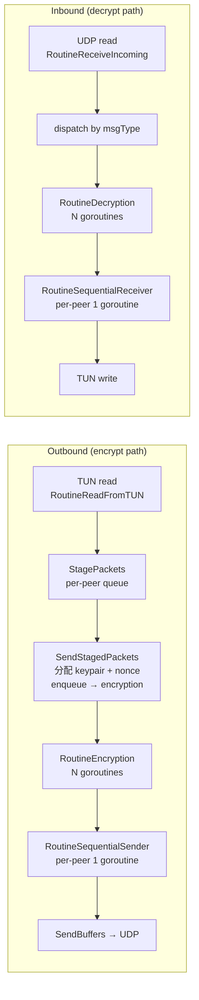
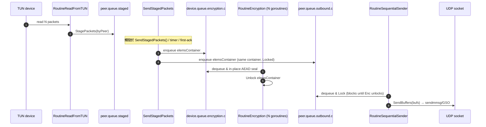

# 課堂 6.5 — WireGuard 原始碼通讀（二）：資料路徑——1 Gbps 從哪來

## 學前知道
- **前置課**：[6.4 WireGuard 原始碼通讀（一）](6.4-wireguard-source-handshake.md)。本堂沿用同一 `wireguard-go` commit `f333402b...` (2025-05-22 main)。
- **預計閱讀時間**：60~80 分鐘
- **本堂涵蓋檔案**：
  - `device/send.go`（542 行，outbound 路徑）
  - `device/receive.go`（536 行，inbound 路徑）
  - `device/channels.go`（137 行，queue 結構）
  - `device/keypair.go`（52 行，per-session key + replay filter）
  - `device/timers.go`（221 行，4 個 timer 的狀態機）
  - `device/constants.go`（39 行，timer/size 常數）
- **跟 Part 2 的接合**：本堂的「為什麼快」直接對應 [2.3 zero-copy](../part-2-high-perf-io/) 與 [2.x batched syscall]；本堂用到的 GSO/GRO 在 [2.5] 有講。

## 動機

WireGuard 在 2017 NDSS 報出 1 Gbps single-core throughput。對抗 OpenVPN（~260 Mbps）勝在「全 kernel」；對抗 IPsec（~880 Mbps）勝在「無 SAD/SPD lookup overhead」。本堂研究 `wireguard-go` 的 user-space 實作如何**逼近** kernel 性能。

關鍵設計：**多階段 pipeline + per-stage goroutine 平行 + 嚴格保序送 TUN/UDP**。



「**N goroutines 平行 AEAD + 1 goroutine 保序送出**」是 wireguard-go 的核心結構。本堂逐函數拆解。

---

## 核心概念

### 1. Outbound：從 TUN 讀進來到 UDP 寫出去

#### Stage 1: RoutineReadFromTUN（send.go:206）

```go
// send.go:206-...
func (device *Device) RoutineReadFromTUN() {
    var (
        batchSize   = device.BatchSize()
        readErr     error
        elems       = make([]*QueueOutboundElement, batchSize)
        bufs        = make([][]byte, batchSize)
        elemsByPeer = make(map[*Peer]*QueueOutboundElementsContainer, batchSize)
        count       = 0
        sizes       = make([]int, batchSize)
        ...
    )
```

關鍵點：
- **批次讀**：`batchSize` 一次最多讀 N 封 packet。Linux 上用 `TUN/TAP` 的 multi-packet read（`recvmmsg`-style），macOS 上 fall back to single。
- **per-peer 分組**：讀進來後 by inner dst IP 查 `allowedips` trie 找到 peer，把同 peer 的封包打包進 `elemsByPeer[peer]`。
- **目的**：後續 encryption 與 UDP send 都能批次處理，攤平 syscall overhead。

#### Stage 2: StagePackets（send.go:318）+ SendStagedPackets（send.go:337）

```go
// send.go:318-336
func (peer *Peer) StagePackets(elems *QueueOutboundElementsContainer) {
    for {
        select {
        case peer.queue.staged <- elems:
            return
        default:
        }
        select {
        case tooOld := <-peer.queue.staged:
            // drop oldest if full
            for _, elem := range tooOld.elems {
                peer.device.PutMessageBuffer(elem.buffer)
                peer.device.PutOutboundElement(elem)
            }
            peer.device.PutOutboundElementsContainer(tooOld)
        default:
        }
    }
}
```

**意思**：staged queue 滿了就 drop **oldest**（不是 newest）。這是 active queue management 的標準作法（CoDel-like），避免 buffer bloat。

`SendStagedPackets`（send.go:337）：

```go
// send.go:337-...
func (peer *Peer) SendStagedPackets() {
top:
    if peer.device.isClosed() { return }

    keypair := peer.keypairs.Current()      // 拿當前 session keypair
    if keypair == nil || keypair.sendNonce.Load() >= RejectAfterMessages || time.Since(keypair.created) >= RejectAfterTime {
        peer.SendHandshakeInitiation(false)  // 沒 keypair / 太老 → 觸發 handshake
        return
    }

    // dequeue staged elems, assign nonce, encrypt
    ...
    for _, elem := range elemsContainer.elems {
        elem.nonce = keypair.sendNonce.Add(1) - 1   // atomic 取 nonce
        if elem.nonce >= RejectAfterMessages {
            keypair.sendNonce.Store(RejectAfterMessages)
            peer.SendStagedPackets()  // re-trigger
            ...
        }
        elem.keypair = keypair
    }
    ...
    peer.device.queue.encryption.c <- elemsContainer
    peer.queue.outbound.c <- elemsContainer
}
```

**關鍵設計**：
- **nonce 由 `atomic.Uint64.Add` 取**（keypair.go:24 `sendNonce atomic.Uint64`）——保證即使多 goroutine 同時 stage packets，nonce 永不重複。
- **同一 elemsContainer 同時 enqueue 到 encryption.c 與 outbound.c**：encryption goroutine 加密完釋放 Lock；sequential sender 拿到 elemsContainer 後 acquire Lock（會 block 直到加密完）。**用 mutex 而非 channel 同步**——避免 channel scheduling overhead。

#### Stage 3: RoutineEncryption（send.go:439）

```go
// send.go:439-475
func (device *Device) RoutineEncryption(id int) {
    var paddingZeros [PaddingMultiple]byte
    var nonce [chacha20poly1305.NonceSize]byte

    for elemsContainer := range device.queue.encryption.c {
        for _, elem := range elemsContainer.elems {
            // 寫 transport header (16 bytes)
            header := elem.buffer[:MessageTransportHeaderSize]
            binary.LittleEndian.PutUint32(header[0:4], MessageTransportType)  // 0x04
            binary.LittleEndian.PutUint32(header[4:8], elem.keypair.remoteIndex)
            binary.LittleEndian.PutUint64(header[8:16], elem.nonce)

            // padding to multiple of 16
            paddingSize := calculatePaddingSize(len(elem.packet), int(device.tun.mtu.Load()))
            elem.packet = append(elem.packet, paddingZeros[:paddingSize]...)

            // AEAD seal
            binary.LittleEndian.PutUint64(nonce[4:], elem.nonce)  // nonce = 0...0 || counter
            elem.packet = elem.keypair.send.Seal(
                header,           // dst (in-place 追加)
                nonce[:],
                elem.packet,
                nil,              // AAD = empty
            )
        }
        elemsContainer.Unlock()      // release for sequential sender
    }
}
```

**精髓**：
1. **In-place encryption**：`Seal(header, ...)` 的第一個 arg 是 `header` 結尾，AEAD 把 ciphertext+tag 直接追加。沒有額外 buffer copy。
2. **Nonce 構造**：`0x00000000 || counter_LE`（前 4 bytes 0 + 8 bytes LE counter）= 96-bit nonce。對應 whitepaper §5.4.6。
3. **Padding 是 16-byte multiple**：`calculatePaddingSize` (send.go:419) 對應 whitepaper §5.4.6。**注意這意味著 packet size 仍洩漏 inner packet size 的 16-byte bucket**——[Part 10 流量分析] 與 [6.7] 會詳述為什麼這對抗審查不夠。
4. **N goroutines**：device.go 起 `runtime.NumCPU()` 個 RoutineEncryption 同時跑，平行 ChaCha20-Poly1305。

#### Stage 4: RoutineSequentialSender（send.go:477）

```go
// send.go:477-...
func (peer *Peer) RoutineSequentialSender(maxBatchSize int) {
    bufs := make([][]byte, 0, maxBatchSize)
    for elemsContainer := range peer.queue.outbound.c {
        bufs = bufs[:0]
        ...
        elemsContainer.Lock()   // 等加密完
        for _, elem := range elemsContainer.elems {
            ...
            bufs = append(bufs, elem.packet)
        }
        peer.timersAnyAuthenticatedPacketTraversal()
        peer.timersAnyAuthenticatedPacketSent()
        err := peer.SendBuffers(bufs)         // 一次 sendmmsg 多封
        ...
        peer.keepKeyFreshSending()            // 是否該開始 rekey
    }
}
```

**精髓**：
1. **per-peer 1 goroutine**：保序送出（同 peer 的 nonce 嚴格順序）。
2. **`SendBuffers(bufs)` 一次 syscall 送多封**——Linux 用 `sendmmsg`，macOS 用 GSO 的等價。對應 [2.x batched syscall]。
3. **timer 更新**：每送一封更新 `lastSent` 等 timer。
4. **`keepKeyFreshSending`**：檢查 keypair 是否該 rekey。

#### Stage 5: GSO（Generic Segmentation Offload）整合

`SendBuffers` 內部會嘗試用 UDP GSO（Linux 5.0+）：

```go
// conn/bind_linux.go (簡化)
hdr := &unix.UdpGsoOffload{...}
syscall.Sendmsg(..., &hdr, ...)
```

GSO 讓 kernel 把多個小 packet 視為一個大 packet 送 NIC，NIC（或 kernel GSO 軟體 fallback）再切分。**這是 wireguard-go 接近 kernel 性能的關鍵**——免去多次 syscall。對應 [1.2 NIC offload](../part-1-networking/1.2-physical-layer.md)。

### 2. Inbound：UDP 進來到 TUN 寫出去

#### Stage 1: RoutineReceiveIncoming（receive.go:72）

```go
// receive.go:72-...
func (device *Device) RoutineReceiveIncoming(maxBatchSize int, recv conn.ReceiveFunc) {
    ...
    for {
        count, err := recv(bufs, sizes, endpoints)   // recvmmsg 批次讀
        ...
        for i := 0; i < count; i++ {
            packet := bufs[i][:sizes[i]]
            msgType := binary.LittleEndian.Uint32(packet[:4])

            switch msgType {
            case MessageTransportType:           // 0x04
                if len(packet) < MessageTransportSize { continue }
                receiver := binary.LittleEndian.Uint32(packet[MessageTransportOffsetReceiver:])
                entry := device.indexTable.Lookup(receiver)
                if entry.peer == nil { continue }
                elem.keypair = entry.keypair
                elem.packet = packet
                elemsByPeer[entry.peer] = append(elemsByPeer[entry.peer], elem)
            case MessageInitiationType, MessageResponseType, MessageCookieReplyType:
                // 送 handshake.c queue
                device.queue.handshake.c <- QueueHandshakeElement{...}
            default:
                continue
            }
        }
        // 分派到 peer.queue.inbound.c + device.queue.decryption.c
        for peer, elemsContainer := range elemsByPeer {
            peer.queue.inbound.c <- elemsContainer
            device.queue.decryption.c <- elemsContainer
        }
    }
}
```

**關鍵**：
1. **msgType 分派**：根據第一個 byte 分到 handshake queue 或 transport pipeline。
2. **indexTable lookup**：transport packet 的 `receiver` field 直接對應到 keypair——O(1) 查表。對比 IPsec 是 SPI lookup，類似但 IPsec 還要查 SPD policy。
3. **per-peer container**：同 peer 的 packet 打包進 elemsContainer，**同時 enqueue 到 inbound queue（sequential receiver）與 decryption queue（並行解密）**——跟 outbound 的 mutex 同步技巧一樣。

#### Stage 2: RoutineDecryption（receive.go:238）

```go
// receive.go:238-267
func (device *Device) RoutineDecryption(id int) {
    var nonce [chacha20poly1305.NonceSize]byte
    for elemsContainer := range device.queue.decryption.c {
        for _, elem := range elemsContainer.elems {
            counter := elem.packet[MessageTransportOffsetCounter:MessageTransportOffsetContent]
            content := elem.packet[MessageTransportOffsetContent:]

            elem.counter = binary.LittleEndian.Uint64(counter)
            binary.LittleEndian.PutUint64(nonce[4:], elem.counter)
            elem.packet, err = elem.keypair.receive.Open(
                content[:0],
                nonce[:],
                content,
                nil,
            )
            if err != nil {
                elem.packet = nil      // 失敗標記，後續忽略
            }
        }
        elemsContainer.Unlock()
    }
}
```

**精髓**：
- **In-place decrypt**：`Open(content[:0], ...)` 把 plaintext 寫回原 buffer。
- **失敗不通報，僅 nil packet**：對應 probe resistance——decrypt 失敗 server **不發任何錯誤**。
- **平行 N goroutines** 同 outbound encryption。

#### Stage 3: RoutineSequentialReceiver（receive.go:429）

```go
// receive.go:429-...
func (peer *Peer) RoutineSequentialReceiver(maxBatchSize int) {
    bufs := make([][]byte, 0, maxBatchSize)
    for elemsContainer := range peer.queue.inbound.c {
        elemsContainer.Lock()      // 等解密完
        for i, elem := range elemsContainer.elems {
            if elem.packet == nil { continue }  // decrypt 失敗

            // anti-replay check
            if !elem.keypair.replayFilter.ValidateCounter(elem.counter, RejectAfterMessages) {
                continue
            }

            if peer.ReceivedWithKeypair(elem.keypair) {
                peer.SetEndpointFromPacket(elem.endpoint)  // roaming
                peer.timersHandshakeComplete()
                peer.SendStagedPackets()    // 第一次收到 → 觸發 staged outbound
            }

            // inner IP version check + AllowedIPs lookup
            switch elem.packet[0] >> 4 {
            case 4:
                src := elem.packet[IPv4offsetSrc : IPv4offsetSrc+net.IPv4len]
                if device.allowedips.Lookup(src) != peer {
                    continue   // inner src IP 不在該 peer AllowedIPs → drop
                }
            case 6:
                ...
            }
            bufs = append(bufs, elem.packet)
        }
        device.tun.device.Write(bufs, MessageTransportOffsetContent)
        ...
    }
}
```

**精髓**：
1. **`replayFilter.ValidateCounter`**：1024-bit sliding window anti-replay。對應 whitepaper §5.4.6。
2. **`ReceivedWithKeypair`** (noise-protocol.go:701)：判斷這是不是這個 keypair 的第一封收到。是 → handshake 正式完成，觸發 staged outbound（從 [6.4 §6] 我們知道 first data packet 兼任 key confirmation）。
3. **inner src IP 必須 ∈ peer.AllowedIPs**：對應 whitepaper cryptokey routing 的 reverse direction。
4. **`Write(bufs, offset)` 批次寫 TUN**——用 `writev` 或 vector write。
5. **Roaming**：`SetEndpointFromPacket` 把 peer 的 endpoint 更新成本封 packet 的 source。**這是 WireGuard 「roaming」設計**：client IP/port 變了 server 自動跟上。沒有專屬 mobility protocol（對比 IPsec MOBIKE）。

### 3. Anti-replay filter（replay 套件）

```go
// device/keypair.go:25
replayFilter replay.Filter
```

`replay.Filter`（在 `golang.zx2c4.com/wireguard/replay`）實作 1024-bit sliding window。介面：
```go
func (f *Filter) ValidateCounter(counter, limit uint64) bool
```
- 若 counter ≥ limit → reject。
- 若 counter > window.head → 接受並滑動 window，舊 bit 清 0。
- 若 counter < window.head - 1024 → reject (too old)。
- 若 counter 在 window 內 → 看對應 bit；已置位 → reject (replay)，否則置位並接受。

對應 RFC 6479 / 4303 §3.4.3 設計。**WireGuard 用 64-bit counter** 而非 IPsec 預設 32-bit，意味著實務上永遠不會 wrap——`2^60` 在 RekeyAfterMessages 已強制 rekey。

### 4. Timer 狀態機（timers.go）

`device/timers.go` 維護每個 peer 的 4 個 timer：

```go
type Timers struct {
    retransmitHandshake     *Timer    // 5s 沒收到 response → 重發 init
    sendKeepalive           *Timer    // idle 10s → 送 keepalive
    newHandshake            *Timer    // 收到 last data > 10s + RekeyTimeout → 重啟 handshake
    zeroKeyMaterial         *Timer    // 3 minutes 後清 long-term ephemeral keys
    persistentKeepalive     *Timer    // 配置 persistentKeepalive 時定期送
    ...
}
```

關鍵 callback：

```go
// timers.go:130-145 (rough)
func expiredNewHandshake(peer *Peer) {
    peer.timers.newHandshake.Mod(KeepaliveTimeout + RekeyTimeout + jitter)
    peer.SendHandshakeInitiation(false)
}

func expiredRetransmitHandshake(peer *Peer) {
    if peer.timers.handshakeAttempts.Load() > MaxTimerHandshakes {
        peer.timers.zeroKeyMaterial.Mod(RejectAfterTime * 3)
        peer.FlushStagedPackets()
        peer.timers.sendKeepalive.Del()
        return
    }
    peer.timers.handshakeAttempts.Add(1)
    peer.SendHandshakeInitiation(true)
}
```

**精髓**：
- **MaxTimerHandshakes = 18** (`90 / 5 = RekeyAttemptTime / RekeyTimeout`)：18 次失敗後放棄並清 key material。
- **`zeroKeyMaterial`**：3 分鐘無活動後把 ephemeral keys 清 0——對應 forward secrecy 的時間粒度。
- **`jitter`**：`RekeyTimeoutJitterMaxMs = 334` ms 隨機抖動，避免多 peer 同步 rekey 造成 traffic spike。

對應 whitepaper §6 的 timer state machine。

### 5. UnderLoad 邏輯（device.go:220）

```go
// device.go:220
underLoad := len(device.queue.handshake.c) >= QueueHandshakeSize/8
```

當 handshake queue 利用率超過 12.5% 時，server 進入 `UnderLoad` 狀態，啟用 MAC2 cookie + ratelimit（receive.go:325-340）。

`UnderLoadAfterTime = 1 second`（constants.go:38）：一旦進入 UnderLoad，至少維持 1 秒——避免 hysteresis 抖動。

### 6. 為什麼這個 pipeline 能逼近 kernel 性能

| 技巧 | 救多少時間 |
|---|---|
| **Batch read/write（recvmmsg/sendmmsg/writev）** | syscall overhead 從 N × 100ns 降到 1 × 200ns |
| **GSO/GRO（UDP segmentation/aggregation）** | 大 packet 一次 NIC offload，省 CPU |
| **Per-peer/per-stage goroutine** | AEAD 平行化吃滿多核 |
| **Mutex 而非 channel 同步 encrypt/send** | 省 channel scheduler 開銷 |
| **In-place AEAD** | 零拷貝 |
| **`allowedips` patricia trie** | O(log N) lookup，比 hash 快（cache-friendly） |
| **`indexTable` 直接 random uint32 → keypair** | inbound demux O(1) |
| **Atomic nonce counter** | 無 mutex 開銷 |
| **Pre-computed `static-static` DH** | handshake 省 ~50μs/op |

對比 kernel impl 多出來的成本：
- **TUN/UDP syscall**（kernel skbuff 沒這個）
- **goroutine scheduler**（kernel softirq 更輕量）

**因此 wireguard-go 大概是 kernel impl 的 70~80% 速度**——已是 user-space VPN 的天花板。

### 7. 完整 outbound 路徑回顧



---

## 與我們協議設計的關聯

### Proteus 應該 inherit 的（直接學）

| WireGuard 設計 | Proteus 採用 |
|---|---|
| 多 stage pipeline + per-stage goroutine | ✅ 必須 |
| Mutex-via-elemsContainer.Lock 同步 encrypt/send | ✅ 學 |
| Atomic counter nonce | ✅ |
| In-place AEAD | ✅ |
| GSO/GRO 整合 | ✅ 必須（Linux 5.0+） |
| 1024-bit sliding window replay filter | ✅ |
| 16-byte padding multiple | ⚠️ **不夠**，Proteus 需要 size obfuscation（[Part 10](../part-10-traffic-analysis/)） |
| Roaming via `SetEndpointFromPacket` | ✅ 但加 path validation（QUIC-style PATH_CHALLENGE，[4.7](../part-4-tls-quic/4.7-quic-transport.md)） |
| Timer 4 個（rekey/reject/keepalive/zeroKey） | ✅ 加 1 個 cover-traffic timer |
| UnderLoad → MAC2 + ratelimit | ✅ + entropy padding on cookie reply |

### Proteus 必須改的（這些是 anti-censorship 必修）

1. **Transport header 加密**：WireGuard 的 16-byte header 是明文（type + receiver + counter）。對 GFW 的 fingerprint 攻擊面巨大。**Proteus day-1 把整個 header 包進 AEAD**。
2. **Padding policy**：16-byte multiple 對 traffic analysis 幾乎無效。Proteus 要：
   - **Random padding to PMTU**（每封都填到 MTU）
   - **Cover traffic on idle**（[Part 10](../part-10-traffic-analysis/) 詳述）
3. **Connection ID 取代 receiver index**：類似 QUIC，避免 IP/port migration 暴露 session。
4. **Inner reliability stream**：WireGuard 純 L3 tunnel；Proteus 要可選 inner QUIC stream，給 TCP-over-WG 的 head-of-line 救火。

### Proteus 不該抄的

- **明文 transport header**（上面已說）
- **roaming 不驗 path**（CVE-class，可被 spoof IP 重定向流量）
- **無 cover traffic**（單純 user-driven traffic 太可預測）

---

## 動手（可選）

### 實驗 6.5.A：用 `perf` 看 wireguard-go 真實的 CPU 分布

```bash
# host A: 跑 iperf3 server
iperf3 -s

# host B: 透過 wg tunnel 連 A，跑 client
sudo perf record -F 999 -g -p $(pgrep wireguard-go) -- sleep 30
sudo perf report --no-children
```

預期看到 ChaCha20-Poly1305、blake2s.compress、syscall (sendmmsg) 是 top 3。

### 實驗 6.5.B：故意關 GSO，看 throughput 掉多少

```bash
sudo ethtool -K eth0 tx-udp-segmentation off
# 重跑 iperf3 對比
```

預期 throughput 掉 30~50%。**研究問題**：哪些情境下 GSO 不能用？對應 [2.5 NIC offload](../part-2-high-perf-io/) 教過的限制。

### 實驗 6.5.C：寫一個 Go 小工具，重現 `replay.Filter.ValidateCounter` 並 fuzz 它

```bash
go install github.com/google/gofuzz/...@latest
# 寫一個 fuzz target 對 1024-bit window 注入 random counter 序列
```

**研究問題**：你能找到 counter 序列導致 window 行為 surprising 的 case 嗎？這是 wireguard-go 早期被 audit 的部分。

### 實驗 6.5.D（推薦）：把整個 outbound pipeline 的 5 stage 在你的腦中畫成 sequence diagram，跟本堂 mermaid 對比。

---

## 自我檢查

1. RoutineEncryption 為什麼有 N 個 goroutine 但 RoutineSequentialSender per-peer 只有 1 個？
2. 為什麼 `elemsContainer.Lock()` 是 encryption 與 sequential sender 之間的同步機制，而不是 channel？
3. `replay.Filter.ValidateCounter` 對 out-of-order packet 的處理是什麼？UDP 允許 reorder，這如何不導致 false-replay rejection？
4. Roaming（`SetEndpointFromPacket`）的安全風險是什麼？對手能否藉此把 peer 的流量重定向到自己？提示：cryptokey routing 提供了什麼防護？
5. 為什麼 transport header 不被 AEAD 認證？這個設計選擇對 receiver_index forge 攻擊面為何？
6. `MaxTimerHandshakes = 18` 與 `RejectAfterTime = 180s` 的對應關係，背後的 protocol guarantee 是什麼？

---

## 延伸閱讀

- WireGuard mailing list 上關於 GSO 整合的 patch series（2019~2020）
- Cloudflare 的 BoringTun 性能 blog（[6.8](6.8-boringtun-rust-comparison.md) 詳述）
- Linux WireGuard kernel impl `drivers/net/wireguard/send.c` + `receive.c`：對比 user-space 的 stage 數 / 同步策略

---

## 研究級補遺

### 1. 學界詞彙

- **AQM (Active Queue Management)**：staged queue drop-oldest 屬於這類。經典代表 CoDel (RFC 8289)。
- **Sliding Window Anti-Replay**：RFC 4303 §3.4.3 / 6479 形式化定義。
- **GSO/GRO (Generic Segmentation Offload / Generic Receive Offload)**：Linux kernel networking offload framework。
- **Single-Producer Single-Consumer (SPSC) Queue**：RoutineSequentialSender 對單一 peer outbound queue 形成 SPSC，可優化成 lock-free。WireGuard 目前用 mutex；BoringTun 用 ringbuffer。
- **Cryptographic doom principle**（Moxie Marlinspike）：「如果你必須對 ciphertext 做任何操作 *before* 認證，必然會出事。」WireGuard 對應做法是 AEAD-in-place + receiver_index 不認證（但不影響安全因為 lookup 失敗只丟封包不洩漏 info）。

### 2. 對手分類學 / 威脅模型精化

對 transport path 的攻擊面：

| 等級 | 攻擊 | WireGuard 防護 | Proteus 改進 |
|---|---|---|---|
| **passive** | size + timing | 16-byte padding（弱）| MTU padding + cover traffic |
| **active replay** | 重送舊 packet | 1024-bit window | sliding window 不變 |
| **active inject** | 偽造 transport | AEAD authentication | + encrypted header |
| **redirect via NAT spoofing** | 偽 source IP 強制 roaming | cryptokey routing 限制 inner src IP | path validation (QUIC PATH_CHALLENGE) |
| **GSO/GRO 邊界** | 利用 segmentation 邊界差洩漏 | 無特殊處理 | Proteus 同（this is at NIC layer） |
| **timing 側通道** | 解密 CPU time → length | constant-time AEAD | constant-time + cover |

### 3. 形式化定義

**Sliding Window Replay Filter 的正確性**（informal）：

> A counter sequence c_1, c_2, ..., c_N is accepted iff: (a) all c_i are pairwise distinct, (b) c_i < limit, (c) c_i ≥ max_seen - WINDOW_SIZE, AND (d) packet ordering is "delivery order", not necessarily numeric order.

形式化驗證 sliding window 對 out-of-order delivery 的正確性，是 [Part 5.8 spec-first methodology](../part-5-formal-methods/5.8-spec-first-methodology.md) 的標準練習。

### 4. 領域的關鍵論文 / 規格 / 原始碼

| 文獻 | 為何追 | 對應位置 |
|---|---|---|
| RFC 6479 (anti-replay sliding window) | replay filter spec | §3 |
| Donenfeld 2017 NDSS | overall data path spec | 全堂 |
| Linux GSO/GRO documentation | NIC offload | §1 |
| `wireguard-go` send.go/receive.go | impl reference | 全堂 |
| Cloudflare BoringTun blog (2019) | Rust impl 性能對比 | [6.8] |
| Linux kernel `drivers/net/wireguard/{send.c,receive.c}` | kernel impl | [6.9] |

### 5. 我們協議的座標 / 設計取捨

Proteus 的 data path module layout（建議）：

```
proteus/transport/
├── header.go          ← encrypted header (type + cid + counter)
├── padding.go         ← MTU-aware random padding policy
├── cover.go           ← idle cover traffic generator
├── pipeline.go        ← stage scheduler (mirror wireguard-go pipeline)
├── replay.go          ← sliding window filter
└── roaming.go         ← path validation (QUIC-style)
```

差異點都在「明文 header」與「padding policy」與「path validation」三條。其他 1:1。

### 6. 必追資源 / 社群入口

- WireGuard mailing list `wireguard-go` 標籤 + Linux netdev list 對 GSO 的 patch review
- Cloudflare engineering blog 對 BoringTun 性能 deep dive
- Tailscale 的 wireguard-go fork 與優化 patches（值得看 commit history）

### 7. 開放問題

1. **wireguard-go 的 goroutine 數量在 N-core 機器上不是最優**——目前用 `runtime.NumCPU()`，但 cache-locality 與 NUMA 考量被忽略。能否設計 NUMA-aware goroutine pinning？
2. **GSO 在 wireguard-go 的整合仍有限**——對 UDP_SEGMENT 的支持各 kernel version 不同。是否該繞過走 XDP/AF_XDP（[2.x XDP](../part-2-high-perf-io/)）？
3. **Inner-traffic-aware padding** 是 Proteus 必須回答的問題：固定 MTU 浪費頻寬；動態 padding 容易洩漏 inner traffic shape。能否用 differential privacy 的 framework 給出 provable bound？這對應 [Part 10 流量分析](../part-10-traffic-analysis/) 與 [Part 11 spec](../part-11-design/) 的長期主題。
4. **`replay.Filter` 在 high-concurrency 下的 lock 行為**：1024-bit window 用一個 mutex 保護，極高 PPS 下會成為 bottleneck。能否設計 lock-free 變體？

---

**下一堂**：[6.6 WireGuard 原始碼通讀（三）：TUN/UDP 整合](6.6-wireguard-tun-udp-integration.md) — 看 OS 邊界（TUN driver 與 UDP socket）如何接合本堂的 pipeline。
