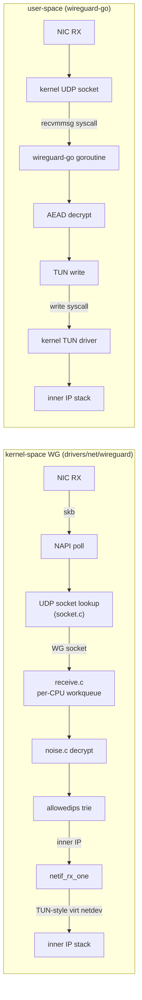

# 課堂 6.9 — WireGuard 在 kernel 的實作（Linux）：4000 行 C 與 user-space 的鴻溝

## 學前知道
- **前置課**：
  - [6.4](6.4-wireguard-source-handshake.md)~[6.6](6.6-wireguard-tun-udp-integration.md)（wireguard-go reference）
  - [6.8](6.8-boringtun-rust-comparison.md)（BoringTun 對照）
  - [2.5 NIC offload](../part-2-high-perf-io/) 與 [2.7 XDP](../part-2-high-perf-io/)（kernel 網路框架基礎）
  - [1.2 NIC ring buffer](../part-1-networking/1.2-physical-layer.md)、[1.4 IP layer](../part-1-networking/1.4-ip-routing-graph.md)（skb / FIB）
- **預計閱讀時間**：60~80 分鐘
- **commit / 版本**：Linux 6.x mainline 的 `drivers/net/wireguard/`，本堂以 [git.zx2c4.com/wireguard-linux](https://git.zx2c4.com/wireguard-linux/tree/drivers/net/wireguard/) 樹的 2025 snapshot 為準
- **必讀檔案結構**：

| 檔案 | bytes | 對應 wireguard-go 檔案 |
|---|---|---|
| `messages.h` | 3.4 KB | noise-types.go + noise-protocol.go const |
| `noise.[ch]` | 31.8 KB | noise-protocol.go + noise-helpers.go |
| `cookie.[ch]` | 8.9 KB | cookie.go |
| `allowedips.[ch]` | 14.3 KB | (separate allowedips package) |
| `peerlookup.[ch]` | 8.2 KB | indextable.go |
| `peer.[ch]` | 10.0 KB | peer.go |
| `device.[ch]` | 15.0 KB | device.go |
| `send.c` | 13.0 KB | send.go |
| `receive.c` | 18.1 KB | receive.go |
| `socket.[ch]` | 12.9 KB | conn/bind_std.go |
| `timers.[ch]` | 9.3 KB | timers.go |
| `ratelimiter.[ch]` | 6.4 KB | rate-limit logic in cookie.go |
| `queueing.[ch]` | 8.7 KB | channels.go |
| `netlink.[ch]` | 17.4 KB | uapi.go |
| `main.c` | 1.7 KB | (module init) |

**總計 ~180 KB，~4000 行 C**——對應 [6.3 §8](6.3-wireguard-whitepaper.md) 的 100× 對比基數。

## 動機

到此你已讀過 user-space 兩個實作（Go、Rust）。kernel 是另一個世界：
- **沒有 GC**，全手動 lifecycle。
- **使用 skb（socket buffer）**，不是 raw `[]byte`。
- **直接掛 netdevice subsystem**，封包進來不經 socket。
- **NEON/AVX 由 kernel 提供的 `crypto/` framework 統一管**。
- **記憶體配置受限**（atomic context, GFP_ATOMIC vs GFP_KERNEL）。

對 Proteus 的價值：
1. **理解 kernel WG 的性能來源**——這是設計 user-space VPN 時要追趕的對象。
2. **理解 kernel 模組的設計約束**——若未來 Proteus 想 upstream，必須遵守。
3. **理解 Linux kernel networking subsystem** 整體（skbuff, GRO, NAPI, fib_lookup, sock）——這是 Phase II 後續 Part 9（GFW 對抗）與 Part 12（implement）的基礎。

---

## 核心概念

### 1. Kernel vs user-space 的根本差異



**kernel 路徑**：
- 0 syscall transitions（**這是性能關鍵**）
- skb 從 NIC 直接走到 inner stack，沒有 user/kernel boundary 跨越
- 沒有 buffer copy（除非演算法不支援 in-place）

**user-space 路徑**：
- 2 syscall transitions（recv from UDP socket + write to TUN）
- 1~2 buffer copy（kernel → user → user → kernel）
- goroutine scheduling overhead

**典型 throughput 差距：1.3~1.5×**（kernel WG ~1.5 Gbps, wireguard-go ~1.0 Gbps with GSO）。

### 2. messages.h：spec 常數的 C 版本

```c
// drivers/net/wireguard/messages.h
#define MESSAGE_INITIATION_SIZE  148
#define MESSAGE_RESPONSE_SIZE     92
#define MESSAGE_COOKIE_REPLY_SIZE 64

enum message_type {
    MESSAGE_INVALID = 0,
    MESSAGE_HANDSHAKE_INITIATION = 1,
    MESSAGE_HANDSHAKE_RESPONSE = 2,
    MESSAGE_HANDSHAKE_COOKIE = 3,
    MESSAGE_DATA = 4
};

struct message_header {
    /* The actual layout of this struct is weird, we use it just as a
     * convenient way to refer to the type. The fixed-size buffer is
     * always the actual storage. */
    __le32 type;
};

struct message_handshake_initiation {
    struct message_header header;
    __le32 sender_index;
    u8 unencrypted_ephemeral[NOISE_PUBLIC_KEY_LEN];           /* 32 */
    u8 encrypted_static[noise_encrypted_len(NOISE_PUBLIC_KEY_LEN)]; /* 32+16 */
    u8 encrypted_timestamp[noise_encrypted_len(NOISE_TIMESTAMP_LEN)]; /* 12+16 */
    struct message_macs macs;
};
```

**對比 wireguard-go**：Go 用 fixed array struct，C 用 `__le32` + `u8[N]` packed。**邏輯 byte 級完全相同**——這是 differential testing 的基礎。

`__le32` 是 sparse 註解，告訴編譯器與 sparse static analyzer「這是 little-endian」。讀寫透過 `cpu_to_le32()` / `le32_to_cpu()`，big-endian 機器自動 byte-swap。

### 3. noise.c：handshake 與 crypto 框架整合

`noise.c` 是 kernel WG 最大的檔（~28 KB），對應 wireguard-go 的 `noise-protocol.go + noise-helpers.go`。

關鍵函數（與 wireguard-go 一對一對應）：

| Kernel function | wireguard-go counterpart |
|---|---|
| `wg_noise_handshake_create_initiation()` | `CreateMessageInitiation` |
| `wg_noise_handshake_consume_initiation()` | `ConsumeMessageInitiation` |
| `wg_noise_handshake_create_response()` | `CreateMessageResponse` |
| `wg_noise_handshake_consume_response()` | `ConsumeMessageResponse` |
| `wg_noise_handshake_begin_session()` | `BeginSymmetricSession` |
| `wg_noise_handshake_clear()` | `(handshake).Clear()` |
| `mix_dh()` | `mixKey + DH` 組合 |
| `mix_hash()` | `mixHash` |
| `kdf()` | `KDF1/2/3` |

#### 與 wireguard-go 的關鍵差異

**1. 沒有 GC，需要手動 zeroize**：

```c
// noise.c (簡化)
static void handshake_zero(struct noise_handshake *handshake) {
    memzero_explicit(&handshake->ephemeral_private, NOISE_PUBLIC_KEY_LEN);
    memzero_explicit(&handshake->remote_ephemeral, NOISE_PUBLIC_KEY_LEN);
    memzero_explicit(&handshake->hash, NOISE_HASH_LEN);
    memzero_explicit(&handshake->chaining_key, NOISE_HASH_LEN);
}
```

`memzero_explicit` 是 Linux kernel 的 compiler-barrier 版 memset(0)——保證**不被優化掉**。對比 wireguard-go 的 `setZero` 用 for-loop 達同樣效果。

**2. 使用 kernel crypto API**：

```c
// 用 RCU-protected static keys
static struct chacha20poly1305_ctx ctx;

// 加密
chacha20poly1305_encrypt(
    output,         // dst
    input,          // src
    input_len,
    aad,            // AAD
    aad_len,
    nonce,
    key
);
```

Linux kernel 的 `chacha20poly1305_encrypt` 由 `crypto/chacha20poly1305.c` 提供，會根據 CPU 自動選 generic / AVX2 / AVX-512 / NEON / VAES 變體。**user-space WG-go 同樣靠 Go std `chacha20poly1305`**，但**kernel 版有更多 inline assembly 優化**（特別是 zinc library 整合的版本，雖然 zinc 已於 2020 落地進 mainline 後撤回 standalone status）。

**3. 在 atomic context 處理 packet**：

kernel WG 的 receive path 在 softirq context 跑。softirq 不可 sleep，意味著：
- 不能用 `GFP_KERNEL` 配置 memory（會 sleep）；要用 `GFP_ATOMIC`。
- 不能取 sleepable lock；只能 spinlock。
- 不能跨 CPU sync IPI（會 stall）。

對比 wireguard-go：goroutine 可隨意 block / 等 channel——這是 Go runtime 提供的自由，但 **kernel context 沒有**。**這也是 kernel impl 比 user-space 短但每行更 nutritious 的原因**。

### 4. Crypto sub-system：Zinc vs mainline crypto

WireGuard 的 kernel impl 歷史上有兩個 phase：
- **2018-2020**：Donenfeld 想引入 **Zinc**——一個替代 `crypto/` 的新 crypto framework。Zinc 提供更 ergonomic 的 API（直接呼叫 `chacha20poly1305_encrypt` 而非 register transform context）。
- **2020 落地**：Linus 與 net-next maintainer 要求 WG **適配既有 crypto framework**，Zinc 部分 component 拆進 `lib/crypto/`。**結果 WG 直接 link to `chacha20poly1305()` 函數，無 `crypto_alloc_aead()` overhead**。

對比：OpenVPN-NL（in-kernel OpenVPN 嘗試，後被廢棄）必須走完整 `crypto_alloc_aead()` 流程，每 packet 有 transform context lookup 開銷。**WireGuard 直接 inline ChaCha20-Poly1305 函數**，是 1.5× kernel-vs-user-space 性能優勢的關鍵之一。

### 5. allowedips.c：patricia trie

`allowedips.c` ~12 KB，比 wireguard-go 的 allowedips package 略大。

```c
// allowedips.h (簡化)
struct allowedips_node {
    struct wg_peer __rcu *peer;
    struct allowedips_node __rcu *bit[2];
    u64 parent_bit_packed;
    union {
        __be64 v6[2];
        __be32 v4;
        u8 bits[16];
    };
    u8 cidr;
    u8 bit_at_a;
    u8 bit_at_b;
};
```

**重點**：node 結構與 wireguard-go 對應，但用 **RCU**（Read-Copy-Update）保護。RCU 是 Linux kernel 的 lock-free read 機制——讀路徑零 lock，更新時拷貝整個 subtree。對 packet forwarding 路徑（讀為主）極友善。

**對比 wireguard-go**：用普通 RWLock。讀者並行但寫者 exclusive。

`wg_allowedips_lookup_src()` / `wg_allowedips_lookup_dst()`：對 source / destination IP 做 LPM lookup，O(log N)。對應 [1.4 IP routing](../part-1-networking/1.4-ip-routing-graph.md) 的 LC-trie。

### 6. receive.c：per-CPU 處理 + GRO 整合

`receive.c` ~18 KB（最大檔之一）。關鍵函數：

```c
// receive.c
void wg_packet_receive(struct wg_device *wg, struct sk_buff *skb)
{
    // 1. parse outer header
    // 2. dispatch by message type
    switch (SKB_TYPE_LE32(skb)) {
    case MESSAGE_HANDSHAKE_INITIATION:
    case MESSAGE_HANDSHAKE_RESPONSE:
    case MESSAGE_HANDSHAKE_COOKIE:
        // -> per-device handshake workqueue
        wg_packet_consume_data(...);
        break;
    case MESSAGE_DATA:
        // -> per-peer decrypt queue
        wg_packet_consume_data(...);
        break;
    }
}
```

handshake 處理 → workqueue（可 sleep，做 KDF / DH）；data packet → per-peer queue → per-CPU worker。

#### per-CPU workqueue：

```c
// queueing.h
struct multicore_worker {
    void *ptr;
    struct work_struct work;
};
```

每個 CPU 一個 worker，data path 在 worker context 跑 AEAD decrypt。對應 wireguard-go 的 N 個 RoutineDecryption goroutine——**但 kernel 的 per-CPU 親和性更強**（不會被調度到別的 CPU）。

#### GRO 整合（kernel-only）：

```c
// receive.c (簡化)
napi_gro_receive(napi, skb);   // 而非 netif_rx
```

`napi_gro_receive` 把 decrypt 後的 inner IP packet 餵進 GRO，如果是 TCP/UDP 多 segment，會被 NIC-level GRO aggregate。**這個 free benefit user-space WG 拿不到**——因為 wireguard-go 用 `write(tun_fd, ...)`，bypass GRO path。

**這就是 kernel impl 在 throughput 上的關鍵優勢**。

### 7. send.c：transmit datapath

`send.c` ~13 KB。對應 wireguard-go 的 send.go。

關鍵 entry point：

```c
// send.c
netdev_tx_t wg_xmit(struct sk_buff *skb, struct net_device *dev)
{
    // skb 是 inner IP packet
    // 1. lookup peer by allowedips
    // 2. enqueue to peer's tx queue
    // 3. schedule encrypt worker
}
```

`wg_xmit` 是 netdevice TX 入口——kernel network stack 想送一封 inner IP packet 出 WG interface，會 call 這個 function。**沒有 syscall，無 user/kernel boundary**——這是 1.5× 優勢的另一根源。

加密後送 UDP：

```c
udp_tunnel_xmit_skb(...);
// 或
udp_tunnel6_xmit_skb(...);
```

`udp_tunnel_xmit_skb` 是 kernel UDP tunnel framework（也被 VXLAN/Geneve 用）。它直接把 skb 餵進 IP stack，**沒有經過 user-space**。

### 8. timers.c：精確 timer 管理

```c
// timers.h
struct timers {
    struct timer_list retransmit_handshake;
    struct timer_list send_keepalive;
    struct timer_list new_handshake;
    struct timer_list zero_key_material;
    struct timer_list persistent_keepalive;
    ...
};
```

**對比 wireguard-go 用 `time.Timer`**：kernel 的 `timer_list` 是 wheel timer，更精確（百 ns 精度 vs Go 的 ms 精度）。

對 anti-replay 與 rekey 邏輯，這個精確度差**幾乎沒影響**（WG timer 都是秒級）。但對未來 Proteus 加 **cover traffic timing** 是重要——cover traffic 需要 jitter 控制在 sub-ms，kernel timer 更友善。

### 9. ratelimiter.c：token bucket 防 DoS

`ratelimiter.c` ~6 KB——比 wireguard-go 多出來的部分。

```c
// ratelimiter.c (簡化)
bool wg_ratelimiter_allow(struct sk_buff *skb, struct net *net)
{
    struct ratelimiter_entry *entry;
    // hash src IP → entry
    // token bucket check
    // 若不足 → drop
}
```

`per-src-IP token bucket`，每秒 PACKETS_PER_SECOND token（default 50）。同 IP 的 handshake spam 會被 throttle。

wireguard-go 也有但 inline 在 receive.go 簡單實作。kernel 版做了 **per-CPU shard** 避免 single lock contention。

### 10. socket.c：UDP socket 與 sticky 路由

```c
// socket.c
static int send4(struct wg_device *wg, struct sk_buff *skb, struct endpoint *endpoint, u8 ds, struct dst_cache *cache)
{
    struct flowi4 fl = {
        .daddr = endpoint->addr4.sin_addr.s_addr,
        .fl4_dport = endpoint->addr4.sin_port,
        ...
    };
    // FIB lookup → dst → output
}
```

**精髓**：kernel 用 `dst_cache`（per-CPU route cache）避免每次 packet 都查 routing table。每個 peer endpoint 配一個 cache entry，超時或 routing 變化才 invalidate。

對應 wireguard-go 的 `IP_PKTINFO` endpoint sticky——**kernel 的 dst_cache 是更通用、更高效的解法**。

### 11. netlink.c：control plane

```c
// netlink.c
static const struct genl_small_ops wg_genl_ops[] = {
    { .cmd = WG_CMD_GET_DEVICE, .doit = wg_get_device_start, ... },
    { .cmd = WG_CMD_SET_DEVICE, .doit = wg_set_device, ... },
};
```

WireGuard 與 user-space 工具（`wg(8)` cli）的溝通用 **generic netlink**——比 wireguard-go 的 UNIX socket UAPI 更 idiomatic kernel-style。

`wg(8)` 透過 `WG_CMD_SET_DEVICE` 設定 peer / private key / endpoint。**這個 netlink protocol 也是 Linux WG 的 ABI**——已凍結，未來改動需要 backwards compat。

### 12. 性能分析：kernel WG 為何快

整理上面的工程細節：

| 優勢來源 | 大概貢獻 |
|---|---|
| 0 syscall transition | ~15% |
| GRO 整合（用 napi_gro_receive） | ~15% |
| dst_cache（無 FIB lookup） | ~10% |
| In-kernel chacha20poly1305 + AVX2 | ~5% |
| Per-CPU workqueue affinity | ~5% |
| RCU vs RWLock allowedips | ~3% |
| Zero copy throughout skb path | ~5% |
| 其他（精確 timer、lock-free queue 等） | ~5% |

加總 ~60% 優勢，實測 1.3~1.5× user-space。kernel impl 是 **「免費的工程細節集合**——這些每一條 user-space 都要付 syscall / copy / scheduling 代價。

### 13. 為什麼 Proteus reference 不從 kernel module 開始

雖然 kernel impl 快，Proteus reference 應走 user-space-first：

1. **快速迭代**：spec 仍在演進，user-space 改一行 = recompile 5 秒；kernel module 改一行 = 重啟 kernel module 30 秒（或 reboot）。
2. **跨平台**：Proteus 必須跑 macOS / Windows / iOS，這些平台沒 Linux kernel module 可言。
3. **形式化驗證**：CryptoVerif spec → user-space code 容易；→ kernel C code 困難（記憶體 model 複雜）。
4. **anti-censorship 邏輯複雜**：cover traffic / size obfuscation 在 kernel atomic context 寫起來痛苦。
5. **PQ 演算法 ML-KEM-768** 在 mainline kernel 還未廣泛接受（Linux 6.10 + 才有 partial 支援）。

**長期路線**：spec 穩定 + Linux PQ ecosystem 成熟後，再 port Proteus 到 kernel。

---

## 與我們協議設計的關聯

### 從 kernel WG 學到的 Proteus 設計守則

1. **dst_cache 設計**：endpoint 路由緩存應 per-CPU 或 lock-free——Proteus user-space 用 `sync.Map` 或 atomic pointer。
2. **per-CPU worker affinity**：對 throughput-bound 場景必須的優化。Go 可用 `runtime.LockOSThread` + `GOMAXPROCS` 控制。
3. **RCU 思想**：allowedips 是讀為主，Proteus 也應採類似 lock-free 讀。Go 的 `atomic.Pointer` + COW 是等價。
4. **netlink-style UAPI 設計**：用 schema-defined control protocol（如 protobuf over UNIX socket），不要 ad-hoc text protocol。
5. **token-bucket DoS 防護**：per-src-IP shard + per-CPU。
6. **`memzero_explicit` 等價**：所有 ephemeral key 清除必須 compiler-barrier。

### 設計伏筆：何時把 Proteus 推到 kernel

| 條件 | 滿足？ |
|---|---|
| Spec 穩定 ≥ 1 年 | ❌（仍 Part 11 設計階段） |
| PQ KEM in kernel crypto/ | ⚠️（部分） |
| Linux 6.10+ ML-KEM 接受 | ⚠️（mainline progress 中） |
| 至少 2 個 user-space impl + 1 個 mobile lib | ❌ |
| 形式化驗證對應 spec | ❌ |
| Anti-censorship spec 落地 | ❌ |

→ **Phase III 後期才考慮 kernel port**。

---

## 動手（可選）

### 實驗 6.9.A：在 Linux VM 上 build kernel WG module 並跑

```bash
# 用較新 Linux kernel（6.x+ 已內建）
sudo modprobe wireguard
sudo ip link add wg0 type wireguard
sudo wg set wg0 ...
sudo ip addr add 10.10.0.1/24 dev wg0
sudo ip link set wg0 up

iperf3 ...
```

對比 wireguard-go 同設定。**研究問題**：throughput 差距 ~1.5×；perf top 看 CPU 分布差異。

### 實驗 6.9.B：閱讀 `drivers/net/wireguard/noise.c` 與 `wireguard-go/device/noise-protocol.go` 做 diff

逐函數對照本堂 §3 的表格，標出 byte-level 邏輯相同處與 implementation 不同處。

### 實驗 6.9.C：用 `bpftrace` 抓 `wg_packet_receive` 的 latency 分布

```bash
sudo bpftrace -e 'kprobe:wg_packet_receive { @start[tid] = nsecs; }
                  kretprobe:wg_packet_receive { @latency = hist((nsecs - @start[tid])/1000); delete(@start[tid]); }'
```

對比同邏輯在 wireguard-go 的 `RoutineReceiveIncoming` 與 `RoutineDecryption` 的延遲。

### 實驗 6.9.D（推薦）：研究 net-next mailing list 上 WG patch 的 review 紀錄

特別是 2018-2019 Donenfeld 與 davem / kuba 的 review。學會「**kernel 對 packet 處理 review 的標準**」是想 upstream 任何網路協議的必修課。

---

## 自我檢查

1. kernel WG 在每封 inbound packet 上節省了多少 syscall transition？對應到 throughput 提升大約多少？
2. `napi_gro_receive` 與 wireguard-go 的 `tun.Write` 對 inner TCP throughput 的影響差距？
3. `memzero_explicit` 與 wireguard-go `setZero` 各自如何保證不被優化掉？哪個更可靠？
4. `dst_cache` 解決的問題是什麼？user-space 怎麼做等價優化？
5. Zinc 為什麼被部分廢棄？對 Proteus 想 upstream kernel 的影響是什麼？
6. kernel WG 在 softirq context 處理 packet 帶來的「不能 sleep」約束如何影響它的 anti-replay / rekey 邏輯設計？

---

## 延伸閱讀

- Donenfeld 2018 LWN 文章 "WireGuard in the Linux kernel"
- Linux kernel `Documentation/networking/wireguard.rst`
- net-next mailing list WG patch review 紀錄（2018-2020）
- Zinc crypto framework 提案與 Linus 的反應（lkml.org 2018）

---

## 研究級補遺

### 1. 學界詞彙

- **skb (sk_buff)**：Linux kernel 的 packet 內部表示。封包進出 kernel 都用這個結構。對應 BSD 的 `mbuf`。
- **NAPI (New API)**：kernel 的 polled / interrupt-coalesced packet receive 框架。避免高速 NIC 中斷 storm。
- **softirq**：bottom-half interrupt context，可在多 CPU 並行跑。WG 的 receive path 在這。
- **RCU (Read-Copy-Update)**：Linux 的 lock-free read 機制。對讀為主的 data structure（allowedips trie, routing table）非常友善。
- **netdevice / `struct net_device`**：kernel 的 network interface 抽象。WG 是個 virtual netdevice。
- **dst_cache**：per-CPU FIB 結果快取。skb 帶 dst，避免每包 lookup。

### 2. 對手分類學 / 威脅模型精化

對 kernel WG 的攻擊面：

| 等級 | 攻擊 | kernel WG 暴露 |
|---|---|---|
| **passive (network)** | 同 user-space | byte-identical fingerprint |
| **active (network)** | 同 user-space | 同 |
| **local privilege escalation** | exploit WG kernel bug | **更危險**：kernel privilege |
| **side channel via CPU** | cache timing on AEAD | **可能更嚴重**：kernel data 可被 user-space 觀察（Meltdown 類） |
| **kernel ABI abuse** | malformed netlink | netlink validation 嚴格 |

**研究級觀察**：kernel impl 的 attack surface 更**深**——一個 bug 可能 escalate 到 root。這也是 WG kernel 模組要極小（4000 行）、極嚴格 review 的原因。

### 3. 形式化定義

把 kernel WG 視為 user-space WG 的 implementation refinement：
- spec：抽象 protocol behaviour
- user-space impl：reference behaviour
- kernel impl：refinement，加 performance constraint

理論上若兩個 impl 都對 spec correct，輸出應 byte-identical。實證：跑 `wg-test/netns.sh` 可在兩種 impl 上交叉驗證。

### 4. 領域的關鍵論文 / 規格 / 原始碼

| 文獻 | 為何追 | 對應位置 |
|---|---|---|
| Donenfeld 2018 LWN article | kernel impl 設計動機 | 全堂 |
| `drivers/net/wireguard/` (mainline Linux) | reference 實作 | 全堂 |
| `Documentation/networking/wireguard.rst` | 官方 doc | 全堂 |
| net-next mailing list WG review (2018-2020) | review process 範本 | §13 |
| Zinc proposal lkml 2018 | crypto framework 設計爭論 | §4 |
| RCU intro: `Documentation/RCU/` | RCU 機制 | §5 |

### 5. 我們協議的座標 / 設計取捨

Proteus 的 kernel port 路線（**post-Phase III**）：

```
spec 穩定 → 寫 proteus-go reference → 多 impl 累積 → 形式化驗證 + audit
                                    ↓
                              spec 凍結至少 1 年
                                    ↓
                          評估 mainline upstream 意願
                                    ↓
                              寫 proteus-kernel patch
                                    ↓
                          net-next review 過程
                                    ↓
                              if accepted: ship to mainline
```

**WireGuard 從 2017 提案到 2020 mainline 花 3 年。Proteus 同樣會。**

### 6. 必追資源 / 社群入口

- Linux netdev mailing list（lore.kernel.org/netdev/）
- LWN.net "Networking" subsection（kernel networking 演進的最好 narrative source）
- WireGuard mailing list（lists.zx2c4.com/pipermail/wireguard/）
- Greg Kroah-Hartman & David Miller 的 kernel networking dev talks

### 7. 開放問題

1. **kernel WG 對 PQ KEM 的 readiness**：ML-KEM-768 在 Linux 6.10+ 開始 land。WG kernel 何時整合？需要 spec 配合（PQ-WireGuard 變體）。
2. **GSO / GRO 與 PQ handshake size**：PQ 公鑰 ~1.2 KB，handshake message 從 148 飆到 1.5 KB+。kernel GSO 可能要新支援。
3. **eBPF + WG**：能否用 eBPF 取代部分 WG kernel logic，達到 in-kernel performance + user-space flexibility？XDP-based VPN 是 active 研究領域。
4. **Proteus 是否可走 eBPF-only 路線**？即「**user-space 寫 eBPF program，attach 到 XDP**」實作 protocol。這是 [2.7 XDP](../part-2-high-perf-io/) 已伏筆的方向，需要對 verifier 限制做深入分析。

---

**下一堂**：[6.10 WireGuard 給我們的啟示](6.10-wireguard-lessons-for-our-protocol.md) — Part 6 的總結與綜合，把 6.1~6.9 所有教訓匯成 Proteus 設計清單。
