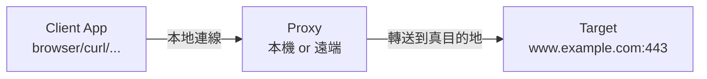
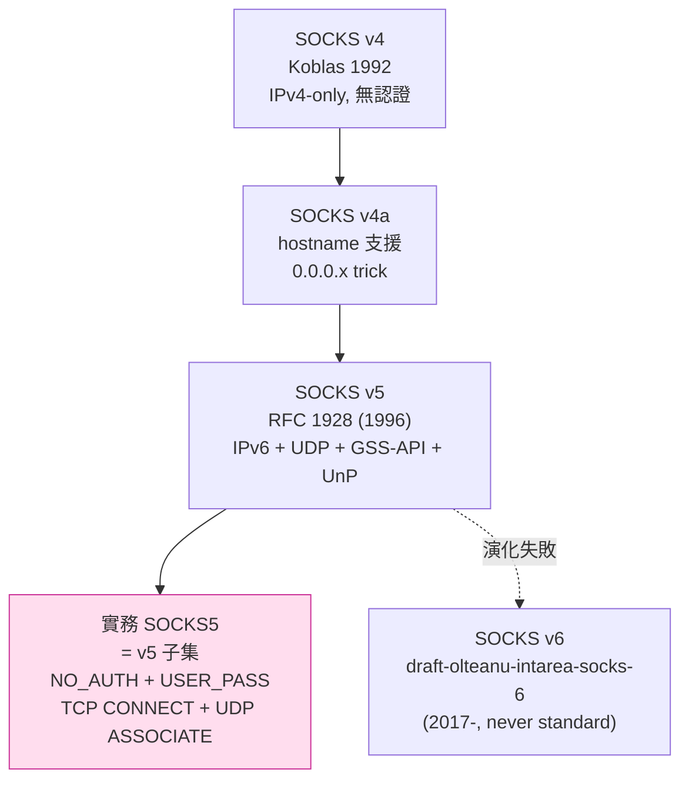
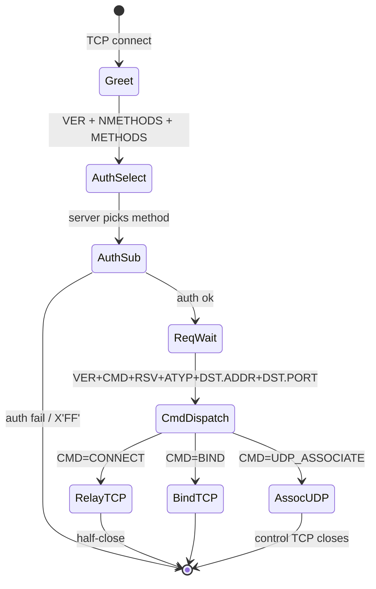
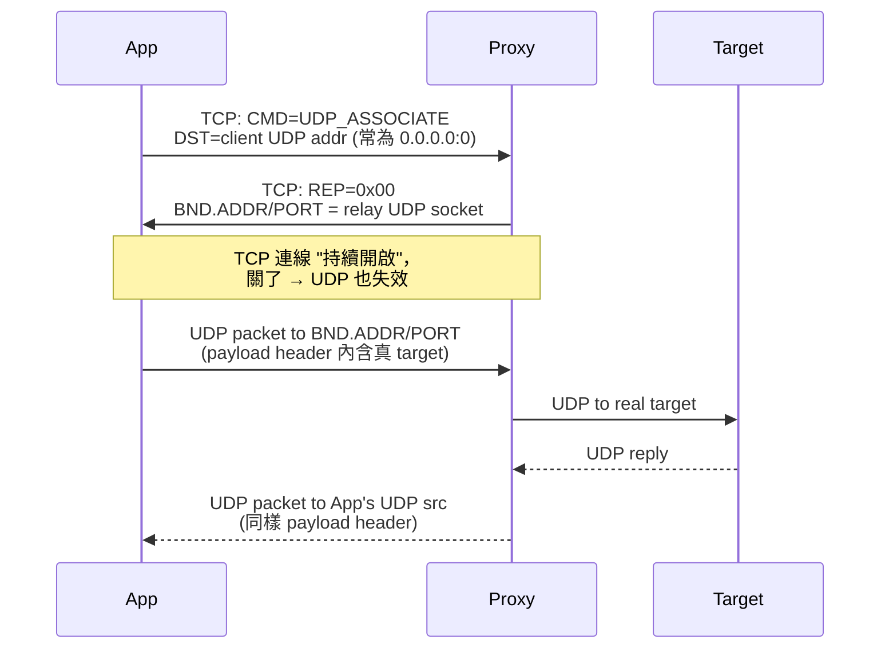
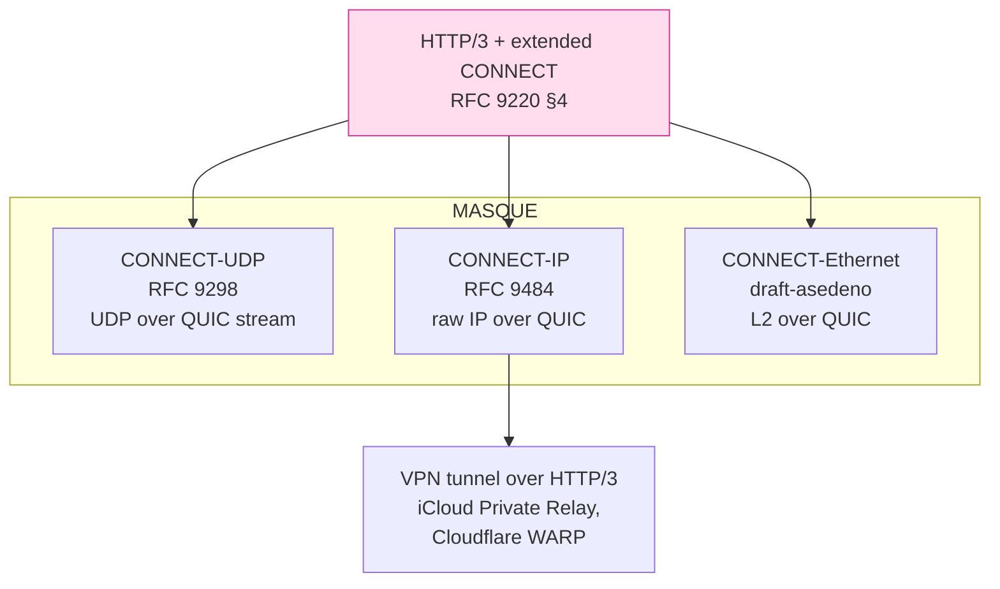
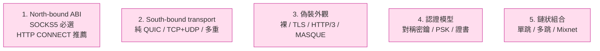

# 課堂 7.1 — SOCKS / HTTP CONNECT：祖宗（RFC 1928 精讀）

## 學前知道
- 前置課：
  - [1.6 TCP 三次握手](../part-1-networking/1.6-tcp-handshake.md)
  - [1.13 DNS 完整解剖](../part-1-networking/1.13-dns-complete-anatomy.md)
  - [4.3 TLS 1.3 握手逐 byte](../part-4-tls-quic/4.3-tls13-handshake-byte-level.md)
- 預計閱讀時間：**40 分鐘**
- 必讀規格：
  - **RFC 1928** — *SOCKS Protocol Version 5*（Leech et al., 1996）—— **逐 byte 精讀**
  - **RFC 1929** — *Username/Password Authentication for SOCKS V5*
  - **RFC 1961** — *GSS-API Authentication Method for SOCKS Version 5*
  - **RFC 3089** — *A SOCKS-based IPv6/IPv4 Gateway Mechanism*
  - **RFC 7230 §5.3.3 + §5.4** — *HTTP/1.1: Message Syntax and Routing*（CONNECT method）
  - **RFC 9110 §9.3.6** — *HTTP Semantics*（CONNECT method 現代化）
  - **RFC 9298** — *Proxying UDP in HTTP*（CONNECT-UDP, IETF MASQUE）
  - **RFC 9484** — *Proxying IP in HTTP*（CONNECT-IP）
- 必讀原始碼：
  - `golang/go` `internal/socks/socks.go` —— Go 標準函式庫的 SOCKS5 client
  - **Xray-core** `proxy/socks/server.go` + `proxy/socks/protocol.go`
  - **sing-box** `protocol/socks/`（v5/v4a/v4）
  - **mihomo** `adapter/inbound/socks.go`
  - 歷史考古：**Dante** （`/sbin/sockd`，1990s 末 SOCKS reference impl）
- 必讀歷史：
  - Lee, *SOCKS: A protocol for TCP proxy across firewalls*（NEC USA, 1992；SOCKS v4 之前的 internal note）
  - Koblas & Koblas, *SOCKS*, UNIX Security III, 1992 — **SOCKS v4 原始論文**

## 動機

「proxy 協議」從 1990 年代就存在，到 2026 年的 REALITY，本質結構**沒變**：



差別只在「Client ↔ Proxy 那段」怎麼加密、怎麼偽裝。**Shadowsocks / VMess / VLESS / Trojan / REALITY 全部都是在這條鏈路上做藝術**。但你打開任何一個現代代理客戶端（Clash Verge Rev、sing-box、v2rayN），**本機 Application 端與 client 之間**走的都還是 **SOCKS5 + HTTP CONNECT**——不是因為他們是最好的，而是因為他們是 **proxy 世界的 ABI（Application Binary Interface）**。Browser、Telegram、git、Docker、`HTTPS_PROXY` 環境變數——全部說的是同一套話。

我們設計新協議，**不會替代 SOCKS5**：我們替代的是 SS/VMess/VLESS——前端仍然要說 SOCKS5/HTTP，否則沒有任何客戶端能用。所以 SOCKS5 不是「歷史包袱」，是我們**必須無條件支援的 north-bound interface**。

讀完應該回答：
- 為什麼 SOCKS5 用 `0x05` 而不是 ASCII？
- `UDP ASSOCIATE` 為什麼**幾乎沒人正確實作**，又為什麼這是 GFW 識別 Shadowsocks/Hysteria 的第一個切點？
- HTTP CONNECT 在 HTTP/1.1 / HTTP/2 / HTTP/3 三代各自怎麼長？
- MASQUE 的 CONNECT-UDP / CONNECT-IP 為什麼是「proxy 協議 50 年後重新被 IETF 收編」的歷史節點？

---

## 核心概念

### 1. SOCKS 家譜



- **v4 (1992)**：NEC 內部協議，被 Koblas 公布。固定 IPv4 only，BIND 命令給 FTP 反向連線用，認證靠源 IP（`userid` 欄位）。
- **v4a**：SOCKS 客戶端送 `0.0.0.x`（x≠0）的 IPv4 表示「我會在 `userid` 後接 hostname」。這就是「hostname proxy」雛形。
- **v5 (RFC 1928, 1996)**：完全重寫。新增多認證方法、IPv6、**UDP ASSOCIATE**、GSS-API。
- **v6 (draft-olteanu)**：把 SOCKS 變成 0-RTT 串流，把認證/option/data 全合進一個 packet。**沒能標準化**——學界共識是「SOCKS5 已經夠用，業界沒動力」。

### 2. SOCKS5 完整狀態機



每一段在 RFC 1928 都有 byte-precise schema。我們把 4 個關鍵 packet 全拆完。

### 3. Packet #1 — Greeting（client → server）

```
+----+----------+----------+
|VER | NMETHODS | METHODS  |
+----+----------+----------+
| 1  |    1     | 1 to 255 |
+----+----------+----------+
```

- `VER = 0x05`（**不是 ASCII '5'，是位元 5；後續所有 v5 packet 都以此開頭**）
- `NMETHODS`：接下來方法清單長度
- `METHODS[i]`：

| 值 | 意義 | 何時用 |
|---|---|---|
| `0x00` | NO AUTHENTICATION REQUIRED | 本機 proxy / 內網信任 |
| `0x01` | GSSAPI（RFC 1961） | 企業 Kerberos 環境 |
| `0x02` | USERNAME/PASSWORD（RFC 1929） | 主流公開 proxy |
| `0x03–0x7F` | IANA assigned | 例如 `0x03` = CHAP |
| `0x80–0xFE` | private methods | Tor、自訂 proxy 常用 |
| `0xFF` | NO ACCEPTABLE METHODS | server 拒絕 |

**注意**：實務上 99% 的 stack 只實作 `0x00` 與 `0x02`。Tor 自己用 `0x80` 攜帶 onion address（見 Tor `socks_request_t`）。

### 4. Packet #2 — Method selection（server → client）

```
+----+--------+
|VER | METHOD |
+----+--------+
| 1  |   1    |
+----+--------+
```

回傳一個 method。如果是 `0xFF`，client **必須關閉**連線。

### 5. Packet #3 — Request（client → server，認證後）

```
+----+-----+-------+------+----------+----------+
|VER | CMD |  RSV  | ATYP | DST.ADDR | DST.PORT |
+----+-----+-------+------+----------+----------+
| 1  |  1  | X'00' |  1   | Variable |    2     |
+----+-----+-------+------+----------+----------+
```

- `CMD`：`0x01` CONNECT / `0x02` BIND / `0x03` UDP ASSOCIATE
- `RSV = 0x00`（reserved）
- `ATYP`：`0x01` IPv4 (4B) / `0x03` DOMAINNAME (1B len + name) / `0x04` IPv6 (16B)
- `DST.PORT`：**network byte order**（big-endian）

**精讀重點**：`DST.ADDR` 在 `ATYP=0x03` 時是 **「1 byte length + raw ASCII bytes」**，**沒有** null terminator。長度上限 255，正好夠 DNS 標籤（RFC 1035 §2.3.4 規定 hostname 最長 253 char）。

### 6. Packet #4 — Reply（server → client）

```
+----+-----+-------+------+----------+----------+
|VER | REP |  RSV  | ATYP | BND.ADDR | BND.PORT |
+----+-----+-------+------+----------+----------+
| 1  |  1  | X'00' |  1   | Variable |    2     |
+----+-----+-------+------+----------+----------+
```

`REP` 的 10 個常見值：

| 值 | 意義 |
|---|---|
| `0x00` | succeeded |
| `0x01` | general SOCKS server failure |
| `0x02` | connection not allowed by ruleset |
| `0x03` | Network unreachable |
| `0x04` | Host unreachable |
| `0x05` | Connection refused |
| `0x06` | TTL expired |
| `0x07` | Command not supported |
| `0x08` | Address type not supported |
| `0x09–0xFF` | unassigned |

**`BND.ADDR/PORT`** = server 「實際往 target 送的本地 socket 的位址」。對 CONNECT 通常無用（client 不關心）；對 BIND、UDP ASSOCIATE 至關重要。

成功之後，TCP socket 變成「透明管道」：**client 寫什麼，server 一字不改 relay 到 target**。從 byte 1 起就是 application protocol（HTTP、TLS ClientHello、自訂 binary）。

### 7. SOCKS5 BIND——幾乎死掉的命令

`BIND` 給 FTP active mode、SIP、IRC DCC 用：

1. Client → Server: `CMD=BIND` 帶 target。
2. Server **本地** listen 一個 port，回 first reply 帶 `BND.PORT`（client 把這個 port 通知 target）。
3. Target 從外部連到 server 那個 port。
4. Server 回 second reply（同樣格式）告知連線進來。
5. Server 把這條外部連線跟原本的 client TCP 串成一條 pipe。

**現代影響為零**：FTP 自己改 PASV、SIP 走 RFC 6062 或 TURN、IRC DCC 早被 NAT 殺死。但**任何完整 SOCKS5 server 都得寫 BIND**——這就是 sing-box / Xray 即使沒人用也保留實作的原因。

### 8. UDP ASSOCIATE——最被誤實作的部分

這是現代 proxy 痛點。SOCKS5 UDP 流程：



**UDP payload 格式**（RFC 1928 §7）：

```
+----+------+------+----------+----------+----------+
|RSV | FRAG | ATYP | DST.ADDR | DST.PORT |   DATA   |
+----+------+------+----------+----------+----------+
| 2  |  1   |  1   | Variable |    2     | Variable |
+----+------+------+----------+----------+----------+
```

- `RSV = 0x00 0x00`
- `FRAG`：分片 ID。**RFC 規定**：bit 7 = end-of-fragment，bit 0–6 = 序號（0 = 不分片）。
- 之後與 TCP request 同樣的 `ATYP / ADDR / PORT`。

**4 個歷史地雷**：

1. **FRAG 幾乎沒有 stack 實作**。Xray、sing-box、mihomo、curl 都直接 `if FRAG != 0 { drop }`。**標準上是違規**，實務上沒人在乎——因為 UDP 分片本身就應該交給 IP 層做。
2. **DST.ADDR 用 DOMAINNAME 時**：proxy 必須做 DNS 解析。誰做？多久 cache？這就是 Clash 的 `dns.enhanced-mode` 配置之所在——proxy 端 DNS hijack 與 fake-IP 都是這層的事。Part 9 GFW 研究會回頭看「DNS 洩漏」與「主動探測」如何透過這層發起。
3. **NAT 與 source port pinning**：proxy 必須記住「同一 client 的 UDP source addr」對應「同一 outbound socket」，否則 STUN / QUIC 完全壞。**這是大多數寫差的 SOCKS5 server 第一個跌倒處**。
4. **TCP 控制連線斷了 UDP 要不要立即斷？** RFC 寫「SHOULD」。Clash mihomo 設可調 timeout，Xray 預設立刻斷。**這個邊角影響 Hysteria/TUIC 在某些 client 端的可靠性**。

`UDP ASSOCIATE` 為什麼幾乎被忽視？因為 1996 年的 UDP 應用主要是 DNS 與 RTP——對前者，OS resolver 直接走 53/udp；對後者，proxy 太貴。所以業界**長期沒有 production-grade SOCKS5/UDP**。直到 2018+ QUIC 來了、Hysteria 火了，才被迫補。**這個歷史欠債正是 sing-box 重寫 UDP 子系統的動機（v0 → v1）**。

### 9. RFC 1929 — Username/Password Auth

最低安全。**明文** username + password。理由：本來預設假設下層通道安全（VPN、SSH tunnel、TLS）。

```
client → server: VER(0x01) ULEN UNAME PLEN PASSWD
server → client: VER(0x01) STATUS  (0x00 ok / non-zero fail)
```

注意 `VER` 在這個 sub-protocol 是 `0x01`，**不是** SOCKS5 的 `0x05`。**這個小細節讓不少自己手寫 SOCKS5 server 的 dev 跌跤**——你以為 auth packet 也是 0x05 開頭。

### 10. HTTP CONNECT — 雙生兄弟

SOCKS5 是 binary protocol，HTTP CONNECT 是文字版的「等價物」。RFC 9110 §9.3.6：

```http
CONNECT www.example.com:443 HTTP/1.1
Host: www.example.com:443
Proxy-Authorization: Basic dXNlcjpwYXNz

HTTP/1.1 200 Connection Established

[從這裡開始 client 與 target 直連，proxy 不再解析]
```

**重要差異**：

| 維度 | SOCKS5 | HTTP CONNECT |
|---|---|---|
| 流量類型 | TCP + UDP | **只有 TCP** |
| 認證 | NO_AUTH / USER_PASS / GSS | Basic / Digest / Bearer / Negotiate (HTTP auth) |
| 編碼 | binary | ASCII headers |
| 探測 | 開頭 `0x05` 容易識別 | 看起來像普通 HTTP |
| 多工 | 一連線一目標 | HTTP/2 可多串流（每串流一目標） |
| HTTP/3 版 | — | RFC 9220（Bootstrapping WebSockets with HTTP/3） + MASQUE |

**指紋差異**：SOCKS5 的 `0x05` magic 是「第一個 byte 就告白」的反面教材；HTTP CONNECT 雖然看起來文字化，但 `Proxy-Authorization` 標頭與 `User-Agent` 一樣是 censor 機器學習特徵。

### 11. HTTP/2 CONNECT — extended CONNECT

RFC 7540 §8.3 把 CONNECT 改成 stream-level：

- 一個 HTTP/2 stream 對應一個 CONNECT
- `:method = CONNECT`, `:authority = host:port`，**沒有 `:path`、`:scheme`**
- response stream 開始之後，DATA frame 就是 TCP payload
- **WebSocket over HTTP/2** (RFC 8441) 用 **extended CONNECT**：加 `:protocol = websocket`

Xray-core 的 `transport/internet/grpc/` 與 `transport/internet/httpupgrade/` 都建在這個機制上——HTTP/2 多工讓「同一 TCP 連線 + 同一 TLS session」並發多個 proxy 連線，**極大減少 TLS 握手開銷**。Part 7.6 細講。

### 12. HTTP/3 CONNECT 與 MASQUE 革命

IETF 2020 起的 [MASQUE WG](https://datatracker.ietf.org/wg/masque/about/) 把 CONNECT 系列搬到 HTTP/3 上，**徹底改寫 proxy 的設計座標**：



**意義**：

- 2026 的 Apple iCloud Private Relay 第二跳就是 MASQUE。
- Google Chrome 的 ip-protection / IP Protection 走 CONNECT-IP。
- Cloudflare WARP 已部份遷移。
- **這是「proxy 與 VPN 邊界正式消亡」的歷史節點**：MASQUE 既是 proxy 也是 VPN——既能 forward 單一連線（CONNECT-UDP），也能 tunnel 整個 IP（CONNECT-IP）。
- 對我們設計新協議：MASQUE 是**唯一**已經被 IETF 標準化、被主流 browser/OS 內建支援的「proxy-over-modern-transport」。要進入正規市場，**必須相容或可以宣稱「我們在這之上做了 X」**。Part 11.6「協議與 MASQUE 的關係」會回頭設計這個座標。

### 13. Greasing & probing 防禦：SOCKS5 沒有，CONNECT 也沒有

SOCKS5 的 magic `0x05` 與 HTTP CONNECT 的 `CONNECT ` 字面，都是**極好的 IDS 規則**。Suricata 規則庫至少寫了 5 個：

```
alert tcp any any -> any any (msg:"SOCKS5 greeting";
  flow:to_server,established;
  content:"|05|"; offset:0; depth:1;
  content:"|00|"; distance:0; within:1;
  sid:2031234;)
```

任何「**對外**直接暴露的 SOCKS5/HTTP-CONNECT proxy 都活不過一週」。所以 SOCKS5 在 censorship resistance 領域的角色**永遠只是 client-side ABI**，不會是傳輸層。

---

## 與我們協議設計的關聯

1. **North-bound interface 必選 SOCKS5 + HTTP CONNECT**：否則沒有 client 能跟我們協議講話。但我們不需要實作 BIND（直接 `REP=0x07` 拒絕），UDP ASSOCIATE **必須** production-grade，否則 QUIC、Hysteria 替代品都拿不走。
2. **UDP-over-TCP 是反設計**：SOCKS5 的 UDP 流程證明「把 UDP 包進 TCP control + side-channel UDP」是可行的，但有性能與狀態同步成本。**Part 8 / 11 設計時要決定**：我們的 client-server 之間走純 UDP（QUIC-like）還是 TCP+UDP 雙通道。傾向前者，但客戶端的 SOCKS5 ABI 上**仍然支援** UDP ASSOCIATE。
3. **MASQUE 對齊問題**：我們協議要不要長得像 CONNECT-UDP？如果完全相容，IETF 認證、browser 內建——但 GFW 會直接針對 RFC 9298 寫規則。如果不像——我們得放棄 browser 直連。**Part 11.6 開放問題**。
4. **HTTP CONNECT 的「文字外觀」是個錯誤教材**：1990 年代為了人類可讀犧牲了 wire-format 緊密性。我們協議 wire-format 應該 **binary, length-prefixed, version-tagged**，所有 ASCII magic 都是反面教材。
5. **UDP fragment field**：SOCKS5 把分片責任丟給應用層是錯誤決定，現代 QUIC datagram（RFC 9221）已經完全內建分片透明。Part 11.4 wire-format 設計時直接抄 QUIC datagram。

---

## 動手

實驗 A（10 min）：**用 ncat + 手寫 hex 把 SOCKS5 跑通**

```bash
# Terminal 1: 起一個 SOCKS5 server (sing-box 或 dante)
sing-box run -c <(cat <<'EOF'
{
  "inbounds": [{
    "type": "socks", "tag": "in",
    "listen": "127.0.0.1", "listen_port": 1080,
    "users": []
  }],
  "outbounds": [{ "type": "direct" }]
}
EOF
)

# Terminal 2: 用 python 手寫 client
python3 <<'EOF'
import socket
s = socket.socket()
s.connect(("127.0.0.1", 1080))
s.send(b"\x05\x01\x00")               # greet: VER=5 NMETHODS=1 method=NO_AUTH
print("auth:", s.recv(2).hex())        # 05 00
req = b"\x05\x01\x00\x03" + bytes([len("example.com")]) + b"example.com" + (443).to_bytes(2, "big")
s.send(req)
print("reply:", s.recv(10).hex())      # 05 00 00 01 ... 
s.send(b"GET / HTTP/1.0\r\nHost: example.com\r\n\r\n")
print(s.recv(4096)[:200])
EOF
```

實驗 B（15 min）：**SOCKS5 UDP ASSOCIATE 抓包**

用 `nslookup` 觸發 UDP，配合 `sudo tcpdump -i lo0 -n -X port 1080 or udp` 觀察 UDP datagram 的 SOCKS5 header（前 10 byte）是否正確。**幾乎可以保證你看到不同 client 實作差異**——例如 curl `--socks5-hostname` 不會把 hostname 解析掉，而 `--socks5` 會。

實驗 C（可選 20 min）：**讀 Xray-core SOCKS5 server 程式碼**
- `proxy/socks/server.go:Process()` ——TCP 入口
- `proxy/socks/protocol.go:ServerSession.Handshake()` ——RFC 1928 packet 解析
- `proxy/socks/protocol.go:UDPReader/UDPWriter` ——UDP packet 編碼解碼

回答兩個問題：
1. Xray 怎麼處理 `FRAG != 0`？
2. Xray 的 UDP ASSOCIATE 如何把 client UDP source 與 outbound socket 綁定？

---

## 自我檢查

1. 一個剛接到的 SOCKS5 connection 從 socket 讀到的第一個 byte 是 `0x04`、`0x05`、還是 `0x47`（'G'）。三種情況各代表什麼？怎麼處理？
2. SOCKS5 規定 `DST.ADDR` 用 `ATYP=0x03` 時長度欄位 1 byte。如果一個 hostname 是 `xn--fiqs8s.example.com`（IDN 中文「中国」punycode 編碼）長度為何？255 byte 限制下會不會被截？
3. 為什麼 RFC 7230 的 CONNECT 在 HTTP/1.1 之後**不能**回 `Content-Length`、`Transfer-Encoding`？這個約束如何被 HTTP/2 stream model 自然滿足？
4. UDP ASSOCIATE 的「TCP 控制連線」斷了之後，OS 一定立刻釋放 UDP socket 嗎？不一定的話會出現什麼安全或可用性問題？
5. MASQUE 的 CONNECT-UDP 與 SOCKS5 UDP ASSOCIATE，哪個對中間人觀察者隱藏「proxy 行為」更好？為什麼？
6. 為什麼說「SOCKS5 在 censorship resistance 領域永遠只是 client-side ABI」？至少給兩個技術理由。

---

## 延伸閱讀

- **歷史 + 設計**：D. Koblas, *SOCKS*, USENIX UNIX Security III, 1992（早期 PDF 在 NEC 內部，後續散見於 `dante.inet.no/doc/`）
- **IETF**：[MASQUE working group](https://datatracker.ietf.org/wg/masque/about/)（CONNECT 系列現代化主場）
- **規格演化**：draft-olteanu-intarea-socks-6 v06（理解「SOCKS5 為何沒被取代」最好的反面教材）
- **實作**：
  - **Dante** (`dante.inet.no`)——歷史上的 reference SOCKS impl
  - **Shadow Wizard** Tor `socks_request_t`（`src/feature/control/control_proto.c`）——SOCKS5 在 Tor 的私有擴展
  - sing-box `protocol/socks/handshake.go`
- **論文**：Kreibich et al., *Netalyzr: Illuminating The Edge Network*, IMC 2010——SOCKS5 早期實作差異的 measurement，雖然主題不在 proxy，但其方法論值得借鑑。

---

## 研究級補遺

### 1. 學界詞彙

| 口語 | 學術術語 | 出處 |
|---|---|---|
| 「翻牆協議」 | circumvention protocol / censorship-resistant transport | Houmansadr et al., NDSS 2013 「Cirripede」 |
| 「SOCKS 通道」 | application-layer tunnel / explicit proxy | RFC 9209 §1.1 |
| 「透明代理」 | transparent proxy / interception proxy | Squid 文獻，Wessels & Claffy, ACM SIGCOMM 1998 |
| 「VPN」與「proxy」邊界模糊 | overlay forwarding | Anderson et al., HotNets 2014 |
| 「proxy chain」 | onion routing 的退化版 | Goldschlag, Reed, Syverson, FC 1996 |
| 「proxy server」軟體 stack 設計 | "explicit forward proxy" vs "reverse proxy" vs "L4 redirector" | Squid manual, HAProxy docs |

### 2. 對手分類學（針對 SOCKS5/HTTP CONNECT）

從 GFW 角度看，**裸 SOCKS5 / 裸 HTTP CONNECT** 落在最弱對手即可破：

| 對手能力 | 是否能識別裸 SOCKS5 |
|---|---|
| Passive on-path (DPI) | ✅ 第一個 byte `0x05` 是強信號 |
| Passive on-path (statistical) | ✅ TCP 連線初期 small packets 的 entropy / size 序列獨特 |
| Active on-path (replay) | ✅ 重送同樣 packet 可確認 |
| Active scan (probe) | ✅ 直接連 port 送 `0x05 0x01 0x00`，若回 `0x05 0x00` 就確認 |

這就是為什麼 **SOCKS5 永遠跑在某個加密層之內**——SSH tunnel、TLS、WireGuard、Shadowsocks、Trojan、REALITY。

對 **HTTP CONNECT**：對手強度需要更高一級（要解析 HTTP request line），但 Suricata / nDPI 早就有規則。**只有 CONNECT-over-TLS-mTLS + 模仿真實 H2 流量分布**（即 Naïve 的策略）才能在主動探測下勉強存活——Part 7.13 詳講。

### 3. 形式化定義

SOCKS5 的「proxy」可以用 **partial pipe abstraction** 寫成：

設 client 端套接字 $C$、target 端套接字 $T$、proxy 套接字 $P$，則 `CONNECT` 命令成立後對所有時刻 $t$ 滿足：

$$
\forall b \in \text{bytes}: \quad C \xrightarrow{t} P \implies P \xrightarrow{t+\delta} T \quad \text{(forward pipe)} \\
T \xrightarrow{t} P \implies P \xrightarrow{t+\delta} C \quad \text{(reverse pipe)}
$$

其中 $\delta$ 是 proxy 處理延遲，protocol 不規範但要求最終一致性。這個極簡 abstraction 是後續所有 proxy 協議的 **invariant**——換句話說，**任何破壞「透明 pipe」性質的協議擴展都會打破 SOCKS5 ABI 相容性**（例如：proxy 端做 inline 解密 / 重寫，就不再是 SOCKS5）。

### 4. 領域的關鍵論文 / 規格 / 原始碼

- **RFC 1928 (1996)** — SOCKS v5。**Part 7.1 主場**。
- **RFC 9298 (2022)** — CONNECT-UDP。Part 11.6 設計座標。
- **RFC 9484 (2023)** — CONNECT-IP。Part 11.6 設計座標。
- **draft-olteanu-intarea-socks-6** — 反面教材，理解 SOCKS5 為何不需要替代。
- **Apple iCloud Private Relay whitepaper (2021)** — 第一個生產級 MASQUE 部署。
- **Xray-core `proxy/socks/`** — 業界最廣為使用的 SOCKS5 server 實作之一，Part 7.14 整體源碼概覽會回來精讀。

### 5. 我們協議的座標 / 設計取捨

設我們協議 G6 的設計空間有以下 5 軸：



**今天的 7.1 收窄**：A 軸已決定（SOCKS5 必選）。B、C、D、E 仍開放，但 C 軸與 MASQUE 的關係（與 RFC 9298 是否相容）是 Part 11.6 主要 trade-off。

### 6. 必追資源 / 社群入口

- IETF **MASQUE** WG mailing list & meeting minutes（datatracker.ietf.org）
- IETF **httpbis** WG（HTTP/3 + CONNECT 演化主場）
- Mozilla **necko** SOCKS5 impl issue tracker（瀏覽器端最常見的 corner cases）
- Cloudflare blog: *How we use the Internet Engineering Task Force*（MASQUE 部署落地紀錄）

### 7. 開放問題

1. **SOCKS5 UDP ASSOCIATE 在現代 QUIC client 下的行為**：client 想開 100 個 UDP flow 並發走 proxy（QUIC streams），SOCKS5 的單 TCP control 是 bottleneck 嗎？已知 sing-box 引入 per-flow control，但這 **break RFC 1928**。研究方向：能否把 SOCKS5 UDP ASSOCIATE 在語義上向 QUIC datagram 對齊？
2. **MASQUE 取代 SOCKS5 成為 client ABI 的可能性**：如果 Chrome、Firefox 都把 SOCKS proxy setting 改成 MASQUE URL，**整個 censorship-resistance 生態的座標會崩塌重組**。
3. **「proxy 行為」與「VPN 行為」在 CONNECT-IP 之後實際上不再可區分**——對流量分析的影響？是壞事還是好事？Part 10.x 統計分析會回頭看。
