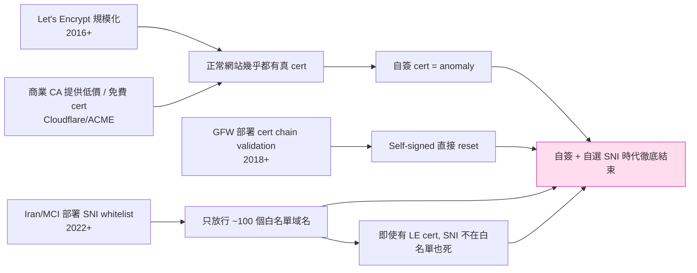
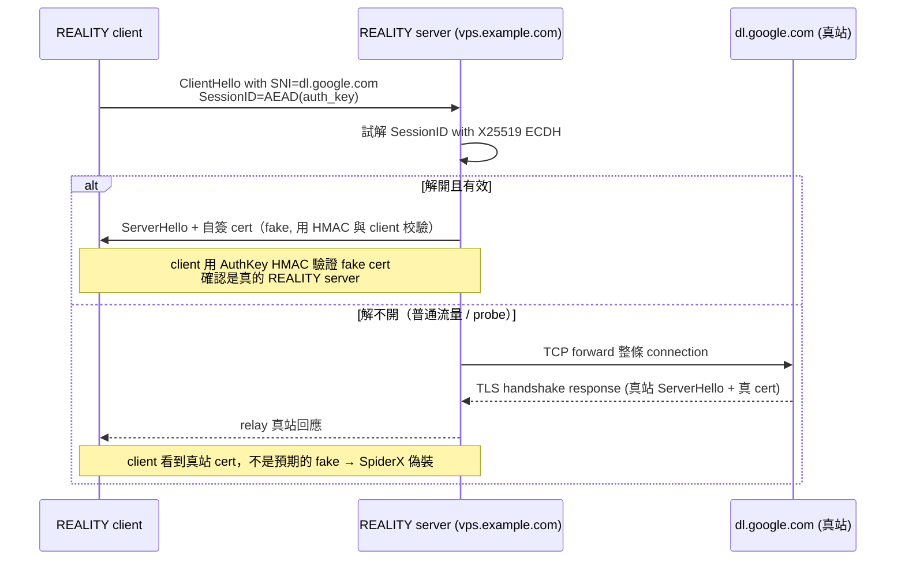
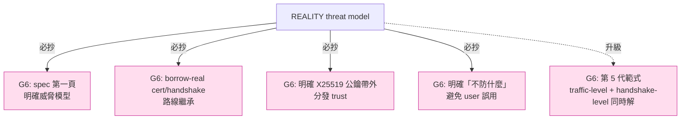

# 課堂 7.10 — REALITY 完整解剖（一）：威脅模型

## 學前知道
- 前置課：
  - [4.3 TLS 1.3 握手逐 byte](../part-4-tls-quic/4.3-tls13-handshake-byte-level.md)
  - [4.4 TLS 擴展與 JA3/JA4 指紋](../part-4-tls-quic/4.4-tls-extensions-ja3-ja4.md)
  - [7.7 Trojan](./7.7-trojan.md)（cover-site fallback 的奠基）
  - [7.8 VLESS](./7.8-vless.md)
  - [7.9 XTLS-Vision](./7.9-xtls-vision.md)（REALITY 的搭檔）
- 預計閱讀時間：**40 分鐘**
- 必讀規格：
  - **REALITY README**（XTLS）—— [`notes/specs/reality.md`](../../notes/specs/reality.md)
  - **xray-core Issue #2768 / Discussion #2233 / Discussion #3269** —— 設計與限制討論
- 必讀論文：
  - **Frolov, Wampler, Wustrow, *Detecting Probe-resistant Proxies*, NDSS 2020** —— [`notes/papers/frolov-probe-resistant.md`](../../notes/papers/frolov-probe-resistant.md)
  - **Wu et al., *FEP*, USENIX Security 2023** —— [`notes/papers/wu-fep-2023.md`](../../notes/papers/wu-fep-2023.md)
  - **Bhargavan et al., *Triple Handshakes and Cookie Cutters*, IEEE S&P 2014**
  - **GFW.report v2ray weaknesses** writeup（REALITY 設計動機之一）
- 必讀原始碼：
  - **xray-core** `transport/internet/reality/reality.go` （client 端 wire）
  - **xtls/reality** （獨立 Go module，server 端 fallback）
- 必讀社群討論：
  - GFW.report 對 Iran MCI 阻斷的長期觀察（Discussion #3269）
  - net4people/bbs 上 2023-2025 REALITY 部署實戰

## 動機

REALITY 是 **2023-2026 production proxy 在 censored network 的 SOTA**。它由 @RPRX（XTLS 主導者）2023 年初設計、迅速被 Xray、sing-box、mihomo 採納，**徹底改變了「TLS-based proxy 該怎麼設計」的思路**。

REALITY 的核心 insight 一句話：

> **「不要自己生 TLS cert / SNI / ServerHello。**直接借真網站的握手，**讓 attacker 看到的就是真網站的 ServerHello + 真網站的 cert chain**。」

對協議學習者，REALITY 的價值是 **3 層**：

1. **Threat model 層**（本堂）：理解「為什麼 self-signed cert 時代結束、為什麼必須借真實網站、為什麼 Trojan 的 fallback 仍不夠」。
2. **Protocol 層**（Part 7.11）：精讀 ClientHello SessionID AEAD 封裝、X25519 ECDH、SpiderX MITM 防禦、server-side fork 流程的 byte 級細節。
3. **Limits 層**（Part 7.12）：社群實戰中發現的 limits、Iran MCI 對 REALITY 的封鎖案例、未來改進方向。

本堂專注 **(1)**：建立 REALITY 之所以存在的 **威脅模型**——理解這個模型才能在 Part 11 設計 G6 時做出正確 trade-off。

讀完應該回答：
- 為什麼自簽 cert 時代結束？具體是哪些 GFW / Iran 能力升級導致？
- 為什麼 Trojan 的 fallback redirect **仍不夠**？哪些 attack vector REALITY 才能防、Trojan 不能？
- REALITY 的威脅模型在 Dolev-Yao 譜系中具體位於哪？
- REALITY 假設攻擊者**沒有**什麼能力？這個假設在 2026 年仍合理嗎？
- 為什麼 REALITY **不是** traffic obfuscation——它的「indistinguishable」邊界在哪？

---

## 核心概念

### 1. Self-signed cert 時代為什麼結束

2014–2018 是 V2Ray VMess + 自簽 cert 的時代。**自簽 cert 為什麼曾經能用**：

- GFW 的 cert chain 校驗能力有限——大多 DPI 只看 SNI 與 entropy。
- 商業 cert 太貴（$50+/year）—— 自簽是唯一經濟選擇。
- Let's Encrypt 2016 才生產級可用。

**2018+ 終結因素**：



**具體攻擊面演化**：

| 年份 | GFW 能力 | 影響 |
|---|---|---|
| 2014 | 看 SNI + entropy | SS/VMess + 自簽勉強活 |
| 2018 | + cert chain 校驗 | 自簽 cert 死，必走 LE |
| 2020 | + JA3 fingerprint | Go default JA3 死，需 utls |
| 2021 | + TLS-in-TLS 偵測 | Trojan/VLESS over TLS 開始受影響 |
| 2022 | + SNI whitelist (Iran/福建移動) | 自選 domain 死，必選白名單 |
| 2023 | + ML-based traffic profile | 即使 cert + SNI 都對，流量分布不像 = 死 |
| 2024 | + 流量量級偵測 | 高流量 VPS 短時間內被封 |

**REALITY 的設計動機**就是回應 2022-2023 的「**SNI whitelist + cert chain 強校驗**」——**「如果只能用白名單 domain，那我就**真的**用白名單 domain 的 cert**」。

### 2. Trojan 的 fallback **為什麼仍不夠**

Trojan（Part 7.7）的設計：自家 nginx + LE cert + fallback redirect。**這在 2018-2021 SOTA**。

**2022+ 的失敗**：

| 攻擊向量 | Trojan 是否擋 | REALITY 是否擋 |
|---|---|---|
| Active TCP probe | ✅（fallback） | ✅（fallback） |
| Active TLS probe | ✅（fallback） | ✅（fallback） |
| Cert pinning（GFW pre-fetched dl.google.com cert） | ❌ Trojan cert 不是 dl.google.com 的真 cert → mismatch | ✅ REALITY **就是** dl.google.com 真 cert |
| SNI whitelist（only `*.google.com` allowed） | ⚠ 必須選 `cdn.example.com`，受限 | ✅ 直接用 `dl.google.com` |
| MITM redirect of ClientHello | ❌ 自家 cert vs redirect 真 cert mismatch → server 一變就垮 | ✅ MITM 看到的就是真 cert，redirect 也通 |
| TLS-in-TLS pattern | ❌ outer 是自家 nginx → 仍可識別 | ⚠ outer 是真網站 ServerHello but inner pattern 仍可被 ML detect |
| Traffic volume anomaly | ❌ 自家 nginx 流量 ≠ 真網站 | ❌ 同樣中招 |

**核心區別**：Trojan 的 outer 是「**我自己跑的 nginx 用 LE cert**」——**任何 cert pinning / 雙向 cross-check 都死**。REALITY 的 outer 是「**借用** dl.google.com 的真 cert + 真 ServerHello」——**cert pinning 自動通過**。

### 3. REALITY 防什麼、不防什麼

**REALITY 的威脅模型**（README 與社群共識）：

```mermaid
flowchart TD
    THREATS[REALITY 防禦範圍]
    THREATS --> T1["✅ Active probing 連到 fallback site (= 真站)"]
    THREATS --> T2["✅ Cert pinning attacks (= 真站 cert)"]
    THREATS --> T3["✅ ClientHello fingerprint (= utls 模仿真 browser)"]
    THREATS --> T4["✅ MITM redirect to whitelist domain (= 本來就是白名單)"]
    THREATS --> T5["✅ Server JA3S fingerprint (= 真站 ServerHello)"]

    NOT[REALITY 不防範圍]
    NOT --> N1["❌ Traffic volume anomaly (高流量 VPS 仍被封)"]
    NOT --> N2["❌ Traffic timing pattern (CSCSC)"]
    NOT --> N3["❌ TLS-in-TLS length pattern (需 Vision 配合)"]
    NOT --> N4["❌ Port forwarding 行為類別"]
    NOT --> N5["❌ Inner protocol fingerprint after handshake"]

    classDef ours fill:#fde,stroke:#c39
    class THREATS,T1,T2,T3,T4,T5 ours
```



**關鍵 distinction**：REALITY 是 **handshake-level indistinguishability**，**不是 traffic-level obfuscation**。

換句話說：

- 攻擊者**對 server 主動探測**——看到的是真網站。✅ 擋住。
- 攻擊者**長期觀察某個 IP 上連線的流量分布**——看到「大量來自不同 client 的長連線、高流量、bidirectional pattern」≠ 真網站的「短訪問、單向 download」。**❌ 仍被識別**。

### 4. Dolev-Yao 對應與形式化威脅模型

REALITY 的 attacker model 在 Dolev-Yao 譜系：

| 能力 | 攻擊者擁有 | 對 REALITY 影響 |
|---|---|---|
| Eavesdrop（讀任意 packet） | ✅ | 看到 standard TLS handshake |
| Inject（送任意 packet） | ✅ | server 對非合法 ECDH 直接 fallback |
| Replay | ✅ | timestamp window + replay cache mitigate |
| Modify in-flight | ✅ | TLS handshake AEAD-protected |
| Compromise public infrastructure | ✅（DNS、BGP）| REALITY 不依賴 attacker-controllable infra |
| **Compromise X25519 distribution channel** | ❌ | **此假設成立 REALITY 才有效** |
| Side-channel timing on server | ❌（assumed not） | 可被 timing distinguish——open problem |
| Brute force X25519 | ❌（computationally bounded） | 標準假設 |

**核心信任假設**：**X25519 公鑰透過帶外信道安全分發給 client**。這與 obfs4 的 node-id+pubkey 假設同源——一旦這個 channel 被破，REALITY 全死。

**這是合理的 trust assumption**：實務上 user 透過 `vmess://...` URL（QR code、Telegram、加密訊息）拿 server config，這些渠道本身是 TLS / E2E encrypted。

### 5. 「**Indistinguishable from real connection**」的精確定義

REALITY 的 informal claim：「**對 attacker 而言，一條 REALITY connection 與一條到真站（dl.google.com）的真實 TLS connection 不可區分**」。

**精確化**（Bellare-Rogaway 風格）：

設 attacker $\mathcal{A}$，距離函數 $d$ 衡量兩個 traffic distribution 的可區分性。則：

$$
\text{Adv}^{\text{handshake-distinguish}}_{\mathcal{A}} = |\Pr[\mathcal{A}(C_{\text{REALITY}}) = 1] - \Pr[\mathcal{A}(C_{\text{real}}) = 1]|
$$

其中 $C$ 限定為 **handshake bytes**（前 ~5 KB）。

**REALITY 的 claim**：

$$
\text{Adv}^{\text{handshake-distinguish}}_{\mathcal{A}} \leq \epsilon_{\text{TLS+utls}}
$$

也就是「**攻擊者區分 REALITY 與真連線的優勢，等於 utls 模仿真 browser ClientHello 的偏差**」。

**注意 scope 限制**：

- ✅ 只對 **handshake bytes** 成立
- ❌ 對 **full traffic**（含後續 application data 的 length/timing）**不成立**

**這是 REALITY 自己認可的 limit**——README 明確寫「這是 handshake-level，不是 traffic-level」。

### 6. 對手區分等級表

對 REALITY 的 attacker model 細分：

| 攻擊者級別 | 能力 | REALITY 防禦 |
|---|---|---|
| **L0 — Casual ISP** | 看 SNI + cert | ✅ 完全擋 |
| **L1 — DPI（Suricata-level）** | + JA3/JA4 fingerprint | ✅ 擋（utls） |
| **L2 — Active prober** | + 主動探測 server | ✅ 擋（fallback） |
| **L3 — Cert pinning attacker** | + 預先 fetch 真站 cert 比對 | ✅ 擋（cert 就是真的） |
| **L4 — MITM-redirect attacker** | + 把 ClientHello redirect 到真站對比 | ✅ 擋（兩邊一樣） |
| **L5 — ML traffic profiler** | + 統計學習 flow distribution | ❌ **中招** |
| **L6 — Side-channel timer** | + timing analysis on server response | ⚠ 部分中招 |
| **L7 — Long-term IP profiler** | + 長期觀察 IP 流量量級 | ❌ **中招（高流量 VPS 被封）** |

**REALITY 的設計靶心**：L0–L4。**L5+ 是已知 limit**——需 Vision 配合 + 多 IP 輪換 + 流量整形。

### 7. 為什麼 REALITY 不是 traffic obfuscation

很多新手以為 REALITY 是「**讓 traffic 看起來像 normal HTTPS**」——**這是錯的**。

REALITY 只負責 **handshake 偽裝**。Handshake 完成後：

- Inner 可以是任意 VLESS / SS / VMess 流量
- Inner 流量**仍然有自己的 length / timing 分布**
- 對 Vision-enabled connection，handshake 後 splice，wire 就是真實 inner TLS application data
- 對 non-Vision connection，wire 是 inner protocol over outer TLS application data 

**Iran MCI 的 REALITY 阻斷實測**（Discussion #3269）：

- **高流量 VPS（10+ Mbps 持續）**：~2 小時內被標記、IP 封。
- **低流量 VPS（< 1 Mbps、間歇性）**：可活一週以上。

**結論**：REALITY 把 attacker 從 L0-L4 擋掉後，**剩下的 attack surface 是 traffic profile**——這需要協議**之外**的 mitigation（多 IP、流量整形、時段分散）。

### 8. REALITY 的「**借**」與「**信**」

REALITY 「借用」白名單站（如 `dl.google.com`）的 cert——**但不擁有**該站的 private key。它怎麼通過 TLS handshake？



**精妙之處**：

- Server **沒有** dl.google.com 的私鑰——**不能**完成完整 TLS handshake 模仿真站。
- 但 server 可以**透明 forward** TCP 給真站——**真站完成自己的 handshake**，server 只是 pipe。
- 對攻擊者 probe：handshake 看起來來自真站（cert 是真的，因為**真的就是來自真站**）。
- 對合法 client：handshake 後 server 用 ECDH-derived key 給 client 一個 HMAC-簽過的 fake cert，client 驗 HMAC 確認對方是 REALITY server（**而不是被 redirect 到真站**）。

**這是「Server 同時是 proxy 與透明轉發器」的雙模式設計**——根據 ClientHello SessionID 內藏的 ECDH 結果切換模式。

### 9. 設計取捨：為什麼不用 ECH？

ECH (Encrypted ClientHello, RFC 9460) 解決同樣的「SNI 加密」問題——為什麼 REALITY 不用 ECH？

**ECH 的限制**：

- 需要**真站 server 主動支援 ECH**——dl.google.com 並不支援代你的 SNI。
- ECH 需要 **HPKE 與 cert chain extension**——browser 與 server 都得改。
- ECH 的 **outer SNI** 仍會洩漏「**這是支援 ECH 的 service**」——對 GFW 仍是 fingerprint。

**REALITY 的優勢**：

- **不需要真站合作** —— 真站完全不知道有 REALITY server 借它的 cert。
- **client 完全是 standard TLS 1.3 + uTLS** —— 沒任何「我支援 REALITY」的 fingerprint。
- **deployment 極簡** —— server 只需要知道真站 IP 與 hostname，不需要任何 API。

**ECH vs REALITY**：兩者解的問題重疊但**實作模型完全不同**——ECH 需要全網升級，REALITY 是 local hack。

### 10. 為什麼 REALITY 是 censorship resistance 的範式轉移

| 範式 | 例子 | 核心思路 |
|---|---|---|
| **Pre-2015：mimicry** | obfs2/3 | 假裝是某個 protocol |
| **2015-2018：fully-encrypted** | SS、VMess | 看起來像 random（避免 protocol fingerprint）|
| **2018-2022：HTTPS-shaped** | Trojan、VLESS+TLS | 真的跑 HTTPS server，proxy 是 hidden path |
| **2022-2026：borrow-real** | REALITY | **借用**真網站的 cert + ServerHello |
| **Future：?** | G6 / 未知 | ? |

**REALITY 是第 4 代範式**。每一代都是對前代被識破的反應：

- **mimicry 死於**「Parrot is Dead」（Houmansadr 2013）
- **fully-encrypted 死於** Wu 2023 FEP detector
- **HTTPS-shaped 死於** TLS-in-TLS detection + cert pinning
- **borrow-real 死於 ?** —— 目前已知 limit 是 traffic profile，未來可能發現新 attack vector

對 G6：理解這個演化序列，**每一代都是對前代的根本反應**——G6 必須思考「下一代範式是什麼」，而不是「在第 4 代基礎上做小改進」。**Part 11.6 設計目標**。

---

## 與我們協議設計的關聯

1. **Threat model 必須先寫 spec 第一頁**：REALITY 之所以成功，是因為它**精確定義了威脅模型 + 精確定義了不防什麼**。G6 spec 必先寫此。
2. **「Borrow real」是 SOTA 路線**：G6 第一版必繼承此思路——可選借用真網站 cert 或新方法。Part 11.6 設計重點。
3. **Handshake-level vs traffic-level 分離設計**：REALITY 教我們**承認 handshake 與 traffic 是兩個不同問題**——分別解。G6 同樣分離設計。
4. **Trust assumption 明確化**：REALITY 的 X25519 公鑰帶外分發假設是合理的。G6 也應明確說「我們假設 user 通過 X 渠道拿 secret」。
5. **「不防什麼」與「防什麼」同樣重要**：spec 應該明確列出 known limits，避免 user 誤用。
6. **下一代範式思考**：G6 不該停在 REALITY 範式內小改進——應該思考「**第 5 代範式是什麼**」。可能方向：multi-cover（同時偽裝多個 protocol）、QUIC-native handshake hijack（Part 11.6 開放問題）。

---

## 動手

實驗 A（30 min）：**部署一個 REALITY server 並驗證 fallback**

```bash
# 1. 用 xray-core 起 REALITY server
xray x25519   # 產生 X25519 keypair

# 2. server config
{
  "inbounds": [{
    "port": 443,
    "protocol": "vless",
    "settings": { "clients": [{ "id": "00000000-0000-0000-0000-000000000000" }], "decryption": "none" },
    "streamSettings": {
      "network": "tcp",
      "security": "reality",
      "realitySettings": {
        "show": false,
        "dest": "dl.google.com:443",
        "xver": 0,
        "serverNames": ["dl.google.com"],
        "privateKey": "...",
        "shortIds": [""]
      }
    }
  }]
}

# 3. 對 server probe
curl -v https://vps.example.com/   # SNI 自動是 vps.example.com，不會被 REALITY accept → fallback
curl -v --resolve dl.google.com:443:VPS_IP https://dl.google.com/   # SNI = dl.google.com 但 ECDH 失敗 → fallback to real dl.google.com
```

觀察：兩個 curl 都看到 dl.google.com 的真實 cert + 真實 response。

實驗 B（30 min）：**對比 Trojan vs REALITY 的 cert pinning attack**

```python
import ssl, socket
ctx = ssl.create_default_context()
sock = ctx.wrap_socket(socket.create_connection(("vps.example.com", 443)),
                       server_hostname="dl.google.com")
cert = sock.getpeercert(binary_form=True)

# 比對 cert hash 是否與真 dl.google.com 相同
import hashlib
print("REALITY server cert hash:", hashlib.sha256(cert).hexdigest())

real_sock = ctx.wrap_socket(socket.create_connection(("dl.google.com", 443)),
                            server_hostname="dl.google.com")
real_cert = real_sock.getpeercert(binary_form=True)
print("Real dl.google.com cert hash:", hashlib.sha256(real_cert).hexdigest())
```

**結果**：兩個 hash **相同**——這就是 cert pinning attack 對 REALITY 失敗的原因。

實驗 C（45 min）：**讀 reality.go ClientHello SessionID 編碼**

`transport/internet/reality/reality.go:121-238`：

```go
func UClient(c net.Conn, config *Config, ...) (net.Conn, error) {
    // ... uTLS ClientHello 構造 ...
    sessionId := make([]byte, 32)
    binary.BigEndian.PutUint32(sessionId[4:], uint32(time.Now().Unix()))
    copy(sessionId[8:], shortId[:])
    // sessionId[0:4] = version, [4:8] = timestamp, [8:16] = shortId

    // ECDH
    sharedSecret := curve25519.X25519(...)
    authKey, _ := hkdf.New(sha256.New, sharedSecret, ...).Read(...)

    // AEAD seal sessionId[:16]
    aead, _ := cipher.NewGCM(aes.New(authKey))
    sealed := aead.Seal(nil, hello.Random[20:], sessionId[:16], hello.Raw)
    copy(sessionId, sealed)

    // 送出 ClientHello
}
```

**回答**：
1. 為什麼 ClientHello.Random 前 20 byte 當 HKDF salt，後 12 byte 當 GCM nonce？
2. AAD 是整個 hello.Raw——這個 binding 防什麼攻擊？
3. SessionID 的 timestamp 為什麼放在前面（offset 4）而不是與 shortId 連續？

---

## 自我檢查

1. 為什麼自簽 cert 時代結束？至少列 3 個關鍵 GFW/Iran 能力升級。
2. Trojan 的 fallback 與 REALITY 的 fallback **本質差異**是什麼？
3. REALITY 的 trust assumption「X25519 公鑰透過帶外信道分發」具體有什麼風險？如果這個 channel 被破，攻擊者能做什麼？
4. REALITY 為什麼**不防** traffic volume anomaly？這是設計選擇還是技術限制？
5. ECH (RFC 9460) 與 REALITY 解同樣問題——為什麼 REALITY 在實務上更被採用？兩者的 deployment model 差異？
6. 「**下一代範式**」（第 5 代 censorship resistance）你會怎麼設計？至少給 2 個候選方向。

---

## 延伸閱讀

- **REALITY README**（XTLS/REALITY GitHub）—— 中英文版
- **xray-core Discussion #2233 / #3269** —— 設計與實戰討論
- **GFW.report** REALITY 相關 blog 文
- **net4people/bbs** REALITY 部署實戰 / Iran 阻斷觀察
- Bhargavan et al., *Triple Handshakes and Cookie Cutters*, IEEE S&P 2014
- Frolov-Wampler-Wustrow, *Detecting Probe-resistant Proxies*, NDSS 2020

---

## 研究級補遺

### 1. 學界詞彙

| 口語 | 學術術語 | 出處 |
|---|---|---|
| 「借真站 cert」 | piggyback authentication / decoy routing | Karlin et al., FOCI 2011 (decoy routing) |
| 「fallback redirect」 | server-side reflection / reflection-based probe-resistance | Frolov NDSS 2020 |
| 「indistinguishability from real」 | unobservability under chosen-server attack | Tschantz et al. SP 2016 |
| 「ECDH key share inside SessionID」 | covert channel in TLS extension | (informal) |
| 「borrow-real」 | (REALITY-specific informal term) | XTLS community |

### 2. 對手分類學

REALITY 對手能力的 8 級階梯（重複本堂表格，補形式化）：

| Level | 能力 | 形式化表達 |
|---|---|---|
| L0 | passive eavesdrop | $\mathcal{A}_0 \in \text{Pas}$ |
| L1 | + DPI（rule-based） | $\mathcal{A}_1 = \mathcal{A}_0 + \text{rule}$ |
| L2 | + active probe (single connection) | $\mathcal{A}_2 = \mathcal{A}_1 + \text{Probe}_1$ |
| L3 | + cert pre-fetch from whitelisted domains | $\mathcal{A}_3 = \mathcal{A}_2 + \text{CertDB}$ |
| L4 | + MITM redirect attack | $\mathcal{A}_4 = \mathcal{A}_3 + \text{Redirect}$ |
| L5 | + ML on full flow | $\mathcal{A}_5 = \mathcal{A}_4 + \text{Classify}_{\text{ML}}$ |
| L6 | + server-side timing | $\mathcal{A}_6 = \mathcal{A}_5 + \text{TimingChan}$ |
| L7 | + long-term IP profile | $\mathcal{A}_7 = \mathcal{A}_6 + \text{Hist}_{T}$ |
| L8 | + adaptive Dolev-Yao | $\mathcal{A}_8 = \text{full DY}$ |

REALITY 設計靶 = L0–L4。L5+ 為 known limits。

### 3. 形式化定義（補完）

**REALITY 的 「auth」屬性**：對 attacker $\mathcal{A}_4$（不擁有 server X25519 私鑰）：

$$
\Pr[\mathcal{A}_4 \text{ forges valid ClientHello accepted by REALITY server}] \leq \frac{q^2}{2^{|\text{salt}|}} + \text{Adv}^{\text{X25519-ECDH}}_{\mathcal{A}_4}
$$

對 32 byte SessionID（含 16 byte AEAD ciphertext + 16 byte tag）+ 256-bit ECDH，bound 是 $\text{negl}(\lambda)$。

**「Indistinguishability under L4」**：

$$
\text{Adv}^{\text{distinguish}}_{\mathcal{A}_4} = |\Pr[\mathcal{A}_4(C_{\text{REALITY-handshake}}) = 1] - \Pr[\mathcal{A}_4(C_{\text{real-server-handshake}}) = 1]|
$$

**REALITY claim**：$\text{Adv} \approx \epsilon_{\text{utls}}$（utls fingerprint 偏差）。

### 4. 領域的關鍵論文 / 規格 / 原始碼

- **Karlin et al., *Decoy Routing*, FOCI 2011** —— 借站思路祖宗
- **Houmansadr et al., *Cirripede*, NDSS 2013** —— TCP-level decoy routing
- **Wustrow et al., *Telex*, USENIX Security 2011** —— in-network decoy routing
- **Frolov-Wampler-Wustrow NDSS 2020** —— probe-resistant proxy 系統測量
- **Bhargavan et al., IEEE S&P 2014** —— inner-outer TLS binding
- **REALITY repo + Xray-core impl** —— Part 7.11 主場
- **GFW.report v2ray weaknesses** —— REALITY 設計動機

### 5. 我們協議的座標 / 設計取捨



### 6. 必追資源 / 社群入口

- **XTLS/REALITY** GitHub
- **xray-core** Discussions（@RPRX 主導）
- **gfw.report**
- **net4people/bbs**
- **Tor Project pluggable transports** mailing list（censorship resistance 學界主場）
- **FOCI workshop**（USENIX Security 子會，circumvention 主場）

### 7. 開放問題

1. **Traffic-level indistinguishability**：能否設計一個 protocol，**handshake + traffic 都不可區分** from real connection？這是 G6 的核心目標，但學界尚無公認答案。
2. **L7 long-term IP profile** 的 mitigation：multi-IP rotation、CDN、流量整形——哪個最有效？需 measurement。
3. **L6 server-side timing**：trial decryption 的 const-time 實作是否足夠？是否有 timing-based REALITY server distinguish from real server？
4. **第 5 代範式**：可能方向 (a) multi-cover (同時偽裝多個 protocol)；(b) QUIC-native handshake hijack；(c) E2EE proxy (server 完全不知 user identity)；(d) mixnet integration。**G6 設計需明確選擇方向**，Part 11.6 主場。
