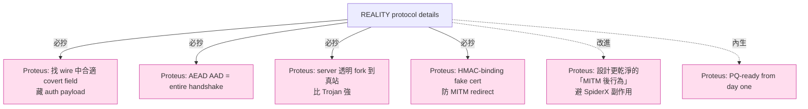

# 課堂 7.11 — REALITY 完整解剖（二）：協議細節

## 學前知道
- 前置課：
  - [7.10 REALITY 威脅模型](./7.10-reality-threat-model.md)
  - [3.5 橢圓曲線](../part-3-cryptography/3.5-elliptic-curves.md)（X25519 ECDH）
  - [3.3 Hash / KDF](../part-3-cryptography/3.3-hash-functions-kdf.md)（HKDF-SHA256）
  - [4.3 TLS 1.3 握手逐 byte](../part-4-tls-quic/4.3-tls13-handshake-byte-level.md)
- 預計閱讀時間：**55 分鐘**
- 必讀規格：
  - **REALITY README**（XTLS）—— [`notes/specs/reality.md`](../../notes/specs/reality.md)
  - **`xtls/reality`** Go module（server-side fallback 邏輯）
- 必讀原始碼（**逐行對照本堂內容**）：
  - **xray-core** `transport/internet/reality/reality.go:121-238`（client `UClient`）
  - **xray-core** `transport/internet/reality/reality.go:76-119`（client `VerifyPeerCertificate`）
  - **xray-core** `transport/internet/reality/reality.go:179-235`（SpiderX）
  - **xray-core** `transport/internet/reality/config.go:16-59`（Config 對映）
  - **`xtls/reality`** repo —— server `Server()` + handshake fork 邏輯
- 必讀 utls：
  - **utls** `refraction-networking/utls` —— **REALITY client 的 ClientHello 全部來自 utls**

## 動機

Part 7.10 建立 threat model 的「**為什麼**」，本堂深入「**怎麼**」——每個 byte、每個 ECDH operation、每個 fallback 條件的 byte 級細節。

REALITY protocol 的精妙之處在於：**整個「auth + obfuscation」全部塞進 standard TLS 1.3 ClientHello 的 32-byte SessionID 欄位**——對外部觀察者**完全隱形**。設計這個 wire-format trick 需要：

1. 找一個 32 byte 大小的 TLS field 不影響真實 handshake 行為。
2. 讓這個 field 在 attacker 看來是 random（而不是 protocol-specific value）。
3. 讓 server 能 O(1) 判斷是 REALITY auth 還是 generic ClientHello。
4. server 對 fail case 必須**透明 forward 到真站**（不能任何行為偏差）。

每一條都不是 trivial。本堂逐個拆解。

讀完應該回答：
- ClientHello SessionID 32 byte 怎麼編碼 16 byte payload + 16 byte AEAD tag？
- ECDH 的 client X25519 私鑰從哪來？這個與 TLS 1.3 KeyShare 的關係？
- Server-side 怎麼透明 fork 到真站？handshake bytes 已部分讀走了如何 forward？
- HMAC-SHA512 的 fake cert 簽章怎麼防 MITM redirect？
- SpiderX 是什麼？它在 client 端發現 MITM 後做什麼，為什麼這樣做？

---

## 核心概念

### 1. SessionID 32 byte 的 layout

REALITY 把 auth 數據塞進 ClientHello 的 `legacy_session_id` 欄位（TLS 1.3 RFC 8446 §4.1.2，32 byte，TLS 1.2 兼容用）。

**Plaintext layout (16 byte)**：

| Offset | Size | 內容 |
|---|---|---|
| 0–2 | 3 B | Xray version (`x.y.z` packed) |
| 3 | 1 B | `0x00` reserved |
| 4–7 | 4 B | Unix timestamp (BE uint32) |
| 8–15 | 8 B | ShortId（multi-user 區分）|

**Encrypted layout (32 byte SessionID)**：

```
| AES-GCM ciphertext (16 B) | AES-GCM tag (16 B) |
```

**注意**：TLS 1.3 ClientHello 的 SessionID **本來就是 0–32 byte 隨機值**（用於 TLS 1.2 backward compat，TLS 1.3 server 通常 echo 或忽略）。**REALITY 強制 32 byte 全填**——這個是 fingerprint 嗎？實際上 **真實 browser 的 ClientHello.SessionID 也是 32 byte 隨機**（utls 模仿），所以 REALITY 的 SessionID **長度與內容分布**與真 browser 一致。

### 2. Client-side wire 構造（reality.go:121-238 詳解）

```go
func UClient(c net.Conn, config *Config, ...) (net.Conn, error) {
    // (1) 用 uTLS 構造 ClientHello（fingerprint 模仿目標 browser）
    utlsConn := utls.UClient(c, &utls.Config{
        ServerName: config.ServerName,    // SNI = whitelist domain
        ...
    }, fingerprintHelloID(config.Fingerprint))

    // (2) 強制 SessionID = 32 byte 隨機
    if err := utlsConn.BuildHandshakeState(); err != nil { return nil, err }
    hello := utlsConn.HandshakeState.Hello
    hello.SessionId = make([]byte, 32)

    // (3) 編 plaintext 16 byte
    binary.BigEndian.PutUint32(hello.SessionId[4:], uint32(time.Now().Unix()))
    copy(hello.SessionId[8:], shortId[:8])
    hello.SessionId[0] = byte(coreVersion >> 16)
    hello.SessionId[1] = byte(coreVersion >> 8)
    hello.SessionId[2] = byte(coreVersion)

    // (4) 從 KeyShare 取 client X25519 私鑰
    privateKey := utlsConn.HandshakeState.State13.EcdheKey.Bytes()  // X25519 secret

    // (5) ECDH 與 server 公鑰
    sharedSecret, _ := curve25519.X25519(privateKey, config.PublicKey)

    // (6) HKDF-SHA256 推 AuthKey（32 byte）
    salt := hello.Random[:20]      // 前 20 byte 當 salt
    hkdf := hkdf.New(sha256.New, sharedSecret, salt, []byte("REALITY"))
    authKey := make([]byte, 32)
    hkdf.Read(authKey)

    // (7) AES-GCM seal SessionID 前 16 byte
    block, _ := aes.NewCipher(authKey)
    aead, _ := cipher.NewGCM(block)
    nonce := hello.Random[20:]     // 後 12 byte 當 nonce
    aad := hello.Raw                // 整個 ClientHello (after marshalling) 當 AAD
    sealed := aead.Seal(nil, nonce, hello.SessionId[:16], aad)
    copy(hello.SessionId, sealed)   // 16 B ciphertext + 16 B tag = 32 B

    // (8) 送出
    if err := utlsConn.Handshake(); err != nil { return nil, err }
    return utlsConn, nil
}
```

**精妙點**：

- **Step (4)** 從 utls 內部偷出 client 的 X25519 私鑰——utls 已經為 ClientHello.KeyShare 生成了 X25519 keypair，REALITY **重用**這個 keypair 做自己的 ECDH。**這意味著 REALITY 的 ECDH 與 TLS 1.3 真實 KeyShare 共享 client 私鑰**。
- **Step (5)** ECDH 結果 = $X25519(\text{client\_priv}, \text{server\_X25519\_pub})$。**server 公鑰來自 config**（帶外分發）——**不是來自真站 cert**。
- **Step (6)** HKDF salt = ClientHello.Random[:20]——確保**每個 ClientHello AuthKey 唯一**（防 replay）。
- **Step (7)** AAD = 整個 ClientHello.Raw——這是 **handshake binding**：攻擊者改任何 ClientHello byte，AEAD 解密失敗。
- **Step (7) AES-GCM** 而非 ChaCha20-Poly1305：因為 AES-NI 普及 + tag 大小一致（16 byte）。

### 3. Server-side handshake fork

Server 收到 ClientHello 後流程（在 `xtls/reality` Go module，未在 xray-core repo）：

```go
// 簡化的 server handshake
func Server(rawConn net.Conn, config *Config) (net.Conn, error) {
    // (1) 讀 ClientHello bytes
    hello, helloRaw, err := readClientHello(rawConn)
    if err != nil { return nil, err }

    // (2) 取 SessionID 與 client X25519 公鑰（從 ClientHello.KeyShare）
    sessionId := hello.SessionId   // 32 byte
    clientPub := hello.KeyShares[0].Data  // X25519 public

    // (3) ECDH
    sharedSecret, _ := curve25519.X25519(config.PrivateKey, clientPub)

    // (4) HKDF
    authKey := hkdfSha256(sharedSecret, hello.Random[:20], "REALITY", 32)

    // (5) AES-GCM Open
    block, _ := aes.NewCipher(authKey)
    aead, _ := cipher.NewGCM(block)
    nonce := hello.Random[20:]
    aad := helloRaw
    plaintext, err := aead.Open(nil, nonce, sessionId, aad)
    if err != nil {
        // (6a) AEAD fail → Fallback
        return fallbackToReal(rawConn, helloRaw, config.Dest)
    }

    // (6b) AEAD 成功，檢查 plaintext
    version := binary.BigEndian.Uint32(plaintext[0:4]) & 0xFFFFFF
    timestamp := binary.BigEndian.Uint32(plaintext[4:8])
    shortId := plaintext[8:16]

    if !checkVersion(version, config) ||
       !checkTimestamp(timestamp, config.MaxTimeDiff) ||
       !checkShortId(shortId, config.ShortIds) {
        return fallbackToReal(rawConn, helloRaw, config.Dest)
    }

    // (7) 通過 → server 自己回 ServerHello + 假 cert + HMAC 簽章
    return performRealitySideHandshake(rawConn, authKey, config)
}
```

**Step (6a) Fallback 是 REALITY 的核心防禦**——**對任何不合法 ClientHello，server 不關連線，也不回 ServerHello，而是把整條 TCP 連線透明 forward 到 `Dest`（真站）**。

### 4. Fallback 的 byte-by-byte 實現

```go
func fallbackToReal(rawConn net.Conn, helloRaw []byte, dest string) (net.Conn, error) {
    // (1) 連到真站
    realConn, err := net.Dial("tcp", dest)   // dest = "dl.google.com:443"
    if err != nil { return nil, err }

    // (2) 把已讀的 ClientHello 重新發給真站
    if _, err := realConn.Write(helloRaw); err != nil { return nil, err }

    // (3) 雙向 io.Copy（TCP splice）
    go io.Copy(realConn, rawConn)   // client → real
    go io.Copy(rawConn, realConn)   // real → client

    // (4) 阻塞直到 connection 結束
    // ... 不返回給 xray，因為這 connection 不是給 xray 用的
}
```

**精妙**：

- ClientHello 已被 server 讀走，**必須 replay 給真站**——否則真站不知道 handshake 開始。
- 之後 **kernel splice**（io.Copy 對 TCPConn 自動用 splice）—— 雙向 byte-by-byte forward。
- **真站完成 handshake**：回真 ServerHello + 真 cert chain。client 收到的就是真站的真 cert。
- 對 attacker 看來：connection **完美**——cert 真、ServerHello 真、後續 HTTP 也真（因為它就是真的）。

### 5. Server 通過後的 fake cert 與 HMAC 簽章

當 SessionID 解密成功且 plaintext 通過所有檢查，server 進入 REALITY mode：

```go
func performRealitySideHandshake(conn net.Conn, authKey []byte, config *Config) (net.Conn, error) {
    // (1) Server 自己生 ServerHello（用 utls 或自寫 TLS stack）
    serverHello := generateServerHello(...)

    // (2) Server 自己生臨時 X25519 keypair 給 ECDH
    serverEphemeralPriv, serverEphemeralPub := curve25519.GenerateKey()

    // (3) Server 自己生臨時 cert（不是真站的，自簽）
    fakeCert := generateFakeCert(config.ServerNames[0])  // SAN = 真站 hostname

    // (4) HMAC sign：用 AuthKey HMAC 假 cert 的 ed25519 公鑰
    hmacSig := hmac.New(sha512.New, authKey).Sum(serverEd25519Pub)

    // (5) 把 hmacSig 塞進 fake cert 的某個 extension（client 會驗）
    fakeCert.Extensions = append(fakeCert.Extensions, pkix.Extension{
        Id:    realityHmacOID,
        Value: hmacSig,
    })

    // (6) 完整 TLS 1.3 handshake（用自家 stack）
    // ...
}
```

**Client 端驗證**（reality.go:76-119, `VerifyPeerCertificate`）：

```go
func (uConn *UConn) VerifyPeerCertificate(rawCerts [][]byte, _ [][]*x509.Certificate) error {
    cert, _ := x509.ParseCertificate(rawCerts[0])

    // (1) 找 REALITY HMAC extension
    var hmacSig []byte
    for _, ext := range cert.Extensions {
        if ext.Id.Equal(realityHmacOID) {
            hmacSig = ext.Value
        }
    }
    if hmacSig == nil {
        // 沒 REALITY HMAC → 不是 REALITY server，可能被 redirect 到真站
        uConn.Verified = false
        return nil   // 不立即報錯，後續 SpiderX 處理
    }

    // (2) 驗 HMAC
    expectedSig := hmac.New(sha512.New, uConn.AuthKey).Sum(cert.PublicKey.(ed25519.PublicKey))
    if !hmac.Equal(hmacSig, expectedSig) {
        return fmt.Errorf("REALITY HMAC mismatch")
    }

    uConn.Verified = true
    return nil
}
```

**這是 REALITY 防 MITM redirect 的核心機制**：

- 攻擊者把 client 的 ClientHello redirect 到真站 → 真站不知 AuthKey → 不會在 cert 加 HMAC extension → client 看到 `Verified == false`。
- Client 知道發生 MITM → 啟動 SpiderX 偽裝。

### 6. SpiderX：MITM 之後的偽裝

```go
// reality.go:179-235 (簡化)
if !uConn.Verified {
    // 攻擊者把我們 redirect 到真站了——我們現在就 *真的* 像個 browser 訪問真站
    go func() {
        // 開 HTTP/2 連線到真站
        client := &http.Client{Transport: &http2.Transport{...}}

        // 第一個請求：config.SpiderX 指定的 path
        url := fmt.Sprintf("https://%s%s", config.ServerName, config.SpiderX)
        resp, _ := client.Get(url)
        body, _ := io.ReadAll(resp.Body)

        // 解析 HTML 找 href，假裝點了幾個 link
        for _, href := range parseHrefs(body) {
            time.Sleep(jitter())
            client.Get("https://" + config.ServerName + href)
        }
    }()
    return errors.New("REALITY: processed invalid connection")
}
```

**SpiderX 的目的**：

- 對 attacker 看：client 連了 vps.example.com → 看到真站 cert（被 redirect 到真站）→ 開始**正常瀏覽真站**（GET /、follow links）。**這就是合法 user 行為**。
- 沒有 SpiderX：client 收到真站 cert 後**立即斷連** → **「**短連線、cert 不對立即斷**」是強指紋**——標記為「**可能是 proxy client**」。
- 有了 SpiderX：client 行為與「**user 訪問真站、瀏覽幾個頁面、離開**」**不可區分**。

**注意 SpiderX 自己的 fingerprint**：

- HTTP/2 stack 是 `golang.org/x/net/http2`——fingerprint 與真 browser 不同。
- href 隨機 follow pattern——可能與真 user click pattern 不同。
- SpiderX 觸發**頻率**——若 GFW 經常 MITM，每次 client 都跑 SpiderX，**這個高頻 SpiderX 行為本身可能是 fingerprint**。

**這是 REALITY 已知的副作用**——README 沒明說，社群討論偶爾提及。Part 7.12 詳述。

### 7. ShortId 設計

8 byte ID，server 端對應：

```go
// config.go:50-57
serverNamesMap := make(map[string]bool)
for _, name := range config.ServerNames {
    serverNamesMap[name] = true
}
shortIdMap := make(map[[8]byte]bool)
for _, sid := range config.ShortIds {
    var arr [8]byte
    copy(arr[:], sid)
    shortIdMap[arr] = true
}
```

**O(1) lookup**——比 VMess multi-user trial decryption 快。

**多 user 場景**：每個 user 拿到不同 ShortId，server 用 ShortId 路由到對應 user 的 VLESS 配置。**ShortId 不必加密**——它在 SessionID plaintext 內，AEAD 保護後送出。

**ShortId 為什麼 8 byte**：
- 大到避免 collision（$2^{64}$ 空間）。
- 小到不顯得異常（SessionID 32 byte 的小段）。
- 與 timestamp + version 拼起來剛好 16 byte = 1 個 AES block。

**空 ShortId**：spec 允許，server config `shortIds: [""]` 對應一個全零 ID——**簡化單 user 場景**。

### 8. ServerNames 與 Dest 的關係

**ServerNames**：合法 SNI 集合。Client 必須把 ClientHello SNI 設為其中之一。

**Dest**：fallback 目標。

**典型部署**：

```json
{
  "serverNames": ["dl.google.com"],
  "dest": "dl.google.com:443"
}
```

**重要 invariant**：`Dest` 的 hostname **必須**對應 `ServerNames` 中至少一個——否則 fallback 後真站收到不匹配的 SNI 會 reject。

**為什麼分兩個 field**：
- `ServerNames` 可以列多個（如 `["dl.google.com", "downloads.gradle.org"]`）支援多個 cover domain。
- `Dest` 是單一 fallback target——通常選 ServerNames 中的一個。

**multi-cover deployment**：server 可同時偽裝成多個白名單 domain——client 任選一個 connect。**這提高 traffic blending**——對 attacker 看來，這個 vps.example.com 同時訪問 dl.google.com 與 downloads.gradle.org，**像 server farm 而非 single proxy**。

### 9. MaxTimeDiff 與 replay 防護

```go
// 簡化
if abs(time.Now().Unix() - decodedTimestamp) > config.MaxTimeDiff_seconds {
    return fallbackToReal(...)
}
```

預設 `MaxTimeDiff = 60000ms = 60s`——比 SS-2022 的 30s 寬鬆。**理由**：REALITY ClientHello 帶 utls 模仿，**utls 內部已有 RTT delay**——若 timestamp window 太小，client 與 server 時鐘輕微漂移就 fail。

**replay defense 完整鏈**：

1. `MaxTimeDiff` 拒絕老 ClientHello（>60s 前）。
2. server 維護 **ClientHello.Random replay cache**（最近 N 秒內看過的 Random 值）——重複拒絕。

**這個 cache 沒寫進 spec**——是實作層面的防禦。**xtls/reality 的源碼有 LRU cache**。

### 10. ML-DSA-65 後量子簽名（2024+ 實驗）

```json
"mldsa65Seed": "..."   // server config
"mldsa65Verify": "..." // client config
```

**動機**：未來 quantum computer 破 X25519 → REALITY 整套 auth 失效。**ML-DSA-65**（NIST PQC standard 2024）作為 fall-back 簽名 layer。

**實作**：在 fake cert 的 HMAC extension 之外**再加一個 ML-DSA-65 簽章** extension。Client 同時驗 HMAC 與 ML-DSA-65。

**問題**：ML-DSA-65 簽章 ~3 KB，加到 fake cert extension 顯著增大 cert size——**這個 size 變化本身是 fingerprint**（真站 cert 通常 1-3 KB）。**這是 PQ migration 的實際工程挑戰**——Part 11.7 / Part 11.10 PQ chapter 詳講。

**2026 年部署狀態**：experimental flag，預設關閉。

### 11. 完整 byte 流（client 端）

```
[TCP 三次握手]
[Client → Server] ClientHello (TLS 1.3, with utls fingerprint, SessionID = REALITY auth payload)
[Server 內部判定]
  if fallback:
    [Server → realDest] forward ClientHello
    [realDest → Server] ServerHello + Cert + Finished
    [Server → Client] forward ServerHello + ...
    [Client] verify cert → 不是預期 REALITY 的 fake cert → SpiderX
  else (REALITY mode):
    [Server → Client] ServerHello (server 自製) + fake Cert (with HMAC) + Finished
    [Client] verify HMAC → ok → Verified = true
    [Client] complete TLS 1.3 handshake
    [後續] application data = inner VLESS / Vision protocol
```

---

## 與我們協議設計的關聯

1. **ClientHello SessionID 32 byte 是 wire-format trick 典範**：找一個「**外觀正常但內容可控**」的 field 藏 protocol payload。Proteus wire-format 設計 Part 11.5 必抄此思路。
2. **AAD = 整個 ClientHello.Raw**：handshake binding 防 attacker 篡改任何 byte。Proteus 必有此 binding。
3. **「**透明 fork 到真站**」是 fallback 終極形式**：比 Trojan 的 fallback to nginx 強——**不需要 server 自己跑 nginx**。Proteus 應有同樣機制。
4. **Server 端 trial decryption O(1)**：ShortId-based hash lookup。Proteus 多 user 設計直接抄。
5. **HMAC binding fake cert** 防 MITM redirect：Proteus 必有 cert validation hook。
6. **SpiderX 是 well-intentioned hack**：副作用（fingerprint）需要關注。Proteus 應思考更乾淨的「MITM 後行為」設計——可能方向：**直接返回真站 response 但拒絕後續 user data**（不主動 SpiderX）。
7. **PQ migration 已開始**：ML-DSA-65 部署是 2024+ 開始的工程實踐。Proteus 設計 from day one 考慮 PQ-ready。

---

## 動手

實驗 A（45 min）：**手寫 REALITY ClientHello SessionID encoder**

```python
import time, struct, os
from cryptography.hazmat.primitives.asymmetric.x25519 import X25519PrivateKey, X25519PublicKey
from cryptography.hazmat.primitives.kdf.hkdf import HKDF
from cryptography.hazmat.primitives import hashes
from cryptography.hazmat.primitives.ciphers.aead import AESGCM

# 從 server config 拿
SERVER_PUBKEY_BYTES = bytes.fromhex("...")  # X25519 public key
SHORT_ID = bytes.fromhex("0123456789abcdef")  # 8 byte
SERVER_HOSTNAME = "dl.google.com"

# 生 client X25519 keypair
client_priv = X25519PrivateKey.generate()
client_pub = client_priv.public_key()

# ECDH
server_pub = X25519PublicKey.from_public_bytes(SERVER_PUBKEY_BYTES)
shared = client_priv.exchange(server_pub)

# 模擬 ClientHello.Random（32 byte 隨機）
hello_random = os.urandom(32)
salt = hello_random[:20]
nonce = hello_random[20:]

# HKDF
hkdf = HKDF(algorithm=hashes.SHA256(), length=32, salt=salt, info=b"REALITY")
auth_key = hkdf.derive(shared)

# 編 plaintext 16 byte
version = (24 << 16) | (10 << 8) | 0  # Xray version 24.10.0
timestamp = int(time.time())
plaintext = struct.pack(">IIxxxx8s", version, timestamp, SHORT_ID)[:16]
# 注意：實際 layout 是 [version 3B | 0x00 | timestamp 4B | shortId 8B]

# 模擬 ClientHello.Raw 作 AAD
hello_raw = b"<entire ClientHello bytes including SessionID placeholder>"
aead = AESGCM(auth_key)
sealed = aead.encrypt(nonce, plaintext, hello_raw)
print(f"SessionID (32 B): {sealed.hex()}")
```

實驗 B（30 min）：**讀 xtls/reality server fork code**

`github.com/xtls/reality` repo:

- `handshake.go` — server-side handshake fork
- `connection.go` — connection wrapper
- `mirror.go` — fallback mirror

回答：
1. Server 怎麼判斷 ClientHello 已完整讀完（TLS record 長度）？
2. Fallback 時 client→real 與 real→client 兩個方向，哪個先啟動？是否有 race condition？
3. Replay cache 用什麼資料結構？eviction policy？

實驗 C（30 min）：**模擬 MITM redirect 觀察 SpiderX**

```bash
# 1. 啟動真站 mirror（用 nginx + dl.google.com cert dummy）
# 2. 把 DNS resolve vps.example.com → mirror IP
# 3. Client 連 vps.example.com
# 4. Client 收到 dl.google.com cert（mirror 提供，但無 REALITY HMAC extension）
# 5. 觀察 client 啟動 SpiderX，發 HTTP/2 GET /
```

用 Wireshark 看 client 的 SpiderX traffic pattern——**對比真 browser GET 的 HTTP/2 stream pattern**。

---

## 自我檢查

1. ClientHello.Random 32 byte 中，前 20 byte 用作 HKDF salt、後 12 byte 用作 GCM nonce。為什麼這個分配？salt 與 nonce 的密碼學功能差異？
2. AAD = `hello.Raw`（整個 ClientHello）—— 但 ClientHello 包含 SessionID 本身。這是 chicken-and-egg 嗎？實作上怎麼解？
3. Server 端 trial decryption：對每個進來 ClientHello 都要做 X25519 + HKDF + AES-GCM。CPU cost 可觀——對 high-throughput server 是否是 bottleneck？
4. Fake cert 的 SAN 必須是 ServerNames 中之一——若 client 送 SNI=`dl.google.com` 但 fake cert SAN 是 `downloads.gradle.org`，client cert 校驗會通過嗎？為什麼？
5. SpiderX 自己的 fingerprint 是什麼？為什麼說「SpiderX 觸發頻率」可能是新指紋？
6. MaxTimeDiff = 60s —— 比 SS-2022 的 30s 寬鬆。**有何 trade-off**？（提示：clock drift vs replay window）

---

## 延伸閱讀

- **xtls/reality** Go module（server 端）
- **utls** `refraction-networking/utls` —— ClientHello fingerprint 庫
- Part 7.10 REALITY 威脅模型
- Part 7.12 REALITY 限制與已知攻擊
- Bhargavan et al., IEEE S&P 2014 (Triple Handshakes)
- ML-DSA-65 NIST FIPS 204

---

## 研究級補遺

### 1. 學界詞彙

| 口語 | 學術術語 | 出處 |
|---|---|---|
| 「藏 auth 在 SessionID」 | covert channel in protocol field | (general infosec) |
| 「Server fork to real」 | TCP-level decoy routing | Karlin et al. FOCI 2011 |
| 「HMAC binding」 | challenge-response cert binding | (similar to TLS Channel Binding RFC 5929) |
| 「SpiderX」 | post-handshake decoy traffic | (REALITY-specific) |
| 「ML-DSA-65」 | NIST PQC standard module-lattice signature | NIST FIPS 204 (2024) |

### 2. 對手分類學

REALITY protocol 細節對 L4 (MITM redirect) 的具體防禦：

| Attack | REALITY 防禦機制 |
|---|---|
| Active probe with random bytes | AEAD fail → fallback to real → 看到真 cert |
| Replay of leaked ClientHello | ClientHello.Random unique → replay cache reject; timestamp window reject |
| MITM redirect ClientHello to real | client 收到無 HMAC extension 的 cert → SpiderX |
| MITM bidirectional with attacker fake cert | attacker 不知 AuthKey → 無法簽 HMAC → client reject |
| Forge fake cert with valid HMAC | 需知 AuthKey → 需知 server X25519 私鑰 → 計算上不可能 |

### 3. 形式化定義

**Reality auth correctness**:

設 server 持私鑰 $sk$，client 持 server 公鑰 $pk = X25519(sk, B)$，client 生 ephemeral keypair $(c, C = X25519(c, B))$，shared secret $K = X25519(c, pk) = X25519(sk, C)$。

**Auth probability for honest client**: 
$$
\Pr[\text{server accepts}] = 1 - \frac{\text{replay-cache-hit-rate}}{1}
$$
（單 client 連線正常情況下 ≈ 1）

**Forgery probability for attacker** $\mathcal{A}$ (without $sk$):
$$
\Pr[\mathcal{A} \text{ forges accepted ClientHello}] \leq \text{Adv}^{\text{X25519-CDH}}_{\mathcal{A}} + \text{Adv}^{\text{AES-GCM-INT}}_{\mathcal{A}}
$$

對 256-bit ECDH + 128-bit AES-GCM，bound = negl。

### 4. 領域的關鍵論文 / 規格 / 原始碼

- **xtls/reality + xray-core/transport/internet/reality** —— 唯一 normative source
- **utls** —— ClientHello fingerprint
- **TLS 1.3 RFC 8446 §4.1.2** —— SessionID 字段 spec
- **NIST FIPS 204** —— ML-DSA-65 spec
- **Karlin et al. FOCI 2011** (Decoy Routing) —— borrow-real 思路祖宗
- **Houmansadr et al. NDSS 2013** (Cirripede)

### 5. 我們協議的座標 / 設計取捨



### 6. 必追資源 / 社群入口

- **XTLS** GitHub org
- **xtls/reality** repo（核心 server logic）
- **utls** GitHub
- **net4people/bbs**

### 7. 開放問題

1. **Server fork 的 race condition**：fallback 同時開兩個 io.Copy goroutine，**第一個 byte 先到 client 還是先到 real**？若 client 已經發了 ClientHello bytes，server 在解 SessionID 失敗的延遲（~ms）會讓 fallback 比真站慢——**這個 ms 級延遲是否是 fingerprint**？需 measurement。
2. **SpiderX 行為形式化**：能否用 ML 學真 browser click pattern，自動 generate 真實的 SpiderX？目前是 hand-coded heuristic。
3. **Trial decryption CPU cost**：每 ClientHello 一次 X25519 ~50µs。對 100k connection/s server 是否 bottleneck？是否需要 hardware acceleration？
4. **PQ migration 路徑**：ML-DSA-65 cert size 大顯著影響 fingerprint。是否能用 hybrid（X25519 + ML-DSA-65 partial）逐步遷移？這是 Proteus 的開放挑戰。
