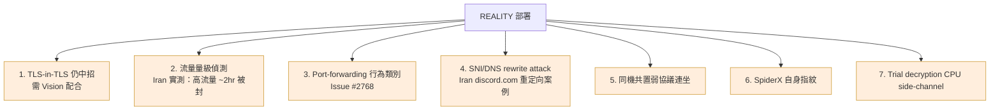
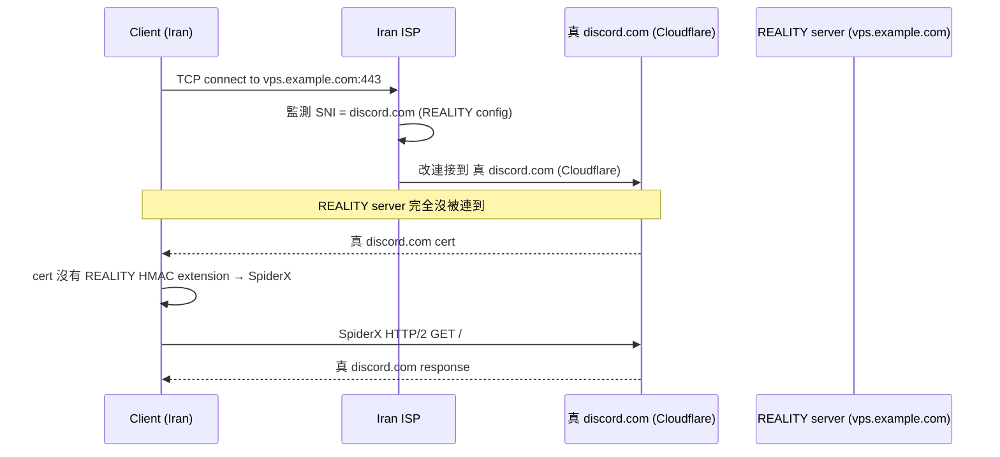
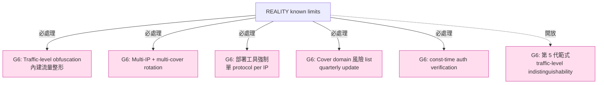

# 課堂 7.12 — REALITY 完整解剖（三）：限制與已知攻擊

## 學前知道
- 前置課：
  - [7.10 REALITY 威脅模型](./7.10-reality-threat-model.md)
  - [7.11 REALITY 協議細節](./7.11-reality-protocol.md)
  - [7.9 XTLS-Vision](./7.9-xtls-vision.md)（Vision 是 REALITY 的搭檔）
- 預計閱讀時間：**40 分鐘**
- 必讀社群討論：
  - **xray-core Discussion #2233** —— REALITY 設計討論（@RPRX 與社群）
  - **xray-core Discussion #3269** —— **Iran 阻斷實測 case study**
  - **xray-core Issue #2768** —— Port forwarding 行為討論
  - **net4people/bbs** 上 2023-2025 REALITY 阻斷觀察
  - **GFW.report** REALITY 相關 blog 文（持續更新）
- 必讀論文：
  - **Wu et al., FEP 2023** —— [`notes/papers/wu-fep-2023.md`](../../notes/papers/wu-fep-2023.md)
  - **van Ede et al., FlowPrint 2020** —— traffic-level fingerprinting
  - **Bhargavan et al., Triple Handshakes 2014**

## 動機

Part 7.10 / 7.11 講 REALITY **怎麼設計**與**做了什麼**。本堂聚焦 **REALITY 沒做什麼、做不到什麼、以及在 production 中**已被觀察到的失敗 case**。

研究級的協議理解必須涵蓋 **failure mode**——不是因為 REALITY 不好，而是**所有 censorship resistance 設計都有上限**。理解這些上限，才能在 G6 設計時不重蹈覆轍。

讀完應該回答：
- TLS-in-TLS pattern 在 REALITY 下還會洩漏嗎？為什麼需要 Vision 配合？
- Iran MCI 的 REALITY 阻斷實測（Discussion #3269）具體是什麼？流量量級的關鍵閾值？
- Port-forwarding 行為類別（Issue #2768）為什麼是 REALITY 的 ultimate threat？
- SNI/DNS rewrite attack 怎麼整死 REALITY 部署？
- 同機共置弱協議的「IP 連坐」效應？
- 為什麼說 REALITY 是「**handshake-level victory, traffic-level open**」？

---

## 核心概念

### 1. 7 類已知 weakness 全覽



### 2. Weakness #1：TLS-in-TLS 仍中招

REALITY 解決了 **outer TLS handshake** 的偽裝——但 **inner protocol 的流量分布仍可能是 nested TLS**。

**典型場景**：

```
[Client] → REALITY server → [twitter.com]

Wire on outer TCP:
  outer record 1: ClientHello (REALITY-encoded SessionID)
  outer record 2: ServerHello (假 cert + HMAC)
  outer record 3: Finished
  outer record 4-N: VLESS payload over outer TLS
```

如果 inner 是 user 訪問 `https://twitter.com`，VLESS payload 內含 inner TLS handshake：

```
outer record 4 (size N): 包含 inner ClientHello (~512 byte) → outer record N ≈ 533 byte
outer record 5 (size M): 包含 inner ServerHello + Cert (~3 KB) → outer record M ≈ 1500 + 1500 + 21
outer record 6 (size K): 包含 inner Finished (~80 byte) → outer record K ≈ 100 byte
```

**指紋**：outer record sizes 序列 **= 典型 inner TLS handshake 序列**——**TLS-in-TLS detector 命中**。

**REALITY 自己 README 承認此**——這就是為什麼 production 部署**強烈推薦 REALITY + Vision**：

| 配置 | TLS-in-TLS pattern |
|---|---|
| VLESS over REALITY (no Vision) | ❌ 中招 |
| VLESS over REALITY + Vision | ✅ 抹平（splice）|
| Trojan over TLS (no REALITY no Vision) | ❌ 中招 |
| Trojan over REALITY (no Vision) | ❌ 中招 |

**規則**：**任何「outer TLS + inner 也是 TLS app」的組合都需要 Vision**——REALITY 解 outer cert/handshake，Vision 解 inner record length pattern。**兩者不可替代**。

### 3. Weakness #2：Iran MCI 的流量量級偵測（Discussion #3269）

**事件**：2024-2025 年 Iran MCI（移動運營商）對 REALITY 的大規模阻斷。

**社群觀察**（來自 net4people/bbs + xray-core Discussion #3269）：

| Server 流量 | 被封時間 | 觀察 |
|---|---|---|
| 持續 10+ Mbps | ~2 小時 | 短時間內 IP 被全屏蔽 |
| 1-5 Mbps | ~1-3 天 | 觀察期 |
| < 500 Kbps 間歇性 | 數週至數月 | 部分用戶仍可用 |

**推測機制**：

1. Iran MCI 對所有訪問白名單 SNI（如 `discord.com`、`dl.google.com`）的 connection 採樣。
2. 對採樣 connection 的流量分布（throughput、packet size、bidi pattern）建立「**真實該 SNI 的 baseline**」。
3. 對 `dl.google.com` 的真實流量 baseline：**短突發 download**（user 點 link → 30 秒高 throughput → 結束）。
4. 對 REALITY 偽裝為 `dl.google.com` 的流量：**長連線、雙向持續活動、大量小 packet**——**完全不像 download**。
5. **超出 baseline N sigma → 標記 IP → 阻斷**。

**根本問題**：REALITY 偽裝 SNI 為 `dl.google.com`，但 REALITY user 的**實際使用 pattern**（瀏覽 web、看 YouTube、使用 IM）**與 dl.google.com 真實流量分布完全不同**。

**對 G6 啟示**：

- 「**借真站身份**」必須**配上「真站流量分布」**。
- 選 cover domain 時要選**「真實流量分布廣的」**——例如 `cdn.cloudflare.com`、`fastly.net`（CDN，各種流量都有）優於 `dl.google.com`（單純 download）。
- **Multi-cover** —— 同一 server 偽裝多個 SNI，client 隨機選——避免單一 SNI baseline 偏差累積。

### 4. Weakness #3：Port-forwarding 行為類別（Issue #2768）

**論點**（社群）：

對 attacker 看來，REALITY server 的本質是 **「TCP port forwarder + TLS handshake hijacker」**。**任何 port-forwarder 都有獨特的 traffic pattern**：

- 持續長連線（minutes to hours）
- 雙向流量比例變動大
- 連線數與 throughput 的相關性與正常 web service 不同
- 多 client 同時連同一 server，每個 client 流量 pattern 不同

**激進 mitigation**：**GFW 阻斷所有 port-forwarding 行為**——**即使無法識別具體 protocol，也能用「**TCP connection 的 traffic profile 屬於 port-forwarding 類別**」分類器封 IP。

**這是 REALITY 的 ultimate threat**——它假設「**借站 → indistinguishable from real connection**」，但 **port-forwarding 行為本身是一個 distinct category**。

**Mitigation 路徑（理論上）**：

1. **流量整形**：人為加 padding、限速、模擬真實 web 訪問 pattern。代價：**user 體驗顯著下降**。
2. **Multi-hop**：第一跳 REALITY → 中間混合多個用戶流量 → 第二跳出口。對等於 Tor 思路。
3. **Mixnet integration**：把 REALITY 包成 mix node 的 entry point。

**2026 年沒有任何 production proxy 採用上述**——成本太高。**Port-forwarding 識別仍是 REALITY 的 unaddressed weakness**。

### 5. Weakness #4：SNI/DNS rewrite attack

**Iran MCI 的 case study**：

對 SNI = `discord.com` 的 TLS connection，Iran MCI 不直接 forward 到目標 IP（user 配的 vps.example.com），而是**強制 SNI rewrite + DNS rewrite**：



**結果**：REALITY user 的 connection 被 **完美劫持到真站**——user 看到的是真 discord.com，**根本沒連到自己的 VPS**。

**從 attacker 角度**：

- 不需要識別 REALITY。
- 只需要對白名單 SNI 強制 redirect 到真站。
- 任何「希望 SNI=discord.com 但 IP 是 VPS」的 connection 全部被劫持。

**對 user**：「**我的 VPS 翻牆失效了**」——但 attacker 沒做任何「**識別 REALITY**」的工作，只是 **「強制白名單 SNI 走真站 IP**」。

**Mitigation**：

- **不要選 attacker 會 SNI rewrite 的 domain**——`discord.com`、`youtube.com`、`twitter.com`（在 Iran 與 China 都被特殊處理）。
- **選擇「**真實普通**」的白名單 domain**——例如 `cdn.jsdelivr.net`、`raw.githubusercontent.com`、`api.bing.com`（attacker 不會 wholesale rewrite，因為大量真實 service 依賴）。

**這是 REALITY 部署的 operational 痛點**——**不在 spec 內**，但每個 deployment 都要面對。

### 6. Weakness #5：同機共置弱協議的 IP 連坐

**場景**：一台 VPS 同時跑：

- REALITY (port 443)
- 古早 SS-AEAD（port 8388）
- 自己 web service（port 80）

**Attacker** 用 **port scan + protocol probing**：

1. 對所有開放 port 試探。
2. 在 port 8388 發現 SS-AEAD（被 IMC 2020 detector 命中）。
3. **整個 IP 標記為 「proxy infrastructure」**。
4. **連 port 443 的 REALITY 也一起被封**——即使 REALITY 自身完全 indistinguishable。

**這是 IP-level 連坐效應**——任何 single port 上的 weak protocol 拖垮整個 IP。

**Mitigation**：

- **乾淨 VPS** —— 只跑 REALITY + 真 cover service（nginx）。**禁止任何 legacy SS/VMess port**。
- **多 IP 隔離** —— 不同協議分到不同 VPS。
- **Port 偽裝** —— 把 SS、VMess 等隱藏 port 用 firewall block 或 knock-knock 序列保護。

**最佳實踐**：**新 VPS 從零部署 REALITY，不要與舊 proxy 混置**。社群中文圈經常有 user 抱怨「換 REALITY 後仍被封」——**99% 是同 VPS 上有 legacy 協議**。

### 7. Weakness #6：SpiderX 自身指紋

回顧 Part 7.11：MITM redirect 後，client 啟動 SpiderX 偽裝爬蟲行為。

**SpiderX 自己的可識別特徵**：

| 特徵 | 為什麼是 fingerprint |
|---|---|
| HTTP/2 stack = Go `golang.org/x/net/http2` | 與 Chrome / Firefox 的 H2 fingerprint 不同 |
| GET / 後 follow href 的 link 選擇 | 真 user 點擊 pattern 不同（focus on visible content, navigation） |
| 沒有 user input pattern（mouse/keyboard）| 真 user 訪問有 pause、scroll、interact |
| 完全沒有 referer chain | 真 user 通常從某 search engine / link 來 |
| User-Agent 為 Go default | 與真 browser 不同（除非 SpiderX config 覆蓋）|

**頻率指紋**：

- **Normal user**：偶爾遇到 MITM rewrite（罕見 event）。
- **REALITY user under SNI rewrite attack**：**每次連線都遇到 MITM** → **每次都跑 SpiderX**。

**對 attacker**：「**這個 IP 在過去 1 小時跑了 50 次 SpiderX-pattern HTTP/2 traffic**」 = **REALITY client**。

**Mitigation**：

- 改進 SpiderX 模仿真 browser fingerprint。
- 限頻 SpiderX 觸發（但會破壞 fallback 偽裝）。
- **根本解**：避免遇到 SNI rewrite（即避開高風險 cover domain）。

### 8. Weakness #7：Trial decryption 的 CPU side-channel

REALITY server 對每個進來的 ClientHello 做：

1. 解析 ClientHello（讀 SessionID、KeyShare）。
2. X25519 ECDH（~50µs on modern CPU）。
3. HKDF-SHA256（~10µs）。
4. AES-GCM Open（~5µs）。
5. 通過 → 進 REALITY mode；不過 → fallback。

**Side-channel**：

- 步驟 (5) 的「**通過 vs fallback**」在 server CPU usage 上有微秒級差別。
- 對 high-frequency probing，attacker 可能用 **timing 區分**「**這個 ClientHello 觸發 REALITY mode**」 vs 「**fallback**」。

**理論上可被利用**：

```
1. Attacker 大量發送 random SessionID 的 ClientHello → server fallback → measure RTT
2. Attacker 發送 valid REALITY SessionID（透過 leaked credential）→ server REALITY mode
3. 比對 RTT 差異
```

**實際影響**：未見公開 paper 系統研究。**社群推測**：差別 < 100µs，被網路 jitter 淹沒——**實際不可利用**。

**但 const-time 處理仍應做**——`xtls/reality` 的 trial decryption 是否 const-time？**沒明確檢驗**。

**對 G6**：必須 **explicitly const-time**——auth 驗證的時間 = 無 auth 與失敗 auth 的時間。Part 11.7 安全證明回頭。

### 9. REALITY + Vision + 流量整形 = 2026 production 上限

**目前 production SOTA**：

```yaml
# Server config
{
  "inbounds": [{
    "port": 443,
    "protocol": "vless",
    "settings": {
      "clients": [{ "id": "...", "flow": "xtls-rprx-vision" }]   # ← Vision flow
    },
    "streamSettings": {
      "network": "tcp",
      "security": "reality",                                       # ← REALITY
      "realitySettings": {
        "dest": "cdn.jsdelivr.net:443",                            # ← 選低風險 cover
        "serverNames": ["cdn.jsdelivr.net"],
        "privateKey": "...",
        "shortIds": ["abcd"]
      }
    }
  }]
}
```

**這個組合解了**：

- ✅ ClientHello fingerprint（utls）
- ✅ Cert chain attack（borrow real）
- ✅ Active probing（fallback to real）
- ✅ MITM redirect（HMAC + SpiderX）
- ✅ TLS-in-TLS（Vision splice）
- ✅ Self-signed cert detection（real cert）

**仍未解**：

- ❌ Traffic volume / throughput pattern（Iran 阻斷案例）
- ❌ CSCSC timing pattern（Vision 自己也承認）
- ❌ Port-forwarding 行為類別
- ❌ SNI rewrite for 高風險 domain
- ❌ Same-IP weak protocol 連坐

### 10. 對 G6 設計的整合啟示

**REALITY + Vision 教給 G6 的「**最後一英里問題**」**：

| 問題 | REALITY+Vision 的應對 | G6 可改進方向 |
|---|---|---|
| Traffic volume anomaly | 無 | 內建流量整形 + multi-IP |
| CSCSC pattern | 無 | Constant-rate padding (代價：bandwidth) |
| Port forwarding 識別 | 無 | Multi-hop（代價：latency） |
| SNI rewrite | 改用低風險 domain | 內建 SNI rotation pool |
| 連坐風險 | Operational hygiene | 強制單 protocol per IP（部署工具強制）|

**核心 takeaway**：**REALITY 把 「handshake-level indistinguishability」 推到了極限**。**「Traffic-level indistinguishability」 是 next frontier**——**G6 必須在這個維度上做出新貢獻**才能 claim SOTA。**Part 11.6 主要 design challenge**。

---

## 與我們協議設計的關聯

1. **明確標註「**不防什麼**」**：REALITY 的 README 列了部分 limits，但社群討論才完整。**G6 spec 必須詳列所有 known limits**——Part 11.1 spec template。
2. **Cover domain 的 operational guidance**：不只是「選一個白名單 domain」，要 **avoid 高風險 domain**（會被 SNI rewrite 的）。**G6 部署文件必有此 list**，並 quarterly 更新。
3. **單 protocol per VPS**：強制部署工具強制此——避免連坐。
4. **Const-time 驗證**：trial decryption 的 timing side-channel 要正面處理。
5. **流量整形 as first-class feature**：traffic volume / CSCSC / port-forwarding pattern 是 REALITY 未解問題——G6 必須 attack these head-on。Part 11.4 / 11.6 主要設計題。
6. **Multi-IP / multi-cover rotation**：避免 single-point detection。內建 client rotation logic。
7. **長期觀察社群討論**：REALITY 的 weakness 大多在 GitHub Issues / blog 中浮現，沒進 spec。**G6 必須有持續的 「known issues」 跟蹤機制**——可能用 GitHub Wiki 或 separate repo。

---

## 動手

實驗 A（45 min）：**測量 TLS-in-TLS pattern 在 REALITY+Vision 下的差異**

```bash
# 1. 啟動兩個 server：
#    A: VLESS over REALITY (no Vision)
#    B: VLESS over REALITY + Vision

# 2. 用 client 透過 A、B 各訪問 https://twitter.com 10 次

# 3. tshark 抓 outer TLS record size 序列
sudo tshark -i en0 -f "host vps.example.com" -Y "tls.record" \
    -T fields -e tls.record.length -c 100

# 4. 對比兩個序列：
#    A：明顯的 [533, 1500, 1500, 80, ...] 模式
#    B：抹平到 [1200, 1100, 1300, ...]，後續 splice 後序列正常
```

實驗 B（30 min）：**SNI rewrite attack 模擬**

在 Linux 上用 `iptables` 模擬 SNI rewrite：

```bash
# 在 client 端設定 iptables，把所有 SNI=discord.com 的 connection redirect 到真 Cloudflare IP
iptables -t nat -A OUTPUT -p tcp --dport 443 -m string --string "discord.com" --algo bm \
    -j DNAT --to-destination 162.159.135.232:443

# 跑 REALITY client
xray run -c client.json
```

觀察：
1. Client 是否啟動 SpiderX？
2. SpiderX 流量在 wireshark 中的 pattern？
3. **是否與真實 user 訪問 discord.com 的 pattern 相似**？

實驗 C（30 min）：**模擬流量量級偵測**

寫 traffic monitor：

```python
import scapy
def monitor(interface, ip):
    flows = {}
    for pkt in scapy.sniff(iface=interface, filter=f"host {ip}"):
        # 統計 packet sizes / inter-arrival times / total throughput
        ...
    # 對比真 dl.google.com 的 baseline
```

對自己的 REALITY VPS 跑 1 小時，對比 dl.google.com 在 Cloudflare logs 上的真實 traffic profile（如果能取得）。

---

## 自我檢查

1. TLS-in-TLS pattern 在 VLESS+REALITY (no Vision) 下還會洩漏。為什麼？哪一層的設計問題？
2. Iran MCI 的「流量量級閾值」可能是什麼？至少給 3 個可能的 baseline 變數（throughput、packet size、bidi ratio…）。
3. Port-forwarding 行為類別為什麼是 REALITY 的 **ultimate threat**？這個分類器需要看多久 traffic 才能高 confidence？
4. SNI rewrite attack 不需要識別 REALITY 就能整死部署。從 attacker 視角，這是「**便宜**」還是「**昂貴**」的策略？對 attacker 的 collateral damage？
5. 同機共置弱協議的 IP 連坐：這是技術問題還是 operational 問題？G6 應該如何在 spec / 工具層面強制避免？
6. Trial decryption 的 CPU side-channel 在實際網路中是否可被利用？jitter floor 是多少 µs？

---

## 延伸閱讀

- **xray-core Discussion #2233 / #3269** —— 設計與 Iran 阻斷實測
- **xray-core Issue #2768** —— Port forwarding 討論
- **net4people/bbs**：搜尋 "REALITY"、"Iran"、"discord.com block"
- **gfw.report** —— REALITY 相關 writeups
- **OONI Probe / Censored Planet** —— 對 REALITY 的全球阻斷觀察
- van Ede et al., *FlowPrint*, NDSS 2020
- Wright et al., *Spot Me If You Can*, IEEE S&P 2008（length padding 對 traffic analysis）

---

## 研究級補遺

### 1. 學界詞彙

| 口語 | 學術術語 | 出處 |
|---|---|---|
| 「流量量級偵測」 | volume-based traffic anomaly detection | Anderson et al., S&P 2018 |
| 「port-forwarding 識別」 | tunnel detection / proxy traffic classification | Wang et al., NDSS 2014 |
| 「IP 連坐」 | residual blocking / collateral blocking | Bock et al., USENIX Security 2019 |
| 「same-IP cross-protocol leak」 | IP-aggregated fingerprint | (informal, 2024+ 社群常用) |
| 「ultimate threat」（port-forwarding 類別）| categorical traffic classifier | (informal, REALITY-specific) |

### 2. 對手分類學（重述 Part 7.10 + 細化）

REALITY 在 8 級對手階梯中的具體 status：

| Level | 能力 | REALITY+Vision 防禦 | 備註 |
|---|---|---|---|
| L0–L4 | 已詳述 Part 7.10 | ✅ 全擋 | |
| L5 | ML traffic profiler | ❌ 中招（Iran 案例） | volume-based |
| L6 | Server-side timing | ⚠ 部分 | const-time 待強化 |
| L7 | Long-term IP profile | ❌ 中招 | port-forwarding 類別 |
| L8 | Adaptive Dolev-Yao + multi-cover SNI rewrite | ❌ 中招 | 攻擊 cost 高但仍可行 |

### 3. 形式化定義

**REALITY traffic-level indistinguishability** （open problem）：

設 $\mathcal{D}_{\text{cover}}$ = 真實 cover domain 的 traffic 分布（含 connection count、throughput、packet size、bidi pattern、duration）；$\mathcal{D}_{\text{REALITY}}$ = REALITY user 偽裝為該 cover domain 的 traffic 分布。則：

$$
\text{TVD}(\mathcal{D}_{\text{cover}}, \mathcal{D}_{\text{REALITY}}) = ?
$$

**Iran MCI 阻斷實證**：對高流量 user，TVD > 某閾值（unknown but apparently `> 0.1`）。

**G6 目標**：設計 protocol + 流量整形機制使 TVD < 0.01——**目前無公開生產級方案**。

### 4. 領域的關鍵論文 / 規格 / 原始碼

- **xtls/reality + xray-core** —— REALITY 主場
- **xray-core Discussions #2233 / #3269 + Issue #2768** —— 已知 weakness 集中討論
- **van Ede et al., *FlowPrint*, NDSS 2020** —— traffic-level fingerprinting 方法論
- **Anderson, McGrew, *Identifying Encrypted Malware Traffic with Contextual Flow Data*, AISec 2016** —— ML-based traffic classification 學界基準
- **Bock et al., *Detecting Probe-Resistant Proxies*, NDSS 2020** —— REALITY 設計動機之一

### 5. 我們協議的座標 / 設計取捨



### 6. 必追資源 / 社群入口

- **xray-core** Discussions / Issues
- **net4people/bbs**
- **gfw.report**
- **Censored Planet**
- **OONI Explorer**
- **Tor Project mailing lists**（pluggable transport / circumvention）

### 7. 開放問題

1. **Traffic-level indistinguishability 是否可達成**？學界共識：**理論上 mimicry 不可能完美**（Houmansadr 2013），但**實際 TVD 是否能降到 attacker 容忍的 false-positive 率以下**仍是 open。
2. **Multi-IP rotation 的 cost-benefit**：每個 user 用 N 個 IP 輪換，N=? 對 attacker detection 顯著效益？對 user cost？
3. **CSCSC pattern 的 fundamental mitigation**：是否能設計 protocol **本質上 bidirectional 而非 client-driven**？例如：server proactive push fake traffic？
4. **PQ migration 對 trial decryption cost 的衝擊**：ML-DSA-65 verify 比 X25519 ECDH 慢 ~10×——high-throughput server 是否需要 dedicated PQ accelerator？
5. **同 IP 多用戶的 cross-user side-channel**：同一 server buffer pool / connection table 的 timing 差異是否能讓 attacker 區分 user？需 lab measurement。
6. **「**第 5 代 censorship resistance 範式**」**：本堂明確列出 REALITY 的所有 known limits——下一代範式需要在這些上同時前進。Part 11.6 主場。
