# 課堂 7.14 — Xray-core 原始碼總覽：inbound / outbound / router

## 學前知道
- 前置課：
  - [7.5 VMess](./7.5-vmess.md)
  - [7.6 V2Ray transports](./7.6-v2ray-transports.md)
  - [7.8 VLESS](./7.8-vless.md)
  - [7.9 XTLS-Vision](./7.9-xtls-vision.md)
  - [7.11 REALITY 協議細節](./7.11-reality-protocol.md)
- 預計閱讀時間：**60 分鐘**
- 必讀原始碼（**逐 module 概覽**）：
  - **xray-core** repo: `github.com/XTLS/Xray-core`
  - 重點 packages（後文逐個解析）
- 必讀文件：
  - **xray-core README + Wiki**
  - **v2fly-core** README（理解 v2ray 與 xray fork 差異）

## 動機

Xray-core 是 **2026 production 翻牆協議的事實主流 server/client 實作**：

- **REALITY、XTLS-Vision、VLESS、Trojan、SS、VMess、SOCKS、HTTP** —— 全部支援。
- **多用戶 multi-tenant**、**routing 規則 engine**、**transport plugin**、**API**——production 級。
- **與 sing-box、mihomo 同為三大主流之一**，三者形成生態 triumvirate。

對協議學習者：

1. **看 spec 是看設計，看 code 才是看 deployment**——很多 spec 沒寫的 corner case 在 code 裡。
2. **Production proxy 的 architecture pattern**：inbound/outbound/router 三段架構是業界共識——理解這個 pattern 才能設計 G6 的 reference implementation。
3. **Xray 的歷史 fork**：xray 從 v2ray-core 分叉（2020 由 @rprx 主導），承擔了 **激進 protocol innovation**（XTLS、REALITY），**而 v2ray-core 保持保守**。**fork 的設計影響值得研究**。

讀完應該回答：
- inbound / outbound / router 三段架構具體是什麼？
- VLESS server 收到 connection 後的完整 dispatch 流程是什麼？
- Routing engine 的 rule matching 演算法是什麼？
- xray vs v2ray 的關鍵 fork 點？
- 怎麼讀 xray 程式碼定位某個 protocol 的關鍵 logic？

---

## 核心概念

### 1. 整體架構：inbound → router → outbound

```mermaid
flowchart LR
    InCl["Client Apps<br/>(browser, curl, ...)"] -->|SOCKS5/HTTP| InTrans["Inbound Transport<br/>(TCP/TLS/WS/...)"]
    InTrans --> InProto["Inbound Protocol Handler<br/>(VLESS/Trojan/SS/...)"]
    InProto --> Router["Router<br/>(rule matching)"]
    Router -->|target → outbound tag| OutProto["Outbound Protocol Handler<br/>(VLESS/Trojan/SS/freedom/blackhole/...)"]
    OutProto --> OutTrans["Outbound Transport<br/>(TCP/TLS/WS/REALITY/...)"]
    OutTrans -->|to remote target| Remote["Remote Server / Internet"]

    classDef ours fill:#fde,stroke:#c39
    class Router ours
```



**三段定義**：

- **Inbound**：接 client 連線。**負責**：listen socket、解 outer transport、解 inner protocol header、提取 destination metadata。
- **Router**：**唯一決定 traffic 走哪條 outbound**。輸入：destination address、source IP、user identity、network type 等；輸出：outbound tag。
- **Outbound**：把 traffic 送到 remote。**負責**：包 inner protocol header、encrypt、走 outer transport。

**這個三段是業界共識**——sing-box、mihomo、v2ray 同樣結構。**G6 reference impl 必抄此架構**。

### 2. Top-level package layout

```
Xray-core/
├── main/                       # CLI entry
├── core/                       # 核心 abstraction
│   ├── core.go                 # Instance 定義
│   ├── config.go               # Config loading
│   └── ...
├── proxy/                      # ★ Inbound + Outbound protocol handlers
│   ├── vless/
│   │   ├── inbound/inbound.go
│   │   └── outbound/outbound.go
│   ├── trojan/
│   ├── shadowsocks/
│   ├── shadowsocks_2022/
│   ├── vmess/
│   ├── socks/
│   ├── http/
│   ├── freedom/                # → 直連 outbound
│   ├── blackhole/              # → drop outbound
│   └── ...
├── transport/                  # ★ Outer transports (stream settings)
│   └── internet/
│       ├── tcp/
│       ├── tls/
│       ├── reality/            # ← Part 7.11 主場
│       ├── websocket/
│       ├── grpc/
│       ├── http/               # = HTTP/2
│       ├── splithttp/          # = xhttp 2024+
│       ├── kcp/
│       └── ...
├── app/                        # ★ 各種 application
│   ├── router/                 # ← Routing engine
│   │   ├── router.go
│   │   ├── condition.go
│   │   ├── condition_geoip.go
│   │   └── ...
│   ├── dns/
│   ├── policy/
│   ├── proxyman/               # ← Inbound/outbound 管理
│   ├── stats/
│   └── ...
├── common/                     # 共用工具 (buf, errors, ...)
├── infra/                      # 配置解析
└── features/                   # 接口定義
```

**幾個關鍵 module 名字翻譯**：

- `proxy/`：inbound + outbound protocol handlers（**注意**：「proxy」一詞在這裡是 protocol handler 的意思，不是「forward proxy」服務的意思）
- `transport/internet/`：outer stream settings（TCP / TLS / REALITY / WS / gRPC / ...）
- `app/proxyman/`：管理 inbound/outbound lifecycle
- `app/router/`：routing engine
- `features/`：interface 定義（type abstractions）

### 3. Inbound protocol handler 架構

以 **VLESS inbound** 為例（`proxy/vless/inbound/inbound.go`）：

```go
type Handler struct {
    inboundHandlerManager  inbound.Manager
    policyManager          policy.Manager
    validator              *vless.Validator   // ← user database
    dns                    dns.Client
    // ...
}

// Process is the main entry — called per inbound connection
func (h *Handler) Process(ctx context.Context, network net.Network, connection stat.Connection,
                          dispatcher routing.Dispatcher) error {
    sessionPolicy := h.policyManager.ForLevel(0)

    // (1) 解 inner protocol header — request header
    request, err := encoding.DecodeRequestHeader(reader, h.validator)
    if err != nil {
        // 認證失敗 — 對 VLESS 而言，spec 沒規定 fallback；
        // production 多用 REALITY 的 fallback 處理
        return newError("invalid request from %s: %s", connection.RemoteAddr(), err)
    }

    // (2) 找 user
    user := request.User
    account := user.Account.(*MemoryAccount)

    // (3) 對 destination 做 routing
    // request 含 destination address — 交給 dispatcher（router）
    link, err := dispatcher.Dispatch(ctx, request.Destination())
    if err != nil { return ... }

    // (4) 設定 inner data 雙向 copy
    request.Command 對應 TCP/UDP/Mux：
    case TCP: pipeRawTCP(link, conn)
    case UDP: pipeUDPOverInner(link, conn)
    case Mux: dispatchMux(link, conn)
}
```

**關鍵 abstraction**：

- `dispatcher.Dispatch(ctx, dest)` —— **這是 inbound 與 router 的接口**。inbound 不直接選 outbound——只把「這個連線目標是 dest」交給 router。
- `link` —— 從 router 拿回的 input/output stream pair，inbound 對它做 io.Copy 即可。
- `validator` —— user database（UUID → User 的 hash table）。

### 4. Outbound protocol handler 架構

以 **VLESS outbound** 為例（`proxy/vless/outbound/outbound.go`）：

```go
type Handler struct {
    serverList *protocol.ServerList   // ← list of upstream servers
    policyManager policy.Manager
    // ...
}

// Process — called per outbound connection request
func (h *Handler) Process(ctx context.Context, link *transport.Link,
                          dialer internet.Dialer) error {
    // (1) Pick an upstream server (load balancing)
    server := h.serverList.PickServer()

    // (2) Dial outer transport (TCP/TLS/REALITY/WS/...)
    conn, err := dialer.Dial(ctx, server.Destination())
    if err != nil { return ... }

    // (3) Build VLESS request header
    request := &protocol.RequestHeader{
        Version: encoding.Version,
        User:    server.PickUser(),
        Command: protocol.RequestCommandTCP,
        Address: link.Destination.Address,
        Port:    link.Destination.Port,
    }

    // (4) Build addons (flow = "xtls-rprx-vision" 等)
    requestAddons := &Addons{Flow: account.Flow}

    // (5) Encode + write request header
    err = encoding.EncodeRequestHeader(conn, request, requestAddons)

    // (6) 雙向 copy
    if requestAddons.Flow == "xtls-rprx-vision" {
        encoding.XtlsRead(...)   // splice mode
        encoding.XtlsWrite(...)
    } else {
        bufio.Copy(conn, link.Reader)
        bufio.Copy(link.Writer, conn)
    }
}
```

**關鍵 abstraction**：

- `dialer.Dial(...)` —— **這是 outbound 與 transport 的接口**。outbound 不關心 outer 是 TCP/TLS/REALITY/WS——dialer 統一返回一個 `net.Conn`。
- `link` —— 從 router 接過來的 input/output（與 inbound 的 link 是同一條）。

### 5. Router 架構

**`app/router/router.go`**：

```go
type Router struct {
    domainStrategy  Config_DomainStrategy
    rules           []*Rule
    balancers       map[string]*Balancer
    dns             dns.Client
}

// PickRoute is the main entry — called by dispatcher per connection
func (r *Router) PickRoute(ctx routing.Context) (routing.Route, error) {
    rule := r.pickRuleForRequest(ctx)
    if rule == nil {
        return defaultRoute, nil
    }
    return rule.GetTag(), nil
}

func (r *Router) pickRuleForRequest(ctx routing.Context) *Rule {
    for _, rule := range r.rules {
        if rule.Apply(ctx) {
            return rule
        }
    }
    return nil
}
```

**Rule matching**：

```go
type Rule struct {
    Tag         string                  // outbound tag
    Conditions  []Condition             // AND of all conditions
}

type Condition interface {
    Apply(ctx routing.Context) bool
}

// 例 condition implementations:
//   DomainMatcher (geosite, regex, full, prefix, suffix)
//   IPMatcher (geoip, CIDR)
//   PortMatcher
//   NetworkMatcher (TCP/UDP)
//   InboundTagMatcher
//   UserMatcher
//   SourceIPMatcher
```

**Geosite / Geoip matching**：使用 `v2ray-geoip` 與 `Loyalsoldier/v2ray-rules-dat` 提供的 protobuf-encoded 規則 db。

### 6. Routing engine 演算法：linear scan vs trie

Xray router 的 rule matching 是 **linear scan**——對每個 connection 從上到下試每個 rule。

**性能**：

- 規則數 1k：每 connection lookup ~10µs
- 規則數 10k：每 connection lookup ~100µs
- 大型部署（100k+ rules + geosite）：lookup 可達 ms 級——**routing 變 bottleneck**

**優化路徑**：

- **DomainMatcher** 內部用 trie（`router/condition_geosite.go`）—— hash 加速 prefix/suffix match
- **IPMatcher** 用 radix tree（CIDR matching）
- **Geoip db** 預先 sort + binary search

**仍是 linear scan rules**——這是 Xray (與 V2Ray) 設計選擇：**rule 順序**很重要（user 顯式聲明 priority）。

**對 G6**：routing 設計時應考慮 **trie-based 全 rule lookup**（O(1) per rule type）—— sing-box 部分採此設計。

### 7. Transport plugin 架構

`transport/internet/`：

```go
// Each transport must implement:
type Listener interface {
    Accept() (Connection, error)
    Close() error
}

type Dialer interface {
    Dial(ctx context.Context, dest net.Destination) (Connection, error)
}

// Transport types are registered in init()
// transport/internet/tcp/dialer.go:
func init() {
    common.Must(internet.RegisterTransportDialer("tcp", DialTCP))
}
```

**Stream settings 配置**：

```go
type StreamConfig struct {
    Network        TransportProtocol
    Security       SecurityType    // "none" | "tls" | "reality"
    NetworkSettings *anypb.Any     // TCP/WS/H2/gRPC config
    SecuritySettings *anypb.Any    // TLS / REALITY config
}
```

**Dialer chain**：

```
Outbound → StreamSettings.Dial()
  → SecurityWrap (TLS / REALITY)
    → NetworkDial (TCP / WS / H2 / gRPC)
      → Raw socket
```

### 8. Buffer management — buf package

`common/buf/`：自訂 buffer abstraction，**不直接用 Go bytes.Buffer**：

```go
type Buffer struct {
    v   []byte    // backing array (default 2 KB)
    start int32
    end   int32
}

// MultiBuffer = []Buffer
// 用於 batched read/write
```

**為什麼自訂 buffer**：

- **Zero-copy 友好**：buffer 可直接從 sync.Pool 取，避免 GC pressure。
- **Multi-buffer 批量處理**：一次 Read 多個 buffer，減少 syscall。
- **與 io.Reader/Writer 兼容**：透過 `buf.NewReader(...)` 包裝 net.Conn。

**對 throughput 的意義**：production 部署 1+ Gbps server，buf package 的 pool + multi-buffer 設計**比直接用 `io.Copy(dst, src)` 快 20-40%**。

### 9. xray vs v2ray fork 差異

| 維度 | v2ray-core | xray-core |
|---|---|---|
| 主導者 | v2fly community | @RPRX 與 XTLS team |
| 創新激進度 | 保守 | 激進（XTLS-Origin/Direct/Splice/Vision、REALITY） |
| API stability | 高 | 跟著 protocol 演化 |
| Fork 時間 | (origin) | 2020-09 |
| 主流 protocol 支援 | VMess、VLESS、Trojan、SS、SOCKS、HTTP | + XTLS（多版本）+ REALITY |
| Codebase 大小 | ~50k LoC | ~75k LoC |
| 主要使用者 | 老 user、企業 | production 用 REALITY/Vision 的 user |

**Fork 動機**：v2fly community 對 XTLS 早期 design 持保守態度（密碼學審查、命名衝突等），@RPRX fork 出 xray 加速迭代。**這個 fork 是中文社群少見的「**激進創新派 vs 穩健派**」分裂**——對協議演化是正面影響。

**2026 年現況**：xray-core 是事實主流——所有新 protocol（REALITY、Vision、xhttp/SplitHTTP）都先在 xray 落地，再被 sing-box 採納。

### 10. 程式碼閱讀路線圖

**新人讀 xray 順序建議**：

1. `main/main.go` — CLI entry
2. `core/core.go` — Instance lifecycle
3. `app/proxyman/inbound/worker.go` — connection accept loop
4. `proxy/vless/inbound/inbound.go` — VLESS inbound（讀完約 1 hour）
5. `proxy/vless/encoding/encoding.go` — VLESS wire format
6. `app/router/router.go` — routing
7. `transport/internet/reality/reality.go` — REALITY client
8. `proxy/proxy.go` — `XtlsPadding/Unpadding`、`CopyRawConnIfExist`（Vision splice）
9. `proxy/vless/outbound/outbound.go` — VLESS outbound

**讀法建議**：

- **不要從 main 讀到 leaf** —— 太深。**從 inbound.Process 讀起**，跟著 dispatcher / dialer 接口跳。
- **每個接口都 grep 找 implementations**（`grep -r "ImplementsXxx" .`）。
- **配合 GoLand / VS Code 的 jump-to-definition** —— 沒這個工具讀 xray 接近不可能。

### 11. xray 配置 → 程式碼路徑映射

```json
{
  "inbounds": [{
    "port": 443,
    "protocol": "vless",                         // → proxy/vless/inbound/
    "settings": {
      "clients": [{
        "id": "...",
        "flow": "xtls-rprx-vision"                // → proxy/vless/inbound/inbound.go:Process Vision branch
      }],
      "decryption": "none"
    },
    "streamSettings": {
      "network": "tcp",                           // → transport/internet/tcp/
      "security": "reality",                      // → transport/internet/reality/
      "realitySettings": {
        "dest": "dl.google.com:443",              // → transport/internet/reality/config.go:GetREALITYConfig
        "serverNames": ["dl.google.com"],
        "privateKey": "...",
        "shortIds": [""]
      }
    }
  }],
  "outbounds": [{
    "protocol": "freedom",                       // → proxy/freedom/freedom.go (= 直連)
    "tag": "direct"
  }],
  "routing": {                                  // → app/router/
    "rules": [
      { "type": "field", "ip": ["geoip:cn"], "outboundTag": "direct" }
    ]
  }
}
```

**這個映射** 是**最快的程式碼定位方法**——拿到一個出問題的配置，直接 grep config 字段名找 handler。

---

## 與我們協議設計的關聯

1. **三段架構（inbound/router/outbound）必抄**：G6 reference implementation 直接此模式。**不要重新發明**。
2. **Transport 與 protocol 解耦**：xray 的 `streamSettings` 把 outer transport 與 inner protocol 完全分離——G6 同樣設計。但 G6 的「**內生 obfuscation**」意味著 wire format 與 transport 緊耦合的部分需要明確界定。
3. **Buffer pool + multi-buffer**：production throughput 必選工程模式。Go 實作直接借 xray buf package。
4. **Routing engine** 是 **proxy 的另一個複雜度中心**：G6 不能跳過——必須有 production-grade routing。可選擇直接整合 sing-box/xray 的 routing 而非自寫。
5. **Fork 模式對 protocol 演化的影響**：xray vs v2ray fork 證明「**激進創新需要獨立 channel**」——G6 應預期 fork，提前設計 spec extension mechanism（addons-style）讓社群創新與主線並存。
6. **配置 → code 映射要透明**：xray 的字段名與 package name 一致是好設計——G6 的 spec 字段名與 reference impl 的 package/module name 應對齊。

---

## 動手

實驗 A（60 min）：**從 main 讀到 VLESS+REALITY 完整 dispatch path**

```bash
git clone https://github.com/XTLS/Xray-core
cd Xray-core
go build ./main

# 跑 server
./main -c server-vless-reality.json &

# Add gdb / dlv 設 breakpoint
dlv attach $(pgrep main)
break proxy/vless/inbound/inbound.go:100   # Process()
continue
```

跟蹤一個 connection 從 syscall accept 到 outbound dial 的完整路徑。記錄每個 function call 的 stack。

實驗 B（45 min）：**寫一個極簡 inbound handler**

```go
// 模仿 proxy/vless/inbound/inbound.go 寫一個 "echo" inbound：
// - 接 SOCKS5 client
// - 把 user 送的 byte 都 echo 回去
// - 不真的 forward 到 target

package myinbound

func (h *Handler) Process(ctx context.Context, network net.Network, conn stat.Connection,
                          dispatcher routing.Dispatcher) error {
    // 1. SOCKS5 handshake
    // 2. 讀 SOCKS5 request
    // 3. 不 dispatch — 直接 echo
    buf := make([]byte, 4096)
    for {
        n, err := conn.Read(buf)
        if err != nil { return err }
        if _, err := conn.Write(buf[:n]); err != nil { return err }
    }
}

// 註冊到 inbound registry
common.Must(common.RegisterConfig((*Config)(nil), New))
```

把這個 plugin 編進 xray 並用 SOCKS5 client 測試。

實驗 C（30 min）：**讀 routing rule matching 並寫 benchmark**

```go
// 對 100, 1k, 10k rules 跑 benchmark
func BenchmarkRouteMatch(b *testing.B) {
    rules := genRules(10000)
    router := setupRouter(rules)
    ctx := genRandomContext()
    for i := 0; i < b.N; i++ {
        router.PickRoute(ctx)
    }
}
```

對比 sing-box 的 routing benchmark——**是否 sing-box 的 trie-based routing 顯著快**？

---

## 自我檢查

1. inbound / router / outbound 三段架構的好處與壞處？什麼設計可能 break 這個 abstraction？
2. xray 的 routing engine 是 linear scan rules——對 100k rules 規模的 production 是否仍可行？需要什麼優化？
3. xray 的 buffer pool + multi-buffer 設計**對哪類 workload 影響最大**？對 high-RPS small-packet 還是 high-throughput large-packet？
4. xray vs v2ray fork 的設計影響：「**激進創新 vs 穩定**」的 trade-off 在 protocol 生態中該如何平衡？
5. 從配置定位程式碼路徑是 xray 程式碼閱讀的核心技巧。給定 `streamSettings.security: "reality"`，請寫出從 config parse 到 actual REALITY handshake 的完整 module call chain。
6. 為什麼說「**G6 不能跳過 routing engine**」？只做 protocol 不做 routing 會在哪些 production 場景碰壁？

---

## 延伸閱讀

- **xray-core** GitHub: README、Discussions、Issues
- **v2fly-core** GitHub：同源 fork 對比
- Part 7.15 sing-box 源碼總覽（架構對比）
- Part 7.16 mihomo 源碼總覽

---

## 研究級補遺

### 1. 學界詞彙

| 口語 | 學術術語 | 出處 |
|---|---|---|
| 「inbound/outbound/router」 | proxy data plane / control plane separation | (general SDN concept) |
| 「routing rule」 | policy-based routing (PBR) | RFC 4655 (PCE) |
| 「stream settings」 | transport adapter / pluggable transport | Tor PT spec |
| 「buffer pool」 | object pool pattern | (general systems engineering) |
| 「protocol fork」 | divergent evolution of protocol implementations | (open source community studies) |

### 2. 對手分類學

對 **xray-core 本身**（作為 server software）的攻擊面：

| 攻擊向量 | 影響 |
|---|---|
| Memory safety bug (Go runtime) | 中（Go 大量 protection）|
| Configuration injection | 高（user-supplied config 解析錯誤）|
| Protocol parser bug | 高（VLESS / VMess / SS parser 漏洞）|
| Buffer pool exhaustion DoS | 中 |
| Routing rule injection | 中（user-supplied rule） |

### 3. 形式化定義

**Three-tier abstraction**：

設 inbound 函數 $I: \text{Conn}_{\text{client}} \to (\text{Dest}, \text{Stream})$；router 函數 $R: \text{Dest} \to \text{OutboundTag}$；outbound 函數 $O: (\text{OutboundTag}, \text{Stream}) \to \text{Conn}_{\text{remote}}$。則 proxy operation：

$$
\text{proxy}(c) = O(R(I(c)_1), I(c)_2)
$$

**這個分解的優點**：
- $I, R, O$ 可獨立替換（plugin architecture）
- $R$ 純 metadata-driven（不接觸 data bytes）
- $I, O$ 對稱（client 與 remote 角色可互換）

### 4. 領域的關鍵論文 / 規格 / 原始碼

- **xray-core README + Discussions** —— 唯一 normative source
- **v2fly-core** —— 同源 fork 對比
- **sing-box `protocol/`** —— 同樣 three-tier 但更 modular
- **mihomo `adapter/`** —— rule engine 對比
- **Squid project** —— historical proxy architecture reference
- **Envoy** —— modern reverse proxy with similar abstractions

### 5. 我們協議的座標 / 設計取捨

```mermaid
flowchart TD
    XR[Xray-core arch]
    XR -- 必抄 --> G_ARCH[G6: 三段架構]
    XR -- 必抄 --> G_BUF[G6: buffer pool + multi-buffer]
    XR -- 必抄 --> G_PLUG[G6: protocol/transport plugin model]
    XR -. 改進 .-> G_ROUTE[G6: trie-based routing<br/>O(1) per rule type]
    XR -. 改進 .-> G_FORK[G6: spec extension mechanism<br/>讓社群 fork 不破壞主線]
    XR -- 學 --> G_MAP[G6: 配置字段 ↔ module 名稱對齊]

    classDef ours fill:#fde,stroke:#c39
    class G_ARCH,G_BUF,G_PLUG,G_ROUTE,G_FORK,G_MAP ours
```

### 6. 必追資源 / 社群入口

- **XTLS / xray-core** GitHub
- **v2fly / v2ray-core** GitHub
- **sing-box** GitHub
- **mihomo** GitHub

### 7. 開放問題

1. **Protocol-aware routing**：能否設計 router 看到「**這個 connection 是訪問 youtube.com**」就 special-case 處理（QUIC vs TCP outbound）？目前 routing 是 metadata-driven，不看 protocol。
2. **Multi-process architecture**：xray 是單 process Goroutine——對 100k+ connections 是否需要 process-per-CPU 模型（如 Envoy）？
3. **eBPF-accelerated proxy**：把 routing decision 卸到 eBPF kernel program——是否可行？sing-box 部分嘗試過。
4. **形式化驗證 routing logic**：給定 N 條規則，能否自動證明「**沒有 traffic 會 route 錯**」？
