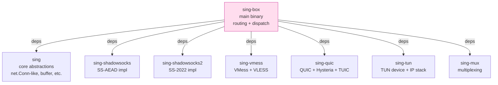
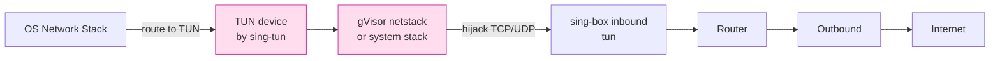
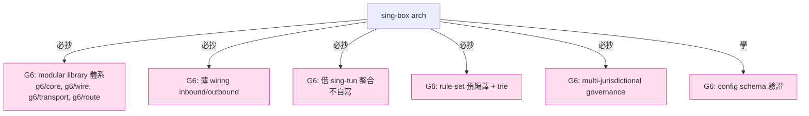

# 課堂 7.15 — sing-box 原始碼總覽：模組化的下一代

## 學前知道
- 前置課：[7.14 Xray-core 源碼總覽](./7.14-xray-source-overview.md)
- 預計閱讀時間：**50 分鐘**
- 必讀原始碼：
  - **sing-box** repo：`github.com/SagerNet/sing-box`
  - **sing** library：`github.com/sagernet/sing`（共用 abstractions）
  - **sing-shadowsocks2**, **sing-shadowsocks**, **sing-vmess**, **sing-quic**, **sing-tun**——分散式 module
- 必讀文件：
  - **sing-box documentation**：`sing-box.sagernet.org`
  - **sing-box configuration reference**

## 動機

sing-box 是 **2022 年由 @nekohasekai（中國開發者，後流亡）發起的「**xray-core 重寫**」**。設計動機一句話：

> **「xray-core 太 monolithic、配置太繁雜、protocol 與 transport 耦合過緊。sing-box 用 sing/* library 把每個 protocol 拆成獨立 Go module，**core 只做 wiring**。」**

對協議學習者，sing-box 的價值：

1. **更乾淨的 architecture**——每個 protocol（SS、VMess、VLESS、Trojan、Hysteria、TUIC）是獨立 Go module，可單獨用。
2. **更現代的 Go 風格**——大量用 generic、context、interface composition。
3. **第一個 production 級 multi-protocol 統一 client**——同時支援 V2Ray 系（VLESS/VMess）+ SS 系（SS-2022/Hysteria/TUIC）+ WireGuard + ssh + ...。
4. **官方 GUI/mobile client**：sing-box-for-android、SFM (sing-box for macOS)、SFI (iOS)。

對比 xray-core：

| 維度 | xray-core | sing-box |
|---|---|---|
| 架構 | monolithic | modular (sing-* libraries) |
| 啟動配置 | JSON, 巨大 | JSON / proto, 簡潔 |
| Protocol 支援 | V2Ray 系 + REALITY/Vision | 兩系全 + Hysteria + TUIC + WireGuard + ssh |
| Routing engine | linear scan | 部分 trie 優化 |
| TUN mode | 外掛 | 內建（sing-tun） |
| 跨平台 client | Hiddify 等第三方 | 官方 mobile + desktop |
| Code quality | OK | 較高（generic, ctx）|
| 主導 | @RPRX | @nekohasekai |

讀完應該回答：
- sing-* library 體系是什麼？怎麼區分 sing-box main repo 與 sing-{ss,vmess,quic} 等？
- sing-box 的 inbound/outbound 與 xray 的差異？
- TUN mode (sing-tun) 怎麼整合到 sing-box？
- Routing engine 比 xray 強在哪？
- 為什麼 sing-box 是「**G6 reference impl 的更好起點**」？

---

## 核心概念

### 1. sing-* library 體系



**設計哲學**：

- 每個 protocol 是獨立 Go module，**可在 sing-box 之外獨立使用**。
- `sing` library 提供 protocol-agnostic abstractions（buffer pool、metadata、connection wrapping）。
- sing-box main 只做 **wiring** —— config parse、router、inbound/outbound lifecycle。

**對比 xray-core**：xray 所有 protocol 在 single repo 的 `proxy/` 目錄下——耦合更緊。

### 2. sing-box top-level layout

```
sing-box/
├── cmd/                       # CLI entries
│   └── sing-box/main.go
├── adapter/                   # Manager interfaces
│   ├── inbound.go
│   ├── outbound.go
│   ├── router.go
│   └── ...
├── inbound/                   # Inbound implementations
│   ├── shadowsocks.go         # → 對接 sing-shadowsocks/2
│   ├── vless.go               # → 對接 sing-vmess
│   ├── trojan.go              # → 對接 sing-trojan
│   ├── hysteria.go            # → 對接 sing-quic
│   ├── tuic.go                # → 對接 sing-quic
│   ├── tun.go                 # → 對接 sing-tun
│   └── ...
├── outbound/                  # Outbound implementations
│   └── (與 inbound 對應)
├── route/                     # Routing engine
│   ├── router.go
│   ├── rule_default.go
│   ├── rule_set.go            # Rule-set: 預編譯 rule 集
│   └── ...
├── transport/                 # Transport layer
│   ├── tls/
│   ├── reality/               # ← 借 xray 的 REALITY impl
│   ├── v2rayhttp/             # H2 / HTTPUpgrade / SplitHTTP
│   ├── v2raygrpc/
│   └── ...
├── protocol/                  # Protocol-specific helpers
└── option/                    # Config struct definitions
```

### 3. sing-box inbound/outbound 與 xray 對比

**xray-core inbound 模式**：

```go
// proxy/vless/inbound/inbound.go
type Handler struct { ... }
func (h *Handler) Process(ctx, network, conn, dispatcher) error {
    // 解 wire format、auth、dispatch
}
```

**sing-box inbound 模式**：

```go
// inbound/vless.go
type VLESS struct {
    myInboundAdapter
    service *vless.Service[int]   // ← 來自 sing-vmess library
    users   []option.VLESSUser
}

func (h *VLESS) NewConnection(ctx context.Context, conn net.Conn, metadata adapter.InboundContext) error {
    return h.service.NewConnection(ctx, conn, metadata)   // ← delegate 到 sing-vmess
}

func (h *VLESS) NewPacketConnection(ctx context.Context, conn N.PacketConn, metadata adapter.InboundContext) error {
    return h.service.NewPacketConnection(ctx, conn, metadata)
}
```

**差別**：

- sing-box 的 inbound handler **薄到只剩 wiring**——真正的 protocol logic 在 `sing-vmess` library 的 `vless.Service`。
- xray 的 handler **直接做 wire format parsing + dispatch**——耦合在一起。

**對 G6**：sing-box 模式更好——**protocol 邏輯獨立 module，可測試、可重用、可獨立 ship**。

### 4. TUN mode（sing-tun）



**TUN mode 是**：「**OS 把所有流量送到 sing-box，sing-box 做 proxy 決定**」——比 SOCKS5/HTTP CONNECT 更透明（**不需 application 配置 proxy**）。

**sing-tun 的兩個 stack 模式**：

- **System mode**：用 OS 自帶 NAT（macOS pfctl、Linux iptables）—— performance 高，依賴 OS。
- **gVisor mode**：用 Google gVisor user-space netstack —— 跨平台，cost CPU。

**重要性**：TUN mode 是 **2024+ mobile / desktop client 標配**。Clash Verge Rev、sing-box-for-android 都基於此。

**對 G6**：TUN mode 不是 protocol layer 的事，但 **G6 client SDK 必須支援**—— 否則 mobile/desktop 無法整合。直接用 sing-tun 是務實選擇。

### 5. Routing engine（route/）

sing-box routing 比 xray 改進的點：

#### Rule-set 預編譯

```yaml
{
  "route": {
    "rules": [
      { "rule_set": "geoip-cn", "outbound": "direct" },
      { "rule_set": "geosite-cn", "outbound": "direct" }
    ],
    "rule_set": [
      {
        "type": "remote",
        "tag": "geoip-cn",
        "format": "binary",
        "url": "https://github.com/SagerNet/sing-geoip/raw/rule-set/geoip-cn.srs"
      }
    ]
  }
}
```

**Rule-set 是預先 compile 的 binary file**（`.srs` 格式）：

- 內部 trie / hash table 結構。
- O(log n) lookup（vs xray O(n) linear scan）。
- 可遠端 fetch + 自動更新。

**性能差異**：對 100k+ rule，sing-box rule-set lookup ~1µs，xray linear scan ~ms 級。

#### Rule 組合更強

- `domain_keyword`、`domain_suffix`、`domain_regex`、`process_name`、`package_name` (Android)、`network_type`（cellular/wifi）等多維 condition。
- **Logical operator**：`{"or": [...]}`、`{"not": ...}`。

**對 G6**：routing 直接整合 sing-box（或抄其架構）。**自寫 routing engine 是浪費精力**。

### 6. Hysteria / TUIC 整合（sing-quic）

sing-box 是**第一個 production proxy 同時 first-class 支援 V2Ray 系與 QUIC 系**。

```go
// sing-quic 結構
package hysteria
type Service struct { ... }
type Client struct { ... }

package tuic
type Service struct { ... }
type Client struct { ... }

// 共用底層
package quic_internal
// quic-go wrapper, congestion control hooks
```

**sing-quic 的特殊處理**：

- **QUIC connection migration**——對 NAT rebinding 友好。
- **Congestion control plugin**——Hysteria 用 Brutal CC，TUIC 用 BBR。
- **0-RTT support**——QUIC 與 inner protocol 都 0-RTT。

Part 8 詳講 Hysteria / TUIC 內部。

### 7. v2ray-rules-dat 兼容

sing-box 對舊 v2ray geoip / geosite 配置（`geoip.dat`、`geosite.dat`）有 backward compat 解析——**user 從 v2ray/xray 遷移無痛**。

**轉換工具**：`sing-box compile-rule-set` 把 v2ray dat 轉 sing-box srs format。**規則更新依然來自 v2ray-rules-dat / Loyalsoldier 社群維護的源**。

### 8. 配置格式：JSON 與 proto 雙軌

sing-box 主要用 **JSON config**（與 xray 風格相似），但：

- 內部所有 struct 用 protobuf 定義（`option/`）—— 可生成 schema 與 validation。
- 支援 **schema validation**：`sing-box check -c config.json`。
- 支援 **environment variable substitution**。

**對 G6**：直接抄 sing-box config 結構——**user 從 xray/sing-box 遷移成本低**。

### 9. Cross-platform GUI clients

**sing-box-for-android (SFA)**、**sing-box for macOS (SFM)**、**sing-box for iOS (SFI)**——同 nekohasekai team 開發。

**架構**：mobile/desktop GUI 直接 link sing-box 為 native library（Android JNI、iOS framework）。**用戶體驗**：**非常接近商業 VPN client**——profile import、subscription、route rule UI。

**對 G6**：reference client 應同樣 cross-platform。但**自寫 mobile UI 工程量極大**——務實做法：**G6 兼容 sing-box JSON config**，user 直接用 SFA/SFI/SFM 即可。

### 10. 從 sing-box 學「**modular Go**」最佳實踐

**幾個值得抄的設計細節**：

#### `sing` library 的 buffer pool

```go
package buf
type Buffer struct { ... }
func New() *Buffer { return pool.Get().(*Buffer) }
func (b *Buffer) Release() { pool.Put(b) }
// Generic-typed multi-buffer
type MultiBuffer []*Buffer
```

#### Generic context type

```go
type InboundContext struct {
    Network         string
    Source          M.Socksaddr
    Destination     M.Socksaddr
    Domain          string
    User            string
    InboundOptions  option.InboundOptions
    // ...
}
```

**所有 inbound/outbound 共用同一 context type**——比 xray 的 routing.Context 接口更清晰。

#### Interface composition

```go
type ConnectionHandler interface {
    NewConnection(ctx context.Context, conn net.Conn, metadata adapter.InboundContext) error
}

type PacketConnectionHandler interface {
    NewPacketConnection(ctx context.Context, conn N.PacketConn, metadata adapter.InboundContext) error
}

// 大多 inbound/outbound 同時 implement 兩個
```

**TCP / UDP 接口分離**——比 xray 的「Process(ctx, network, conn, dispatcher)」one-size-fits-all 更清晰。

### 11. 從 nekohasekai 流亡看開源治理

**背景**：@nekohasekai 是 sing-box 主導者，2022-2023 年因中國國安壓力流亡海外，sing-box 從中國 GitHub 倉庫遷到 SagerNet org，部分 contributor 離開。

**對 G6 啟示**：

- **OSS project governance** 在 censorship resistance 領域是 **政治敏感問題**。
- 主導者個人風險 → project 風險。
- **多人 / 多地理 ownership** 是長期可持續的關鍵。
- **Code review 與 maintainer 多元化** 不是 nice-to-have，是 censorship resistance project 的存活前提。

**G6 spec governance 應 from day one 設計**：spec 維護不依賴單個 maintainer，**至少 3-5 個非中國 jurisdiction maintainer**。

---

## 與我們協議設計的關聯

1. **sing-* library 體系是 G6 reference impl 的更好模式**：每個 protocol 獨立 module，core 只做 wiring。
2. **TUN mode 整合**：G6 client SDK 必須支援，但**直接用 sing-tun 而非自寫**。
3. **Routing 直接抄 sing-box rule-set + trie**：自寫 routing 是浪費精力。
4. **Cross-platform client 策略**：**不自寫**，依賴 sing-box JSON config 兼容性。
5. **Modular Go 最佳實踐**：generic、context、interface composition——G6 reference impl 直接抄此風格。
6. **Project governance multi-jurisdictional**：學 sing-box 流亡教訓，from day one 設計。
7. **Spec versioning**：sing-box 有清楚的 version policy，G6 必抄。

---

## 動手

實驗 A（30 min）：**起一個 sing-box server 並讀其啟動 path**

```bash
go install github.com/sagernet/sing-box/cmd/sing-box@latest

cat > config.json <<'EOF'
{
  "log": { "level": "info" },
  "inbounds": [{
    "type": "vless",
    "tag": "vless-in",
    "listen": "0.0.0.0",
    "listen_port": 443,
    "users": [{ "uuid": "...", "flow": "xtls-rprx-vision" }],
    "tls": {
      "enabled": true,
      "server_name": "dl.google.com",
      "reality": {
        "enabled": true,
        "handshake": { "server": "dl.google.com", "server_port": 443 },
        "private_key": "...",
        "short_id": [""]
      }
    }
  }],
  "outbounds": [{ "type": "direct", "tag": "direct" }]
}
EOF

sing-box run -c config.json
```

讀 `cmd/sing-box/main.go` → `option/config.go` → `box.go` 的啟動 chain。

實驗 B（45 min）：**對比 sing-box 與 xray VLESS inbound 程式碼**

```bash
# xray
diff -u <(cat Xray-core/proxy/vless/inbound/inbound.go) \
        <(cat sing-box/inbound/vless.go)
```

統計：
- 兩個 file 的 LoC 差異。
- abstraction 數量。
- 對 sing-vmess library 的依賴 vs xray 的 self-contained 程度。

實驗 C（30 min）：**用 sing-box compile-rule-set 把 v2ray dat 轉 srs**

```bash
# Download v2ray geoip.dat
curl -L https://github.com/v2fly/geoip/releases/latest/download/geoip.dat -o geoip.dat

# Compile to srs
sing-box rule-set compile --output cn.srs <(echo '{"version": 1, "rules": [{"ip_cidr": ["from-geoip:cn"]}]}')

# 用 sing-box benchmark routing performance
```

對比 lookup time。

---

## 自我檢查

1. sing-* library 體系比 xray monolithic 設計的好處？什麼時候 monolithic 反而更好？
2. sing-box 的 inbound 「**薄 wiring**」設計把 protocol logic 推到 sing-vmess 等 library——這對 testability 與 reusability 的影響？
3. sing-tun 的 system mode vs gVisor mode trade-off？什麼場景該選哪個？
4. Rule-set 預編譯 vs xray linear scan rules——對 100k rules 的 lookup time 差距是多少數量級？
5. 為什麼說 sing-box 是「**G6 reference impl 的更好起點**」？至少給 3 個技術理由。
6. nekohasekai 流亡事件對 OSS project governance 的教訓——G6 該如何 from day one 設計避免單點風險？

---

## 延伸閱讀

- **sing-box documentation**：sing-box.sagernet.org
- **SagerNet** GitHub org（所有 sing-* repos）
- Part 7.14 Xray-core 源碼總覽（架構對比）
- Part 7.16 mihomo 源碼總覽

---

## 研究級補遺

### 1. 學界詞彙

| 口語 | 學術術語 | 出處 |
|---|---|---|
| 「modular library」 | composable software architecture | (general SE) |
| 「TUN mode」 | network-layer interception | (general networking) |
| 「rule-set 預編譯」 | rule precompilation / FIB lookup | (router design) |
| 「project governance」 | open source governance / multi-jurisdictional maintenance | (OSS literature) |

### 2. 對手分類學

對 sing-box（作為 software）的攻擊面：

| 攻擊向量 | 影響 |
|---|---|
| Maintainer compromise | 高（少數人依賴）|
| Supply chain attack on sing-* | 高（多 module 依賴鏈） |
| Config injection | 中 |
| Protocol parser bug | 中（多 protocol 表面）|
| TUN mode privilege escalation | 高（需 root）|

### 3. 形式化定義

**Modular vs monolithic 的可組合性**：

設 protocol 集合 $\mathcal{P}$，sing-box 對每個 $p \in \mathcal{P}$ 提供獨立 service $S_p$。Composition：

$$
\text{sing-box} = \text{Wiring}(R, \{I_p, O_p : p \in \mathcal{P}\})
$$

其中 $R$ 是 router，$I_p$ 是 inbound for $p$，$O_p$ 是 outbound for $p$。

**Wiring 是 N+1 個關係**（N protocol + 1 router）—— 線性 vs 原本 monolithic 的 quadratic（每個 protocol pair 之間都可能耦合）。

**對 maintenance**：modular 設計的 maintenance cost 隨 protocol 數量線性增長，monolithic 隨 quadratic。**這就是 sing-box 容易加新 protocol 的根本原因**。

### 4. 領域的關鍵論文 / 規格 / 原始碼

- **sing-box documentation**
- **SagerNet** GitHub
- **gVisor** （sing-tun 的 user-space stack）
- **quic-go** （sing-quic 的底層）
- **Squid** 與 **Envoy** —— 對比 production proxy architecture

### 5. 我們協議的座標 / 設計取捨



### 6. 必追資源 / 社群入口

- **SagerNet** GitHub org
- **sing-box** Telegram 群（中文社群活躍）
- **nekohasekai** 個人 GitHub

### 7. 開放問題

1. **Modular library 的 cross-version compat**：當 sing-vmess 升級 API，sing-box 與其他 dependents 怎麼同步？目前用 Go module + semver，但實際 API churn 不小。
2. **sing-box 的 plugin model**：是否該開 plugin SDK 讓第三方加 protocol 而不需修 sing-box main？目前無 plugin 機制。
3. **TUN mode + IPv6 完整支援**：sing-tun 的 IPv6 routing 在某些 OS（macOS）仍有 bug。
4. **多 project 整合**：sing-box、xray-core、mihomo 共用部分模組（utls、quic-go）但 routing rule format 各異。能否設計**統一 rule format spec** 讓三者互通？
