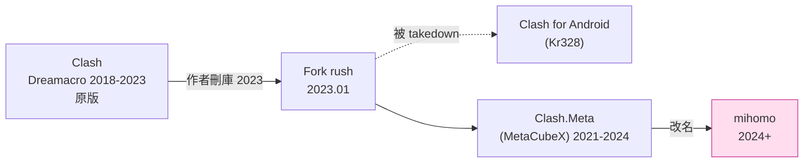
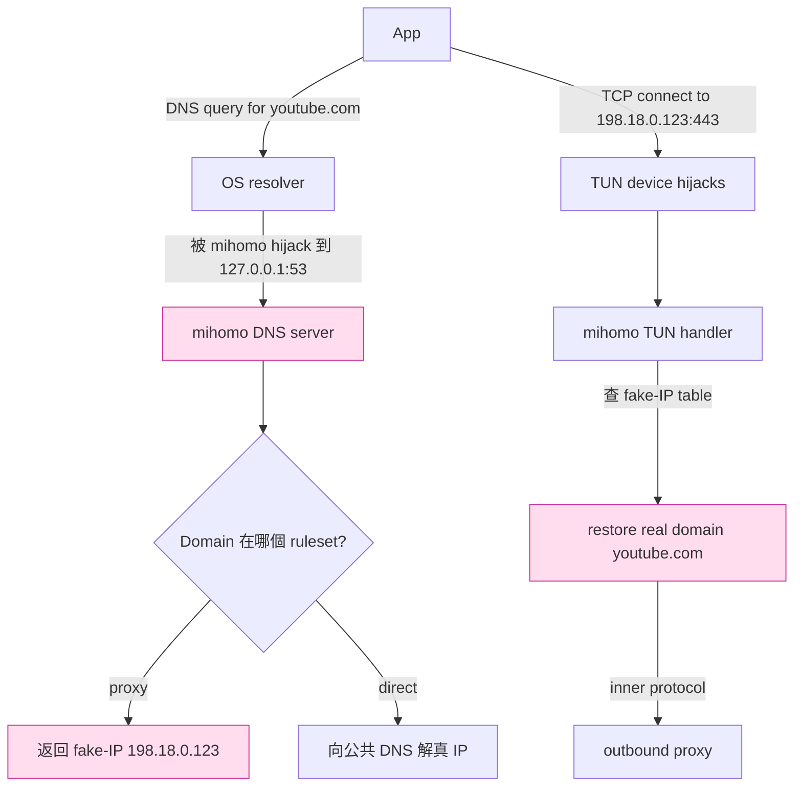
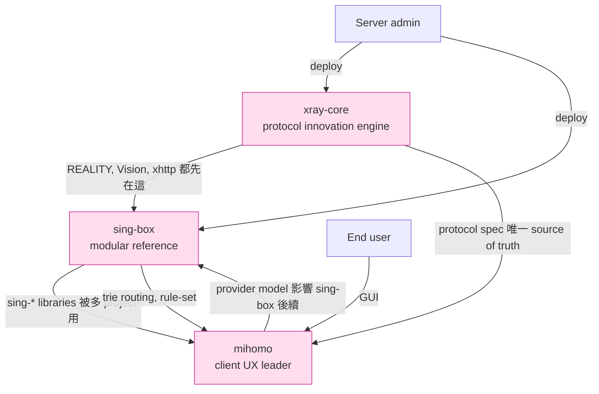
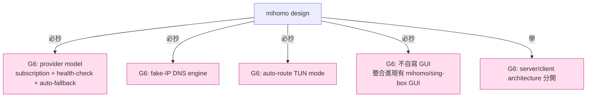
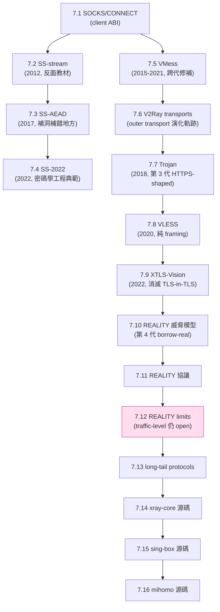

# 課堂 7.16 — mihomo (Clash.Meta) 原始碼總覽：rule engine 之王

## 學前知道
- 前置課：
  - [7.14 Xray-core 源碼總覽](./7.14-xray-source-overview.md)
  - [7.15 sing-box 源碼總覽](./7.15-singbox-source-overview.md)
- 預計閱讀時間：**45 分鐘**
- 必讀原始碼：
  - **mihomo** repo：`github.com/MetaCubeX/mihomo`（前身：`Dreamacro/clash` → `MetaCubeX/Clash.Meta`）
  - **mihomo** core packages（後文逐個）
- 必讀文件：
  - **wiki.metacubex.one** —— mihomo 中文文檔
  - **mihomo configuration reference**

## 動機

mihomo（**前 Clash.Meta，2024 改名**）是中文圈最廣泛使用的 **client-side proxy aggregator**：

- **Clash for Windows / ClashX / Clash Verge Rev / FlClash 等 GUI 都基於 mihomo（或舊 Dreamacro/clash）**。
- 與 xray/sing-box 的差異：**mihomo 主場是 client，server-side 弱**。
- **特色**：**規則 engine 是業界最強**——多維度匹配、graphic UI 友好、provider model 成熟。

對協議學習者：

1. **client-side 架構**：理解 user-facing proxy 與 server-side 的設計差異。
2. **Rule provider 模式**：規則動態 fetch + hot reload 的工程實踐。
3. **DNS hijack 與 fake-IP**：client-side proxy 對 DNS 的處理是獨立大話題。
4. **TUN mode 工程**：mihomo TUN mode 是 Clash Verge Rev 的核心 enabler。

對比三者：

| 維度 | xray-core | sing-box | mihomo |
|---|---|---|---|
| 主要場景 | server + client | server + client | **client only**（強）|
| Protocol 創新 | 主導（REALITY、Vision） | 跟進 + 整合 | 跟進 |
| Routing engine | linear scan | rule-set + trie | **多 provider + 多維 matcher** |
| DNS engine | 簡單 | 強 | **業界最強**（fake-IP, hosts, nameserver-policy）|
| TUN mode | 弱 | 強（sing-tun） | **強**（gVisor + system mode）|
| GUI ecosystem | 第三方 | 官方 SFA/SFM/SFI | **大量 GUI 基於它**（Clash Verge Rev, FlClash, Karing） |
| 社群 | XTLS 圈 | SagerNet 圈 | **中文圈最大** |

讀完應該回答：
- mihomo 的 rule provider 模式與 sing-box 的 rule-set 差異？
- DNS hijack + fake-IP 是什麼？怎麼運作？
- mihomo 的 inbound listeners 如何整合 TUN/redir/SOCKS/HTTP？
- 為什麼 mihomo 是 client 主場、server 弱？
- 三者（xray/sing-box/mihomo）共生關係如何？

---

## 核心概念

### 1. 歷史脈絡：Clash → Clash.Meta → mihomo



**事件**：

- **2023-11 Dreamacro 刪 Clash 主倉庫**——傳言因法律壓力。
- 社群多個 fork 出現：Mihomo 是其中之一，由 MetaCubeX team 主導。
- 2024 改名 mihomo（避開原 Clash 商標）。

**對 G6 啟示**：與 sing-box 一樣，**single-maintainer OSS 在敏感領域是高風險**。**Multi-maintainer + multi-jurisdiction** 是必選。

### 2. 整體架構

```mermaid
flowchart TD
    User[OS / Apps] -->|多種 inbound| In[Inbound listeners]
    In --> Listeners
    Listeners --> SOCKS[SOCKS5/HTTP]
    Listeners --> Mixed[Mixed (auto-detect)]
    Listeners --> Redir[Linux redir/tproxy]
    Listeners --> Tun[TUN device]

    SOCKS & Mixed & Redir & Tun --> Adapters
    Adapters[Inbound adapters] --> RuleEngine[Rule Engine<br/>+ DNS Engine]
    RuleEngine --> Outbound[Outbound proxy adapter]
    Outbound --> Proto[Protocol layer<br/>SS/VLESS/Trojan/Hysteria/...]
    Proto --> Net[Internet]

    classDef ours fill:#fde,stroke:#c39
    class RuleEngine,Outbound ours
```

### 3. Top-level package layout

```
mihomo/
├── adapter/                   # Outbound proxy adapters
│   ├── outbound/
│   │   ├── shadowsocks.go
│   │   ├── vless.go
│   │   ├── trojan.go
│   │   ├── hysteria2.go
│   │   ├── tuic.go
│   │   ├── wireguard.go
│   │   └── ...
│   ├── inbound/
│   │   ├── socks.go
│   │   ├── http.go
│   │   ├── mixed.go
│   │   ├── redir.go
│   │   ├── tproxy.go
│   │   └── ...
│   └── provider/             # ★ Proxy provider (URL subscription)
├── component/                 # Subsystems
│   ├── dns/                  # ★ DNS engine
│   ├── fakeip/               # ★ fake-IP allocator
│   ├── geoip/
│   ├── geosite/
│   ├── trie/                 # Domain trie
│   ├── nat/
│   ├── resolver/
│   └── ...
├── config/                    # Config parsing (YAML)
├── constant/                  # Enums + constants
├── dns/                       # DNS server (for fake-IP)
├── hub/                       # API server (for GUI)
│   └── route/
├── listener/                  # ★ Inbound listener implementations
├── proxy/                     # Common proxy abstractions
├── rules/                     # ★ Rule matching
│   ├── common/               # DOMAIN, IP-CIDR, etc.
│   ├── logic/                # AND, OR, NOT
│   ├── provider/             # rule-set (similar to sing-box)
│   └── ...
├── transport/                 # Transport (TLS, ws, grpc, ...)
└── tunnel/                    # ★ Main dispatch loop
    ├── tunnel.go
    └── statistic/
```

**核心 module 翻譯**：

- `adapter/outbound/`：outbound proxy（SS/VLESS/Trojan/...）
- `adapter/provider/`：**proxy provider** —— 從 URL subscribe 多個 proxy（**這是 mihomo 的特色**）
- `tunnel/`：主 dispatch 循環（連接 inbound 與 outbound）
- `rules/`：規則 engine
- `component/dns/` + `component/fakeip/`：DNS hijack & fake-IP
- `listener/`：inbound listeners

### 4. Rule provider 模式

mihomo 的 routing rule 可從 **遠端 URL fetch** 並 hot reload：

```yaml
# config.yaml
rule-providers:
  reject:
    type: http
    behavior: domain
    url: "https://example.com/clash/rules/reject.txt"
    path: ./ruleset/reject.yaml
    interval: 86400
  
  apple:
    type: http
    behavior: classical
    url: "https://example.com/clash/rules/apple.txt"
    path: ./ruleset/apple.yaml
    interval: 86400

rules:
  - RULE-SET,reject,REJECT
  - RULE-SET,apple,DIRECT
  - GEOIP,CN,DIRECT
  - MATCH,Proxy
```

**Rule provider 的 3 種 behavior**：

- `domain`：純 domain list（matched as suffix）。
- `ipcidr`：IP CIDR list。
- `classical`：完整 Clash rule format（每行一條）。

**3 種 type**：

- `http`：遠端 fetch。
- `file`：本地檔。
- `inline`：YAML 內嵌。

**動態更新**：rule provider 每 N 秒（`interval`）自動 fetch——**user 改規則只需更新 server 上的 list**，不需 reload mihomo。

**對比 sing-box rule-set**：

- mihomo rule-provider 是 **text format**（domain list、CIDR list）—— easy to write。
- sing-box rule-set 是 **binary `.srs`** —— 需 compile 但 lookup 更快。
- **trade-off**：易用性 vs 性能。對大型部署 sing-box 勝；對中小 user mihomo 勝。

### 5. DNS engine + fake-IP

**問題**：app 發 DNS 請求 `www.youtube.com` → OS resolver 發到 8.8.8.8 → **GFW 攔截 DNS 回 fake answer**。即使 proxy 配對了，**user app 已被 DNS 污染**。

**解法**：proxy client（mihomo）**hijack 所有 DNS 請求**，自己決定怎麼解。



**Fake-IP 範圍**：mihomo 預設用 `198.18.0.0/15`（IETF 保留 benchmarking range）—— 不會與真實網路衝突。

**好處**：

- **DNS 污染失效**：mihomo 用自己的 nameserver-policy 解 DNS（可走加密 DNS：DoH/DoT/DoQ）。
- **App 不需要配 proxy**：透過 TUN + fake-IP，**所有 app 自動走 mihomo**。
- **規則匹配按 domain 而非 IP**：fake-IP 表記錄 IP → real domain，rule engine 看 domain 匹配（`DOMAIN-SUFFIX,youtube.com,Proxy`）。

**問題**：

- **fake-IP cache 過期**：domain → fake-IP 對應有 TTL（預設 1 hour），過期後同 domain 拿到不同 fake-IP——**對某些 caching app 是 bug**。
- **某些 app bypass DNS**（直接連 IP）—— rule 必須有 IP-CIDR 規則 fallback。
- **應用層 DNS（DoH inside browser）—— 不走 OS resolver，mihomo 看不見**。Chrome 的 DoH 是常見 issue。

**對 G6**：DNS 處理是 client-side 大話題——**G6 client 必須**處理 DNS hijack + fake-IP，**直接用 mihomo 設計或借鑑**。

### 6. TUN mode

mihomo 的 TUN mode 與 sing-tun 類似——支援 system 與 gVisor 兩個 stack。

**配置**：

```yaml
tun:
  enable: true
  stack: system            # or "gvisor", "mixed"
  device: utun7
  auto-route: true         # 自動加 OS routing rules
  auto-detect-interface: true
  dns-hijack:
    - any:53               # 把所有 DNS 流量導入 mihomo DNS
```

**`auto-route`** 是 mihomo 的工程典範：

- macOS：自動 `route add 0.0.0.0/1 -interface utun7` + `route add 128.0.0.0/1 -interface utun7`（split 0.0.0.0/0 規避 OS routing 衝突）。
- Linux：自動加 `ip rule` + `ip route table 100`。
- Windows：自動 `netsh interface ipv4 add route ...`。

**user 配 enable: true，OS routing 自動就緒**——比 sing-tun 還更 zero-config。

### 7. Provider model：proxy + rule + proxy-group

mihomo 的 **provider 不只是 rule**，還包括 proxy 與 proxy-group：

```yaml
proxy-providers:
  my-vpn-list:
    type: http
    url: "https://my-subscription.com/sub.yaml"
    path: ./providers/my-vpn-list.yaml
    interval: 3600
    health-check:
      enable: true
      interval: 600
      url: "https://www.gstatic.com/generate_204"

proxy-groups:
  - name: "auto"
    type: url-test
    use: ["my-vpn-list"]
    url: "https://www.gstatic.com/generate_204"
    interval: 300
  - name: "fallback"
    type: fallback
    use: ["my-vpn-list"]
    url: "https://www.gstatic.com/generate_204"
    interval: 300

rules:
  - DOMAIN-SUFFIX,youtube.com,auto
  - GEOIP,CN,DIRECT
  - MATCH,fallback
```

**Proxy group types**：

- `select`：手動選擇（GUI user 切換）
- `url-test`：自動選最低延遲
- `fallback`：按順序，第一個壞了用第二個
- `load-balance`：流量分散
- `relay`：proxy chain（A → B → target）

**`use:` 引用 proxy provider**：把 subscription 內的 N 個 server 全部納入該 group。

**對 G6 client SDK**：必須整合此 model——subscription、health-check、auto-fallback 是 user UX 核心。**不要重新發明**。

### 8. Mihomo dispatch loop（tunnel/）

```go
// tunnel/tunnel.go (簡化)
func processTCP(c net.Conn, metadata *C.Metadata) {
    // (1) Resolve domain (從 fake-IP 還原真實 domain)
    if metadata.DstIP.IsValid() && resolver.IsFakeIP(metadata.DstIP) {
        if host, exist := resolver.FindHostByIP(metadata.DstIP); exist {
            metadata.Host = host
            metadata.DNSMode = C.DNSFakeIP
        }
    }

    // (2) Match rules
    proxy := matchRule(metadata)

    // (3) Dial via proxy
    remote, err := proxy.DialContext(ctx, metadata)
    if err != nil { return }

    // (4) Bidirectional copy
    handleConn(c, remote)
}
```

**比 xray 更直觀**——dispatch loop 一個 function 就看完。

### 9. mihomo 為什麼 client 強、server 弱

**Client side** mihomo 強的原因：
- Rule engine 多維度（DOMAIN、IP-CIDR、PORT、PROCESS、NETWORK、USER-AGENT、…）。
- Provider model（rule + proxy + group）。
- DNS engine（fake-IP、nameserver-policy、DoH/DoT/DoQ）。
- TUN mode + auto-route 工程成熟。
- GUI ecosystem 大（Clash Verge Rev、FlClash、Karing）。

**Server side** 弱的原因：
- **mihomo 起源**就是 「client」 —— inbound 用於本地 socks/http/redir，**不設計成 internet-facing server**。
- Protocol 創新跟進不領先：REALITY/Vision 等都從 xray 移植。
- **沒有 production-grade server-only 配置文檔**——社群部署 server 多用 sing-box。

**對 G6**：reference impl 應同時 cover **server + client**，但**架構分開**（兩個 binary 或同 binary 兩個模式）。client 模式直接抄 mihomo 設計。

### 10. 三者共生關係



**三者形成 healthy ecosystem**：

- xray 主導 protocol 創新（REALITY、Vision、SplitHTTP）。
- sing-box 提供 modular library + sing-* 體系（多 project 共用）。
- mihomo 主導 client UX 與 rule engine。

**對 G6**：**不要嘗試取代任何一個**。G6 的 reference impl 應**整合進 sing-box 與 mihomo**——成為他們的一個 protocol option，而非 yet another proxy。**這是 protocol adoption 最快路徑**。

---

## 與我們協議設計的關聯

1. **G6 client 直接用 mihomo / sing-box / Clash Verge Rev** ——不要寫自己的 GUI client。
2. **G6 protocol spec 必須優先實作為 sing-* library 的 module**——這樣三大 ecosystem（xray, sing-box, mihomo）都能輕鬆採納。
3. **DNS hijack + fake-IP** 是 client-side proxy 的標配——G6 client SDK 不能跳過。直接用 mihomo 設計。
4. **TUN mode + auto-route** 是現代 user UX 的核心——直接用 sing-tun（mihomo 內部也用 gVisor）。
5. **Provider model**（subscription + auto-fallback）是 user 體驗核心——G6 SDK 必須支援。
6. **三者共生 ecosystem**：G6 應**設計成可整合**而非「**獨立 ecosystem**」——降低 adoption 摩擦。
7. **Client UX 與 server architecture 分開設計**：mihomo client、sing-box server、xray protocol——G6 也應分層。

---

## 動手

實驗 A（30 min）：**起 mihomo 並體驗 fake-IP + TUN mode**

```bash
brew install mihomo

# 建配置
cat > config.yaml <<'EOF'
mixed-port: 7890
allow-lan: true
mode: rule
log-level: info

dns:
  enable: true
  enhanced-mode: fake-ip
  fake-ip-range: 198.18.0.0/16
  nameserver:
    - https://dns.cloudflare.com/dns-query
    - https://dns.google/dns-query

tun:
  enable: true
  stack: system
  auto-route: true
  dns-hijack: ['any:53']

proxies:
  - { name: "vps", type: vless, server: vps.example.com, port: 443, uuid: "...", flow: xtls-rprx-vision, network: tcp, tls: true, reality-opts: { public-key: "...", short-id: "" }, servername: "dl.google.com" }

proxy-groups:
  - { name: "Proxy", type: select, proxies: [vps, DIRECT] }

rules:
  - GEOIP,CN,DIRECT
  - MATCH,Proxy
EOF

sudo mihomo -d .
```

啟動後 `dig youtube.com @127.0.0.1` 應該回 fake-IP。

實驗 B（30 min）：**讀 mihomo dispatch loop 並對比 xray/sing-box**

```bash
# 三個 file 對比
mihomo/tunnel/tunnel.go         # mihomo dispatch
sing-box/route/router.go        # sing-box dispatch
Xray-core/app/dispatcher/default.go  # xray dispatch
```

LoC 對比 + 主要 abstraction 數量 + 程式碼可讀性。

實驗 C（45 min）：**寫一個 mihomo provider plugin**

mihomo 的 rule-provider 是文字檔——寫一個動態生成 provider 的 Python script：

```python
# 從 GitHub raw 拉 v2ray-rules-dat → 轉 mihomo provider format
import requests
r = requests.get("https://raw.githubusercontent.com/.../proxy.txt").text
# Parse v2ray rules → output as mihomo classical format
print("payload:")
for line in r.splitlines():
    if line.startswith("DOMAIN-SUFFIX,"):
        domain = line.split(",")[1]
        print(f"  - DOMAIN-SUFFIX,{domain}")
```

讓 mihomo 從 `path: ./my-rules.yaml` 載入。

---

## 自我檢查

1. mihomo rule-provider vs sing-box rule-set——trade-off 是什麼？什麼場景該選哪個？
2. fake-IP 機制的 4 種失效情境（過期、bypass DNS、應用層 DoH、IP-direct app）——分別怎麼 mitigate？
3. mihomo 為什麼 client 強、server 弱？這個 split 的 architecture 影響？
4. 三者共生 ecosystem 中，xray 提供 protocol 創新、sing-box 提供 library、mihomo 提供 client UX——這個 specialization 對 G6 的 adoption strategy 有何啟示？
5. mihomo `auto-route` 的 OS-specific 邏輯有何工程特色？為什麼說「比 sing-tun 還 zero-config」？
6. Provider model 的 `health-check` + `auto-fallback`——對 user UX 提升的具體機制？

---

## 延伸閱讀

- **mihomo wiki**：wiki.metacubex.one
- **MetaCubeX** GitHub org
- **Clash Verge Rev** repo（基於 mihomo 的 desktop GUI）
- **FlClash** repo（基於 mihomo 的 cross-platform GUI）
- Part 7.14 Xray-core 源碼總覽
- Part 7.15 sing-box 源碼總覽

---

## 研究級補遺

### 1. 學界詞彙

| 口語 | 學術術語 | 出處 |
|---|---|---|
| 「fake-IP」 | DNS-NAT (RFC 6147 NAT64 變體) | Clash 自創 term |
| 「rule provider」 | dynamic policy distribution | (general SDN concept) |
| 「proxy group」 | cluster / pool / load balancer | (general LB concept) |
| 「auto-route」 | policy-based routing automation | (informal) |

### 2. 對手分類學

對 mihomo（作為 client）的攻擊面：

| 攻擊向量 | 影響 |
|---|---|
| Subscription URL hijack | 高（中間人替換 proxy list） |
| Rule provider URL hijack | 中（替換 rules 把 proxy 流量導到攻擊者） |
| Local TUN privilege escalation | 高（root 權限） |
| Config injection（YAML parser bug） | 中 |
| DNS poisoning before mihomo hijack | 中（OS-level resolver bug） |

### 3. 形式化定義

**Fake-IP 的 invariant**：

設 fake-IP allocator $\mathcal{F}: \text{Domain} \to \text{IP}$，TTL window $T$，real domain → fake-IP table $\mathcal{T}$。則：

- **Injectivity in window**：對 $t < t' < t + T$，$\mathcal{F}(d_1, t) = \mathcal{F}(d_2, t')$ 蘊含 $d_1 = d_2$（**沒有 collision**）。
- **Memory bound**：$|\mathcal{T}| \leq |\text{198.18.0.0/15}| = 2^{17}$（128k 同時可有效 fake-IP）。
- **TTL eviction**：超過 $T$ 的 entry 自動被覆蓋。

**Mihomo 預設 T = 1 hour**——對 128k unique domain / hour，**夠用**。

### 4. 領域的關鍵論文 / 規格 / 原始碼

- **mihomo wiki + GitHub**
- **Clash Verge Rev** GitHub
- **MetaCubeX** GitHub org
- **gVisor netstack**（user-space TCP/IP stack）
- Part 7.14 / 7.15

### 5. 我們協議的座標 / 設計取捨



### 6. 必追資源 / 社群入口

- **MetaCubeX** GitHub
- **mihomo** Telegram 群（中文圈最大 client 社群）
- **Clash Verge Rev** GitHub Issues
- **net4people/bbs**

### 7. 開放問題

1. **Rule provider 的 trust model**：subscription URL 通常是 HTTPS——但 client 不 cert pin，**MITM 攻擊面開放**。是否該強制 GPG signed rule-set？
2. **Fake-IP 與 IPv6**：當前 fake-IP 主要用 IPv4 198.18.0.0/15——IPv6 fake-IP 設計？
3. **Cross-protocol routing**：rule engine 能否根據 destination 自動選 TCP vs QUIC outbound？目前 user 必須手動配 group。
4. **Multi-process mihomo**：current mihomo 單 process——對高 throughput 場景是否需要 multi-process？
5. **Subscription 標準化**：每個 client（mihomo, sing-box, xray, Clash for Android）的 subscription format 略不同。能否統一 spec？

---

## ★ Part 7 收官總結

至此 Part 7 全 16 堂完成。回顧設計演化：



**核心結論**：

1. **Censorship resistance 經歷 4 代範式**：mimicry → fully-encrypted → HTTPS-shaped → borrow-real。**G6 的目標是第 5 代**。
2. **Wire-format 與 obfuscation 必須一體設計**：所有「inner protocol + outer transport plugin」路線最終都被識破。
3. **Handshake-level vs traffic-level 是兩個分開問題**：REALITY 解前者，後者仍是 open。
4. **Production ecosystem 是 xray + sing-box + mihomo 共生**：G6 不該獨立 ecosystem，而是整合進去。
5. **Threat model 必須先寫 spec 第一頁**：所有失敗的協議都是因為 threat model 寫晚或沒寫。
6. **Multi-jurisdictional governance 是長期可持續的關鍵**：nekohasekai 流亡與 clash 刪庫教訓。

**Part 8 銜接**：QUIC 系協議（Hysteria/TUIC）是 TCP-based 路線之外的另一條 SOTA 主線——下個 Part 主場。
