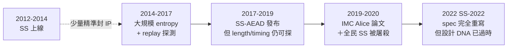
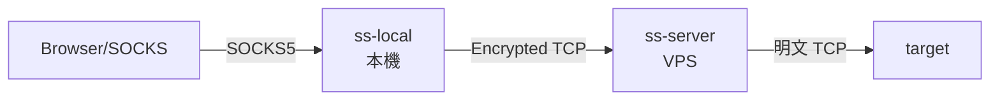
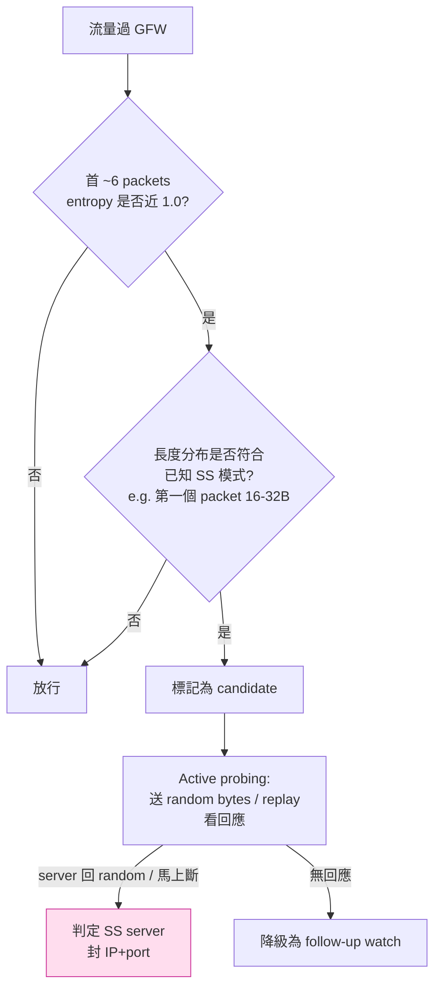
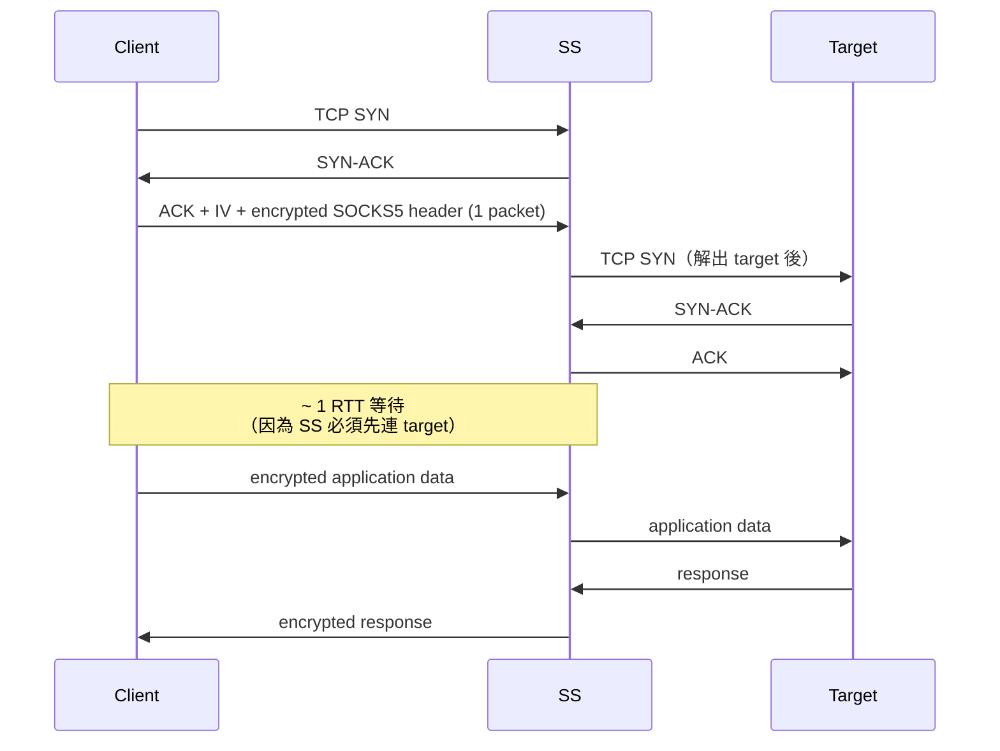
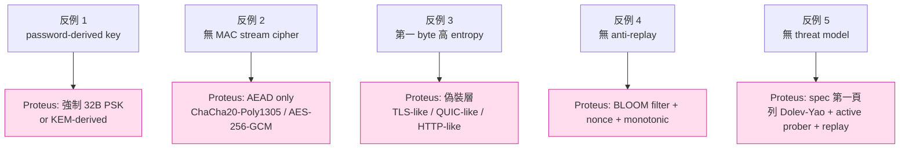

# 課堂 7.2 — Shadowsocks 第一代（2012–2017）：流加密、無認證、被打爆

## 學前知道
- 前置課：
  - [3.2 對稱加密與 AEAD](../part-3-cryptography/3.2-symmetric-aead.md)（特別是 stream cipher 與 AEAD 的差異）
  - [3.3 Hash / KDF](../part-3-cryptography/3.3-hash-functions-kdf.md)（PBKDF / EVP_BytesToKey）
  - [4.1 TLS 沿革](../part-4-tls-quic/4.1-tls-history-bloodshed.md)（理解「未認證 stream cipher」歷史教訓）
  - [7.1 SOCKS / HTTP CONNECT](./7.1-socks-http-connect.md)
- 預計閱讀時間：**45 分鐘**
- 必讀規格：
  - **Shadowsocks Original Spec**（clowwindy, GitHub Wiki, 2012-08）—— `shadowsocks/shadowsocks-org`
  - **SIP002 — URI scheme** （2016；ss://base64(method:password)@host:port）
  - **SIP003 — Pluggable Transports**（2017；後續 simple-obfs、v2ray-plugin 接口）
  - **SIP008 — Online configuration**（2020）
- 必讀論文：
  - **「Alice in Wonderland」/ Wu, Ensafi 等 — How China Detects and Blocks Shadowsocks** — IMC 2020 / GFW.report → [`notes/papers/alice-imc2020.md`](../../notes/papers/alice-imc2020.md)
  - Wang et al., *Seeing through Network-Protocol Obfuscation*, ACM CCS 2015 —— 較早的 entropy-based detection
  - Wiley, *Dust: A blocking-resistant internet transport protocol*, 2011 —— Shadowsocks 設計直系前輩
  - Houmansadr, Brubaker, Shmatikov, *The Parrot is Dead: Observing Unobservable Network Communications*, IEEE S&P 2013 —— **「為何模仿協議幾乎必敗」的奠基論文**
- 必讀原始碼：
  - **shadowsocks-libev** `src/encrypt.c`（C 實作，OpenSSL EVP）—— 流加密本體
  - **shadowsocks-python** `shadowsocks/encrypt.py`（原始 reference implementation by clowwindy, **2012-2014 commit history 是研究素材**）
  - **shadowsocks-rust** `crates/shadowsocks/src/crypto/stream.rs`（保留 stream-cipher 模式的當前活躍實作）

## 動機

Shadowsocks 是中文圈翻牆協議的真祖宗。理解第一代 SS 為什麼失敗，是理解「**為什麼裸 stream cipher 永遠死路一條**」最直接的案例。同時，SS 第一代的命運是**「設計時沒有威脅模型，後來才被論文逼著加」**的最經典範例——它的歷史教我們：協議從第一行 byte 起就要說「我在防誰」。

GFW 對 SS 的攻擊路徑（2014–2019）是學界裡少數**能精確復現**的 censorship case study：



讀完應該回答：
- SS 第一代的密鑰怎麼從 password 推出來？為什麼 EVP_BytesToKey 是密碼學罪行？
- 為什麼 RC4-MD5、AES-128-CFB、AES-192-CFB、AES-256-CFB、Salsa20、ChaCha20 全部都「能 GFW 探測到」——根本原因是什麼？
- IMC 2020 論文的 active probing 如何在 50ms 內判定一個 SS server？
- SS 的「報文格式」與「狀態機」為什麼簡單到讓 detection 變得幾何級簡單？

---

## 核心概念

### 1. SS 第一代的設計動機（2012）

clowwindy 寫 SS 的原始動機只有一句：「**HTTP/SOCKS proxy 走 OpenVPN/SSH 太慢、太顯眼，要一個輕的**。」設計目標：

- 客戶端與 server 之間 **單一加密層 + 透明 forward**。
- 不依賴 TLS（理由：當年 TLS 1.2 + RSA-AES128-CBC-SHA 在 ARM 路由器上太慢；OpenSSL 1.0.x 沒 AES-NI 支援良好）。
- **不做認證**（assumption：對手只看 entropy，不會主動探測——*這個 assumption 在 2014 後完全破產*）。

設計表面：



`ss-local` 對 application 講 SOCKS5，對 `ss-server` 講「自製加密 TCP」。`ss-server` 解密後對 target 講明文。**第一個 byte 起就是密文**——沒有握手、沒有版本協商、沒有 nonce 顯式交換。

### 2. EVP_BytesToKey — 密鑰推導罪行

SS 第一代用 OpenSSL 的 `EVP_BytesToKey` 從 password 推出加密 key（與 IV/nonce）。這個函數的設計來自 1990 年代 PKCS #5 v1.5：

```python
def evp_bytes_to_key(password: bytes, key_len: int, iv_len: int):
    md5 = lambda x: hashlib.md5(x).digest()
    m = []
    i = 0
    while sum(len(d) for d in m) < key_len + iv_len:
        if i == 0:
            d = md5(password)
        else:
            d = md5(m[i-1] + password)
        m.append(d)
        i += 1
    ms = b"".join(m)
    return ms[:key_len], ms[key_len:key_len+iv_len]
```

**罪狀**：

| 罪 | 影響 |
|---|---|
| **MD5 作為 KDF** | MD5 已知碰撞攻擊（Wang 2004），雖然 KDF 不直接受碰撞攻擊影響，但在 2012 年用 MD5 derive crypto key 已經是被學界否定的選擇 |
| **無 salt** | 兩個用同樣 password 的 SS server 推出**完全相同**的 key——rainbow-table-friendly |
| **無 iteration count** | offline brute force 速度只受 MD5 速度限制（GPU 數百 GH/s） |
| **iv_len 部分被推出**（後來改成隨機 IV） | 早期版本連 IV 都從 password 推，**所有同 password 流量 IV 完全可預測** |

正確的選擇本應是 **PBKDF2 / scrypt / Argon2**——SS 第一代沒有用任何一個。**這個錯誤一直拖到 SS-2022 才完全清算**：SS-2022 直接要求 user 提供 32-byte 隨機 PSK，不再用 password derive。

### 3. 加密模式：stream cipher（CFB / CTR / Salsa20 / ChaCha20）

SS 第一代支援的「method」清單（節錄）：

| method | cipher | mode | key | IV |
|---|---|---|---|---|
| `aes-128-cfb` | AES-128 | CFB | 16B | 16B |
| `aes-256-cfb` | AES-256 | CFB | 32B | 16B |
| `aes-128-ctr` | AES-128 | CTR | 16B | 16B |
| `aes-256-ctr` | AES-256 | CTR | 32B | 16B |
| `chacha20-ietf` | ChaCha20 | RFC 8439 stream | 32B | 12B |
| `salsa20` | Salsa20 | DJB original | 32B | 8B |
| `rc4-md5` | RC4 | (custom KDF) | 16B | 16B → MD5 → 16B RC4 key |
| `bf-cfb` | Blowfish | CFB | 16B | 8B |

**所有這些都是 stream cipher / stream-mode block cipher**——也就是 keystream XOR plaintext 的結構。**沒有任何一個帶認證**。

報文格式（極簡）：

```
+-------+--------------------------------+
|  IV   | encrypted payload (stream)     |
| n B   | variable                       |
+-------+--------------------------------+
```

Server 從第一個 byte 讀 IV，初始化 cipher，後續 byte XOR 解出明文（明文第一段是 SOCKS5-style 目標地址：ATYP+ADDR+PORT，然後是 application data）。

### 4. 三個結構性密碼學罪

#### 罪一：無 MAC（malleability）

stream cipher 的 ciphertext 翻一個 bit，明文也翻一個 bit。**對手在中間翻改 bit，server 解出來照吃，target 收到亂碼**——但**不會中斷連線**。對 censor 來說這不是破壞性問題；對研究者來說這允許了 **chosen-ciphertext active attacks**：通過翻 bit 觀察 server 行為差異判定協議。CCS 2015 的 attack 就用這個性質。

#### 罪二：明文長度 = 密文長度

stream cipher 不擴張 ciphertext。**這意味著流量分析**幾乎與明文流量分析等效——封包大小序列、定時序列全部保留。Houmansadr「Parrot is Dead」與後續 FlowPrint (NDSS 2020) 都直接利用此性質。

#### 罪三：第一個 byte 就洩漏

ciphertext 第一個 byte 是 IV——但 IV 對 censor 而言是 **uniform random**。GFW 的觀察：「**這個 byte stream 從第一個 byte 起就 high entropy，沒有任何明文 protocol structure**」。這是**全加密協議的共通缺陷**——後來 USENIX Security 2023 的 Wu et al. 論文把這個觀察推到極致：**「fully encrypted = 我們識別你**」（Part 7.13 / Part 9.3 詳講）。

### 5. SS 的 SOCKS5-style 目標地址 header

明文第一段（解密後）：

```
+------+----------+----------+
| ATYP | DST.ADDR | DST.PORT |
+------+----------+----------+
|  1   | Variable |    2     |
+------+----------+----------+
```

`ATYP`：`0x01` IPv4 (4B) / `0x03` DOMAINNAME (1B+name) / `0x04` IPv6 (16B)。**完全照抄 SOCKS5 §4 的 request format**——這是為了讓 ss-server 內部直接重用 SOCKS5 parsing code。

**結果**：對解密後的明文做 entropy 分析，**仍然是高 entropy**（隨後是 application data 例如 TLS ClientHello）。但 **長度與時序模式** 完整保留——SOCKS5 頭部的「短 header packet 後接 large data packet」這個經典 fingerprint，在 SS encrypt 後依然存在。

### 6. GFW 的 SS 偵測攻擊面

IMC 2020 論文系統性整理了 GFW 對 SS 的識別流程：



**「Random probing」**這招**對所有 stream-cipher SS server 都生效**：你寫一個 SS server 等 client 連，GFW 也連你，送 1-128 byte random data。SS server 會（a）試圖用 IV+method 解出 SOCKS5 ATYP——結果幾乎必為 invalid byte → 行為**不是「正常 web service 該有的」**。GFW 觀察 server 是否：
- 立即關閉（典型 SS 行為）
- 等待更多資料 timeout
- 回送 RST

任何**不像合法 protocol** 的 server 行為，都被列入「**likely SS**」。這是 IMC 2020 論文的核心結果。

### 7. Replay 攻擊

更狠的招：GFW 把 client 真實送出的前 N byte **錄下來**，過一段時間**重播**到同一 IP:port。SS 第一代 server 看到「same-IV 開頭的流」會繼續嘗試解密——server 行為與 random probing 相似。**SS 沒有 anti-replay 機制**（因為沒有狀態），**完全裸奔**。

蓋過這個的修補：
- **shadowsocks-libev** 在 2017 加 `--reuse-port` 與 IV bloom filter（記住最近見過的 IV，重複的 reject）。**這已經是 stream cipher 救火**，並非從根本解決。
- 真正解決要等 SS-AEAD（Part 7.3）與 SS-2022（Part 7.4）。

### 8. 「SOCKS5 inside encrypted TCP」的時序指紋

即使 entropy 與 length 都偽裝過，**TCP 連線初期的 RTT pattern** 還是泄漏：



這個「**Client 第一個 packet 後等 1 RTT 才有第二個 packet**」是 **「proxy chain 的時序指紋」**，HTTPS、SSH、HTTP CONNECT 全有，但**模式比例**不同（HTTPS 通常 1 RTT 內 server 回 ServerHello；SS 常需要 server→target 完整握手）。Wang & Chen *Inferring Mechanism behind Encrypted Channels*, IMC 2017 詳細測量了這個。

### 9. 為什麼說 SS 第一代是「沒有威脅模型」的設計

回到 0.1：**安全永遠是相對於對手的**。SS 第一代假設的對手是「**只看 entropy 的 passive observer**」——但 GFW 從 2014 起就是 active prober。設計沒有給「主動探測」留任何防禦面。**這是教科書級的 threat model error**。

對比 WireGuard（Part 6）：WireGuard 假設對手能 **passive、active、replay、DoS 攻擊**——所以 WireGuard 第一個 packet 就帶 cookie reply 與 timestamp。**SS 第一代第一個 packet 是 IV——什麼都沒帶**。

### 10. 第一代 SS 的「報文逐 byte」

完整的 SS-stream connection：

```
[ss-local sends to ss-server, byte 1+]
+--------+---------------------------------------+
| IV (n) | XOR(keystream, [ATYP|ADDR|PORT|DATA]) |
+--------+---------------------------------------+

對應明文：
+------+-------+------+----------+
| ATYP | ADDRL | ADDR |  PORT    |  + APPLICATION DATA STREAM
+------+-------+------+----------+
|  1   | (1)   |  *   |    2     |
```

`ADDRL` 只在 `ATYP=0x03`（DOMAINNAME）時存在。

**對比 SOCKS5 packet #3**：除了沒有 `VER / CMD / RSV` 三個 byte，其餘完全一致。這說明 SS 把 SOCKS5 的 「VER/CMD/RSV」當常數省了——但 GFW 知道這個結構，**這是「SS 第一個 16 byte 解密後一定能 parse 成合理 SOCKS5-like header」的 fingerprint 來源**。

---

## 與我們協議設計的關聯

1. **絕不用 password-based KDF**：SS 第一代的 `EVP_BytesToKey` 是反面教材。Proteus 必用 32B/64B 隨機 PSK 或公鑰學派直接給 key，password 只用於 user 端 wallet 解鎖——絕不直接 derive crypto key。
2. **絕不用 stream cipher 不帶 MAC**：所有 cipher 必為 AEAD（Part 3.2 論證）。**這條不是 negotiable**——malleability + active attacks + replay 全部由 AEAD 一次解決。
3. **第一個 byte 不能是隨機**：要設計**「前 N byte 看起來像合法 protocol」**——TLS 偽裝（VLESS over TLS）、QUIC initial packet（Hysteria2）、HTTP CONNECT（Naïve）、REALITY 借用真實 ClientHello 都是這個原則的不同實現。Part 11.5 wire-format 設計時必回頭。
4. **必須有 anti-replay**：SS 第一代裸奔的教訓。Proteus 至少要：(a) per-PSK monotonic counter / nonce；(b) bloom filter 或 cuckoo filter for 過期防禦；(c) 主動探測時 server 行為與「真實 web service」一致——例如 fallback 到真網頁（Trojan / REALITY 的策略，Part 7.7 / 7.10）。
5. **威脅模型先寫**：Proteus 設計第一頁文件就要列威脅模型，不能等實作完才補。Part 11.1 第一份文件規範。

---

## 動手

實驗 A（10 min）：**復現 EVP_BytesToKey**

```python
import hashlib
def evp(password, klen, ivlen):
    out, prev = b"", b""
    while len(out) < klen + ivlen:
        prev = hashlib.md5(prev + password.encode()).digest()
        out += prev
    return out[:klen], out[klen:klen+ivlen]

print(evp("hello", 32, 16))
# 兩次相同 password → 相同 key/IV，無 salt
```

實驗 B（20 min）：**裸 stream-SS handshake 並抓包**

啟動 shadowsocks-libev：

```bash
# 把 method 故意設成 aes-128-cfb（古早 stream mode）
ss-server -s 127.0.0.1 -p 8388 -k password -m aes-128-cfb &
ss-local  -s 127.0.0.1 -p 8388 -k password -m aes-128-cfb -b 127.0.0.1 -l 1080 &

# Wireshark / tcpdump 觀察
sudo tcpdump -i lo0 -n -X port 8388 &

curl -x socks5h://127.0.0.1:1080 https://example.com -o /dev/null
```

觀察：
- 第一個 client→server packet 第 1–16 byte 是 IV，後面 ciphertext。
- 解密第一段後是 SOCKS5-like ATYP+ADDR+PORT。
- **嘗試用同一個 IV 重連**（手寫 client）——server 行為。

實驗 C（30 min）：**寫 entropy detector**

用 Python `scipy.stats.entropy` 對前 32 byte 計算 Shannon entropy。對 SS、HTTPS、SSH、純 HTTP 各跑一次：

```python
import scipy.stats, math
def H(data):
    counts = [data.count(b) for b in set(data)]
    return scipy.stats.entropy(counts, base=2)

# 期望值：SS ≈ 7.5+ bits/byte，HTTPS ≈ 4.0–5.5（含明文 SNI），SSH ≈ 4–5。
```

這就是 GFW 「entropy filter」的最簡版本。**實驗能讓你親手感受 SS 第一代為什麼這麼好認**。

---

## 自我檢查

1. EVP_BytesToKey 在 SS 第一代裡**究竟**取代了哪個正確密鑰學工具？同樣安全等級下應該用什麼（PBKDF2 iterations? scrypt N/r/p? Argon2 memory cost?）？
2. 為什麼 stream cipher 沒 MAC 會給 censor active probing 提供攻擊面？舉一個具體 probing scenario。
3. SS 第一代的 IV 重複會導致什麼具體破解？對 stream cipher 的 keystream 重用攻擊（two-time pad）嚴重程度如何？
4. IMC 2020 的偵測流程裡 active probing 是必要嗎？只用 passive entropy + length 能達到多少 precision/recall？（提示：論文有 baseline 比較）
5. Houmansadr 的「Parrot is Dead」核心論點是什麼？為什麼 SS 第一代並不嘗試「mimic」HTTP/TLS，但仍逃不過此論文的批評？
6. 從威脅模型角度，SS 第一代如果**只**面對「無 active probing 能力的 ISP」（例如某些東南亞國家的初級審查），是否仍有效？這對「全球分發單一 SS client」的 user 怎麼影響？

---

## 延伸閱讀

- **shadowsocks-org GitHub**：所有 SIP（Shadowsocks Improvement Proposal）的歷史在 `shadowsocks/shadowsocks-org/wiki`。SIP001–SIP008 全讀一遍能看見「補洞史」。
- **clowwindy 退坑前最後一篇 wiki commit**（2015-08）——Tweet 風波後她刪除了 GitHub 帳號，但內容被分叉保留。歷史角度極具研究價值。
- **Tor Project pluggable transports**：obfs2、obfs3、obfs4 是 SS 的同代設計，演化路徑可比較（Part 9 GFW 研究會回頭精讀 obfs4-go 設計）。
- **Frolov, Wampler, Wustrow, *Detecting Probe-resistant Proxies*, NDSS 2020**：對 obfs4 / SS 第一代的 active probing detection。
- 「Alice in Wonderland」: gfw.report 上的 IMC 2020 paper PDF + 重現腳本 + 數據集 https://gfw.report

---

## 研究級補遺

### 1. 學界詞彙

| 口語 | 學術術語 | 出處 |
|---|---|---|
| 「全加密協議」 | fully-encrypted protocol / FEP | Wu, Basso, et al., USENIX Security 2023 |
| 「entropy 像隨機」 | high-entropy random-looking traffic | Frolov-Wustrow ImC 2019 |
| 「主動探測」 | active probing | Ensafi-Fifield-Winter NDSS 2015 |
| 「SS 報文格式」 | shadowsocks wire format（無正式 academic name） | clowwindy 2012 spec |
| 「GFW 影子封 IP」 | residual IP blocking / port blocking | Bock, Hughey, Levin USENIX Security 2019 |

### 2. 對手分類學

對 SS 第一代而言，威脅模型如下表：

| 對手能力 | 是否威脅 SS-stream |
|---|---|
| Passive observer（看 packet 大小、時序） | ✅ 嚴重（length / timing fingerprint） |
| Passive observer + entropy classifier | ✅ 致命（高 entropy 強信號） |
| Active prober（單個 random TCP 連線） | ✅ 致命（IMC 2020 主流程） |
| Replay attacker | ✅ 致命（SS-stream 無 replay 防護） |
| TLS-aware prober（看 ClientHello） | N/A（SS 沒 TLS 層） |
| Side-channel timing attacker | ✅ 中等（server 內部解密 timing 可區分） |
| Adaptive Dolev-Yao | ✅ 全方位破解 |

對比 SS-2022（Part 7.4）：上述前 4 項能力**至少 3 項被擋掉**——這就是 spec 演化的價值所在。

### 3. 形式化定義

「**未認證流加密**」的標準否定結果（Bellare-Namprempre 2000，[已讀](../../notes/papers/bellare-namprempre-2000.md)）：

設加密方案 $\Pi = (\text{Enc}, \text{Dec})$ 為 stream cipher，明文空間 $\mathcal{M}$，攻擊者 $\mathcal{A}$ 給 chosen-ciphertext oracle access。則 **CCA security** 失敗：

$$
\Pr[\mathcal{A}^{\text{Dec}_K(\cdot)} \text{ wins CCA game}] \geq \frac{1}{2} + \text{non-negligible}
$$

具體 reduction：$\mathcal{A}$ 翻 ciphertext 一個 bit，觀察 Dec 是否「有效解出」（在 SS 場景：server 是否關閉、是否回 data）——區分機率 = 1。

**結論**：SS 第一代 wire format 在 CCA 模型中**完全不安全**。SS-AEAD 用 GCM/Poly1305 加上 MAC 才把這個 game 帶進 CCA-secure 區域。

### 4. 領域的關鍵論文 / 規格 / 原始碼

- **Wu, Basso, Wallach, et al., *How the Great Firewall of China Detects and Blocks Fully Encrypted Traffic***, USENIX Security 2023 → SS、Trojan 等所有「fully encrypted」協議的通用偵測，**Part 7.13 + Part 9.3 必精讀**。
- **「Alice in Wonderland」/ Wu et al., IMC 2020** → SS 第一代偵測的方法論祖宗。[`notes/papers/alice-imc2020.md`](../../notes/papers/alice-imc2020.md)
- **Houmansadr et al., *The Parrot is Dead*, IEEE S&P 2013** → 為什麼模仿失敗——影響後續所有 obfs 設計，Part 7.13 詳引。
- **Ensafi et al., *Examining How the Great Firewall Discovers Hidden Circumvention Servers*, IMC 2015**（GFW probing 的奠基研究） → Part 9.2。
- **shadowsocks-libev** `src/aead.c` + `src/stream.c`：對比兩個檔案差異，能直接看到 spec 演化在 C 程式碼層的痕跡。

### 5. 我們協議的座標 / 設計取捨

7.2 教給我們 4 個**必避**設計：



### 6. 必追資源 / 社群入口

- **gfw.report** —— GFW 觀測社群中樞，IMC/USENIX/NDSS 上的所有 GFW 論文 90% 在這裡有對應 dataset / repro script。
- **shadowsocks-org GitHub Discussions** —— SIP 演化討論。
- **net4people/bbs**（GitHub repo） —— 翻牆協議 / GFW 行為的中文社群觀察 issue。
- **OONI（Open Observatory of Network Interference）** —— 全球網路審查事件追蹤，有 OONI Probe 工具。

### 7. 開放問題

1. **password-derived crypto 是否可以「分階段安全」？** 例如：用 Argon2 推 long-term identity key，per-session 用 X25519 ephemeral——是否足以挽救 password 模式？學界主流態度傾向「不要嘗試」，但 user UX 與 client distribution 角度仍有研究空間。
2. **「fully encrypted」協議能否完全通過 Wu 2023 的偵測？** 短答：純 wire-format 工程不夠，必須引入「**真實 protocol 的指紋**」（TLS 借殼、HTTP/3 借殼）。長答：未解。
3. **第一代 SS 仍有部分用戶在用**（特別是 IoT / 路由器固件）——這個 long tail 何時消亡，是否會被當作「historic protocol」研究素材？這是 measurement 研究的開放方向。
