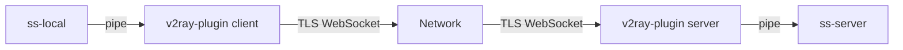
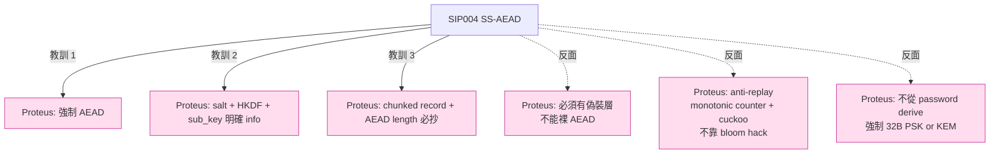

# 課堂 7.3 — Shadowsocks AEAD（2017–2022）：補洞補了五年還是被屠殺

## 學前知道
- 前置課：
  - [7.2 SS 第一代](./7.2-shadowsocks-stream-era.md)
  - [3.2 對稱加密與 AEAD](../part-3-cryptography/3.2-symmetric-aead.md)
  - [3.3 Hash / KDF](../part-3-cryptography/3.3-hash-functions-kdf.md)（HKDF-SHA1）
- 預計閱讀時間：**40 分鐘**
- 必讀規格：
  - **SIP004 — AEAD ciphers**（Mygod, 2017-02 起草；shadowsocks-org/wiki）—— `notes/specs/sip004.md`
  - **SIP007 — Shadowsocks-AEAD-2022 預備工作**（被 SIP022 取代，但作為過渡有研究價值）
  - **RFC 5869** — *HMAC-based Extract-and-Expand Key Derivation Function (HKDF)*
  - **RFC 5116** — *An Interface and Algorithms for Authenticated Encryption*
  - **RFC 7539 / 8439** — ChaCha20-Poly1305 AEAD
  - **NIST SP 800-38D** — GCM
- 必讀論文：
  - **Wu et al., How the Great Firewall Detects FEP**, USENIX Security 2023 —— SS-AEAD 仍中招的原因
  - **Frolov, Wustrow, Wampler, Detecting Probe-resistant Proxies**, NDSS 2020 —— `notes/papers/frolov-probe-resistant.md`（待 fetch）
  - **Bock et al., Geneva: Evolving Censorship Evasion Strategies**, CCS 2019 —— Geneva 找出的 SS-AEAD 缺陷
- 必讀原始碼：
  - **shadowsocks-libev** `src/aead.c`（特別 `aead_encrypt_all` / `aead_decrypt_all`）
  - **shadowsocks-rust** `crates/shadowsocks/src/relay/tcprelay/crypto_io.rs`
  - **outline-ss-server** (`Jigsaw`) `service/cipher_list.go` —— Google 的生產級 SS-AEAD server
  - shadowsocks-libev `src/replay.c` —— bloom filter

## 動機

SIP004（2017）是 SS 社群對 IMC 等學界批評的**第一次嚴肅回應**：把整套 SS wire format 從 stream cipher 升級到 AEAD。從密碼學的角度，這個改動**正確**：CCA-secure、malleability 被擋、被翻 bit 的 ciphertext 解密失敗。

但**從 censorship resistance 的角度**，SS-AEAD **仍然死於 GFW 之手**——因為 SS 第一代留下的另外兩個結構性問題（高 entropy + 無偽裝層）SS-AEAD 一個都沒解。**這是「補洞補錯地方」最痛的歷史教訓**——花了五年改密碼學，結果掉的是 wire-format 與 fingerprint surface 的洞。

讀完應該回答：
- SIP004 的 chunked AEAD framing 為何是這個樣子（為什麼有兩段 length-tag + payload-tag）？
- HKDF-SHA1 推 sub-key 在 SS-AEAD 裡的具體用法是什麼？
- AEAD 解掉了哪幾類攻擊？又**沒**解掉哪幾類？
- 為什麼 GFW 在 2019–2022 之間能持續封鎖 SS-AEAD（即使密碼學完美）？
- bloom filter 防 replay 有什麼參數選擇問題（false positive 對使用者的影響）？

---

## 核心概念

### 1. SIP004 的設計目標（明說與沒說）

**明說的目標**：

1. **取代 stream cipher**——所有 cipher 都是 AEAD（GCM / Poly1305）。
2. **每個 chunk 獨立認證**——避免「half-decrypt」攻擊。
3. **Per-connection sub-key**——避免 long-term key 直接參與 encryption。
4. **保持向後相容 SS 客戶端 ABI**——`ss-local` 仍對應用講 SOCKS5。

**沒明說的目標（重要）**：

5. **不改變 wire-format 第一個 byte 起的 entropy 性質**——salt 開頭仍是 random。
6. **不引入 handshake**——stateless，與 SS 第一代相同的 server 部署模型。
7. **不偽裝**——明確不要 TLS / HTTP wrapper（覺得那是 SIP003 plugin 的事）。

**這 6/7 兩條決定了 SS-AEAD 的命運**——後續 censorship 攻擊面完全保留。

### 2. SIP004 wire format：salt + chunked AEAD records

```
[Client → Server]
+--------+----------------------------------------+
| salt   | encrypted record stream (chunks)       |
| n bytes| variable                               |
+--------+----------------------------------------+

Each chunk:
+----------------------+----------+----------------+----------+
| encrypted len (2 B)  | len-tag  | encrypted data | data-tag |
+----------------------+----------+----------------+----------+
| 2                    | 16       | up to 2^14 - 1 | 16       |
+----------------------+----------+----------------+----------+
```

**參數**：

| AEAD method | salt size | key size | nonce size | tag size |
|---|---|---|---|---|
| `aes-128-gcm` | 16 | 16 | 12 | 16 |
| `aes-192-gcm` | 24 | 24 | 12 | 16 |
| `aes-256-gcm` | 32 | 32 | 12 | 16 |
| `chacha20-ietf-poly1305` | 32 | 32 | 12 | 16 |
| `xchacha20-ietf-poly1305` | 32 | 32 | 24 | 16 |

每 chunk 最大 plaintext = $2^{14} - 1 = 16383$ bytes。**為什麼是 14 bit 而非 16 bit**？因為 length 字段只有 2 byte，但**最高 2 bit 保留**——TLS 1.3 record max 也是 $2^{14}$，這是學界共識：限制 record 大小對 buffer 與 timing 攻擊都有好處。

### 3. 密鑰推導：master key + HKDF-SHA1

```python
master_key = EVP_BytesToKey(password, key_size, 0)   # ⚠ 仍用 EVP_BytesToKey！
salt = os.urandom(salt_size)                          # 隨機 salt per-connection
sub_key = HKDF_SHA1(
    salt=salt,
    ikm=master_key,
    info=b"ss-subkey",
    length=key_size
)
```

**仍然有 master key 從 password derive 的根本問題**——SIP004 沒改這個（要等 SIP022 才把 password 鏈整個切掉）。

**HKDF-SHA1 的選擇**：當年 SHA1 已開始被 deprecate，SS 社群選 SHA1 是因為與 OpenSSL 廣泛相容；2022 年 SIP022 改 BLAKE3 以擺脫 SHA1。**HKDF 本身對 hash 函數的安全要求極低**（只要 PRF）——所以 SHA1 在這個位置實務上仍 OK，但**符號意義很差**。

### 4. Nonce：從 0 開始的 little-endian counter

```python
nonce = bytes(12)          # 12-byte LE counter，初始 0
def aead_encrypt(plain):
    global nonce
    out = AEAD.encrypt(sub_key, nonce, plain)   # AES-GCM / ChaCha20-Poly1305
    nonce = increment(nonce)                     # LE +1
    return out
```

每個方向獨立計數。**Nonce 重用 = 災難**（GCM forgery、Poly1305 key 洩漏）——但 stateless connection per-direction counter 自然避免這個。

**注意**：upstream 和 downstream 用**同一個** sub_key、不同 nonce-counter；OK 因為 GCM nonce uniqueness 在 (key, nonce) 對中只需 nonce 不重複（同 key 可，因為兩方向的 nonce-space 各自獨立）。**但這導致「兩方 sub_key 相同」這個性質**——某些密碼學家會挑刺，**SIP022 改成兩方各自 sub_key**。

### 5. Length 欄位的「2 byte AEAD-encrypted」設計

特別注意**長度本身也是加密的**：

```
encrypted_len = AEAD.encrypt(sub_key, nonce_i,   plaintext_len_be_2B)
encrypted_data = AEAD.encrypt(sub_key, nonce_i+1, plaintext_data)
```

每個 chunk 用**兩個 nonce**，先解 length 才知道 data 長度。

**為什麼**這樣設計？因為 **server 不能在沒有 AEAD 認證的前提下「先讀 length 再讀 data」**——否則 attacker 偽造一個 65535 byte length 的 chunk 就能讓 server allocate 大 buffer 等資料 → DoS。**先 AEAD 認證 length 再讀 data**，attacker 偽造的 length chunk 直接被 GCM tag 拒絕。

**代價**：每個 chunk 多 2 byte overhead + 1 次 AEAD（16 byte tag）。對大 throughput 流量幾乎免費（length+tag = 18 byte / chunk，chunk 16 KB → overhead 0.1%）。

**這個設計是 SS-AEAD 唯一拿得上手的密碼學工程**——抄自 RFC 8446 TLS 1.3 record layer 的 length 處理思路。

### 6. UDP 封裝：與 TCP 完全分離

UDP packet 格式：

```
+--------+----------------------------------------+
| salt   | AEAD( [ATYP|ADDR|PORT|payload] )      |
| n B    | tag included                          |
+--------+----------------------------------------+
```

**每個 UDP packet 獨立 salt + AEAD**——無 chunking，因為 UDP datagram 本身有邊界。

**這個設計的問題**：每個 packet 都要做 HKDF（從 master_key + salt 推 sub_key）——CPU 開銷可觀。AES-NI 的硬體加速 partly 救援，但對 ChaCha20-Poly1305 路徑影響大（HKDF-SHA1 比 ChaCha20 還慢）。**SS-2022 把 UDP 完全重寫**（per-user PSK 之外的 UDP packet ID 系統）。

### 7. AEAD 救了什麼，沒救什麼

| 攻擊向量 | SS 第一代 | SS-AEAD |
|---|---|---|
| Malleability（翻 bit） | ✅ 中招 | ❌ 擋住（tag fail） |
| Active probing（random bytes） | ✅ 中招 | ⚠ 部分擋住（server 解 first record fail 直接斷） |
| Replay 同 salt 整段 | ✅ 中招 | ⚠ 不擋（後續用 bloom filter 補） |
| Replay 部分 chunk | ✅ N/A | ❌ 擋住（per-connection sub_key 不同） |
| Length / timing fingerprint | ✅ 中招 | ✅ **完全保留** |
| Entropy fingerprint | ✅ 中招 | ✅ **完全保留** |
| Chosen-prefix forgery | ✅ 中招 | ❌ 擋住 |
| Server fingerprint via probe response | ✅ 中招 | ⚠ **仍中招** |

**橘色警告 / 紅色 ✅ 仍中招**的格子才是 SS-AEAD 的命門：**密碼學完美≠ censorship 能存活**。

### 8. Server probing 的「半救援」與失敗

**SIP004 對 server probing 的天然防禦**：random bytes 進來，server 第一個 chunk 解密失敗（GCM tag mismatch），server 會關連線。**比 SS 第一代「解出 invalid SOCKS5 header」要好**——但 GFW 升級了戰術：

GFW 的 SS-AEAD 偵測（USENIX Security 2023 觀察）：
1. **Passive entropy filter**——前 N byte（含 salt）entropy 接近 8.0/byte，flag。
2. **Connection lifetime distribution**——SS-AEAD 在 random probe 後立即 RST/FIN，而真實 web service 通常會 timeout / 回 HTTP error。**這個 RST 模式本身就是 fingerprint**。
3. **Length pattern analysis**——SS-AEAD chunk 大小分布與真實 HTTP/TLS **顯著不同**（HTTPS chunk 多在 4–16 KB，SS-AEAD chunk 跟著上層 application 的 write() pattern 走，多很多 < 100 byte 的 chunk）。
4. **Subnet probe**——如果同一個 subnet 多 IP 都被 flag，整個 subnet 標記為「**likely SS infrastructure**」，後續直接封整 subnet。

**結論**：SIP004 把密碼學從 D 提到 A+，但 wire-format/網路行為仍在 D。**這就是「為什麼 SS-AEAD 仍被打」的標準答案**。

### 9. Bloom filter 防 replay：救火措施

shadowsocks-libev 在 2017–2018 補 `src/replay.c`：

```c
typedef struct {
    bloom_t bloom_a, bloom_b;
    int active;  // 哪一個是「活的」
    time_t last_swap;
} ppbloom_t;

// 進來一個 salt
int ppbloom_check_add(ppbloom_t *p, const uint8_t *salt, size_t len) {
    if (bloom_check(&p->bloom_a, salt, len) || bloom_check(&p->bloom_b, salt, len))
        return -1;  // replay!
    bloom_add(&p->bloom[p->active], salt, len);
    if (++p->count > MAX) {
        // 切換 + reset
    }
    return 0;
}
```

**參數**：default `n=1e6 entries, p=1e-15 false positive`——對應 bloom filter 約 50 MB RAM。

**問題**：
- **時間窗**：bloom filter 滿了就切到下一個——old salt 過 ~1 hr 後可能再次被允許。**仍不是嚴格的 monotonic anti-replay**。
- **Memory 成本**：對小 VPS 50 MB 不是免費。
- **False positive**：理論 $10^{-15}$，但**對 user 而言一旦發生就是「看似正常的連線突然被 server 拒絕」**——debug 極困難。
- **共享 server**：多 user 共用 bloom，user A 用過的 salt user B 也不能用（雖然 random 衝突機率低，但在 shared hosting 場景仍有諷刺意味）。

**SS-2022 用 cuckoo filter + per-user PSK 解這個亂局**（Part 7.4 詳講）。

### 10. SIP003 plugin 抽象——SS 想救命的最後嘗試

```yaml
# shadowsocks-libev 配置
{
  "server": "vps.example.com",
  "server_port": 443,
  "method": "chacha20-ietf-poly1305",
  "password": "...",
  "plugin": "v2ray-plugin",
  "plugin_opts": "tls;mode=websocket;host=cdn.example.com;path=/ws"
}
```

SIP003 抽象出 **stdin/stdout-based pluggable transport**——SS 把資料 pipe 給外部程式（v2ray-plugin、simple-obfs、kcptun…），外部程式做偽裝、混淆、分片。

**設計：**



**這就是 V2Ray 路線（VMess、VLESS、Trojan）能與 SS 共存的原因**——SS 把「偽裝」externalize 給 plugin。但 **plugin 模式有體系性弱點**：
- Pipe 兩次（process 內 + IPC + plugin 內），**latency overhead 顯著**（≥ 0.5 ms localhost）。
- Plugin 與 SS 間無加密——本機攻擊面。
- 部署複雜，user 配置易錯。
- **plugin 偽裝的 TLS 握手仍可能是 utls 弱仿真**——WebSocket-over-TLS 的指紋，仍可被識別（Part 4.4 JA3/JA4 詳講）。

**plugin 模式的真正重要性**：它證明了「**SS 自己解不了偽裝問題**」——這個結構性失敗直接催生了 V2Ray 系（把偽裝吃進核心）。

---

## 與我們協議設計的關聯

1. **AEAD 是必要不充分**：SIP004 證明「密碼學正確 ≠ 抗審查」。Proteus 必用 AEAD（沒得商量），但**不能止於此**。我們的 wire format 必須讓「前 N byte 看起來像合法 protocol」——TLS、HTTP/3、QUIC 三選一。
2. **chunked AEAD record 的「先 AEAD-encrypt length」是必抄設計**：TLS 1.3、SS-AEAD、SS-2022、Hysteria 都這樣做——Proteus 直接抄。Part 11.4。
3. **不要再依賴 password derive 主 key**：master_key 鏈條全砍掉。User 端要用 password 加密 PSK 的話，那是 client-side wallet 問題，不是協議問題。
4. **Anti-replay 不要靠 bloom filter**：SS-AEAD 補丁式設計告訴我們 bloom 是 hack。Proteus 採 monotonic counter（per-PSK 或 per-session）+ 短時間 cuckoo filter（24h）作 sliding-window 防護。
5. **HKDF info 字串要明確**：SS 的 `b"ss-subkey"` 是常數——好。Proteus 應該把 protocol version + role（client/server）寫進 info：`b"proteus/v1/c2s-data"`，避免不同 context 的 key 互相 collision。
6. **不依賴外部 plugin 做偽裝**：Proteus 必須**內生**偽裝層。Part 11.5 wire format 把偽裝作為第一公民 design。

---

## 動手

實驗 A（15 min）：**手寫 SS-AEAD chunk decoder**

```python
import os
from cryptography.hazmat.primitives.kdf.hkdf import HKDF
from cryptography.hazmat.primitives import hashes
from cryptography.hazmat.primitives.ciphers.aead import ChaCha20Poly1305

def evp_bytes_to_key(password: bytes, klen: int) -> bytes:
    import hashlib
    out, prev = b"", b""
    while len(out) < klen:
        prev = hashlib.md5(prev + password).digest()
        out += prev
    return out[:klen]

def hkdf_subkey(salt: bytes, master: bytes, klen: int) -> bytes:
    return HKDF(
        algorithm=hashes.SHA1(), length=klen, salt=salt, info=b"ss-subkey"
    ).derive(master)

def increment(nonce: bytearray):
    for i in range(len(nonce)):
        nonce[i] = (nonce[i] + 1) & 0xFF
        if nonce[i] != 0:
            break

# 模擬 server-side 解一個 SS-AEAD ChaCha20-Poly1305 connection
master = evp_bytes_to_key(b"hello", 32)
salt   = bytes.fromhex("..." * ...)   # from wire
sub    = hkdf_subkey(salt, master, 32)
nonce  = bytearray(12)

aead = ChaCha20Poly1305(sub)
# 解 length chunk
enc_len = bytes.fromhex("...")  # 2+16 bytes
plain_len = aead.decrypt(bytes(nonce), enc_len, None)
length = int.from_bytes(plain_len, "big") & 0x3FFF
increment(nonce)
# 解 data chunk
enc_data = bytes.fromhex("...")  # length+16 bytes
plain = aead.decrypt(bytes(nonce), enc_data, None)
increment(nonce)
print(plain[:64])
```

實驗 B（15 min）：**對比 SS-stream 與 SS-AEAD 抓包**

```bash
# 啟動兩個 server，分別用 aes-128-cfb 與 chacha20-ietf-poly1305
ss-server -s 127.0.0.1 -p 8388 -k pw -m aes-128-cfb &
ss-server -s 127.0.0.1 -p 8389 -k pw -m chacha20-ietf-poly1305 &

# 跑 curl
curl -x socks5h://127.0.0.1:1080 -o /dev/null https://example.com  # 各自用對應 ss-local

# tcpdump 比較前 100 byte
sudo tcpdump -i lo0 -n -X 'port 8388 or port 8389' -c 50
```

觀察：兩者的 entropy 與 length pattern 在前 5 個 packet 內**幾乎無法區分**——這就是 GFW 為什麼能用同一套 detector 抓兩代 SS。

實驗 C（30 min）：**讀 outline-ss-server bloom filter**

`outline-ss-server` 是 Google 的 production-grade SS-AEAD server。

- `service/cipher_list.go`——多 user PSK 的 first-byte search（**per-byte 試解密**至 first match！）
- `service/replay_cache.go`——bloom + LRU 結合 anti-replay

回答：
1. 多 user 場景下，server 怎麼知道進來的 connection 屬於哪個 user？trial decryption 的 cost analysis。
2. Bloom filter 的 swap 機制是怎麼實作的？

---

## 自我檢查

1. SS-AEAD 用 `EVP_BytesToKey` derive master key，但 per-connection sub_key 用 HKDF-SHA1 + random salt。**為什麼這樣分層仍有「password」遺留問題**？
2. 如果 SS-AEAD 的 length chunk 只用 plaintext 而非 AEAD-encrypt，server 會怎麼被 DoS？給一個具體 attack scenario。
3. 為什麼 chunk size 設 $2^{14}$ 而不是 $2^{16}$？除了「跟 TLS 一致」還有其他理由嗎？
4. Bloom filter 的 false positive 從 user 角度看是「連線突然失敗」。如果 false positive rate $p = 10^{-9}$、每 user 每天 $10^4$ connection、$10^4$ user——每天大概多少次「莫名其妙的連線失敗」？這對 ops 是否可接受？
5. Outline-ss-server 的 multi-user trial decryption 設計，與 SS-2022 的 EIH (Extensible Identity Header) 路線相比，scaling 屬性的差異是什麼？
6. 為什麼說「SS-AEAD 的 wire format 與 fingerprint surface 是同一回事」？換句話說，GFW 識別 SS-AEAD 的成本與識別 SS-stream 是否量級相同？

---

## 延伸閱讀

- shadowsocks-org wiki: SIP004 / SIP007 / SIP008 / SIP015（多 user 提案，後被 SS-2022 EIH 吸收）
- **outline-ss-server** (`Jigsaw-Code/outline-ss-server`)：Google 的生產級 SS-AEAD server，Go 寫的，code quality 高，**用於 Outline VPN（給記者）**——值得逐檔讀。
- Frolov, Wustrow, *The use of TLS in Censorship Circumvention*, NDSS 2019——TLS 在 circumvention 的角色，與 SS-plugin（v2ray-plugin）對照。
- **shadowsocks-rust** issue tracker：搜尋「detection」、「probe」、「fingerprint」——能看見 dev 對 SS-AEAD 命運的真實認知。

---

## 研究級補遺

### 1. 學界詞彙

| 口語 | 學術術語 | 出處 |
|---|---|---|
| 「AEAD」 | Authenticated Encryption with Associated Data | Rogaway, ASIACRYPT 2002 |
| 「chunked record framing」 | record layer, length-prefixed records | RFC 8446 §5 |
| 「probe-resistant proxy」 | probe-resistant tunneling | Frolov et al., NDSS 2020 |
| 「misuse-resistant nonce」 | nonce-misuse-resistant AE / SIV mode | Rogaway-Shrimpton EUROCRYPT 2006 |
| 「length / size leakage」 | traffic side-channel | Sun et al., S&P 2002（最早 keyword 之一） |
| 「pluggable transport」 | PT (Tor 術語) | Tor PT spec |

### 2. 對手分類學（針對 SS-AEAD）

| 對手能力 | 對 SS-AEAD 的有效程度 |
|---|---|
| Passive entropy classifier | ✅ 致命 |
| Passive length / time pattern classifier | ✅ 致命 |
| Active random-byte prober | ⚠ 中（server 行為差異仍泄漏） |
| Active replay prober | ⚠ 中（bloom filter 救一半） |
| Adaptive prober（學 server response distribution） | ✅ 致命 |
| KEM-level cryptanalysis（GCM forgery） | ❌ 不威脅（密碼學等級夠） |
| Side-channel timing on AES-GCM | ⚠ 端看實作（const-time AES-NI 可，純 software AES 不可） |
| ML-based flow classifier（FlowPrint, Conn2Vec） | ✅ 致命 |

對比 SS-stream：**只剩密碼學等級向上 + active probing 部分擋掉**——其他攻擊面**全部保留**。**這就是 SIP004 的全部成績**。

### 3. 形式化定義

SS-AEAD 的安全性可以**分層**定義：

**內層（密碼學）**：給定 AEAD scheme $\Pi$，sub_key $K = \text{HKDF}(\text{salt}, M)$，協議滿足 **IND-CPA + INT-CTXT**（標準 AEAD 安全），條件是：

1. master_key $M$ 不洩漏。
2. salt 對每個 connection 獨立 + uniformly random。
3. nonce 在 (sub_key, direction) 內 unique。

可形式化為：

$$
\text{Adv}^{\text{ind-cca}}_{\Pi}(\mathcal{A}) \leq \text{negl}(\lambda)
$$

**TLS 1.3 record layer 同等級安全（Bhargavan-Delignat-Lavaud-Pironti 2017，[已讀](../../notes/papers/bhargavan-tls13-record.md)）**。

**外層（流量分析）**：協議**不**滿足任何 traffic-analysis-resistance 性質。形式化結果：

$$
\text{Adv}^{\text{unobs}}_{\text{SS-AEAD}}(\mathcal{B}) = \text{Adv}^{\text{unobs}}_{\text{plaintext-stream}}(\mathcal{B})
$$

也就是「SS-AEAD 的可觀測性與裸明文 stream 一樣」——**因為 SS-AEAD 不擾動 length / timing / bytes-per-second 任何維度**。這就是 Wu 2023 USENIX Security 結果的形式化版本。

### 4. 領域的關鍵論文 / 規格 / 原始碼

- **SIP004 spec**（shadowsocks-org wiki）—— 唯一的 source of truth。
- **Frolov, Wustrow, Wampler, NDSS 2020** —— SS、obfs4、ScrambleSuit 的 server probing detection。
- **Wu et al., USENIX Security 2023** —— FEP detection（對 SS-AEAD 致命）。`notes/papers/wu-fep-2023.md`（待 fetch）
- **Bock, Hughey, Levin, Geneva CCS 2019** —— 用遺傳算法找 GFW evasion strategies，包含 SS。
- **outline-ss-server** —— 唯一 production-grade SS-AEAD server reference。
- **shadowsocks-libev `src/aead.c`** —— 大多數真實部署用的 C 版 reference impl。

### 5. 我們協議的座標 / 設計取捨



收窄項：Proteus wire format 第一輪設計**直接從 SS-AEAD chunked AEAD record + 偽裝外殼**起步，Part 11.4 詳講。

### 6. 必追資源 / 社群入口

- **shadowsocks-org GitHub**（雖然不活躍，但 Issues 是研究素材）
- **outline-ss-server GitHub Issues**（活躍，Google 內部 / 第三方對 SS 命運的最新討論）
- **net4people/bbs**（中文社群觀察）
- **Censored Planet** — 全球審查觀測平台
- **gfw.report blog** — 持續發新 censorship technique writeup

### 7. 開放問題

1. **stateless protocol 能否完全解 active probing**？SS-AEAD 用「server fail-fast」遮蔽，但 fail-fast 本身是 fingerprint。**Part 7.7 Trojan / 7.10 REALITY 給出兩個答案**——但學界仍認為「真正 indistinguishable from real service」是 open problem。
2. **多 user trial decryption 的 cost vs EIH first-byte routing 的 trade-off**——後者快 1000x 但 spec 複雜度大幅上升。**Part 7.4 SS-2022 一段詳細討論**。
3. **side-channel timing on multi-user trial decryption**：trial 順序若洩漏 user identity（早 match 先返回），可能被 timing 攻擊。outline-ss-server 用 constant-time iteration mitigate，但這個 mitigation 是否完整尚有研究空間。
