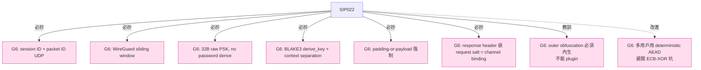

# 課堂 7.4 — Shadowsocks 2022（SIP022）：清算十年技術債

## 學前知道
- 前置課：
  - [7.3 SS-AEAD](./7.3-shadowsocks-aead.md)
  - [3.2 對稱加密與 AEAD](../part-3-cryptography/3.2-symmetric-aead.md)
  - [3.3 Hash / KDF](../part-3-cryptography/3.3-hash-functions-kdf.md)（BLAKE3 derive_key 模式）
  - [6.1–6.4 WireGuard handshake / replay window](../part-6-vpn-internals/)（SIP022 UDP sliding window 直接抄 WireGuard）
- 預計閱讀時間：**45 分鐘**
- 必讀規格：
  - **SIP022-1** *Shadowsocks 2022 Edition*（@database64128 et al., 2022-01）—— [`notes/specs/sip022.md`](../../notes/specs/sip022.md)
  - **SIP022-2** *Extensible Identity Headers*（多用戶單 port）
  - **SIP022-3** *Strict Mode*（salt cache 全 PSK 生命週期）
  - **BLAKE3 spec**（O'Connor, Aumasson, Neves, Wilcox-O'Hearn, 2020）
  - **RFC 9001 §5.4** — QUIC 的 connection ID 設計（SIP022 UDP session ID 同源思路）
- 必讀論文：
  - **Wu et al., How GFW detects FEP**, USENIX Security 2023 → SIP022 仍中招的證明
  - **Frolov, Wustrow, NDSS 2020** → SIP022 padding-or-payload 規則的動機 → [`notes/papers/frolov-probe-resistant.md`](../../notes/papers/frolov-probe-resistant.md)（已 fetch）
- 必讀原始碼：
  - **shadowsocks-rust** `crates/shadowsocks/src/relay/tcprelay/aead_2022.rs` —— TCP wire 解析
  - **shadowsocks-rust** `crates/shadowsocks/src/relay/udprelay/proxy_socket.rs` —— UDP session
  - **sing-shadowsocks2** (`SagerNet/sing-shadowsocks2`) —— 純 Go 重寫，**最易讀的 SIP022 reference**
  - shadowsocks-libev `src/aead2022.c`

## 動機

SIP022 是 SS 社群終於**不再修補 SIP004**，而是**從零重寫 wire format**——把 5 個歷史包袱一次砍掉：

```mermaid
flowchart TD
    SIP004[SIP004 (2017)] -- "MD5 KDF" --> P1[BLAKE3 derive_key]
    SIP004 -- "HKDF-SHA1" --> P2[BLAKE3 derive_key]
    SIP004 -- "0x3FFF chunk cap" --> P3[0xFFFF (4× 大)]
    SIP004 -- "無 anti-replay" --> P4["salt 60s + ts ±30s + UDP sliding"]
    SIP004 -- "UDP per-packet salt" --> P5["session ID + packet ID (QUIC-like)"]
    SIP004 -- "無多用戶單 port" --> P6["EIH layered identity headers"]

    classDef ours fill:#fde,stroke:#c39
    class P1,P2,P3,P4,P5,P6 ours
```

但**它仍**是 fully-encrypted protocol——前 16/32 byte 的 salt 仍然 high-entropy。所以即使密碼學工程做到 SOTA，SIP022 在 censored network 仍**需要再包一層 obfuscation**（shadow-tls、v2ray-plugin、REALITY）才能用。

讀完應該回答：
- BLAKE3 derive_key 的 context string 領域分隔具體怎麼用？
- SIP022 的 padding-or-payload 規則為什麼是「廉價但有效」的 anti-fingerprint？
- UDP separate header 為什麼用 **AES-ECB**？這個極反直覺的選擇怎麼來的？
- EIH 的層疊 identity header 怎麼做到「O(1) user lookup」？
- 為什麼 SIP022 在 censored network 仍需要 outer obfuscation？

---

## 核心概念

### 1. SIP022 的 5 大設計決定

| # | 決定 | 替代了 SIP004 的什麼 | 為什麼 |
|---|---|---|---|
| 1 | **直接吃 base64 PSK** | EVP_BytesToKey + password | 切除 password-based KDF 的攻擊面 |
| 2 | **BLAKE3 derive_key** | HKDF-SHA1 | SHA1 deprecation；BLAKE3 4× 快 |
| 3 | **UDP session ID + packet ID** | per-packet salt + per-packet HKDF | 解 NAT rebinding；對齊 QUIC connection ID |
| 4 | **EIH 多用戶單 port** | 無 | 商業 deploy（單 server 多 user）剛需 |
| 5 | **Padding-or-payload 強制** | 無 | 打破 Frolov 2020 entropy fingerprint |

每個決定都是**對特定攻擊或運營痛點的具體回應**——這是 SIP022 之所以是 spec 工程示範的原因。

### 2. 加密套件（強制 + 可選）

| 套件 | Key | Salt | Nonce | 必選 | 適用 |
|---|---|---|---|---|---|
| `2022-blake3-aes-128-gcm` | 16 B | 16 B | 12 B | required | 所有 |
| `2022-blake3-aes-256-gcm` | 32 B | 32 B | 12 B | required | 高安全 |
| `2022-blake3-chacha20-poly1305` | 32 B | 32 B / 24 B XChaCha | — | optional | ARM, no AES-NI |

**注意**：`2022-blake3-chacha20-poly1305` 對 UDP 改用 **XChaCha20-Poly1305**（24 B nonce）以避開 separate header trick。**為什麼 ChaCha 是 optional？** 因為現代 x86_64 與 ARMv8 都有 AES-NI / ARMv8 Crypto，AES-GCM 比 ChaCha 快 2-3×。**G6 設計參考**：在硬體加速無保證的場景（IoT），ChaCha 仍是首選。

### 3. Sub-key 推導：BLAKE3 derive_key

```python
session_subkey = blake3.derive_key(
    context = "shadowsocks 2022 session subkey",
    key_material = psk + salt
)

# EIH 多 PSK 場景另用：
identity_subkey_n = blake3.derive_key(
    context = "shadowsocks 2022 identity subkey",
    key_material = iPSK_n + salt
)
```

**`blake3::derive_key` 與 HKDF 的差異**：

- `derive_key` 把 context string 編進 internal IV，而非 HKDF 的 info field——**等價但更難用錯**。
- BLAKE3 自帶 keyed mode、derive_key mode、hash mode 三種，**強制不同 mode 之間互不相容**——SIP022 只用 derive_key。
- BLAKE3 SIMD 優化好（AVX-512 約 6 GB/s）。HKDF-SHA1 約 200 MB/s——**約 30× 速度差**。

**Context string 是領域分隔的範例**：
- `"shadowsocks 2022 session subkey"`：normal 加密
- `"shadowsocks 2022 identity subkey"`：EIH

兩個 context 推出來的 key 即使 PSK 相同也**永遠不同**。這就是「**deriving multiple keys from one secret**」的標準做法——G6 必抄。

### 4. TCP wire format 完整

**Request stream**：

```
[salt(16/32 B)]                           ← 隨機 per-connection
[enc fixed_request_header(11 B) || tag]   ← AEAD nonce=0
[enc variable_request_header(var) || tag] ← AEAD nonce=1
[enc length(2 B) || tag]                  ← AEAD nonce=2
[enc payload(≤ 0xFFFF) || tag]            ← AEAD nonce=3
... (length, payload) chunks repeat
```

**Fixed request header (11 B)**：

| 欄位 | 大小 | 說明 |
|---|---|---|
| Type | 1 B | `0x00` = client → server |
| Timestamp | 8 B u64be | Unix epoch seconds |
| Length | 2 B u16be | variable header 長度 |

**Variable request header**：

| 欄位 | 大小 | 說明 |
|---|---|---|
| ATYP | 1 B | SOCKS5 address type |
| Address | var | domain (1B len + name) / IPv4 4B / IPv6 16B |
| Port | 2 B u16be | |
| Padding length | 2 B u16be | |
| Padding | var | 隨機 bytes |
| Initial payload | var | 第一段業務資料（可選） |

**Spec 規定**：variable header 必須含「**payload OR 非零 padding**」之一——server 收到「payload 為空 AND padding length = 0」直接拒絕。

**這條規則是 SIP022 對 Frolov 2020 entropy probing 的直接修補**——攻擊者送純 random + 空 payload 試探，server 不會像 SS-AEAD 那樣「解密失敗就斷」（仍然是行為差異），而是**先看 padding length，0 就拒絕**——讓 server 行為**一致地**拒絕 random probe。

**Response stream**（**asymmetric** 設計）：

```
[salt(16/32 B)]
[enc fixed_response_header(27/43 B) || tag]
[enc payload || tag] [enc length || tag] ...
```

**Fixed response header**：

| 欄位 | 大小 |
|---|---|
| Type | 1 B (`0x01` = server → client) |
| Timestamp | 8 B u64be |
| Request salt | 16 / 32 B（**綁回 request salt**）|
| Length | 2 B u16be（**第一段 payload 長度**）|

**`Request salt` 嵌入 response header** 是 SIP022 防 cross-session replay 的關鍵——server 必須證明它「**看見了 client 的 salt**」才能合法回應。**這是 channel binding 的最簡實作**——對應 TLS 1.3 transcript hash 概念，但極簡。

**Asymmetry**：response 的第一段 payload 把 length 塞進 fixed header——之後的 chunk 才回到 `(payload, length)` 對。**為什麼這樣？** 為了讓 server 在送出 response 之前**只做一次** `write()` 包（`fixed_header + first_payload + tag`），減少 syscall。**這是 throughput 工程，不是 spec 美學**——但也是 production 實戰經驗的痕跡。

**Length cap 提升至 0xFFFF (65535)**：相比 SIP004 的 0x3FFF 提升 4 倍，大幅減少 chunk 切分次數。對 high-bandwidth 流量（10 Gbps+）syscall 開銷顯著降低。

### 5. UDP wire format：QUIC connection ID 思路

```
[enc separate_header(16 B)]   ← 用 session_id 衍生的 AES-ECB 加密，無 tag
[enc body || tag(16 B)]       ← 用 session subkey + AEAD
```

**Separate header (16 B)**：

| 欄位 | 大小 |
|---|---|
| Session ID | 8 B（client 隨機生）|
| Packet ID | 8 B u64be（per-session monotonic）|

**為什麼 separate header 用 AES-ECB 而非 AEAD？**

考慮：要把 `session_id, packet_id` 對被動觀察者隱藏，又不想為前 16 B 多花 16 B tag。AES-ECB **單 block** 的特殊性質：

- ECB 對單 block 加密就是 deterministic permutation，**沒有 tag overhead**。
- 與 AEAD 不同，ECB 不需要 nonce——key 已經夠了。
- **多 packet 之間 packet_id 不同**，所以兩個 packet 的 16 B plaintext 不同 → ciphertext 也不同 → 沒有 ECB 「same-plaintext = same-ciphertext」漏洞。

**這個選擇是密碼學工程而非密碼學原理的勝利**——絕大多數新手會說「用 AES-ECB 就是錯」，但**單 block + 永不重複 plaintext** 的場景下 ECB 沒問題。

**Nonce 構造**：`(session_id, packet_id)` 同時當 AEAD nonce 的後 12 B（前 4 B 為 0）。這保證 (session, packet) 對唯一 → AEAD nonce 唯一。

**Body header (client → server)**：

```
| Type=0x00 (1 B) | Timestamp (8 B) | Padding length (2 B) | Padding (var) | ATYP (1 B) | Address | Port (2 B) | Payload |
```

**Body header (server → client)**：多帶 client session ID（用於 NAT rebinding 後 client 認 server）：

```
| Type=0x01 | Timestamp | Client session ID (8 B) | Padding length | Padding | ATYP | Address | Port | Payload |
```

**XChaCha20-Poly1305 變體**：

```
[nonce(24 B)] [enc body || tag(16 B)]
```

XChaCha 的 24 B nonce 大到可以隨機取，**完全不需要 separate header trick**。這體現了 「**算法選擇影響協議結構**」——XChaCha 因 nonce 大，UDP packet 結構大幅簡化。

### 6. Anti-replay：三層保護

| 層 | 機制 | 視窗 |
|---|---|---|
| TCP salt | server 記住 60 秒內所有見過的 salt | 60 s（strict mode 為整 PSK 生命週期）|
| Timestamp | `\|server_now − client_ts\| > 30 s` 即拒 | ±30 s |
| UDP packet ID | per-session sliding window（建議 2048-bit，抄 WireGuard `replay.c`）| per-session |

**WireGuard replay window 在這裡的作用**：sliding bitmap，記住「最近 2048 個 packet_id 哪些見過」。新 packet 進來：
- 若 `id` 太老（< window_left），拒。
- 若 `id` 太新（> window_right），shift window。
- 若 `id` 在窗口內已見，拒；否則記錄。

**這是 anti-replay 的標準教科書實作**，比 bloom filter 更精確（無 false positive）、更快（O(1) bit ops）。SIP022 是少數明確採用的 SS-line 協議。

### 7. EIH（Extensible Identity Headers）：多用戶單 port

商業場景：一台 server 服務多個 user，**所有人共用一個 port**。如果每個 user 一個 port：
- Server scaling 差。
- 客戶端配置複雜。
- **port number 本身洩漏 user 數量**。

EIH 的設計：每個 client 拿到 `iPSK_0 : iPSK_1 : ... : uPSK_n` 的多層 PSK。

**Wire format 在 salt 之後插入一或多個 identity header**：

```python
identity_header_n = AES_ECB.encrypt(
    key = identity_subkey_n,
    plaintext = blake3.hash(iPSK_{n+1})[:16]
)

identity_subkey_n = blake3.derive_key(
    context = "shadowsocks 2022 identity subkey",
    key_material = iPSK_n + salt
)
```

**Server 流程**：

1. 用自己持有的 `iPSK_0` derive `identity_subkey_0`。
2. AES-ECB 解 `identity_header_0` → 得到 `blake3.hash(iPSK_1)[:16]`。
3. 在預先建好的 `hash → user` 表裡 lookup → O(1) 找到 user。
4. 用該 user 的 uPSK 走 SIP022 主流程。

**O(1) lookup**——這是 EIH 對 outline-ss-server 「多 user trial decryption」（O(N) 試解每個 user）的決定性升級。

**UDP EIH 的 ECB chosen-plaintext 風險**：multi-packet 場景下 client 可能對相同 user 反覆送 identity header，AES-ECB 會給出相同 ciphertext → 被動觀察者可區分 user。**SIP022 修補**：把 plaintext 與 `session_id ⊕ packet_id` XOR 一起 → 每包 plaintext 不同 → ECB 安全。

**這個 ECB 的反覆掙扎是 SIP022 spec 最容易踩的工程坑**——`session_id ⊕ packet_id` XOR 不是 spec 表面的設計選擇，是**踩過坑後**的補丁。

### 8. 與 SIP004 的對照表

| | SIP004 | SIP022 |
|---|---|---|
| KDF | HKDF-SHA1 | BLAKE3 derive_key |
| Password 推導 | EVP_BytesToKey (MD5) | 直接 base64 PSK |
| Chunk cap | 0x3FFF (16 KB) | 0xFFFF (64 KB) |
| Replay 防護 | 無 | salt 60s + ts ±30s + UDP sliding |
| UDP session | 無 | session ID + packet ID |
| 多用戶單 port | 無 | EIH |
| Header padding | 無 | 強制 payload-or-padding |
| Nonce 重用風險 | 中（per-direction counter）| 低（顯式 monotonic packet ID）|
| AEAD length 編碼 | 每 chunk 獨立 | 一致，但 response asymmetric |

### 9. 為什麼 SIP022 在 censored network 仍需要 outer obfuscation

SIP022 解了：密碼學、replay、UDP session、多用戶。**沒解**：

- **第一個 byte 起就是 random 高 entropy**——Wu 2023 USENIX Security 的 Ex1 entropy 規則直接識別。
- **沒有偽裝層**——server 行為不像 web service。

GFW 對 SS 的偵測在 2022–2024 升級為「**先看 entropy → 再看 connection lifetime → active probe**」三段式 pipeline。SIP022 在 stage 1 就被標記。

**這就是為什麼 production 部署都是 `SS-2022 + shadow-tls`**——shadow-tls 把 SIP022 stream 包進真 TLS 1.3 record，攻擊者看到 ClientHello-ServerHello-Finished 完整握手。**Part 7.13 詳講 shadow-tls**。

**對 G6 的啟示**：obfuscation 不能是 plugin / 外掛——必須**內生**。SIP022 + shadow-tls 是兩個獨立 spec 拼起來，**部署複雜、版本對齊難**。G6 wire format 第一版必須**從 byte 1 起就長得像 TLS 1.3 ClientHello / QUIC initial packet**——Part 11.5。

---

## 與我們協議設計的關聯

1. **PSK 一律 32 B random，不 derive**：直接抄。Password 只用作 user 端解鎖 PSK 的 wallet key。
2. **BLAKE3 derive_key + context 領域分隔**：SS-2022 教科書級示範。G6 至少應該為 `c2s-data, s2c-data, c2s-auth, s2c-auth, mac-key, replay-key` 各 derive 獨立 sub-key。
3. **UDP session ID + packet ID**：QUIC + SIP022 + Hysteria2 收斂在這個設計。G6 必抄。
4. **WireGuard replay window**：anti-replay 的工程實作。G6 必抄。
5. **EIH 層疊 identity header**：多用戶單 port 的優雅解。G6 多用戶設計可參考——但要避開 ECB-XOR 那條坑（建議直接用 AES-GCM-SIV deterministic AEAD）。
6. **Padding-or-payload 規則**：低成本 anti-fingerprint trick。G6 內生支援。
7. **Response header 嵌入 request salt** = channel binding：簡潔有效，G6 整體 wire format 加 transcript hash 時可參考此最簡形式。
8. **Outer obfuscation 必須內生**：SIP022 + shadow-tls 兩 spec 拼貼是反面教材。G6 wire format 第一個 byte 起就是偽裝。

---

## 動手

實驗 A（20 min）：**手寫 SIP022 TCP request encoder**

```python
import os, struct, time, secrets
from blake3 import blake3
from cryptography.hazmat.primitives.ciphers.aead import AESGCM

PSK = secrets.token_bytes(16)   # AES-128
salt = os.urandom(16)
session_subkey = blake3(PSK + salt, derive_key_context="shadowsocks 2022 session subkey").digest(length=16)

aead = AESGCM(session_subkey)

def encrypt_chunk(data, nonce_counter):
    nonce = nonce_counter.to_bytes(12, "little")
    return aead.encrypt(nonce, data, None)

# Fixed request header
fixed = struct.pack(">BQH", 0x00, int(time.time()), 0)   # length 等下填
# Variable request header（連 example.com:443，沒 payload，padding 16 B）
addr = b"\x03" + bytes([len("example.com")]) + b"example.com"  # ATYP + len + name
port = (443).to_bytes(2, "big")
padding = os.urandom(16)
var_hdr = addr + port + (16).to_bytes(2, "big") + padding
fixed = struct.pack(">BQH", 0x00, int(time.time()), len(var_hdr))

# 加密
encrypted_fixed = encrypt_chunk(fixed, 0)
encrypted_var = encrypt_chunk(var_hdr, 1)

# Wire
wire = salt + encrypted_fixed + encrypted_var
print(wire.hex())
```

實驗 B（30 min）：**讀 sing-shadowsocks2 源碼對照 spec**

`SagerNet/sing-shadowsocks2` 是 SIP022 最易讀的純 Go 實作。讀以下檔案：

- `shadowaead_2022/method.go` — cipher suite registry
- `shadowaead_2022/conn.go` — TCP wire（Read / Write）
- `shadowaead_2022/packet_session.go` — UDP session
- `shadowaead_2022/eih_*.go` — EIH header

對照 spec 寫一份「**spec ↔ code 對照表**」，特別找出：
1. Padding-or-payload 校驗在哪一行？
2. UDP separate header 的 AES-ECB 在哪一行？
3. EIH 的 hash → user lookup 表在哪？
4. Response salt binding 怎麼驗證？

實驗 C（15 min）：**對 SIP022 + outer obfuscation 抓包對比**

啟動 `sing-box` 同時跑：
- 純 SS-2022（port 8443）
- SS-2022 + shadow-tls v3（port 443）

各跑 10 個 HTTPS request，用 `tshark` 統計：
- 前 100 byte entropy
- packet size distribution
- TCP RTT pattern

對比兩者的「**從外面看像不像 HTTPS**」。對純 SS-2022 entropy ~ 7.9，對 SS-2022 + shadow-tls 應該是「ClientHello-pattern」entropy ~ 5.5。

---

## 自我檢查

1. SIP022 為什麼在 UDP separate header **故意**用 AES-ECB？這個選擇在密碼學原則上是違規的，為什麼這裡可以？舉一個會 break 這個設計的場景。
2. EIH 的 ECB-XOR 修補（用 `session_id ⊕ packet_id`）解決了什麼問題？如果不做這個 XOR 會出現什麼可觀察的指紋？
3. SIP022 的 padding-or-payload 規則具體擋掉 Frolov 2020 的哪一招？如果 GFW 升級成「送非空 padding 但隨機 ATYP」呢？
4. Response header 嵌入 request salt 解決了哪一類 attack？如果不做這個 binding，會有什麼具體 cross-session 攻擊？
5. SIP022 為什麼在「censored network 還需要 outer obfuscation」？entropy 高為什麼是死刑？
6. 用 BLAKE3 derive_key 的 context string，與 HKDF info field，本質差異是什麼？哪個更難用錯？

---

## 延伸閱讀

- **Shadowsocks-NET specs repo**: 全部 SIP022-1/2/3 markdown 是 normative source。
- **shadowsocks-rust GitHub Discussions**: SIP022 設計討論真實過程。
- **sing-box documentation**: SS-2022 + shadow-tls 部署實戰。
- **shadow-tls v1/v2/v3** spec（`ihciah/shadow-tls`）—— 目前 SS-2022 的標準 outer obfuscation。Part 7.13 主場。
- BLAKE3 paper / spec —— 理解 derive_key 與 keyed mode 的領域分隔。

---

## 研究級補遺

### 1. 學界詞彙

| 口語 | 學術術語 | 出處 |
|---|---|---|
| 「session ID」（SIP022 / QUIC / TLS 1.3）| Connection identifier | RFC 9000 §5.1 |
| 「sliding window replay」 | bitmap-based replay protection | IPsec ESP RFC 4303 §3.4.3 |
| 「derive_key 模式」 | domain-separated KDF | RFC 9180 §5.1 (HPKE) |
| 「padding-or-payload」 | active probing resistance | Frolov-Wustrow NDSS 2020 |
| 「fully-encrypted protocol」 (FEP) | random-looking transport | Wu et al., USENIX Security 2023 |
| 「channel binding」 | transcript hash / session resumption binding | RFC 5056 |

### 2. 對手分類學

| 對手能力 | SIP022 防禦 |
|---|---|
| Passive entropy classifier | ❌ 中招（仍是 fully-encrypted） |
| Passive length classifier | ⚠ 中（padding 帶來部分混淆） |
| Active random-byte prober | ✅ 擋住（padding-or-payload + replay window） |
| Active replay attacker | ✅ 擋住（salt 60s + ts ±30s + UDP sliding） |
| Active timing attacker | ⚠ 中（trial decryption O(1)，無明顯 timing） |
| Adaptive prober | ⚠ 端看 outer obfuscation |
| Cryptanalysis (GCM forgery) | ✅ 擋住 |
| Side-channel on AES | ⚠ 端看實作（要求 const-time AES-NI） |
| Multi-user collusion | ⚠ 中（EIH 隔離但不防共謀觀察）|

對比 SIP004：**在 8 個維度上至少 6 個明顯改善**。但 **passive entropy 仍致命**——這就是 SIP022 + shadow-tls **必組合**的根本原因。

### 3. 形式化定義

SIP022 + shadow-tls 的安全性可以分成兩層證明：

**內層（SIP022）**：與 TLS 1.3 record layer 同等級的 IND-CCA + INT-CTXT。形式化見 Bhargavan-Delignat-Lavaud-Pironti 2017。**Channel binding** 性質：

$$
\text{Adv}^{\text{cross-session-replay}}_{\text{SIP022}}(\mathcal{A}) \leq \frac{q^2}{2^{|\text{salt}|}} + \text{ts-window} \times \text{Adv}^{\text{prng}}
$$

對 16 B salt：碰撞機率 $q^2 / 2^{128}$ 對 $q < 2^{60}$ 流量規模可忽略。

**外層（unobservability）**：純 SIP022 不滿足任何 unobs 屬性。形式化：

$$
\text{Adv}^{\text{distinguish-from-random}}_{\text{SIP022}}(\mathcal{B}) = \text{negl}
$$

但**這不是好事**：random 本身就是 fingerprint。**真正想要的是「distinguish from real TLS」**：

$$
\text{Adv}^{\text{distinguish-from-TLS-13}}_{\text{SIP022}}(\mathcal{B}) = 1
$$

也就是「攻擊者區分 SIP022 與 TLS 1.3 機率為 1」——這就是 shadow-tls 等 outer obfuscation 必選的形式化原因。

### 4. 領域的關鍵論文 / 規格 / 原始碼

- **SIP022-1/2/3 specs** （Shadowsocks-NET）
- **BLAKE3 paper** （O'Connor et al., 2020）
- **WireGuard `replay.c`** —— sliding window 的標準實作
- **outline-ss-server** —— 對比 EIH 之前的 multi-user trial decryption
- **shadow-tls** （`ihciah/shadow-tls`）—— SS-2022 outer obfuscation 主流選擇
- **Wu et al., USENIX Security 2023** —— SIP022 仍中招的證明

### 5. 我們協議的座標 / 設計取捨



**今日收窄項**：G6 wire format 約 60% 已被 SIP022 教科書化——剩下 40% 是 outer obfuscation（Part 7.7/7.10/7.13 + Part 11.5）。

### 6. 必追資源 / 社群入口

- **Shadowsocks-NET** GitHub org（spec normative source）
- **shadowsocks-rust** Discussions（最活躍）
- **sing-box** Telegram 群（中文社群最高密度討論）
- **net4people/bbs** GitHub Issues（GFW behavior 觀察）
- **gfw.report** blog（學界視角）

### 7. 開放問題

1. **EIH 是否能升級到完全避開 ECB？** AES-GCM-SIV deterministic AEAD 增加 16 B tag overhead（每 packet 16 B）對 UDP 是顯著代價。**Open**：能否設計 12 B tag 的 deterministic AEAD？
2. **SIP022 + shadow-tls 的「兩 spec 對齊」運營痛點**——版本升級需同步。學界研究方向：能否用單一 spec 同時提供 SIP022 等級的密碼學工程 **與** TLS 1.3 等級的偽裝？這正是 G6 設計目標。
3. **EIH 的多用戶 traffic-analysis 隔離**——server 對所有 user 共用 socket buffer，cross-user timing side-channel 是否可被 ML-based classifier 利用區分 user？目前無公開 paper 系統研究。
4. **SIP022 strict mode salt cache 整 PSK 生命週期** 對 server RAM 的真實成本——研究方向：用 cuckoo filter + 老化 + 持久化的 hybrid scheme，是否能把 RAM 從 GB 級降到 MB 級？
