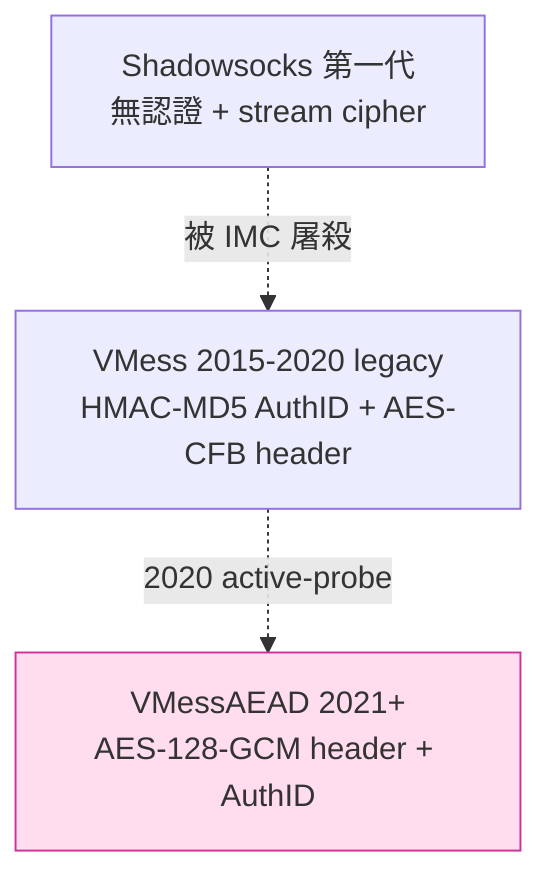
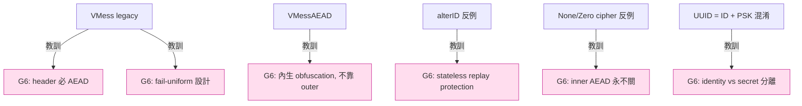

# 課堂 7.5 — V2Ray VMess 完整解剖

## 學前知道
- 前置課：
  - [3.2 對稱加密與 AEAD](../part-3-cryptography/3.2-symmetric-aead.md)
  - [7.1 SOCKS / HTTP CONNECT](./7.1-socks-http-connect.md)
  - [7.3 SS-AEAD](./7.3-shadowsocks-aead.md)
  - [4.1 TLS 沿革](../part-4-tls-quic/4.1-tls-history-bloodshed.md)
- 預計閱讀時間：**45 分鐘**
- 必讀規格：
  - **VMess spec**（v2fly 官方）`v2fly.org/developer/protocols/vmess.html` —— [`notes/specs/vmess.md`](../../notes/specs/vmess.md)
  - **VMessAEAD upgrade**（v2fly issue #2523 + #2528, 2020-2021）
- 必讀原始碼：
  - **v2ray-core** `proxy/vmess/aead/encrypt.go`（`SealVMessAEADHeader` / `OpenVMessAEADHeader`）
  - **v2ray-core** `proxy/vmess/encoding/auth.go`（KDF chain）
  - **v2ray-core** `proxy/vmess/encoding/server.go`（AuthID replay cache）
  - **v2fly issue #2523**（2020 active-probe vuln）—— **必讀**：歷史上少見「論文級攻擊面被 community 自己發現後內部修補」的案例
  - **xray-core** `proxy/vmess/`（與 v2ray 同源 fork，但**保留 legacy 模式**作參考）
- 必讀論文：
  - 沒有頂會 paper 直接針對 VMess（VMess 社群修補在學界正式發 paper 之前）；但 **Xue et al., *Bypassing Tunnels*, USENIX Security 2022** 對 VMess-over-WS 的 traffic-analysis 有測量。
  - **Wu et al., FEP 2023** —— 對 VMessAEAD 的 entropy 識別

## 動機

VMess 是中國翻牆社群第一個「**正視 active probing 為主要威脅**」的協議。它的命運是**「設計時想的對手是 SS-stream era 的 GFW，但 GFW 在 2018-2020 升級了，VMess 跟不上」**。

VMess 對協議學習者特別重要：

1. **完整經歷一次 cryptographic upgrade**——legacy MD5-Auth → VMessAEAD 是一個**「社群在 production 部署中替換 wire format」**的真實案例研究。學界 paper 不會教這個——不是「正確設計」，而是「**錯誤設計後怎麼遷移**」。
2. **設計上的密碼學罪惡很多**（MD5 滿天飛、CFB 模式、alterID hack）——是「**反面教材的反面教材**」：明白為什麼 SS-2022、Trojan、VLESS 後來都在「**砍 VMess 設計**」。
3. **alterID 設計**是「**「有狀態 PRG anti-replay」**」反面教材——揭示為什麼 stateless protocol 在 censorship 場景更穩。

讀完應該回答：
- VMess 為什麼把「身份」、「加密 key」分到兩個 KDF 鏈（CmdKey vs Body Encryption Key）？
- alterID 是什麼？它解決了什麼？又**製造了什麼**？為什麼 2021 被 deprecated？
- 2020 年 v2fly issue #2523 的 active-probe vuln 是什麼？VMessAEAD 是怎麼修的？
- 為什麼 VMess 的 Body 加密支援「none」與「zero」這兩個看似荒謬的選項？

---

## 核心概念

### 1. VMess 的設計座標



VMess 的兩個歷史時期：

| | Legacy (2015–2020) | VMessAEAD (2021+) |
|---|---|---|
| Header auth | HMAC-MD5(UUID + alterID, time) | AES-128-GCM (CmdKey) |
| Header encryption | AES-128-CFB (no MAC) | AES-128-GCM |
| Body encryption | AES-128-CFB / AES-128-GCM / ChaCha20-Poly1305 / none | 同 |
| Replay | alterID rotating + ±90s clock window | AuthID timestamp ±30s + AuthID cache |
| Probing resistance | ❌（issue #2523）| ⚠（仍是 fully-encrypted, FEP detector 中招）|

**關鍵歷史**：legacy VMess 的 header **沒有認證**——只有「加密」。這在 2020 年被 v2fly community 自己發現可被 active probing 利用（**送翻 bit 後的 header，看 server 是否關 connection**）。VMessAEAD 是針對性修補。

### 2. VMess 的「身份」抽象：UUID

VMess 用 16 byte UUID 作 user identity（也就是 V2Ray client 配置裡那個 `id` 欄位）：

```json
{
  "id": "00000000-0000-0000-0000-000000000000",
  "alterId": 0
}
```

這個 UUID **沒有**密碼學上的「random」要求——只是一個 user-routable identifier（server 用 UUID 找對應的 user 設定）。**密碼學家會皺眉**：把 password / PSK 與 user identifier 混在一起的設計**模糊了「身份識別」與「秘密知識」的邊界**。

**正確的設計**：user identifier 公開（如 username），PSK 32 byte 隨機（如 SS-2022）。VMess 把兩者合一造成**「UUID 既是 ID 也是 PSK 派生源」**。

### 3. CmdKey 推導

```python
CmdKey = MD5(UUID || "c48619fe-8f02-49e0-b9e9-edf763e17e21")
```

固定 magic string 與 UUID 混 MD5。**美學上罪過**（MD5）但**不可被攻擊面**（後續層用 GCM）。

**這個 magic string 的意義**：domain separation——不同協議用同樣 UUID derive 的 key 不會撞。但用 MD5 而非 BLAKE3 derive_key context 是 2015 年的歷史包袱。

### 4. VMessAEAD wire format（current default）

完整 request header layout：

```
| EAuID | ALength | Nonce | AHeader (encrypted command) | Data |
| 16 B  | 18 B    | 8 B   | variable                    | …    |
```

#### EAuID (16 B) — Encrypted Auth ID

```
plaintext = | Timestamp 8B BE | Rand 4B | CRC32 4B |
EAuID     = AES-128-ECB.encrypt(KDF(CmdKey, "AES Auth Id Encryption")[:16], plaintext)
```

**注意**：又是 AES-ECB。為什麼？因為 `(Timestamp || Rand)` 對每個 connection 都不同，**單 block AES-ECB 在這裡沒有 ECB 漏洞**（與 SIP022 UDP separate header 同樣思路）。Server 收到 EAuID 後：

1. Try-decrypt with `KDF(CmdKey_user_i, "AES Auth Id Encryption")` for each user.
2. 解出來檢查 `CRC32(Timestamp || Rand) == 後 4 byte`。
3. 若 OK → 找到 user。

**Multi-user trial decryption**——與 outline-ss-server 的 SS-AEAD multi-user 同樣 O(N) 問題。SIP022 EIH 用 hash table 升級為 O(1)，VMess 沒有。

#### ALength (18 B) — Length of AHeader

```
ALength = AEAD-128-GCM.encrypt(
    key   = KDF(CmdKey, "VMess Header AEAD Key_Length", EAuID, Nonce)[:16],
    nonce = KDF(CmdKey, "VMess Header AEAD Nonce_Length", EAuID, Nonce)[:12],
    plaintext = length_2B  
)
# 結果: 2 byte ciphertext + 16 byte tag = 18 byte
```

#### Nonce (8 B) — Random salt

每連線一次新隨機 8 byte。

#### AHeader (variable) — AES-128-GCM encrypted command section

```
AHeader = AEAD-128-GCM.encrypt(
    key   = KDF(CmdKey, "VMess Header AEAD Key", EAuID, Nonce)[:16],
    nonce = KDF(CmdKey, "VMess Header AEAD Nonce", EAuID, Nonce)[:12],
    plaintext = command_section  // 見下
)
```

**KDF chain 觀察**：每個用途（length key, length nonce, header key, header nonce）有獨立 context string + EAuID + Nonce binding。**這是好設計**——對應 BLAKE3 derive_key 的 context separation 哲學，但用 HMAC-SHA256 實作（VMess KDF 的本體）。

### 5. Command section（解密後）

```
| Offset | Size | 欄位 |
|--------|------|------|
| 0      | 1 B  | Version (0x01) |
| 1      | 16 B | Body Encryption IV |
| 17     | 16 B | Body Encryption Key |
| 33     | 1 B  | Response Auth V (1 byte random, server 在 response 第 1 byte 必須回 V) |
| 34     | 1 B  | Options (Opt: 各 bit 開關) |
| 35     | 4 b  | Padding length P (0-15) |
| 35.5   | 4 b  | Security (0x03=GCM, 0x04=ChaCha20-Poly1305, 0x05=None, 0x06=Zero) |
| 36     | 1 B  | Reserved |
| 37     | 1 B  | Cmd (0x01 TCP, 0x02 UDP) |
| 38     | 2 B  | Port (BE) |
| 40     | 1 B  | Address Type |
| 41     | var  | Address |
| ...    | P    | Padding (P bytes) |
| ...    | 4 B  | FNV1a-32 checksum over command |
```

**重要欄位**：

- **Body Encryption IV / Key**：這兩個 32 byte 是 **per-connection ephemeral**——request command section 內帶過去。Server 解出後用這對 IV/Key 解密 body。**這意味著 CmdKey 只用來解 header，body 用 ephemeral key**——前向保密性質**部分**獲得（CmdKey 洩漏不能解過去 body）。
- **Response Auth V**：1 byte 隨機，server 回應第一個 byte 必須回 V。**這就是 VMess 的「authenticated server」**——確保你連到的不是 attacker fake server。
- **Security**：選 body cipher。

#### Security: 0x05 None / 0x06 Zero 的歷史

- `0x05 None`：body **完全明文**——直接 `length || plaintext` 串流。為什麼這個選項存在？**早期測試與調試**。但 production 不應使用——即使 outer 有 TLS，內層明文意味著 **TLS 端點看到 user data 全明文**——provider trust 假設大幅放寬。
- `0x06 Zero`：「**零 cipher**」——body 是 plaintext + 4 byte FNV checksum。比 None 多了完整性。同樣不應 production 使用。

**為什麼設計這兩個選項**？歷史上是「**對 outer TLS 信任時的 CPU 節省**」——兩層加密太貴。但**這是錯誤的優化方向**——Part 7.9 XTLS-Vision 用更聰明的方式（splice）解決同樣問題。

### 6. Body chunks

```
| length 2B BE | ciphertext (length B) | tag 16B |
```

每 chunk 用獨立 nonce：

```
nonce_i = (i 2B BE counter) || (10B derived_IV)
```

`derived_IV` 從 command section 的 Body Encryption IV 推：`derived_IV = sha256(IV)[:10]`。

**counter 的處理**：與 SS-AEAD 同樣 monotonic per-direction。

### 7. Response

```
| V (1B) | Opt (1B) | Cmd (1B) | M (1B) | CmdContent (M B) | Body... |
```

第一個 byte 必須是 request command 的 V（response auth）。後續 chunks 用：

```
ResponseKey = SHA256(RequestKey)[:16]
ResponseIV  = SHA256(RequestIV)[:16]
```

**`SHA256(RequestKey)[:16]` derive ResponseKey**：domain separation 弱版。**正確設計**應該：`HKDF(RequestKey, info="response-key")`。SHA256-truncate 在 random oracle 下等價，但**符號意義差**。

### 8. alterID — 死掉的 anti-replay 設計

Legacy VMess 的 alterID（2015–2021）：

設 `id = UUID`，**用戶實際持有 N+1 個衍生 ID**：

```
alt_ids = [HMAC(id, i) for i in range(alterID + 1)]
```

每個 connection client **隨機從 N+1 個 ID 中選一個** 放到 AuthID 位置。Server 對每個 user 維護 `set(alt_ids)` 預先建好。

**動機**：
- 如果 attacker 看到一個 AuthID，他不知道下次 client 會用哪個 → **長期 traffic correlation 困難**（理論上）。
- 如果 server 對「同一 ID 60 秒內出現多次」拒絕，attacker 重放單一 AuthID 失敗。

**實際結果**：
- **多 ID 並沒有混淆 traffic**——AuthID 仍然被 attacker 看到，他只是**多看 N+1 個 AuthID**。
- **server side**：每 user N+1 個 ID 預算 → 1000 user × 64 alterID = 64000 個 ID 要維護 sliding window。**spec 容許 alterID 高到 65535**，這就是 production 上的內存炸彈。
- **AuthID space 暴增**：每個 connection 可能用任一個 alt_id，server 無法預測，必須對每個進來的 AuthID 在 65536 × 1000 user 的全空間查找。**O(M × U) lookup → 2020 年發現可被 timing 攻擊區分 user**。

**2021 廢除**：VMessAEAD 的 EAuID 設計（用 CmdKey 加密 timestamp + rand + CRC）取代 alterID——**stateless**、**single ID**、**per-connection 的 AuthID 通過 timestamp + rand 自然唯一**。

**這就是「狀態化 PRG anti-replay」反面教材**——SS-2022 與 G6 都改成 stateless replay window + timestamp。

### 9. 2020 年 v2fly issue #2523 — active probe vuln

Legacy VMess header 用 AES-CFB（**沒有認證**）。攻擊：

1. Attacker 連 VMess server，送 16 byte 隨機 AuthID（碰巧或計算出某個有效 AuthID）。
2. Server try-decrypt header（AES-CFB），解出來的 plaintext 是 random（因為 AuthID 不對）。
3. Server 解析 plaintext 為 command section → 各種 field 異常 → **不同錯誤路徑導致不同行為**：
   - Address type 異常 → 回某 length 的數據再關
   - Padding length > body → 等 timeout
   - Version != 0x01 → 立即 RST
4. **Attacker 觀察 server 行為差異 → 判定 VMess server**。

**論文級的 oracle attack**——VMess 對「錯誤路徑」沒有 const-time / uniform behavior。

**修補**：VMessAEAD 把 header 加 GCM tag——header 解密失敗（tag 不對）就**統一行為**：silent close。Attacker 探測得到的所有行為一致（**「黑洞」**），無法區分 VMess server 與「無回應 port」。

**這是密碼學工程裡 const-time / fail-uniform 原則的活教材**。Part 11.7 安全證明會回頭引。

### 10. VMess 為什麼仍中 Wu 2023 FEP 識別

VMessAEAD 把「主動探測」擋住，但**第一個 byte 起仍是高 entropy**：

- `EAuID` 16 byte = AES-ECB 隨機 → 高 entropy。
- `ALength` 18 byte = GCM 隨機 → 高 entropy。
- `Nonce` 8 byte 隨機。

Wu 2023 USENIX Security 的 Ex1 entropy heuristic（首 6 byte entropy > 3.4 bit）**直接命中**。

**結論**：VMessAEAD 在 cryptographic engineering 上 OK，在 **wire-format fingerprint** 上**仍**輸——因此 production 必走 outer transport（TLS、WS、gRPC）。**Part 7.6 詳講 V2Ray 傳輸層**。

### 11. VMess 對 outer transport 的依賴

`v2ray-core` 設計上 VMess 與 outer transport 完全解耦：

```yaml
{
  "outbound": {
    "protocol": "vmess",
    "settings": {...},
    "streamSettings": {
      "network": "ws",   // ← outer transport
      "security": "tls", // ← outer crypto
      "wsSettings": { "path": "/api" },
      "tlsSettings": { "serverName": "example.com" }
    }
  }
}
```

**這個 streamSettings 抽象正是 V2Ray 對 SS plugin 模式的升級**——把 outer transport 吃進核心。Part 7.6 主場。

---

## 與我們協議設計的關聯

1. **Header 一定要 AEAD**：VMess legacy 的 CFB header 是反面教材。**Part 11.7 const-time / fail-uniform 設計**直接源於此教訓。
2. **stateless single-AuthID > stateful multi-ID**：alterID 是死路。G6 採 stateless（timestamp + rand + CRC）的 SIP022 / VMessAEAD 路線。
3. **避開 multi-user trial decryption**：VMess 與 outline-ss-server 都是 O(N)；G6 採 SIP022 EIH 的 hash-table O(1) routing。
4. **不允許「none」cipher**：信任 outer 的設計是反面——outer fail（TLS proxy 解密、CDN tap）就裸奔。G6 永遠 inner AEAD。但**性能優化可借**：Part 7.9 XTLS-Vision 的 splice 是聰明解。
5. **Domain separation 用 derive_key/HKDF**：VMess 的 SHA256 truncate 是符號意義差的設計。G6 必用 BLAKE3 derive_key context。
6. **UUID 不是 PSK**：身份與 secret 必分離。User identifier 公開、PSK 32 byte random 私有。
7. **內生 obfuscation**：VMess 完全依賴 outer transport——「**stream settings 拼貼**」是 V2Ray 的長處也是脆弱性。G6 wire format 第一個 byte 起就是偽裝。

---

## 動手

實驗 A（30 min）：**讀 v2ray-core VMessAEAD encrypt path**

關鍵函數：

```go
// proxy/vmess/aead/encrypt.go
func SealVMessAEADHeader(key [16]byte, data []byte, t time.Time) []byte {
    // 1. 生 EAuID（用 KDF 推 AuthID encryption key，AES-ECB encrypt timestamp+rand+CRC）
    // 2. 生 random Nonce（8 byte）
    // 3. AEAD-encrypt length（用 KDF 推 length key+nonce）
    // 4. AEAD-encrypt header data（用 KDF 推 header key+nonce）
    // 5. 拼 EAuID || ALength || Nonce || AHeader
}
```

對照 spec 寫一份「**byte 級對照**」。特別追：
- `KDF(...)` 在 `proxy/vmess/aead/kdf.go`，是 HMAC-SHA256 chain。
- AuthID replay cache 在 `proxy/vmess/encoding/server.go`。

實驗 B（20 min）：**復現 issue #2523 的 active probe（不要對線上 server 做！）**

在本機跑 legacy VMess server（V2Ray 4.x 之前版本，需自編）：

```bash
# 寫 client 送隨機 16 byte AuthID + 隨機 byte stream
python3 <<'EOF'
import socket, os
s = socket.socket()
s.connect(("127.0.0.1", 10086))
fake_auth = os.urandom(16)
s.send(fake_auth + os.urandom(64))
import time; time.sleep(2)
print(s.recv(64))   # 觀察 server 行為
EOF
```

對 legacy（CFB）與 VMessAEAD（GCM）兩個 server 各跑 100 次：

- legacy：可能出現 **多種 timeout / RST pattern**。
- AEAD：**完全 silent close**。

這個實驗能讓你親手體會 fail-uniform 的價值。

實驗 C（10 min）：**alterID 殘骸觀察**

跑 V2Ray 配置 `alterId: 64`，wireshark 觀察前 16 byte AuthID：

- 同一個 user 多次連線，AuthID 確實**不同**——但都在 `HMAC(uuid, 0..64)` 集合裡。
- 對 server，要對每個進來的 AuthID 在 user × alterID 空間查表。

讀 v2ray legacy 程式碼觀察 lookup 結構（已被 v2fly 主分支移除，xray-core legacy fork 有）。

---

## 自我檢查

1. VMess 的 EAuID 用 AES-ECB 在這裡為什麼 OK？(Hint：與 SIP022 UDP separate header 是同樣 reasoning。)
2. VMess KDF chain 為什麼把 length 與 header 各自 derive 不同 key/nonce？這個分離有何具體攻擊面避免？
3. `0x05 None` / `0x06 Zero` 在 VMess Body Security 設計上的真實動機是什麼？對 outer TLS 的信任假設說了什麼？
4. alterID = 64 vs alterID = 0，在多 user server 上的 AuthID lookup cost 比例是多少？為什麼 alterID 是死路？
5. 2020 issue #2523 攻擊裡，server 行為差異具體有幾種？VMessAEAD 是怎麼把它們**全部**統一成 silent close？
6. 為什麼 VMessAEAD 在 USENIX Security 2023 Wu et al. 的 FEP detector 下仍中招？這對「**密碼學工程 ≠ censorship resistance**」的教訓如何具體說明？

---

## 延伸閱讀

- v2fly **issue #2523**: legacy VMess 的 active probe vuln 完整 disclosure
- v2fly **issue #2528**: VMessAEAD 的設計討論
- **xray-core** issue tracker: 2021-2024 VMess 相關討論
- Xue et al., *Bypassing Tunnels: Leaking VPN Client Traffic by Abusing Routing Tables*, USENIX Security 2023 —— VMess-over-WS 的 traffic-analysis
- **Project V** vs **xray-core** vs **v2ray-core** 三個 fork 歷史（@xiaokangwang, @rprx 等的歷史 commit）

---

## 研究級補遺

### 1. 學界詞彙

| 口語 | 學術術語 | 出處 |
|---|---|---|
| 「alterID」 | rotating identifier / pseudo-random ID set | (沒有正式 academic 名稱，VMess 自創) |
| 「fail-uniform」 | uniform error behavior / const-time error path | Bleichenbacher 1998 / RFC 8446 §6.2 |
| 「active probing oracle」 | timing oracle / side-channel oracle | Bleichenbacher 1998 |
| 「multi-user trial decryption」 | parallel decryption with rejection sampling | (隱含於 outline-ss-server 設計) |
| 「stream settings」 | transport multiplexing layer | V2Ray 自創 |

### 2. 對手分類學

| 對手能力 | Legacy VMess | VMessAEAD |
|---|---|---|
| Passive entropy classifier | ✅ 致命 | ✅ 仍致命（FEP）|
| Active random-byte prober | ✅ 致命（issue #2523）| ❌ 擋住（fail-uniform） |
| Active replay attacker | ⚠（alterID 部分救援） | ❌ 擋住（AuthID cache + ts ±30s） |
| Adaptive timing attacker | ✅ 致命 | ⚠（trial decryption O(N) 仍可 timing） |
| Multi-user collusion | ✅ alterID 加重問題 | ⚠ |
| Cryptanalysis on header (CFB) | ⚠（無 MAC，CCA broken） | ❌ 擋住（GCM）|

VMessAEAD 修補了 active probing 與 cryptographic 罪惡，但**沒解 fully-encrypted entropy fingerprint**——必須 outer transport 救命。

### 3. 形式化定義

VMessAEAD 的 EAuID 安全性可形式化為：

設 `CmdKey = MD5(UUID || magic)`，`AuthIDKey = KDF(CmdKey, "AES Auth ID Encryption")`，`EAuID = AES-ECB(AuthIDKey, T||R||CRC32(T||R))`。

對 attacker $\mathcal{A}$ 不知 UUID：

$$
\Pr[\mathcal{A} \text{ forges EAuID accepted by server}] \leq \frac{q}{2^{32}}
$$

其中 $q$ 是 attacker 嘗試次數，分母是 CRC32 空間。**這個 32-bit 校驗強度極弱**——理論上 4 billion 次嘗試後 attacker 就能命中一次。**實務上**：server 的 timestamp ±30s window + AuthID cache 救援——重複 AuthID 拒絕，過 window 拒絕。

**正確設計**：CRC32 應該換成 16 byte HMAC tag（SS-2022 用 GCM 達成）。VMess 的 4 byte 是歷史包袱。

### 4. 領域的關鍵論文 / 規格 / 原始碼

- **VMess spec** (v2fly.org/developer/protocols/vmess.html) —— 唯一 normative source
- **v2fly issue #2523** —— 2020 active-probe disclosure，protocol design 教學素材
- **Bleichenbacher, *Chosen Ciphertext Attacks Against Protocols Based on the RSA Encryption Standard PKCS #1*, CRYPTO 1998** —— oracle attack 的祖宗，VMess 設計者顯然沒讀
- **RFC 8446 §6.2** —— TLS 1.3 對 alert/error path 的 fail-uniform 規範
- **Wu et al., USENIX Security 2023** —— VMessAEAD 仍中招的證明
- **Xue et al., USENIX Security 2023** —— VMess-over-WS routing leak

### 5. 我們協議的座標 / 設計取捨



### 6. 必追資源 / 社群入口

- **v2fly GitHub**（v2ray-core 主分支）
- **xray-core GitHub**（功能分支，REALITY、XTLS-Vision 開發地）
- **Project XTLS** Discussions
- **net4people/bbs**

### 7. 開放問題

1. **能否設計一個 protocol 不依賴 outer transport，靠自己 wire format 通過 FEP detector？**——這是 G6 的核心目標。VMess 證明「乾淨的 wire format + outer」是現有路線，但「**單層協議同時提供密碼學 + 偽裝**」尚無生產級方案。Part 11.5 設計目標。
2. **multi-user trial decryption 的 timing side-channel** 是否實際可被利用區分 user？需要受控環境 measurement。
3. **Issue #2523 教訓的「fail-uniform」設計如何形式化驗證？** 在 Tamarin / ProVerif 中表達 uniform timing 行為？Part 11.10 開放問題。
