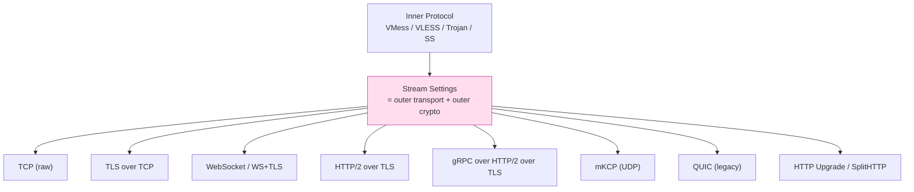
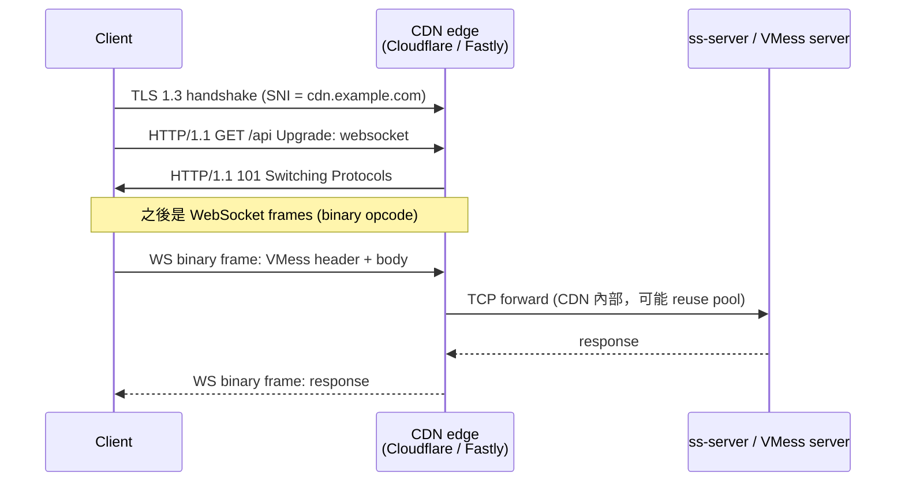
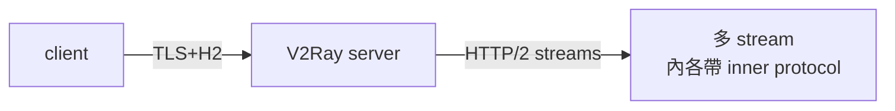
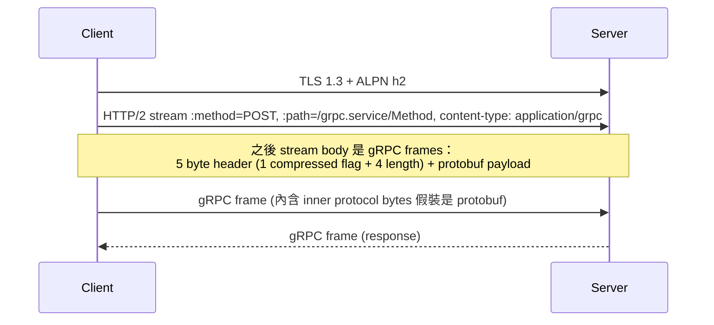
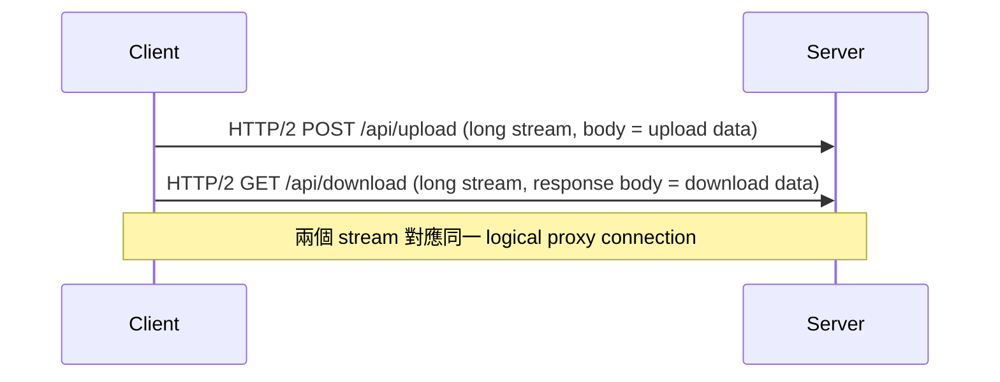
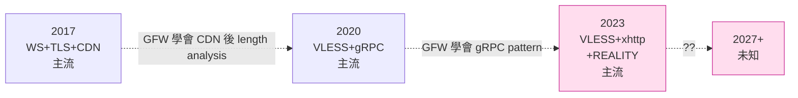

# 課堂 7.6 — V2Ray 傳輸層抽象：每一條 outer transport 的指紋

## 學前知道
- 前置課：
  - [1.13 DNS 完整解剖](../part-1-networking/1.13-dns-complete-anatomy.md)
  - [4.3 TLS 1.3 握手逐 byte](../part-4-tls-quic/4.3-tls13-handshake-byte-level.md)
  - [4.4 TLS 擴展與 JA3/JA4 指紋](../part-4-tls-quic/4.4-tls-extensions-ja3-ja4.md)
  - [7.5 VMess](./7.5-vmess.md)
- 預計閱讀時間：**60 分鐘**
- 必讀規格：
  - **RFC 9113** — *HTTP/2*（gRPC 與 H2 over TLS 的基礎）
  - **RFC 6455** — *The WebSocket Protocol*
  - **RFC 8441** — *Bootstrapping WebSockets with HTTP/2*
  - **draft-grpc-protocol** + **gRPC over HTTP/2 spec**
  - **kcp** spec（GitHub `skywind3000/kcp` README + paper-style design notes）
  - **mKCP** v2ray-core 實作（與原版 kcp 的差異）
- 必讀論文：
  - **Wang & Chen, *Inferring Mechanism behind Encrypted Channels*, IMC 2017** —— 加密通道的時序指紋
  - **van Ede et al., *FlowPrint*, NDSS 2020** —— mobile flow fingerprinting，方法論可移植到 VMess-over-WS
  - **Xue et al., *Bypassing Tunnels*, USENIX Security 2023** —— VPN/proxy 路由洩漏，VMess-over-WS 案例
  - **Bhargavan et al., *Triple Handshakes and Cookie Cutters*, IEEE S&P 2014** —— HTTPS 內外層 TLS 的綁定問題（XTLS-Vision 動機之一）
- 必讀原始碼：
  - **v2ray-core** `transport/internet/`：每個子目錄是一個 transport
    - `tcp/` — 裸 TCP（含 header obfuscation）
    - `tls/` — TLS over TCP
    - `kcp/` — mKCP（可靠 UDP）
    - `websocket/` — WebSocket
    - `http/` — HTTP/2
    - `grpc/` — gRPC
    - `quic/` — QUIC（v2ray legacy QUIC，**不是** Hysteria/TUIC）
    - `httpupgrade/` — HTTP CONNECT-style upgrade（2023 新增）
    - `splithttp/` —— 2024 SplitHTTP / xhttp（2024+ 主流之一）
  - **xray-core** `transport/internet/`：與 v2ray 同源 + REALITY、xhttp 等延伸

## 動機

VMess、VLESS、Trojan、Shadowsocks、（甚至）SOCKS5 在 V2Ray / Xray 體系裡都是「**inner protocol**」——它們各自只負責「**身份 + 加密 + 多路復用**」，**完全不負責 wire-format 偽裝**。偽裝由 outer transport 提供：



每個 outer transport 都有自己的指紋。**理解這些指紋就是理解「為什麼選 X transport 在某段時期能活，下一段時期被屠殺」**——VMess + WebSocket 在 2017–2019 是主流，2019–2021 變成 VLESS + WS+TLS+CDN，2021–2023 是 VLESS + gRPC，2023+ 是 REALITY 與 xhttp/SplitHTTP。**這條 outer transport 演化軌跡比 inner protocol 變化更頻繁**——因為 GFW 對「**透傳什麼**」的識別比對「**裡面是什麼**」容易多。

讀完應該回答：
- 為什麼 WebSocket-over-TLS-over-CDN 在 2018–2020 是 SOTA？2021 之後為什麼開始衰退？
- gRPC 為什麼比 raw HTTP/2 更難偵測？multiplex pattern 上有什麼具體差異？
- mKCP 是什麼？為什麼沒人用？
- HTTP Upgrade / SplitHTTP / xhttp 是 2023+ 的新寵——它們解了什麼前代的問題？
- 對比 5 個 outer transport：（attack surface, performance, deployment friction）三維 trade-off 怎麼分布？

---

## 核心概念

### 1. V2Ray streamSettings 的抽象

V2Ray / Xray 的 `streamSettings` 是「outer transport + outer crypto」的合稱。配置範例：

```json
{
  "streamSettings": {
    "network": "ws",          // ← outer transport
    "security": "tls",        // ← outer crypto: "none" / "tls" / "reality"
    "wsSettings": {
      "path": "/api",
      "headers": { "Host": "example.com" }
    },
    "tlsSettings": {
      "serverName": "example.com",
      "alpn": ["h2", "http/1.1"],
      "fingerprint": "chrome"
    }
  }
}
```

支援的 `network` 在 2026 年 Xray-core：
- `tcp`、`kcp`、`ws`、`http`（HTTP/2）、`grpc`、`quic`、`httpupgrade`、`splithttp`、`xhttp` (= splithttp 進化)
- `domainsocket`、`mkcp`

支援的 `security`：
- `none`、`tls`、`reality`（REALITY borrows real cert，Part 7.10–7.12）

### 2. TCP raw（+ header obfuscation）

最簡：直接 TCP 把 inner protocol bytes 透傳。

**指紋**：對 GFW 是「**high-entropy stream from byte 1**」——FEP detector 直接命中。

**Header obfuscation 補丁**：v2ray-core `tcp` transport 支援 `header.type = "http"` 模式：

```json
{
  "tcpSettings": {
    "header": {
      "type": "http",
      "request": {
        "version": "1.1",
        "method": "GET",
        "path": ["/"],
        "headers": { "Host": ["www.example.com"] }
      }
    }
  }
}
```

效果：第一個 packet 是真 HTTP/1.1 GET request，server 回 200 OK——之後才是 inner protocol。

**已死**：GFW 從 2018 起對「HTTP request 後接 high-entropy bytes」直接識別。**TCP + obfs HTTP** 模式在 2026 已無人 production 用。

### 3. TLS over TCP

`security = "tls"`：在 TCP 上加 TLS 1.3 握手，inner protocol byte 在 TLS application data 內。

**指紋來源**：
- **JA3/JA4 ClientHello fingerprint**——若 V2Ray 用 Go 標準 `crypto/tls`，**fingerprint 是「Go default」明顯非 browser**（Part 4.4 詳講）。Xray-core 用 **utls** 模仿 Chrome/Firefox/iOS 的 ClientHello。
- **SNI**——明文，洩漏 destination domain。**即使 ECH（Encrypted Client Hello）部署也只藏 SNI 一個 byte 序列，外部仍可推斷**。
- **Certificate**——V2Ray 自簽 cert vs Let's Encrypt vs CDN edge cert，前兩者**直接被識別**。

**經典問題**：`fingerprint: "chrome"` 設了，但**內層 application data byte sequence 仍是 high-entropy** → ML-based classifier 仍能區分「真 Chrome HTTPS」與「VMess-over-TLS」。**Wang-Chen IMC 2017 的時序測量**直接證明此。

**這就是 REALITY 出場的動機**——直接借用真網站的 TLS handshake，**完全擺脫自己生 ClientHello/ServerHello/Certificate**。Part 7.10。

### 4. WebSocket over TLS

`network = "ws", security = "tls"`：



**這個設計在 2017–2020 是 SOTA**：

- **CDN 包裝**：流量先進 Cloudflare，再回源 VPS。GFW 看到的 SNI 是 `cdn.example.com` → **想封 CDN 等於封整個 Cloudflare**——不可能。
- **Path 偽裝**：URL `/api` 看起來像 REST endpoint。
- **WebSocket 是合法 application**：browser、IM、real-time game 都用。
- **CDN edge IP rotation**——CDN 給的 IP 每天變，GFW 沒法以 IP 為單位封。

**但 2021 起的衰退**：

- **TLS-in-TLS 指紋**：CDN 邊緣是 TLS 1.3，inner WS payload 是 VMess 的 AEAD chunk——**chunk size pattern + ACK timing 與真實 web app（API call、chat heartbeat）顯著不同**。
- **CDN 自己升級 ML 流量分類**：Cloudflare 開始識別「**proxy-like traffic**」並 throttle / suspend 帳號。
- **Path = `/api` 太常見**：自動化 scanner 試 `/api`、`/ws`、`/v2ray` → 任何 path-trigger 配置易被探測。
- **GFW 學會 「CDN 過濾後仍可看 length pattern」**：CDN 與 origin 之間 TCP 的長度分布、重傳模式仍是指紋。
- **Cloudflare ToS 變嚴**：禁止「primarily proxy」用途，**運營風險陡增**。

**結論**：WS+TLS+CDN 在 2026 年仍是「**可用但壞**」的選擇——個人用沒問題，多用戶共用 CDN domain 易被 throttle。

### 5. HTTP/2 over TLS（V2Ray `network: "http"`）



**設計思路**：HTTP/2 的多 stream 機制讓「**同一 TCP+TLS connection 並發多個 proxy connection**」——大幅減少 TLS handshake 開銷（一次握手後 N 個 inner connection 共用）。

**spec 細節**：
- 每 stream 一個 inner protocol session。
- v2ray HTTP/2 transport 用 `:method = PUT`（不 CONNECT！）+ `:path = /` + body 是 inner protocol bytes。
- **這個 PUT 用法是 V2Ray 自創**——不符合 RFC 7231 PUT semantics，**直接被 GFW 識別**（H2 PUT 通常是 file upload，不是 long-lived stream）。

**指紋**：「**用 PUT 開長連線**」這個行為與真實 H2 應用差異極大——直接被識別。**已基本死**，2023 後 production 不用。

### 6. gRPC over HTTP/2 over TLS

`network = "grpc"`：



**為什麼 gRPC 比 raw H2 強**：

- **gRPC 是真正 widely-deployed protocol**：Google、Microsoft、各大企業內部 RPC——**真實流量背景大**。
- **Path 結構真實**：`/<service>.<Service>/<Method>` 看起來像合法 RPC。
- **content-type: application/grpc** 是合法 MIME type。
- **HTTP/2 stream 的 length 分布**與真實 gRPC 接近（gRPC 通常有 varying small-to-medium message sizes）。

**指紋來源**：
- **bidi streaming pattern**：proxy 的 gRPC 通常**單一長 stream**（持續 read/write），真實 gRPC 多是**多個短 stream**（unary calls）。streaming gRPC 雖然存在，但比例不同。
- **HTTP/2 PING/SETTINGS 行為**：V2Ray 的 H2 stack（`golang.org/x/net/http2`）的 PING interval、WINDOW_UPDATE 模式與真實 gRPC server（grpc-go）有微差。
- **Connection lifetime**：proxy 連線通常 1+ 小時，真實 gRPC unary 通常秒級。

**2026 年地位**：仍是 **production 主流之一**，配 utls fingerprint + 真 cert 仍可用。但 GFW 已開始針對 gRPC stream pattern 寫規則（社群觀察 2024 起被限速）。

### 7. mKCP — V2Ray 的「可靠 UDP」實驗

`network = "kcp"` / `mkcp`：

**KCP** 是 skywind3000 寫的 user-space reliable UDP protocol（**算法**：與 TCP 類似的 ARQ + 滑動窗口，但更激進的重傳與 RTT 估計）。**mKCP** = V2Ray 加密 + obfuscate header 的 KCP。

**動機**：

- TCP-over-TCP 性能差（HOL blocking 雙倍）。KCP 提供「user-space 的快重傳 reliable transport」可避開。
- UDP 在某些路徑比 TCP 不易丟包（特別在跨國高 RTT 鏈路）。

**設計問題**：

- **KCP 的 packet header 結構獨特**：4 byte conv + 1 byte cmd + 1 byte frg + 2 byte wnd + 4 byte ts + 4 byte sn + 4 byte una + 4 byte len。**對 GFW 是「unique fingerprint」**。
- mKCP 加 header obfuscation：把 header XOR 隨機值。但**整體 packet 大小分布仍非 video/voice/game UDP application**——時序與長度分布獨特。
- **CPU 開銷高**：user-space ARQ 比 kernel TCP 慢 5-10×。

**結論**：mKCP 在 2026 已基本廢棄。**對 G6 啟示**：KCP 的「user-space 可靠傳輸」思路是 QUIC 的前身——但 QUIC 做得更好（Part 8 詳講）。

### 8. V2Ray QUIC（legacy）

`network = "quic"`：V2Ray 的 QUIC transport 是 2018 年早期 quic-go 實作 + V2Ray 自己加的 obfs。

**問題**：
- 用早期 IETF QUIC draft（draft-23 之前），**與 RFC 9000 不相容**。
- **QUIC initial packet 不是真實 web QUIC**——SNI、ALPN、token 都是 V2Ray 自填。
- **指紋極獨**：GFW 識別率 > 90%。

**已死**。**Hysteria 與 TUIC 是真正的 production-grade QUIC proxy**——Part 8 主場。

### 9. HTTP Upgrade / SplitHTTP / xhttp（2023+ 新寵）

#### HTTP Upgrade (`network = "httpupgrade"`)

**設計**：

```http
GET /api HTTP/1.1
Host: cdn.example.com
Upgrade: websocket    ← 但其實不是 WS
Connection: Upgrade
Sec-WebSocket-Key: dGhlIHNhbXBsZSBub25jZQ==
Sec-WebSocket-Version: 13

HTTP/1.1 101 Switching Protocols
Upgrade: websocket
Connection: Upgrade
Sec-WebSocket-Accept: s3pPLMBiTxaQ9kYGzzhZRbK+xOo=

[之後是 raw inner protocol bytes，不再是 WS frame]
```

**與 WS 的差異**：握手看起來像 WS，但**握手後不用 WS frame 封裝**——直接 raw bytes。**省去 WS frame 的 header overhead（每 frame 2-14 byte）+ XOR 解碼開銷**。

**好處**：
- CDN 能 proxy WS handshake。
- 後續不受 WS frame 限制——可以走任意 binary。

**缺點**：
- 嚴格說違反 RFC 6455（握手後應走 WS frame）。
- CDN 若做 deep WS frame 解析 → fail。實務上多數 CDN 只看握手不看後續，所以能用。

#### SplitHTTP / xhttp (`network = "xhttp"`)

**設計**（2024 主流）：把「**上行**」與「**下行**」拆成兩條獨立 HTTP/2 stream：



**動機**：
- 真實 web app（聊天、direct upload）**確實**有「**長 POST + 長 GET**」的 pattern。
- CDN 端正常 buffer 處理。
- HTTP/2 multiplex 仍生效。

**指紋優勢**：
- 上下行分離模擬 web 應用真實 流量分布更接近。
- 可選 `mode: "stream-up"` / `"stream-down"` / `"packet-up"` 等多種 sub-mode。

**SplitHTTP 是 2024-2026 期間最後活著的 V2Ray transport** 之一。

### 10. 對 5 個 outer transport 的 3 維度比較

| Transport | Censorship resistance（2026）| Performance | Deployment friction |
|---|---|---|---|
| TCP raw | ❌ 死 | ⭐⭐⭐⭐⭐ | ⭐ 低（無 cert）|
| TCP + obfs HTTP | ❌ 死 | ⭐⭐⭐⭐⭐ | ⭐ 低 |
| TLS | ⚠ 中（utls 救援，但 cert/SNI 仍洩） | ⭐⭐⭐⭐ | ⭐⭐ 中（要 cert）|
| WS+TLS+CDN | ⚠ 中等（CDN ToS 風險）| ⭐⭐⭐（CDN 跳轉開銷）| ⭐⭐⭐ 高（CDN 設定）|
| H2 PUT | ❌ 死 | ⭐⭐⭐⭐ | ⭐⭐ |
| gRPC | ✅ 仍活（2024+ 開始衰退）| ⭐⭐⭐⭐ | ⭐⭐⭐ |
| mKCP | ❌ 死 | ⭐⭐ | ⭐ |
| V2Ray QUIC | ❌ 死 | ⭐⭐⭐ | ⭐ |
| httpupgrade | ✅ 仍活 | ⭐⭐⭐⭐ | ⭐⭐⭐ |
| xhttp / splithttp | ✅✅ 主流 | ⭐⭐⭐⭐ | ⭐⭐⭐ |
| **REALITY** | ✅✅✅ SOTA | ⭐⭐⭐⭐ | ⭐⭐ | (Part 7.10 主場) |

### 11. 為什麼這個演化軌跡是必然



**結構性觀察**：每 2-3 年一次 outer transport 換代，每次換代背後都是「**GFW 學會了識別前代模式**」。**這是貓鼠遊戲在 traffic-analysis 層的具體表現**。

**對 G6 的意義**：outer transport plug-and-play 模式（V2Ray/Xray 路線）的優點是**可快速換代**，缺點是**任何當前 transport 都會在 2-3 年後過時**。G6 的設計策略：

1. **內生 obfuscation**：第一個 byte 起就是某個合法 protocol 的 looks（不是疊一層）。
2. **Multiple-disguise**：同一個 wire format 能 negotiate 偽裝成 TLS、QUIC、HTTP/3 等——避免單點識別。
3. **不依賴 CDN**：CDN 是運營風險，不是長期方案。

---

## 與我們協議設計的關聯

1. **「outer transport 抽象」是 V2Ray 路線的雙刃劍**：可換代但每次都需 spec + impl 雙重升級。G6 採「**內生偽裝層**」，避開 outer transport 的 churn。
2. **不要重新發明 reliable UDP**：mKCP 的失敗證明此。G6 用 QUIC 為基礎（Part 11.3），不自寫 UDP ARQ。
3. **CDN 不是長期方案**：營運風險 + 流量分析仍可穿透。但**短期可用作 traffic source mixing**——Part 11.6 可考慮。
4. **「真實協議」的指紋來自實際 application 行為**：JA3 對齊 Chrome 是必要不充分。**packet length / timing 分布**才是 ML detector 的 feature。G6 設計時 Part 10 traffic analysis 必須定量檢測。
5. **Stream multiplexing 必選**：H2/gRPC/xhttp 都靠 multiplex 減少 TLS 握手開銷。G6 走 QUIC 內生 multiplex，比 H2 multiplex 更乾淨（無 TCP HOL blocking）。
6. **HTTP-Upgrade trick 值得抄**：握手後脫離原 protocol 的 frame 限制，是工程級別的 trick。G6 也可考慮 handshake-then-raw 設計。

---

## 動手

實驗 A（30 min）：**抓 5 種 outer transport 的 ClientHello + 第一個 application packet**

啟動同一個 VLESS server 的 5 個 inbound（不同 port），各用一個 outer：tls / ws+tls / grpc / httpupgrade / xhttp。各跑 10 個 HTTPS request via curl。

```bash
# 對每個 port
sudo tshark -i lo0 -f "port 8001" -Y "tls.handshake.type==1" -T fields -e tls.handshake.ciphersuite -c 1
```

對比 ClientHello 是否一致（utls 應該都一樣）。然後抓**第一個 application data packet** size 分布——5 個 transport **應有顯著差異**。

實驗 B（30 min）：**讀 xray-core 的 transport 實作**

挑 `transport/internet/grpc/`：

- `dial.go`：client 撥號流程
- `hub.go`：server listener
- `service.go`：gRPC service 註冊（V2Ray 把自己包裝成 unary RPC service）
- `encoding.go`：gRPC frame ↔ raw bytes

**回答**：V2Ray 怎麼把 binary 流套進 gRPC 的「length-prefixed protobuf message」結構？是 client/server-side streaming 還是 bidi？這對 server 端 H2 stream lifetime 的影響？

實驗 C（45 min）：**對比 utls 與 native crypto/tls 的 ClientHello fingerprint**

```go
import "github.com/refraction-networking/utls"

config := &utls.Config{ServerName: "example.com"}
conn := utls.UClient(rawConn, config, utls.HelloChrome_120)
conn.Handshake()
```

對比同樣設定的 `crypto/tls`：

- 用 `tlsfingerprint.io` 或本地 ja4 工具計算 fingerprint。
- utls Chrome 120 的 ja4 應該與真 Chrome 120 一致；`crypto/tls` 是 unique「Go fingerprint」。

---

## 自我檢查

1. WS+TLS+CDN 在 2018 是 SOTA，2024 後衰退。具體是哪些 GFW 能力升級導致的？至少列 3 條。
2. gRPC 比 V2Ray HTTP/2 PUT 更難識別——為什麼？分析「真實 gRPC traffic 的特徵」與「proxy gRPC traffic 的特徵」差別。
3. mKCP 為什麼徹底死掉？除了 KCP header fingerprint，還有什麼結構性問題？
4. SplitHTTP / xhttp 把上下行分到兩個 stream，這個設計**真**讓 traffic 分布更像 web app 嗎？舉一個它仍會洩漏的維度。
5. 對於「**outer transport 每 2-3 年換代**」這個歷史模式，你的 G6 設計打算如何避免被同樣的迭代追上？至少 3 個策略。
6. utls 模仿 Chrome 120 ClientHello 完美——這夠了嗎？真 Chrome 與 V2Ray over TLS 在哪些 **TLS 握手後** 的維度仍可被區分？

---

## 延伸閱讀

- **V2Fly 文檔**：每個 transport 的 official doc
- **xray-core 文檔**：xhttp / SplitHTTP 設計
- **utls** (`refraction-networking/utls`)：替換 ClientHello fingerprint 的 Go 庫，Tor pluggable transport 與 Xray 都用
- **quic-go**：legacy V2Ray QUIC 與 Hysteria/TUIC 都基於它
- Bock et al., *Towards Comprehensive Detection of HTTPS-based Censorship Circumvention*, IMC 2020

---

## 研究級補遺

### 1. 學界詞彙

| 口語 | 學術術語 | 出處 |
|---|---|---|
| 「outer transport」 | tunneling carrier / cover protocol | Houmansadr S&P 2013 |
| 「multiplexing」（H2/gRPC）| stream multiplexing | RFC 9113 §1 |
| 「TLS-in-TLS」 | nested TLS / encapsulated TLS | (informal; observed in WS+TLS+CDN) |
| 「ClientHello fingerprinting」 | active TLS fingerprinting | Frolov-Wustrow IMC 2019 / Althouse JA3 |
| 「flow correlation」 | passive flow watermarking | Houmansadr USENIX Sec 2014 |

### 2. 對手分類學

對 outer transport 的攻擊面分類：

| 對手能力 | 影響的 transport |
|---|---|
| TLS ClientHello fingerprint | 所有 TLS-based |
| SNI inspection | 所有 TLS-based（除 ECH） |
| Path/header analysis | WS / H2 / gRPC / httpupgrade |
| Length pattern ML classifier | 所有 |
| Inter-packet timing analysis | 所有 |
| HTTP/2 PING/SETTINGS profiling | H2 / gRPC |
| Long-lived stream detection | H2 / gRPC / xhttp |
| CDN edge IP enumeration | WS+CDN |
| CDN-to-origin TCP analysis | WS+CDN |

### 3. 形式化定義

**「Carrier indistinguishability」**（從 Houmansadr 2013 起的 informal goal，後續 Tschantz et al. SP 2016 形式化）：

設真實 carrier traffic 分布 $D_{\text{real}}$（如 WS-to-CDN normal app）、proxy traffic 分布 $D_{\text{proxy}}$（如 WS-to-CDN VMess inside），則 advantage：

$$
\text{Adv}^{\text{distinguish}}_{\mathcal{B}} = |\Pr[\mathcal{B}(D_{\text{real}}) = 1] - \Pr[\mathcal{B}(D_{\text{proxy}}) = 1]|
$$

**Houmansadr 2013 的核心結果**：對任何 mimicry-based design，存在 $\mathcal{B}$ 使得 $\text{Adv} = 1 - \text{negl}$——也就是 mimicry **不可能完美**。

**但**：「不完美」的 advantage 是否足以實際識別取決於 base-rate（真實 carrier 流量量）。CDN 流量極大（Cloudflare daily PB 級），所以 advantage 0.001 對應 false positive rate 仍可能讓 GFW **不敢實際 deploy** detection。**這是 CDN-based 路線最後的救命稻草**。

### 4. 領域的關鍵論文 / 規格 / 原始碼

- Houmansadr et al., *The Parrot is Dead*, IEEE S&P 2013（已讀: 待 fetch）
- Tschantz et al., *SoK: Towards Grounding Censorship Circumvention*, IEEE S&P 2016
- Wang & Chen, *Inferring Mechanism behind Encrypted Channels*, IMC 2017
- van Ede et al., *FlowPrint*, NDSS 2020
- Frolov et al., *The use of TLS in Censorship Circumvention*, NDSS 2019
- **Xray-core** `transport/internet/` 全集 —— production 工程主場
- **utls** `refraction-networking/utls` —— TLS fingerprint 工程

### 5. 我們協議的座標 / 設計取捨

```mermaid
flowchart TD
    OUTER[V2Ray "stream settings"<br/>outer transport 抽象]
    OUTER -- 優點 --> P1[可換代抗審查]
    OUTER -- 優點 --> P2[inner protocol 簡單]
    OUTER -- 缺點 --> N1[每 2-3 年強制升級]
    OUTER -- 缺點 --> N2[偵測曲面巨大: TLS+H2+grpc 任一層可被識別]
    OUTER -- 缺點 --> N3[CDN 運營風險]

    G6[G6: 內生偽裝]
    G6 -- 設計 --> D1[wire 第 1 byte 起就像 TLS/QUIC]
    G6 -- 設計 --> D2[多 disguise pattern 一個 wire 多個 cover]
    G6 -- 設計 --> D3[不依賴 CDN]

    classDef ours fill:#fde,stroke:#c39
    class G6,D1,D2,D3 ours
```

### 6. 必追資源 / 社群入口

- **xray-core** GitHub Discussions（@RPRX 主導，REALITY、xhttp、Vision 等設計討論）
- **v2fly** GitHub
- **net4people/bbs**
- **sing-box** GitHub（@nekohasekai 對各 transport 重寫的視角）

### 7. 開放問題

1. **「outer transport」抽象是否能用 ML 自動產生 cover？** 例如：給定 Chrome 真實 traffic 分布，自動 generate 一個 protocol 滿足相同 length/timing/ack pattern。**Bock et al. Geneva** 是相關方向（GA）；但學界還沒看到「**自動 generate 整個 cover protocol**」的成果。
2. **CDN 公司是否會在未來主動關閉 proxy use case？** Cloudflare 2023 起 ToS 已改——若全球 CDN 都禁，所有 WS+CDN 路線歸零。研究方向：能否設計一個 protocol，**讓 CDN 在不知情的情況下永遠當 proxy carrier**——這已經是技術 + 經濟 + 法律的綜合問題。
3. **HTTP/3 與 MASQUE 是否會吃掉所有 outer transport？** 如果 IETF MASQUE 廣泛部署，所有「proxy over HTTP/3」會收斂到 RFC 9298——對 G6 是機會（IETF 標準化）也是危險（GFW 可針對 RFC 9298 寫規則）。
