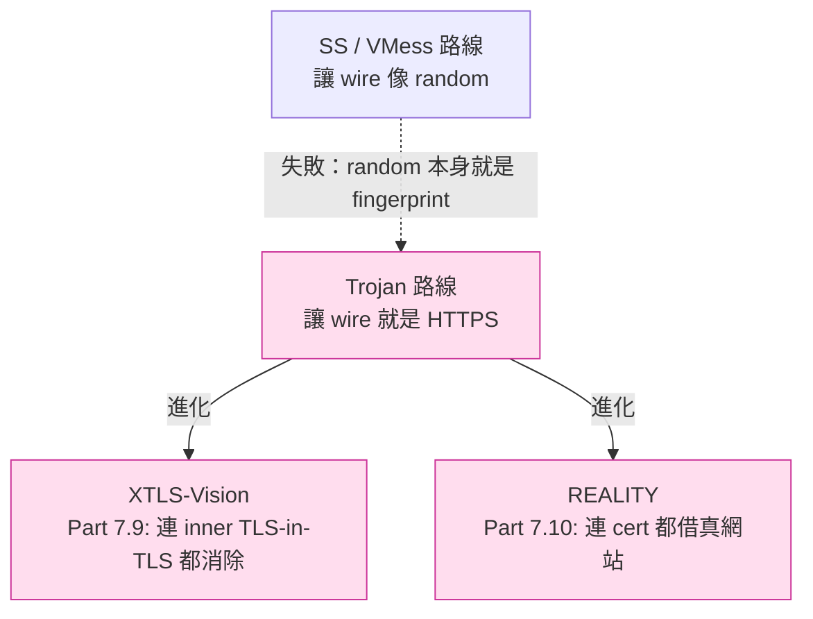
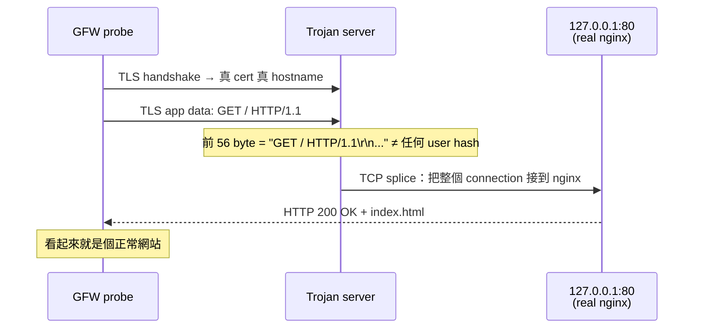
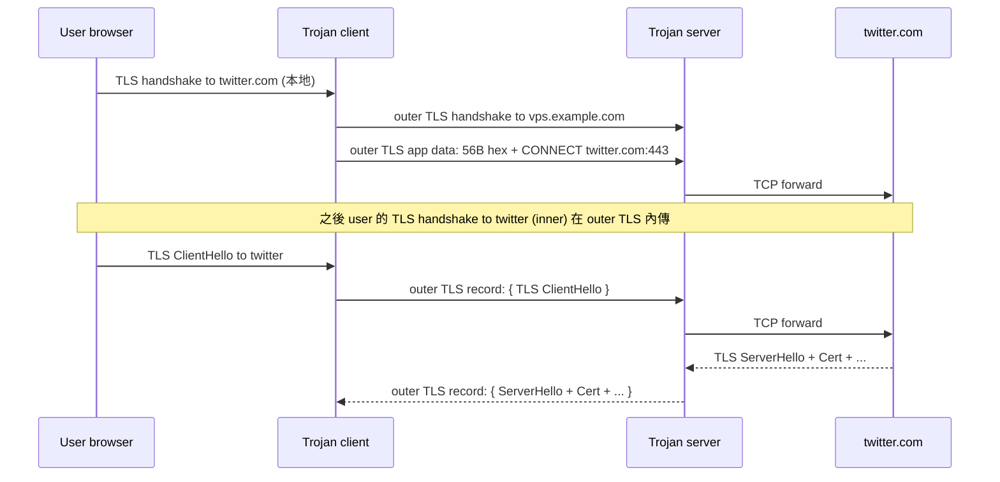
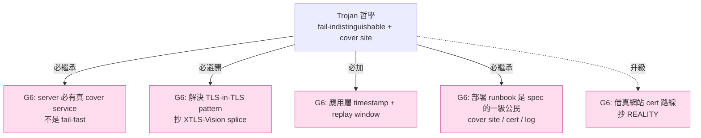

# 課堂 7.7 — Trojan 完整解剖：哲學與工程都極簡的「假裝是 HTTPS」

## 學前知道
- 前置課：
  - [4.3 TLS 1.3 握手逐 byte](../part-4-tls-quic/4.3-tls13-handshake-byte-level.md)
  - [4.4 TLS 擴展與 JA3/JA4 指紋](../part-4-tls-quic/4.4-tls-extensions-ja3-ja4.md)
  - [7.1 SOCKS / HTTP CONNECT](./7.1-socks-http-connect.md)
  - [7.5 VMess](./7.5-vmess.md)
  - [7.6 V2Ray transports](./7.6-v2ray-transports.md)
- 預計閱讀時間：**40 分鐘**
- 必讀規格：
  - **Trojan protocol** —— `trojan-gfw.github.io/trojan/protocol`，[`notes/specs/trojan.md`](../../notes/specs/trojan.md)
  - 原作者：**Trojan-GFW** project (2018, GitHub `trojan-gfw/trojan`)
- 必讀論文：
  - **Frolov, Wampler, Wustrow, *Detecting Probe-resistant Proxies*, NDSS 2020** —— [`notes/papers/frolov-probe-resistant.md`](../../notes/papers/frolov-probe-resistant.md)（已讀）
  - **Wu et al., *FEP*, USENIX Security 2023** —— Trojan 仍中招的證明
  - **GFW.report 2024+ TLS-in-TLS detection writeup**（持續觀察 Trojan / VLESS over TLS 的新識別技術）
- 必讀原始碼：
  - **trojan-gfw/trojan**（C++ reference impl）
    - `src/proto/trojanrequest.cpp` —— request parser
    - `src/session/clientsession.cpp` —— client write
    - `src/session/serversession.cpp` —— **重點**：fallback redirect 邏輯
    - `src/proto/socks5.h` —— ATYP/CMD enum
  - **sing-box** `protocol/trojan/protocol.go`
  - **xray-core** `proxy/trojan/`
  - **trojan-go** （Go 實作，社群維護）

## 動機

Trojan 是 2018 年 trojan-gfw 提出的協議，**核心哲學一句話**：

> **「不要再嘗試把流量加密成 random（SS / VMess 路線）。直接讓它就是 HTTPS——一台跑 nginx 的真伺服器，附帶一個 hidden auth path。」**

這個哲學在當時是革命性的——SS、VMess 路線都在「**讓 wire 看起來像 random**」（fully-encrypted），Trojan **直接放棄**這個努力，**反過來**讓 wire 看起來**就是真的 HTTPS**。

Trojan 對協議學習者的價值：

1. **極簡設計**：56 byte SHA224 hex + SOCKS5-style request——**整個 spec 不到一頁 markdown**。
2. **第一個 production 級的「fallback to real server」設計**——active probing 的應對方式從「fail-fast」變成「**裝作不知道**」。
3. **對 outer TLS 的徹底依賴**——徹底依賴**一個正確設定的 nginx + Let's Encrypt cert**，協議自己幾乎沒做任何 crypto。
4. **後來被 VLESS + REALITY 完全取代**，但**設計哲學被繼承**。

讀完應該回答：
- Trojan 的 56 byte hex auth 為什麼是 SHA224 而不是 SHA256 / BLAKE3？
- Fallback redirect 是怎麼工作的？為什麼它是 active probing 的根本解？
- 為什麼 Trojan **沒有 anti-replay**？這是 spec 漏洞還是設計選擇？
- Trojan 的「TLS-in-TLS 指紋」是什麼？2024+ GFW.report 的攻擊細節？
- 為什麼 Trojan 在 2026 仍**廣泛被用**，但**長期取勝者**是 REALITY？

---

## 核心概念

### 1. Trojan 的設計哲學：「**不要試圖隱藏，要試圖混入**」



**核心 insight**：在 GFW 的 ML classifier 裡，「**整個流量分布是真實 HTTPS app（Wikipedia、Twitter）**」遠比「**整個流量分布是 random**」更難識別——前者**真的是 HTTPS**，只是收到 password 後內容變成 proxy。

### 2. Trojan wire format

完整 byte layout（在 outer TLS 之內）：

```
| hex(SHA224(password)) | CRLF | Trojan Request | CRLF | Payload |
| 56 bytes              | 2 B  | variable       | 2 B  | …       |
```

**Trojan Request**（mirrors SOCKS5）：

```
| CMD | ATYP | DST.ADDR | DST.PORT |
| 1 B | 1 B  | variable | 2 B (BE) |
```

- `CMD`: `0x01` CONNECT, `0x03` UDP ASSOCIATE
- `ATYP`: `0x01` IPv4 / `0x03` DOMAINNAME / `0x04` IPv6（與 SOCKS5 §4 完全一致）

**SOCKS5-mirroring 是設計取巧**：

- Trojan server 的 inbound 處理可以直接重用 SOCKS5 dispatcher。
- DST.ADDR / DST.PORT format 完全一樣 → 路由邏輯一致。
- **缺點**：暴露了「**這是 SOCKS5-style proxy**」的結構。但對手已知是 proxy，所以這個信息洩漏無害——重點在 **wire-format 偽裝層（outer TLS）**。

**UDP datagram framing**（在 TLS stream 內）：

```
| ATYP | DST.ADDR | DST.PORT | Length | CRLF | Payload |
| 1 B  | variable | 2 B      | 2 B    | 2 B  | …       |
```

UDP 透過 TLS stream 多工——**沒有獨立 UDP socket**。**每個 datagram 一條 record**。

**CRLF 分隔符**：兩個 `\r\n`（auth 後、request 後）。**為什麼？**——讓 wire 看起來「**模糊接近 HTTP**」（HTTP/1.1 的 header lines 用 CRLF 分隔）。**實際上**這個偽裝**極弱**：第一段 56 byte 是純 hex ASCII，與 HTTP 完全不同。但 CRLF 至少保留了「**ASCII-friendly**」這個性質——對 deep packet inspection 中的 ASCII heuristic 有最低限度幫助。

### 3. Auth：56 byte hex of SHA224(password)

```python
import hashlib
auth_token = hashlib.sha224(password.encode()).hexdigest().encode()  # 56 byte ASCII hex
```

**為什麼 SHA224 而不是 SHA256？**

- SHA256 → 64 byte hex
- SHA224 → 56 byte hex  

**理由**：原作者沒明說，但**最合理推測**：56 byte ASCII hex「**看起來像某個 base64 token 或 session ID**」（典型 web cookie 大小）。SHA256 → 64 byte hex 太長太規則，視覺上像 SHA256 hash dump。**這是純 aesthetic 決定**——對密碼學沒任何影響（SHA224 的 collision resistance 是 $2^{112}$，遠超實際需要）。

**Server 端**：

```cpp
// trojan-gfw/trojan/src/session/serversession.cpp
std::string in_password = std::string(in_data, in_data + 56);
auto it = config.password.find(in_password);  // O(1) hash lookup
if (it == config.password.end()) {
    // 不是合法 user → fallback redirect
    redirect_to(config.remote_addr, config.remote_port);
    return;
}
// 是合法 user → parse Trojan request, forward
```

**O(1) lookup**——比 VMess 的 multi-user trial decryption 簡單得多。但**代價**：所有 user 的 hash 必須**預先載入**——加 user 需 reload server。

### 4. Fallback redirect：active probing 的根本解



**這是 Trojan 的核心 anti-probing 機制**：

1. Server 監聽 443 port，front 是 nginx **真的同時運行**——nginx 處理一般 web request，Trojan 處理帶有 hex auth 的 request。
2. Trojan server config 指定 `remote_addr: 127.0.0.1, remote_port: 80`——**fallback 到本機真 nginx**。
3. 當 client 的第一個 TLS app data 不以合法 56 byte hex 開頭，server **不關閉**——**直接把 connection splice 到 nginx**。
4. nginx 看到 `GET / HTTP/1.1\r\n...` → 回 index.html。
5. **GFW probe 看到完美的 HTTPS 網站**，無法判定是否為 proxy。

**這個設計取代了 SS-AEAD 的「fail-fast」反面教材**——fail-fast 本身就是 fingerprint。Trojan 的 fallback 是 **「fail-indistinguishable」**。

**部署實戰要點**：

- Server 真的要跑一個 **可信的 cover website**——空白 default page、`Welcome to nginx!`、或「coming soon」**全部死刑**（GFW probe 看到這種就標記為 high-suspicion VPS）。
- 推薦：完整 blog / github page mirror / 靜態 doc website。
- **Cover site 內容應該與 IP 的 ASN、地理位置、DNS 反查一致**——例如香港 IP + 中國旅遊網站邏輯通，香港 IP + 俄羅斯論壇邏輯不通。
- **Cover site 的訪問日誌**也是 fingerprint——nginx 應該設 access log + 真的有人訪問（或 cron job 模擬）。

### 5. 為什麼 Trojan **沒有** anti-replay

Spec 明確：「**No anti-replay at the application layer.**」

理由分析：

1. **TLS 1.3 自帶 replay-protection**（RFC 8446 §8）——TLS record 有 sequence number，session key per-handshake unique，passive replay 被擋。
2. **Active replay** 需要：
   - 攻擊者錄下完整 TLS session（含 finish）。
   - 重放整個 TLS handshake → server 產生**新的** session key → record 解不開。
   - 所以**完整 TLS replay 不可能**。
3. **唯一風險**：password hash 洩漏（cert 私鑰被偷 + middlebox 解了 TLS）→ 攻擊者拿到 56 byte token → 永遠能 auth。**這是 spec 漏洞**——**沒有 timestamp window，沒有 counter**。

**修補建議**：

- Spec 級別：加 timestamp 8 byte 進 auth 段，server 用 ±30s window。
- 實作級別：trojan-go 與 sing-box 沒有實作這個。**生產上幾乎沒人關心** —— 因為 cert 私鑰洩漏本身已是災難，re-rotate password 是標準回應。

**對比 SS-2022**：SS-2022 強制 timestamp + replay window（Part 7.4）——這是更嚴謹的設計。**Trojan 在「依賴 TLS 救命」這件事上把蛋全放一個籃子**。

### 6. TLS-in-TLS 指紋：Trojan 的命門

當 Trojan client proxy 一個 HTTPS 目標（user 訪問 `https://twitter.com`）：



**指紋**：

- **outer TLS record sizes 序列**就是 inner TLS handshake 的 sizes 序列！
  - inner ClientHello 通常 ~512 byte → outer record ~550 byte
  - inner ServerHello + Cert + finish 通常 1500-3500 byte → outer record 同等大小
  - inner application data 流量分布跟 inner application（HTTPS web）一致

- **inner-outer record size correspondence**：對 GFW 是強信號——**「outer TLS 的 record size 序列符合典型 inner TLS handshake 的 size pattern」** = **這是一個 nested TLS proxy**。

**Frolov-Wustrow NDSS 2020 系統測量了這個**——對 Trojan、ShadowTLS、naïve TLS proxy **全部命中**。

**GFW.report 2024+ 的進一步觀察**：

- TLS-in-TLS 不只 size pattern，還有 **inter-record timing**：inner TLS 握手有特徵性的 RTT pattern，outer TLS 的 record 之間 timing 跟著走。
- **proxy 用 stream cipher (TLS 1.3 ChaCha20-Poly1305) 時 record 開頭是固定 type byte（0x17 = application data）**，連續多個 0x17 + 1500 byte 是「**outer 透傳 inner application data**」的 fingerprint。
- 結果：GFW 在 2024+ 已開始用「TLS-in-TLS」啟發式對 Trojan、VLESS over plain TLS 識別。**Trojan 在 censored network 的存活率 2026 已顯著下降**。

**修補方向**：
- **XTLS-Vision** (Part 7.9)：對 inner TLS application data 部分 splice，**不再經 outer 加密** → 消除 TLS-in-TLS pattern。
- **REALITY** (Part 7.10)：outer 完全不是自家 cert，借用真網站 → 連 outer 自身都無 fingerprint。

### 7. Trojan 對 cover site 的 operational 要求

社群多年實戰經驗總結：

| 部署細節 | 推薦 | 反例 |
|---|---|---|
| Cert | Let's Encrypt + auto-renew | 自簽 cert（**死刑**）|
| Domain | 已有歷史的 domain（>6 mo） | 新註冊 domain + nginx default |
| Cover site | 真實 blog / 靜態文檔 | "Welcome to nginx!" |
| nginx access log | 啟用 + 真的有訪問 | 空 log |
| TLS server config | Mozilla intermediate profile | 自選 ciphers（指紋） |
| HSTS / OCSP stapling | 配 | 不配（看起來像新部署 server） |
| Reverse DNS | 與 domain 相關 | 與 domain 無關 |
| CDN | 可選（多一層）| 直接 origin（IP 日誌可被 GFW 收集）|

**這些細節證明 Trojan 是「協議 + 運維」一體**——你不能只管 protocol 不管 nginx。

### 8. Trojan-Go 與其他改進版

`p4gefault/trojan-go`（Go 重寫）增加：

- **WebSocket transport**（trojan-over-ws-over-tls）—— 同樣有 WS+TLS 路線的所有特性
- **Mux 多路復用**——客戶端把多個 trojan session 走一條 TLS connection（類似 H2 multiplex）
- **CDN compatibility**：對 Cloudflare 友好的 path 設計
- **Forward proxy mode**：trojan server 同時可作 forward web proxy

**社群影響**：trojan-go 在 2020-2022 是 deploy 主流。但 2023+ 被 sing-box 統一接管（sing-box 內建 trojan inbound/outbound）。

### 9. 為什麼 Trojan 在 2026 仍**廣泛被用**

主要是**運維簡單**：

- 一個 nginx + 一個 trojan-go binary + Let's Encrypt → 30 分鐘部署完成。
- 對個人 user 的「**翻一個 IP**」場景**完全夠用**。
- **與 cover site 的整合**比 REALITY 更「自然」——因為真的有 nginx 在跑。

**長期取勝者是 REALITY**：

- REALITY 不需要自己跑 nginx——直接「借」真網站的 cert。**運維更簡單**。
- REALITY 沒有 TLS-in-TLS 問題——outer 完全是真網站的 ServerHello（**實際就是來自真網站的 ServerHello**）。
- REALITY 的 cert chain 一定能通過 cert pinning 等驗證。

**但 REALITY 的部署門檻**（理解 X25519 auth、short_id、dest 配置）比 Trojan 高，所以**短期 Trojan 不會死**。

---

## 與我們協議設計的關聯

1. **「Fail-indistinguishable」勝過「fail-uniform」**：Trojan 的 fallback redirect 是 active probing 的根本解。G6 必有此機制——server 在 auth 失敗時 **真的轉發到一個 cover service**（不是模仿 cover service）。
2. **Cover site = 一級設計考量**：G6 不能只給 spec，必給「**部署運維 best practice**」（cover site 選擇、cert 來源、訪問日誌生成）。Part 11.13 deployment doc。
3. **TLS-in-TLS 必修**：靠外層 TLS 已不夠（2024 後）。G6 必對 inner TLS 作特殊處理——**XTLS-Vision splice 思路必抄**。Part 7.9 + Part 11.5。
4. **REALITY-like 設計**：直接借用真網站證書是長期方向。Part 7.10–7.12 + Part 11.6 設計重點。
5. **應用層 anti-replay 仍應加**：Trojan 完全依賴 TLS replay protection 是冒險。G6 至少要 timestamp + window，即使「冗餘」。
6. **Spec 簡單性**：Trojan 半頁 spec 是工程典範。**G6 wire format core spec 不應超過 5 頁**——複雜性必須有強理由。

---

## 動手

實驗 A（30 min）：**部署一個 Trojan server + 觀察 fallback**

```bash
# 1. 拉 trojan-go binary
brew install trojan-go   # macOS
# 或 docker pull p4gefault/trojan-go

# 2. nginx 配置 (Linux VPS)
# /etc/nginx/sites-enabled/default
server {
    listen 80;
    server_name vps.example.com;
    root /var/www/cover-site;
    index index.html;
}

# 3. trojan-go config
{
  "run_type": "server",
  "local_addr": "0.0.0.0",
  "local_port": 443,
  "remote_addr": "127.0.0.1",
  "remote_port": 80,
  "password": ["mysecretpassword"],
  "ssl": {
    "cert": "/etc/letsencrypt/live/vps.example.com/fullchain.pem",
    "key": "/etc/letsencrypt/live/vps.example.com/privkey.pem"
  }
}

# 4. 模擬 GFW probe
curl -v https://vps.example.com/   # 看到 nginx index.html
curl -v https://vps.example.com/api/proxy   # 仍看到 nginx 404
```

**證明 fallback redirect 成功**——任何不帶正確 password hash 的請求看到的都是真 nginx 行為。

實驗 B（30 min）：**TLS-in-TLS 抓包觀察**

跑 Trojan client → Trojan server → 訪問 `https://example.com`：

```bash
# Wireshark 抓 trojan client → server 那段
sudo tshark -i en0 -f "host vps.example.com" -Y "tls"
```

對比同一個訪問**不走 trojan**直接訪問 example.com 的 record size 序列。**會發現極相似** —— 這就是 TLS-in-TLS 指紋。

可選：用 [GFW.report TLS-in-TLS detector script](https://gfw.report) 跑一遍。

實驗 C（45 min）：**讀 trojan-gfw C++ source**

`src/session/serversession.cpp:ServerSession::in_recv()`：

```cpp
void ServerSession::in_recv(const string &data) {
    if (status == HANDSHAKE) {
        in_recv_buf += data;
        if (in_recv_buf.length() < 56) return;     // 等齊 56 byte
        std::string password_hex = in_recv_buf.substr(0, 56);
        auto auth = config.password.find(password_hex);
        if (auth == config.password.end() || in_recv_buf[56] != '\r' || in_recv_buf[57] != '\n') {
            // Authentication failure → fallback
            in_recv_buf.clear();
            establish_fallback();    // ← 看這個函數
            return;
        }
        // 解析 Trojan request...
    }
}
```

`establish_fallback()` 在 `serversession.cpp:285`（行號可能變動）：

```cpp
void ServerSession::establish_fallback() {
    auto self = shared_from_this();
    out_socket.async_connect(
        config.remote_addr, config.remote_port,
        [this, self](boost::system::error_code ec) {
            if (ec) { destroy(); return; }
            status = FORWARD;
            out_socket.async_write(in_recv_buf);   // 把 client 的原始 bytes 全送給 nginx
            // ...
        }
    );
}
```

**回答**：
1. fallback 之前 client 送的 bytes 怎麼被處理？是丟掉還是 forward？
2. 如果 client 連續送 connection 都 auth 失敗，server 的 fallback connection pool 會不會耗盡？
3. fallback 是 TCP splice 還是 user-space copy？對 throughput 的影響？

---

## 自我檢查

1. SHA224 vs SHA256：除了「視覺 aesthetic」，密碼學上有任何差別嗎？對 Trojan 的安全性影響？
2. Fallback redirect 是 active probing 的根本解——但有什麼**仍然會洩漏 Trojan 存在**的方式？至少給 3 個。
3. 為什麼說 Trojan 「**沒有 anti-replay**」是 spec 漏洞？什麼情境下會被實際利用？
4. TLS-in-TLS 指紋的「**outer record size 對應 inner TLS handshake size**」具體怎麼形式化？這是 traffic-analysis attack 還是 protocol-analysis attack？
5. Trojan 與 SS-AEAD 在「**對手是 active prober**」的場景下，誰更難識別？為什麼？
6. 如果你要設計一個「Trojan 2.0」（不引入 REALITY），會加哪 3 條最重要的改進？

---

## 延伸閱讀

- **trojan-gfw** 原 spec + 程式碼：歷史素材
- **trojan-go** doc + GitHub Issues：社群實踐
- **sing-box** trojan 實作：current production
- Frolov, Wustrow, *The use of TLS in Censorship Circumvention*, NDSS 2019
- Frolov, Wampler, Wustrow, *Detecting Probe-resistant Proxies*, NDSS 2020
- GFW.report 2024 TLS-in-TLS detection writeups
- Bhargavan et al., *Triple Handshakes and Cookie Cutters*, IEEE S&P 2014

---

## 研究級補遺

### 1. 學界詞彙

| 口語 | 學術術語 | 出處 |
|---|---|---|
| 「fallback redirect」 | server-side passive probing resistance via decoy routing | Frolov NDSS 2020 |
| 「cover site」 | bridge / decoy / front-domain | Houmansadr SP 2013 / Fifield "domain fronting" |
| 「TLS-in-TLS」 | nested TLS detection | Frolov NDSS 2020 |
| 「fail-indistinguishable」 | (informal; opposed to "fail-fast") | (community term) |

### 2. 對手分類學

| 對手能力 | Trojan 防禦 |
|---|---|
| Passive entropy | ✅ 擋住（外層 TLS 看起來是真 TLS） |
| Passive length pattern (HTTPS general) | ⚠ 中（TLS-in-TLS 模式仍洩） |
| Active TCP probe | ✅✅ 擋住（fallback redirect） |
| Active TLS probe with random hex | ✅✅ 擋住（fallback） |
| Cover site mismatch detection | ⚠（依賴運維品質）|
| TLS-in-TLS detection | ❌ 中招（2024+ GFW 開始用） |
| Cert pinning attack | ❌ 中招（自簽 cert 死，需 LE） |
| Replay of leaked password hash | ❌ 中招（無 timestamp）|
| ML on inner record sizes | ❌ 中招 |

### 3. 形式化定義

**Trojan 的 indistinguishability**（informal claim）：

設真實 HTTPS server $S_{\text{real}}$（nginx + cover site）、Trojan server $S_{\text{trojan}}$（同一個 nginx + Trojan front）。對 active prober $\mathcal{A}$（不擁有合法 password hash）：

$$
\Pr[\mathcal{A}(S_{\text{trojan}}) = \text{"is proxy"}] - \Pr[\mathcal{A}(S_{\text{real}}) = \text{"is proxy"}] \approx 0
$$

**前提**：$\mathcal{A}$ **只看 server 的 active response**——即傳統 active probing 模型。

**這個 claim 在 2018-2022 大致成立**——active probing 對 Trojan 失效。

**2024+ 失效**：對 $\mathcal{A}$ 加上「**passive observation of legitimate user traffic**」能力，TLS-in-TLS pattern 區分二者。**Trojan 的 indistinguishability 邊界**就是「**對手是否有對應 user 的真實流量觀察**」。

### 4. 領域的關鍵論文 / 規格 / 原始碼

- **Trojan spec**（trojan-gfw.github.io）—— 唯一 normative
- **Frolov NDSS 2020** —— Trojan 設計動機與評估
- **Wu et al. USENIX Security 2023** —— TLS-in-TLS attack 的對位置
- **Bhargavan et al. IEEE S&P 2014** —— inner-outer TLS binding 問題的奠基
- **trojan-gfw/trojan** C++ —— reference impl
- **xray-core** `proxy/trojan/` —— production impl
- **sing-box** `protocol/trojan/` —— modular impl

### 5. 我們協議的座標 / 設計取捨



### 6. 必追資源 / 社群入口

- **trojan-gfw** GitHub（雖低活躍但歷史素材）
- **sing-box** GitHub（current production trojan impl）
- **xray-core** GitHub（XTLS-Vision 為 Trojan 路線後續演化）
- **gfw.report**（TLS-in-TLS detection writeups）
- **net4people/bbs**

### 7. 開放問題

1. **能否在不引入 REALITY 的前提下消除 TLS-in-TLS pattern？** XTLS-Vision 是部分解（Part 7.9）。學界研究方向：能否設計一個「**inner cipher 故意對齊 outer record boundary**」的 spec？
2. **Cover site 的「自然訪問模擬」**——cron job 假裝有 user 訪問，是否被 GFW 從 IP-level traffic profile 看穿？需要 measurement。
3. **應用層 anti-replay 的 spec 級實作**：trojan-go / sing-box 是否該主動補 timestamp 欄位？社群長期未討論。
4. **Trojan + TLS 1.3 ECH** 是否能擋住 SNI 洩漏？ECH 廣泛部署後，cover site 與 origin 的關係能否被進一步隱藏？Part 9 GFW 研究將回頭看。
