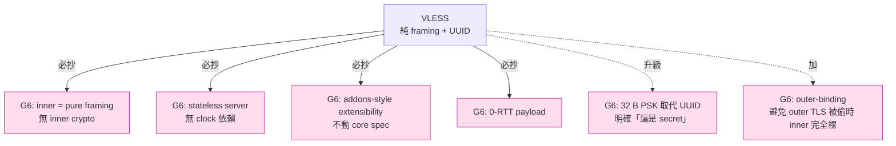

# 課堂 7.8 — VLESS 完整解剖：把 VMess 的密碼學徹底拔掉

## 學前知道
- 前置課：
  - [7.5 VMess](./7.5-vmess.md)（VLESS 的反面父親）
  - [7.7 Trojan](./7.7-trojan.md)（VLESS 的同代兄弟）
  - [4.3 TLS 1.3 握手逐 byte](../part-4-tls-quic/4.3-tls13-handshake-byte-level.md)
- 預計閱讀時間：**35 分鐘**
- 必讀規格：
  - **VLESS spec**（XTLS official）`xtls.github.io/development/protocols/vless.html` —— [`notes/specs/vless.md`](../../notes/specs/vless.md)
  - **XTLS-Vision spec**（Part 7.9 主場）
- 必讀原始碼：
  - **xray-core** `proxy/vless/encoding/encoding.go` —— `EncodeRequestHeader` / `DecodeRequestHeader`
  - **xray-core** `proxy/vless/validator.go` —— UUID validation
  - **xray-core** `proxy/vless/account.proto` —— Addons protobuf
  - **sing-box** `protocol/vless/`（Go 重寫，更易讀）
- 必讀歷史討論：
  - **xray-core Issue #62 / Discussion #56** —— VLESS 設計動機
  - **@RPRX 的設計筆記**（XTLS Discussions 主導者）

## 動機

VLESS 是 **「把 VMess 拆光，只保留路由元數據」** 的協議。設計動機一句話：

> **「VMess 的內層加密是浪費——outer TLS 已經做了，再做一層只是 CPU 浪費 + entropy fingerprint。」**

VLESS 對協議學習者的價值：

1. **wire format 極簡**：18+M byte fixed header + payload。**真正可以用一頁紙寫完**。
2. **UUID 在 outer TLS 內幾乎明文** —— 表面違反密碼學直覺，但**設計選擇正確**：UUID 的保密由 outer TLS 提供。
3. **0-RTT 設計**：payload 緊接 header，server 解出 address 馬上 forward。
4. **Stateless server**：無 timestamp、無 counter、無 replay cache。**修復 VMess 的 NTP-drift bug 類**。
5. **與 XTLS-Vision flow 機制的整合**——透過 `addons` ProtoBuf 字段，與 inner-TLS-splice 無縫結合。

讀完應該回答：
- VLESS 為什麼**沒有**內層加密？這是密碼學罪過嗎？
- 16 byte UUID 在 outer TLS 內**幾乎明文**——如果 attacker 解了 outer TLS（例如 cert 被偷），會發生什麼？
- 為什麼 VLESS 是 stateless 的？這比 VMess 的 stateful（AuthID cache）優在哪？
- `flow` field 是什麼？怎麼透過 addons protobuf 與 XTLS-Vision 整合？
- 為什麼 VLESS spec 預留 `encryption` 字段但 2026 production 仍只支援 `none`？

---

## 核心概念

### 1. VLESS 設計哲學：把 VMess 拆光

```mermaid
flowchart TD
    VMess[VMess<br/>UUID + alterID + AuthID + AES-CFB-or-GCM header + Body cipher selectable]
    VMess -- 拆掉 --> A1[去掉 alterID]
    VMess -- 拆掉 --> A2[去掉 inner crypto layer<br/>(no body encryption)]
    VMess -- 拆掉 --> A3[去掉 AuthID timestamp + cache]
    VMess -- 拆掉 --> A4[去掉 KDF chain<br/>(MD5 → CmdKey → ...)]
    VMess -- 簡化為 --> VLESS[VLESS<br/>UUID + addons + addr+port + payload]

    classDef ours fill:#fde,stroke:#c39
    class VLESS ours
```

**設計 insight**：

- VMess inner crypto 是 **「outer TLS 已經做了一遍，inner 再做一遍」**——CPU 雙倍開銷、entropy fingerprint 加重（Wu 2023 FEP detector 命中率不變）。
- alterID 是 stateful anti-replay 的失敗實驗（Part 7.5）。
- AuthID + timestamp + cache 是「**為了 outer 是 raw TCP 的時代**」設計。當 outer 強制 TLS（VLESS 強假設），這些都變成冗餘。

**結論**：VLESS = VMess − (inner crypto + alterID + AuthID + KDF chain) = **「pure framing + auth at the routing layer」**。

### 2. VLESS wire format 完整

#### Request header (client → server)

| Offset | Size | Field |
|---|---|---|
| 0 | 1 B | Protocol version (`0x00` = beta, `0x01` = release) |
| 1 | 16 B | UUID |
| 17 | 1 B | Addon length `M` |
| 18 | M B | Addons (ProtoBuf) — carries the `flow` string for XTLS-Vision etc. |
| 18+M | 1 B | Command (`0x01` TCP, `0x02` UDP, `0x03` Mux) |
| 19+M | 2 B | Destination port (BE) |
| 21+M | 1 B | Address type (`0x01` IPv4, `0x02` domain w/ 1-B length, `0x03` IPv6) |
| 22+M | var | Destination address |
| 22+M+addr_len | var | Payload (0-RTT) |

**Layout 觀察**：

- **第一個 byte** `0x00` 或 `0x01` 是 version。**這個 byte 是 wire format 的 fingerprint**——但 VLESS 強假設 outer TLS，所以這個 byte 在 TLS app data 內，不被外部觀察。
- **UUID 緊接 version**：16 byte，**與 VMess 的 EAuID（加密的 AuthID）不同**——VLESS 直接送原始 UUID。
- **Addons 是可變長 ProtoBuf**：design future-extensibility（**Part 7.9 XTLS-Vision 用 addons 帶 `flow` 字段**）。
- **Command 在 addons 之後**：意味著 server 必須先解 addons 才能知道是 TCP/UDP/Mux。
- **Payload 緊接 address**：**0-RTT**——server 解出 address 後立即可以 forward 第一個 packet 的 payload，無需等 round-trip。

**對比 VMess**：

| | VMess | VLESS |
|---|---|---|
| First byte 起 entropy | 高（EAuID 加密）| 低-中（version 固定 + UUID 部分隨機）|
| Header 是否加密 | 是（AES-128-GCM）| 否 |
| 解析複雜度 | 高（KDF chain + AEAD decrypt）| 低（直接 ProtoBuf parse）|
| Server CPU 開銷 | 高 | 極低 |
| 0-RTT | 是 | 是 |

### 3. UUID 是「公開」的——但不是「不安全」的

**反直覺設計**：UUID 在 outer TLS 內幾乎明文。

```
[outer TLS app data record]
| 0x01 | 16-byte UUID | 0x00 | 0x01 (TCP) | 0x01bb (443) | 0x02 | 11 byte | "example.com" | payload... |
```

如果 attacker 能看 outer TLS 的明文（例如 server cert 被偷 + middlebox decrypt），他就能拿到 UUID。

**但這個風險在威脅模型中是合理的**：

1. **如果 outer TLS 被破，inner 還在加密也沒用**（密鑰一樣會洩漏）。
2. **VMess 的 EAuID 在同樣場景下也會被破**——只是多一道 KDF 計算延遲。
3. **VLESS 接受這個風險，換取 CPU + spec 簡化**。

**對比 SS-2022 / Trojan**：兩者都是「**inner secret 在 outer 內傳明文**」（SS-2022 PSK 用來 encrypt body，但 PSK 本身不在 wire 上；Trojan 直接送 SHA224 hex）。**VLESS 對 UUID 的處理更接近 Trojan**——password 等價物在 wire 內，靠 outer TLS 保密。

### 4. Stateless server：修 VMess 的 NTP bug

VMess server **必須**：

- 維護 timestamp ±30s window → 與 client 時鐘同步（NTP）。
- 維護 AuthID cache（拒絕重放）→ 內存成本 + 線程同步。

**VMess 真實 bug**（社群最常見支援問題）：「**VMess 在本機跑通，部署到 VPS 後不通**」——99% 是 client/server 時鐘漂移 > 30s。

**VLESS server**：

```python
# 全部 server-side state：
users: dict[uuid_bytes, User] = {...}

def on_inbound_connection(conn):
    version, uuid = conn.read(1), conn.read(16)
    if uuid not in users:
        # 不是合法 user → 對 VLESS 而言，spec 沒規定 fallback
        # production 通常依賴 REALITY 的 fallback (Part 7.10)
        conn.close()
        return
    user = users[uuid]
    # 解 addons, command, address, ...
```

**O(1) lookup**，**no clock**，**no cache**——**部署無時鐘要求**。

### 5. 沒有 anti-replay：合理嗎？

VLESS spec 明確：「**No anti-replay at the VLESS layer.**」

理由：

1. **TLS 1.3 自帶 replay protection**（RFC 8446 §8）——session key per-handshake unique。
2. **若 outer TLS 被完全破解**（cert 偷+middlebox），attacker 拿到 UUID 直接 auth，**任何 application-layer anti-replay 都無法救**——除非引入 challenge-response（這就是另一個 protocol 了）。

**對比 SS-2022**：SS-2022 依然加 timestamp + replay window，**冗餘但更穩**。理由：SS-2022 不假設 outer 是 TLS（可以裸 TCP）。

**VLESS 的設計選擇**：**強假設 outer 是 TLS / REALITY**——所以 inner 不需要做 outer 已做的事。**這是分工原則**：每層只做自己該做的，不重疊。

### 6. Addons 與 XTLS-Vision 整合

`addons` 是 ProtoBuf 編碼的可變長 field：

```protobuf
// proxy/vless/account.proto
message Addons {
    string flow = 1;        // XTLS flow type, e.g. "xtls-rprx-vision"
    bytes seed = 2;         // optional seed for inner-TLS detection
}
```

**`flow` field** 可選值（2026）：

- `""` (空 / 不存在) → plain VLESS pass-through
- `"xtls-rprx-vision"` → XTLS-Vision direct mode（Part 7.9 主場）
- `"xtls-rprx-vision-udp443"` → 同 vision + UDP 443 特殊處理

**設計優雅**：addons 是 forward-extensible 的——XTLS-Vision、Vision UDP、未來新 flow（如 G6 自訂）都通過 addons 表達，**不需要動 wire format core**。

**Server 處理邏輯**（簡化）：

```go
// proxy/vless/inbound/inbound.go
func (h *Handler) Process(...) {
    request, err := encoding.DecodeRequestHeader(...)
    // request.Addons.Flow 可能是 "" / "xtls-rprx-vision" / ...
    if request.Addons.Flow == "xtls-rprx-vision" {
        // 啟用 XTLS-Vision 路徑（splice + padding）
        return processVision(...)
    }
    // 否則走 plain VLESS forward
    return processPlain(...)
}
```

### 7. Response header

server → client：

| Size | Field |
|---|---|
| 1 B | Protocol version (echo) |
| 1 B | Addon length `N` |
| N B | Addons |
| var | Payload |

**Forward-compatible echo**：server 回的 version 與 client 送的相同——**老 client 不會被新 server 弄壞**。**這是 spec 工程細節**，VMess 沒這個。

### 8. UDP 與 Mux

#### UDP (`Command = 0x02`)

UDP 透過 VLESS over outer TLS：每個 UDP datagram 包成一條 inner record：

```
| ATYP | DST.ADDR | DST.PORT | 2 byte length | UDP payload |
```

**與 SOCKS5 UDP ASSOCIATE 不同**：VLESS UDP 在 outer TLS 內，**沒有 separate UDP socket**。**所有 UDP 流量都走 TCP-over-TLS**——TCP-over-TCP 的 HOL blocking 全套問題上身。

**修補**：用 UDP transport（如 V2Ray QUIC、mKCP）作 outer。但這些 outer UDP transport 自己有問題（Part 7.6）。**真正解法**是 Hysteria/TUIC（Part 8）用 QUIC 為 outer。

#### Mux (`Command = 0x03`)

Mux 是 V2Ray 的 multiplex 機制：把多個 application 連線打包成一條 inner stream，**減少 TLS handshake 開銷**。**但對 traffic analysis 添加了長期 long-lived connection pattern**——已被 GFW 識別。**production 多數人關閉 Mux**。

### 9. 為什麼 spec 預留 `encryption` 但 2026 production 仍只 `none`

VLESS spec 的 protobuf 定義：

```protobuf
enum Encryption {
    NONE = 0;
    AES_128_GCM = 1;       // reserved
    CHACHA20_POLY1305 = 2; // reserved
}
```

但 production xray-core 與 sing-box 都**只接受 NONE**。

**為什麼預留？** 設計者（@RPRX）對「**outer TLS 偶爾被破或不可用**」場景留後路。

**為什麼仍未啟用？** 因為：

1. 啟用 inner crypto 就破壞了 VLESS 「**極簡 + 0-RTT + stateless**」的整套優點。
2. 若需要 inner crypto，可以**直接用 VMess** 或 SS-2022 包在裡面。
3. 啟用 inner AEAD 帶來的 entropy fingerprint 反而提高 detection——**沒有實際 security 收益**。

**這個 "reserved but never used" 是 spec 健康的表現**——**保留 future flexibility 但不亂加 feature**。

### 10. VLESS over REALITY = 2026 production SOTA 之一

VLESS 本身只解決了「**inner protocol 簡化**」。它的 censorship resistance 完全靠 outer：

- VLESS over plain TLS：與 Trojan 同等級——TLS-in-TLS 仍中招。
- VLESS over WS+TLS+CDN：與 Trojan-Go over WS 同等級。
- VLESS over gRPC：與 VMess over gRPC 同等級。
- **VLESS over REALITY**：**2026 production SOTA**——outer 直接借用真網站 ServerHello，無 TLS-in-TLS、無 cert pinning 風險。

VLESS 的設計**正是為了**配合 REALITY——「**inner 簡化到極致，outer 用 REALITY 處理**」。Part 7.10–7.12 詳講。

---

## 與我們協議設計的關聯

1. **「inner protocol = 純 framing + auth」是正確分工**：當 outer 強保證 TLS-grade 安全，inner 不需要重複加密。**G6 wire-format core 採此設計**——inner 只 framing + routing meta + auth，outer 做 confidentiality/obfuscation。
2. **0-RTT 是必選**：VLESS、SS-2022、Trojan 都做到 0-RTT。G6 必跟。Part 11.5。
3. **Stateless server 的部署優勢**：無時鐘要求大幅降低 ops 痛點。G6 採 stateless（仍可選用 timestamp anti-replay 但不依賴它）。
4. **UUID 在 outer 內可明文**——但 G6 應走 PSK 而非 UUID（PSK 32 byte random，更明確「這是 secret」）。
5. **Addons 機制設計典範**：ProtoBuf 可變長 field 帶 forward extensibility——G6 也應有此。
6. **不要過早 spec 加 feature**：VLESS reserve `encryption` 但不啟用是健康設計。**G6 spec v1 應該極簡**，未來通過 addons 擴展。
7. **不靠 Mux**：multiplex 帶來的 long-lived connection 是 traffic analysis 弱點。G6 用 QUIC 內生 multiplex（per-stream isolated），不額外加 application Mux。

---

## 動手

實驗 A（30 min）：**讀 xray-core VLESS encoder**

`proxy/vless/encoding/encoding.go`：

```go
func EncodeRequestHeader(writer io.Writer, request *protocol.RequestHeader, addons *Addons) error {
    buffer := buf.StackNew()
    defer buffer.Release()

    common.Must(buffer.WriteByte(request.Version))   // 1 byte
    common.Must2(buffer.Write(request.User.Account.(*MemoryAccount).ID.Bytes()))  // 16 byte UUID

    if err := EncodeHeaderAddons(&buffer, addons); err != nil {  // ProtoBuf addons
        return err
    }

    common.Must(buffer.WriteByte(byte(request.Command)))  // 1 byte command
    if request.Command != protocol.RequestCommandMux {
        if err := addrParser.WriteAddressPort(&buffer, request.Address, request.Port); err != nil {
            return err
        }
    }
    return WriteV(writer, &buffer)
}
```

**回答**：
1. addons 編碼成什麼？空 addons 是多少 byte？
2. UUID 在 wire 上的 byte order？
3. Mux command 為什麼跳過 address？

實驗 B（20 min）：**手寫 VLESS request decoder**

```python
import struct
def decode_vless_request(data: bytes):
    pos = 0
    version = data[pos]; pos += 1
    uuid = data[pos:pos+16]; pos += 16
    addon_len = data[pos]; pos += 1
    addons_pb = data[pos:pos+addon_len]; pos += addon_len
    cmd = data[pos]; pos += 1
    if cmd == 0x03:  # Mux
        return {"version": version, "uuid": uuid.hex(), "cmd": "mux"}
    port = struct.unpack(">H", data[pos:pos+2])[0]; pos += 2
    atyp = data[pos]; pos += 1
    if atyp == 0x01:
        addr = ".".join(map(str, data[pos:pos+4])); pos += 4
    elif atyp == 0x02:
        alen = data[pos]; pos += 1
        addr = data[pos:pos+alen].decode(); pos += alen
    elif atyp == 0x03:
        addr = ":".join(f"{b:02x}" for b in data[pos:pos+16]); pos += 16
    payload = data[pos:]
    return {"version": version, "uuid": uuid.hex(), "addr": addr, "port": port, "payload_len": len(payload)}

# 測試一個 VLESS request packet
sample = bytes.fromhex("00" + "00"*16 + "00" + "01" + "01bb" + "02" + "0b" + "6578616d706c652e636f6d" + "474554")
print(decode_vless_request(sample))
```

實驗 C（30 min）：**對比 VLESS / VMess 抓包**

啟動兩個 inbound（同一 outer TLS，inner 分別 VLESS / VMess），各跑 10 個 HTTPS request：

- 比較第一個 inner record（解掉 outer TLS 後）的 byte size
- 比較 server CPU usage（`top`）

**結果**：VLESS 應該明顯低 entropy + 低 CPU——這就是設計動機的實驗驗證。

---

## 自我檢查

1. VLESS 沒有 inner encryption——這在密碼學原則上有何不妥？實際上這個設計的安全等價是什麼？
2. UUID 16 byte 在 outer TLS 內幾乎明文——如果 outer 是 plain TCP（不是 TLS），這個 UUID 暴露會發生什麼？為什麼 spec 強假設 outer = TLS？
3. VLESS 的 stateless 設計如何避免 VMess 的 NTP-drift bug？對 ops 的具體影響？
4. Addons 是 ProtoBuf——為什麼 ProtoBuf 而不是 fixed-format binary？這個選擇的 forward-compatibility vs 解析複雜度 trade-off？
5. 為什麼 VLESS spec reserved `encryption` 但 2026 仍只支援 `none`？這個「保留但不啟用」的設計哲學說了什麼？
6. VLESS over plain TLS vs VLESS over REALITY，在 censorship resistance 上的差異是什麼？為什麼 VLESS-over-REALITY 是 2026 SOTA？

---

## 延伸閱讀

- **VLESS 官方 spec**（XTLS）
- **xray-core** Discussions：@RPRX 的設計筆記
- **sing-box** VLESS impl
- Part 7.5 VMess（VLESS 的反面父親）
- Part 7.9 XTLS-Vision（VLESS addons 機制的最大用戶）
- Part 7.10–7.12 REALITY（VLESS 完美搭檔）

---

## 研究級補遺

### 1. 學界詞彙

| 口語 | 學術術語 | 出處 |
|---|---|---|
| 「pure framing protocol」 | metadata-only routing layer | (informal; VLESS/Trojan 共有特性) |
| 「stateless authentication」 | stateless authn (without nonce/timestamp dependency) | (Trojan/VLESS 共有，與 Sigma protocol 對位) |
| 「addons」 | extensible protocol negotiation | TLS extensions / QUIC transport parameters 同源 |
| 「flow type」 | proxy mode / data plane variant | XTLS-specific term |

### 2. 對手分類學

| 對手能力 | VLESS over plain TLS | VLESS over REALITY |
|---|---|---|
| Passive entropy | ✅ 擋住（外 TLS） | ✅ 擋住 |
| TLS ClientHello fingerprint | ⚠（utls 救援）| ✅ 擋住（借真網站 CH） |
| TLS-in-TLS pattern | ❌ 中招 | ✅ 擋住（Vision splice）|
| Active probe | ⚠（無 fallback）| ✅ 擋住（REALITY fork）|
| Replay 已知 UUID | ❌ 中招 | ❌ 中招（仍無 anti-replay） |
| Cryptanalysis on inner | N/A（無 inner crypto）| N/A |

### 3. 形式化定義

VLESS 的「inner authentication」可以形式化為**「shared-secret routing in a confidential channel」**：

設 outer channel $C$ 提供 IND-CCA + INT-CTXT（TLS 1.3 record layer 假設），UUID 集合 $\mathcal{U}$，client 持 $u \in \mathcal{U}$，wire format 第 2-17 byte 為 $u$。Attacker $\mathcal{A}$ 不擁有 outer channel 對應 endpoint 的 TLS session key。

$$
\Pr[\mathcal{A} \text{ recovers any } u' \in \mathcal{U}] \leq \text{Adv}^{\text{ind-cca}}_{\text{TLS}}(\mathcal{A})
$$

也就是 **VLESS UUID 的保密性 = TLS session key 的保密性**——一個 reduction。

**這個 reduction 的精確度** 是 VLESS 設計的核心 argument：**inner crypto 提供的 marginal security = 0**（如果 outer TLS 安全），**但 marginal cost = entropy fingerprint + CPU**。

### 4. 領域的關鍵論文 / 規格 / 原始碼

- **VLESS spec** (xtls.github.io)
- **xray-core `proxy/vless/`** —— production impl
- **sing-box `protocol/vless/`**  
- **XTLS-Vision spec**（Part 7.9 主場）
- **REALITY spec**（Part 7.10）
- **Bhargavan et al., *Triple Handshakes and Cookie Cutters*, IEEE S&P 2014** —— inner-outer TLS 綁定
- **TLS 1.3 RFC 8446 §8** —— replay protection（VLESS 完全依賴）

### 5. 我們協議的座標 / 設計取捨



### 6. 必追資源 / 社群入口

- **xray-core** Discussions（@RPRX 主導）
- **XTLS** GitHub org
- **sing-box** GitHub
- **net4people/bbs**

### 7. 開放問題

1. **VLESS 是否真的不需要 inner encryption？** 學界傾向「outer 充分時 inner 確實多餘」，但 **side-channel scenarios**（如 TLS proxy 終端在 ISP）下 inner crypto 仍有保險作用。Open problem：能否設計 conditional inner crypto，只在偵測 outer 異常時啟用？
2. **Addons 機制的擴展性 vs 攻擊面**：addons 是 ProtoBuf，server 必解析。**惡意 client 送畸形 addons 觸發 ProtoBuf parser bug** → DoS / RCE 風險。實務上 ProtoBuf 庫穩定，但這仍是 spec 級別應該關心的。
3. **`encryption` 字段未來啟用的時機**：在 PQ migration 場景（X25519 不再夠安全），inner 是否該補 PQ-AEAD？這是 VLESS spec 預留 future-extensibility 的真正用途。
