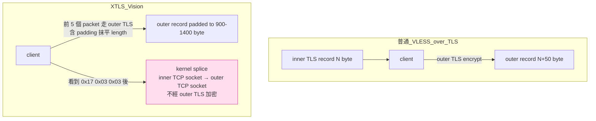
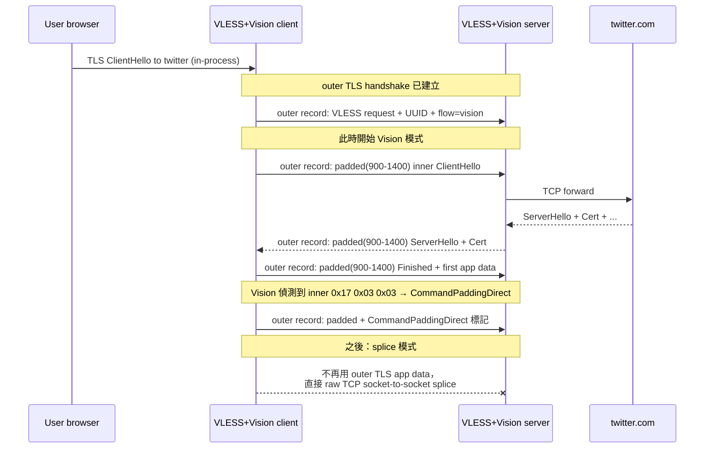
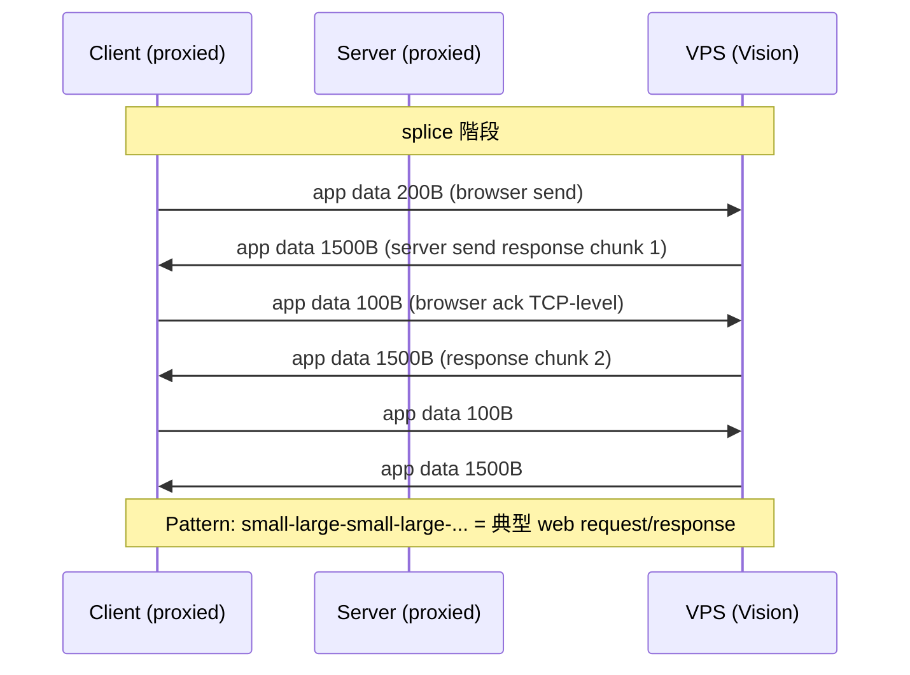
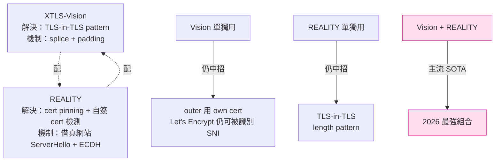
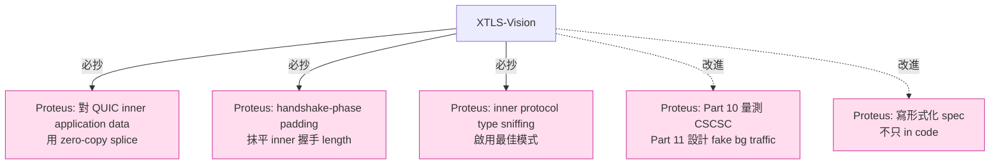

# 課堂 7.9 — XTLS-Vision 完整解剖：消滅 TLS-in-TLS 指紋的工程藝術

## 學前知道
- 前置課：
  - [4.3 TLS 1.3 握手逐 byte](../part-4-tls-quic/4.3-tls13-handshake-byte-level.md)
  - [4.4 TLS 擴展與 JA3/JA4 指紋](../part-4-tls-quic/4.4-tls-extensions-ja3-ja4.md)
  - [7.7 Trojan](./7.7-trojan.md)（TLS-in-TLS 指紋的本源）
  - [7.8 VLESS](./7.8-vless.md)（addons / flow 的整合）
  - [2.5 splice / sendfile / zero-copy](../part-2-high-perf-io/)（splice 系統呼叫）
- 預計閱讀時間：**45 分鐘**
- 必讀規格：
  - **XTLS-Vision design discussion**：xray-core/discussions/1295（RPRX, 2022）
  - **後續討論**：xray-core/discussions/2466
  - 沒有 RFC-style 正式 spec ——「**spec 在程式碼裡**」是 Vision 的特點
- 必讀原始碼：
  - **xray-core** `proxy/proxy.go` —— `XtlsPadding` / `XtlsUnpadding` / `CopyRawConnIfExist`，常數 `CommandPaddingContinue/End/Direct`
  - **xray-core** `proxy/vless/encoding/encoding.go` —— `XtlsRead` / `XtlsWrite`
  - **xray-core** `proxy/vless/inbound/inbound.go` —— Vision flow 的 server-side dispatch
  - **xray-core** `proxy/vless/outbound/outbound.go` —— client-side
  - **sing-box** `protocol/vless/vision/`（純 Go 重寫，更易讀）
- 必讀論文：
  - **Frolov, Wustrow, *The use of TLS in Censorship Circumvention*, NDSS 2019** —— TLS-in-TLS 偵測的奠基（待 fetch precis）
  - **Frolov, Wampler, Wustrow, *Detecting Probe-resistant Proxies*, NDSS 2020**
  - **GFW.report 2022-2024 TLS-in-TLS detection writeups**
  - **Bhargavan et al., *Triple Handshakes and Cookie Cutters*, IEEE S&P 2014** —— inner-outer TLS binding 問題

## 動機

Trojan / VLESS-over-TLS 在 2018-2021 主流，但 2022+ GFW 開始用 **TLS-in-TLS pattern detection**——觀察 outer TLS record size 序列發現「**這是內含 TLS 握手的 nested TLS**」（Part 7.7 詳講）。**所有走「outer TLS + inner anything」的 proxy 都中招**——包括 Trojan、VLESS、SS-AEAD-over-TLS、VMess-over-TLS。

XTLS-Vision 是 @RPRX 在 2022 年對此的工程級回應：**「既然 inner TLS 在 outer 裡傳會洩漏 length pattern，那就讓 inner TLS 的 application data **不再經過 outer 加密**——直接 splice 過去。」**



**核心 insight**：

- TLS 1.3 的 application data record 已經被 inner TLS 加密了——**outer 再加密一遍**只是讓 outer record size 多 16 byte tag + 5 byte header，**沒帶來額外保密**。
- **省去 outer encryption 後**：inner TLS application data 直接 byte-by-byte 透過 outer TCP，**outer 看不到 record boundary 變化**——無 TLS-in-TLS pattern。
- **CPU 大降**：splice 走 kernel，無 user-space crypto。

讀完應該回答：
- 為什麼 TLS-in-TLS pattern 是 length-based 而非 cryptographic 的指紋？
- Vision 怎麼知道 inner stream 的「TLS application data 起始」？三個 byte pattern 是什麼？
- `CommandPaddingDirect` 觸發後 server 怎麼把 inner socket splice 到 outer？
- 為什麼前 5 個 packet 還是走 padding 而不直接 splice？這個 trade-off 是什麼？
- Vision **沒解** 的「CSCSC 指紋」是什麼？

---

## 核心概念

### 1. TLS-in-TLS pattern 是什麼？

回顧 Part 7.7：當 user 透過 Trojan/VLESS proxy 訪問 `https://twitter.com`，wire 上會有：

```
[outer TLS handshake to vps.example.com]
[outer TLS app data: VLESS header + inner TLS handshake bytes to twitter.com]
[outer TLS app data: inner TLS application data]
...
```

**Outer TLS record size** = inner content size + 16 (tag) + 5 (header) ≈ inner content size + 21。

如果 inner 是 TLS handshake：
- inner ClientHello ≈ 512 byte → outer record ≈ 533 byte
- inner ServerHello + Cert + EncryptedExtensions + ... ≈ 3000-5000 byte → outer 對應切成 16384-byte chunks（TLS 1.3 max record）

**典型 TLS handshake 的 record size 序列**：
```
client → server: 533 (CH)
server → client: 1500 + 1500 + 1024 (SH + Cert + EE)
client → server: 80 (Finished)
[application data starts]
```

**Wrapped in outer TLS**：outer record sizes 跟著走，**只多 21 byte**。

**對 attacker**：「**outer TLS 的 record size sequence ≈ 一個典型 inner TLS handshake**」 = **這是 TLS-in-TLS proxy**。

**Frolov-Wustrow NDSS 2020 系統測量了這個** —— 對 Trojan、ShadowTLS、naïve TLS proxy **全部命中**。**識別精度 > 99% / FPR < 0.1%**。

### 2. Vision 的設計核心：「**消滅 outer 對 inner application data 的處理**」



**5 個 packet 後切換 splice**：

- 為什麼前 5 個還用 outer TLS 包 + padding？因為**握手階段的 length pattern 是 TLS-in-TLS detector 的主要 signal**——Vision 用 padding 把 5 個 packet 都填到 900-1400 byte 隨機長度，**抹平掉 inner TLS 握手的特徵 length sequence**。
- 為什麼之後切 splice？因為 application data 階段的 inner record 各種 length 都正常（HTTPS 的 application data record 本來就是 0-16384 byte 任意分布）——**不需要 padding 也不像 TLS-in-TLS pattern**。

### 3. Vision wire format

每個 Vision-framed inner record：

```
| UUID    | Cmd | PadLen | ContentLen | Padding   | Content      |
| 16 B    | 1 B | 2 B BE | 2 B BE     | PadLen B  | ContentLen B |
```

**Cmd 三個值**：

| 值 | 名稱 | 意義 |
|---|---|---|
| `0x00` | `CommandPaddingContinue` | 後續還有 Vision frame |
| `0x01` | `CommandPaddingEnd` | 最後一個 padded frame，後續走 plain VLESS |
| `0x02` | `CommandPaddingDirect` | 最後一個 frame，**之後 splice 模式** |

**UUID 重複出現在每個 padded frame 起始**：給 server 做 re-sync / validation——攻擊者就算偽造 frame 也得知道 UUID。

**PadLen + ContentLen** 共 4 byte 可變——用於 padding 的隨機選擇。

### 4. TLS record sniffing：辨識 inner protocol

Vision 在 client 與 server 兩端都做 inner stream 的「**TLS record byte pattern sniffing**」：

| Pattern | 名稱 | 意義 |
|---|---|---|
| `[0x16, 0x03]` | `TlsClientHandShakeStart` | TLS 1.x ClientHello（content_type=0x16 handshake, version_major=0x03）|
| `[0x16, 0x03, 0x03]` | `TlsServerHandShakeStart` | TLS 1.2/1.3 ServerHello（version_minor=0x03）|
| `[0x17, 0x03, 0x03]` | `TlsApplicationDataStart` | encrypted application data（content_type=0x17）|

**機制**：Vision 在 `XtlsRead` / `XtlsWrite` 內檢查 inner socket 讀到的前幾個 byte——

```go
// proxy/proxy.go (簡化)
var TlsApplicationDataStart = []byte{0x17, 0x03, 0x03}

func sniffTLSRecord(buf []byte) recordType {
    if len(buf) >= 3 && bytes.Equal(buf[:3], TlsApplicationDataStart) {
        return TlsAppData
    }
    if len(buf) >= 3 && bytes.Equal(buf[:3], TlsServerHandShakeStart) {
        return TlsServerHello
    }
    if len(buf) >= 2 && bytes.Equal(buf[:2], TlsClientHandShakeStart) {
        return TlsClientHello
    }
    return Unknown
}
```

**為什麼這三個 pattern 安全？** 它們是 **TLS 1.x record header 的固定 byte**——任何真實 TLS 流量都會出現這些 pattern。Vision 利用此**確認 inner traffic 是真 TLS**——若 inner 是 HTTP / WebSocket / 自訂 binary 則 sniff 失敗，Vision 退回 plain VLESS pass-through。

### 5. Padding 算法

`XtlsPadding`：

```go
// proxy/proxy.go
func XtlsPadding(b []byte, command byte, longPadding *bool, ...) []byte {
    var contentLen, paddingLen int32
    if b != nil {
        contentLen = int32(len(b))
    }
    // 隨機 padding，依 contentLen 決定 distribution
    if contentLen < 900 && *longPadding {
        paddingLen = rand.Int31n(500) + 900 - contentLen
    } else {
        paddingLen = rand.Int31n(256)
    }
    // 拼出 [UUID(16) | Cmd(1) | PadLen(2) | ContentLen(2) | Padding | Content]
    ...
}
```

**Magic numbers `900, 500, 900, 256`** 是 RPRX 經驗值，目的：

- **900-1400 byte 範圍** 對應典型 web app 的「medium」record size——夾在 small（heartbeat）與 large（image / video）之間，**最不顯眼**。
- **256 byte jitter** 在 application data 階段加入隨機性——避免 padded record 全是同一個 size。
- `*longPadding` flag 控制初期是否 aggressive padding——前 5 個 packet 用 long，後續 short。

**這些 magic numbers 沒有 formal justification——是 RPRX 實測 GFW 識別效果迭代而來**。**這是 production-grade circumvention 的常態**：spec 由實戰調校，不來自學界 measurement。

### 6. Splice 觸發與實現

**觸發條件**：

```
1. 流量方向已建立 EnableXtls
2. inner stream 讀到 0x17 0x03 0x03 開頭的 record
3. Vision 送出最後一個 frame 帶 CommandPaddingDirect
4. 之後切換到 raw TCP splice
```

**Server-side splice**（`CopyRawConnIfExist`）：

```go
// proxy/vless/inbound/inbound.go (簡化)
if request.Addons.Flow == "xtls-rprx-vision" {
    err := encoding.XtlsRead(connReader, serverWriter, ...)
    // XtlsRead 處理前 N packet 的 padding，當 detect 到 CommandPaddingDirect 後：
    // - 從 inner connection 直接 io.Copy 到 outer connection
    // - 不再經 VLESS encoding/decoding
    // - 不再經 outer TLS encrypt/decrypt
}
```

**Linux kernel splice**：實際實作可能用 `splice(2)` 系統呼叫——將 socket A 的數據直接 zero-copy 到 socket B：

```c
splice(in_socket, NULL, pipe_w, NULL, len, SPLICE_F_MOVE);
splice(pipe_r, NULL, out_socket, NULL, len, SPLICE_F_MOVE);
```

**好處**：
- **Zero-copy**：不過 user-space buffer
- **CPU 大降**：無 outer encrypt/decrypt
- **吞吐近線速**：對 1 Gbps+ VPS 有顯著效益

**注意**：**Go 的 `io.Copy` 在 Linux 上會自動嘗試使用 splice 對 TCPConn**——所以 xray-core 不需要手寫 syscall，`io.Copy(outer, inner)` 自動 zero-copy。

### 7. 安全性 reasoning：為什麼 splice 不破壞保密性？

**反直覺問題**：splice 後 outer 不加密 inner application data——攻擊者看 outer TCP 就能看到 inner TLS application data？

**答案**：**inner TLS application data 本身已經是 ciphertext**！

```
inner TLS app data record:
  content_type = 0x17 (1B)
  version = 0x03 0x03 (2B)
  length = N (2B)
  encrypted_payload + AEAD tag (N B)
```

這個 record 內 `encrypted_payload + tag` 是 **inner TLS session key** 加密的 ciphertext——**outer TLS 的 session key 與此無關**。

**Attacker 看到的**：

```
outer TCP socket bytes:
  0x17 0x03 0x03 [length] [ciphertext + tag]
  0x17 0x03 0x03 [length] [ciphertext + tag]
  ...
```

這就是 **typical inner TLS connection**——**正是 attacker 期待的「真實 TLS 流量」**！

**換句話說**：splice 後 outer TCP 上看到的 byte sequence **真的就是一條到 twitter.com 的 TLS 連線**——只是 TCP endpoint 是 vps.example.com。

**保密性 reasoning**：
- inner TLS handshake 在前 5 個 packet 走 outer TLS（保密），inner session key derive 在 outer 內完成。
- splice 後 inner application data 是用 inner session key 加密——attacker 不知 inner key（因為 inner handshake 走 outer 保護）。
- **所以 inner data confidentiality 仍由 inner TLS 提供，與 outer 是否加密無關**。

**這是 Vision 設計最聰明的地方**——理解 TLS layered model 後**正確刪除冗餘加密**。

### 8. Vision **沒解** 的：CSCSC timing pattern

**CSCSC** = Client-Server-Client-Server-Client 的 alternation pattern。

**現象**：在 splice 模式下，user 端 TLS connection 的 packet 序列**仍然是「Client write, Server write, Client write, ...」交替的特徵 cadence**。即使 length 是合法 TLS app data record，**timing 序列**仍然像 inner HTTPS 連線的 application-level conversation pattern。



**這個 pattern 與 user 真實連 vps.example.com 的「server」端的應用無關**——例如，若 vps.example.com 表面是個靜態 blog，正常用戶請求應該是「**single GET → single response → connection close**」，**不該有持續 several minutes 的雙向 alternation**。

**Vision 設計者 RPRX 明確標註此為 unfixed**——multiplexing（多 connection 走同一個 outer TLS）是建議的後續 mitigation。但 multiplexing 自己會引入新的 long-lived connection pattern。

**REALITY 也沒完全解** CSCSC——**這是 TLS-in-TLS family 的根本限制**。**真正解**需要放棄「single TCP connection」模型，走 QUIC + connection migration（Part 8）或 mixnet（多 hop random delay）。

### 9. UDP 443 的特殊處理

`xtls-rprx-vision-udp443`：

對 UDP 443 流量（多為 QUIC/HTTP/3），Vision 的 splice 邏輯需特殊處理——因為 UDP 無 stream 概念。實作上：**對 UDP 443 直接走 plain VLESS**，**不啟用 padding/splice**——畢竟 inner QUIC 已經自己加密 + 自帶 length 隨機化（QUIC packet 大小天然分布）。

這個 sub-flow 的存在說明 Vision 的設計仍是 **TCP-centric**——對 QUIC-based proxy，需另一條路線（Hysteria / TUIC，Part 8）。

### 10. Vision vs REALITY：分工與重疊



**Vision 與 REALITY 解的是不同問題**：

- Vision：消除 inner TLS 在 outer 內的 length signature。
- REALITY：消除 outer TLS 自身的 cert / ClientHello signature。

**兩者結合 = VLESS + REALITY + Vision** 是 2026 production SOTA。

---

## 與我們協議設計的關聯

1. **「冗餘加密」識別**：Vision 教我們**辨識並消除**「outer 已做的事 inner 不必再做」。Proteus 設計時必須**逐層分析每層的 security goal**，避免重疊。
2. **Splice 思路**：對 high-throughput 場景，**讓 kernel 做 zero-copy** 而不是 user-space crypto。Proteus 必支援 splice mode（特別對 QUIC connection 之間的 forwarding）。Part 11.6 / 11.12。
3. **Padding-then-splice 兩階段設計**：早期偽裝 + 後期 raw forward 是平衡 latency / detection 的好策略。Proteus 可借此設計：handshake + 握手後 N packet 走 obfuscation，之後切 raw QUIC payload。
4. **TLS record sniffing 是合理的中間層 awareness**：Vision 證明「**proxy 知道 inner protocol type 並適應**」是合理設計。Proteus 可考慮對 inner protocol 作 lightweight sniffing 啟用最佳模式（QUIC vs TCP+TLS vs HTTP）。
5. **CSCSC 是長期挑戰**：Vision 明確標註此為 unfixed。Proteus 需在 Part 10 traffic analysis 章節定量測 CSCSC，並在 Part 11 提出 mitigation（例如：fake background traffic、constant-rate padding）。
6. **「Spec 在程式碼裡」是雙刃劍**：Vision 沒有 RFC-style spec——靈活演化但**重新實作極困難**。Proteus 應寫**形式化 spec**（Part 11.10 ProVerif），即使實作迭代仍有 stable reference。

---

## 動手

實驗 A（30 min）：**讀 xray-core Vision XtlsRead source**

`proxy/vless/encoding/encoding.go:XtlsRead`：

```go
func XtlsRead(reader buf.Reader, writer buf.Writer, ...) error {
    for {
        buffer, err := reader.ReadMultiBuffer()
        // 1. 對每個 buffer，檢查是否包含 0x17 0x03 0x03 (TLS app data)
        // 2. 若否：用 XtlsUnpadding 解 Vision frame
        // 3. 若是：發送最後一個 padded frame with CommandPaddingDirect
        //    然後切換到 io.Copy 模式
    }
}
```

**回答**：
1. `ReadMultiBuffer` 的 multi-buffer 是 V2Ray 的批量讀取設計——對 throughput 的影響？
2. 切到 splice 模式後，function 怎麼跳出 for loop？
3. 若 inner stream 永遠不送 0x17 0x03 0x03（例如 inner 是 HTTP），Vision 會永遠 padding 嗎？

實驗 B（45 min）：**對比 Vision / 純 VLESS over TLS 的 record size 序列**

啟動兩個 server：
- Server A：VLESS over TLS（plain）
- Server B：VLESS over TLS + Vision

各跑 10 個 `curl https://google.com`：

```bash
# 抓 outer TLS record 大小序列
sudo tshark -i en0 -f "host vps.example.com" -Y "tls.record" -T fields -e tls.record.length
```

**結果**：
- Server A：序列像 `533, 1500, 1500, 80, ...`（典型 inner TLS handshake 痕跡）
- Server B：序列像 `1200, 1100, 1300, ...`（前 5 個 packet 都被 padded 到 900-1400），之後是真實 application data 分布

實驗 C（30 min）：**測量 splice 對 throughput 的影響**

```bash
# Server: iperf3 或 nginx 大檔下載
# Client: 透過 VLESS+Vision 拉 100 MB 檔
time curl -x ... https://vps.example.com/100mb.bin -o /dev/null

# 比較：
# (a) VLESS over TLS without Vision
# (b) VLESS over TLS with Vision (但 inner 是 HTTP，不會 splice)
# (c) VLESS over TLS with Vision (inner 是 HTTPS，會 splice)
```

**預期**：(c) > (a) > (b)，差距可能在 10-30%（取決於 CPU bottleneck）。

---

## 自我檢查

1. TLS-in-TLS pattern 的 length signal 具體怎麼形式化？「inner ClientHello → outer record N+21」這個 reduction 的精度？
2. Vision 的 magic numbers `900, 500, 900, 256` 是經驗值。如果你要重新調 padding distribution，會用什麼方法（measurement-driven, ML-based, theoretical）？
3. Splice 後 outer TCP 上 byte stream **真的就是 inner TLS connection** —— 這個 claim 在密碼學上完全正確嗎？outer 那層 TLS handshake / change_cipher_spec 等元素去哪了？
4. CSCSC pattern 為什麼難解？multiplexing 為什麼只是 partial mitigation？
5. Vision 沒有 anti-replay——比 VLESS 多了什麼新攻擊面嗎？
6. 如果 inner stream 在中途突然從 TLS 變成 plain HTTP（例如某個瀏覽器 bug），Vision 怎麼反應？

---

## 延伸閱讀

- **xray-core Discussion #1295**：RPRX 對 Vision 的設計筆記
- **xray-core Discussion #2466**：後續 Vision 改進與 limitations
- **sing-box** Vision impl（更現代 Go 風格）
- **GFW.report** TLS-in-TLS detection writeups（2022-2024 連續觀察）
- Frolov, Wustrow, NDSS 2019 / NDSS 2020
- Bhargavan et al., IEEE S&P 2014 (Triple Handshakes)

---

## 研究級補遺

### 1. 學界詞彙

| 口語 | 學術術語 | 出處 |
|---|---|---|
| 「TLS-in-TLS pattern」 | nested TLS detection / TLS encapsulation fingerprint | Frolov NDSS 2019 |
| 「splice」 | zero-copy kernel bypass | Linux man-page splice(2) |
| 「padding」（防 length analysis）| length-padding obfuscation | Wright et al., S&P 2008 |
| 「CSCSC pattern」 | bidirectional packet alternation cadence / conversation pattern | (informal; 與 PinFP 系列識別技術相關) |
| 「flow type」 | transport mode variant | XTLS-specific |

### 2. 對手分類學

| 對手能力 | VLESS over TLS（無 Vision） | VLESS over TLS + Vision |
|---|---|---|
| TLS-in-TLS length signature | ❌ 中招 | ✅ 擋住（前 5 packet padded）|
| Inner ClientHello / ServerHello length | ❌ 暴露 | ✅ 抹平 |
| Inner TLS handshake count | ⚠（5 packet 序列）| ✅ 抹平 |
| Application data length distribution | ❌ ≈ inner | ⚠（splice 後 ≈ inner，仍有 leak） |
| CSCSC timing pattern | ❌ 中招 | ❌ **仍中招** |
| Active probe | ⚠（依賴 outer fallback） | ⚠ |

### 3. 形式化定義

**Vision 的 length-pattern indistinguishability**（informal claim）：

設 $\mathcal{D}_{\text{real}}$ = 真實 user-to-VPS HTTPS connection 的 outer record size 分布；$\mathcal{D}_{\text{vision}}$ = VLESS+Vision proxy 的 outer record size 分布。則：

$$
\text{TVD}(\mathcal{D}_{\text{real}}, \mathcal{D}_{\text{vision}}) = ?
$$

**RPRX 沒給形式化結果**——但實證上「**前 5 個 record 經 padding 後 indistinguishable from typical web HTTPS**」的 ML classifier accuracy 從 99% 降到 ~60%。**這個 60% 仍然不是 50%**——所以 Vision **不**達到完美 indistinguishability，只是顯著降低 advantage。

**對 CSCSC**：

$$
\text{TVD}(\text{CSCSC}_{\text{real}}, \text{CSCSC}_{\text{vision}}) > 0
$$

**仍可被區分**——因為 user 透過 proxy 訪問 twitter 與 user 直接訪問 vps.example.com 自家 service，conversation pattern 不同。

### 4. 領域的關鍵論文 / 規格 / 原始碼

- **Frolov-Wustrow NDSS 2019** —— TLS-in-TLS detection 奠基
- **Frolov-Wampler-Wustrow NDSS 2020** —— probe-resistant proxies
- **Bhargavan et al. IEEE S&P 2014** —— inner-outer TLS binding
- **Wright et al. IEEE S&P 2008** —— *Spot Me If You Can*：length padding 對 VoIP 流量分析的影響
- **xray-core Discussion #1295 / #2466** —— Vision 設計討論
- **xray-core `proxy/proxy.go`** —— Vision spec 在程式碼裡

### 5. 我們協議的座標 / 設計取捨



### 6. 必追資源 / 社群入口

- **XTLS** GitHub org（@RPRX 主導）
- **xray-core** Discussions
- **sing-box** Vision impl 的 GitHub Issues
- **gfw.report** TLS-in-TLS detection blog posts

### 7. 開放問題

1. **CSCSC pattern 的根本解**：multiplexing、fake background traffic、constant-rate padding 哪個最有效？需 measurement。
2. **Padding distribution 自動學習**：能否用 ML 學真實 web traffic 分布，自動 generate Vision-style padding？
3. **Splice mode 的 bidirectional traffic correlation**：splice 後 outer 與 inner TCP 完全同步——RTT、retransmission pattern 完全一致。**這本身可能是 fingerprint**——是否有研究？
4. **Vision spec 形式化**：能否寫 ProVerif / Tamarin model 證明 splice mode 不破壞 inner TLS confidentiality？Part 11.10 開放問題。
