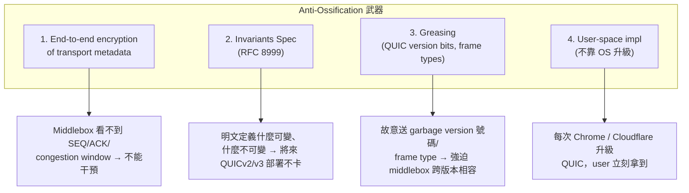
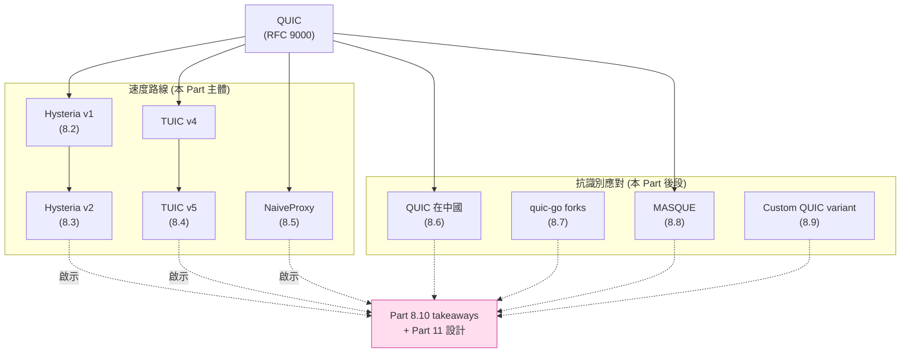

# 課堂 8.1 — 為什麼 QUIC 系協議是當前另一條主線

## 學前知道
- 前置課：
  - [Part 1.10 TCP 擁塞控制](../part-1-networking/1.10-tcp-congestion.md)、[1.13 BBR](../part-1-networking/1.13-bbr-congestion.md)
  - [Part 4.7 QUIC transport](../part-4-tls-quic/4.7-quic-transport.md)、[4.8 handshake](../part-4-tls-quic/4.8-quic-handshake.md)、[4.9 advanced](../part-4-tls-quic/4.9-quic-advanced.md)
  - [Part 7.* VLESS / REALITY](../part-7-proxy-protocols/) — TCP 路線的 SOTA，做為對照組
- 預計閱讀時間：**40 分鐘**
- 必讀：
  - **Titz, Olaf**, "Why TCP Over TCP Is A Bad Idea" (sites.inka.de, 2001) — 經典 30 行短文，整個 QUIC-based VPN 路線的起點 → [precis](../../notes/papers/titz-tcp-over-tcp.md)
  - **Honda, M., Nishida, Y., Raiciu, C., Greenhalgh, A., Handley, M., & Tokuda, H.**, "Is It Still Possible to Extend TCP?" *IMC 2011* → [precis](../../notes/papers/honda-extend-tcp-2011.md)
  - **Langley et al.**, "The QUIC Transport Protocol", *SIGCOMM 2017* → [precis](../../notes/papers/langley-quic-sigcomm.md)
- 必讀規格：
  - **RFC 9000**（QUIC）、**RFC 8999**（QUIC Invariants）、**RFC 9308**（QUIC Applicability Statement）

## 動機

到 Part 7 結束我們看過了**對抗審查路線**的當前 SOTA：VLESS + REALITY。它的祕訣是**讓 TLS 看起來像普通 HTTPS**，連 SNI 都借用真實大站。安全性極好，但**速度上限被 TCP + TLS 鎖死**：

- TCP head-of-line blocking
- TCP + TLS = 2-RTT 握手（1.3 0-RTT 也仍是 1-RTT 對新 server）
- 擁塞控制 in-kernel，難用最新算法
- 在 lossy 鏈路（4G / 跨大洲）效能慘

於是 2019–2024 間出現一條完全不同的設計線：**把 proxy 蓋在 QUIC 上**。代表作三個：

1. **Hysteria** (apernet/hysteria, 2020–) — 自訂 Brutal CC 強行佔頻寬，QUIC-as-UDP-tunnel
2. **TUIC** (EAimTY/tuic, 2022–) — 命令式 QUIC proxy，UDP relay 兩種模式
3. **NaiveProxy** (klzgrad/naiveproxy, 2018–) — 完全用 Chromium 的 H/2 + H/3 stack

這條線的賣點：**在好的鏈路上吊打 VLESS + REALITY 兩倍速以上，在 lossy 鏈路差距更大**。

但它有個結構性的脆弱：**GFW 從 2024-04-07 起對 QUIC SNI 直接解密過濾**（Zohaib et al., USENIX Security 2025）。所以 Part 8 的核心問題是：

> **能不能把「QUIC 的速度」+「VLESS+REALITY 的抗識別」合在一起？這就是我們 Part 11 設計的目標。**

讀完 Part 8 你應該回答：

- 為什麼 TCP-over-TCP 必爛、TCP-over-QUIC 又為什麼有救？
- Hysteria 的 Brutal CC 算不算 cheating？對共用網路公平嗎？
- TUIC v4 為什麼被 v5 取代？v5 解決了什麼？
- NaiveProxy 借用 Chromium net stack 是 anti-fingerprint 的銀彈嗎？
- 為什麼 GFW 對 QUIC 又愛又恨？SNI 過濾 + UDP 整體限速這兩種策略 trade-off 在哪？
- MASQUE 為什麼可能是「Part 8 + Part 7」合流的方向？

---

## 核心概念

### 1. 為什麼 TCP-over-TCP 必爛：30 行短文教你一輩子

這一節是整門課所有 VPN / 代理設計的物理底線。Titz 2001 那篇短文是**整個 networking community 的常識**，但極少有人能完整講出機制。我們講透。

**場景**：你有一個 TCP-based VPN（例如 OpenVPN 跑 TCP mode、Shadowsocks-over-TCP、Trojan、VLESS-TCP）。應用層也是 TCP（HTTPS、SSH、Git）。封包路徑：

```
App TCP  -->  VPN client  -->  TCP tunnel  -->  VPN server  -->  Internet TCP
   (上層 TCP)                   (下層 TCP)                       (還原上層 TCP)
```

**關鍵觀察**：上層 TCP 和下層 TCP 各自獨立做**重傳定時器（RTO）**與**擁塞控制**。

**失效機制**（Titz 的核心論證，用我自己的話精確化）：

1. **下層 TCP 丟一個封包** → 下層觸發 retransmit timeout（RTO）。下層的 RTO 通常 ≥ 1×RTT。
2. 在下層還沒重傳成功前，**上層 TCP 也在等待 ACK**。上層也有自己的 RTO，且**通常更短**（因為上層 RTT 估計沒包含 tunnel 開銷）。
3. 上層 RTO 先觸發 → 上層**也重傳一份**這個 segment → 進下層佇列 → 下層繼續嘗試重傳原本那個 + 新塞進來的 retransmit。
4. 隊列堆積，下層丟更多包，上層觸發更多重傳，**指數爆炸**。
5. 最終結果：throughput 不是穩穩降，是**間歇性卡死 + 突然爆速**，user 感覺「網路忽好忽壞」，實則是兩層 RTO 在 oscillate。

**精確的數學模型**：設下層 RTT = `r_lower`、上層 RTT = `r_upper`（注意 `r_upper = r_lower + 處理時延 + buffer 時延`，所以 `r_upper > r_lower`）。下層 RTO ≈ `r_lower + 4·σ_lower`、上層 RTO ≈ `r_upper + 4·σ_upper`。

若 buffer 時延變動大（這在 congestion 時必然發生），`σ_upper` 短時間內可能小於 `σ_lower`（因為上層估計沒包含真實 jitter）→ 上層 RTO 可能**小於下層 RTO**，meltdown 啟動。

Titz 原文總結（2001 用詞）：

> "The result is that after a short interruption, the upper layer queues up more and more retransmissions ... The throughput decays exponentially while the queues are filled."

**為什麼 UDP-based VPN（WireGuard、QUIC tunnel）沒這問題**：

- UDP 不做重傳。下層丟包 = 下層丟包。**上層 TCP 自己決定重傳**，沒有 RTO 競爭。
- 上層的 congestion control 看到的 loss signal 是真實鏈路 loss，不是被下層 retransmit 模糊掉的假信號。
- 上層的 RTT 估計準確（因為下層 UDP 不引入額外的重傳延遲變異）。

**結論**（這是 Part 8 整章的物理基礎）：

> 任何高效能 VPN / proxy 的**傳輸層必須是 UDP 或 raw-IP**。把 TCP 包進 TCP 是**物理上錯誤**，不是 engineering 取捨。

#### 1.1 為什麼仍有人用 TCP-based proxy？

那為什麼 Shadowsocks-over-TCP、Trojan、VLESS 還是主流？

| 原因 | 解釋 |
|---|---|
| **UDP 被 ISP 限速 / 阻斷** | 中國一些 ISP 對 UDP 做 traffic shaping；某些校園網直接擋 UDP/443 |
| **NAT 對 UDP 不友善** | 中國 CGNAT 對 UDP session timeout 很短（30s vs TCP 數分鐘） |
| **TLS-in-TCP 偽裝成功** | 假裝是真 HTTPS 比假裝 QUIC 容易，因為 QUIC 流量本身就少且形狀特殊 |
| **延遲 sensitivity 不是首要** | 對網頁瀏覽，VLESS 已夠快；TCP-over-TCP 的 meltdown 只在 lossy 鏈路明顯 |

Hysteria/TUIC 的賭注：**用戶要的是速度極限，願意承受 UDP 被擋的風險**。實務上他們用 port hopping、UDP 偽裝 HTTP/3 等技巧緩解。

### 2. TCP 的另一個死局：協議無法演進（Honda 2011）

Titz 講的是**部署中的 TCP-over-TCP 物理失效**，Honda 2011 講的是**未來 TCP 無法演進**。

**論文方法**：在 142 條 path 上量測「新 TCP option 能不能被中間設備接受」。具體量了 MPTCP option、TCP Fast Open、ECN、新 timestamp option。

**結果**（IMC 2011 Table 3 數據）：

| TCP 改動 | 被 strip / 改變 / 阻斷的 path 比例 |
|---|---|
| New TCP option | **約 6.5%** 的 path 完全 strip |
| MPTCP (RFC 6824) option | 約 14% 的 path drop / break |
| TCP Fast Open | 約 12% 的 path 不工作 |
| 任何「不一樣的」TCP segment | 約 25% 的 path 有 middlebox 改動 SEQ/ACK |

**結論**：TCP 已被 **middlebox ossified**。任何新 TCP feature，**至少 5–25% 的 user base 用不了**。商業上不可接受。

這就是 Google 在 2012 啟動 QUIC 的根本動機（Langley SIGCOMM 2017 §2）：

> "We saw that TCP-level innovation was not deployable. New congestion controls, new options, MPTCP — none reached production scale because middleboxes broke them. We needed a transport that could evolve."

QUIC 的設計回應：**用 UDP 做底**（middlebox 不知道是 transport），**端到端加密**所有 transport header（middlebox 看不到、不能改），**user-space implementation**（不靠 OS 升級）。

### 3. QUIC 的四個 anti-ossification 武器

整理 Langley 2017 + RFC 8999 內容：



**Greasing 細節**（RFC 9287、RFC 9308 §3）：

- QUIC 規定 sender **可以**送一個「reserved」frame type 或 version 號碼，receiver 必須 silently ignore。這逼迫實作不要硬編特定值。
- Chrome 在 long header 的 version 欄位故意 mix `?a?a?a?a` pattern 的 grease value（每個 nibble 形如 `0xnA`）。
- 對抗的不是惡意 censor，是**好心的 middlebox vendor**（防火牆 / load balancer 假設「我看過所有 QUIC version」）。

**RFC 8999 不可變欄位清單**（QUIC 跨版本的「公約」）：

| 位置 | 欄位 | 內容 |
|---|---|---|
| 第 1 byte bit 7 | Header Form | `1`=Long header, `0`=Short header |
| Long header byte 0 bit 6 | Fixed Bit | 必須 `1`（給 QUIC 跟 STUN/DTLS 分辨用） |
| Long header byte 1–4 | Version | 32-bit；`0x00000000` 是 version negotiation 專用 |
| Long header | DCID Length + DCID + SCID Length + SCID | 兩個 connection ID |
| Short header byte 0 bit 7 | Header Form | `0` |
| Short header | DCID（length 由 OOB 知道）| 連線識別 |

**設計教訓給我們協議**：如果我們要做 QUIC variant（Part 8.9），**必須遵守 RFC 8999 invariants**，否則跟既存所有 QUIC stack 撞車。但 invariants 以外的東西全都可以改。

### 4. 為什麼 GFW 反過來愛恨交織 QUIC

**GFW 愛 QUIC 的點**：

- UDP-based → 可以**用 stateless DROP 直接擋**，不像 TCP 要做 RST 注入
- 流量形狀**獨特**（packet size、burst pattern）→ 容易做 traffic classification
- Initial packet 的加密 key 可從 DCID 推導（RFC 9001 §5.2）→ **state-level censor 可以解密 Client Hello 看 SNI**

**GFW 恨 QUIC 的點**：

- 沒有 SYN / 沒有 ACK → 不能用 TCP RST 那套
- Connection migration → 一個 5-tuple 對應的 connection 可能換到別的 5-tuple
- 加密的 transport metadata → 不能像 TCP 那樣讀 SEQ/ACK 去 stateful 追蹤
- 解密 Initial 的**計算開銷大**（每 packet 要做 AEAD），高負載時擋不住（Zohaib 2025 觀察到的 diurnal pattern）

**真實時間線**：

- 2021: Elmenhorst et al. IMC 2021 量測：中國對 QUIC 採**整體 UDP 阻斷**（不分 SNI），但只對特定 endhost
- 2022-03: Russia TSPU 開始擋所有 QUICv1 packet ≥ 1001 byte 到 port 443
- 2024-04-07: GFW 首次部署 **SNI-based QUIC 過濾**——對 Initial packet 解密、解 SNI、查 blocklist、180s 內 drop
- 2024-09-13: Chrome 故意把 Initial 拉大到跨 UDP datagram，GFW 因不重組 jumbo Initial 而漏抓
- 2025-01-22: Zohaib 等向 CNCERT 揭露 availability attack；2025-03 GFW 部分修補
- 2025-08-04: USENIX Security 2025 publish；同時 Firefox 137、quic-go v0.52.0 加入 SNI slicing

詳細在 [Part 8.6 QUIC 在中國的命運](./8.6-quic-in-china.md)，這裡只給你**設計者視角**：

> GFW 對 QUIC 的策略還在演化。我們協議要嘛**避開 QUIC 的 fingerprint**，要嘛**主動隱藏在 QUIC 大流量裡**。Part 8.7、8.8、8.9 詳論。

### 5. Part 8 的三條路線 map



---

## 與我們協議設計的關聯

| 觀察 | 給我們協議的 constraint |
|---|---|
| TCP-over-TCP meltdown | 傳輸層**必須 UDP/QUIC**，或者**裸 TCP 不疊 TCP** |
| TCP ossification | 任何新 transport feature 不要靠 TCP option 演進 |
| QUIC Invariants | 若做 QUIC variant，**保留 invariant 欄位**讓既存實作至少能識別這是 QUIC |
| GFW SNI 過濾 | Initial packet 必須**不洩漏 plaintext SNI**（用 ECH-like 機制或 fake SNI） |
| 解密 Initial 計算貴 | 設計上**故意提高 Initial 解密成本**（增大 packet、jumbo Initial）讓 censor 跟不上 |
| 連線移轉 | Connection migration 可作為 anti-blocking 武器（QUICstep 思路） |

---

## 動手（可選）

### 實驗 1：複現 TCP-over-TCP meltdown

在你 VPS 上：

```bash
# 開 OpenVPN TCP mode（server）
sudo openvpn --dev tun --proto tcp --port 1194 --mode server ...

# Client 端跑 iperf3 TCP test
iperf3 -c <vpn_inner_ip> -t 60

# 在中間插 tc 丟 1% 隨機封包
sudo tc qdisc add dev eth0 root netem loss 1%

# 觀察 throughput 從穩定 80 Mbps 退到 oscillating 20–50 Mbps
```

對照組：同條件下換 WireGuard（UDP），throughput 退到 ~60 Mbps 但**穩定**。

### 實驗 2：看 GFW QUIC 解密過濾

需要海外 VPS + 中國 vantage。在 VPS 跑：

```bash
# 用 quic-go 或 chrome 對 youtube.com 發 QUIC Initial（內含 SNI=youtube.com）
# 同時抓 client 端 tcpdump

# 對照：把 SNI 改成 example.com，再試
```

看哪個會被 drop。注意：這需要你自己負責合法性，不要在 production 鏈路上做。

---

## 自我檢查

1. Olaf Titz 的論證裡，「上層 RTO 比下層 RTO 短」這個條件靠什麼成立？什麼情況下不成立？
2. 為什麼 WireGuard 跑在 UDP 上就完全沒有這問題？是否有任何角度 WireGuard 仍會「假性」表現出類似 meltdown？
3. RFC 8999 為什麼把 fixed bit 列為 invariant？這對未來 QUICv2 設計造成什麼限制？
4. GFW 解密 Initial packet 的計算成本是什麼量級？為什麼這成為它的軟肋？提示：AEAD 計算量 vs DPI 規則匹配。
5. 假設你要做一個新 proxy 協議，**強制使用 QUIC 為傳輸**，列出三個你會立刻面對的 anti-censorship trade-off。

---

## 延伸閱讀

- **RFC 9000** §5「Connections」、§6「Version Negotiation」
- **RFC 9001** §5「Packet Protection」— 重點看 Initial keys 如何從 DCID 推導，這是 GFW 解密的基礎
- **Langley et al. SIGCOMM 2017** §2「Why Not TCP?」全節
- **Honda IMC 2011** Table 3、§4 全節
- **draft-ietf-quic-applicability**（RFC 9308）§3「Fingerprinting and Greasing」
- **Zohaib et al. USENIX Security 2025**「Exposing and Circumventing SNI-based QUIC Censorship」§3 Background、§4 Methodology

---

## 研究級補遺

### 1. 學界詞彙

| 我們口語 | 學界 | 縮寫 |
|---|---|---|
| TCP-over-TCP 爛 | TCP meltdown / inner-TCP retransmission stacking | — |
| 中間設備改 TCP | Middlebox ossification | — |
| 加密所有 transport meta | Transport encryption / authenticated headers | — |
| 故意送怪 value | Greasing / GREASE (TLS GREASE 的延伸命名) | — |
| 跨版本不變欄位 | Wire image invariants | — |
| 連線移轉 | Connection migration（QUIC 術語） | — |
| GFW 解密 Initial 看 SNI | SNI-based QUIC censorship via Initial decryption | — |

### 2. 對手分類學 / 威脅模型精化

Part 8 的對手能力比 Part 7 多兩個維度：

- **能解密 Initial packet**（off-path passive 即可，因為 Initial 加密 key 是公開可推的）→ 線 C threat model 必須假設 censor 已讀 SNI
- **能對 UDP 整體限速 / drop**（in-path）→ 比 TCP RST 注入便宜得多，因為 UDP 是 stateless
- **不能**對 jumbo Initial 重組（暫時，2025 Q1 觀察）→ 設計可利用

對應 Dolev-Yao 擴展：把 attacker model 加上「has all public QUIC version's Initial key derivation function」這條 capability。

### 3. 領域的關鍵論文 / 規格 / 原始碼

| Source | Type | 為什麼追 | 之後深讀 |
|---|---|---|---|
| Titz 2001 | 短文 | TCP-over-TCP 物理底線 | 本堂引用為 sec 1 證據 |
| Honda IMC 2011 | paper | TCP ossification 經驗 | 本堂 sec 2 |
| Langley SIGCOMM 2017 | paper | QUIC 誕生動機 | 已在 [4.7](../part-4-tls-quic/4.7-quic-transport.md) 精讀 |
| RFC 8999 | spec | Invariants | 本堂 sec 3、Part 8.9 |
| RFC 9000/9001/9002 | spec | QUIC 本體 | Part 4 全 |
| Zohaib USENIX Sec 2025 | paper | GFW QUIC SNI 過濾 | Part 8.6 全節精讀 |
| Elmenhorst IMC 2021 | paper | QUIC 早期 censorship 量測 | Part 8.6 |
| QUICstep PETS 2026 | paper | Connection migration as anti-censorship | Part 8.7 / Part 11 |

### 4. 我們協議的座標 / 設計取捨

本堂收窄的設計空間：

```
Proteus 設計空間：
- Transport: 必須 UDP-based 或 raw IP-based（TCP 路線交給 Part 7）
  - 子選項：
    * 純 QUIC (RFC 9000)
    * QUIC variant (Part 8.9)
    * MASQUE 上層 (Part 8.8)
    * 自製 UDP transport（如 KCP、Hysteria UDP）
- Initial packet: SNI 必須隱藏或假裝
  - 子選項：
    * ECH-like
    * Fake SNI (always 同一個熱門站名)
    * SNI slicing (Zohaib 2025 觀察的 mitigation)
    * Jumbo Initial 跨 UDP datagram
- Wire format: 至少滿足 RFC 8999 invariants 否則跟生態系撞
```

Part 11.3 設計空間探索會回頭引用本表。

### 5. 必追資源 / 社群入口

- **net4people/bbs** GitHub issue tracker — censorship measurement 社群報告
- **gfw.report** — 中國審查的學術 + 量測一手資料
- **IETF QUIC working group**（quic-wg）— RFC 9000+ 後續演進
- **IETF MASQUE working group**（masque-wg）— Part 8.8 主題
- **quic-go 的 GitHub Discussion** — Go QUIC 實作社群

### 6. 開放問題（research-level）

- **OP-1**: 能否設計一個 transport 同時滿足「不被 GFW 解 Initial 看 SNI」+「不引入 jumbo Initial 帶來的 PMTU 問題」？目前 SNI slicing 是 hack，沒有 formal guarantee。
- **OP-2**: QUIC 的 wire image 是不是注定可被 fingerprint？grease 能達到什麼程度的 indistinguishability？這是個 measurement + theory mix 的問題。
- **OP-3**: TCP-over-QUIC（proxy 內層是 TCP）會不會有類似 Titz 的 meltdown？暫時答案：不會，因為 QUIC 本身用 stream-level retransmission，但若 proxy 端的 internal TCP 跟 QUIC 的 stream RTO 互動上仍有微妙交互——這條沒人正式研究。
