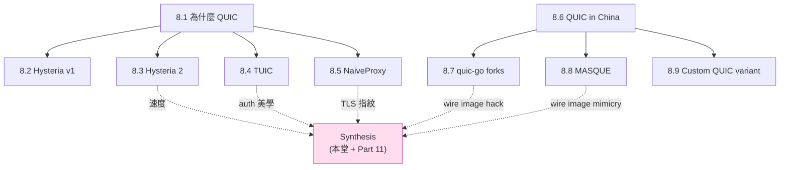

# 課堂 8.10 — QUIC 系給我們的啟示

## 學前知道
- 前置課：**整 Part 8 全部**（8.1–8.9）
- 預計閱讀時間：**40 分鐘**
- 這堂是 Part 8 synthesis，跟 [Part 7.X takeaways](../part-7-proxy-protocols/) 一起構成 Phase II 對「速度路線 + 抗識別路線」全圖

## 動機

到這裡 Part 8 已過完了。我們看過：

| Lesson | 主題 | 主啟示 |
|---|---|---|
| 8.1 | 為什麼 QUIC 系協議 | TCP-over-TCP 物理失敗 → UDP-based 必要；TCP ossification → QUIC 必要 |
| 8.2 | Hysteria v1 + Brutal CC | 用戶宣告速度有效，但 fairness 破壞 |
| 8.3 | Hysteria 2 | HTTP/3 masquerade + Salamander obfs；UDP relay via QUIC datagram |
| 8.4 | TUIC v4/v5 | TLS Keying Material Exporter 是 auth 黃金路徑；Full Cone NAT 給 game 用戶 |
| 8.5 | NaiveProxy | 借用 Chromium net stack 是 TLS 指紋抗識別極致 |
| 8.6 | QUIC 在中國 | GFW 解 Initial 看 SNI（2024-04+）；jumbo + SNI slicing bypass |
| 8.7 | quic-go forks | apernet/quic-go 是 anti-censorship feature 集中地 |
| 8.8 | MASQUE 深度 | 終極 wire image mimicry；iCloud + Cloudflare WARP 主力部署 |
| 8.9 | 自製 QUIC 變體 | QUICv2 + grease 是免費紅利，激進自製不值 |

本堂任務：

1. 把這 9 堂的設計啟示**壓縮成一張 design rationale 表**
2. 對照 Part 7（抗識別路線）的啟示，看「合一」的可能設計
3. 列出 Part 11/12 必須回答的問題
4. **誠實**列出我們目前還沒想清楚的點

---

## 核心概念

### 1. Part 8 全圖



### 2. 設計啟示完整壓縮表

用 Proteus 設計空間的維度組織（Goal × Threat × Design choice × Cost × Rationale × Plan B）：

| Goal | Threat | Design choice | Cost | Rationale | Plan B |
|---|---|---|---|---|---|
| **速度上限** | TCP-over-TCP meltdown | 必 UDP-based transport | UDP 在某些 ISP 被擋 | Titz 2001、Honda 2011 | port hopping |
| **0-RTT** | replay attack | QUIC 0-RTT + anti-replay nonce | 實作複雜 | TUIC 路線 | 1-RTT first connect |
| **用戶高速宣告** | TCP-friendly fairness 破壞 | Brutal CC opt-in (預設 polite) | 倫理問題 | Hysteria v1/v2 | 永久 polite, 速度退一檔 |
| **UDP relay** | HOLB if via stream | QUIC datagram (RFC 9221) | 1200 byte 上限 + 自寫 fragment | TUIC native mode, Hysteria 2 | stream-based reliable mode opt-in |
| **NAT for games** | NAT type 太嚴 → P2P 失敗 | Full Cone NAT design | server 端 fd 多用 | TUIC 路線 | Symmetric NAT (default for 非 game user) |
| **TLS 指紋抗識別** | JA3/JA4 fingerprint | uTLS or Chromium net stack | dependency cost | NaiveProxy + uTLS | 自寫但跟著 Chrome update |
| **SNI 過濾抗** | GFW 解 Initial (2024-04+) | jumbo Initial + SNI slicing + ECH-when-possible | Initial 變大、PMTU issue | Zohaib 2025 觀察 | QUICv2 base 規避 v1 hardcoded |
| **wire image 偽裝** | DPI 識別 QUIC | MASQUE + 借用熱門 SNI (Cloudflare class) | 需信任 SNI owner / borrow 機制脆弱 | Part 8.8 + Part 7 REALITY | 退回 H/2 over TCP + REALITY |
| **port shaping** | ISP shape UDP/443 | port hopping (iptables DNAT) | linux only, IPv6 待測 | Hysteria 2 路線 | TCP fallback |
| **auth** | password 出 wire | TLS Keying Material Exporter (RFC 8446 §7.5) | 0-RTT 下 early exporter spec 複雜 | TUIC 路線 | UUID + plaintext password in encrypted channel (退化) |
| **probe resistance** | 主動 probe 識別 | TLS layer fallback (REALITY) + app layer fallback (forwardproxy) | 雙層複雜 | Part 7 + 8.5 | 單 TLS layer |
| **anti-replay** | 0-RTT replay | nonce in first request + server cache | server 狀態 | RFC 8446 §8 | 禁用 0-RTT |
| **connection migration** | client IP 變動斷線 | QUIC connection migration | implementation 細節多 | RFC 9000 §9 | 重連 |
| **長 connection 識別** | GFW 觀察「長 UDP 流」加 watchlist | 主動斷線重連 + connection migration | 增加 control plane 複雜 | Hysteria / Cloudflare WARP | 不主動斷 |
| **TLS cert** | 自簽 cert / 自家 ACME cert 仍可被 列 blocklist | 借用真站 cert (REALITY 路線) | 機制複雜，破壞 TLS 直覺 | Part 7 | 自家 cert + 借熱門 SNI 但用自家 cert |
| **availability attack** | Mallory spoof 我們 SNI → block 我們 | source-IP-bound nonce 在 Initial | spec 改動，違反 RFC 9000 | Zohaib 2025 揭露 | port hopping + IP rotation 救急 |

### 3. 跟 Part 7 抗識別路線的合一

[Part 7 takeaways](../part-7-proxy-protocols/) 給的是 **TCP / TLS 路線最強抗識別** = VLESS + REALITY。

Part 8 給的是 **UDP / QUIC 路線最強速度** = Hysteria 2 + TUIC + MASQUE。

合一草圖（Part 11 詳論）：

```
Wire image:
  HTTPS/QUIC, borrowed cloudflare SNI (Part 7 REALITY 啟示 + Part 8 QUIC 速度)
  jumbo Initial + SNI slicing (Part 8.6/8.7)
  ECH if available

Transport:
  QUICv2 base (Part 8.9)
  Connection migration (Part 8.6 QUICstep)
  Port hopping (Part 8.3 Hysteria 2)

UDP relay:
  QUIC datagram (Part 8.3, 8.4, 8.8)
  Full Cone NAT (Part 8.4)

Auth:
  TLS Keying Material Exporter (Part 8.4 TUIC)
  0-RTT with anti-replay nonce
  No password on wire

Padding & framing:
  Capsule Protocol (Part 8.8 MASQUE)
  First N frames padded random 0-255 byte (Part 8.5 NaiveProxy)
  RST_STREAM 用 END_STREAM DATA 取代

Probe resistance:
  TLS layer fallback (Part 7 REALITY)
  Application layer fallback (Part 8.5 forwardproxy)

CC:
  Polite default (BBRv3)
  Brutal opt-in with signed declaration (Part 8.2/8.3 啟示)
```

這就是我們協議的「最大主義」設計。Part 11.4 主架構決策時要砍掉部分。

### 4. 為什麼這條合一路線可能成功

**競爭分析**：

| 現有 SOTA | 速度 | 抗識別 | 合一程度 |
|---|---|---|---|
| VLESS + REALITY (Part 7) | 中 | **最強**（TLS 借真站 cert） | 0 |
| Hysteria 2 | **最強** | 中（HTTP/3 masquerade，自家 cert） | 0 |
| TUIC v5 | 高 | 中（沒 masquerade） | 0 |
| NaiveProxy | 低（H/2 over TCP）| 高（Chromium net stack）| 0 |
| MASQUE (raw) | 高 | 高（wire image = HTTPS/QUIC, 借大站 SNI） | 0 |
| Cloudflare WARP MASQUE | 高 | 高 | 限自家 | 

**沒有一個現有協議同時做「VLESS+REALITY 級抗識別」+「Hysteria 2 級速度」**。我們協議的價值就在此。

**reachable**：所有元件都已被驗證（在不同協議上）。整合是工程問題，不是新發明。

**research contribution**：把 REALITY-style cert borrow 應用到 QUIC + ECH + jumbo Initial，這是新組合。Part 12 可寫 paper。

### 5. 還沒想清楚的點（誠實 list）

1. **REALITY-on-QUIC 怎麼做？** Part 7 REALITY 是 TCP+TLS 上的設計。把它搬到 QUIC：
   - Client 怎麼判斷 server 是「真正的 borrow site」還是 GFW MITM？REALITY 用 magic ticket，QUIC 上要重設計
   - server 端怎麼「同時」終結真站流量 + 我們流量？反向 proxy 設計複雜
   - 這個問題我**沒看到任何 production 實作**，是 Part 11 真正的開放問題

2. **借 SNI 但用自家 cert 是否夠？**
   - 已知 GFW 在 SNI 過濾後**沒**比對 cert（passive only）
   - 但 future GFW 可能 active probe 看 cert match
   - 若要真正借 cert，需要 REALITY-on-QUIC 的「真站握手」機制

3. **0-RTT 在我們設計下的 anti-replay**：
   - QUIC 0-RTT 的 anti-replay 機制（RFC 8446 §8）對「**簡單 GET**」OK
   - 對我們協議的 CONNECT-UDP / CONNECT-IP，replay 可能讓 server 多次 dial target
   - 設計 ground rule：0-RTT 只允許「冪等」first request，非冪等留 1-RTT

4. **Brutal CC opt-in 的 social mechanism**：
   - 技術上 user 可設 `bandwidth: 1gbps`
   - 道德上這對共用網路是 cheating
   - 我們協議該設**「signed declaration」** 嗎？

5. **MASQUE proxy 信任模型**：
   - Self-host MASQUE proxy: VPS admin 是 user 自己 → 信任 OK
   - Public MASQUE: 不存在 anti-censorship friendly 的 public MASQUE
   - 我們協議 default 假設 user **自架** server，提供方便 deploy 工具

6. **deployment 複雜度**：
   - Hysteria 2 部署：5 行 yaml + docker run
   - VLESS+REALITY: 約 20 行 config
   - 我們最大主義設計可能 50+ 行 → user 受不了
   - Part 12 必須做 **opinionated default + 1-line deploy**

7. **formal verification scope**：
   - 我們協議至少要驗 auth secrecy + forward secrecy
   - ProVerif / Tamarin 跑得動我們協議嗎？Capsule Protocol + QUIC + TLS + 自家 framing 層級太多
   - Part 11.10 / 11.11 必須有 scope decision

8. **paper venue**:
   - USENIX Security / NDSS: 需要 measurement + design
   - PoPETs: 偏 privacy mechanism
   - CCS: 偏 crypto
   - Part 12.X 結束前定 target venue

---

## 與我們協議設計的關聯

整個 Part 8 都是「給我們協議的啟示」。本堂的 sec 3 表 = Part 11.4 主架構決策的**輸入**。

Part 11 將執行：

1. 11.1 把上表的 threat 寫成 formal threat model
2. 11.2 把 design goals 排優先級 → 砍掉部分元件
3. 11.3 設計空間探索 → 從上表挑取核心 N 項
4. 11.4 主架構決策 + design rationale
5. 11.5-8 spec 寫作（report 級）
6. 11.9-12 形式化驗證
7. 11.13-14 review + 第二版 spec

---

## 動手（可選）

無新實驗。建議：

1. 把 Part 7 + Part 8 所有 lesson 的 takeaways 翻一遍
2. 在自己 markdown 草稿裡寫一個「我的協議 v0.0 design sketch」(20-50 行)
3. 對著 sec 3 的表 self-critique：哪些元件**我還搞不懂如何整合**

這個草稿在 Part 11.1 開課時會回頭比對。

---

## 自我檢查

1. 速度路線（Part 8）和抗識別路線（Part 7）的核心 trade-off 是什麼？能否量化？
2. 若 GFW 在 2027 升 Tier 4（重組 CRYPTO frame），我們 sec 3 表的哪幾項立即失效？
3. 「最大主義」合一設計的最大維護成本是什麼？(提示：依賴 Chromium、依賴 quic-go fork、依賴 IETF 還沒 finalize 的 MASQUE drafts)
4. REALITY-on-QUIC 至少有哪些技術障礙我們現在還不知道答案？
5. 為什麼我們現在還不該寫 spec / code？（提示：Part 9 / 10 還沒完，威脅模型還不完整）

---

## 延伸閱讀

- 整 Part 7 + Part 8 所有 lesson 的 研究級補遺
- Part 11/12 syllabus 預覽
- VLESS+REALITY、Hysteria 2、TUIC v5、NaiveProxy、Cloudflare WARP 完整對比表（社群有多份）
- 自己讀完後**寫一份 design sketch markdown**，留待 Part 11 開課用

---

## 研究級補遺

### 1. 學界詞彙

| 我們口語 | 學界 |
|---|---|
| 速度路線 + 抗識別路線合一 | "Joint optimization of performance and censorship resistance" |
| 借用 cert | "Cooperative TLS / borrowed-identity TLS" |
| Wire image mimicry | "Protocol mimicry" (Wang 2015 PoPETs) |
| 最大主義 | "Defense-in-depth" |
| 信任模型分層 | "Layered trust model" |

### 4. 領域的關鍵論文 / 規格 / 原始碼（合 Part 7+8 主源）

| Source | 為什麼 |
|---|---|
| RFC 9000/9001/9002 | QUIC base |
| RFC 9297/9298/9484 | MASQUE base |
| RFC 8446 §7.5 | TLS exporter |
| RFC 8999 | invariants |
| Zohaib USENIX Sec 2025 | GFW QUIC SNI 過濾 |
| Wu USENIX Sec 2023 | Fully-encrypted detection |
| Frolov IMC 2019 | TLS fingerprint |
| Hysteria 2 / TUIC / NaiveProxy / VLESS+REALITY | 競爭分析 base |
| Cloudflare quiche / mvfst / quic-go / apernet/quic-go | implementation reference |

### 5. 我們協議的座標 / 設計取捨

```
Proteus 完整 — Part 8 結束狀態:

Decided:
  - Transport: QUIC (UDP-based, QUICv2 base preferred)
  - Wire image: HTTPS/QUIC + borrowed SNI + jumbo Initial + SNI slicing
  - UDP relay: QUIC datagram (RFC 9221)
  - Framing: Capsule Protocol 風 (MASQUE 風)
  - Auth: TLS Keying Material Exporter
  - 0-RTT: 採, 限冪等 first request
  - CC: polite default + brutal opt-in
  - Padding: first N frames random 0-255 byte
  - Probe resistance: TLS layer fallback + app layer fallback
  - Port hopping: 內建
  - Connection migration: 必有
  - Full Cone NAT: 必有

Open:
  - REALITY-on-QUIC 機制細節
  - Brutal opt-in 的 social mechanism
  - Formal verification scope
  - Paper target venue
  - Specific PRF for password → token derivation
  - .well-known URI structure
  - Capsule type registry strategy

Rejected:
  - 完全自製 transport (光譜 F)
  - 違反 RFC 8999 invariants (光譜 E)
  - 兩 hop oblivious (過度設計)
  - 自家 TLS stack (NaiveProxy / uTLS 都不夠, 必須借 Chromium 或 uTLS Chrome preset)
```

Part 11 將處理 Open list。

### 6. 必追資源 / 社群入口

- 整 Part 7 + Part 8 已列的所有來源
- 額外 highlight：
  - **GFW.report** 訂閱（每月 1-2 篇 update）
  - **net4people/bbs** GitHub Issues（每週 5-10 條觀察）
  - **IETF QUIC / MASQUE / TLS WG mailing list**
  - **r/dumbclub_zh** 中文社群 vibes

### 7. 開放問題（合 Part 7+8）

- **OP-1 REALITY-on-QUIC mechanism**: 把 REALITY 的 client-server magic ticket 機制搬到 QUIC，spec 怎麼寫？沒人做過。我們 Part 11 的 research contribution candidate。
- **OP-2 ML-based censor resistance**: GFW 將來上 CNN/Transformer 對 packet sequence 分類，怎麼防？這跟 Part 10 流量分析直接相關。
- **OP-3 形式化驗證 scope**: 多層 capsule + QUIC + TLS 的形式化模型在 ProVerif / Tamarin 跑得動嗎？沒人試過這麼複雜的協議。
- **OP-4 deployment usability**: SOTA 抗 censorship 要求 user 做 N 個 config，怎麼 1-line deploy？這是工程問題但對 adoption 至關重要。
- **OP-5 ethics**: Brutal CC 對 shared 網路是 cheating。我們協議是否該 enforce / detect / report？這超出技術 boundary。
- **OP-6 long-term spec evolution**: IETF QUIC / MASQUE drafts 仍在演進。我們協議跟著 evolve 還是 fork 凍結？這影響 paper 的 publish window。

**Part 8 結束。下一站 Part 9：GFW 完整研究綜述 + 自建測試平台。**
