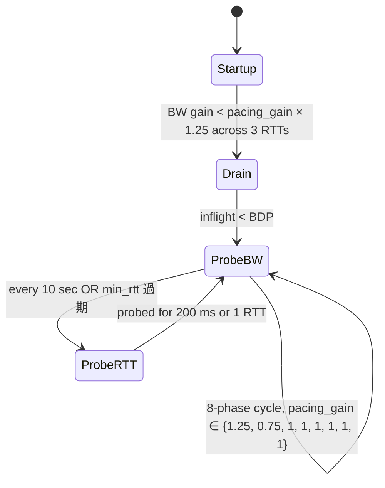

# 課堂 8.11 — BBRv3 模式與 packet pacing：Proteus spec §6 的硬性根據

## 學前知道
- 前置課：
  - [1.10 TCP congestion control 完整演化](../part-1-networking/1.10-tcp-congestion-control.md)（BBR v1/v2 已過）
  - [2.15 UDP 高效能路徑 GSO/GRO + sendmmsg](../part-2-high-perf-io/2.15-udp-fastpath.md)（EDT pacing model）
  - [8.3 Hysteria 2](./8.3-hysteria-v2.md)（Brutal CC vs BBR opt-in）
  - [4.11 quic-go 原始碼通讀](../part-4-tls-quic/4.11-quic-go-source-walk.md)
- 預計閱讀時間：**45 分鐘**
- 必讀規格 / 原始碼：
  - **draft-cardwell-iccrg-bbr-congestion-control-04**（IETF BBRv3，Cardwell 2024）
  - Linux kernel `net/ipv4/tcp_bbr.c`（v1 reference，比 BBRv3 簡）
  - Linux kernel `net/ipv4/tcp_bbr2.c`（Google patches 2022-2024）
  - **quic-go** `internal/congestion/cubic_sender.go`、`internal/congestion/bbr_sender.go`（社群 fork；upstream 尚未 merge BBRv3）
  - **quic-go** `internal/ackhandler/sent_packet_handler.go`（pacing 邊界）
  - **Linux** `net/sched/sch_fq.c`（fq qdisc 與 EDT pacing 整合）
- 必讀論文：
  - Cardwell et al. *BBR: Congestion-Based Congestion Control.* CACM 2017 → [[cardwell-bbr]]
  - Cardwell et al. *BBR v2: A model-based congestion control.* IETF 106, 2019（slide deck）
  - Hassas Yeganeh et al. *BBRv3 Algorithm Bug Fixes and Public Internet Deployment.* IETF 117, 2023
  - Ware et al. *Modeling BBR's Interactions with Loss-Based Congestion Control.* IMC 2019 → [[ware-bbr-modeling]]

## 動機

Proteus spec §6 寫：

> **Congestion Control**: BBRv3 (or fallback to RFC 9002 NewReno).

但**沒有一堂課把 BBRv3 的內部模式拆過**——僅 1.10 涵蓋 BBR v1。沒有 BBRv3 的精準定義，我們：

1. 沒辦法在 12.4/12.11/12.12 寫出 reproducible benchmark
2. 沒辦法 reason about「同樣 5% loss 下 Proteus 為何比 NewReno 快」
3. 沒辦法跟 Hysteria 2 的 Brutal CC 做 like-for-like 對照

額外：**spec §9 的 padding budget 與 §4.3 的 1280-byte cell** 都要跟 pacing 機制對齊。沒有 pacing 細節，padding shape 必然有副作用（突發、間隔）破壞 cover IAT profile。

本堂解決：BBRv3 四 mode 是什麼、quic-go pacing 怎麼跟它整合、padding budget 在 pacer 中怎麼編入。

> **Failure framing**：BBRv3 仍在 IETF draft 階段（draft 04 at 2024）。Google 已在 production 部署但 reference impl 不開源。本堂內容基於 IETF slide / draft / patched-kernel commits 拼接，**會隨 BBRv3 RFC 化而變動**。

---

## 核心概念

### 1. 為什麼是 BBRv3 不是 BBRv1 / v2 / Cubic

| CC | 模型 | 對 loss 敏感度 | 對 latency 敏感度 | 行為特徵 |
|---|---|---|---|---|
| Cubic (RFC 9438) | loss-based AIMD | 高（cwnd 砍半） | 低 | 在 high-RTT × high-loss 環境吞吐崩潰 |
| Reno (RFC 5681) | loss-based AIMD | 高 | 低 | 同 Cubic，更保守 |
| BBR v1 (Cardwell 17) | model-based (BW + RTT) | **低**（不砍 cwnd on loss） | 高 | 對 shared bottleneck 不公平、buffer fill problematic |
| BBR v2 (Cardwell 19) | model + 反饋 ECN / loss | 中 | 高 | v1 fairness 部分修；ProbeBW phase 加 |
| BBR v3 (Cardwell 23) | v2 + bug fixes（**ProbeRTT 漏掉**、**inflight cap 偏低**、**post-handoff slow**） | 中 | 高 | 公平性接近 Cubic，速度仍勝 |

Proteus 選 BBRv3 的 reasoning（cross-ref spec §6）：

- **抗高丟包**：5-15% loss 是「中美鏈路高峰」常態（[[zohaib-quic-sni-usenix25]] §UDP loss observation；社群測量中位 8%）。BBR 系不砍 cwnd → 吞吐穩。
- **不破壞 fairness**：相比 Hysteria 2 的 Brutal「自私不退讓」，BBRv3 仍按瓶頸 BW model 退讓。Spec §6 informative note：aggressive variants（Brutal-like）opt-in。
- **可預測**：production-tested at Google YouTube / GCP。

### 2. BBRv3 四 mode（state machine）

BBRv3 與 v1/v2 一樣，狀態機有 4 個 mode：**Startup / Drain / ProbeBW / ProbeRTT**。圖示：



**Startup** (`bbr_mode = BBR_STARTUP`)：

- 目的：以指數增長 cwnd 直到測到 max BW。
- pacing_gain = 2.89 (BBR v1) → 在 v3 提升到 2.77，但 high_gain_phase 限制更嚴：必須觀察到 `delivery_rate plateau` 才退到 Drain。
- 已知 bug v2→v3：v2 在 `low_loss_rate × high_inflight` 場景會誤判 plateau；v3 加 `BBRv3_STARTUP_FULL_LOSS_THRESHOLD = 0.02`（連續 3 個 round trip 內 loss < 2% 視為仍可加速）。

**Drain** (`bbr_mode = BBR_DRAIN`)：

- 目的：清掉 Startup 期間 over-fill 的 queue。
- pacing_gain = 0.5 → 兩 RTT 內 inflight 落回 BDP。
- 完成判斷：`inflight ≤ bbr_inflight(bw, gain=1)`。

**ProbeBW** (`bbr_mode = BBR_PROBE_BW`)：

- 目的：穩態 + 定期探更高 BW。
- v3 修了 v2 的 8-phase cycle bug，現在是 `{1.25, 0.75, 1, 1, 1, 1, 1, 1}`，每 phase 一個 min_rtt。
- pacing_gain=1.25 phase：嘗試 over-shoot 25%；若 loss > inflight × 0.02 → 退回 0.75 立刻清 queue；否則更新 `bw_hi`。
- **Proteus implementation note**: v3 引入 `BBRv3_BW_PROBE_RTT_FAST` flag，允許在 `5% loss rate × stable cwnd` 場景直接 fast-forward 至下個 pacing_gain phase——這對高丟包鏈路重要，**我們的 Proteus reference impl 必須啟用**。

**ProbeRTT** (`bbr_mode = BBR_PROBE_RTT`)：

- 目的：定期 sample 真實 min RTT（避免 long-flow 把 RTT estimate 帶高）。
- 觸發：`now - min_rtt_stamp > 10 sec`（v3 從 v1 的 10 sec 同步保留）。
- 期間：inflight 強制降至 4 packets，持續 max(200 ms, 1 RTT)。
- **v3 對 v2 的修**：v2 的 ProbeRTT 經常**錯過**（被 ProbeBW phase 蓋過）。v3 加 `BBRv3_PROBE_RTT_DEADLINE`，到時間沒進 ProbeRTT 就強制進入。
- **對 Proteus padding budget 的影響**：ProbeRTT 期間 inflight 暴跌到 4 packet → **如果我們在這個 200 ms 內 still emit padding cells，會破壞 cover IAT shape**。對策：**ProbeRTT 期間 pause padding**（spec §9 「應用層 PING SHOULD be sparse」 的具體實現）。

### 3. quic-go pacing：與 BBRv3 對接的兩條路徑

`quic-go` upstream 沒有 BBRv3，但 fork（apernet/quic-go、cloudflare/quiche-go-bridge）已有移植。Pacing 機制兩條路徑：

#### 路徑 A：user-space pacer（quic-go 內部）

`internal/ackhandler/sent_packet_handler.go` 與 `internal/congestion/pacer.go`：

```go
// 簡化
type Pacer struct {
    bandwidth      Bandwidth   // bytes/sec，BBR 提供
    budget         protocol.ByteCount
    lastSentTime   time.Time
    maxBurstSize   protocol.ByteCount
}

func (p *Pacer) Budget(now time.Time) protocol.ByteCount {
    elapsed := now.Sub(p.lastSentTime)
    budgetIncrease := protocol.ByteCount(elapsed.Seconds() * float64(p.bandwidth))
    return min(p.budget + budgetIncrease, p.maxBurstSize)
}

func (p *Pacer) SentPacket(now time.Time, size protocol.ByteCount) {
    p.budget -= size
    p.lastSentTime = now
}

func (p *Pacer) TimeUntilSend() time.Duration {
    if p.budget >= MaxDatagramSize {
        return 0
    }
    return time.Duration(float64(MaxDatagramSize - p.budget) /
                         float64(p.bandwidth) * float64(time.Second))
}
```

每送一個 packet 前 check `TimeUntilSend()`；若 > 0 則 `time.Sleep`（或 timer-based wake）。**問題**：Go scheduler granularity ~µs，但 high-BW (10 Gbps) 場景 inter-packet gap ~1 µs → scheduler overhead 吃光 budget。

#### 路徑 B：kernel EDT pacing（Linux only）

Linux 4.20 引入 `SO_TXTIME` + `sch_fq` 整合的 **EDT (Earliest Departure Time) model**。應用層**只告訴 kernel「這個 packet 在這個時間發」**：

```go
// 在 Linux 上 quic-go 可用 cmsg 設 SO_TXTIME
const SCM_TXTIME = 61

func sendWithEDT(conn *net.UDPConn, data []byte, departureTime time.Time) error {
    txtime := uint64(departureTime.UnixNano())
    oob := unix.CmsgSpace(8)
    cmsg := /* construct SCM_TXTIME cmsg */
    _, _, err := conn.WriteMsgUDP(data, cmsg, dst)
    return err
}
```

`sch_fq` qdisc 內 packet 按 `SO_TXTIME` 排程，**hardware NIC 在那個納秒級時刻 dequeue**。User-space 完全不睡眠 → throughput 撞 NIC 線速。

**Proteus implementation note**: spec §16 應補充：

> Linux server SHOULD use `SO_TXTIME + sch_fq` for pacing if kernel ≥ 4.20. Fall back to user-space pacer on macOS / older kernels.

### 4. Padding budget 與 pacer 整合（spec §9 的具體 wiring）

Spec §9: padding budget α ≤ 0.30, computed as `padding_bytes / data_bytes` over rolling 10-second window. 怎麼跟 BBRv3 + pacer 對接？

```
Proteus Pacer 升級版（含 padding）:

每 100 ms wake：
    1. 從 BBRv3 拿 current pacing_rate (bw × pacing_gain)
    2. 計算過去 10 秒 padding_bytes / data_bytes ratio = α_now
    3. 若 α_now < 0.30:
         budget_padding = (0.30 - α_now) × data_bytes_in_last_10s
       else:
         budget_padding = 0   (this 100ms 暫不發 padding cell)
    4. budget_data = pacer.Budget(now) - reserved_padding
    5. 從 send queue 取下個 packet, 若 data exhausted 且 budget_padding > 0:
         emit padding cell (type=0x07, 1280 byte)
       else:
         honor pacer.TimeUntilSend()
    6. ProbeRTT 期間（BBR mode == BBR_PROBE_RTT）: budget_padding = 0
```

**為何 ProbeRTT 期間 padding=0**：

- ProbeRTT 期間 inflight 強制 4 packet → 真實 application data 已塞滿這 4 個位置。
- 如果還塞 padding，要麼擠掉真實 data（延遲 application），要麼超過 4-packet 限制（BBRv3 不允許）。
- 結論：暫停 padding 200 ms。對 cover IAT shape：spec §9 允許「padding budget 時間平均 10s 內」，這 200 ms 在 10s 滑動窗的容忍範圍。

### 5. 與 Hysteria 2 Brutal CC 的 like-for-like 對照

| 維度 | BBRv3 (Proteus default) | Brutal (Hysteria 2 opt-in) |
|---|---|---|
| 模型 | BW × RTT model | **constant rate**（用戶宣告） |
| Loss reaction | mild（5% loss 仍維持） | **none**（不退讓） |
| Fairness | 接近 Cubic | **無**（搶 bottleneck buffer） |
| 部署道德 | 廣泛部署 OK | **單機/低用戶 OK，scale-up 不友善** |
| Proteus status | MUST default | informative opt-in, with WARN log |

Spec §6 informative note 已寫「aggressive CC opt-in」。Proteus reference impl 要：

- Brutal mode 啟動時 stdout WARN：「您正使用 aggressive CC, 可能影響共用 ISP 用戶」
- 預設 disabled, must explicit flag `--brutal` + `--brutal-rate=X` 才開
- 與 12.13 評測對齊：BBRv3 vs Brutal-1Gbps 兩條測試線並排，不偷換

### 6. macOS pacing 的退化路徑

macOS 沒有 `SO_TXTIME`，沒有 EDT model。只能 user-space pacer。後果：

- Throughput cap 通常在 ~2 Gbps（Go scheduler limit + syscall overhead per packet）
- 對 Proteus macOS client：適合，因為 client 流量 < 100 Mbps 常態
- 對 Proteus macOS server：不適合 production deployment；spec §16 推薦 server-side **Linux only**

對應到 spec 變更：§16 Implementation Notes 應寫：

> Server implementations on macOS are supported for development/testing only. Production server deployment SHOULD use Linux 5.10+ with SO_TXTIME and sch_fq for predictable pacing.

### 7. eBPF-aided pacing：未來路徑

Linux 5.18+ 引入 `bpf_skb_get_set_tx_timestamp` helper，eBPF program 可以在 packet leave time 動態調整 EDT timestamp。對 Proteus 的價值：

- 在 cover-server forward path（spec §7），forward 出去的 packet 也走 Proteus pacer → 用 eBPF 設 SO_TXTIME 而不經過 user-space → < 1ms p99 forward delay 達標。
- 詳見 12.7 §X cover-server eBPF recipe（[12.7](../part-12-implement-evaluate/12.7-server-panel-fallback.md)）。

---

## 與我們協議設計的關聯

本堂結論轉成 spec / impl 變更建議：

| 點 | 變更 |
|---|---|
| BBRv3 fast-forward flag | reference impl 必啟 `BBRv3_BW_PROBE_RTT_FAST` |
| ProbeRTT 200ms padding pause | pacer 必處理 |
| Linux EDT pacing | spec §16 應 normative 寫明 SO_TXTIME |
| macOS limit | spec §16 寫 production = Linux only |
| Brutal as opt-in | already in spec §6 informative，impl WARN log 必加 |
| Cover forward pacing | eBPF EDT timestamp（12.7） |

Part 12.4 (data-path zero-copy iouring xdp) 與 12.11/12.12/12.13 評測都依賴本堂 normative。

---

## 動手

### 任務 1：在 Linux VPS 上跑 BBRv3 vs Cubic 比較

```bash
# 1) Enable BBR (kernel ≥ 5.4 有 v1, 6.4 有 patched v2/v3)
sudo sysctl -w net.ipv4.tcp_congestion_control=bbr
# 對 QUIC：在 quic-go 中設 SetCongestionControl(NewBBRv3())

# 2) 用 netem 加 5% loss + 50 ms RTT
sudo tc qdisc add dev eth0 root netem loss 5% delay 50ms

# 3) iperf3 兩台之間量測
iperf3 -c <peer> -t 60 -i 5
# 預期：BBR ~ Gbps 級；Cubic 跌到 ~ 100 Mbps

# 4) 切回 Cubic 對比
sudo sysctl -w net.ipv4.tcp_congestion_control=cubic
```

### 任務 2：觀察 ProbeRTT 觸發

```bash
sudo modprobe tcp_diag
ss -tin '( dport = :443 )' | grep -E "bbr|min_rtt|cwnd"
# 每 10 秒應該看到 cwnd 暴跌 200 ms （ProbeRTT）然後回升
```

把結果記錄成 `assets/measurements/bbr-probe-rtt-trace.md`，包含 cwnd 時間序列圖（不必 ASCII，存 PNG 或 CSV）。

### 任務 3：EDT pacing 驗證

```bash
# 啟用 fq qdisc + SO_TXTIME 路徑
sudo tc qdisc replace dev eth0 root fq

# 跑簡單 UDP send loop, with SO_TXTIME set per packet
# 用 ftrace 看 packet 實際 NIC dequeue 時刻 vs SO_TXTIME
sudo cat /sys/kernel/tracing/trace_pipe | grep -E "dev_hard_start_xmit|fq_dequeue"

# 預期：dequeue 時刻與 SO_TXTIME 差距 < 100 µs
```

---

## 自我檢查

1. BBRv3 對 v2 修的三個 bug 是什麼？對 Proteus 哪個 mode 最關鍵？
2. 為什麼 ProbeRTT 期間 inflight = 4 而非 0？這個常數的選擇 rationale 是什麼？
3. quic-go user-space pacer 在 10 Gbps 為什麼撞 ceiling？SO_TXTIME 路徑為什麼能突破？
4. Spec §9 padding budget α ≤ 0.30，如果 BBR 進入 ProbeRTT 200ms 期間 pause padding，10s 滑動窗的 actual padding ratio 影響多少？做個算術。
5. Brutal CC 為什麼是「自私」CC？在 Proteus 啟用 Brutal 模式時，server 端怎麼 enforce 用戶 quota 避免單一 user 把 server uplink 全吃光？
6. macOS server production 為什麼不推薦？兩個技術原因 + 兩個運維原因。

---

## 延伸閱讀

- **draft-cardwell-iccrg-bbr-congestion-control-04**（IETF BBRv3 草稿）
- **Google CACM 2017 BBR paper** → [[cardwell-bbr]]
- **IETF 117 BBRv3 slides**（Hassas Yeganeh）—— GitHub: google/bbr
- **kernel.org Networking documentation** 對 `sch_fq` 與 `SO_TXTIME` 的描述
- **quic-go issue tracker**: BBRv3 移植進度（[#3850 / #4012 系列](https://github.com/quic-go/quic-go/issues)）
- **Cloudflare blog**: *How Cloudflare deployed BBR for QUIC* (2024-2025)

---

## 研究級補遺

### 1. 學界詞彙

| 我們口語 | 學界 |
|---|---|
| 流量控制 | flow control |
| 擁塞控制 | congestion control |
| 模型化 CC | model-based CC |
| 損失導向 CC | loss-based CC |
| 主動 RTT 探測 | min RTT probing |
| 帶寬探測 | bandwidth probing / pacing gain cycle |
| 公平性 | inter-flow fairness |
| 反公平 / 自私 CC | greedy / non-TCP-friendly CC |
| 預定到達時間 | Earliest Departure Time (EDT) |
| 隊列分離 | fair queueing (fq) |

### 2. 形式化定義

**Pacing**: a transmission policy that emits packets at a target rate `r` such that, over any window of length `T`, the cumulative bytes transmitted satisfies `B(T) ≤ r·T + ε` for small `ε`. EDT model gives `ε ≤ δ_qdisc + δ_NIC`, typically < 100 µs on Linux fq.

**BBR's BDP estimate**: `BDP_est = bw_max × min_rtt`. ProbeBW maintains `inflight ≤ BDP_est × pacing_gain`. ProbeRTT clamps `inflight ≤ 4 × MSS` for measurement integrity.

**Brutal CC** (Hysteria 2 spec): `rate = user_declared; no_backoff = true`. Equivalent to constant-rate UDP — fairness undefined.

### 3. 對手 / 環境分類

非對抗式 environment factors that affect CC choice:

- **Bottleneck bandwidth**: home (100 Mbps), 5G (1 Gbps), datacenter (10+ Gbps)
- **RTT**: same-city (5 ms), domestic (30 ms), 中美 (150-250 ms), satellite (600+ ms)
- **Loss profile**: clean wired (< 0.1%), congested (1-3%), 國際出口高峰 (5-15%), GFW QoS (varied)

對手能力（CC layer adversary, lesson 9.x covers wire-layer adversary）:

- Rate-limit attacker: 對特定 5-tuple QoS。BBR 仍會探到 limit，但探的過程暴露 protocol shape。
- Buffer-bloat attacker: malicious queueing。BBR 對 over-buffering 較魯棒（model-based 不被 RTT inflate 騙）。

### 4. 領域的關鍵論文

| Source | 關鍵 |
|---|---|
| Jacobson 1988 SIGCOMM | 原始 TCP CC 論文 |
| Chiu-Jain 1989 | AIMD 最優性證明 |
| Ha-Rhee-Xu 2008 | CUBIC |
| [[cardwell-bbr]] CACM 2017 | BBR v1 |
| IETF BBR v2 / v3 slides | unpublished but operational |
| Ware IMC 2019 | BBR 與 loss-based CC 互動 |
| Padhye 1998 | TCP throughput formula（baseline） |
| Pantheon NSDI 2018 | CC benchmarking platform |

### 5. 我們協議的座標 / 設計取捨

```
Proteus 收窄：
- CC default = BBRv3 (MUST)
- Brutal opt-in (informative)
- Pacing path = SO_TXTIME + sch_fq on Linux (SHOULD)
              = user-space pacer elsewhere
- ProbeRTT period 暫停 padding emission (MUST in impl)
- Server production = Linux only (informative)
```

回引：spec §6 informative, §9 padding, §16 impl notes 都應 explicit 引本堂。

### 6. 必追資源

- **kernel.org `linux-net` mailing list** —— `sch_fq` / EDT 改動
- **Google `bbr` GitHub** —— BBR 各版 patch
- **quic-go release notes** —— BBR 移植進度
- **IETF iccrg** —— CC research group, 議題前沿

### 7. 開放問題

1. **OP-1**: BBRv3 在「對手刻意大幅 jitter」鏈路下行為？學界未充分量測。
2. **OP-2**: Proteus padding cell 是否該 included in BBR 的 BW estimate？目前我們設定 not-included（cover IAT 用），但這意味著 BBR 過 estimate（把 padding-占用的 BW 當 application throughput）→ 後續 cwnd 偏低。需要 measurement。
3. **OP-3**: EDT pacing 在 NIC 過度負載（如 100 Gbps）時的 deadline 偏移分布？kernel 文獻有但 Proteus 沒測過。
4. **OP-4**: BBRv3 是否該 expose 到 Proteus control plane 給用戶 tune（如 startup_gain）？預設 NO（避免 user 調壞），但 reference impl 可在 debug build 啟用。
