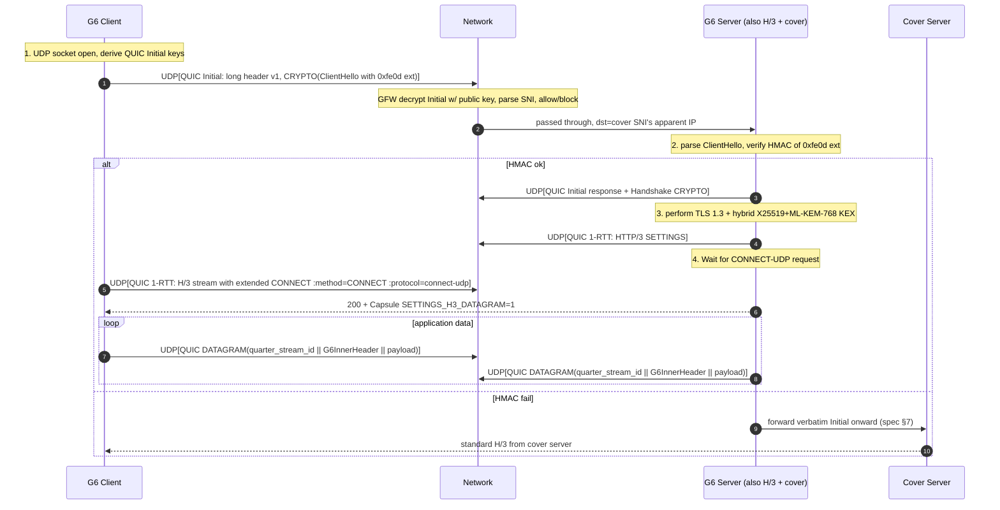
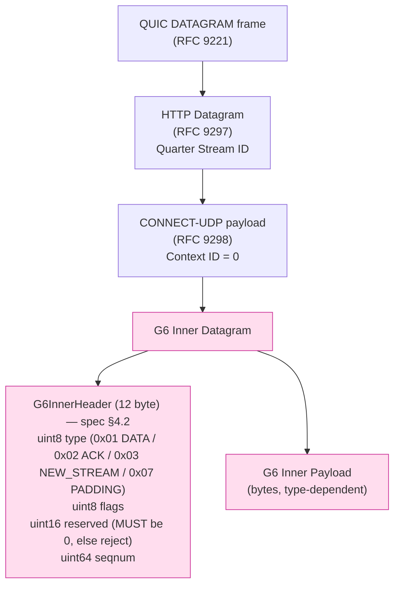

# 課堂 8.12 — G6 在 MASQUE 上的 wire-format mapping：實作藍圖

## 學前知道
- 前置課：
  - [4.10 HTTP/3 與 MASQUE](../part-4-tls-quic/4.10-http3-and-masque.md)
  - [8.8 MASQUE 深度](./8.8-masque-deep.md)
  - [4.8 QUIC 握手](../part-4-tls-quic/4.8-quic-handshake.md)
  - [11.5 G6 wire format spec](../part-11-design/11.5-spec-wire-format.md)
  - [11.6 G6 handshake state](../part-11-design/11.6-spec-handshake-state.md)
- 預計閱讀時間：**45 分鐘**
- 必讀規格：
  - **RFC 9297** §2 (HTTP Datagram) §3 (Capsule Protocol)
  - **RFC 9298** (CONNECT-UDP)
  - **RFC 9000** §16 (varint), §19.5 (DATAGRAM frame), §17.2 (long header)
  - **RFC 9001** §5.2 (Initial keys)
  - **RFC 9114** §6 (Extended CONNECT in HTTP/3)
  - G6 spec `assets/spec/g6-v0.1.md` §3, §4, §5, §7

## 動機

G6 spec §3 列出三個 transport profile：

- **γ (primary)**：MASQUE CONNECT-UDP over H/3 over QUIC over UDP/443
- **β (fallback)**：raw QUIC + REALITY-on-QUIC
- **α (last resort)**：TLS 1.3/TCP/443 + REALITY-on-TCP

但**spec §4 給出的 wire format（`G6AuthExtension`、`G6InnerHeader`）沒有寫明：當走 γ profile 時，這些 byte 怎麼放進 MASQUE capsule / HTTP Datagram / 0xfe0d TLS 擴展**。

換句話說，**spec 給了「位元結構」，但缺「位元結構 ↔ MASQUE 各層位置」的綁定**。沒有這個 binding，Part 12 implementation 寫不出 byte-exact code。

本堂解決：

1. G6 client 啟動到 application data 全程的位元順序圖
2. `G6AuthExtension` 怎麼塞進 QUIC ClientHello 內的 TLS extension
3. `G6InnerHeader` 怎麼包進 CONNECT-UDP HTTP Datagram / Capsule
4. 三個 profile 共用 spec §4 的策略

> **Failure framing**：MASQUE 的 wire-format 細節仍在 IETF 演化（RFC 9298 公布 2022-08，但 EHIP / connect-ethernet 仍 draft）。本堂寫的是 2026-05 RFC 狀態，未來 EHIP / connect-quic-proxy 上線後本堂部分內容需 update。

---

## 核心概念

### 1. γ profile 完整 byte 順序圖

從 client 啟動連線到第一個 application byte，整個過程要寫的 byte 順序：



九個 step 是 G6 γ profile 的全部 wire interaction。本堂逐 step 拆 byte 解。

### 2. Step 1: QUIC Initial 與 0xfe0d TLS 擴展

#### 2.1 QUIC Initial packet structure (RFC 9000 §17.2.2)

```
QUIC Initial packet:
+--------+----------------+----------------+--------+-----+--------+
| Long   | Version        | DCID Length    | DCID   | SCID| Token  |
| Header | (0x00000001)   | (0-20 byte)    |        | Len |        |
| 0xC0   |                |                |        |     |        |
+--------+----------------+----------------+--------+-----+--------+
| Token Length | Token | Length | Packet Number | Payload (CRYPTO frame containing TLS ClientHello)
```

`Payload` 加密用 RFC 9001 §5.2 Initial keys（**公開 key，GFW 能解**）。

#### 2.2 TLS ClientHello 帶 0xfe0d 擴展

`Payload` 內的 CRYPTO frame 解開後是 TLS ClientHello。G6 在這裡掛上 `extension_type = 0xfe0d`：

```
TLS Extension (RFC 8446 §4.2 generic frame):
  uint16  extension_type   = 0xfe0d
  uint16  extension_data_length = 1186
  opaque  extension_data[1186]:

    struct G6AuthExtension {                  // spec §4.1
      opaque   client_nonce[16];
      opaque   client_x25519_pub[32];
      opaque   client_mlkem768_ct[1088];
      opaque   client_id[16];
      uint16   timestamp_unix_minutes;
      opaque   auth_tag[32];
    }                                          // total 1186 byte
```

**為何 1186**：16+32+1088+16+2+32 = 1186。對齊 ML-KEM-768 ciphertext 1088 byte，總 extension 略大於 1 KB，但仍**小於 QUIC Initial 1280-byte PMTU 限制**——重要。

**為何不切片成多個 Initial datagram**：spec 故意把 0xfe0d 塞進**單一 UDP datagram 的單一 Initial packet**。理由：

- [[wu-henan-sp25]] / [[zohaib-quic-sni-usenix25]] 揭示 censor 對 multi-datagram CRYPTO reassembly 仍不穩 (GFW 部分修, Henan 完全沒做)。**依賴 reassembly = 依賴 censor 之 bug**。G6 不依賴。
- 1186 byte ext + ClientHello base (≈ 250 byte) + padding 到 1200 = 完整單 datagram 1280 byte UDP payload。

#### 2.3 SNI 字段：cover domain 的明文

`extension_type = server_name (0x0000)` 仍在同個 ClientHello 內，**值是 cover domain**（如 `www.cloudflare.com`）。

**Censor 視角**：
- 解出 SNI = `www.cloudflare.com` → 不在 blocklist → 放行（[[zohaib-quic-sni-usenix25]] §findings）。
- 0xfe0d 擴展對 censor **看起來像隨機 byte**——它本來就是 (HMAC + ECDH share + KEM ciphertext)，全 high-entropy。

**設計取捨**：
- 為何不用 ECH（Encrypted ClientHello）藏整個 ClientHello？答：ECH 在 GFW 量測下「outer SNI 仍 plaintext」（[[zohaib-quic-sni-usenix25]] 5.3）→ 跟我們 cover SNI 設計重複；且 CDN ECH 部署率低，反成 fingerprint。
- 為何不用 GREASE（0x?A?A）混淆 extension type？答：我們**已有 GREASE**（spec §12.2 客戶端必須 insert 1-2 random GREASE extension），但 0xfe0d 必須在固定位置，否則 server 找不到。

### 3. Step 2-3: HMAC 驗證 + Hybrid KEX

Server 收到 Initial 後（spec §5.2，handshake states INIT → AUTH_PENDING → VERIFY → DECAPS → SECRET_DERIVED）：

1. **VERIFY**: 解 0xfe0d ext，計算 expected `auth_tag = HMAC-SHA-256(auth_key, ...)`，與 ext 中 tag 比。
2. **DECAPS**: 用 `server_kemsk` 解 `client_mlkem768_ct` → `K_pq` (32 byte)。
3. **ECDH**: 取 `client_x25519_pub` 與 server ephemeral X25519 → `K_classic` (32 byte)。
4. **Derive**:
```
   Handshake Secret = HKDF-Extract(...derive..., K_classic || K_pq)
```

   即 RFC 8446 §7.1 的 TLS 1.3 schedule + spec §5.2 的 hybrid。

5. 之後 **server 自己** 回 QUIC Handshake CRYPTO frame，內含 TLS ServerHello + EncryptedExtensions + Certificate + CertificateVerify + Finished——**全部用 cover domain 的 cert**。

**為什麼 cover cert 而非自簽 cert**：spec §3 圖：server 持有 cover domain 的 cert（在 cover hosting setup 時已配）。對 censor TLS layer probe → 看到的 cert chain 是真實 cover domain 的 → 跟直接 fetch cover 沒差。

對應 REALITY 差異：REALITY 透明轉發給 cover 來生 cert；G6 server **直接持有 cover cert**，自己回。這是 G6 vs REALITY 一個關鍵簡化（也是限制——server admin 必須能控 cover domain DNS 或借真實 cover）。

### 4. Step 4-5: HTTP/3 SETTINGS + Extended CONNECT

QUIC handshake done → 1-RTT key 啟用 → client 開 H/3 control stream（unidirectional, type=0x00）+ bidirectional stream for extended CONNECT。

#### 4.1 H/3 SETTINGS frame（control stream）

```
SETTINGS frame (RFC 9114 §7.2.4):
  Type = 0x04
  Length = varint
  Settings (varint-pair list):
    SETTINGS_H3_DATAGRAM = 0x33   value 1    // RFC 9297 §2.1
    SETTINGS_ENABLE_CONNECT_PROTOCOL = 0x08   value 1   // RFC 9220 §3
    [G6 reserved] 0xfeff = 1   // 表示 server speaks G6 inner protocol
```

server 必須回對應 SETTINGS。

#### 4.2 Extended CONNECT for CONNECT-UDP (RFC 9298 §3.2)

```
HTTP/3 HEADERS frame on a new client-initiated bidi stream:
  :method = CONNECT
  :scheme = https
  :authority = <cover>.example.com:443
  :path = /.well-known/masque/udp/{target_host}/{target_port}/
  :protocol = connect-udp
  capsule-protocol = ?1     // 開啟 capsule protocol
  user-agent = <G6-imitating-Chrome>
```

對 G6：

- `target_host` / `target_port` **不是真正的 target**——是 G6 用來標識 session 的 dummy。spec §4.2 inner packet 才帶真正的 target。
- 為何 dummy？因為 G6 是一個 multi-target proxy；CONNECT-UDP 一次 request 對一個 (host:port)，G6 在 inner-frame 自行 demux。

server 回：

```
:status = 200
capsule-protocol = ?1
```

**之後該 H/3 stream 變成「associated stream」** — H/3 Datagram 用它的 quarter-stream-ID 識別。

### 5. Step 6: HTTP Datagram 載 G6 inner packet

#### 5.1 HTTP Datagram (RFC 9297 §2)

```
HTTP Datagram (in QUIC DATAGRAM frame, RFC 9221):
  Quarter Stream ID (varint)   // associated H/3 stream ID >> 2
  HTTP Datagram Payload (bytes)
```

#### 5.2 CONNECT-UDP context (RFC 9298 §5)

CONNECT-UDP 上面的 HTTP Datagram payload 是：

```
Context ID (varint)             // RFC 9298 §6, identify per-target
UDP Proxying Payload (bytes)    // for plain CONNECT-UDP, 此處就是 raw UDP payload
```

對 plain CONNECT-UDP：`UDP Proxying Payload` 是要送往 `target_host:target_port` 的 UDP packet 內容。

#### 5.3 G6 在 `UDP Proxying Payload` 內塞 G6InnerHeader

**G6 的關鍵設計**：把 `UDP Proxying Payload` 解釋為 G6 framing：



`Context ID = 0` 因 G6 對每一條 associated stream **僅用一個 context**（沒有 per-target context demux，demux 由 inner `G6InnerHeader` 完成）。

#### 5.4 1280-byte 對齊 (spec §4.3)

Spec §4.3：每個 outgoing UDP datagram **MUST be padded to 1280 bytes** using type=0x07 PADDING inner packets。具體 stacking：

```
UDP datagram (1280 byte total):
  QUIC short header                  (~5 byte)
  QUIC frame header                  (DATAGRAM frame type, varint length)
  HTTP Datagram                      (Quarter Stream ID varint)
  CONNECT-UDP wrapper                (Context ID = 0, 1 byte)
  G6InnerHeader #1                   (12 byte) + payload data (X byte)
  G6InnerHeader #2 (type=0x07 PADDING) + padding bytes to fill remaining
  ...
```

`X` 由 effective MTU 反算：`1280 - 5 (QUIC hdr) - 4 (frame hdr) - 2 (HTTP DG) - 1 (Context) - 12 (G6 hdr) = ~1256 byte data per cell`。

**多 inner packet per UDP datagram 的設計選擇**：spec §4.3 預設**一個 UDP datagram 內可以有多個 G6 inner packet**（用 12-byte header 分隔）。理由：

- 平攤 QUIC + H/3 + CONNECT-UDP 共 ~12 byte 的 overhead。
- 多個 small application packets（如 DNS 多 query）可同 datagram 出去。

接收側 demux：直到耗盡 1280 byte，每讀 12 byte header + payload[length 由 type 決定]。

### 6. Step 7-8: 認證失敗 → cover forward

Spec §7：HMAC 失敗的 Initial **必須 byte-verbatim** forward 到 `cover_url`。具體流程：

```
1. Server 收 UDP datagram, parse QUIC long header, identify as Initial.
2. Decrypt CRYPTO frame with Initial keys (public key, GFW 也能解).
3. Parse ClientHello, extract 0xfe0d ext.
4. If HMAC verify FAILS or timestamp out of window:
   a. Save the original UDP datagram bytes (1280 byte).
   b. Open TCP/UDP socket to cover_url.host:443 (typically pre-pooled).
   c. Send the saved bytes verbatim.
   d. Pipe response bytes back to client (kernel splice / sendfile).
5. If HMAC verify OK:
   a. Continue G6 path (Step 2-3 above).
```

**延遲約束 (spec §7)**：forward 路徑 p99 < 1 ms RTT inflation。實作 implication：

- Server 預先**保持 long-lived QUIC connection pool to cover_url**（hot pool）。
- 否則「冷啟 TCP/QUIC 到 cover_url」要 ~50-100 ms → 立刻被 fingerprint 為 G6 server。

詳見 [12.7 cover-server forward eBPF recipe](../part-12-implement-evaluate/12.7-server-panel-fallback.md)。

### 7. β profile（raw QUIC + REALITY-on-QUIC）的 wire format

β 是 fallback：没有 H/3 / MASQUE 層。直接：

```
QUIC long header (Initial) + ClientHello (with REALITY 32-byte SessionID encoding 16-byte plaintext) + spec §4.1 0xfe0d ext
```

REALITY SessionID 與 0xfe0d 共存：

- SessionID (32 byte) = REALITY auth (per Part 7.11)
- 0xfe0d ext (1186 byte) = G6 KEM auth

兩個冗餘 auth 對 β profile 必要嗎？**Yes**：

- SessionID 是 outer auth（REALITY 防 active probe）。
- 0xfe0d 是 inner auth（hybrid PQ）。
- 沒 H/3 / Capsule，所以 inner protocol 直接走 raw QUIC stream + QUIC datagram。

β profile 的 inner packet 格式：

```
QUIC DATAGRAM frame:
  G6InnerHeader (12 byte) + payload
```

（無 H/3 / Quarter Stream ID / Context ID 層；直接 G6 frame）

### 8. α profile（TCP-TLS）的 wire format

α 是 last resort：spec §3 寫「TLS 1.3 over TCP/443 + REALITY-on-TCP + inner padding mode」。

```
TCP stream:
  TLS 1.3 ClientHello (with REALITY SessionID + 0xfe0d ext)
  TLS Application Data (after handshake):
    G6InnerHeader (12 byte) + payload
    G6InnerHeader (12 byte) + payload
    ...
```

無 1280-byte UDP 對齊；改用 **TLS record alignment** (spec §4.3 「inner padding mode」)：每 TLS record 16 KB 為 unit，內塞 inner packets，最後一個 packet 用 PADDING 對齊 cover IAT profile。

---

## 與我們協議設計的關聯

把本堂結論 fold 回 spec：

| Spec 章節 | 應補入 |
|---|---|
| §3 | γ/β/α profile 對 MASQUE wire 層完整圖（圖 step 1-8） |
| §4.1 | clarify 0xfe0d ext 在 single UDP datagram 內（不切片）；NOT use ECH outer |
| §4.2 | clarify Context ID = 0, Quarter Stream ID per session |
| §4.3 | 1280-byte alignment 公式: `1280 - QUIC_hdr - frame_hdr - HTTP_DG - context_id - G6_hdr = 1256 byte payload` |
| §7 | Cover forward pool（long-lived connections to cover_url）要 normative |
| §16 | Reference impl 使用 quic-go/masque-go + apernet fork |

Part 12 implementation 從本堂的 byte order 直接生 code。

---

## 動手

### 任務 1：手算一個完整 γ profile 第一個 UDP datagram 的 byte breakdown

給定：
- DCID = `00 11 22 33 44 55 66 77` (8 byte random)
- SCID = `aa bb cc dd ee ff` (6 byte)
- ClientHello 帶 SNI=`www.cloudflare.com`, KeyShare X25519, 0xfe0d ext (1186 byte mock)
- target 是 1280 byte 對齊

寫出 byte hex dump（前 200 byte 即可）並標每段是什麼。對照 RFC 9000 §17.2.2 + RFC 8446 §4.1.2。

### 任務 2：寫 G6 in/out wire codec test

對 quic-go/masque-go 的 `connect-udp` 樣板代碼，加入：

```go
// pseudocode
type G6InnerHeader struct {
    Type     uint8
    Flags    uint8
    Reserved uint16
    Seqnum   uint64
}

func (h *G6InnerHeader) Marshal() []byte { ... }
func ParseG6InnerHeader(b []byte) (*G6InnerHeader, []byte, error) { ... }

// round-trip test
for typ := 0x01..0x07 {
    h := G6InnerHeader{Type: typ, Seqnum: rand.Uint64()}
    out := h.Marshal()
    h2, rest, err := ParseG6InnerHeader(out)
    require.NoError(t, err)
    require.Equal(t, h.Type, h2.Type)
    require.Equal(t, []byte{}, rest)
}
```

完成後對照 spec §4.2 type table 驗證每 type 的 payload format。

### 任務 3：MASQUE handshake trace 抓取

```bash
# 用 quic-go/masque-go 跑簡單 CONNECT-UDP server, port 4443
# Client tshark 抓:
sudo tshark -i lo -f "udp port 4443" -w masque-handshake.pcap
# 用 wireshark 開, 觀察:
#  - Initial packet (含 ClientHello + extensions)
#  - 0-RTT / 1-RTT packets
#  - QUIC DATAGRAM frames with quarter stream id
#  - HEADERS frames with :method=CONNECT :protocol=connect-udp
```

把 ClientHello 那個 packet 解到 byte level 對照本堂 §2。

---

## 自我檢查

1. 為何 spec §4.1 把 0xfe0d ext 設計成 1186 byte？1186 這個數的內部組成？
2. Quarter Stream ID 為何要 `>> 2`？對 G6 一個 session 是否能用 multiple H/3 streams 並列？
3. Cover forward 路徑要保 long-lived connection pool 的 reasoning？冷啟有什麼具體 fingerprint risk？
4. β profile 與 γ profile 為何**都**用 0xfe0d ext？是否冗餘？答：不冗餘，REALITY SessionID 防 active probe (Part 7)，0xfe0d 內部 hybrid PQ AKE (Part 3, 5)。
5. α profile (TCP) 為何不用 1280-byte UDP-cell alignment？改用什麼 alignment 方式？
6. 為何 G6 不採 ECH 作為 outer SNI 隱藏層？兩個技術原因 + 一個部署原因。

---

## 延伸閱讀

- **RFC 9297 + RFC 9298 + RFC 9221** 三件套
- **quic-go/masque-go** Go reference: https://github.com/quic-go/masque-go
- **Diniboy1123/usque** Cloudflare WARP 反向工程
- **draft-ietf-masque-h3-datagram-extension** 最新 H/3 datagram 演化
- **Cloudflare 部落格**: WARP MASQUE migration（2024-2025 文件）

---

## 研究級補遺

### 1. 學界詞彙

| 我們口語 | 學界 |
|---|---|
| MASQUE 層 | MASQUE protocol stack |
| Capsule 協議 | RFC 9297 Capsule Protocol |
| HTTP Datagram | RFC 9297 §2 |
| Extended CONNECT | RFC 9220 / 9114 §4 |
| Associated stream | the H/3 stream that owns subsequent HTTP Datagrams |
| Quarter Stream ID | shorthand encoding of H/3 stream ID |
| Cover forward pool | hot reverse-proxy connection pool |

### 3. 形式化定義

**Wire indistinguishability claim (G6 γ profile)**: For any PPT distinguisher D with access to wire traffic on UDP/443 between a real Chrome+H/3 client and a G6 client (both connecting to a Cloudflare-cover host), `Pr[D outputs G6] ≤ 1/2 + ε(λ)` where ε is negligible in security parameter λ.

**Sketch of proof obligations**:
1. ClientHello → byte-indistinguishable from Chrome's ClientHello (uTLS / utls)
2. KeyShare values → uniform random (X25519 ephemeral) 
3. 0xfe0d ext → high entropy (HMAC + KEM ct + ECDH share 全 indistinguishable from random)
4. Inner traffic shape → cover IAT profile dependent (spec §9)

(1)-(3) are byte-level. (4) is *traffic*-level — needs cover IAT profile to match Cloudflare's typical traffic. Part 10.12 (provable defense) 詳。

### 4. 領域的關鍵論文 / 規格

| Source | 為什麼 |
|---|---|
| RFC 9297/9298/9221/9114 | wire 基底 |
| Bhargavan ECH privacy CCS 2022 | outer SNI indistinguishability formalism |
| Schwartz IMC 2023 (CONNECT-UDP measurement) | real-world deployment |
| Cloudflare WARP design doc | production reference |

### 5. 我們協議的座標

```
G6 γ profile 收窄：
- 必須單一 UDP datagram 內完整 0xfe0d ext (不依賴 reassembly)
- 必須 borrow cover cert (不自簽)
- 必須 Cover URL pool for forward path (< 1ms inflation)
- 必須 Context ID = 0 (single tunnel per H/3 stream)
- 必須 1280-byte cell alignment + 多 inner packet per datagram OK
```

Part 11.5 spec §4 應 explicit 把本堂的 byte order 嵌入。

### 7. 開放問題

1. **OP-1**: Quarter Stream ID multiplexing 多 session per H/3 connection 是否該允許？目前 spec 只描述一個 stream 一個 session。Theory：allows shared TLS state but adds demux complexity. 待量測。
2. **OP-2**: CONNECT-IP（RFC 9484）路徑 vs CONNECT-UDP：未來 G6 v0.2 是否該支援 L3 tunneling？對 latency / framing overhead 影響待測。
3. **OP-3**: 與 EHIP / connect-quic-proxy（IETF draft）的對接：當這些 RFC 化後，G6 是否該升級到 quic-aware proxy 層？目前 spec 防守式 stay-at-CONNECT-UDP。
4. **OP-4**: Cover forward pool 對 cover server 視角是「一個 IP 大量並發 TCP/443 連線」——CDN 反爬蟲是否會封 G6 server IP？需 measurement。
