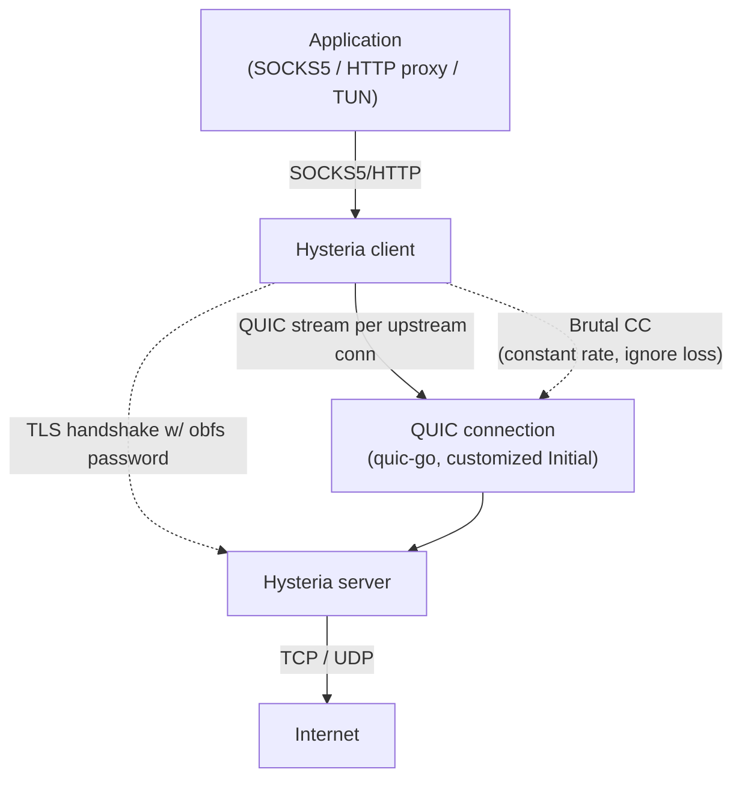

# 課堂 8.2 — Hysteria v1 完整解剖

## 學前知道
- 前置課：[8.1 為什麼 QUIC 系協議](./8.1-quic-as-second-line.md)、[1.13 BBR](../part-1-networking/1.13-bbr-congestion.md)、[4.7 QUIC transport](../part-4-tls-quic/4.7-quic-transport.md)
- 預計閱讀時間：**45 分鐘**
- 必讀原始碼：
  - **HyNetwork/hysteria** v1 branch（已不維護，但 v2 仍 import）：https://github.com/apernet/hysteria/tree/v1
  - **Brutal CC**: `core/internal/congestion/brutal/brutal.go`
  - Lucas-C 那篇 KCP-over-QUIC 早期討論（README v1）
- 必讀參考：
  - **Cardwell et al.**, BBR, CACM 2017 → [precis](../../notes/papers/cardwell-bbr.md)（對照組）
  - **RFC 9438**（CUBIC, replaces RFC 8312）
  - **Floyd & Fall**, "Promoting the Use of End-to-End Congestion Control in the Internet", *IEEE/ACM ToN 1999*——TCP-friendly fairness 的源頭

## 動機

Hysteria 由 [Toby Liu (Tobyxdd)](https://github.com/tobyxdd) 在 2020 啟動，原本叫 **HyKey** / **WindGate**，後改名 Hysteria。v1 的設計賣點極簡單粗暴：

> **「我知道自己 1Gbps 的線速。我為什麼要讓 CC 慢慢探測？直接告訴 transport 我有 1Gbps，每秒就是發 1Gbps，丟包就重傳，不退讓。」**

這就是 Brutal CC。對個人 user 在 lossy 跨太平洋鏈路上，效果驚人；對 ISP 共用網路，倫理可疑。

本堂教你：

1. Hysteria v1 整個 wire format（建立在 quic-go 之上）
2. Brutal CC 的精確演算法、source code 逐行
3. 為什麼這算 cheating？對 TCP-friendly fairness 的破壞
4. 為什麼 v1 在 2022 後逐步被 v2 取代

---

## 核心概念

### 1. v1 架構總覽



關鍵設計取捨：

| 取捨點 | v1 選擇 | 理由 |
|---|---|---|
| Transport | QUIC（quic-go fork） | 避 TCP-over-TCP；用 stream multiplexing |
| TLS | 真 TLS 1.3（自帶 cert 或 ACME） | 流量看起來像 HTTPS（但只到 client hello 為止） |
| Auth | 連線握手後第一個 stream 上傳一個 ClientHello message（內含 username/password） | 不是 PSK 不是證書，**plain auth in encrypted channel** |
| Obfs | XOR 一個 obfs key 在 QUIC packet payload 上 | 防 DPI 認出 QUIC header；代價：跟標準 QUIC 不互通 |
| CC | Brutal（user-declared rate） | 1Gbps 線就跑 1Gbps |
| UDP relay | 第一個 stream 上 frame multiplex 所有 UDP session | 不開新 QUIC stream 給 UDP，省 RTT |

### 2. v1 handshake：「我有多少 Mbps」

v1 與 v2 最大差異在 handshake。v1 用一個**自訂二進制 protocol**走在第一條 QUIC bidirectional stream 上，**不是 HTTP/3**。

格式（依 v1 source `core/internal/protocol/types.go`）：

```
ClientHello:
  ProtocolVersion  uint8     // = 3 (HyV3, 2022)
  SendBPS          uint64    // bytes/sec, client 自報送出能力
  RecvBPS          uint64    // bytes/sec, client 自報接收能力
  Auth             []byte    // 預共享密碼或 token
```

```
ServerHello:
  OK               bool
  Message          string    // 拒絕原因或歡迎詞
  SendBPS          uint64    // server 接受的 send 上限
  RecvBPS          uint64    // server 接受的 recv 上限
```

協商後雙方各自設定 Brutal CC 的 `bps = min(client_recv, server_send)` 與 `bps = min(client_send, server_recv)`，**這就是擁塞控制的全部輸入**。沒有探測、沒有 slow start。

### 3. Brutal congestion control — 演算法逐行

`core/internal/congestion/brutal/brutal.go` 的核心：

```go
// 常數
const (
    pktInfoSlotCount         = 5     // 滾動 5 個 1-second slot
    minSampleCount           = 50    // 少於 50 個 sample 不算
    minAckRate               = 0.8   // ack rate floor
    congestionWindowMultiplier = 2   // BDP × 2 = cwnd
)

// 計算 send window
func (b *BrutalSender) GetCongestionWindow() congestion.ByteCount {
    rtt := b.rttStats.SmoothedRTT()
    if rtt <= 0 { rtt = initialRTT }
    cwnd := congestion.ByteCount(float64(b.bps) * rtt.Seconds() *
                                  congestionWindowMultiplier / b.ackRate)
    return cwnd
}

// 收到 ack / loss event 時更新 ackRate
func (b *BrutalSender) OnCongestionEventEx(...) {
    // 把這秒的 acked + lost 計入當前 slot
    slot := &b.pktInfoSlots[time.Now().Unix() % pktInfoSlotCount]
    slot.ackedBytes += ackedBytes
    slot.lostBytes  += lostBytes

    // 跨 5 秒 sample 算總 ack rate
    var totalAck, totalLost int64
    for i := range b.pktInfoSlots {
        totalAck += b.pktInfoSlots[i].ackedBytes
        totalLost += b.pktInfoSlots[i].lostBytes
    }
    if total := totalAck + totalLost; total > minSampleCount {
        b.ackRate = max(float64(totalAck)/float64(total), minAckRate)
    }
}
```

讀懂這 30 行，你就讀懂 Brutal CC 全部：

1. **Send rate = user 宣告的 `bps`，不管網路說什麼**。
2. cwnd = `bps × RTT × 2 / ackRate`。`bps × RTT` 是 BDP（bandwidth-delay product），×2 是給 burst 餘裕，÷ackRate 是「丟包就多送一點補上」。
3. `ackRate` floor 是 0.8：意思是「再怎麼丟包，最低也只把速度降到原來的 1/0.8 = 1.25× 重發來補」。換句話說 **最多容許 20% loss rate**，超過就**仍以 1.25× bps 衝**。
4. 沒有 slow start、沒有 RTT inflation 退讓、沒有 fairness 機制。

**對比 TCP CUBIC（RFC 9438）**：

| 維度 | CUBIC | Brutal |
|---|---|---|
| 初始 cwnd | `IW = 10 segments` | `bps × RTT × 2 / 0.8` |
| 探測 | concave-convex 函數 | 無，固定速率 |
| Loss 反應 | cwnd × `β_cubic = 0.7` | cwnd 不變，僅補 1/ackRate |
| Fairness with TCP | 設計上 friendly | 完全 unfriendly |
| RTT fairness | 大 RTT 友善（vs Reno）| 不考慮 |

**對比 BBR**：

| 維度 | BBR | Brutal |
|---|---|---|
| Pacing rate 估計 | maxBW × cwnd_gain | user-declared bps |
| 探測 | 8-phase pacing gain cycle | 無 |
| Loss tolerance | 不直接用 loss，看 delivery rate | 容許 20% loss 不退讓 |

### 4. 為什麼這是 cheating（也是為什麼它有效）

**TCP-friendly fairness 的數學**（Floyd & Fall 1999）：

> 任何在 Internet 上發送的 long-lived flow 應遵守 `throughput ≤ MSS / (RTT × √(p × 1.5))`，其中 p 是 loss rate。

意思：如果你跟旁邊的 TCP flow 共用瓶頸鏈路，**你必須在丟包率上升時退讓**，否則你會搶光所有頻寬，旁邊 TCP flow 餓死。

**Brutal 違反這條的程度**：

設 p = 5%（中等 lossy）。TCP-friendly 限速：`MSS=1448, RTT=200ms, p=0.05` → 約 **530 KB/s ≈ 4.2 Mbps**。

Brutal 在 user 宣告 1 Gbps + p = 5% 下，繼續送 `1 Gbps / 0.95 ≈ 1.05 Gbps`。**超出 TCP-friendly 限制 250 倍**。

實務影響：

- 跨大洋鏈路 lossy 時，你 Hysteria 跑滿 1Gbps，旁邊 TCP HTTPS 連線只能跑 4 Mbps
- ISP 視角：一個 user 用 Hysteria + Brutal 等於 100 個正常 user
- **若大家都用 Brutal，網路 collapse**（Floyd 1999 預言）

社群觀察（Brutal README、apernet 討論）：

> Brutal is designed for **individual high-performance use over uncongested last-mile + congested middle-mile**. If everyone runs Brutal, the assumption breaks.

Hysteria 作者承認 Brutal 是 **cheating**，但設計目標是「在 ISP 對 fairness 不在意的場景下，給單一 user 物理鏈路上限」。

### 5. UDP relay 設計（v1）

v1 在第一條 stream 上 multiplex 所有 UDP session。frame 格式（從 v1 protocol/udp.go 推得）：

```
UDP frame:
  SessionID  uint32    // client-assigned, server returns same
  Host       string    // target host (FQDN or IP literal)
  Port       uint16
  MsgLen     uint16
  Msg        []byte    // up to 65535 bytes
```

問題：

- **跨 stream sharing**：一個 stream block 影響所有 UDP session（head-of-line blocking）
- **沒用 QUIC datagram extension**（RFC 9221）：當時 quic-go 還沒實作
- **PMTU 不感知**：UDP 內容可能被 fragment

v2 全面改用 QUIC unreliable datagram 解這些問題（[Part 8.3](./8.3-hysteria-v2.md)）。

### 6. v1 的 obfs：XOR 一層密碼

v1 提供一個 obfs flag。若啟用：

```go
// 每個 QUIC packet 出 wire 前 XOR 一層
for i := range packet {
    packet[i] ^= obfsKey[i % len(obfsKey)]
}
```

效果：

- 標準 QUIC stack 看不懂這個 packet（因為連 fixed bit 都被 XOR 掉）→ DPI 不能用「這是 QUIC」直接判
- **代價**：跟所有合法 QUIC client 不互通，且 random-looking traffic 反而成為 fingerprint（fully-encrypted detection 中招 — 見 [Part 9.7](../part-9-gfw-research/9.7-fully-encrypted-detection.md)、Wu USENIX Sec 2023）

這就是 v1 後期被識別的原因。v2 改用 Salamander 但**只 XOR 一層 BLAKE2b 衍生 key**，仍有同樣 fingerprint 風險——下堂詳論。

### 7. 部署時的真實毛病

v1 社群常見問題：

| 問題 | 原因 |
|---|---|
| `bps` 設太高，反而比設真實值慢 | bps × RTT 過大，超過 server kernel UDP buffer，內部 drop |
| 跨大洲 RTT 飆，cwnd 爆增到 100MB | kernel `wmem_max` / `rmem_max` 沒調 → buffer overflow |
| QUIC port 被 ISP rate limit | UDP/443 在中國電信被 shape，v1 沒 port hopping |
| GFW 對「random-looking UDP」整體限速 | obfs 太徹底反而觸發 fully-encrypted detection |

v2 對前三條都有解（port hopping 內建、bandwidth detection、kernel buffer auto-tune），但**fully-encrypted detection 的根本問題沒解**。

---

## 與我們協議設計的關聯

| Hysteria v1 教訓 | 給我們的 design constraint |
|---|---|
| Brutal 證明「user-declared rate」對單 user 速度有效 | 我們協議**也應允許 user 設 hint bandwidth**，但須包裝在「polite by default + brutal by opt-in」 |
| v1 plain-XOR obfs 反而暴露 | **不能整段 XOR random key**，必須讓 wire image 形似某個真實協議 |
| v1 UDP relay 走 QUIC stream → HOLB | 我們協議 UDP relay 必須用 QUIC datagram (RFC 9221) |
| v1 沒 port hopping → 被 ISP shape | 我們協議**設計時就要 port hopping**，不是事後加 |
| v1 plain auth in encrypted channel | 我們可以採類似 design，把 auth 放在 QUIC handshake 完成後的第一個 stream |
| Brutal 容許 20% loss 不退讓 | **公平性問題要正式處理**，要嘛 documented opt-in，要嘛 dynamic detect 退讓 |

---

## 動手（可選）

### 實驗 1：自己跑 v1 vs v2 對比

```bash
# v1 (legacy)
docker run -p 1234:1234/udp tobyxdd/hysteria-legacy:latest \
    server --config /etc/hysteria/config.json

# v2
docker run -p 1234:1234/udp tobyxdd/hysteria:latest \
    server --config /etc/hysteria/config.yaml

# 用 iperf3 over hysteria 比較跨大洋 throughput
```

### 實驗 2：讀 brutal.go 並改參數

把 `congestionWindowMultiplier` 從 2 改成 4、把 `minAckRate` 從 0.8 改成 0.5。觀察：

- multiplier ↑ → cwnd ↑ → 更敢 burst → 更搶頻寬 → 更傷 fairness
- ackRate floor ↓ → 高 loss 下不再 cap → 重傳量爆炸

實驗環境：兩個 docker container 中間掛 `tc netem loss 5%`。

### 實驗 3：抓 v1 obfs 的 wire image

用 wireshark / tcpdump 抓 obfs-enabled 的 v1 流量。觀察：

- 沒有 QUIC long header 的 `0xc0..0xff` pattern
- 沒有 RFC 8999 fixed bit
- 看起來「太 random」——這正是 fully-encrypted detection 的目標

對比 v2 + salamander obfs，看是否有所改善。（劇透：本質上一樣 random）

---

## 自我檢查

1. Brutal 的 cwnd 公式 `bps × RTT × 2 / ackRate`，為什麼有 `×2`？拿掉 ×2 會怎樣？
2. 若 RTT 從 50ms 飆到 500ms（中國跨大洋早晚峰差），Brutal 的 cwnd 會放大 10 倍。kernel UDP socket buffer 沒跟上會發生什麼事？
3. Floyd & Fall 1999 那條 TCP-friendly 公式，能不能用來估算「Brutal user 佔旁邊 TCP user 的頻寬比」？做一個例子計算。
4. v1 的 XOR obfs 把整個 QUIC packet（含 header）都 XOR，這跟 v2 的 Salamander obfs 在 detection 角度上是否真有差異？參考 Wu USENIX Sec 2023 的 popcount / Mb1 entropy 規則。
5. 若我們協議要**內建一個 polite 預設 + brutal opt-in**，設計上怎麼做兩種模式平滑切換？

---

## 延伸閱讀

- **apernet/hysteria** v1 source: `core/internal/protocol/`、`core/internal/congestion/brutal/`
- **Floyd & Fall**, "Promoting the Use of End-to-End Congestion Control in the Internet", *IEEE/ACM ToN* 7(4), 1999
- **RFC 5681**（TCP Congestion Control, base）
- **RFC 9438**（CUBIC）
- **Hock et al.**, "Experimental Evaluation of BBR Congestion Control", *ICNP 2017* — BBR 在大 loss 下的表現
- **net4people/bbs** issue tracker — Hysteria 被識別的社群報告

---

## 研究級補遺

### 1. 學界詞彙

| 我們口語 | 學界 | 縮寫 |
|---|---|---|
| 用戶宣告速度 | rate-declared / open-loop congestion control | — |
| 不退讓 | loss-agnostic CC / non-responsive flow | — |
| 「TCP 友善」 | TCP-friendly fairness / TFRC | RFC 5348 |
| 「公平占用瓶頸頻寬」 | max-min fairness | — |
| 蓋過旁邊 TCP flow | bandwidth starvation / unfriendliness | — |
| XOR 一層密碼 | symmetric stream cipher obfuscation | — |
| QUIC datagram | unreliable datagram extension | RFC 9221 |

### 2. 對手分類學 / 威脅模型精化

對 Hysteria v1 的對手能力分層：

- **被動 DPI**：能 fingerprint「QUIC-like UDP with random payload」→ v1 obfs 中招
- **主動 probing**：對 UDP/443 發 Client Hello → v1 沒回應（無 stateless reset），但**連續 ping 不回應本身**也是 fingerprint
- **rate limit / shape**：ISP / GFW 對「持續高速 UDP」做 token bucket → Brutal CC 撞牆
- **MITM with sub-TLS**：不可能（QUIC + TLS 1.3 cert pinning）

對應 Dolev-Yao 擴展：attacker 能 fingerprint「packet size distribution」+「inter-arrival entropy」這兩個維度。Brutal 的 constant-rate 形狀本身就是 fingerprint——一秒一秒看，每秒 byte 數固定 = 「我在用 Brutal」。

### 3. 領域的關鍵論文 / 規格 / 原始碼

| Source | Type | 為什麼追 | 之後深讀 |
|---|---|---|---|
| Floyd & Fall 1999 | paper | TCP-friendly fairness 源 | 本堂引用 |
| RFC 5348 (TFRC) | spec | rate-based TCP-equivalent CC | 跟 Brutal 對照組 |
| RFC 9438 (CUBIC) | spec | 主流 TCP CC | 對照組 |
| Cardwell BBR 2017 | paper | model-based CC | 對照組 |
| Hock et al. ICNP 2017 | paper | BBR 高 loss 下表現實測 | 部分啟發 Brutal 的設計 |
| apernet/hysteria | code | v1 + Brutal 實作 | 本堂全節 |
| Wu USENIX Sec 2023 | paper | fully-encrypted detection | Part 9.7 全節精讀 |

### 5. 我們協議的座標 / 設計取捨

```
Proteus 空間 — Brutal 給我們的選項：
- Congestion control:
  * polite default (BBRv3 or CUBIC)
  * brutal opt-in (user 已知自己頻寬, signed declaration)
  * hybrid (start polite, escalate if no congestion detected)
- Wire image:
  * 不可整段 XOR (Brutal v1 教訓)
  * 必須形似 真實協議 (Part 8.3 / 8.8 詳論)
- UDP relay:
  * 必須 QUIC datagram extension, 不走 stream
- Port hopping:
  * 內建設計, 不是事後 patch
```

Part 11.4 主架構決策會回頭引用「Brutal opt-in」這條取捨。

### 6. 必追資源 / 社群入口

- **apernet/hysteria GitHub Issues** — 性能、被識別、配置問題的真實案例
- **net4people/bbs** — 中文社群對 Hysteria 被識別的回報
- **HyNetwork Telegram channel** — 開發者公告
- **Hysteria documentation site v2.hysteria.network**

### 7. 開放問題（research-level）

- **OP-1**: Brutal 在「全 user 都用 Brutal」的情境下會不會自然收斂？這跟 game-theoretic congestion control（如 Sprout、PCC）有關，但目前無人形式化分析。
- **OP-2**: 能否設計一個 CC 既滿足 user-perceived「跑滿線速」又**對其他 TCP flow 不偏不倚**？答案疑似為「不能」（rate fairness 數學上互斥於 max throughput on lossy link），但無正式 impossibility proof。
- **OP-3**: Brutal 的 constant-rate 形狀是不是 trivially fingerprint-able？理論上 yes，實務上 GFW 為什麼沒有專門擋 Brutal？這是個 measurement 問題。
