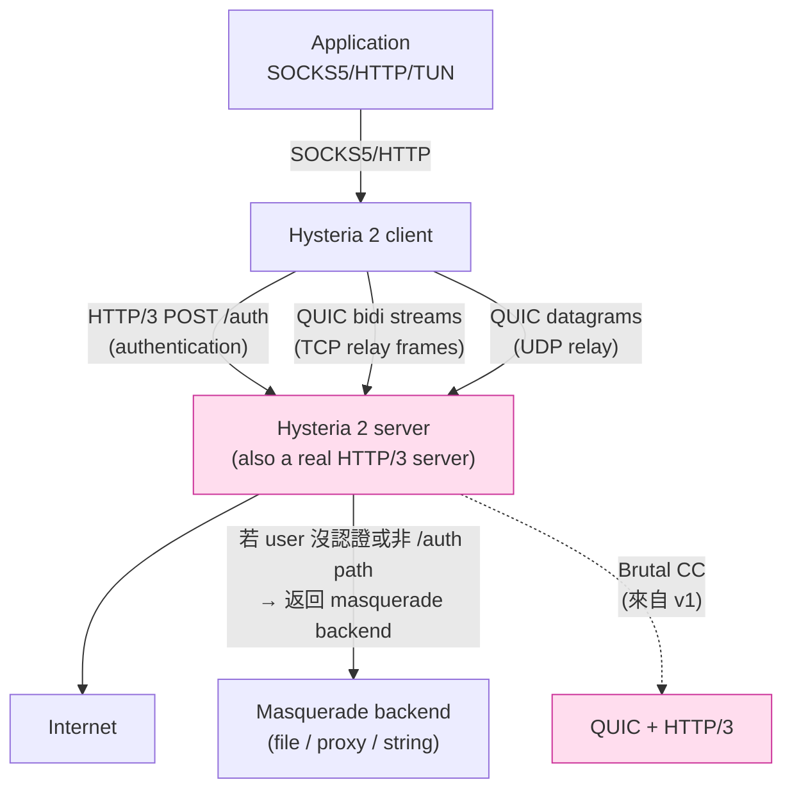

# 課堂 8.3 — Hysteria 2 完整解剖

## 學前知道
- 前置課：[8.2 Hysteria v1](./8.2-hysteria-v1.md)、[4.10 HTTP/3 與 MASQUE](../part-4-tls-quic/4.10-http3-and-masque.md)
- 預計閱讀時間：**50 分鐘**
- 必讀原始碼（**全部 v2 主線**）：
  - **apernet/hysteria** (master branch): https://github.com/apernet/hysteria
  - 重點檔案：
    - `core/internal/protocol/proxy.go` — TCP/UDP frame
    - `core/internal/protocol/auth.go` — Hysteria HTTP/3 auth
    - `core/server/server.go` — Auth handler
    - `core/internal/congestion/brutal/brutal.go` — Brutal CC（v1 沿用）
    - `core/internal/sniff/` — UDP DNS forwarding
    - `extras/obfs/salamander.go` — Salamander obfs
- 必讀規格：
  - **RFC 9114**（HTTP/3）、**RFC 9000**（QUIC）、**RFC 9221**（QUIC datagram）
  - **RFC 7693**（BLAKE2）— Salamander obfs 用

## 動機

v1 三個結構性問題：

1. **不是 HTTP/3**：用自訂 binary handshake → 任何主動 probing 都立刻看出「這不是 web server」
2. **UDP relay 走 QUIC stream**：head-of-line blocking
3. **整段 XOR obfs**：被 fully-encrypted detection 識別

v2 全部回應：

1. **完整 HTTP/3 server**：未認證的 user 看到的就是一個真正的 web server（masquerade 模式）；認證流量走 special HTTP/3 endpoint
2. **UDP relay 走 QUIC datagram (RFC 9221)**：無 HOLB
3. **Salamander obfs**（仍是 XOR，但 key 是 packet-specific BLAKE2b hash）

但 v2 沒解 Brutal CC 的 fairness 問題（仍是 cheating），也沒解 fully-encrypted 流量形狀問題（只是 fingerprint 變了）。

讀完應該回答：

- v2 的 HTTP/3 authentication 為什麼比 v1 的 binary auth 更難識別？
- v2 的 masquerade 模式為什麼比 VLESS+REALITY 的「借真站」差一些？什麼意義上又勝過？
- Salamander 對抗 Wu 2023 fully-encrypted detection 是否有效？
- port hopping 在 iptables 層怎麼實作的？對 GFW QoS 真的有用嗎？

---

## 核心概念

### 1. v2 架構



### 2. v2 handshake：包裝成 HTTP/3 POST

v2 把 auth 變成**真實的 HTTP/3 POST 請求**，內容如下（協議文件 v2 docs developers Protocol）：

```http
POST /auth HTTP/3
Host: example.com
Hysteria-Auth: <user password or token>
Hysteria-CC-RX: <client receive rate in bytes/sec, 0 = unknown>
Hysteria-Padding: <random padding string>
```

Server 若認證成功：

```http
HTTP/3 233 Hysteria
Hysteria-UDP: <true|false>
Hysteria-CC-RX: <server rx rate, 0 = unlimited, "auto" = use CC algorithm>
Hysteria-Padding: <random padding>
```

`233` 是 **非標準的 status code**（HTTP/3 spec 沒禁止 custom 2xx）；選 233 是因為 GFW 那邊的 nginx pattern detector 不會誤判。

**關鍵設計**（從 spec 抽出，verbatim）：

> "To a third party without proper authentication credentials, a Hysteria proxy server behaves just like a standard HTTP/3 web server."

實際上：未認證流量 → 走 masquerade backend → 看起來是真的 nginx / Caddy 站。**這是 v2 對主動 probing 的核心防禦**。

對比 v1：
- v1 沒 HTTP/3 路徑 → probe 用 curl HTTP/3 取 `/` 拿到的是 connection close
- v2 → 拿到 masquerade backend 的真實內容

### 3. masquerade 三模式

`core/server/masquerade.go` 對應 config：

| 模式 | 行為 | 對 probe 的偽裝 |
|---|---|---|
| `file` | Serve 靜態檔案 from local dir | 像一個 nginx 靜態站 |
| `proxy` | Reverse proxy to another HTTPS URL | **像真站本人**（最強），但 server admin 要選對 upstream |
| `string` | 返回 fixed string | 最弱，可能成 fingerprint |

**proxy 模式的潛在問題**：reverse proxy 改 Host header 後，**真站可能拒絕**（HSTS / cert pinning / referrer check）。實務常見配 cloudflare 之類大站當 upstream。

**vs VLESS+REALITY**（Part 7）：

| 維度 | Hysteria 2 masquerade | VLESS+REALITY |
|---|---|---|
| 真站證書 | 用自己的 cert（自簽或 ACME） | **借真站的 cert**（中間人方式） |
| 用戶看到 | 自己的域名 | 真站的域名 |
| 被認證 user 視角 | HTTP/3 client | TLS 1.3 client |
| GFW 視角 | HTTP/3 站，response body 是 cloudflare 內容（若 proxy）| **與真站完全不可區分到 Server Hello** |

→ REALITY 在「**不可區分性**」上更強；Hysteria 2 在「**速度**」上更強。Part 11 設計目標：兩者合一。

### 4. TCP relay frame（per stream）

`core/internal/protocol/proxy.go`：

```
TCP Request (over QUIC bidi stream):
  RequestID         varint    // 0x401 magic (HyV2 TCP request)
  Address Length    varint
  Address           bytes     // "example.com:443" UTF-8
  Padding Length    varint
  Padding           bytes     // 隨機, 64-256 byte 常見

TCP Response (over same stream):
  Status            uint8     // 0=OK, 1=Error
  Message Length    varint
  Message           bytes     // error msg 或 空
  Padding Length    varint
  Padding           bytes
```

**安全限制**（hard-coded in source）：

```go
const (
    MaxAddressLength = 2048
    MaxMessageLength = 2048
    MaxPaddingLength = 4096
)
```

理由：防 DoS。一個 stream 不能 stuff 任意大的 padding，避免 server allocate gigabyte buffer。

**用 QUIC varint 編 length**：跟 RFC 9000 §16 一致，1-byte 編 ≤63，2-byte 編 ≤16383，4-byte 編 ≤2^30，8-byte 編 ≤2^62。

### 5. UDP relay frame（per QUIC datagram）

QUIC datagram extension (RFC 9221) 給每個 UDP packet 一個獨立 datagram，無 stream HOLB。

```
UDP Frame (in QUIC datagram, max 1200 bytes):
  Session ID        uint32     // client-assigned
  Packet ID         uint16     // per-session unique
  Fragment ID       uint8      // 0-indexed
  Fragment Count    uint8      // total fragments
  Address Length    varint
  Address           bytes
  Payload           bytes      // up to ~1100 bytes
```

**為什麼 frame 仍 ≤ 1200 byte**：QUIC datagram 不重組（RFC 9221 §5），單一 datagram 要塞進一個 UDP packet 內，受 PMTU 限制。常見 IPv4 PMTU 1500 - IP 20 - UDP 8 - QUIC header ≈ 1200 byte 可用 payload。

**fragmentation**：若 UDP relay 內層 payload >1100 byte（例如 DNS-over-UDP 大 response、QUIC-over-UDP-over-Hysteria 的雙層 QUIC），用 fragment ID 拆。receiver 等所有 fragment 到達再 reassemble。

**vs v1**：v1 走 QUIC stream，一個 UDP packet 丟了 stream 卡所有 session；v2 走 datagram，丟了就丟，UDP 本來就 unreliable，**正確的設計**。

### 6. Salamander obfs

**目的**：讓 wire 上看不出 QUIC long header / fixed bit 等 fingerprint。

**演算法**（`extras/obfs/salamander.go`）：

```python
# pseudo-code
def salamander_obfs(payload: bytes, key: bytes) -> bytes:
    salt = random(8)
    h = blake2b_256(key + salt)  # 32-byte hash
    obfs_payload = [payload[i] ^ h[i % 32] for i in range(len(payload))]
    return salt + obfs_payload  # wire = 8 byte salt + obfs payload

def salamander_deobfs(wire: bytes, key: bytes) -> bytes:
    salt, obfs_payload = wire[:8], wire[8:]
    h = blake2b_256(key + salt)
    return bytes(obfs_payload[i] ^ h[i % 32] for i in range(len(obfs_payload)))
```

**為什麼 v2 不直接用 v1 那種 fixed-key XOR**：v1 fixed key → 所有 packet 用同一個 keystream → 兩個 packet XOR 一起暴露 plaintext（已知 plaintext attack on QUIC long header）。v2 加 per-packet salt → BLAKE2b 衍生 unique keystream，這個漏洞補了。

**對 Wu 2023 fully-encrypted detection 是否有效**：

Wu 2023 的核心檢測（USENIX Security 2023 §4，待 [Part 9.7](../part-9-gfw-research/9.7-fully-encrypted-detection.md) 精讀）：
- **Ex1**: 前 6 byte popcount（1 bit 數量）落在某 range
- **Ex2**: payload 前 N byte 印表 ASCII 比例
- **Ex3**: 首 N byte 是否符合常見 protocol header（TLS, SSH, HTTP）

Salamander obfs 後的 wire：
- 前 8 byte：random salt（high entropy）
- 之後：obfs_payload = QUIC packet XOR BLAKE2b keystream（high entropy）

→ **整段都是 high-entropy random**。**確實會中 Ex1 / Ex2**，因為 plaintext HTTPS / web 流量前 6 byte 不會均勻 entropy（會有 TLS record header `17 03 03 XX XX` pattern 等）。

**結論**：Salamander 對 v1 的 fixed-key XOR 是改進，但**仍是 fully-encrypted fingerprint**，理論上 GFW 想擋的話可以擋。實務上 2025 觀察是 GFW **沒專門擋 Hysteria**，可能因為流量量還不夠大 / 沒納入 blocklist 更新。

**未認證模式下不應啟用 obfs**：obfs 會把 QUIC fixed bit 一起 XOR 掉 → masquerade 失效（不像 HTTP/3）。所以 v2 的 obfs 跟 masquerade **不能同時開**。設計上是 either-or trade-off。

### 7. Port hopping：iptables DNAT 一招

`app/cmd/server.go` 在 server start 時根據 config 做：

```bash
# 若 config 寫 "listen: :443 portRange: 20000-50000"
# server 開 :443 為唯一 listener
# 然後執行:

iptables -t nat -A PREROUTING -p udp \
    --dport 20000:50000 -j DNAT --to-destination :443

# 或 nftables 等價語法
```

Client 端定期切到 random port in `20000-50000`，server 端 kernel DNAT 全部 redirect 到 :443。

**對 GFW QoS 的有效性**：

| GFW 策略 | port hopping 有效？ |
|---|---|
| 對 UDP/443 整體 rate limit | **部分有效**：client 跳到非 443 → bypass |
| 對 5-tuple stateful rate limit | **有效**：每次 hop 都是新 5-tuple |
| 對來源 IP 整體 rate limit | **無效**：所有 hop 共用同一個 source IP |
| SNI-based filtering（2024-04+）| **無效**：SNI 在 Initial packet，跟 port 無關 |

→ port hopping 對「同 5-tuple 的 rate limit」最有效，對「destination IP-based」無效。實務上中國電信 ISP 的 UDP shaping 多半是 5-tuple based，所以 port hopping 在 home broadband 上效益明顯；對 GFW 主幹 censorship 幫助小。

### 8. Bandwidth detection（v2 新增）

v2 spec 規定：若 client `Hysteria-CC-RX: 0`（不知道自己頻寬），server 對該 connection 改用 `auto` 模式——即用 BBR / CUBIC（非 Brutal）。

`Hysteria-CC-RX: auto` 在 v2 表示 **「我也不固定速率，用 standard CC」**。這給了**「polite 預設」**選項，user 不主動宣告就走標準 CC，比 v1 的 Brutal-only 友善得多。

實作上（`core/internal/congestion/`）：

- 有 brutal/、bbr/、cubic/ 三個目錄
- server 收到 `Hysteria-CC-RX` 後 dispatch 到對應 CC

但 default config 仍鼓勵 user 設真實 bps → Brutal 還是主流。

---

## 與我們協議設計的關聯

| Hysteria 2 設計 | 給我們的啟示 |
|---|---|
| HTTP/3 + masquerade 雙模式 | 我們協議**必須有「未認證 = 真站」分支**，否則 probe 立刻識別 |
| 233 status code 是 fingerprint | 用 standard 2xx (200) 更好；要嘛在 header 上做差異 |
| Salamander obfs 跟 masquerade 互斥 | 我們不採整段 XOR；改為**在 frame layer 加 randomness** |
| QUIC datagram 給 UDP relay | 我們協議 UDP relay **必須走 datagram**，這是定論 |
| Port hopping 用 iptables DNAT | 我們可採類似方法，但要文件化「對 ISP 有效，對 GFW 無效」 |
| Brutal as opt-in | 我們協議的 CC 預設 polite (BBRv3)，brutal mode 需 explicit flag |
| 1200 byte datagram limit | 我們協議同樣受 PMTU 限制；要 path MTU discovery |

---

## 動手（可選）

### 實驗 1：對著 Hysteria 2 server 做主動 probe

```bash
# 假設 server 域名 hy2.example.com，listen :443，masquerade proxy https://www.cloudflare.com
# 直接拿 curl 探：

curl --http3 https://hy2.example.com/
# 期望：返回 cloudflare.com 的 HTML（masquerade 生效）

curl --http3 -X POST https://hy2.example.com/auth \
    -H "Hysteria-Auth: WRONG_PASSWORD" -H "Hysteria-CC-RX: 0" -H "Hysteria-Padding: xx"
# 期望：401 或 masquerade 內容（不返回 233）

# 真實 client 用對的密碼 → 233
```

對比：對 VLESS+REALITY server 同樣 probe，結果是「跟真站一模一樣」連 TLS handshake 都用真站 cert。差距在這。

### 實驗 2：抓 v2 wire（無 obfs vs 有 obfs）

```bash
sudo tcpdump -i any -w hy2-noobfs.pcap udp port 443
# 用 wireshark 開 → 看得到 QUIC long header

sudo tcpdump -i any -w hy2-salamander.pcap udp port 443
# 開 → wireshark 認不出 QUIC，packet 全 high-entropy
```

把這兩個 pcap 餵給 nDPI（[Part 9.11](../part-9-gfw-research/9.11-platform-passive-dpi.md) 會教），看分類結果。

### 實驗 3：自己改 Salamander 的 keystream

把 `blake2b_256(key + salt)` 改成 `chacha20(key, salt, counter=0)`，看 entropy distribution 是否改變。理論上 ChaCha20 跟 BLAKE2b 同樣 high-entropy，但 keystream 長度不同（ChaCha20 block 64 byte）。觀察對 fully-encrypted detection 是否仍中招。（劇透：仍中。high-entropy 本身就是 detection target，不論 stream cipher 用什麼）。

---

## 自我檢查

1. v2 為什麼選 status code `233` 而不是 `200`？這個選擇本身是不是 fingerprint？
2. masquerade=proxy 模式下，server admin 該選什麼 upstream？選 `https://www.cloudflare.com` vs 選自己控制的 https 站，trade-off 在哪？
3. Salamander obfs 跟 masquerade 為什麼必須二擇一？能不能設計一個 obfs 同時保留 HTTP/3 wire image？
4. QUIC datagram 的 1200 byte 上限源自什麼？若內層 DNS-over-UDP response 1500 byte，v2 怎麼處理？
5. Port hopping 對 GFW SNI-based 過濾（Zohaib 2025）為什麼無效？
6. Brutal CC 設 `Hysteria-CC-RX: 1gbps` vs `auto`，server 行為差異是什麼？對 user 速度感受、對網路 fairness 各有多大差異？

---

## 延伸閱讀

- **apernet/hysteria** master branch 完整原始碼
- **Hysteria 2 protocol spec**: https://v2.hysteria.network/docs/developers/Protocol/
- **RFC 9221**（QUIC Unreliable Datagram Extension）— 必看 §3 frame format
- **RFC 9114**（HTTP/3）§7 frames、§8 streams — 理解 Hysteria 怎麼包進 HTTP/3
- **Wu et al. USENIX Sec 2023** Fully-Encrypted Detection — 解釋為什麼 Salamander 仍可識別 → [precis](../../notes/papers/wu-fully-encrypted-2023.md)（Part 9.7 詳讀）
- **net4people/bbs** Hysteria 相關 issue

---

## 研究級補遺

### 1. 學界詞彙

| 我們口語 | 學界 | 縮寫 |
|---|---|---|
| masquerade backend | decoy server / honeypot reverse proxy | — |
| fully-encrypted fingerprint | entropy-based traffic classification | — |
| port hopping | port randomization / stateless port jumping | — |
| QUIC datagram | unreliable datagram extension | RFC 9221 |
| BLAKE2b XOR | stream cipher obfuscation | — |
| 233 status code | custom HTTP success code | — |

### 2. 對手分類學 / 威脅模型精化

對 Hysteria 2 的對手：

- **被動 entropy 量測**：對 UDP/443 流量做 popcount / Mb1 entropy → **Salamander obfs 模式中招**；HTTP/3 模式不中（因 packet 有 QUIC long header 結構）
- **被動 status code 比對**：對 HTTP/3 response 收集 status code 分布，233 → **罕見 → fingerprint**
- **主動 probe**：未認證 user 送 `GET /` → masquerade 模式回真內容；其他 path → 取決 backend
- **SNI-based censorship**: 同所有 QUIC，client SNI 在 Initial packet → GFW 可解 → 仍中招
- **Brutal CC fingerprint**：對流量做 rate-time-series 分析 → 看到 constant rate 不下降 → 高機率是 Brutal user

### 3. 領域的關鍵論文 / 規格 / 原始碼

| Source | 為什麼 | 之後深讀 |
|---|---|---|
| Hysteria 2 protocol spec | 本堂主源 | 本堂全節 |
| apernet/hysteria source | 實作真相 | 本堂引用 |
| RFC 9221 | QUIC datagram 基礎 | [4.9](../part-4-tls-quic/4.9-quic-advanced.md) |
| Wu USENIX Sec 2023 | Fully-encrypted detection | Part 9.7 |
| Zohaib USENIX Sec 2025 | QUIC SNI 過濾 | Part 8.6 |
| Frolov & Wustrow IMC 2019 | "The use of TLS in censored countries" | Part 9.9 |

### 5. 我們協議的座標 / 設計取捨

```
G6 空間 — Hysteria 2 啟示收窄：
- 流量偽裝路徑:
  * (A) HTTP/3 masquerade (Hysteria 2 風)
       - 優點: 真實 HTTP/3 wire image
       - 缺點: 233 status code 是 fingerprint; masquerade backend 永遠可被探出
  * (B) borrow real site cert (VLESS+REALITY 風)
       - 優點: 跟真站不可區分
       - 缺點: 限 TCP/TLS，沒 QUIC 速度
  * (C) 混合: QUIC 上層仍用 borrow-cert 機制 ← 我們的方向
- UDP relay:
  * 必須 QUIC datagram (RFC 9221), 不走 stream
- Obfs:
  * 不採整段 XOR (Hysteria 2 失敗的點)
  * 改為 frame-level pad + status code mimicry
- CC:
  * polite default, brutal opt-in with documented warning
- Port hopping:
  * 內建, 但文件化「只對 ISP shape 有效, 對 GFW censor 無效」
```

Part 11.3 設計空間探索會回頭引用「(C) 混合路線」。

### 6. 必追資源 / 社群入口

- **apernet/hysteria Issues + Discussions** — 真實部署回饋
- **net4people/bbs** — censorship 觀察
- **Hysteria.network docs** — 官方 spec / config 參考
- **r/dumbclub** / **r/dumbclub_zh** — 中文社群討論

### 7. 開放問題（research-level）

- **OP-1**: 能否設計一個 obfs 既高 entropy（防 ML 分類）又**結構上像真 protocol**（防 entropy fingerprint）？這是個 indistinguishability vs entropy 的 tension。
- **OP-2**: Brutal CC 是否能 self-detect「網路太擁塞」並退讓？目前 ackRate floor 0.8 不夠 dynamic。可能借鏡 PCC-Vivace 等 ML-based CC。
- **OP-3**: HTTP/3 masquerade 的可信度極限：若 masquerade backend 是 cloudflare，cloudflare 觀察到大量「來自一個固定 IP 的反向流量」會不會封？沒有公開 measurement。
