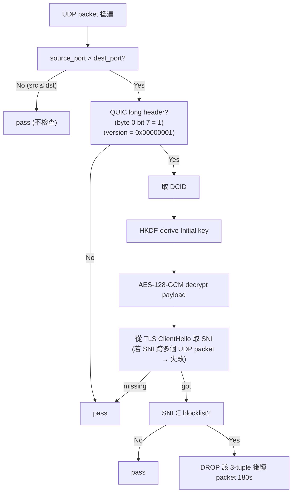

# 課堂 8.6 — QUIC 在中國的命運

## 學前知道
- 前置課：[8.1 為什麼 QUIC 系協議](./8.1-quic-as-second-line.md)、[4.7 QUIC transport](../part-4-tls-quic/4.7-quic-transport.md)、[4.8 QUIC handshake](../part-4-tls-quic/4.8-quic-handshake.md)
- 預計閱讀時間：**60 分鐘**
- 必讀論文：
  - **Zohaib et al.**, "Exposing and Circumventing SNI-based QUIC Censorship of the Great Firewall of China", *USENIX Security 2025* → [precis](../../notes/papers/zohaib-quic-sni-2025.md) （本堂主源）
  - **Elmenhorst, Schütz, Aschenbruck, Basso**, "Web censorship measurements of HTTP/3 over QUIC", *IMC 2021* → [precis](../../notes/papers/elmenhorst-http3-imc2021.md)
  - **Pouyan Fotouhi Tehrani et al.**, "QUICstep: Connection migration-based QUIC censorship circumvention", *PETS 2026(1)* → [precis](../../notes/papers/quicstep-pets2026.md)
- 必讀規格：
  - **RFC 9001** §5.2 "Initial Secrets"（GFW 解 Initial 的數學基礎）
  - **RFC 9000** §17.2.2 (Initial packet format)、§14.1 (Initial Path MTU)

## 動機

「QUIC 在中國能用嗎？」——這問題的答案在 2021–2025 之間轉了三圈：

| 年份 | 答案 | 機制 |
|---|---|---|
| 2021 之前 | 大部分能用 | GFW 沒專門擋 QUIC，只有對 google.com 等的 UDP 整體 drop |
| 2022 | 對 google.com 等持續 drop | UDP 整體封某些 destination IP |
| 2024-04-07 起 | **SNI-based 過濾** | GFW 解 Initial → 看 SNI → 對特定 SNI 阻擋 180s |
| 2024-09-13 起 | Chrome 加 Kyber768 → Initial > MTU → GFW 因不重組漏抓 | jumbo Initial bypass |
| 2025-03 起 | 部分 mitigation 在 GFW 端 | Zohaib 揭露後 |

讀完應該回答：

- GFW 解 Initial 的精確機制（為什麼能解？解的計算量？）
- 為什麼 GFW 只看 source_port > destination_port 的 packet？這 heuristic 的 trade-off？
- 為什麼 jumbo Initial 能 bypass？
- SNI slicing 為什麼有效？這跟 IETF QUIC spec 是否相容？
- 「Availability Attack」是怎麼一回事？對 root DNS 是真實威脅嗎？

---

## 核心概念

### 1. QUIC Initial 加密：公開算法

QUIC Initial packet 的「加密」是**所有人都能算的**，因為 key 從 Destination Connection ID (DCID) 推導。RFC 9001 §5.2:

```
initial_salt = 0x38762cf7f55934b34d179ae6a4c80cadccbb7f0a  (QUICv1 hard-coded)

initial_secret = HKDF-Extract(salt = initial_salt, IKM = DCID)

client_initial_secret = HKDF-Expand-Label(initial_secret, "client in", "", 32)
server_initial_secret = HKDF-Expand-Label(initial_secret, "server in", "", 32)

key = HKDF-Expand-Label(client_initial_secret, "quic key", "", 16)  # AES-128-GCM key
iv  = HKDF-Expand-Label(client_initial_secret, "quic iv", "", 12)
hp  = HKDF-Expand-Label(client_initial_secret, "quic hp", "", 16)   # header protection key
```

任何**被動觀察者**只要：

1. 抓到 client Initial packet
2. 從 Long Header 取出 DCID
3. 跑上面的 HKDF
4. AES-GCM 解 Initial payload → 看到 TLS ClientHello → 看到 SNI extension

**整個過程不需要 master secret，因為 Initial 階段沒 ECDHE，純粹是 obfuscation against passive accidental DPI**——TLS handshake 真正的安全到 1-RTT keys 才開始。

**這就是 GFW 解 Initial 的數學基礎**。

### 2. GFW 的解 Initial 流程（Zohaib 2025 重建）

Zohaib et al. 從 2024-04 到 2025-01 對 GFW QUIC 過濾做大規模量測，**逆向推得**這個流程：



#### 2.1 為什麼只看 `source_port > destination_port`

GFW 的優化：99% 真實 QUIC client 用 ephemeral source port (32768–60999, Linux 預設) 連 well-known destination port (443)。所以 source > destination 涵蓋 ~92% 真實 client → server 流量。

代價：完全漏掉 7.6% 的真實流量（client 用低 source port、用 Windows ephemeral range 不一樣等）。**這是 GFW 主動接受的 trade-off：少抓但省 50% 計算量。**

對我們的啟示：**把 client 的 source port 鎖在低範圍**就能 bypass。但實作上 OS kernel 自動分配 ephemeral port，要 hack。

#### 2.2 三個獨立 blocklist

Zohaib 發現 GFW 對不同類別 SNI 用不同 blocklist：

| Blocklist 類別 | 樣本 | 行為 |
|---|---|---|
| **A. 完全屏蔽**（如 google.com, youtube.com）| 主流被擋網站 | 同時擋 TCP/443 + QUIC |
| **B. 僅 QUIC 擋**（如某些社群網站）| 部分新加入 | TCP/443 通，QUIC 不通 |
| **C. 短期試擋**（rolling list, ~weekly update）| ~43K FQDN/week | 一週後 rotate |

**累積觀察**：3 個月內 GFW 對 58,207 unique FQDN 試過 QUIC 阻擋，其中 38,451 真的支援 HTTP/3。**意味 GFW 在「試 vs 真」之間 ratio 約 1.5:1**——不是只擋已知 HTTP/3 站，而是廣撒網。

#### 2.3 180 秒 residual block

一旦 GFW 解出禁 SNI，對該 (src_IP, dst_IP, dst_port) 三元組的**所有後續 UDP packet** drop 180 秒。

**注意**：不是看 source port——所以 client 換 source port 沒用。
**注意**：包含「同 5-tuple 但不同 SNI 的後續 connection」——所以同個 client 連同個 server 別的 SNI 也 180s 內被 drop。

→ 攻擊面：spoof packet 帶禁 SNI，target = 任意 (受害 client, 受害 server, port) → drop 180s。**這就是 Availability Attack**。

### 3. Jumbo Initial bypass（2024-09 起的偶然 mitigation）

Chrome 在 2024-09-13 commit a64a6c3 加 Kyber768 post-quantum key share。後果：

- TLS ClientHello 從 ~500 byte 暴增到 ~1500 byte（Kyber768 public key 1184 byte）
- QUIC Initial packet payload 加上 ClientHello = > UDP MTU (1500 - IP/UDP header 28 = 1472)
- Chrome 啟用 QUIC Initial 分散到**多個 UDP packet** (RFC 9000 §17.2.2 allowed)

**GFW 沒實作 UDP 重組**，所以：

- Initial packet #1: QUIC header + ClientHello 前半（沒 SNI extension）
- Initial packet #2: ClientHello 後半（含 SNI）

GFW 對 #1 解、找 SNI、**找不到** → pass。對 #2 沒 QUIC long header → pass。

→ **Chrome 訪問所有被擋站，QUIC bypass 成功**（2024-09 至 2025-03，GFW 修補前）。

這是個**驚人巧合**：Chrome 加 PQ 不是為了 anti-censorship，是為了 quantum security。但意外 bypass GFW 半年。

#### 3.1 Zohaib 確認的 GFW limit

Zohaib 用受控 test：
- 送單 UDP packet 含完整 ClientHello → 100% block
- 送 2 個 UDP packet 分散 ClientHello → **0% block**（GFW 不重組）
- 送 1 個 UDP packet 含 ClientHello 但**前面墊一個 dummy UDP** → **0% block**（GFW state machine 認 dummy 為 first，後續放行）

→ 三條 bypass：
1. **Jumbo (split across 2+ UDP)**
2. **Dummy prepend**
3. **SNI slicing**（CRYPTO frame 內把 SNI extension 拆兩塊）

### 4. SNI slicing：QUIC CRYPTO frame 內的 trick

CRYPTO frame (RFC 9000 §19.6) 把 TLS message bytes 攜帶在 QUIC packet 內。一個 TLS ClientHello 可以**被多個 CRYPTO frame 拆**，每個 frame 帶 offset + length，receiver 重組。

GFW 對 CRYPTO frame 重組**也只在單 UDP packet 內**做——如果 CRYPTO frame 1 在 packet A、CRYPTO frame 2 在 packet B，GFW 跳過。

**SNI slicing 攻擊**（合法 client 加的 mitigation）：
- 把 ClientHello byte 0–N（不含 SNI extension）放 CRYPTO frame 1
- 把 ClientHello byte N+1 開始（含 SNI extension）放 CRYPTO frame 2
- 兩個 frame **故意放不同 UDP packet**

GFW 對 packet 1 解 → 看到 partial ClientHello → 沒 SNI → pass。Packet 2 沒 QUIC long header (short header)，GFW 直接 pass。

整個 QUIC connection 正常工作（server 收到兩個 CRYPTO frame 重組成完整 ClientHello）。

**2025-08 部署清單**：

| Software | Version | SNI slicing 預設啟用 |
|---|---|---|
| Firefox | 137+ | Yes |
| Chrome | 已用 Kyber768 jumbo，間接達成 | 預設 |
| quic-go | v0.52.0+ | Yes |
| Hysteria | 2025-Q3 patch | Yes |
| V2Ray | 同 quic-go | Yes |
| Cloudflare quiche | 跟進中 | — |

### 5. Availability Attack：用 GFW 當武器

Zohaib 揭露的另一發現：GFW 的「residual block 180s」可被 weaponize。

**攻擊**：

1. Alice 是 中國 client，Bob 是 國外 server，port = 53（DNS-over-UDP）
2. Mallory 在中國境外 spoof source IP=Alice、destination IP=Bob、port=53、payload = QUIC Initial w/ banned SNI
3. GFW 解 Mallory 的 packet → 觸發 block on (Alice, Bob, 53) for 180s
4. Alice 真的想 DNS-over-UDP query Bob → 全被 drop

**威脅範圍**：

- 任意 (中國 host, 任意 國外 host, 任意 port) 都可被 spoof block 180s
- Mallory 不需要在 GFW path 上，**只要 spoof source IP 能繞過 ingress filter**就行
- 對 DNS、NTP、SNMP、任何 UDP 服務都生效

**對 root DNS 的可能影響**：理論上可 block 中國境內 host 連 root DNS server（13 個 anycast IP）。實務上 root DNS 用 anycast，中國有 nearby anycast node，不過外網，所以**不真的會 block**。但對非 anycast 的開放 resolver（1.1.1.1、8.8.8.8）**可能 block**。

**Zohaib 揭露時間線**：

- 2025-01-22: 向 CNCERT 揭露
- 2025-03: 觀察到 GFW 修改行為（部分 mitigation，但仍不完全）
- 2025-08-04: USENIX Security 2025 publish

### 6. UDP 整體流控：GFW 對「太多 UDP」的政策

除 SNI 過濾外，GFW 對「**持續高速 UDP 流**」有另一套處理：

- **token bucket per 5-tuple**：UDP/443 連線若 sustained 高速（> 某 threshold），會被 rate limit
- **連線時長閾值**：UDP connection 維持超過 N 分鐘，加 watchlist
- **port range**: UDP/443 比 UDP/53 或 UDP/random 更受關注

這是為什麼 Hysteria 的「port hopping」對 ISP-level shaping 有效。但對 GFW SNI 過濾無效（過濾發生在 destination port 443 入口，hopping 不改 destination port）。

### 7. Diurnal pattern：GFW 的計算瓶頸

Zohaib 數據：GFW QUIC SNI 過濾**早上 4-6 AM 阻擋率 ~80%，下午 6-9 PM 阻擋率 ~30%**。

解釋：解 Initial 的 AES-GCM 計算對 inline DPI 是巨額負擔。每 QUIC packet 都要：
1. HKDF-extract (sha256, ~微秒)
2. HKDF-expand × 3 (sha256, ~微秒)
3. AES-GCM decrypt (~微秒)

對比 TCP+TLS 看 SNI 完全免費（明文）。GFW 的解 QUIC 比解 TCP SNI **慢 10×–100×**。high-load 時 GFW 主動 sample / skip。

**對我們設計者**：故意讓 Initial 「**更難解**」可以放大這個瓶頸。例如：

- 用 QUICv2（RFC 9369, version 0x6b3343cf, 不同 initial_salt）→ GFW 暫時不支援
- 用 forge DCID 使 derived key 對 GFW 看起來「亂解一通」（client 跟 server 知道 real DCID）
- jumbo Initial 永遠 across UDP

但這些都 hack。真正 robust 的解法是 [Part 8.9](./8.9-custom-quic-variant.md) 的 QUIC variant。

---

## 與我們協議設計的關聯

| GFW QUIC 政策 | 給我們的 design constraint |
|---|---|
| 解 Initial 看 SNI | 我們協議**禁止 plaintext SNI** in Initial（必須 ECH 或 fake SNI 或 SNI slicing） |
| 三個 blocklist 廣撒網 | 任何「沒對應網站的 SNI」高風險被 watchlist；**borrow real SNI** 比 fake SNI 安全 |
| 180s residual block | 一次被識別 → 該 3-tuple 廢 3 分鐘 → 必須 port hopping + IP rotation 配合 |
| Jumbo Initial bypass | 我們協議**強制 Initial > MTU**（split across UDP）作為 mitigation |
| Diurnal pattern | 故意拉高解 Initial 成本對 GFW 有利 |
| Availability attack | 我們協議**必須 source-IP-bound nonce**，防別人 spoof 我們 SNI 來 block 我們 |
| Source port heuristic | client OS-level 強制 source < destination port（Linux 上難，需 raw socket） |

---

## 動手（可選）

### 實驗 1：解 QUIC Initial 看 SNI

```python
# 用 aioquic 或自寫 HKDF + AES-GCM
import hashlib, hmac
from cryptography.hazmat.primitives.ciphers.aead import AESGCM

INITIAL_SALT = bytes.fromhex("38762cf7f55934b34d179ae6a4c80cadccbb7f0a")

def hkdf_extract(salt, ikm):
    return hmac.new(salt, ikm, hashlib.sha256).digest()

def hkdf_expand_label(secret, label, length):
    full_label = b"tls13 " + label.encode()
    info = length.to_bytes(2, "big") + len(full_label).to_bytes(1, "big") + full_label + b"\x00"
    # ... HKDF-Expand
    
# 從 pcap 抓 client Initial, 取 DCID, 解
```

跑一次自己看 GFW 能看到的「TLS ClientHello」內容。

### 實驗 2：複現 jumbo Initial bypass（合法測試）

```bash
# 用 quic-go (v0.52+ 預設 SNI slicing) 連被擋 SNI
go run github.com/quic-go/quic-go/example/client youtube.com:443

# 對照: 用舊版 quic-go (v0.30, single-packet Initial)
# → 應該被擋
```

需要從中國 vantage 跑。注意法律。

### 實驗 3：自寫 SNI slicing client

```go
// 用 quic-go API 控制 CRYPTO frame 邊界
// 把 ClientHello 第 X byte (SNI ext 前) 跟之後切兩個 CRYPTO frame
// frame 1 寫 packet 1, frame 2 寫 packet 2
```

詳細在 quic-go v0.52.0 已內建，看 source `internal/handshake/crypto_stream.go`。

---

## 自我檢查

1. 為什麼 GFW 解 Initial 不需要 master secret？解釋 RFC 9001 §5.2 的 initial_salt 設計初衷。
2. `source_port > destination_port` 過濾 trade-off：GFW 漏掉 ~7.6% 流量換 ~50% 計算節省。從審查者角度，這 trade 划算嗎？
3. 180s residual block 為什麼是 3-tuple (src_IP, dst_IP, dst_port) 而不是 5-tuple？若改成 5-tuple，bypass 變得多簡單？
4. SNI slicing 跟 IETF QUIC spec 相容嗎？對 server / middlebox 是否有破壞？
5. Availability attack 對 anycast root DNS 為什麼影響有限？對 Cloudflare DoT/DoH（1.1.1.1）呢？
6. 「diurnal pattern」是 GFW 限制還是 design choice？怎麼判斷？

---

## 延伸閱讀

- **RFC 9001** §5.2 — Initial Secrets 完整 derivation
- **RFC 9369** — QUIC Version 2，不同 initial_salt
- **Elmenhorst et al. IMC 2021** — QUIC 早期 censorship 量測，必看 Table 2 國別差異
- **Zohaib et al. USENIX Sec 2025** — 主源
- **net4people/bbs Issue #505** — 社群即時討論
- **GFW.report** — 持續追蹤的 publication list
- **Wails et al. NDSS 2014** "Domain fronting" — 概念上 SNI hiding 的前身

---

## 研究級補遺

### 1. 學界詞彙

| 我們口語 | 學界 | 縮寫 |
|---|---|---|
| GFW 解 Initial | passive QUIC Initial decryption / SNI-based QUIC censorship | — |
| 廣撒網 blocklist | proactive domain blocklisting | — |
| 3-tuple block | residual blocking | — |
| jumbo Initial | UDP fragmentation across datagrams | — |
| 偽造別人 SNI 來擋 | availability attack via censorship weaponization | — |
| diurnal pattern | load-dependent censorship effectiveness | — |

### 2. 對手分類學 / 威脅模型精化

GFW 在 Part 8 範圍內的 capability tier：

```
Tier 0: passive UDP/IP blocking (2021 之前)
Tier 1: stateless UDP rate limit per 5-tuple (2022)
Tier 2: SNI-based QUIC censorship via Initial decryption (2024-04+)
Tier 3: jumbo Initial reassembly (還沒部署, prediction 2026-2027)
Tier 4: CRYPTO frame reassembly across packets (還沒部署)
Tier 5: 全狀態追蹤 QUIC connection (還沒部署, 計算成本高)
```

我們協議的威脅模型必須假設 GFW 在 Part 11/12 落地時可能升到 Tier 3-4。

### 3. 領域的關鍵論文 / 規格 / 原始碼

| Source | 為什麼 |
|---|---|
| Zohaib USENIX Sec 2025 | 主源, 完整 GFW QUIC 反向工程 |
| Elmenhorst IMC 2021 | 2021 baseline |
| QUICstep PETS 2026(1) | Connection migration as anti-censorship |
| RFC 9001 §5.2 | Initial 加密數學 |
| RFC 9369 | QUICv2, 不同 initial_salt |
| RFC 9000 §17.2.2 | Initial packet format |
| Frolov IMC 2019 | TLS-based censorship measurement 方法論 |
| GFW.report blog & publications | 即時追蹤 |

### 5. 我們協議的座標 / 設計取捨

```
Proteus — 來自 8.6 的收窄:
- Initial 設計:
  * 必須 fake/borrow SNI (Part 11.3 詳論)
  * 必須 jumbo / SNI slicing 作為 mitigation
  * 考慮 QUICv2 base (RFC 9369) 來規避 hardcoded GFW logic
- Source port:
  * 文件化「source < destination port」可繞 GFW heuristic, 但實作困難 (kernel 強制 ephemeral)
- Connection migration:
  * 設計上必須支援 (QUICstep 啟示)
- Availability attack 防護:
  * Initial packet 包含 source-IP-bound nonce, 防 spoof
  * (但這要 server 端先告訴 client 一個 nonce, 不容易在 0-RTT 做)
- Block detection:
  * Client 邏輯: 連續 N 個 packet 沒 ACK → assume 180s block → 換 source port 或換 server IP
```

Part 11.1 威脅模型會回頭引用本表。

### 6. 必追資源 / 社群入口

- **gfw.report** publications + blog
- **net4people/bbs** GitHub Issues
- **Censored Planet** dashboards (censoredplanet.org)
- **OONI Explorer** for cross-country measurement
- **quic-wg IETF mailing list** for protocol-side discussion

### 7. 開放問題

- **OP-1**: GFW 何時部署 jumbo Initial 重組？Zohaib 2025-03 觀察「部分 mitigation」，但完整重組需要 stateful flow tracking → 計算量大。預測 2026-2027 才會部署。
- **OP-2**: SNI slicing 在 IETF QUIC spec 角度是合法的，但若 IETF 將來規定「ClientHello 必須在單 UDP packet 內」，bypass 就破。spec evolution 是 anti-censorship 工具的雙刃劍。
- **OP-3**: Availability attack 的形式化分析：能否量化「全網受害面」？目前 Zohaib 只 demo 個案，沒做 systematic global impact。
- **OP-4**: 若 GFW 改用「ML-based QUIC fingerprint」（不解 Initial、看 packet size / timing）→ jumbo bypass / SNI slicing 全失效。這是真正的長期威脅。
