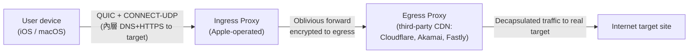
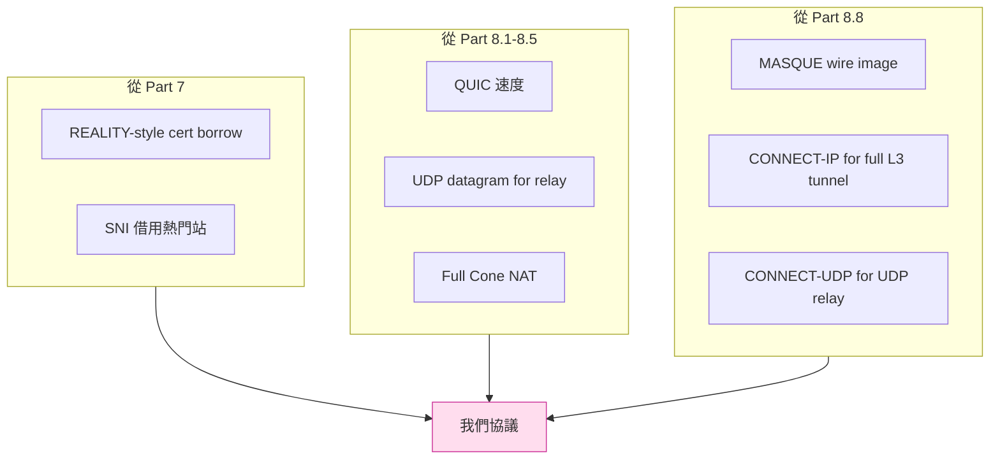

# 課堂 8.8 — MASQUE 深度（接 4.10）

## 學前知道
- 前置課：[4.10 HTTP/3 與 MASQUE](../part-4-tls-quic/4.10-http3-and-masque.md)、[8.6 QUIC 在中國的命運](./8.6-quic-in-china.md)
- 預計閱讀時間：**60 分鐘**
- 必讀規格：
  - **RFC 9297** — HTTP Datagrams and Capsule Protocol（Schinazi & Pardue, Aug 2022）
  - **RFC 9298** — Proxying UDP in HTTP（Schinazi, Aug 2022）
  - **RFC 9484** — Proxying IP in HTTP（Schinazi, Oct 2023）
  - **draft-ietf-masque-connect-ethernet** — Proxying Ethernet in HTTP（active draft）
  - **draft-ietf-masque-quic-proxy** — QUIC-aware proxy（draft）
  - **draft-ietf-masque-extensible-http-intermediation** — EHIP framework（draft）
- 必讀部署：
  - **Apple iCloud Private Relay** (2021–) — production CONNECT-UDP
  - **Cloudflare WARP** (2024+ MASQUE migration) — 公開 case study
- 必讀原始碼：
  - **quic-go/masque-go** — Go reference impl: https://github.com/quic-go/masque-go
  - **Diniboy1123/usque** — Cloudflare WARP MASQUE re-impl in Go: https://github.com/Diniboy1123/usque
  - **Cloudflare quiche** + warp-go internal

## 動機

[4.10](../part-4-tls-quic/4.10-http3-and-masque.md) 已給 MASQUE 基本概念。本堂深入：

1. **三個 CONNECT 變體**（UDP / IP / Ethernet）各覆蓋 OSI 哪層、用什麼 capsule
2. **Apple iCloud Private Relay** 怎麼用 MASQUE 做兩 hop relay
3. **Cloudflare WARP** 從 WireGuard 遷到 MASQUE 的真實設計
4. **作為 anti-censorship 工具的 MASQUE**：為什麼它可能是「下一代翻牆協議」基礎，又為什麼還沒完全到位

**對研究目標的關鍵性**：MASQUE = 「把任意流量包進 HTTP/3」。從 censor 視角，**流量看起來跟你訪問 cloudflare.com / icloud.com 一模一樣**——這就是 anti-censorship 的物理極限。

但 MASQUE 不是免費午餐：需要可信任 proxy（中間人讀得到你的 endpoint），且 GFW 已開始 measurement（[Part 8.6](./8.6-quic-in-china.md) 的 SNI 過濾 + iCloud Private Relay 在中國被擋）。

讀完應該回答：

- HTTP Datagram (RFC 9297) 為什麼是 MASQUE 的基石？跟 QUIC Datagram extension 是什麼關係？
- Capsule Protocol 解決什麼問題？為什麼不直接用 HTTP/3 frame？
- CONNECT-UDP / -IP / -Ethernet 三個各自的 wire format 差在哪？
- Apple iCloud Private Relay 為什麼用兩 hop？信任模型是什麼？
- Cloudflare WARP 為什麼從 WireGuard 換 MASQUE？
- 我們協議要「成為 MASQUE-like proxy」還是「跑在 MASQUE 之上」？

---

## 核心概念

### 1. HTTP Datagram + Capsule Protocol：MASQUE 兩層底基

#### 1.1 HTTP Datagram (RFC 9297 §2)

問題：HTTP/3 跑在 QUIC stream（reliable, ordered）。但 proxy UDP 要 unreliable, unordered。

解：在 H/3 連線上**保留一條 stream 為 "associated stream"**（用來 identify 這個 proxying session），然後**用 QUIC datagram (RFC 9221) 傳實際 packet**。

Wire 格式：

```
QUIC datagram payload:
  Quarter Stream ID (varint)    // associated H/3 stream ID >> 2
  Payload (bytes)               // 由 application 解釋 (UDP packet, IP packet, etc)
```

`>> 2` 是因為 H/3 client-initiated bidi stream ID 都是 `4k`（除以 4 → varint 壓縮更短）。

#### 1.2 Capsule Protocol (RFC 9297 §3)

問題：除了 datagram，proxying session 還需要 control message（assign address, advertise route, error notification）。這些**必須可靠 + 有序**——不能用 datagram。

解：**在 associated stream 上**用一個叫 capsule 的 framing：

```
Capsule:
  Type      (varint)    // 0x01=DATAGRAM (deprecated, 用 QUIC datagram 代替), 0x02..= control
  Length    (varint)
  Value     (bytes)
```

對比 HTTP/3 frame：H/3 frame 是 H/3 自己的封裝，capsule 是 H/3 之上 application-level 封裝。capsule 走 H/3 stream，由 application（CONNECT-UDP / -IP）解釋。

**設計取捨**：為什麼不直接用 H/3 frame？因為 H/3 frame 集合是 IANA-registered 的封閉 enum，加新 type 需要 IANA。Capsule 是 application 自己的 namespace，無需 IANA → 擴展性極佳。

### 2. CONNECT-UDP (RFC 9298)

**用途**：proxy UDP packet。

**握手**：H/3 extended CONNECT

```
CONNECT example.com:443
:protocol = connect-udp
:scheme = https
:authority = proxy.example.com
:path = /.well-known/masque/udp/example.com/443/
```

server 回 `200 OK` 後，這條 H/3 stream 變 associated stream，**所有後續 UDP packet 透過 QUIC datagram 傳，payload = real UDP packet bytes**（包括 client 用 dst port、target 用什麼 src port，由 client 在 path 指定 target）。

**Apple iCloud Private Relay 用這個**（最早 production deployment）。

### 3. CONNECT-IP (RFC 9484)

**用途**：proxy 整層 IP packet。等同 VPN（VLESS 級 anti-censorship + WireGuard 級覆蓋層級）。

**握手**：

```
CONNECT
:protocol = connect-ip
:scheme = https
:authority = proxy.example.com
:path = /.well-known/masque/ip/{target}/{ipproto}/
```

`target` 可選（site-to-site 不需要 target，remote access VPN 才需要）。

**三個重要 capsule**（控制 stream 上）：

| Capsule | Type | 用途 |
|---|---|---|
| `ADDRESS_ASSIGN` | 0x01 | server → client 配發 IP address / prefix |
| `ADDRESS_REQUEST` | 0x02 | client → server 要 IP |
| `ROUTE_ADVERTISEMENT` | 0x03 | 雙向告知 routing table |

**Datagram**：QUIC datagram payload 是**完整 IP packet bytes**（IPv4 header / IPv6 header + payload）。Context ID = 0 表示「IP packet」。

**MTU constraint**: IPv6 要求 link MTU ≥ 1280 byte。CONNECT-IP 用 QUIC datagram 載 IP packet，受 PMTU 限。RFC 9484 §7 提供 ICMPv6 echo + datagram padding 的 mechanism 來確保 1280 MTU 達標。

### 4. CONNECT-Ethernet (draft-ietf-masque-connect-ethernet)

**用途**：proxy L2 ethernet frame。site-to-site L2VPN, 跨資料中心 broadcast domain 延伸。

**握手**：

```
CONNECT
:protocol = connect-ethernet
```

**Datagram**：QUIC datagram payload 是**完整 ethernet frame**（含 src MAC, dst MAC, ethertype, payload, 不含 FCS）。

**Use cases**：

1. Remote access L2VPN（client 看起來在 office LAN）
2. Site-to-site L2VPN（跨資料中心 broadcast domain）
3. Cloud-to-cloud bridging

**為什麼有人想要 L2 over HTTP**：legacy 應用（NetBIOS, mDNS discovery, ARP）需要 L2 broadcast，TCP/IP 替代不了。

### 5. EHIP 框架（draft-ietf-masque-extensible-http-intermediation）

把上述三個 CONNECT 變體**抽出共通模型**：

- 任何 IP-layer 以上的 protocol 都可定義一個 CONNECT variant
- 共用 capsule protocol + HTTP datagram 框架
- 共用 .well-known URI 結構

未來可能加：CONNECT-PPP, CONNECT-SCTP, CONNECT-WebRTC-data-channel 等。

### 6. Apple iCloud Private Relay（最大規模 CONNECT-UDP 部署）

**架構**：



**信任模型**：

| Hop | 能看到 |
|---|---|
| ISP（user → ingress） | User 連到「mask-iphost.icloud.com」(QUIC SNI)；看不到內容；看不到 egress; 看不到 target |
| Ingress (Apple) | User 的 IP（可識別 user）；**看不到** target hostname（因為被 oblivious 加密一層給 egress）|
| Egress (CDN partner) | Target hostname（解密後）；**看不到** user IP（看到 Apple 的 ingress IP） |
| Target site | Egress 的 IP（不是 user 真實 IP）；user agent 看 Apple；不知道 user 是誰 |

→ **沒有單一方同時知道「誰」+「訪問什麼」**。這是 oblivious proxy 模型。

**怎麼做到**：兩層加密。User 加密一次 inner（用 egress 的公鑰），加密一次 outer（用 ingress 的公鑰）。Ingress 解 outer 拿到「給某個 egress 的 inner blob」，forward。

**規模**：Apple 沒公開數字。第三方估計（2024）約 5 億 active user，主要是 iCloud+ 訂閱者。**世界上最大的 oblivious proxy deployment**。

**在中國被擋**：iCloud Private Relay 在中國從 2021 啟動起就**不可用**——Apple 在中國販售的設備預設禁用此功能。技術上 ingress proxy 的 SNI 是 `mask-iphost.icloud.com`，GFW 對該 SNI 從 2021 起 drop。

### 7. Cloudflare WARP：從 WireGuard 遷到 MASQUE

**舊架構（2019–2023）**：

- Client app 跑 WireGuard
- 連到 Cloudflare anycast 192.0.2.x:51820 (WireGuard UDP)
- Cloudflare 解 WG → 走自家網路 → 出 egress

**問題**：
- WireGuard 流量形狀**獨特**（UDP 雙向 noise handshake + 固定 packet size patterns）→ 中國等 censor 從 2022 起識別 WireGuard
- WG 沒 connection migration → user 移動（WiFi → 4G）斷線
- WG 對 ISP-shaping 沒抵抗（WireGuard packet 形狀固定）

**新架構（2024+ MASQUE migration）**：

- Client app 跑 MASQUE-over-QUIC + CONNECT-IP
- 連到 Cloudflare `engage.cloudflareclient.com` (HTTPS/QUIC over UDP 443)
- Wire image = HTTPS/QUIC = **跟 Cloudflare 一般 HTTPS 流量混在一起**
- Connection migration 內建

**Diniboy1123/usque**: 一個 Go 實作，re-implement Cloudflare 的 MASQUE client protocol（基於官方 protocol 分析，非官方 SDK）。

**Cloudflare 沒公開 wire format 但行為觀察**（Diniboy 等社群人）：

- 用 CONNECT-IP (RFC 9484)
- IP capsule 上層走自家 control plane（auth, key rotation）
- 流量分到多個 anycast IP，user 看不到單一固定 endpoint

**對 anti-censorship**：

| 維度 | WG | MASQUE |
|---|---|---|
| Wire image | 獨特 | HTTPS/QUIC, 跟 Cloudflare 普通流量混 |
| GFW 識別 | 已被識別 | 跟 SNI=*.cloudflareclient.com 混；2024-04 後若 GFW 把這 SNI 入 blocklist 就死 |
| 連線移轉 | 無 | 有 |
| ISP shaping | 怕（WG packet size 固定） | 不怕（HTTPS-like） |

→ **MASQUE 對抗 ISP shaping 強，對抗 state-level SNI 過濾仍需 ECH 或 SNI 借用**。

### 8. MASQUE 作為 anti-censorship 工具

**核心優勢**：

> 你的 wire image **就是** HTTPS/QUIC 訪問 cloudflare.com / icloud.com。GFW 不能擋這個，因為這等於擋 Cloudflare 全部。

**現實 caveat**：

1. **SNI 仍可被擋**：GFW 從 2024-04 解 Initial 看 SNI（[8.6](./8.6-quic-in-china.md)）。若 SNI = `mask-iphost.icloud.com`、`engage.cloudflareclient.com` 被列 blocklist → 全 user 被擋。
2. **需信任 proxy operator**：iCloud Relay 需信 Apple + CDN partner；自架 MASQUE proxy 需信任 proxy admin（你或別人）。
3. **Proxy 必須 deploy 在 GFW 看得到流量的點**：proxy server 在中國境外，user 在中國境內，流量必過 GFW。proxy 域名一被識別就 game over。
4. **流量量大時 IP 可能被識別**：若你自架 MASQUE proxy 在某個小 IP，連線量大 → ISP 看 traffic pattern → flag 該 IP。

**怎麼解**：

- **借用 cloudflare 等大站的 SNI**（REALITY-on-QUIC 概念，目前無 production 實作）
- **域名 fronting on QUIC**（domain fronting 已 obsolete on TLS-over-TCP，QUIC 版尚未廣泛部署）
- **deploy MASQUE proxy 在 cloudflare workers** 或類似 multi-tenant CDN，借用大站 IP

### 9. MASQUE 為什麼可能是「下一代翻牆協議」基礎

把 Part 7（VLESS+REALITY）+ Part 8（QUIC 速度）+ Part 8.8（MASQUE 抗封鎖）三條合一：



具體：

- Wire image: HTTPS/QUIC, borrowed SNI (Cloudflare-class)
- Inside: MASQUE CONNECT-UDP / CONNECT-IP
- Inside that: 我們協議的真實 payload
- Speed: Brutal CC opt-in
- Auth: TLS exporter (TUIC 借鏡)
- Probe resistance: REALITY 借鏡 + Capsule 層內 challenge-response

**這就是我們 Part 11 設計的目標。**

---

## 與我們協議設計的關聯

| MASQUE 元素 | 給我們的 design constraint |
|---|---|
| HTTP Datagram (RFC 9297) | UDP relay 走 QUIC datagram, 標準化 |
| Capsule Protocol | Control message 走 H/3 stream, 跟 datagram 分流 |
| CONNECT-UDP | UDP proxy 走 RFC 9298 完全相容路徑 |
| CONNECT-IP | 若做 L3 tunnel, **採 RFC 9484 capsule + datagram 結構** |
| 兩 hop oblivious (iCloud) | 不需要兩 hop（過度設計），單 hop with SNI borrow 已夠 |
| Cloudflare WARP migration | wire image mimicry > wire format 創新 |
| iCloud 在中國被擋 | SNI 必須是 GFW 不敢擋的 |

---

## 動手（可選）

### 實驗 1：用 quic-go/masque-go 起 MASQUE server

```go
// server.go
package main
import (
    "github.com/quic-go/masque-go"
    "github.com/quic-go/quic-go/http3"
)

func main() {
    proxy := &masque.Proxy{}
    server := &http3.Server{
        Addr: ":443",
        Handler: proxy,
    }
    server.ListenAndServeTLS("cert.pem", "key.pem")
}
```

連線端用 `client.go` 對 `engage.example.com:443` 開 CONNECT-UDP，看 wireshark 抓 wire image。

### 實驗 2：分析 Cloudflare WARP 真實 wire

```bash
# 抓你 macOS / iPhone 上 cloudflareWARP app 流量
sudo tcpdump -i any -w warp.pcap host engage.cloudflareclient.com

# wireshark 看 long header SNI, packet pattern
```

對比 WireGuard pcap（舊版 WARP）。

### 實驗 3：自寫一個 CONNECT-UDP client

用 `quic-go/masque-go` 對某 MASQUE-supporting public proxy（若存在）做 UDP relay。送 DNS query → DNS server → 看 response。

---

## 自我檢查

1. RFC 9297 為什麼需要 Capsule Protocol？只用 QUIC datagram 不行嗎？
2. iCloud Private Relay 的 ingress + egress 兩 hop 設計，比單 hop 多了什麼安全保證？trade-off 是什麼？
3. Cloudflare WARP 用 CONNECT-IP 還是 CONNECT-UDP？這影響什麼？
4. CONNECT-Ethernet 對 anti-censorship 有什麼**獨特**價值？或只是純粹 enterprise use case？
5. 如果 GFW 把 `engage.cloudflareclient.com` 加 blocklist，Cloudflare 怎麼救？fast migration 機制可行嗎？
6. 我們協議要設計成「自己是 MASQUE proxy」還是「跑在公開 MASQUE proxy 之上」？trade-off。

---

## 延伸閱讀

- **RFC 9297 / 9298 / 9484** 全文（特別是 capsule type table、context ID semantics）
- **draft-ietf-masque-connect-ethernet** 最新版
- **Apple Platform Security guide** — iCloud Private Relay 章節（每年更新）
- **Cloudflare Blog**: "Announcing WARP MASQUE migration"（搜 cloudflare blog）
- **Diniboy1123/usque** source — Cloudflare protocol 反向工程
- **quic-go/masque-go** reference impl

---

## 研究級補遺

### 1. 學界詞彙

| 我們口語 | 學界 |
|---|---|
| MASQUE | Multiplexed Application Substrate over QUIC Encryption (WG name) |
| 兩 hop oblivious | Oblivious proxy / oblivious HTTP |
| HTTPS-mimicry | Wire-image mimicry / domain mimicry |
| 借用 SNI | SNI fronting / domain fronting (TLS版) |
| Capsule Protocol | RFC 9297 framing |
| CONNECT-UDP/IP/Eth | extended CONNECT methods, RFC 9298/9484/draft |

### 2. 對手分類學 / 威脅模型精化

對 MASQUE 的對手：

- **被動 SNI 過濾 (GFW Tier 2)**: 若 MASQUE 的 SNI 在 blocklist → 全死。**這是最大威脅**。
- **流量量分析**: MASQUE 用 QUIC datagram, padding 後 size distribution 可能跟普通 web 訪問差異
- **deep traffic timing analysis**: MASQUE relay 的 inner traffic 時序跟 outer web traffic 不同
- **proxy operator 信任**: ingress 可以 log user IP，egress 可以 log target hostname

對應 threat model 升級：MASQUE 不解決「proxy operator malicious」問題，要靠 oblivious 設計。

### 3. 領域的關鍵論文 / 規格 / 原始碼

| Source | 為什麼 |
|---|---|
| RFC 9297/9298/9484 | MASQUE 核心 |
| draft-ietf-masque-connect-ethernet | 即將 RFC |
| draft-ietf-masque-quic-proxy | QUIC-aware proxy, 對 anti-fingerprinting 重要 |
| draft-ietf-ohai-ohttp | Oblivious HTTP, MASQUE 設計姊妹 |
| Apple Platform Security guide | iCloud Relay 真實架構 |
| Diniboy1123/usque | Cloudflare WARP 反向工程 |
| quic-go/masque-go | Go reference |

### 5. 我們協議的座標 / 設計取捨

```
Proteus — MASQUE 啟示收窄:
- Wire image:
  * 必須是 HTTPS/QUIC (MASQUE 風), 不是自訂 wire
  * 必須借用熱門 SNI (Part 7 REALITY 啟示)
- Datagram path:
  * UDP relay 走 QUIC datagram (RFC 9221)
  * 仿 Capsule Protocol 做 control message
- Control plane:
  * 採 HTTP/3 + extended CONNECT 結構
  * 自定 .well-known URI
- Tunnel level:
  * Phase 1: CONNECT-UDP-like (single UDP target)
  * Phase 2: CONNECT-IP-like (L3 VPN, future)
- Proxy chain:
  * 不採 oblivious 兩 hop (過度設計, 速度 hit)
  * 採 single hop + SNI borrow
- Probe resistance:
  * Application-layer (capsule challenge) + TLS layer (REALITY borrow)
```

Part 11.3 / 11.5 spec 寫作會回頭引用。

### 6. 必追資源 / 社群入口

- **IETF MASQUE WG** — masque@ietf.org mailing list
- **IETF OHAI WG** — Oblivious HTTP
- **Cloudflare blog** — WARP MASQUE 公告
- **Apple developer documentation** — iCloud Private Relay
- **net4people/bbs** — 中國 censorship 觀察

### 7. 開放問題

- **OP-1**: 能否設計一個 MASQUE-on-borrowed-SNI 協議使得 wire image 跟 Cloudflare 自家流量完全不可區分（連 traffic shape）？目前 wire image 對, traffic shape 仍可區分（連線時長、burst pattern）。
- **OP-2**: MASQUE 的 capsule protocol 還沒被 censor 量測（沒人專門研究 GFW 對 capsule 內容的處理）。將來 GFW 是否會解 capsule 內容？這要 break QUIC 1-RTT key, 計算上極貴。
- **OP-3**: 兩 hop oblivious 的形式化證明：在什麼 attacker model 下「沒有單一方知道 (who, what)」這個性質成立？文獻有 Oblivious HTTP 的 formal analysis (Hendrickson et al. PoPETs 2023) 但 MASQUE 沒專門做。
- **OP-4**: CONNECT-Ethernet 對 anti-censorship 的特殊價值 — 能在 L2 上 fronting 嗎？沒文獻探討。
