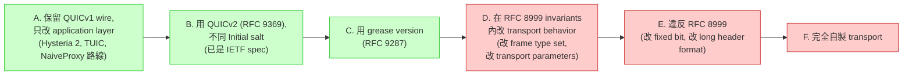

# 課堂 8.9 — 自製 QUIC 變體：可行性分析

## 學前知道
- 前置課：[4.7-4.12 整 Part 4 QUIC](../part-4-tls-quic/)、[8.1](./8.1-quic-as-second-line.md)、[8.6](./8.6-quic-in-china.md)、[8.7](./8.7-quic-go-forks.md)、[8.8](./8.8-masque-deep.md)
- 預計閱讀時間：**45 分鐘**
- 必讀規格：
  - **RFC 8999** — QUIC Invariants（不可變欄位）
  - **RFC 9000 / 9001 / 9002** — QUICv1 本體
  - **RFC 9369** — QUIC Version 2（IETF 給的「不一樣」變體）
  - **RFC 9287** — Greasing
  - **draft-thomson-quic-version-aliasing** — Version aliasing 思路
- 必讀部署參考：
  - Google's gQUIC (legacy, 跟 IETF QUIC 不同)
  - Facebook MVFST 對 QUIC 的擴展 — `github.com/facebook/mvfst`
  - Hysteria 2 / TUIC 的「QUIC variant 程度」: 都只改 above-QUIC 層

## 動機

[8.6](./8.6-quic-in-china.md) 告訴我們：GFW 從 2024-04 起對 QUICv1 做 SNI 過濾。社群目前的應對（[8.7](./8.7-quic-go-forks.md)）是「在 QUICv1 範圍內 hack」（SNI slicing、jumbo Initial）。但長期來看：

> **如果我們發明一個「不是 QUICv1」的 QUIC 變體，GFW 的 v1-specific 過濾邏輯整個無效。**

問題：

1. 「從零寫 QUIC」是不可能的（單 RFC 9000 就 207 頁）。
2. 完全違反 RFC 8999 invariants 會跟整個生態系撞（中間設備、firewall、可能的 ossification）。

本堂的核心問題：**最小改動達到 censor-evasion 目的的設計空間在哪？**

讀完應該回答：

- RFC 8999 哪些欄位**真的**不能動？
- 「自製 QUIC variant」vs「跑在 MASQUE 之上」vs「fork quic-go 加 anti-censorship」trade-off 為何？
- 為什麼 QUICv2 (RFC 9369) 出現？對 censor evasion 是 free meal 嗎？
- 我們協議到底是「QUIC variant」還是「QUIC application」？這個分類有意義嗎？

---

## 核心概念

### 1. 「自製 QUIC variant」的設計光譜

從**最保守**到**最激進**：



- **A**: 最保守。Hysteria 2 / TUIC / NaiveProxy 全在這層。GFW 識別風險：高（v1 SNI 在 Initial 內可被讀）
- **B**: 用 QUICv2。**幾乎免費**（IETF 已 publish），GFW 暫時不支援。但長期 GFW 會加 v2 支援。
- **C**: Grease version。GFW 若 hardcoded v1，可繞。但 IETF spec 要求 server 必須回 version negotiation，GFW 看 negotiation 仍可 trace。
- **D**: 仍是 QUIC，但 frame / transport param 全自訂。生態系完全不認，自家 server+client 才能用。
- **E**: 不是 QUIC 了，但仍 mimic。複雜度爆炸，安全 review 巨大。
- **F**: 像 WireGuard、SS-Aead 那種完全自製 transport。維護自家 crypto + transport，bug 風險巨大。

**Part 11 設計 likely 落在 B–C 之間**：用 QUICv2 + grease，免費吃 IETF spec 紅利，需要時加 application-layer mimicry 補。

### 2. RFC 8999 不可變欄位再讀

[8.1](./8.1-quic-as-second-line.md) sec 3 列過。再深一遍：

```
Long header byte 0:
  bit 7: Header Form     = 1 (必須)
  bit 6: Fixed Bit       = 1 (必須, 區別 QUIC vs DTLS/STUN)
  bit 5-0: version-specific

Long header byte 1-4:
  Version Field (32-bit)
  0x00000000 = version negotiation (reserved)
  其他: version-specific

Long header next:
  DCID Length (1 byte, 0..20)
  DCID (length bytes)
  SCID Length (1 byte, 0..20)
  SCID (length bytes)

Short header byte 0:
  bit 7: Header Form     = 0
  其他: version-specific

Short header next:
  DCID (length 由 OOB, 兩端事先約定)
```

**可動的**：所有 version-specific bit、所有 packet number 編碼、所有 frame 格式、所有 transport parameter、所有 1-RTT 加密細節、connection migration semantics、stream multiplexing。

**不可動的**：上述列表。**為什麼**：middlebox / firewall / OS network stack 可能用 fixed bit + header form 來決定「這是 QUIC 還是別的 UDP 流量」。動它就跟 middlebox 撞。

### 3. QUICv2 (RFC 9369)：IETF 自己給的「不一樣」變體

RFC 9369 (Schinazi, May 2023) 設計初衷：**測試 ossification**。意思：IETF 故意 release 一個「除了 version number 跟 keys 不同，其他全跟 v1 一樣」的 QUICv2，看 middlebox 會不會 break。

**具體差異**（vs QUICv1）：

| 欄位 | v1 | v2 |
|---|---|---|
| Version number | `0x00000001` | `0x6b3343cf` |
| Initial salt | `0x38762cf7…` | `0x0dede1058a7d066c1e0a8d8e9a8e2e3a31aef6f5` |
| Initial key label | `"client in"` / `"server in"` | `"quicv2 client in"` / `"quicv2 server in"` |
| Packet type encoding | bits[3:2] of byte 0: 0=Initial, 1=0-RTT, 2=Handshake, 3=Retry | bits[3:2]: 1=Initial, 2=0-RTT, 3=Handshake, 0=Retry (**shuffled**) |
| Retry integrity tag key/IV | `secret_v1` | `secret_v2`（不同） |

**Result**: GFW 對 v1 hardcoded 的解 Initial 邏輯**完全沒辦法**解 v2（salt 不一樣 → key 不一樣 → AES-GCM 失敗 → 解出 garbage → 沒 SNI 可看 → pass）。

**部署現狀**（2026 May）：

| 實作 | v2 support |
|---|---|
| Chrome | 部分（experimental） |
| Firefox | 部分 |
| Cloudflare | 全部署 |
| Google QUIC servers | 部分 |
| quic-go | 全 |
| MS msquic | 部分 |
| Apple Network.framework | 未公開 |

**對 censor**：GFW 還不支援 v2 解 Initial。但 IETF spec 已 standardized → 預計 GFW 將來會加（也許 1-2 年）。

**設計啟示**：**用 v2 作為我們協議的 base transport，2026-27 之間有半免費紅利**。但長期不能依賴。

### 4. Version Aliasing (draft-thomson)

更進一步：**讓 client 跟 server 私下約定一個 random version**。

設想：

- Client/server 預共享一組「version table」：`[0xfa1afa1a, 0xbc2dbc2d, ...]`
- Client 在 Initial 用 version = 表中隨機一個
- Server 看 version 在表內 → 認帳，按 v1 (或 v2) semantics 處理
- 第三方（含 GFW）看 version → 不認得 → 不知道 derive key 用哪個 salt → 解不開

**問題**：

- IETF spec 不允許「私下 version」。違反生態系。
- 部分 middlebox 對未知 version 直接 drop（而不是 forward）。實務上 risky。

**Draft 狀態**：實驗性，未 IETF adopted as WG document。我們協議若採用要自負 ossification 風險。

### 5. 在 RFC 8999 內換 frame type set

如果我們不改 invariants 但改 frame type 集合：

```
QUICv1 frame types (RFC 9000 §19):
  0x00 PADDING
  0x01 PING
  0x02-0x03 ACK
  0x04 RESET_STREAM
  0x05 STOP_SENDING
  0x06 CRYPTO
  0x07 NEW_TOKEN
  0x08-0x0f STREAM (with flags)
  0x10 MAX_DATA
  ...

我們協議:
  0x00 PADDING (跟 v1)
  0x01 PING (跟 v1)
  // 跳過 ACK 我們自訂
  0x80 OUR_ACK
  0x81 OUR_CRYPTO
  0x82 OUR_STREAM
  ...
```

**結果**：generic QUIC tool（包括 Wireshark dissector）解到 frame type 0x80 → 「unknown frame, ignore」。但**我們協議 client/server 知道**。

**問題**：1-RTT 加密保護 frame，外人讀不到 frame type → 改 frame type set 不影響外觀，**對 censor evasion 沒幫助**。改的目的只是「不被 generic tool 解碼」，這不是 anti-censorship 主要目標。

→ **不值得做**。

### 6. 自訂 transport parameter

QUIC transport parameters (RFC 9000 §18) 在 Initial 的 TLS extension 內傳，**會被 GFW 解 Initial 後看到**。改 transport parameter ID 不變 wire format → 不能 bypass SNI 過濾。

但有兩個 anti-censorship 用法：

1. **加 grease parameter**（RFC 9287）拉大 ClientHello size → 觸發 jumbo split
2. **改 standard parameter ID 為 non-standard**（破壞 spec, generic QUIC stack 不認 → 跟自家 stack only 互通）

第一個自然有用。第二個僅在 D 等級設計時考慮。

### 7. 完全自製 transport（光譜 F）：何時必要？

社群有兩派意見：

**派 A（推自製）**：
- QUIC 的 wire image 永遠被 fingerprint（因為 invariants 是公開知識）
- 唯一 robust 是完全自寫
- 例: WireGuard 不是 QUIC variant，獨立設計

**派 B（推 QUIC 變體 / MASQUE 借）**：
- 自寫意味著自己做 crypto / transport / spec / formal verify → 巨大工程
- QUIC 的 wire image 在 IPCDR 等普及度下**反而是 cover**
- 例: Cloudflare WARP 從 WG 換 MASQUE

**我們的選擇**（暫定，Part 11 詳論）：**派 B + 強 mimicry**。

理由：
1. 自寫 transport 是 5+ 年工程，我們資源不夠
2. QUIC 普及度足夠（2026 約 30% web traffic），可作 cover
3. 我們要打的是「跟 cloudflare/google 流量混在一起」的 wire image，不是「跟所有 web traffic 都不一樣」的 obfuscation

**反對意見的價值**：派 A 的論點對「對抗極端對手」（如 ML-based censor）仍 valid。Part 8.10 / Part 11 設計時要對這 risk 有 plan B。

### 8. 「QUIC variant」vs「QUIC application」的分類意義

定義（我們自家）：

- **QUIC application**: 跑在 QUIC 上的 application protocol。e.g. HTTP/3, DoH-over-QUIC, MASQUE。**Wire image 是合法 QUIC**。
- **QUIC variant**: wire format 跟 IETF QUIC 不完全一致，但**仍滿足 RFC 8999 invariants**。e.g. QUICv2, version aliasing。
- **Non-QUIC transport that looks like QUIC**: 完全自寫 transport 但 mimic QUIC wire image。**最危險**，違反 invariants。

我們協議落 (a) 還是 (b)？

**建議落 (a) + 強 mimicry**：

- 純 QUIC application（跑在 MASQUE 之上）
- Wire image = QUIC + HTTPS + MASQUE
- 對 censor: 看起來就是普通 H/3-over-QUIC 流量
- 我們的 anti-censorship 主要靠**SNI 借用 + Capsule layer 自訂**，不是 QUIC variant

但**保留 escape hatch**：若 GFW 對 MASQUE 全擋（unlikely 但 possible），我們可降一層改用 QUIC variant。Part 11.4 主架構決策時設這個 fallback。

---

## 與我們協議設計的關聯

| 自製變體選項 | 我們的決定 |
|---|---|
| 完全自製 transport (F) | **不採**。工程量太大、安全 review 太重 |
| 違反 RFC 8999 invariants (E) | **不採**。跟生態系撞 |
| 改 frame type / transport param ID (D) | **不採**。1-RTT 加密下無 censor evasion 效益 |
| Version aliasing (C) | **觀察**。draft 狀態不穩，先不用 |
| QUICv2 base (B) | **採**。免費紅利 |
| QUICv1 + application layer mimicry (A) | **主路線**。配合 MASQUE + REALITY-style SNI 借用 |

我們協議落在 **A + B 之間**：跑在 QUICv2 上（規避目前 GFW v1 hardcoded 邏輯）、wire image 是 H/3 over QUIC（MASQUE 形狀）、application layer 自訂（auth, padding, framing）。

---

## 動手（可選）

### 實驗 1：在 quic-go 切換 v1 ↔ v2

```go
import "github.com/quic-go/quic-go"

conf := &quic.Config{
    Versions: []quic.Version{quic.Version2},  // 強制 v2
}
quic.DialAddr("youtube.com:443", tlsconf, conf)
```

從中國 vantage 跑，看是否 bypass GFW QUIC SNI 過濾。

### 實驗 2：實作 mini QUIC version aliasing

```go
// 自己 fork quic-go, 把 Version 設成 random alias
const ourAlias quic.Version = 0xfa1afa1a

// 修改 initialAEAD.go 使我們的 server 接受 0xfa1afa1a 為「我們的 v2 alias」
// 用 v2 的 initial salt
```

兩端 client + server 都 modify，看 wireshark 抓的 wire 是什麼。生態系（Cloudflare 訪問）會不會 break？

### 實驗 3：完全自製 mini transport（教學 only）

寫一個極簡 UDP transport：

```
我們的 packet:
  byte 0: header form (1=long, 0=short) | 7 reserved bits
  byte 1-4: version = 0xACACACAC
  byte 5: DCID length
  byte 6+: DCID
  ... (自訂 frame)
```

實作 client + server 互通。觀察：

- middlebox 是否 drop 這 packet（因 fixed bit 不是 1）？
- 哪些 firewall 直接 reject？

教訓：違反 invariants 在 Internet 環境立刻撞牆。

---

## 自我檢查

1. RFC 8999 fixed bit 為什麼是不可變？破壞 fixed bit 會跟哪些 middlebox 撞？
2. QUICv2 跟 v1 的主要差別只在「key derivation 用不同 salt」。為什麼這就足以讓 GFW 解不開？
3. Version aliasing 跟 grease version 的差別？哪個 IETF 更接受？
4. 我們協議若用 QUICv2 base，預期 2026-27 GFW 加 v2 支援後怎麼辦？plan B？
5. 「跑在 MASQUE 之上」vs「自製 QUIC variant」對研究 paper 寫作角度，哪個論點更強？

---

## 延伸閱讀

- **RFC 8999, 9000, 9001, 9002, 9369, 9287, 9298, 9484**
- **draft-thomson-quic-version-aliasing**
- **gQUIC 跟 IETF QUIC 差異**: Langley 2017 SIGCOMM paper 後半段
- **Facebook MVFST** github source — Facebook 對 QUIC 的擴展
- **Cloudflare's experimental QUIC versions**: cloudflare blog

---

## 研究級補遺

### 1. 學界詞彙

| 我們口語 | 學界 |
|---|---|
| QUIC 變體 | "QUIC dialect" / "QUIC version" |
| 違反 invariants | "Breaking wire image invariants" |
| 自製 transport | "Custom transport protocol design" |
| 跑在 MASQUE 之上 | "Application over MASQUE" |
| Greasing | "Protocol unossification" |
| Version aliasing | "Cryptographically-derived version" |

### 2. 對手分類學 / 威脅模型精化

對「自製 QUIC variant」的對手：

- **Tier 2 GFW** (現): 對 v1 hardcoded → QUICv2 bypass
- **Tier 3 GFW** (預測 2027): 加 v2 + version 自適應 → 必須 version aliasing 或 application-layer mimicry
- **Tier 4 GFW** (預測 2028+): 對未知 version 直接 drop → version aliasing 失效；剩下「不冒充 QUIC」(自製 transport) 或「完全 hidden in normal HTTPS」(MASQUE) 兩條路
- **Tier 5 GFW** (預測 5+ 年): ML-based traffic shape recognition → 兩條都受威脅

我們協議的設計**要在 Tier 3-4 範圍內穩**，Tier 5 留 Part 10 / 11 解。

### 3. 領域的關鍵論文 / 規格 / 原始碼

| Source | 為什麼 |
|---|---|
| RFC 8999 | Invariants |
| RFC 9369 | v2 主源 |
| RFC 9287 | Grease |
| draft-thomson-quic-version-aliasing | Aliasing 概念 |
| Langley SIGCOMM 2017 | gQUIC vs IETF QUIC 對 protocol evolution 的啟示 |
| Cloudflare quiche / Facebook mvfst | 不同 QUIC stack 看 invariants 怎麼處理 |

### 5. 我們協議的座標 / 設計取捨

```
Proteus — Part 8.9 收窄:
- Wire image:
  * QUICv2 base (規避 v1 hardcoded) 
  * fall-back to v1 若 server 不支援 v2
- Invariants:
  * 完全遵守 RFC 8999 (long header fixed bit, version field, CID format)
  * 不破壞 generic QUIC parser
- Frame types:
  * 跟 QUIC v2 一致 (重用 IETF 定義)
  * 自家 application 層用 capsule (MASQUE 風)
- Plan B (若 GFW 加 v2):
  * fall-back to MASQUE-over-cloudflare with SNI borrow
  * Plan C: full mimicry of WhatsApp / Telegram / TikTok QUIC traffic
```

### 6. 必追資源 / 社群入口

- **IETF QUIC WG** mailing list
- **net4people/bbs**
- **Cloudflare research blog** — QUIC ossification 量測
- **Akamai QUIC engineering blog**

### 7. 開放問題

- **OP-1**: QUICv2 在 generic Internet middlebox 上的 deployment 失敗率？目前無系統量測，只有 Cloudflare 自家數據。
- **OP-2**: Version aliasing 在 anti-censorship 上的長期 robustness。若 GFW 採「unknown version → block」就立刻死。沒人實測。
- **OP-3**: 完全自製 transport 的 cost-benefit 量化。多少投入換多少 anti-censorship 紅利？沒 academic 系統研究。
- **OP-4**: QUICv3 何時會出？IETF 對「為 ossification 測試而 release new version」是否定期化？社群討論但無明確 roadmap。
