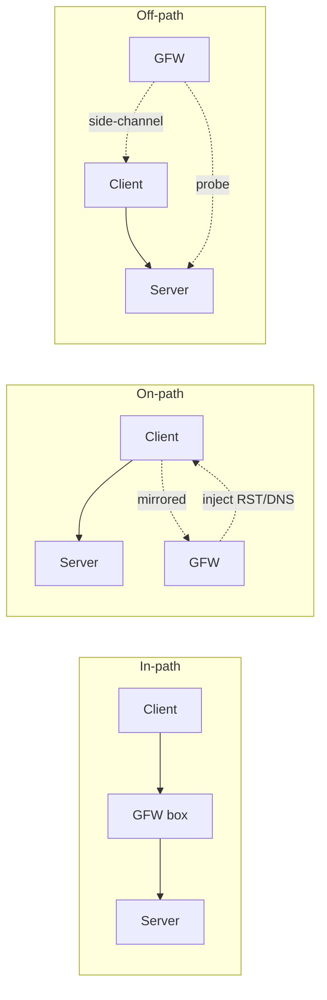
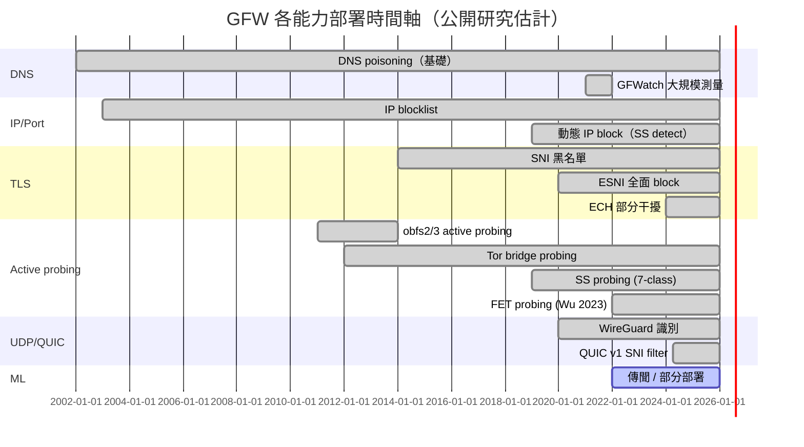

# 課堂 9.1 — GFW 架構與能力綜述：從黑盒到可量測對手

## 學前知道
- 前置課：
  - [Part 1.10 IP 層基礎](../part-1-networking/1.10-ip-routing-bgp.md)（off-path injection 物理基礎）
  - [Part 1.13 TCP off-path 攻擊](../part-1-networking/1.13-tcp-off-path.md)（[[cao-tcp-side-channel]]，理解 RST 注入機制）
  - [Part 4.6 SNI 與 ECH](../part-4-tls-quic/4.6-sni-ech.md)（SNI 黑名單機制基礎）
- 預計閱讀時間：**60 分鐘**（本堂是 Part 9 的綜述，後續 9.2–9.14 會逐項展開）
- 必讀論文（precis 已備）：
  - Alice, Bob, Carol et al. *How China Detects and Blocks Shadowsocks.* IMC 2020 → [[alice-bob-carol-ss-imc20]]
  - Wu, M. et al. *How the Great Firewall of China Detects and Blocks Fully Encrypted Traffic.* USENIX Security 2023 → [[wu-fep-detection]]
  - Ensafi, R. et al. *Examining How the Great Firewall Discovers Hidden Circumvention Servers.* IMC 2015 → [[ensafi-gfw-probing]]
  - Hoang, N. P. et al. *GFWatch: Measuring the Great Firewall's DNS Censorship.* USENIX Security 2021 → [[hoang-gfwatch]]
  - Bock, K. et al. *Geneva: Evolving Censorship Evasion Strategies.* CCS 2019 → [[bock-geneva-ccs19]]
  - Zohaib, A. et al. *Exposing and Circumventing SNI-based QUIC Censorship of the GFW.* USENIX Security 2025 → [[zohaib-quic-sni-usenix25]]
  - Cao, Y. et al. *Off-Path TCP Exploits.* USENIX Security 2016 → [[cao-tcp-side-channel]]
  - Houmansadr et al. *The Parrot is Dead.* IEEE S&P 2013 → [[houmansadr-parrot-is-dead]]
  - Khattak, S. et al. *SoK: Making Sense of Censorship Resistance Systems.* PoPETs 2016 → [[khattak-sok-resistance]]
- 必讀社群入口：
  - [GFW Report](https://gfw.report) — 主要學術產出
  - [net4people/bbs](https://github.com/net4people/bbs) — Issue tracker，每篇審查相關論文都有討論串
  - [OONI](https://ooni.org) — Open Observatory of Network Interference 全球測量資料

## 動機

GFW 不是一個黑盒，而是 **一組可量測、可解構、可實驗的系統**。過去十年（2014–2026）累積了約 25 篇可作為 primary source 的學術論文（GFW.report、IMC、NDSS、USENIX Security、PoPETs），讓我們從工程細節層面理解它的設計。

我們的研究目標（Part 11）是設計一個 SOTA 抗審查協議。抗誰？抗一個**真實對手**，不是「想像中的審查者」。本堂建立威脅模型的骨架；9.2–9.13 把肉填上；9.14 把這套對手能力轉成設計約束。

> **Failure framing**：本堂的描述基於到 2026-05 為止的公開研究。GFW 是一個 **moving target**，能力會升級（2024 開始 QUIC SNI 過濾、2023 開始 FET 分類器）。任何宣稱「GFW 永遠檢測不到 X」的話都是反研究。我們要的是 **「在 t 時刻，已知對手能力 C(t) 下，協議 P 可被檢測機率上界」** 這種可演算的命題。

---

## 核心概念

### 1. GFW 的部署形態：on-path vs in-path vs off-path

> 這三個詞學術界與工程界常混用。本堂用以下定義（沿用 Pearce et al. *Augur*, IEEE S&P 2017 + Khattak SoK PoPETs 2016）：

| 形態 | 定義 | 物理位置 | 能力 |
|---|---|---|---|
| **In-path（in-line）** | 流量必須經過該設備才能繼續傳遞 | 串聯在主幹線中（光纖 splitter→processor→regenerator） | 可以 **drop / modify / replace** 任意封包；延遲增加 |
| **On-path** | 流量被鏡像，設備能看到流量但不在轉發路徑上 | 並聯（port-mirror、光分接） | 可以 **inject**（如 RST、DNS 回應），但無法 drop 原封包；只能跟原伺服器**競速** |
| **Off-path** | 設備只能間接探測（送 probe、觀察 side-channel） | 任意（甚至國外） | 必須利用 side-channel（如 TCP timestamp、ICMP rate limit）；最弱 |

**GFW 的真實形態**（混合）：
- **核心骨幹**（出國 IX、ChinaNet/CNC/CMCC 出口）部分 **in-path**。可 drop UDP、drop QUIC（[[zohaib-quic-sni-usenix25]] 觀察到 in-path drop 能力）、可 drop SYN/SYN-ACK。
- **絕大多數 DPI 邏輯** 是 **on-path**：流量被鏡像到分析叢集，分析叢集回送注入命令（RST、DNS 偽造、ICMP）給注入機。注入機並聯在主幹線上，發送注入封包。**這是 RST injection 永遠跟伺服器真實 RST/FIN 競速的原因**。
- **active probing** 是 **off-path 探測，但需要 in/on-path 提供 trigger**：DPI 觀察到「疑似 SS」→ 通知 prober pool → prober 從中國各地 IP 主動連向境外可疑伺服器。

**這個混合形態的設計意義**：

1. **on-path 才是常態**，因此「**跟對手競速**」是設計現實。例如 [[bock-geneva-ccs19]] 的核心 trick 是在 GFW 注入的 RST 到達之前讓真實流量先抵達；或者用「fragment SYN 讓 GFW 重組失敗」之類。
2. **in-path 能力存在但**多用於 **QUIC/UDP**（[[zohaib-quic-sni-usenix25]]）與部分高優先級流量。如果我們協議走純 UDP，要假設對手有 drop 能力，不能依賴注入競速。
3. **active probing 的時序遲滯**（秒到分鐘級）是被動觀察的結果——這給了我們一個訊號：**如果伺服器在連線後幾秒內收到外部 IP 重連同一端口，那大概率是 GFW prober，可記錄、標記、研究**。

---

### 2. GFW 的「決策樹」：六大能力

整個 Part 9 對應的對手能力，可以歸納為六種獨立但可組合的機制。本堂把它們的相互關係建出來，9.2–9.13 各自深入。

```mermaid
flowchart TD
  subgraph "1. DNS poisoning"
    A1[GFW 觀察 DNS query]
    A1 --> A2{包含黑名單<br/>關鍵字?}
    A2 -- yes --> A3[注入偽造 DNS<br/>response（私有IP/不可達）]
  end
  subgraph "2. IP/Port blocklist"
    B1[出口路由器 ACL]
    B1 --> B2{目的 IP 在<br/>blocklist?}
    B2 -- yes --> B3[drop SYN]
  end
  subgraph "3. SNI/Host blacklist (TLS/HTTP)"
    C1[TCP 流組裝]
    C1 --> C2{ClientHello.SNI<br/>or Host: 含<br/>黑名單?}
    C2 -- yes --> C3[注入 RST × 3<br/>+ 90 秒 residual]
  end
  subgraph "4. Encrypted-traffic heuristics"
    D1[首包 entropy/length]
    D1 --> D2{SS 觸發條件?<br/>or FET 觸發?}
    D2 -- yes --> D3[標記為候選]
    D3 --> D4[active probing]
    D4 -- 確認 --> D5[blocklist 目的 IP:port]
  end
  subgraph "5. QUIC SNI filter (2024+)"
    E1[QUIC Initial 解密]
    E1 --> E2{SNI 在<br/>QUIC 黑名單?}
    E2 -- yes --> E3[drop 後續 UDP]
  end
  subgraph "6. ML flow classifier (尚未廣泛部署)"
    F1[flow features:<br/>size, IAT, burst]
    F1 --> F2[分類器]
    F2 -- 高置信 --> F3[標記 + 二級審查]
  end
  classDef ours fill:#fde,stroke:#c39
```

**各機制成熟時間軸**：

---

### 3. DNS poisoning（深度入口）

GFWatch（[[hoang-gfwatch]]，USENIX Security 2021）是迄今最完整的 DNS 污染研究：

- **觀察方法**：從境外向中國境內非遞迴 DNS resolver 查詢，記錄返回的偽造 IP。
- **發現規模**（2020 時點）：~311 k domain 被污染；偽造 IP 池只有 **~1700 個**，但變化頻繁。
- **偽造方式**：GFW 注入 DNS 回應（UDP src=53），通常比真實回應更快。Client 看到第一個回應就接受，後續真實回應被忽略。
- **不論問什麼類型**：A、AAAA、TXT 都會被注入污染回應（A/AAAA 注入無意義 IP，TXT 注入空字串）。
- **DoH/DoT 是繞過點**：但 [[zohaib-quic-sni-usenix25]] 顯示 DoH（HTTPS over 443）依然被 SNI 過濾打到。

**對協議設計的意義**（lesson 9.14 詳述）：
- 任何用 plaintext DNS 查詢協議端點 = **第 0 秒就死**。
- DoH 不夠：對手能用 SNI 黑名單打 DoH provider 的 host。
- 我們協議必須用 **bootstrap**：客戶端原生知道伺服器 IP（無 DNS）、或經 ECH/oblivious-DoH 取得。

---

### 4. IP/Port blocking

最古老、最不需要 DPI 的手段，但仍是最後一道執行單元。

**動態 IP block** 的觸發來源：
1. Active probing 確認後（[[alice-bob-carol-ss-imc20]]）。
2. 大量「無 plaintext header 且高 entropy」流量的疑似 endpoint。
3. 已知 Tor bridge IP（公開 bridge 在分發後幾天內被加入）。

**封鎖粒度**：可以是 single port、整個 IP、整個 /24 子網（罕見但見過，2019 SS 黑色週期）。

**研究意義**：IP blocklist 本身就是一個可被探測的「訊號」。Ramesh et al. *Decentralized Control: A Case Study of Russia* (USENIX Security 2020) 與 Anderson et al. *Internet censorship in Iran* 都用 IP blocklist diff 來反推 censor 邏輯。

---

### 5. TCP RST 注入（SNI / Host 黑名單核心）

整個 TLS/HTTP 黑名單機制的執行手段是 **TCP RST 注入**：

1. GFW DPI 重組 TCP 流。
2. 若解析到 `ClientHello.server_name` 或 HTTP `Host:` 在黑名單 → 觸發注入。
3. **注入三個 RST**：分別偽裝為 client→server、server→client，並通常重複幾次防丟包。注入 RST 的 seq 號被精心計算落在 receive window 內。
4. **Residual censorship**：之後 ~90 秒內，相同 `(src_IP, dst_IP, dst_port)` 五元組的新連線會被立即 RST。

**為什麼這個機制是「on-path」**：GFW 看到 ClientHello 後才注入，**真實 server 的回應同時在路上**；對 RTT 較短的境外 server，可能 server 的 `ServerHello` 先到 → 連線可能繼續一陣子但很快被注入殺死。Geneva 找到的多個 evasion 都是利用「讓 server 的 RST/真實流先到、注入的失效」。

**底層機制詳述**：
- 注入 RST 不是隨便發的；GFW 必須先重組 TCP 流以解析 ClientHello。這意味著有 **per-flow TCB 狀態**。
- Geneva 因此找到「**TCB-teardown**」evasion：發送一個格式異常但合法的封包讓 GFW 的 TCB 失效，後續流量就 bypass。
- 細節參考 [[cao-tcp-side-channel]] 與 [[bock-geneva-ccs19]]。

---

### 6. 加密流量啟發式（SS / FET / others）

這是 2019 以後 GFW 最積極發展的方向。三個里程碑：

- **2019**：對 Shadowsocks 部署 entropy+length 觸發 + 7-class active probing（[[alice-bob-carol-ss-imc20]]）。
- **2022**：擴大為 fully-encrypted-traffic (FET) heuristics。Wu 2023（[[wu-fep-detection]]）給出 6 條 byte-class exempt 規則。
- **2024–25**：QUIC SNI filter（[[zohaib-quic-sni-usenix25]]）—— 解密 QUIC Initial 然後做 SNI 黑名單。

對協議設計（lesson 9.7 詳）：
- 首包 entropy 是一個 strong feature。我們協議的首包必須長得像 **某個現實 protocol header**，或者像 **TLS ClientHello 那種半結構化**。
- 純 random bytes = 主動暴露身份。

---

### 7. ML / Flow classifier

最少公開研究的部分，因為 GFW 不開源、公開只能黑盒測。但 2026 年我們可以從幾個 indirect signal 推測：

1. **OONI 與 GFW.report 報告中**，「VLESS+REALITY 在 Iran 被 ML-like 行為間歇性 block」。中國尚未廣泛報告類似 ML block REALITY 的案例。
2. **學術界**對「應用識別」（[[vanede-flowprint-ndss20]]）與「網頁指紋」（[[sirinam-deep-fingerprinting-ccs18]]）的進展，已遠超 hand-crafted feature。**GFW 有能力、有資料、有動機**部署這類分類器。
3. **2026 工程趨勢**：若 GFW 部署 ML 分類器，可能形態是 **「先 heuristic 觸發、後 ML 確認」** 的多級過濾（類似 SS 兩段式），因為 GbE-級流量讓 per-flow inference 成本仍高。

**我們的工作假設**（lesson 9.13 用實際資料驗證）：到 2026 年 GFW 對抗 VLESS+REALITY 主要仍是 IP-level + 動態指紋，**尚未證實**有大規模 ML 識別 REALITY。但這個「尚未」隨時失效。

---

### 8. Active probing 的角色

Active probing 是「**橫跨多種機制的執行器**」：

- **觸發來源**：entropy heuristic（SS）、FET 觸發（[[wu-fep-detection]]）、Tor bridge 報告、被動 SNI miss（疑似偽裝）。
- **執行細節**：探測 IP 池龐大（[[alice-bob-carol-ss-imc20]] 觀察到 12000+ IPs），但 [[cao-tcp-side-channel]]-style TCP timestamp side-channel 顯示**背後只有少量主機**，極可能是一個 NAT 後或 source-IP-spoofing 後的中央叢集。
- **時序**：被動觸發 → 探測延遲秒級至分鐘級。
- **探測 family**：7 種針對 SS、無限制針對 Tor bridge（[[ensafi-gfw-probing]] 描述 obfs2/obfs3 探測為 client handshake replay）。

**對協議設計**（lesson 9.6, 9.14 詳）：
- 我們協議的服務器必須對 active probe **產生跟 cover server 一模一樣的回應**。REALITY 的「fallback 到真實 backend」是當前最強解。
- 必須假設 prober 在 client 第一次連線後幾秒到幾分鐘內到達。記錄 + 標記 + research 該 IP 子網。

---

## GFW.report 論文集導覽（25 篇 → 9 篇 anchor + 16 篇衍生）

> 不要試圖一次讀完。本堂建立 anchor，9.2–9.14 各自深入相關論文。

**Anchor 9 篇（必讀）**：
1. Ensafi et al. *Examining How the Great Firewall Discovers Hidden Circumvention Servers.* IMC 2015 — active probing 起源 → [[ensafi-gfw-probing]]
2. Alice et al. *How China Detects and Blocks Shadowsocks.* IMC 2020 — SS 偵測 → [[alice-bob-carol-ss-imc20]]
3. Wu et al. *How the GFW of China Detects and Blocks Fully Encrypted Traffic.* USENIX Sec 2023 — FET → [[wu-fep-detection]]
4. Hoang et al. *GFWatch: Measuring the GFW's DNS Censorship.* USENIX Sec 2021 — DNS → [[hoang-gfwatch]]
5. Zohaib et al. *Exposing and Circumventing SNI-based QUIC Censorship.* USENIX Sec 2025 — QUIC → [[zohaib-quic-sni-usenix25]]
6. Bock et al. *Geneva.* CCS 2019 — TCP-layer evasion → [[bock-geneva-ccs19]]
7. Frolov, Wampler, Wustrow. *Detecting Probe-resistant Proxies.* NDSS 2020 → [[frolov-probe-resistant-ndss20]]
8. Frolov & Wustrow. *The use of TLS in Censorship Circumvention.* NDSS 2019 → [[frolov-utls-ndss19]]
9. Houmansadr et al. *The Parrot is Dead.* IEEE S&P 2013 — 模仿協議的根本困難 → [[houmansadr-parrot-is-dead]]

**延伸 16 篇（按需讀）**：
- Pearce, Ensafi et al. *Augur: Internet-wide measurement of censorship.* IEEE S&P 2017（TCP side-channel measurement）
- Cao et al. *Off-Path TCP Exploits.* USENIX Sec 2016 → [[cao-tcp-side-channel]]
- Anonymous. *Towards a Comprehensive Picture of the Great Firewall's DNS Censorship.* FOCI 2014
- Anonymous. *The Collateral Damage of Internet Censorship by DNS Injection.* SIGCOMM CCR 2012
- Khattak et al. *SoK: Making Sense of Censorship Resistance Systems.* PoPETs 2016 → [[khattak-sok-resistance]]
- Tschantz et al. *SoK: Towards Grounding Censorship Circumvention in Empiricism.* IEEE S&P 2016 → [[tschantz-sok-circumvention]]
- Bock et al. *Geneva for DNS.* FOCI 2021
- Wang, Bock, Levin. *Server-side blocking.* IMC 2023
- Sippe et al. *Detection of Anomalous TLS Traffic.* USENIX Sec 2024
- Anderson et al. *Iran Internet Measurement.* multiple FOCI/PoPETs
- Ramesh et al. *Decentralized Control: Case Study of Russia.* USENIX Sec 2020
- Master & Garman. *A Worldwide View of Nation-state Internet Censorship.* FOCI 2023
- Frolov et al. *Conjure: Summoning Proxies from Unused Address Space.* CCS 2019（refraction networking）
- Wails et al. *Tegmine: extensive measurement of GFW QUIC.* upcoming/2025
- Multiple GFW.report blog posts (non-peer-reviewed but valuable: 2023 SS-2022 fingerprint, REALITY analysis)
- Various OONI reports on China-specific incidents (2022 chunked-SS, 2023 ECH probing)

---

## 與我們協議設計的關聯

把六大能力轉成 design requirement（lesson 9.14 完整版）：

| GFW 能力 | 對協議的硬約束 |
|---|---|
| DNS poisoning | 端點不可用 plain DNS 解析。Bootstrap 必須 IP-direct 或 ECH/ODoH |
| IP blocklist | 我們不能依賴 fixed pool of server IP。要 rotating / refraction / domain-fronting-equivalent |
| SNI 黑名單 | 出口必須有 plaintext-resembling-real-SNI；ECH 是 future bet 但不能依賴（2026 仍部分被 block） |
| TLS RST 注入 | 一旦被 SNI 過濾，需 fallback 路徑或瞬時遷移。Geneva-style robustness 需要 |
| 加密流量 heuristic | 首包必須通過 [[wu-fep-detection]] 的 6 條 exempt 之一。實質：首包必須是 plausible TLS/HTTP/QUIC header |
| Active probing | 服務器對 garbage 的回應必須和 cover server 一模一樣（=REALITY pattern） |
| QUIC Initial 解密 | SNI 不能僅靠 Initial encryption 隱藏；要 fragment + cover SNI |
| ML 分類（未來） | 流量形態（packet size、IAT、burst）需與 cover 應用統計分布吻合 |

這份對應表會在 Part 11.1 起 carry forward 作為 design constraint matrix。

---

## 動手（建議在閱讀 9.2 前做）

**任務**：用你的 VPS（境外）作受試者，從 OONI Probe（Linux 二進位）執行一次完整的 OONI test suite（耗時 ~30 分鐘）。

1. `apt install ooniprobe-cli`（Debian/Ubuntu）或對應 Homebrew。
2. `ooniprobe run`
3. 重點看 `web_connectivity`、`tor`、`whatsapp`、`signal` 的結果。
4. 把報告檔（`~/.miniooni/measurements/`）存到 `assets/measurements/2026-05-ooni-baseline/`（記得 redact 你的 VPS IP）。

**這個練習的價值**：建立 baseline。後續 9.10–9.13 你會在自建測試平台模擬 GFW，需要先理解「外部測量者眼中的真實 GFW」長什麼樣。

---

## 自我檢查

1. 為什麼 GFW 主要是 on-path？這個架構選擇對它的能力造成什麼 fundamental 限制？引用具體論文 evidence。
2. DNS poisoning 與 SNI 過濾，哪個機制對 ECH 的部署更具威脅？為什麼？
3. [[alice-bob-carol-ss-imc20]] 觀察到 12000+ prober IPs。如何用 [[cao-tcp-side-channel]] 的技術論證背後只是少量主機？
4. 列出 GFW 六大能力中，哪些是 **可以離線分析的**（不需 in-the-wild 觸發），哪些必須 in-the-wild 才能驗證？
5. 為什麼 [[bock-geneva-ccs19]] 的 4 個 primitive（drop / tamper / duplicate / fragment）對 TCP-層 evasion 是 functionally complete？UDP/QUIC 需要新增什麼 primitive？

---

## 延伸閱讀

- Anonymous. *China's Great Firewall and Cybersecurity*. 各種媒體報導，工程實況補充。
- GFW Report 的所有 blog post（非正式論文，但對 2024–26 的最新動態最快）。
- Tor 的 [Bridge Authority guidelines](https://gitweb.torproject.org/bridgedb.git)（理解 bridge 的分發如何對抗 enumeration）。
- Censored Planet 全球測量平台論文（後續 9.10 testbed 設計借鑑）。

---

## 研究級補遺

### 1. 學界詞彙

| 中文/口語 | 學界標準 / 縮寫 | 釋義 |
|---|---|---|
| 旁路 | **on-path** | 流量被鏡像觀察，可注入但不必經過 |
| 串聯 | **in-line / in-path** | 流量必須經過設備轉發 |
| 主動探測 | **active probing** | 由 censor 主動發起 TCP/UDP 探測 |
| 流量分析 | **traffic analysis** / **website fingerprinting** | 透過流量側信道推斷內容 |
| 注入 | **packet injection / forgery** | 偽造 src IP 的封包注入到流量中 |
| 殘留封鎖 | **residual censorship** | 觸發後一段時間繼續封鎖同一五元組 |
| 全加密流量 | **fully-encrypted traffic (FET)** | 沒有 plaintext header 的流量（SS、obfs4 等） |
| 模仿協議 | **protocol mimicry / parrot** | 假裝成另一協議；[[houmansadr-parrot-is-dead]] 證明難 |
| 隧道 | **tunnel / circumvention transport** | 抗審查傳輸層 |
| 對手能力 | **threat model** / **adversary capability set** | 描述對手可做什麼 |
| 探測抗性 | **probe resistance** | 對 active probe 不洩漏身份的性質 |

### 2. 對手分類學 / 威脅模型精化

GFW 應在 Dolev-Yao（[[dolev-yao-1983]]）擴展下分類：

- **Capability**：on-path active（注入 + 鏡像 + 部分 drop），off-path active（主動探測），有限的 in-path drop（UDP / QUIC）。**不在** standard Dolev-Yao 範圍——因為它有**有限狀態**（per-flow TCB，被 [[bock-geneva-ccs19]] 證明可破壞）與**計算限制**（per-Initial 解密 cost 在 [[zohaib-quic-sni-usenix25]] 中觀察到）。
- **Knowledge**：知道公開協議 spec、已知 implementations、能訪問 Tor bridge directory、能從境內看到流量內容。**不必假設**它知道 fresh keying material 或 implementation 內部細節。
- **Resources**：估算上限 ~Tbps 處理；at scale 對 7 M FQDN 名單做 QUIC Initial 解密在週級時序內可承受（[[zohaib-quic-sni-usenix25]]）。
- **Adaptive vs static**：明顯是 adaptive（每次 disclosure 後幾個月就 patch），但每次升級**通常引入新 fingerprint**——這是研究機會。

對比學界 baseline：Khattak et al. SoK PoPETs 2016（[[khattak-sok-resistance]]）給出 censor capabilities axis，但是 2016 視角；本堂與 Wu 2023（[[wu-fep-detection]]）+ Zohaib 2025（[[zohaib-quic-sni-usenix25]]）整合是 2026 視角。

### 3. 形式化定義（草稿，11.10 形式化驗證會用）

定義一個**「censorship circumvention protocol」** $\Pi$ 在對手 $\mathcal{A}$ 下的安全性：

$$
\mathsf{Adv}^{\mathsf{ind\text{-}censor}}_{\Pi, \mathcal{A}}(\kappa) = \left| \Pr[\mathcal{A}\text{ 區分 } \Pi \text{ 流量 vs cover 流量}] - \frac{1}{2} \right|
$$

其中 $\mathcal{A}$ 在 challenge phase 看到：
- $(N_{\text{flows}})$ 個 flows，部分為 $\Pi$、部分為真實 cover application。
- 每個 flow 的完整 packet trace（含 timing）。
- 對任何 flow 可發起 active probing 至 $K$ 次。
- 對任何 flow 可發起 DNS query / TCP scan 至 $L$ 次。

A 在 polynomial $(\kappa, N, K, L)$ time 給出二元判斷。協議的 $\epsilon$-安全意味 $\mathsf{Adv} \leq \epsilon$。

**注意**：這個 game 比 Dolev-Yao 弱（對手只區分而非破壞），但對抗審查就是需要 **「indistinguishability from cover」**——不是 confidentiality。

### 4. 領域的關鍵論文 / 規格 / 原始碼

見「GFW.report 論文集導覽」段落。每篇對應在 9.2–9.13 的精讀位置。

### 5. 我們協議的座標 / 設計取捨

從本堂的六大能力出發，我們在 Proteus（已知 SOTA：VLESS+REALITY、Hysteria2、TUIC v5）設計空間中需要回答：

| 設計維度 | open / 已收窄 | Part 11 哪一節決策 |
|---|---|---|
| 運輸層 | open（TCP cover 模仿 vs QUIC v2 vs 兩者） | 11.3 |
| Bootstrap | open（IP-direct vs ECH vs refraction） | 11.5 |
| 首包語意 | 已收窄：必須是 plausible TLS ClientHello（基於 9.7 結論） | 11.4 |
| 服務器處理 garbage | 已收窄：REALITY-style fallback 必須 | 11.6 |
| 流量形態 mitigation | open（cover-traffic / padding / morphing） | 11.7 |
| ML-resistance | open | 11.8 |

### 6. 必追資源 / 社群入口

- [GFW Report](https://gfw.report) — Alice/Bob/Carol 的學術產出 hub
- [net4people/bbs](https://github.com/net4people/bbs) — 全球審查研究 issue tracker
- [OONI](https://ooni.org) — Open Observatory of Network Interference
- [Censored Planet](https://censoredplanet.org) — Michigan 主導的全球測量
- [Tor measurement team](https://research.torproject.org)
- [iyouport](https://iyouport.org) — 中文圈技術寫手（社群入口）
- [v2fly forum](https://github.com/v2fly/v2ray-core/discussions) — VLESS/REALITY 一手工程觀察
- [Xray-core issues](https://github.com/XTLS/Xray-core/issues) — REALITY 維護者 RPRX 的官方頻道

### 7. 開放問題（research-level）

1. **GFW 是否已部署 ML 分類器於 REALITY？** 目前無公開直接證據。設計一個能 publishable 的測量實驗，**在不冒被封風險下** 蒐集 ground-truth：難題（lesson 9.13 嘗試）。
2. **OOB side-channel 識別**：GFW 是否使用 ICMP rate-limit / TCP timestamp 之類 off-path side-channel 來推斷服務器類型？
3. **跨協議流量相關性**：同一個 client IP 同時跑 VLESS+REALITY 與 Chrome 真實 browsing，GFW 能否 cross-correlate？
4. **後量子時代**：當 PQ key share 強制 ClientHello 變大、必須跨 datagram fragment，GFW 的 QUIC 解析器是否會引入新 fingerprint？
