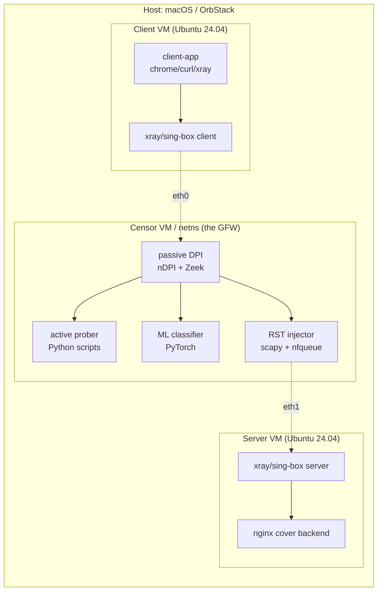
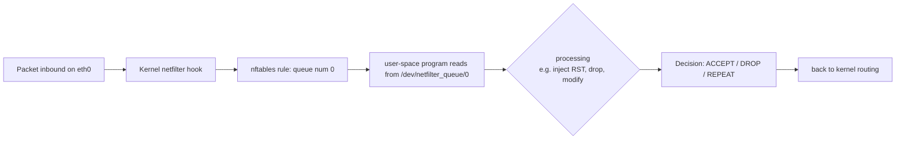

# 課堂 9.10 — 自建 GFW 模擬測試平台（一）：架構

## 學前知道
- 前置課：
  - [9.1 ~ 9.9](./) 全部 — 必須先理解 GFW 各能力，才能模擬它們
- 預計閱讀時間：**40 分鐘**
- 必讀工具：
  - **OrbStack**（macOS Apple Silicon）— Linux VM 與 container 管理
  - **Linux netns / veth / bridge** — network namespace 隔離
  - **tc**（traffic control）— packet loss / delay / rate-limit
  - **nftables** — modern iptables 替代
  - **nDPI / Zeek** — DPI 引擎
  - **PyTorch / scikit-learn** — ML 分類器

## 動機

到此為止我們對 GFW 的 9 大能力（DNS、IP block、SNI 過濾、TCP RST 注入、FET heuristic、QUIC SNI filter、active probing、TLS fingerprint、ML classifier）都做了 paper-level 解讀。**研究級的下一步：自建一個可控、可重現、可量測的 GFW-equivalent testbed**。

為什麼必須自建？
1. **在真實 GFW 上做實驗** 會 **燒掉 VPS IP**（被 block 數天）。
2. **真實 GFW 是黑盒**——你不知道 detection algorithm 內部 state，無法做 controlled experiment。
3. **無法 systematic vary parameters**——真實 GFW 不會配合你的實驗。
4. **學術倫理**——對國家級 censor 做 active 攻擊（如 spoofing prober）可能違反 ethics review。

自建 testbed 解決所有這四個問題。本堂課搭整體架構，9.11/9.12/9.13 逐項實作。

> **Failure framing**：testbed 是模擬，不是真實 GFW。它只能保證「**通過 testbed = 對所有我們已知的 detection 都過**」，不能保證「通過 testbed = 真實 GFW 也過」。真實 GFW 永遠有 unknown unknown。Testbed 是必要不充分條件。

---

## 核心概念

### 1. Topology 設計



**設計選擇說明**：

- **單機 + OrbStack VM**：用 macOS Apple Silicon 上 OrbStack（用戶配置）。3 個 Ubuntu VM（client / censor / server）共用一個 bridge。可在 Apple M-series 上跑 6+ VM。
- **替代方案**：3 個 Linux netns + veth pair（純 Linux 純 namespace）。Apple Silicon 上要先有一個 Linux VM 跑這個。OrbStack VM 內 nested netns 是 OK 的。
- **Censor VM 在中間** 作為 in-path：所有 client → server 流量必經。這實現 in-line capability（drop / modify）。
- **多 NIC**：censor VM 有兩個 NIC，一個對 client、一個對 server。便於分流量。

### 2. Censor VM 的內部模組

對應到 GFW 的 9 大能力：

| GFW 能力 | Testbed 實作 | 9.x 對應 lesson |
|---|---|---|
| DNS 污染 | dnsmasq with hosts file override + nftables NAT 截 53/UDP | 暫不深入（純 DNS 偽造） |
| IP blocklist | nftables `drop iif $client_iface ip daddr {...}` | 9.11 |
| SNI 過濾 | Zeek script + nfqueue → 注入 RST | 9.11 |
| TCP RST 注入 | scapy + nfqueue + raw socket | 9.11 |
| FET 5 規則 | Python script with scapy/nfq | 9.11 |
| QUIC SNI filter | quic-go parser + Python decryption | 9.11 |
| Active probing | Python scheduler + concurrent connect | 9.12 |
| TLS fingerprint | ja4-go + Python | 9.11 |
| ML classifier | PyTorch (DF) + Joy/FlowPrint | 9.13 |

### 3. 流量截獲：nfqueue 是核心

Linux nfqueue 讓 user-space program 處理 kernel 截獲的封包：



關鍵 setup（censor VM）：

```bash
# 啟用 IP forwarding
sysctl -w net.ipv4.ip_forward=1

# nftables: 把所有 forward 流量 queue 給 user-space
nft add table inet gfw
nft add chain inet gfw forward '{ type filter hook forward priority 0; }'
nft add rule inet gfw forward queue num 0 bypass
```

User-space program (Python with `python-nfqueue` or scapy):
```python
from netfilterqueue import NetfilterQueue
from scapy.all import IP, TCP, Raw

def callback(packet):
    pkt = IP(packet.get_payload())
    if pkt.haslayer(TCP) and pkt[TCP].dport == 443:
        # 分析 TLS / FET / etc.
        # 決策：accept / drop / inject RST
        if should_block(pkt):
            packet.drop()
            inject_rst(pkt)
        else:
            packet.accept()

nfq = NetfilterQueue()
nfq.bind(0, callback)
nfq.run()
```

**性能權衡**：nfqueue 是 user-space，吞吐量遠不如 line-rate。**對 testbed OK**（1-10 Mbps 流量足夠），對真實 GFW 不夠（需 XDP / eBPF）。

### 4. Traffic control：模擬 GFW 的 latency / loss

`tc` (traffic control) 在 censor VM 的 NIC 上：

```bash
# 對 client → server 路徑加 50 ms delay + 0.5% loss（模擬出國延遲）
tc qdisc add dev eth_to_server root netem delay 50ms 5ms loss 0.5%

# 對 UDP 加 5% loss（模擬 GFW UDP QoS）
tc qdisc add dev eth_to_server root handle 1: htb default 30
tc class add dev eth_to_server parent 1: classid 1:30 htb rate 100mbit
tc qdisc add dev eth_to_server parent 1:30 handle 30: netem loss 5%
tc filter add dev eth_to_server protocol ip parent 1: prio 1 u32 match ip protocol 17 0xff flowid 1:30
```

對 QUIC 流量加 5 % loss 是模擬中國 ISP 對 UDP 的 QoS 實況。

### 5. 抓包與資料管線

每個 experiment 必須記錄：
- Full packet traces (pcap).
- Censor decisions (which rule fired, what action).
- Application-layer outcome (did the request succeed?).

設計：

```
$testbed/runs/2026-05-16-exp001/
  client.pcap         # tcpdump on client VM
  server.pcap         # tcpdump on server VM
  censor.pcap         # tcpdump on censor middle (both directions)
  censor.log          # JSONL of every decision
  client.log          # application stdout
  server.log
  metadata.json       # experiment params
```

工具：
- `tcpdump -i any -w $out.pcap` 在每 VM 同時跑。
- `tshark` 後處理：filter, JSON export。
- 自寫 Python aggregator：merge censor.log + pcap 對應 flow。

### 6. 多協議受測對象

Testbed 必須能 host 多種 client/server combinations:

| Protocol | Server | Client | 9.x 使用 |
|---|---|---|---|
| Plain SS-libev | `ss-server` | `sslocal` | 9.11 baseline |
| SS-2022 | `ssserver-rust` | `sslocal-rust` | 9.11 |
| VMess | `xray-core` | `xray-core` | 9.11 |
| Trojan | `trojan-go` | `trojan-go` | 9.11 |
| VLESS+REALITY | `xray-core` | `xray-core` | 9.11–13 |
| Hysteria2 | `hysteria` | `hysteria` | 9.11 (UDP path) |
| TUIC v5 | `tuic` | `tuic` | 9.11 (UDP path) |
| Tor + obfs4 | `tor` | `obfs4proxy` | 9.12 active probing test |

每個都用 Docker container 包，每個 client/server 一個 image。

### 7. 自動化：`make` / `just` driven

```makefile
.PHONY: setup-testbed start-experiment teardown

setup-testbed:
	orb create ubuntu 24.04 gfw-client
	orb create ubuntu 24.04 gfw-censor
	orb create ubuntu 24.04 gfw-server
	./scripts/configure-network.sh

start-experiment-9.11-ss-fet:
	./scripts/run.sh --client ss-libev --server ss-libev \
	    --censor-rules fet-5rules \
	    --duration 60 \
	    --output runs/$$(date +%Y%m%d-%H%M%S)-ss-fet

# ... etc.
```

讓每個實驗都是 reproducible。

### 8. Performance considerations

- **OrbStack on M-series**: Apple Silicon 上每 VM 約 2-4 GB RAM、2-4 vCPU。3 VM 共佔 8-16 GB。M2 Air 8GB 可能緊；M3 Pro/Max 充足。
- **netfilter_queue throughput**: Python+nfqueue 約 50k pps / single CPU. 對 testbed 充足。
- **tcpdump**: 全 capture 對 10 Mbps 流量約 1.2 MB/s 寫盤 → 1 小時 4 GB；要 ~50 GB 自由空間。
- **Replay attack 與 deterministic timing**：用 `chrony` 對 3 VM time sync，否則 pcap 對齊困難。

### 9. 與 真實 GFW 的差距承認

Testbed **不能 100%** 模擬 GFW，原因：
1. **規模**：真實 GFW Tbps 級，testbed 10 Mbps 級。
2. **prober pool 規模**：真實 12k+ IP，testbed 1-2 個 source IP。
3. **未公開 algorithm**：真實 GFW 有 unknown features，testbed 只能 implement 已知。
4. **時序差異**：真實 GFW probe 延遲秒到分鐘，testbed 你可以瞬時觸發。

**Testbed 的作用**：對「**已知 detection 都過**」做 regression test。對 unknown unknown，無法處理——這需 real-world deployment + measurement (Phase III)。

### 10. 安全 isolation

Testbed VM 必須 **完全 isolated from real internet**：
- VM 互通用 host-only bridge，不 route 到 internet。
- 任何 active probing 邏輯 **絕不** 對 real 中國/Iran/Russia IP 發起。
- 把 `RFC 1918` 私網範圍當作 testbed 的 sandbox。

理由：你不希望 testbed 程式 bug 導致對真實 server 發起 probe；也不希望 testbed 流量 leak 進 ISP（誤觸 ISP 的 IDS）。

---

## 與我們協議設計的關聯

Testbed 是 Phase III evaluation 的核心 infra：

1. **Part 11 設計時** 用 testbed 跑「**candidate protocol vs current detector**」regression test。
2. **Part 12 實作完成後** 用 testbed 跑「**full protocol against all 9 GFW capabilities**」 systematic eval。
3. **Phase III deliverable** 包含 testbed 本身——一個 reproducible artifact for papers。

---

## 動手

**任務**：搭起 3-VM testbed 基本骨架。

### 步驟（順序執行）
1. OrbStack 建 3 個 Ubuntu 24.04 VM：`gfw-client`、`gfw-censor`、`gfw-server`。
2. 配置 network：
   - `gfw-client` 有一個 NIC 接 `bridge-cs`（client-side）。
   - `gfw-censor` 有兩個 NIC：`eth0` 接 `bridge-cs`、`eth1` 接 `bridge-sg`。
   - `gfw-server` 有一個 NIC 接 `bridge-sg`。
   - 在 censor VM 啟用 IP forwarding。
3. 在 client VM `ip route` 設 default gateway 為 censor VM 的 `eth0`。
4. 在 server VM `ip route` 設 default gateway 為 censor VM 的 `eth1`。
5. 從 client ping server → 應該通。
6. 在 censor VM 跑 `tcpdump -i any` → 應該看到 ICMP echo。
7. 在 3 VM 同時跑 `tcpdump -i any -w /tmp/$(hostname).pcap`。
8. Iperf3 from client to server → 確認 throughput。

### 設置好的 baseline 驗證
- Client → server ping latency: < 5 ms.
- Iperf3 throughput: > 100 Mbps（取決於 OrbStack）.
- Packet capture file size: 對應 ~iperf transferred data.

### Output
Place under `projects/testbed/v1/`:
- `README.md` — setup instructions.
- `scripts/network-setup.sh` — orbstack & netplan config.
- `scripts/teardown.sh`.
- 把 baseline test 的 pcap 存到 `runs/2026-05-baseline/`。

> ⚠️ 把 `runs/*` 加入 `.gitignore`（pcap 不 commit），但 keep `scripts/` 與 `README.md` 在 git。

---

## 自我檢查

1. 為何選 nfqueue 而非 XDP 來做 censor decisions？兩者的權衡是什麼？
2. 在 testbed 上「**模擬 GFW prober pool 12 k IP**」是否必要？如果不必要，simulation 上界是什麼？
3. 模擬 GFW 的 line-rate detection 對 testbed throughput 的影響是什麼？多大流量足夠檢驗 detection 邏輯？
4. 列出 5 個 testbed **無法** 模擬的 GFW 行為。對每一個，propose 一個 mitigation。
5. 為何 testbed 必須完全 air-gapped？舉一個 bug 場景，testbed leak 會造成什麼問題？
6. 你怎麼讓 testbed 的 reproducibility 可達 academic paper artifact 標準？

---

## 延伸閱讀

- Roskind, J. *Mininet* — academic network testbed，可借鑑
- POX / Ryu SDN controllers — testbed extension 方向
- DETER / DeterLab — 大學級網路 testbed
- Wails, R. et al. *Tegmine: A modular Internet censorship testbed.* 2024（最新 testbed 工作）

---

## 研究級補遺

### 1. 學界詞彙

| 中文 | 學界標準 |
|---|---|
| 網路測試平台 | **network testbed** |
| 流量截獲 | **traffic interception / NFQUEUE / XDP** |
| 隔離環境 | **sandbox / isolated network namespace** |
| 端對端可重現 | **end-to-end reproducibility / artifact evaluation** |

### 2. 對手分類學精化

Testbed 模擬對手 = subset of real GFW。具體列出：
- ✓ Passive byte-level heuristic
- ✓ SNI 過濾 (we can fully implement)
- ✓ TCP RST injection
- ✓ Active probing (simulated, limited source IP)
- ✓ ML classifier (we train our own)
- ✗ Real prober pool scale
- ✗ Unknown additional features in real GFW
- ✗ Real-world DNS infrastructure variations

### 3. 我們協議的座標

Testbed 是 Part 12 evaluation 的 backbone：
- Part 12.13 evaluation harness 用 testbed
- Part 12.15 抗審查評測 報告 全用 testbed
- Phase III deliverable 包含 testbed code

### 4. 必追資源

- OrbStack documentation
- mininet GitHub
- DETER documentation
- Censored Planet / OONI infrastructure (對比參考)

### 5. 開放問題

1. **Testbed → real 的 generalisation bound**：能否量化「passing testbed 對 real-world detection rate 的 upper bound」？
2. **Adversarial testbed design**: 對抗式自我更新——testbed 的 detector 也用 GA 自動演化變強，協議要 evolve 對抗。
3. **Multi-party testbed**: 多研究團隊共享 testbed instance、共享 prober logs。
