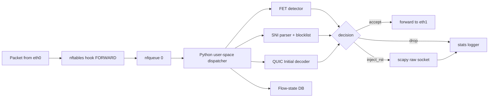

# 課堂 9.11 — 自建測試平台（二）：被動 DPI

## 學前知道
- 前置課：
  - [9.10 testbed 架構](./9.10-testbed-architecture.md)（必須先 setup 3-VM topology）
  - [9.7 FET detection](./9.7-fully-encrypted-traffic-detection.md)（5 規則 detector 邏輯）
  - [9.9 TLS fingerprint](./9.9-tls-fingerprinting.md)（JA4 calculation）
- 預計閱讀時間：**50 分鐘**
- 必讀工具：
  - **nDPI**: `https://github.com/ntop/nDPI` (open-source DPI library)
  - **Zeek**: `https://github.com/zeek/zeek` (network analysis framework + scripting)
  - **scapy** + **NetfilterQueue** (Python)
  - **eBPF / XDP** (進階；我們用 nfqueue 做 testbed 但提供 XDP 升級路徑說明)

## 動機

本堂在 9.10 的 testbed 上實作 **完整 passive DPI pipeline**：

1. **FET 5 規則** detector（[[wu-fep-detection]] 復現）
2. **SNI 黑名單** detector + RST 注入
3. **QUIC SNI** filter
4. **TLS fingerprint** (JA3/JA4) blocklist
5. **Flow assembly** for TCP segments

這套 stack 是 lesson 9.12（active probing simulation）的 **trigger 來源**，也是 9.13 ML classifier 的 **baseline 對照**。

> **Failure framing**：本堂用的 nDPI/Zeek 是工程級 detector，**不是真實 GFW 的 implementation**。真實 GFW 用什麼軟體未公開。我們的 testbed detector 是「**對 已知公開 detection technique 的最強復現**」，並非「對 真實 GFW 的 byte-exact 模擬」。

---

## 核心概念

### 1. Pipeline 架構



### 2. FET 5-rule detector 實作

從 lesson 9.7 的 Python sketch 升級為 stateful + nfqueue 整合：

```python
# detector_fet.py
import json, time
from netfilterqueue import NetfilterQueue
from scapy.all import IP, TCP, Raw

flow_state = {}  # {(src_ip, dst_ip, src_port, dst_port) -> 'new'|'seen_first'|'blocked'}
LOG = open("/var/log/censor/fet.jsonl", "a", buffering=1)

def popcount_mean(payload):
    return sum(bin(b).count("1") for b in payload) / max(1, len(payload))

def all_printable(b):
    return all(0x20 <= x <= 0x7e for x in b)

def max_printable_run(payload):
    best, cur = 0, 0
    for x in payload:
        if 0x20 <= x <= 0x7e:
            cur += 1; best = max(best, cur)
        else:
            cur = 0
    return best

def matches_protocol_prefix(payload):
    if len(payload) < 6: return False
    if payload[0] == 0x16 and payload[1] == 0x03 and payload[5] == 0x01: return True  # TLS CH
    for verb in (b"GET ", b"POST ", b"HEAD ", b"OPTIONS", b"PUT ", b"DELETE", b"CONNECT", b"PATCH ", b"TRACE "):
        if payload.startswith(verb): return True
    return False

def is_exempt(payload):
    exemptions = []
    p = popcount_mean(payload)
    if p <= 3.4 or p >= 4.6: exemptions.append("Ex1")
    if len(payload) >= 6 and all_printable(payload[:6]): exemptions.append("Ex2")
    if sum(1 for x in payload if 0x20 <= x <= 0x7e) / max(1, len(payload)) > 0.5: exemptions.append("Ex3")
    if max_printable_run(payload) > 20: exemptions.append("Ex4")
    if matches_protocol_prefix(payload): exemptions.append("Ex5")
    return exemptions

def handle(pkt_raw):
    pkt = IP(pkt_raw.get_payload())
    if not pkt.haslayer(TCP) or not pkt.haslayer(Raw):
        pkt_raw.accept(); return

    key = (pkt[IP].src, pkt[IP].dst, pkt[TCP].sport, pkt[TCP].dport)
    state = flow_state.get(key, "new")

    if state == "blocked":
        # residual 180s 內封鎖
        pkt_raw.drop(); return

    if state == "new":
        # 第一個 data segment
        payload = bytes(pkt[Raw])
        exempt = is_exempt(payload)
        decision = {
            "ts": time.time(),
            "flow": key,
            "payload_len": len(payload),
            "popcount_mean": popcount_mean(payload),
            "exemptions": exempt,
        }
        if not exempt:
            # FET 規則命中 → block with 26.3% probability
            import random
            if random.random() < 0.263:
                flow_state[key] = "blocked"
                # 180 秒後 expire（簡化版本：用 timer 或 lazy expire）
                decision["action"] = "blocked"
                LOG.write(json.dumps(decision) + "\n")
                pkt_raw.drop(); return
        flow_state[key] = "seen_first"
        decision["action"] = "passed"
        LOG.write(json.dumps(decision) + "\n")

    pkt_raw.accept()

nfq = NetfilterQueue()
nfq.bind(0, handle)
nfq.run()
```

**Testbed validation**：用 `curl https://example.com`（過 Ex5）、`echo "random" | nc server 443`（過 Ex3 prob.）、`ss-libev no-prefix`（無 exemption → blocked 26%）。

### 3. SNI 過濾 + RST 注入

TLS SNI 識別必須 **flow reassembly**——SNI 在 ClientHello extension 內、ClientHello 可能跨多 TCP segment（rare but real）。

```python
# detector_sni.py
import re
from scapy.all import IP, TCP, Raw, send

BLOCKLIST_SNI = {"forbidden.example", "censored.test"}

def parse_sni(tls_clienthello: bytes) -> str | None:
    # TLS Record: type(1) + ver(2) + len(2) + Handshake msg
    if len(tls_clienthello) < 5 or tls_clienthello[0] != 0x16:
        return None
    # Handshake msg: type(1) + len(3) + ClientHello body
    p = 5
    if tls_clienthello[p] != 0x01: return None  # not ClientHello
    p += 4
    # legacy_version(2) + random(32)
    p += 34
    # session_id length(1) + content
    sid_len = tls_clienthello[p]; p += 1 + sid_len
    # cipher_suites length(2) + content
    cs_len = int.from_bytes(tls_clienthello[p:p+2], "big"); p += 2 + cs_len
    # compression_methods length(1) + content
    cm_len = tls_clienthello[p]; p += 1 + cm_len
    # extensions length(2) + content
    ext_len = int.from_bytes(tls_clienthello[p:p+2], "big"); p += 2
    end = p + ext_len
    while p + 4 <= end:
        ext_type = int.from_bytes(tls_clienthello[p:p+2], "big"); p += 2
        ext_len2 = int.from_bytes(tls_clienthello[p:p+2], "big"); p += 2
        if ext_type == 0x0000:  # SNI
            # SNI list len(2) + entry: name_type(1) + name_len(2) + name
            sni_list_len = int.from_bytes(tls_clienthello[p:p+2], "big")
            name_type = tls_clienthello[p+2]
            name_len = int.from_bytes(tls_clienthello[p+3:p+5], "big")
            return tls_clienthello[p+5:p+5+name_len].decode("ascii", "ignore")
        p += ext_len2
    return None

def inject_rst(pkt: IP):
    rst = IP(src=pkt[IP].src, dst=pkt[IP].dst) / TCP(
        sport=pkt[TCP].sport, dport=pkt[TCP].dport,
        seq=pkt[TCP].seq + len(pkt[Raw].load), flags="R"
    )
    send(rst, verbose=0)
    rst_back = IP(src=pkt[IP].dst, dst=pkt[IP].src) / TCP(
        sport=pkt[TCP].dport, dport=pkt[TCP].sport,
        seq=pkt[TCP].ack, flags="R"
    )
    send(rst_back, verbose=0)
```

**注意**：scapy 的 raw socket 在 Linux 上需要 `CAP_NET_RAW` 或 root。Production censor 用更高效 lib（`libnet`、`eBPF`），testbed 用 scapy 即可。

### 4. QUIC SNI filter（簡化版）

```python
# detector_quic.py
from cryptography.hazmat.primitives.ciphers.aead import AESGCM
from cryptography.hazmat.primitives import hashes, hmac
from cryptography.hazmat.primitives.kdf.hkdf import HKDFExpand

INITIAL_SALT_V1 = bytes.fromhex("38762cf7f55934b34d179ae6a4c80cadccbb7f0a")

def hkdf_expand_label(secret, label, length):
    full_label = b"tls13 " + label.encode()
    info = len(full_label).to_bytes(1, "big") + full_label + b"\x00"
    info = length.to_bytes(2, "big") + info
    hkdf = HKDFExpand(algorithm=hashes.SHA256(), length=length, info=info)
    return hkdf.derive(secret)

def derive_client_initial(dcid: bytes):
    h = hmac.HMAC(INITIAL_SALT_V1, hashes.SHA256())
    h.update(dcid)
    initial_secret = h.finalize()
    client_initial = hkdf_expand_label(initial_secret, "client in", 32)
    key = hkdf_expand_label(client_initial, "quic key", 16)
    iv = hkdf_expand_label(client_initial, "quic iv", 12)
    hp = hkdf_expand_label(client_initial, "quic hp", 16)
    return key, iv, hp

def decrypt_initial(udp_payload: bytes) -> bytes | None:
    # 簡化：parse long header packet, extract DCID + protected payload
    # 完整 implementation 見 quic-go/internal/handshake
    ...
```

**完整 implementation 太長**，用 `aioquic` 或 `quic-go` 的 internal API 取代手寫。Testbed 用 Python `aioquic`:

```python
from aioquic.quic.packet import pull_quic_header
from aioquic.quic.connection import QuicConnection
...
```

實作主流程：
1. 從 UDP datagram 提取 first packet 的 QUIC header。
2. 若 long header type = Initial：derive keys、decrypt CRYPTO frame、parse TLS ClientHello、check SNI。
3. 若 SNI ∈ blocklist：drop 該 4-tuple 的所有後續 UDP。

### 5. TLS fingerprint detector

加 JA3 + JA4 計算到 SNI detector，並對 JA3/JA4 也維護 blocklist（用於識別罕見 mimicry tools）：

```python
def compute_ja3(tls_ch: bytes) -> str:
    # Parse: version, ciphers, extensions, curves, point_formats
    # Build string, MD5 hash
    ...

def compute_ja4(tls_ch: bytes) -> str:
    # Parse + sort ciphers/exts, SHA256-truncated
    ...

# 用 dpkt 或 cryptography.x509 解析方便
```

**Blocklist 來源**：可以從 `tlsfingerprint.io` API 拉 rare fingerprints。

### 6. Flow reassembly

對 SNI 而言通常 ClientHello 在一個 TCP segment 中，但 QUIC Initial 可跨 datagram；TLS over slow client 也可能 fragmented。Testbed 簡化版：

```python
flow_buffer = {}  # 4-tuple -> bytes

def assemble_segment(pkt):
    key = (pkt[IP].src, pkt[IP].dst, pkt[TCP].sport, pkt[TCP].dport)
    buf = flow_buffer.get(key, b"") + bytes(pkt[Raw])
    flow_buffer[key] = buf
    # Try parse TLS ClientHello
    sni = parse_sni(buf)
    if sni: return sni
    if len(buf) > 16384:  # buffer 限制
        flow_buffer.pop(key, None)
    return None
```

實務上**用 Zeek 寫 reassembly 更輕鬆**。

### 7. Zeek 部署

Zeek 比手寫 scapy 強大很多。安裝：

```bash
apt install zeek-lts
```

啟動：
```bash
zeek -i eth0 /etc/zeek/policy/local.zeek
```

`local.zeek` 加入 SNI block 規則：

```zeek
@load policy/protocols/ssl/log-hostcerts-only

global blocked_snis: set[string] = {"forbidden.example", "censored.test"};

event ssl_client_hello(c: connection, ...) {
    if ( c$ssl$server_name in blocked_snis ) {
        Log::write(GFW::LOG, [$ts=network_time(), $action="block_sni",
                              $sni=c$ssl$server_name, $cid=c$id]);
        # 注入 RST: 透過 nfqueue 通道或外部 helper
        ...
    }
}
```

Zeek script reference: `https://docs.zeek.org/en/master/scripting/index.html`。

### 8. nDPI 部署

nDPI 是 C 庫，用 `nDPI/example/ndpiReader` 即可離線分析 pcap。線上要 integrate 進 `pfring` 或自寫 stub。

```bash
# 編譯 nDPI
git clone https://github.com/ntop/nDPI; cd nDPI
./autogen.sh && make
# 分析 pcap
./example/ndpiReader -i trace.pcap -j /tmp/result.json
```

輸出每 flow 識別到的 protocol、TLS SNI、流量統計。

**對 testbed**：nDPI 用於 **離線分析** experiment 後的 pcap，產出 ground truth。Online inline DPI 用 nfqueue + 自寫 Python。

### 9. 整合：完整 censor stack

把 4 個 detector 整合成單一 dispatcher：

```python
# main_censor.py
def callback(pkt_raw):
    pkt = IP(pkt_raw.get_payload())

    # 0. residual blocking 檢查
    if is_residual_blocked(pkt): pkt_raw.drop(); return

    # 1. UDP path: QUIC
    if pkt.haslayer(UDP) and pkt[UDP].dport == 443:
        sni = try_decrypt_quic_sni(pkt)
        if sni and sni in QUIC_BLOCKLIST:
            mark_residual(pkt); pkt_raw.drop(); return
        pkt_raw.accept(); return

    # 2. TCP path
    if pkt.haslayer(TCP) and pkt.haslayer(Raw):
        payload = bytes(pkt[Raw])
        if pkt[TCP].dport == 443 or pkt[TCP].dport == 80:
            # TLS/HTTP path - check SNI / Host
            sni_or_host = parse_sni_or_host(payload)
            if sni_or_host and sni_or_host in HTTP_TLS_BLOCKLIST:
                inject_rst(pkt); mark_residual(pkt); pkt_raw.drop(); return
            # Also check TLS fingerprint
            if pkt[TCP].dport == 443:
                ja4 = compute_ja4(payload)
                if ja4 in JA4_BLOCKLIST:
                    inject_rst(pkt); mark_residual(pkt); pkt_raw.drop(); return
        # 3. FET 5-rule
        if is_first_segment(pkt):
            if not is_exempt(payload):
                if random.random() < 0.263:
                    mark_residual(pkt); pkt_raw.drop(); return
        pkt_raw.accept(); return

    pkt_raw.accept()
```

把這個跑在 censor VM 即得到 **單 VM 模擬 GFW 主要 passive capability**。

### 10. Performance benchmark

用 iperf3 from client to server，**without censor** vs **with censor stack running**：

| Setup | TCP throughput | UDP throughput | Notes |
|---|---|---|---|
| No censor | 1+ Gbps | 1+ Gbps | OrbStack baseline |
| Censor with nfq (Python) | 50-100 Mbps | 200-500 Mbps | Python GIL bottleneck |
| Censor with eBPF/XDP | 1+ Gbps | 1+ Gbps | 進階；不必為了 testbed 做 |

**結論**：testbed 跑 < 100 Mbps 流量足以驗證 detection 邏輯。Production-level performance（XDP/eBPF）留給 Phase III 進階 testbed iteration。

---

## 與我們協議設計的關聯

本堂 testbed 提供：

1. **Regression test platform**：每次協議改動跑「**對 all 4 passive detectors 是否 silent**」。
2. **Ground truth labeller**：對 Part 12 收集的真實 traffic 自動 label「是否 trigger 何種 detection」。
3. **Adversarial 訓練源**：把 testbed detector 當 GAN discriminator，協議改進為 generator。

---

## 動手

**Task A**：把 lesson 9.10 的 testbed 上的 `gfw-censor` 配上完整 passive stack。

1. 拷貝 sample `main_censor.py`（上述）到 `gfw-censor:/opt/censor/`。
2. Install: `apt install python3-pip && pip install scapy NetfilterQueue cryptography aioquic`.
3. nftables: `nft add rule inet gfw forward queue num 0 bypass`.
4. 啟動：`python3 /opt/censor/main_censor.py`.
5. From client VM:
   - `curl -k https://gfw-server.testnet/`（plain HTTP-over-TLS 應通過）.
   - `xray-client → vless+reality on gfw-server`（應通過）.
   - `ss-libev no-prefix → gfw-server`（應有 26.3% 機率被 block; 多試幾次）.

**Task B**：用 Zeek + nDPI 對 capture 做離線分析，對照 online censor 的決策。

1. 從 baseline run 拷 `censor.pcap` 到 host。
2. `ndpiReader -i censor.pcap -j /tmp/ndpi.json`.
3. `zeek -r censor.pcap`.
4. Diff online vs offline detection results；任何 disagreement 都是 bug 或 不確定性。

**Output**：`projects/testbed/v1/passive-dpi/`、`runs/2026-05-passive-eval/`。

---

## 自我檢查

1. 為何 testbed 用 Python+nfq 而真實 GFW 不可能用？兩者的 trade-off？
2. SNI 過濾要 TCP reassembly 才完美——你的實作是否處理多 segment ClientHello？怎麼測？
3. nDPI 與 Zeek 哪個更適合 **online inline detection**？哪個更適合 **離線 analysis**？為何？
4. 對 SS-libev no-prefix 流量，26.3% 機率 block——為何不 100%？真實 GFW 也是這個 prob，意味著什麼？
5. 你的 detector stack 對 VLESS+REALITY 應該返回什麼？實際測試結果是？
6. 對 Hysteria2 over QUIC：用什麼方式偵測它？你的 testbed 能識別嗎？

---

## 延伸閱讀

- nDPI 文檔：`https://www.ntop.org/products/deep-packet-inspection/ndpi/`
- Zeek 官方教學：`https://docs.zeek.org/en/master/`
- Linux Netfilter `nftables` wiki
- `aioquic` Python QUIC library

---

## 研究級補遺

### 1. 學界詞彙

| 中文 | 學界標準 |
|---|---|
| 流量重組 | **flow reassembly / stream reassembly** |
| 用戶空間封包處理 | **userspace packet processing (nfqueue)** |
| 核心級加速 | **kernel-level packet processing (XDP / eBPF)** |
| 線速偵測 | **line-rate / wire-speed detection** |

### 2. 我們協議的座標

- Part 12.13 evaluation harness 直接 reuse 本堂 stack
- Part 12.15 抗審查報告 用本堂 detector 跑 baseline

### 3. 開放問題

1. 真實 GFW 是否用 nDPI / Zeek 的衍生？無公開 evidence，但 plausibly yes（C 級工程庫）。
2. 我們的 testbed detection 多接近 real GFW 的 true performance？需要 paired measurement（real + testbed）才能 calibrate。
3. **Calibration set**: 收集 publicly 可用的「**GFW 真實已 block 的 traffic example**」並跑 testbed detector，看 disagreement。是 ongoing engineering task。
