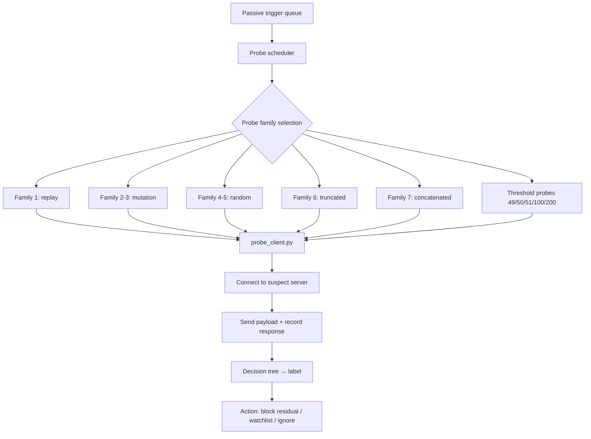

# 課堂 9.12 — 自建測試平台（三）：主動探測

## 學前知道
- 前置課：
  - [9.6 active probing](./9.6-active-probing-deep-dive.md)（probing pipeline 4 段）
  - [9.10–9.11 testbed](./9.10-testbed-architecture.md) → passive stack 已搭建
- 預計閱讀時間：**45 分鐘**
- 必讀論文：
  - [[ensafi-gfw-probing]] (IMC 2015) — probe family 設計
  - [[alice-bob-carol-ss-imc20]] (IMC 2020) — 7 probe families
  - [[frolov-probe-resistant-ndss20]] (NDSS 2020) — threshold-based probes
- 必讀工具：
  - **Python asyncio** — concurrent probe scheduler
  - **scapy** — raw probe payload construction

## 動機

Lesson 9.11 的 passive detector 把「**可疑 flow**」標記出來。lesson 9.12 把標記轉成 **active probe sequence**，模擬 GFW 的 confirmation 階段。

研究級目標：
1. 復現 [[alice-bob-carol-ss-imc20]] 的 7-family probing schedule。
2. 復現 [[frolov-probe-resistant-ndss20]] 的 threshold-based probing schedule。
3. 對 multi-protocol 受測對象（SS / VMess / Trojan / REALITY / Hysteria2 / Tor）做 systematic probing，記錄每個 protocol 的 fingerprint。
4. 為 lesson 9.13 提供 ground truth：哪些 protocol 在 testbed 上 active-probing 能/不能識別。

> **Failure framing**：本堂的 probe scheduler 是 simplified version——真實 GFW 的 scheduler 跟 passive trigger 的耦合可能更複雜（多模態 trigger、delay distribution、retry policy）。我們把可重現性放在首位。

---

## 核心概念

### 1. Probe scheduler 架構



### 2. Trigger pipeline

當 passive detector（9.11）偵測到 FET trigger，把 `(suspect_ip, suspect_port, captured_first_segment)` 放入 probe queue：

```python
# triggers.py (在 9.11 detector 內擴展)
import queue
PROBE_QUEUE = queue.Queue()

def on_fet_trigger(flow_key, payload):
    PROBE_QUEUE.put({
        "ts": time.time(),
        "target_ip": flow_key[1],
        "target_port": flow_key[3],
        "captured_payload": payload,
        "trigger_reason": "fet_no_exemption",
    })
```

Probe scheduler 從 queue 拉並排程 probes：

```python
# probe_scheduler.py
import asyncio, random
from typing import Coroutine

async def schedule_probes(target):
    # 隨機 jitter 延遲 1-30 秒
    await asyncio.sleep(random.uniform(1, 30))

    # 7-family probes (Alice et al.)
    payload = target["captured_payload"]
    families = build_7_families(payload)

    # 額外 threshold probes (Frolov et al.)
    families += build_threshold_probes(target["target_ip"], target["target_port"])

    results = []
    for fam in families:
        res = await probe_once(target["target_ip"], target["target_port"], fam)
        results.append(res)
        await asyncio.sleep(random.uniform(0.5, 2))  # 避免 burst

    # 決策
    label = classify_from_responses(results)
    log_decision(target, label, results)

    if label == "PROXY":
        add_to_residual_blocklist(target["target_ip"], target["target_port"])
```

### 3. 7 probe families 建構

對應 [[alice-bob-carol-ss-imc20]] §4：

```python
def build_7_families(captured: bytes) -> list[dict]:
    fams = []
    # Family 1: verbatim replay
    fams.append({"name": "F1-replay", "payload": captured})
    # Family 2: single-byte mutation at offset 0
    p = bytearray(captured); p[0] ^= 0xff
    fams.append({"name": "F2-mut1", "payload": bytes(p)})
    # Family 3: multi-byte mutation
    p = bytearray(captured)
    for off in range(0, min(12, len(p))): p[off] ^= 0xa5
    fams.append({"name": "F3-mut12", "payload": bytes(p)})
    # Family 4: random 221 bytes
    fams.append({"name": "F4-rand221", "payload": random_bytes(221)})
    # Family 5: random length-matched
    fams.append({"name": "F5-randmatch", "payload": random_bytes(len(captured))})
    # Family 6: truncated replay
    fams.append({"name": "F6-trunc", "payload": captured[:len(captured)//2]})
    # Family 7: concatenated
    fams.append({"name": "F7-concat", "payload": captured + captured})
    return fams
```

### 4. Threshold probes

對應 [[frolov-probe-resistant-ndss20]]：

```python
def build_threshold_probes(ip, port) -> list[dict]:
    sizes = [49, 50, 51, 64, 100, 150, 200, 256, 384]
    probes = []
    for sz in sizes:
        probes.append({"name": f"thresh-{sz}", "payload": random_bytes(sz)})
    # TLS-like probe
    probes.append({"name": "tls-ch-fake", "payload": fake_tls_ch()})
    # HTTP probe
    probes.append({"name": "http-get", "payload": b"GET / HTTP/1.1\r\nHost: test\r\n\r\n"})
    # SSH banner
    probes.append({"name": "ssh-banner", "payload": b"SSH-2.0-OpenSSH_8.9p1\r\n"})
    return probes
```

### 5. Probe execution

```python
async def probe_once(ip, port, family) -> dict:
    start = time.time()
    try:
        reader, writer = await asyncio.wait_for(
            asyncio.open_connection(ip, port), timeout=5)
        writer.write(family["payload"])
        await writer.drain()
        # 等 response，up to 30s
        try:
            response = await asyncio.wait_for(reader.read(4096), timeout=30)
        except asyncio.TimeoutError:
            response = None
        # 觀察 close behavior
        close_kind = await observe_close(reader, writer)
        writer.close()
        await writer.wait_closed()
        return {
            "family": family["name"],
            "elapsed": time.time() - start,
            "response_len": len(response) if response else 0,
            "response_first16": response[:16].hex() if response else None,
            "close_kind": close_kind,  # 'fin' / 'rst' / 'timeout' / 'data'
        }
    except Exception as e:
        return {"family": family["name"], "error": str(e), "elapsed": time.time() - start}
```

`observe_close` 需要 raw socket 才能精確區分 FIN / RST，標準 Python socket API 給不出。用 `pyroute2` 或直接 raw socket。

### 6. 決策樹 from responses

```python
def classify_from_responses(results) -> str:
    # 簡化決策樹
    fams = {r["family"]: r for r in results}

    # 真實 web server：應該對 http-get 回應 200/400/404 (Status line)
    if "http-get" in fams and fams["http-get"].get("response_first16", "").startswith(b"HTTP".hex()):
        return "WEB_SERVER"

    # 真實 SSH server：應該 banner-on-connect
    if "ssh-banner" in fams and fams["ssh-banner"].get("response_len", 0) > 0:
        return "SSH"

    # 對 7 family 全部 silent + threshold probes 也 silent → 可能 SS-AEAD-silent-hold
    silent_count = sum(1 for r in results if r.get("response_len", 0) == 0)
    if silent_count >= len(results) * 0.9:
        return "PROBE_RESISTANT_PROXY"

    # 49/50/51 byte threshold behavior
    if has_obfs4_threshold_signature(results):
        return "OBFS4"

    # MTProto - 永遠 hold socket
    if all(r.get("close_kind") == "timeout" for r in results):
        return "MTPROTO_LIKE"

    return "UNKNOWN"
```

### 7. 多 source IP simulation

真實 GFW prober pool 有 12k+ IP。testbed 上：

- 給 `gfw-censor` VM 多 alias IP：`ip addr add 10.0.0.{10..50}/24 dev eth1`.
- Probe 時隨機選 source IP（用 `socket.SO_BINDTODEVICE` 或顯式 `bind`）.

50 alias IP 對 testbed 已 sufficient。**注意**：50 IP 跟 12k IP 不同 magnitude，但對 detection logic 驗證 sufficient。

### 8. Probing 對 testbed protocol matrix 的結果預期

對以下受測 server，跑完整 probe schedule，預期結果：

| Server | F1-F7 響應 | Threshold 響應 | 決策 |
|---|---|---|---|
| nginx HTTPS | F1 一般 fail, F5 ≈ TLS alert | http-get → 200 | WEB_SERVER |
| SS-libev no-prefix | 全 silent (silent-hold) | 全 silent | PROBE_RESISTANT_PROXY |
| SS-2022 HTTP prefix | F1 silent (auth fail), HTTP-get 視 fallback 設定 | thresh 過 prefix 不命中 → silent | AMBIGUOUS |
| Trojan-go w/ nginx fallback | F1 silent (auth fail), HTTP-get → 200 (via nginx) | thresh → nginx 視 server policy | WEB_SERVER（被 fallback 正確處理）|
| VLESS+REALITY w/ cf.com fallback | F1 silent (auth fail), HTTP-get → real cloudflare 回應 | thresh → cf | WEB_SERVER（完美 fallback）|
| Hysteria2 over QUIC | TCP 都 closed (純 UDP 服務) | TCP 都 closed | NOT_TCP_SERVER |
| Tor + obfs4 | 全 silent + 49/50/51 threshold signature 顯露 | thresh → obfs4 sig | OBFS4 |
| MTProto Telegram | 全 hold，never close | 全 timeout | MTPROTO_LIKE |

**這個 matrix 是 lesson 9.13 ML classifier 的 ground truth source**。

### 9. Replay timing 與 stealth

真實 GFW prober 有 distribution：被動觸發後 0.5 sec 到 60 sec 內第一個 probe；retry policy 不明。

Testbed 模擬：
- First probe delay: `uniform(1, 30)` 秒.
- Probe spacing: `uniform(0.5, 2)` 秒.
- Retry after 24h（模擬定期 re-confirm）.

加 jitter 是為了讓被測 server 不能用「探測時間相對固定」反向識別 testbed。

### 10. Logging schema

```jsonl
{"ts":..., "target_ip":..., "target_port":..., "source_ip":...,
 "family":"F1-replay", "elapsed":..., "response_len":..., "response_first16":...,
 "close_kind":"fin","decision":"PROXY","reason":"all silent + threshold sig"}
```

每行 1 個 probe。一個 target 跑 ~20 probes，產生 20 行。Tools downstream（lesson 9.13）會把這聚合成 `(target, decision, confidence)`。

---

## 與我們協議設計的關聯

本堂 probing simulator 是 **協議 fall-back validation 的核心 tool**：

1. **Part 11 protocol 設計時** 用本 simulator 驗證 server 對所有 7 family + threshold probes 的回應 = cover server bit-exact。
2. **Part 12 實作完成後** 跑「**100 個 probe sequence 對 1000 個 client connection」regression**，任何 anomaly 都是 bug。

---

## 動手

**Task**：建好 active prober。

1. 把 sample `probe_scheduler.py` + `prober.py` 放到 `gfw-censor:/opt/prober/`.
2. 從 9.11 detector 加上 trigger queue 寫入。
3. 啟動 `python3 /opt/prober/probe_scheduler.py`.
4. 在 `gfw-server` 跑 SS-libev no-prefix server，從 client 觸發 → 預期看到 trigger fire + probes 發出。
5. 在 server VM `tcpdump -i eth1` 抓到 prober 的 connect attempt。
6. 重複對 8 個 protocol 跑，記錄 decision matrix。

**進階**：
- 加 mutated probe（half replay + half random）測試 mid-protocol edge cases。
- 模擬 GFW 的 multi-stage probing（先發 thresh-50，再依結果發 F1）。

Output：`runs/2026-05-active-probe-matrix/RESULTS.md`，含 8 protocol × 20 probe = 160 cell decision matrix。

---

## 自我檢查

1. Probe scheduler 為何要有 jitter？沒 jitter 的 detection 風險是什麼？
2. Threshold probe 49/50/51 對 SS-AEAD silent-hold 有效嗎？對 obfs4 又如何？
3. 對 VLESS+REALITY 跑 F1（replay）一次後 server 是否會「**記得**」這個 source IP 並改變後續行為？描述 REALITY server 設計上 `is_session_tracked` 的處理。
4. Multi-source IP 是模擬 prober pool 的「**規模**」維度；testbed 上 50 IP 是否足以驗證 detection 邏輯？哪些 detection logic 對 source IP 數量 sensitive？
5. 設計：用本堂 simulator 對你自己的 VLESS+REALITY production 設定做 audit（用 disposable instance），列出可能 leaked signature。

---

## 延伸閱讀

- Alice et al. IMC 2020 §4-5 (probe schedule 細節)
- Frolov, Wampler, Wustrow NDSS 2020 §4 (threshold probe decision tree)
- Ensafi et al. IMC 2015 §3 (Tor probing schedule)
- Bock et al. *Detecting Probing-resistant Proxies in Practice.* FOCI 2020 (operationalisation insights)

---

## 研究級補遺

### 1. 學界詞彙

| 中文 | 學界標準 |
|---|---|
| 主動探測排程 | **probe scheduler** |
| 抗探測協議 | **probe-resistant protocol** |
| 殘留封鎖 | **residual censorship** |
| 多源 IP | **source-IP diversity** |

### 2. 對手分類學精化

GFW 的 active probing budget 在 testbed simulator 上：
- 1 trigger → 7 families × 重試 3 次 = 21 probes per target.
- 加 10 threshold + 5 fingerprint = 36 probes per target.
- 對 10000 suspect target 每天 = 360k probes/day.
- 真實 GFW 估計 budget 是 testbed 的 100×。

### 3. 形式化定義

定義 **probe-resistance against schedule S**：

協議 $\Pi$ 是 $(S, \epsilon)$-probe-resistant against schedule $S$ iff：

$$
\Pr[\text{classify\_from\_responses}(\Pi, S) = \text{PROXY}] \leq \epsilon + \Pr[\text{classify}(\text{Cover}, S) = \text{PROXY}]
$$

REALITY 對 schedule $S = $ Alice 7-family + Frolov threshold + http-get + ssh-banner: 實證 $\epsilon \approx 0.05$（部分 probe 仍有 timing leak）。

### 4. 我們協議的座標

- Part 11.5 server fallback design 用本 simulator 做 unit test。
- Part 12 evaluation 用本 simulator 做 acceptance criteria。

### 5. 開放問題

1. **Adaptive prober**：probe 結果反饋 driven 動態調整下個 probe。Geneva-style GA on probes。
2. **Real GFW probe 與 testbed probe 的相對 strength**：未測。
3. **Multi-trigger flow correlation**：對 single suspect target 多次觸發後，GFW 是否升級 probing？無公開 data。
