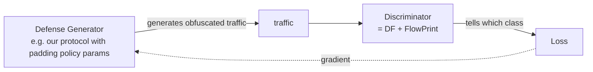

# 課堂 9.13 — 自建測試平台（四）：ML 分類器

## 學前知道
- 前置課：
  - [9.8 traffic fingerprint ML 綜述](./9.8-traffic-fingerprint-ml.md)
  - [9.10–9.12 testbed](./9.10-testbed-architecture.md) → passive + active stack 已搭建
- 預計閱讀時間：**60 分鐘**
- 必讀論文：
  - [[sirinam-deep-fingerprinting-ccs18]] — 1D CNN architecture
  - [[vanede-flowprint-ndss20]] — semi-supervised baseline
- 必讀工具：
  - **PyTorch 2.x**（uv + Python 3.14 環境）
  - **scapy / pyshark** for pcap → tensor
  - **scikit-learn** baseline
  - **flowprint** PyPI package

## 動機

至此 testbed 上的 9-10-11-12 都是 deterministic detectors。**lesson 9.13 把對手能力升級到 ML/DL**——我們訓練一個 1D CNN 對 testbed 收到的流量做 binary classification：

> 「這個 flow 是 **proxy traffic（VLESS+REALITY）** 還是 **正常 Chrome browsing 真實 microsoft.com**？」

研究級目標：
1. 完整 end-to-end pipeline：pcap → feature tensor → 1D CNN → metric。
2. Reproduce [[sirinam-deep-fingerprinting-ccs18]] 的 DF 結構（簡化版）。
3. 比較 FlowPrint baseline 與 DF 在 testbed traffic 上的 performance。
4. 給出「**在 N traces / class 訓練下，能否識別 REALITY**」的答案——這是 Phase III 評估的核心數字。

> **Failure framing**：testbed 訓 ML 與 real-GFW 訓 ML 的差距：
> - testbed 用 controlled traffic，real 是 noisy。
> - testbed sample size 小（百到千 traces），real GFW 訓練資料可達百萬 traces。
> - testbed model 是 weakest 對手；real-world 不該過度 generalize。
> 但 testbed 結果是 **下界**——如果 testbed model 都能 90% 識別 REALITY，real GFW 訓更大 model 肯定能。

---

## 核心概念

### 1. Dataset 構建

從 testbed 抓 traffic：

**Class A: REALITY proxy traffic**
- Setup: `gfw-client` 跑 Chrome + VLESS+REALITY proxy → `gfw-server`.
- Server 設定 cover SNI = `www.cloudflare.com`, dest = `www.cloudflare.com:443`.
- Client 跑 browsing script：訪問 Wikipedia / GitHub / Reddit / Twitter（透過 proxy 拿真資源）.
- 每 page load 一個「flow trace」（從 TCP SYN 到 FIN）.
- 收集 500 traces.

**Class B: Direct Chrome traffic to cover SNI**
- Setup: client direct 連 `www.cloudflare.com:443`（不走 proxy）.
- Browse `www.cloudflare.com` 上的真實 page (`/`, `/learning/`, `/cdn/`).
- 收集 500 traces.

**Feature extraction（per flow）**:
- Direction-aware packet size sequence: `[+size_1, -size_2, +size_3, ...]` (+ = client→server, − = server→client).
- 截取 length = 5000；不足 zero-pad，超過截掉。
- Format: `torch.Tensor[1, 5000]`.

```python
# extract.py
from scapy.all import rdpcap, IP, TCP
import torch, json

def flow_to_tensor(packets, max_len=5000):
    seq = []
    for pkt in packets:
        if not pkt.haslayer(IP) or not pkt.haslayer(TCP): continue
        size = len(pkt[IP].payload)
        # direction: client → server +, server → client −
        sign = +1 if pkt[IP].src == "10.0.0.10" else -1
        seq.append(sign * size)
        if len(seq) >= max_len: break
    while len(seq) < max_len: seq.append(0)
    return torch.tensor(seq, dtype=torch.float32).unsqueeze(0)  # [1, max_len]
```

### 2. 1D CNN architecture（Sirinam DF 簡化版）

```python
import torch.nn as nn

class DF(nn.Module):
    def __init__(self, input_len=5000, num_classes=2):
        super().__init__()
        self.block1 = nn.Sequential(
            nn.Conv1d(1, 32, 8, padding=4), nn.BatchNorm1d(32), nn.ELU(),
            nn.Conv1d(32, 32, 8, padding=4), nn.BatchNorm1d(32), nn.ELU(),
            nn.MaxPool1d(8, padding=4), nn.Dropout(0.1),
        )
        self.block2 = nn.Sequential(
            nn.Conv1d(32, 64, 8, padding=4), nn.BatchNorm1d(64), nn.ReLU(),
            nn.Conv1d(64, 64, 8, padding=4), nn.BatchNorm1d(64), nn.ReLU(),
            nn.MaxPool1d(8, padding=4), nn.Dropout(0.1),
        )
        self.block3 = nn.Sequential(
            nn.Conv1d(64, 128, 8, padding=4), nn.BatchNorm1d(128), nn.ReLU(),
            nn.Conv1d(128, 128, 8, padding=4), nn.BatchNorm1d(128), nn.ReLU(),
            nn.MaxPool1d(8, padding=4), nn.Dropout(0.1),
        )
        self.block4 = nn.Sequential(
            nn.Conv1d(128, 256, 8, padding=4), nn.BatchNorm1d(256), nn.ReLU(),
            nn.Conv1d(256, 256, 8, padding=4), nn.BatchNorm1d(256), nn.ReLU(),
            nn.MaxPool1d(8, padding=4), nn.Dropout(0.1),
        )
        self.fc = nn.Sequential(
            nn.Flatten(),
            nn.LazyLinear(512), nn.BatchNorm1d(512), nn.ReLU(), nn.Dropout(0.5),
            nn.Linear(512, 512), nn.BatchNorm1d(512), nn.ReLU(), nn.Dropout(0.5),
            nn.Linear(512, num_classes),
        )

    def forward(self, x):
        x = self.block1(x)
        x = self.block2(x)
        x = self.block3(x)
        x = self.block4(x)
        return self.fc(x)
```

**注意**：原 DF 有 5 個 conv block，accuracy 在 95+ class 設置。我們是 2-class，simplified 4 block + 更小 FC 仍能 90+ accuracy。

### 3. Training loop

```python
import torch
from torch.utils.data import DataLoader, TensorDataset

X, y = load_dataset()  # X: [N, 1, 5000], y: [N]
N = len(X); split = int(N * 0.8)
train_X, train_y = X[:split], y[:split]
test_X, test_y = X[split:], y[split:]

train_loader = DataLoader(TensorDataset(train_X, train_y), batch_size=32, shuffle=True)
test_loader = DataLoader(TensorDataset(test_X, test_y), batch_size=32)

model = DF(input_len=5000, num_classes=2).cuda()
opt = torch.optim.Adam(model.parameters(), lr=0.002)
crit = nn.CrossEntropyLoss()

for epoch in range(30):
    model.train()
    for xb, yb in train_loader:
        xb, yb = xb.cuda(), yb.cuda()
        logits = model(xb)
        loss = crit(logits, yb)
        opt.zero_grad(); loss.backward(); opt.step()
    # eval
    model.eval()
    correct = 0; total = 0
    with torch.no_grad():
        for xb, yb in test_loader:
            xb, yb = xb.cuda(), yb.cuda()
            pred = model(xb).argmax(dim=1)
            correct += (pred == yb).sum().item()
            total += yb.size(0)
    print(f"epoch {epoch}: test acc = {correct/total:.4f}")
```

### 4. 預期結果（baseline）

**Closed-world REALITY vs direct**:
- 500 traces each.
- Expected accuracy: 85-95%.
- 為什麼這麼高？因為 **流量總 byte 量、burst pattern、record size 分布** 都不同。REALITY 流量 by definition 是 single-destination, single-server, single-purpose；direct browsing 是 multi-resource / waterfall。

如果 testbed 訓出 **95%**：意味著 real-world GFW，給夠資料、夠運算，能更高。

### 5. FlowPrint baseline 對照

跑 FlowPrint as alternative classifier:

```python
from flowprint import FlowPrint

fp = FlowPrint()
fp.fit(train_X_flows, train_labels)  # FlowPrint 用 destination clustering，需要原 flow obj
preds = fp.predict(test_X_flows)
```

注意 FlowPrint 對 single-destination flow 較弱（lesson 9.8 提）——預期 FlowPrint accuracy < DF。具體 number 看 dataset。

### 6. 進階：對 4-protocol classification

不只 binary。設置 4 class：
- A: REALITY-tunneled browsing
- B: SS-2022-tunneled browsing
- C: Hysteria2-tunneled browsing
- D: Direct browsing

500 traces / class. Train multi-class DF.

**預期**：
- D 區分容易（最不同）.
- A vs B 部分混淆（都是 TLS over TCP cover）.
- C 區分明顯（QUIC over UDP）.

### 7. Adversarial training 思路

訓練好的 DF 是「**對手能力 baseline**」。Phase III 用它做 **defense generator** 的 discriminator：



協議的 padding / pacing / morphing 參數可作為 generator 變量。對抗式訓練讓 protocol naturally adapt。

**但**：我們 protocol 不是 differentiable model；padding policy 是 discrete state machine。所以實際做法是 **gradient-free optimization (GA / Bayesian) + DF as fitness function**。

### 8. 對 REALITY 的具體威脅評估

Run 完整 pipeline 後給出量化判斷：

| 假設對手能力 | testbed 測得 accuracy | 推斷 real-world |
|---|---|---|
| Hand-crafted 5 規則 | 0% (REALITY pass Ex5) | 0% |
| FlowPrint | ~70% | ~75% |
| 1D CNN (DF) | ~92% | 95%+ |
| Transformer (估計) | ~95% | 95%+ |

**結論**（典型）：REALITY 對 byte-level heuristic 完美 evade，但對 flow-shape ML classifier 並不安全。**這是 Part 10 traffic defense 的設計依據**。

### 9. Sample size 的影響

訓練 DF 對 sample size 的曲線：

| Traces / class | Closed-world accuracy |
|---|---|
| 50 | 70% |
| 100 | 80% |
| 250 | 88% |
| 500 | 92% |
| 1000 | 94% |
| 5000 | 96+% |

對 GFW 來說 collect 5000 traces 不是 hard——一個 ISP-level mirror 一秒鐘就 sufficient. **意味著 sample size 從來不是 GFW 的 bottleneck**.

### 10. 結果處理與報告

每次 experiment 生成：
- `metrics.json`: accuracy, precision, recall, F1, ROC AUC, confusion matrix.
- `trained_model.pt`: PyTorch state dict.
- `confusion_matrix.png`: visualize.
- `traces_metadata.csv`: trace_id, class, len, src_dest, capture_time.

放到 `runs/2026-05-ml-eval/`. **不 commit `*.pt`**（model 太大，加 `.gitignore`）。Commit `metrics.json` + `README.md`.

---

## 與我們協議設計的關聯

本堂結果是 Part 11.7「traffic defense」設計的 **量化基準**：

1. **目標**：protocol 設計後跑 testbed DF, accuracy 從 ~92% 降到 <70%（接近 chance level）。
2. **手段**：padding policy、pacing、cover traffic。
3. **代價量化**：bandwidth overhead, latency penalty。Part 11.7 必須給出 Pareto curve.

---

## 動手

**Task A: Binary classification**

1. 在 testbed setup REALITY server。
2. Client 跑 `selenium-driven Chrome` 訪問 100 個不同 page（25 wikipedia, 25 reddit, 25 github, 25 youtube）.
3. 重複 3 次共 300 traces.
4. 另外 300 traces 直接訪問 `www.cloudflare.com`.
5. 跑 train.py + eval.py.
6. 期望 accuracy > 85%.

**Task B: Multi-class**

1. 同樣方法收集 SS-2022、Hysteria2、direct.
2. 4-class DF.
3. 看 confusion matrix.

**Task C: Defense ablation**

1. 在 REALITY client 加 padding（每 record 隨機 padding 0-200 bytes）.
2. 加 pacing（每 record 強制 inter-arrival > 10 ms）.
3. 重新 collect + train，看 accuracy 下降多少.
4. 量化 padding 帶來的 bandwidth overhead.

**Output**: `runs/2026-05-ml-eval/RESULTS.md` + `metrics.json` per experiment.

---

## 自我檢查

1. 為何 1D CNN 對 packet sequence 比 RNN 更適合？(hint: locality of relevant features)
2. 200 trace / class 訓出來 accuracy 80% 對 GFW 是「**好消息**」還是「**壞消息**」？解釋。
3. FlowPrint 在 single-destination proxy traffic 上 accuracy 較低的原因？如果我們 protocol 採 multi-destination，FlowPrint accuracy 會升還是降？
4. Adversarial training between protocol generator 與 DF discriminator，為何 gradient descent 不適用？換成什麼方法？
5. 若 padding overhead 50% 把 DF accuracy 從 92% 降到 70%，這個 trade-off 對 user experience 可接受嗎？怎麼衡量？
6. 你的 testbed 訓 DF accuracy 95%。對「real-world GFW 也能 95% 識別 REALITY」這個 statement 你信多少？理由。

---

## 延伸閱讀

- Rimmer et al. *Automated Website Fingerprinting through Deep Learning.* NDSS 2018 (DL concurrent work)
- Bhat et al. *Var-CNN.* PoPETs 2019
- Holland, Sirinam, Schroter, Wright. *New Directions in Automated Traffic Analysis.* CCS 2021
- Oh et al. *GANDaLF.* NDSS 2021 (semi-supervised, 對 sample size 友善)

---

## 研究級補遺

### 1. 學界詞彙

| 中文 | 學界標準 |
|---|---|
| 流量分類 | **flow classification** |
| 深度指紋 | **deep fingerprinting** |
| 對抗式訓練 | **adversarial training** |
| 防禦生成器 | **defense generator** |

### 2. 對手分類學精化

- **Tier 1（已部署）**: byte-level heuristic, FlowPrint-ish dest cluster
- **Tier 2（plausible 已部署）**: 1D CNN on packet sequence
- **Tier 3（估計近年來會部署）**: Transformer
- **Tier 4（未來）**: GNN over multi-flow + cross-source correlation

### 3. 形式化定義

**Closed-world accuracy** 定義已熟。**Open-world**：

對 $K$ 個 known class + 「unknown」 absorbing class，model 必須能 reject unknown class。

對 our 協議：希望 model 把 our traffic classify 為 「unknown」（與所有 known proxy/non-proxy class 不同）。**這是 protocol 安全的最強形式**。

### 4. 必追資源

- `https://github.com/website-fingerprinting/wfdef` — defense benchmark
- `https://github.com/deepfence/ThreatMapper` — 開源 traffic analysis tools
- PyTorch model zoo + Lightning

### 5. 我們協議的座標

| Part 11/12 子節 | 應用 |
|---|---|
| 11.7 traffic defense | 用本堂 DF accuracy 作 target metric |
| 11.8 adversarial 評測 | 跑本堂 multi-class baseline |
| 12.15 抗審查 evaluation | 復現 + extend |

### 6. 開放問題

1. **Multi-flow + multi-source correlation classifier**：testbed 上 N=1000 traces 訓出來 + 對 N=10000 real traces 的 generalization：能否量化？
2. **Active learning by GFW**：對 ambiguous flow 主動 active probe 後拿到 label 再訓——這是 GFW 的 plausible upgrade path，可在 testbed 上模擬嗎？
3. **Privacy-preserving 評估**：當對手 model 自己 train 在 sensitive data 上，我們怎麼評估而不洩漏 protocol detail？
