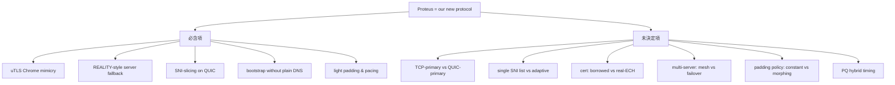

# 課堂 9.14 — GFW 給我們的啟示：威脅模型 + 對 Part 11 的設計約束

## 學前知道
- 前置課：[9.1–9.13](./)（必須通讀，本堂是整合）
- 預計閱讀時間：**45 分鐘**
- 本堂目的：把 Part 9 整段 13 堂課的觀察整合成一個 **可寫進 Part 11 spec 的 「攻擊面 × 防禦設計」對應表**，並把它 carry forward 到 Phase III。

## 動機

Part 9 1300 KB+ 內容 + 多篇 paper precis，要凝聚到一個 actionable artifact。本堂提供：

1. **完整威脅模型**：把 GFW 與 Iran / Russia / 其他 censor 抽象成一個正式 adversary specification。
2. **攻擊面總清單**：每個被觀察到的 detection technique 列出來，標 severity + likelihood。
3. **設計約束矩陣**：對每個攻擊面對應一個或多個 protocol-level 防禦機制。
4. **Proteus 設計空間**：我們新協議的 design space 已被 Part 9 收窄到具體 sub-space，本堂把它劃出來。

> **Failure framing**：本堂的結論不是「**完美的協議設計**」，而是「**對 2026-05 已知 GFW 能力的最佳防禦**」。Real-world deployment 一定會遇到 unknown unknown。我們的 protocol 必須有 **graceful degradation** 與 **fast iteration** path。

---

## 核心概念

### 1. 完整威脅模型（formal）

**對手 $\mathcal{A}$**:

```
Adversary capability set C(t) at time t:

C.passive = {
    byte-level heuristic (FET 5 rules, λ_byte = 1.0),
    SNI parsing (TCP TLS / QUIC Initial, λ_sni = 1.0),
    flow assembly (limited; first segment only as of 2026, λ_assembly = 0.5),
    TLS fingerprint (JA3/JA4, λ_fp = 0.8),
    IP-ASN cross-reference (λ_cross = 0.7),
    statistical traffic shape (size, IAT, burst; λ_stat = 0.6),
    DL classifier on packet sequence (1D CNN level; λ_dl = 0.7 estimated),
}

C.active = {
    7-family probe (Alice et al.; λ_7f = 1.0),
    threshold probe (Frolov; λ_thr = 1.0),
    protocol prefix probe (HTTP, TLS, SSH; λ_pre = 1.0),
    ZMap-scale scan (λ_zmap = 0.9),
    TLS handshake validation probe (estimated; λ_tlsv = 0.5),
    timing-precise probe (μs-level; λ_time = 0.3),
}

C.network = {
    TCP RST injection (on-path; λ_rst = 1.0),
    DNS poisoning (UDP/53; λ_dns = 1.0),
    IP-port blocklist (drop SYN; λ_block = 1.0),
    UDP rate-limit / drop (in-path; λ_udp = 0.9),
    QUIC Initial decryption + drop (λ_quic = 1.0),
}

C.intel = {
    Tor bridge directory monitoring (λ_tordir = 1.0),
    public proxy list scanning (λ_scan = 0.9),
    user reporting (λ_user = 0.6),
}
```

每個 capability `λ` 是 (deployment_certainty × performance) 的 0-1 估計。

**對手 budget**：
- Tbps-level packet throughput.
- Real-time line-rate detection: 大部分 capability 可承受.
- Per-flow expensive analysis (DL): sample-based, 對 suspect IP 全 inspect.

**對手 strategy**：multi-stage cascading filter。從便宜到貴：
1. IP/SNI blocklist (O(1))
2. Byte-level heuristic (O(L))
3. TLS fingerprint hash (O(extension))
4. Statistical shape (O(N packets))
5. DL classifier (O(N × model))
6. Active probing (O(K probes))

### 2. 攻擊面總清單

| # | 攻擊面 | Severity | Likelihood | Lesson |
|---|---|---|---|---|
| 1 | DNS query plaintext | C | Critical | 9.1 |
| 2 | SNI plaintext (TCP TLS) | C | Critical | 9.1, 9.3 |
| 3 | SNI plaintext (QUIC Initial) | C | High | 9.5 |
| 4 | TCP RST injection on SNI hit | H | Critical | 9.1 |
| 5 | IP/Port direct blocklist | H | Critical | 9.1 |
| 6 | FET 5-rule on first segment | C | Critical | 9.7 |
| 7 | First-packet length mod-16 entropy (SS-specific) | M | High | 9.2 |
| 8 | Active probing (7 family) | C | Critical | 9.2, 9.6 |
| 9 | Threshold-based probing | C | High | 9.6, 9.3 |
| 10 | TLS fingerprint blocklist (JA3/JA4) | M | High | 9.9 |
| 11 | TLS-in-TLS traffic shape | M | Medium-High | 9.3, 9.8 |
| 12 | Single-destination flow correlation | L | Medium | 9.8 |
| 13 | DL classifier on packet sequence | M | Medium (2026), High (預估 2028) | 9.8, 9.13 |
| 14 | IP-SNI ASN mismatch | M | Medium | 9.3, 9.4 |
| 15 | UDP rate-limit / drop | M | High | 9.5 |
| 16 | WireGuard handshake first-packet fingerprint | H | Critical | 9.5 |
| 17 | QUIC ALPN identification | M | Medium | 9.5 |
| 18 | Server timing leak under probe | L | Medium | 9.4, 9.6 |
| 19 | Cross-flow correlation (multi-session) | L | Low-Medium | 9.8 |
| 20 | Bridge directory enumeration | H | High (for Tor-style) | 9.6 |

C = Critical, H = High, M = Medium, L = Low.

### 3. 設計約束矩陣

對每個攻擊面，給出 protocol-level 對策：

| # | 攻擊面 | Protocol-level mitigation | Part 11 子節 |
|---|---|---|---|
| 1 | DNS plaintext | Bootstrap with IP-direct or ECH/ODoH | 11.5 |
| 2 | TCP SNI | Cover SNI = popular real domain, ideally CDN-fronted | 11.4 |
| 3 | QUIC SNI | SNI-slicing across datagrams + ECH | 11.4 |
| 4 | RST injection | Geneva-robust state machine; tolerant of mid-stream RST | 11.6 |
| 5 | IP blocklist | Rotating IP pool / domain fronting / refraction | 11.5, 11.10 |
| 6 | FET 5-rule | First packet = plausible TLS ClientHello (pass Ex5) | 11.4 |
| 7 | SS length mod-16 | Not applicable if 6 is correctly addressed | 11.4 |
| 8 | 7-family probe | Server fallback to real cover backend (REALITY-style) | 11.6 |
| 9 | Threshold probe | Perpetual-read on auth fail, no FIN/RST asymmetry | 11.6 |
| 10 | TLS fingerprint | uTLS with current Chrome stable preset; auto-rotate | 11.4 |
| 11 | TLS-in-TLS shape | Light padding + pacing; record-size morphing | 11.7 |
| 12 | Single-dest correlation | Multi-server rotation; optional decoy destinations | 11.5 |
| 13 | DL classifier | Light morphing + cover traffic | 11.7, 11.8 |
| 14 | IP-SNI ASN | Deploy on CDN-friendly ASN; selection of SNI matching ASN | 11.13 (deployment) |
| 15 | UDP rate-limit | TCP cover as primary, UDP as opportunistic fallback | 11.3 |
| 16 | WireGuard signature | N/A — we don't use WireGuard | — |
| 17 | QUIC ALPN | Use real h3 ALPN; emulate H/3 frame patterns | 11.4 |
| 18 | Server timing leak | Timing-precise forward in fallback path | 11.6 |
| 19 | Cross-flow correlation | Session isolation; key-rotation per flow | 11.6 |
| 20 | Bridge enumeration | Out-of-band bootstrap (similar to Tor private bridges) | 11.5 |

### 4. Proteus 設計空間：被 Part 9 收窄的子空間

把 Part 11 design space 的開放決定列出，標出 Part 9 已收窄程度：

| 設計維度 | Part 9 前 open | Part 9 後狀態 | 待 Part 11 決定 |
|---|---|---|---|
| 運輸層（TCP / QUIC / both） | open | **Both** 必要：QUIC 路徑被 GFW 高度針對（lesson 9.5），不能單押 | TCP 是 primary or fallback? 11.3 |
| First-packet 載體 | open | **必須是 TLS ClientHello plausible** (lesson 9.7 Ex5) | 用 real TLS 1.3 或 ClientHello-resembling 結構? 11.4 |
| Server fallback | open | **必須 REALITY-style real-backend forward**（lesson 9.6 L3） | byte-exact mirror 或 hash-redirect? 11.6 |
| Auth 載體 | open | **必須隱在 ClientHello / Initial encrypted parts** | Hidden in key_share (REALITY) or extension (ECH-like)? 11.4 |
| Cover SNI | open | **必須是熱門 unblocked domain**, **ideally CDN-fronted** | 靜態 list 或 client-side adaptive? 11.13 |
| TLS impl | open | **必須 uTLS-class library**（lesson 9.9） | 維護 Chrome preset 或 multi-preset rotation? 11.4 |
| Padding / pacing | open | **必須 light defense**（lesson 9.8、9.13） | constant-rate? light morphing? Bayesian-optimized? 11.7 |
| IP rotation | open | **必須**（lesson 9.7 26% IP 範圍） | manual or refraction-networking-style? 11.5 |
| 多 server | open | **建議**（mitigate 攻擊面 12） | mesh or single fail-over? 11.5 |
| Cert handling | open | borrowed cert (REALITY) or real cert + ECH | 11.6 |
| 後量子 | open | 預備 Kyber768Hybrid（Chrome 124+） | 加 hybrid key share now 或 wait? 11.4 |

### 5. 寫進 Part 11 spec 的硬約束

從攻擊面 + 設計約束抽取 12 條 **必須滿足** 規範（spec 級）：

```
R1. First packet of any client→server flow MUST be a syntactically valid TLS 1.3 ClientHello
    structured to bypass [[wu-fep-detection]] 5 exemption rules (specifically Ex5).
R2. Client TLS ClientHello MUST match current Chrome stable's JA4 fingerprint (uTLS or
    equivalent library). Implementations MUST update this preset within 90 days of new
    Chrome stable release.
R3. Server MUST forward any handshake that fails authentication to a real cover backend,
    byte-for-byte including timing within ±10 ms of the cover backend's response.
R4. Server MUST never close a socket due to authentication failure. After observing 30
    seconds of client inactivity, server MAY close per cover-backend's policy.
R5. Server MUST verify client authentication during ClientHello processing, before
    emitting any byte. No data byte from server is allowed before authentication decision
    is final.
R6. Cover SNI MUST be chosen from the operator's list of currently-unblocked, popular,
    CDN-fronted hosts. Implementations MUST support runtime SNI rotation.
R7. For QUIC transport: the SNI field MUST be sliced across at least 2 UDP datagrams
    until a successor RFC obviates the technique.
R8. Authentication material MUST be carried in cryptographically indistinguishable byte
    positions (e.g., X25519 key_share mutated bytes; ECH inner ClientHello).
R9. Server-side cert handling: MUST present a cert chain syntactically valid for the
    cover SNI; either by stealing a recent cover-cert (REALITY) or by binding an authorized
    real cert via ACME-DNS-01 to the cover-fronted domain.
R10. Padding policy MUST be configured to reduce 1D-CNN-class flow shape classifier
     accuracy below 70% per lesson 9.13 testbed evaluation, with bandwidth overhead
     ≤30%.
R11. Protocol MUST tolerate mid-stream RST injection (Geneva-style); reconnection MAY
     transparently resume.
R12. Bootstrap MUST NOT use plaintext DNS for server-IP resolution. ECH / ODoH /
     IP-direct config is required.
```

這 12 條成為 Part 11.1 spec 的根基。

### 6. 對其他 censor 譜系的 transferability

我們協議目標主要對抗 GFW，但要記住：

| Censor | 與 GFW 的差異 | 我們應該 ready 的額外 cap |
|---|---|---|
| Iran | 更激進 (REALITY 已被影響) | adaptive cover SNI; faster rotation |
| Russia | 變動大 (TSPU 上線) | TCP RST + IP block 為主 |
| Pakistan | DNS + IP-level | bootstrap robustness |
| India | App-specific blocks | broad protocol diversity |
| Turkmenistan | 白名單模式 (僅允許特定 site) | 完全不可用，無解 |
| Corporate networks | TLS MITM | 不在我們 scope |

**設計取捨**：我們的 protocol 對 China-class adversary 設計。對 Iran-class 需要 mode switch。對 Turkmenistan-class（白名單）原則上無法 circumvent。

### 7. Failure modes 與 incident response

研究級協議必須有 **incident response plan**：

| Failure mode | Detection signal | Mitigation |
|---|---|---|
| Cover SNI 被 blocked | client 無法完成 TLS handshake | client-side SNI rotation |
| Server IP 被 blocked | TCP SYN 不通 | client 切換到 backup server |
| First packet 被 FET trigger | 連線 26% drop | 觀察 drop ratio → 升級 first-packet format |
| TLS fingerprint 被 blocked | 特定 client version 被 ban | uTLS preset bump |
| ML classifier 部署 | 大規模 flow-level drop | 加 padding/pacing；切換到 morphed mode |
| Active probe identifies server | server IP 被 ban 數週 | server hand-off pattern hardening |

**Incident response API**：protocol spec 應該包含 client → operator 的 anomaly reporting channel。

### 8. Roadmap 到 Phase III

Phase III 將：
- Part 10: 把 traffic-shape defense 細節化 (R10)。
- Part 11: 拿本堂的 R1-R12 寫成 RFC-style spec。
- Part 12: 實作 + testbed eval + 真實 deployment + iteration。

**評測 metric**（Phase III 出口標準，整合本堂內容）：
- 通過 testbed 上所有 9-13 detector (target accuracy ≤ random chance + 15%)。
- Throughput ≥ Hysteria2 baseline.
- Server fallback timing ≤ ±10 ms cover backend.
- 在 controlled 中國 VPS deployment 上 28 天無 IP block.
- 對 1D CNN classifier accuracy < 70% with overhead ≤ 30%.

---

## 與我們協議設計的關聯

本堂 itself 就是 design constraint 整合文件。Part 11.1 直接 import。

---

## 動手

**Task A: 完整威脅模型寫作**

把本堂的 capability set、攻擊面、設計約束、R1-R12 整理成 `assets/spec/threat-model-v0.1.md`（後續 Part 11 會 iterate）。

**Task B: 自審你的現用 setup**

對你自己的 Clash Verge Rev 或 sing-box production setup，對 20 個攻擊面 each one 標：
- 「✓ 已防」/「× 暴露」/「N/A」
- 若 ×，描述具體弱點。

輸出 `qa/2026-05-self-audit.md`（redact server IP）。

**Task C: 對比 G2-G5**

對 5 個現有 SOTA（SS-2022, VMess+WS, Trojan-Go, VLESS+REALITY, Hysteria2）跑同樣 20 攻擊面 check，產出 comparison matrix。輸出 `assets/spec/proteus-design-space-comparison.md`。

---

## 自我檢查

1. 把本堂的 12 條 R1-R12 對應到 Part 9 哪些 lesson。任何一條 R 找不到 lesson 來源 → bug。
2. 對 Iran-class censor，R 系列哪些不夠？需要加什麼 R13+？
3. 為何 R10 用 「1D CNN classifier accuracy < 70%」作 metric？這個 70% 怎麼來的？是否 conservative enough？
4. 對 R3 的「±10 ms timing」要求：在真實 deployment 上實現難度？需要 server 端怎麼 instrument？
5. R8 把 auth 隱在 key_share。如果未來 TLS 1.4 改變 key_share 結構，協議怎麼 forward-compatible？
6. 寫一個 cooperative scenario：兩個 censor 共享 detection signal（如 China + Iran 互通 prober pool），對我們協議的威脅是什麼？

---

## 延伸閱讀

- Khattak et al. *SoK: Making Sense of Censorship Resistance Systems.* PoPETs 2016 → [[khattak-sok-resistance]]
- Tschantz et al. *SoK: Towards Grounding Censorship Circumvention.* IEEE S&P 2016 → [[tschantz-sok-circumvention]]
- USENIX FOCI workshop proceedings (整體看 censor 譜系)
- Open Observatory of Network Interference (OONI) reports
- GFW.report 全部 blog

---

## 研究級補遺

### 1. 學界詞彙

| 中文 | 學界標準 |
|---|---|
| 威脅模型 | **threat model** |
| 對手能力 | **adversary capability set** |
| 攻擊面 | **attack surface** |
| 設計約束 | **design constraint** |
| 漸進降級 | **graceful degradation** |
| 事件應變 | **incident response** |

### 2. 對手分類學精化

詳見 §1 完整 capability set。**Note**: capability set 是 **時變的**——λ values 隨年份更新。本堂為 2026-05 snapshot。

### 3. 形式化定義

**Protocol vs Adversary game** (combined definition)：

對 protocol $\Pi$ 與 adversary capability set $C$：

$$
\mathsf{Adv}^{\Pi}_{C}(\kappa) = \max_{\mathcal{A} \in \mathsf{Strategies}(C)} \left| \Pr[\mathcal{A}^{\mathsf{Real}}(\Pi)] - \Pr[\mathcal{A}^{\mathsf{Cover}}(\Pi)] \right|
$$

協議 secure against $C$ iff $\mathsf{Adv} \leq \epsilon$ for negligible $\epsilon$.

12 R 條 spec 是 trying to ensure $\mathsf{Adv}$ 在 $C(\text{2026})$ 下 small。

### 4. 我們協議的座標

**Proteus 設計空間（本堂收窄後）**：



### 5. 必追資源

完整 list 已在 lessons 9.1–9.13 各補遺。本堂額外建議：
- 訂閱 USENIX Security / NDSS / CCS / S&P 的 censorship session.
- 加入 net4people/bbs 與 GFW Report 公開頻道.
- 訂閱 RPRX (Xray 維護者), Sergey Frolov, Kevin Bock 的學術發布.

### 6. 開放問題（Part 11 carry forward）

1. **Differential privacy in protocol fingerprint**：能否設計 protocol 使其對 ML adversary 的 advantage gain over baseline 可形式化 bounded？
2. **Federated cover deployment**：多個 operator 集體共享 SNI list、cover backend，能否更 robust 抵抗 SNI block？
3. **Zero-knowledge bootstrap**：用 ZK proof 證明你是有效 user 而不洩漏 user identity，可作為 bridge enumeration 的對策。
4. **Adaptive protocol versioning**：當 GFW 升級後協議能自動 detect 並 switch mode。Part 11.11 spec 必含此機制。
