# 課堂 9.15 — 2025–2026 GFW 重大事件與區域審查浮現

## 學前知道
- 前置課：[9.1 GFW 架構](./9.1-gfw-architecture-overview.md)、[9.5 QUIC SNI 審查（[[zohaib-quic-sni-usenix25]]）](./9.5-gfw-quic-http3.md)、[9.6 Active probing](./9.6-active-probing-deep-dive.md)
- 預計閱讀時間：**40 分鐘**
- 必讀論文 / 報告：
  - **Wu, Zohaib, Durumeric, Houmansadr, Wustrow.** *A Wall Behind A Wall: Emerging Regional Censorship in China.* IEEE S&P 2025 → [[wu-henan-sp25]]
  - **GFW.report blog 2025-08-22.** *Analysis of the GFW's Unconditional Port 443 Block on August 20, 2025.* → [[gfw-report-20250820-port443]]
  - **Zohaib et al.** USENIX Sec 2025 (QUIC SNI) — [[zohaib-quic-sni-usenix25]]（9.5 已精讀，本堂只 update post-disclosure GFW 反應）
- 必讀規格：RFC 793 §3.5（TCP RST 語意，理解為何 RST fingerprint 是 attribution 工具）

## 動機

Part 9 主軸論文（GFW.report、Censored Planet、IMC、USENIX）截至 9.14 大致涵蓋到 2024-Q4。**2025 年三個重大發展徹底改變了威脅模型**：

1. **GFW QUIC SNI 大規模審查**（2024-04 起，2025-01 學界證實）→ QUIC-cover 協議的「QUIC 加密 ClientHello 隱私」幻覺正式破滅。
2. **省級審查（Henan）首次被學界量測** → 「中國 GFW 是單一監察點」這個前提失效。
3. **2025-08-20 港 443 全域 RST 事件** → 即便流量內容無問題，整個 port 都可能被瞬時 nuke。

對 Proteus 設計：威脅模型必須升級到 C-regional + C-blackout 兩個新能力。本堂不講方法論——只把 timeline 與 design implication 直接擺在你面前。

> **Failure framing**：本堂內容會隨時間 outdated。把它當作「2025-Q3 → 2026-Q2 的 ledger 樣本」，後續每 6 個月該複測一次。

---

## 核心概念

### 1. Timeline：2024-Q4 → 2026-Q2 的重大事件

```mermaid
flowchart LR
  subgraph "2024"
    A1["2024-04<br/>GFW 開始大規模解 QUIC Initial<br/>(Zohaib et al. 觀察起點)"]
    A2["2024-10<br/>Zohaib et al. 部署<br/>10 Beijing vantage points"]
  end
  subgraph "2025"
    B1["2025-01<br/>QUIC SNI paper 預印<br/>SNI-slicing 公開"]
    B2["2025-03<br/>GFW partial reassembly patch"]
    B3["2025-05<br/>quic-go v0.52 内建 SNI-slicing"]
    B4["2025-05<br/>Wu et al. S&amp;P 25<br/>Henan firewall 揭露"]
    B5["2025-08-20<br/>全域 TCP/443 RST<br/>74 min 黑洞"]
    B6["2025-08<br/>Zohaib et al.<br/>USENIX Sec 25 publication"]
  end
  subgraph "2026"
    C1["2026-02<br/>Xray-core v26.2.4<br/>Reality-Vision 對應 AI<br/>fingerprint"]
    C2["2026-05<br/>本課寫作時點"]
  end
  A1 --> A2 --> B1 --> B2 --> B3 --> B4 --> B5 --> B6 --> C1 --> C2

  classDef new fill:#fde,stroke:#c39
  class B4,B5,C1 new
```



### 2. Henan Firewall（[[wu-henan-sp25]]）的關鍵 finding

S&P 2025 paper 的 5 條 hard finding：

| # | Finding | 對 GFW 既有 mental model 的衝擊 |
|---|---|---|
| 1 | Henan 有獨立省級 firewall，hop 距離 5（vs GFW hop 7） | 「GFW 單點」模型錯誤 |
| 2 | 累計 blocklist 4.2 M 域名（GFW 同期 0.74 M），峰值約 10× | 區域審查可遠比國家層 aggressive |
| 3 | 阻擋週期短（mean 35.7 day, median 21）vs GFW（mean 173.8, median 256） | 區域審查 churn 快、可能 ML/自動化 |
| 4 | 只 block TCP header 恰為 20 byte（無 option）的封包 | 大量真實流量（78%+ TLS）天然 bypass |
| 5 | RST 注入是單包 + 10-byte payload `01 02 03 04 05 06 07 08 09 00` | 與 GFW 三 RST burst 截然不同 → 易 fingerprint |

**為何 finding #4 重要**：HenanFW 解析器只 match 「IP header 20 byte + TCP header 20 byte（無 option）」的封包。Linux 預設 SACK + timestamps 都會加 TCP option（通常 +20 byte TCP header → 40 byte）→ 大部分真實 TLS 流不被處理。**這不是 anti-censorship trick，是 censor 寫得爛**。但設計者要注意：**有意 ensure TCP options 出現** 在 cover-protocol layer 是免費保護。

**為何 #5 重要**：fingerprint 簡單到 client 一抓 PCAP 就能識別「我被 Henan block 還是被 GFW block」。對 Proteus telemetry 設計：RST payload pattern 必須記。

### 3. 全域 TCP/443 RST 事件 2025-08-20（[[gfw-report-20250820-port443]]）

```
時間：2025-08-20 00:34 → 01:48 (UTC+8), 約 74 分鐘
範圍：TCP/443，僅此一個 port
觸發：境外 → 境內 (SYN+ACK) AND 境內 → 境外 (SYN)，皆觸發
注入：每觸發三個 RST+ACK，FIELDS:
  TTL:    96, 97, 98     (incrementing - 罕見)
  WIN:    2072, 2073, 2074
  IP ID:  40305, 39808, 38891 (混亂)
  DF flag: set
  rel seq: 1
```

**為何 incremental fields 反常**：

已知 GFW 設備（MB-1, GFW II）的 RST burst 是 **三個相同** packet（簡單 retransmit）。Incrementing TTL/WIN 暗示：

- **(a)** 新部署的設備，三 RST 之間 device-internal counter 自增（沒清零）
- **(b)** 已知設備 misconfig，把某個 internal forwarding counter 錯誤寫到 TTL/WIN
- **(c)** 故意測試（unlikely，因為持續 74 分鐘，太長）

無論哪個解釋，**重要 takeaway**：**GFW 保留隨時對整 port 做 blanket block 的能力**。內容是不是 forbidden 不重要。

### 4. 對 Proteus 威脅模型的硬性更新

Proteus spec v0.1 §1.3 / §11 威脅模型原本列 C1–C13。本堂後 **必須新增** 兩條：

#### C14：**Regional censor (sub-national)**
- 能力：在省級 backbone 部署 firewall，獨立 blocklist。
- 表現：parsing 可能比 GFW 弱（如 Henan 20-byte TCP-header 限制），但 blocklist 更 aggressive、churn 更快。
- 取捨：blocklist「過大」反而稀釋——區域對手往往 over-block，影響可用性。

#### C15：**Transient blanket block (Tier-1 device misconfig / drill)**
- 能力：對整個 transport port (TCP/443 / UDP/443) 做時限性 RST 注入或 drop，與內容無關。
- 表現：通常 minutes-to-hours 級別。可能由設備 upgrade、drill 或 mistake 引發。
- 取捨：協議必須有 **transport-layer fallback**（TCP↔UDP）能在事件期間自動切換。

兩條都不在 [[ensafi-gfw-probing]]、[[gfw-report-imc20-shadowsocks]]、[[wu-fep-detection]] 原本的威脅模型內。**這意味著 Proteus 多 transport profile（γ/β/α）的設計需 normative，不是 nice-to-have**。

### 5. Post-Zohaib GFW 反應分析

[[zohaib-quic-sni-usenix25]] 2025-01 disclosure 後 GFW 的調整（社群觀察 + GFW.report 後續 blog）：

| 階段 | 觀察行為 | 解讀 |
|---|---|---|
| 2025-01-15 | SNI-slicing 仍 100% 有效 | GFW 反應週期 > 60 day |
| 2025-03-XX | 部分 reassembly patch 上線 | GFW 開始追，但只處理「2-fragment in same UDP datagram」 |
| 2025-05-XX | quic-go v0.52 把 SNI-slicing 跨 UDP datagram → 仍 bypass | GFW 仍未 cross-datagram reassemble |
| 2025-08-XX | 同上，無新調整 | GFW 對「跨 datagram 重組」可能成本太高 |
| 2026-02-XX | Xray v26.2.4 Reality-Vision 推出 | 應對 ML-based TLS-in-TLS detector（與 QUIC 平行的另一條戰線） |
| 2026-05-XX | 仍 stable | 至本課寫作時 |

**取得的研究結論**：GFW 對 paper disclosure 的反應週期 **約 60-90 天**（patch 部分能力），但**完整補洞要 12-18 個月**或更久（如 cross-datagram reassembly 至今未做）。**這給 Proteus 部署一個窗口**：每次 paper 公開 → GFW 反應前的 60-90 天，是「論文揭露的 bypass」最有效時間。

### 6. Russian TSPU 2025-2026 趨勢（補充對比）

GFW 不是唯一對手。Russian TSPU（Технические средства противодействия угрозам, "Technical Means for Combating Threats"）在 2025 起對 VLESS+REALITY 有新動作：

- **15-20 KB freeze**：對單一 TCP 連線中累計 server→client 超過 15-20 KB 的 TLS 1.3 流，在到達門檻後**停止轉發但不發 RST**。客戶端持續等待 timeout。
- **CIDR 白名單**：對「目的 IP 不在白名單 ASN（如 Hetzner、DigitalOcean、OVH）」的 TLS 1.3 流預設懷疑。
- **SNI 白名單疊加**：仍保留對 forbidden SNI 的封鎖能力。

對 Proteus 含義：**「Russia-like」對手能力**是 Proteus 必須能對付的——這比中國 GFW 更激進。設計 implication：

- 連線級 byte budget 不應該假設 GB-scale。Long-lived connection 與 large-data-stream 都要警惕（migration / connection re-key）。
- Cover server 的 ASN 影響 VPS 選擇。
- TSPU 的 **no-RST timeout** 是 Proteus telemetry 死角——需 application-layer keepalive + 反向 idle detection。

來源：`net4people/bbs#490` 觀察報告與 ntc.party 中文社群討論。**沒有 peer-reviewed paper**——這是 community measurement, 引用時須註明 status。

---

## 與我們協議設計的關聯

把本堂結論轉成 Proteus spec normative 變更建議：

| 來源 | Proteus spec 變更建議 | 章節 |
|---|---|---|
| C14 (Henan) | 新增威脅 capability 描述 | §1.3, §11 |
| C15 (blanket block) | 將「三層 transport profile」γ/β/α 從 SHOULD → MUST | §3, §10 |
| Henan finding #4 | reference impl 預設啟用 TCP timestamps + SACK | §16 implementation notes |
| Henan finding #5 | reference impl telemetry 記錄 RST payload pattern | §16 |
| TSPU freeze | per-connection byte budget warning（建議 ratchet 或 reconnect 過 5 MB） | §10, §16 |
| QUIC reassembly window | client 預設 SNI-slicing **OFF**（避免依賴 GFW bug） | §5 |

Part 11.13 v0.2 spec 應 incorporate 上述六條。

---

## 動手

### 任務 1：辨識 Henan vs GFW

在你的境內測試節點（如有合作者位於河南），同時對：
- 已知 GFW-blocked 域名（如某社交平台）
- 已知 Henan-only-blocked 域名（[[wu-henan-sp25]] 附錄列若干）

各打 100 次 TLS Handshake，記錄 RST 注入的 payload 與 burst 數量。對照本堂表，identify 是哪個 censor。

### 任務 2：TCP option 防護驗證

Linux 上 `sysctl net.ipv4.tcp_timestamps` 預設 1。在 Henan 節點：

```bash
# off
sudo sysctl -w net.ipv4.tcp_timestamps=0
curl --resolve forbidden-by-henan.example:443:1.2.3.4 https://forbidden-by-henan.example/

# on
sudo sysctl -w net.ipv4.tcp_timestamps=1
curl --resolve forbidden-by-henan.example:443:1.2.3.4 https://forbidden-by-henan.example/
```

預期 timestamps=0 被 block、timestamps=1 通過。

### 任務 3：blackout fallback 演練

在你的 Proteus reference impl 中模擬 2025-08-20 事件：
1. 客戶端 TCP/443 path 主動「黑洞」（iptables drop on output port 443）。
2. 觀察 client 自動切換到 UDP/443 (γ profile) 的耗時。
3. 目標：**P95 < 5 秒**。記錄結果，feed 進 12.13 / 12.18 evaluation。

---

## 自我檢查

1. 為何 Henan 與 GFW 是「兩個 censor」而非「GFW 的 instance」？三個技術判據是什麼？
2. Henan finding #4（20-byte TCP header 限制）對 Proteus over TCP-cover 有什麼 free defense？
3. 為何 2025-08-20 事件的 incremental TTL fingerprint 引起學界關注？三種可能解釋分別 imply 哪種 GFW 內部架構？
4. GFW 對 paper disclosure 的「反應時程」大約多久？這個窗口期對 Proteus 部署策略有何含義？
5. Russian TSPU 的 15-20 KB freeze 攻擊：Proteus 在連線層面如何 detect？哪一個 application signal（用戶可觀察）最早能告訴你被 freeze？
6. 寫一個 capability table，把 GFW / Henan / TSPU / Iran 並列。哪些 capability 是 universal、哪些是 jurisdiction-specific？

---

## 延伸閱讀

- **[[wu-henan-sp25]]**：完整 paper。
- **[[gfw-report-20250820-port443]]**：blog with packet captures。
- **net4people/bbs Issue #490**（Russian TSPU 觀察 thread）。
- **GFW.report blog 2024-2026** 全部 post — 約每 1-2 月一篇，是 freshest source。
- **Censored Planet weekly updates** — 全球視角。
- **Xray-core CHANGELOG v26.x** — Reality-Vision 設計動機（對應 ML TLS-in-TLS）。

---

## 研究級補遺

### 1. 學界詞彙

| 中文 / 我們口語 | 學界術語 |
|---|---|
| 區域審查 | regional / sub-national censorship |
| 省級防火牆 | provincial firewall layer |
| 全域阻斷 | blanket / unconditional blocking |
| 設備指紋 | censor device fingerprinting |
| 注入時序 | injection asymmetry / direction |
| 過度封鎖 | over-blocking / collateral censorship |
| 反應週期 | censor adaptation latency |
| 凍結式封鎖 | stall / freeze censorship (no RST) |
| 流量 budget | per-connection size budget |

### 2. 對手分類學精化

新增兩條 capability，把舊有 GFW 為基準的 12-class adversary model 擴成 14：

```
Capability table v2 (post-2025):

C1   - DNS poisoning (UDP 53)            (legacy GFW)
C2   - IP blocklist drop                 (legacy GFW)
C3   - TCP RST injection on SNI/Host     (legacy GFW)
C4   - QUIC Initial SNI parse + drop     (GFW 2024-04+, Zohaib 2025)
C5   - Active probing                    (Ensafi 2015)
C6   - Replay-based fingerprint          (Wang 2014)
C7   - ML traffic classification         (FlowPrint 20, Bahramali 21)
C8   - Endpoint compromise               (out of scope)
C9   - Long-term flow aggregation        (FEP-class, Wu 2023)
C10  - TLS-in-TLS detection              (Xue 2024)
C11  - TunnelVision-class DHCP route override (Wang 2024)
C12  - Cover-domain CDN dependency exploit  (Bocovich Slitheen 2016)
C13  - Shared-cloud side-channel (out of scope)

NEW:
C14  - Regional sub-national censor       (Wu Henan S&P 2025)
C15  - Transient blanket port block       (GFW 2025-08-20)
```

### 3. 必追資源

- **GFW.report Atom feed** — 每篇 blog 自動 fetch。
- **net4people/bbs** — 中文 censorship 報告 grass-roots。
- **Censored Planet observatory** — 全球週報。
- **gfw-report/usenixsecurity25-quic-sni** 與 **gfw-report/sp25-henan**（待）artifact repo。

### 4. 我們協議的座標 / 設計取捨

```
Proteus 受本堂約束的設計收窄：
- C14 → multi-profile cover URL 必要（同伺服器配 2-3 個不同 ASN 的 backup cover）
- C15 → transport agility γ/β/α 必須 MUST
- TCP option presence → reference impl 預設 ON
- Telemetry → RST fingerprint 結構化記錄
- Per-conn byte budget → 5 MB ratchet warn, 20 MB rekey, 100 MB reconnect（可調）
- 不依賴 GFW reassembly bug
```

Part 11 design review (lesson 11.12) 必須 explicit check 這 6 條已在 spec 內 reflected。

### 5. 開放問題

1. **OP-1**: 是否還有第三、第四個省級 firewall（如新疆、西藏）？方法論：跑 [[wu-henan-sp25]] 的 RST fingerprinting 在更多省份。
2. **OP-2**: 2025-08-20 type 事件的歷史頻率？需要長期 measurement infrastructure。建議：每分鐘 probe 中港邊界 100 個非 forbidden 域名，存 telemetry，post-hoc identify blackout window。
3. **OP-3**: TSPU 的 15-20 KB freeze 阈值是 per-connection 還是 per-flow per-IP？沒有 paper-quality measurement。社群基於少數樣本推測。
4. **OP-4**: GFW post-disclosure 反應的 60-90 天規律是否持續？或將縮短？建議監控 GFW.report blog 每個 publication 後的 GFW 行為變化。

---

> **本堂結語**：Part 9 的論文截至 9.14 是 2024 之前的標準入門集；9.15 是 2025 後的 ledger。這份 ledger 必須**每 6 個月複測**——下一次大概在 2026-11，由你自己接手 update。當時若有新事件（你可能會看到 USENIX Sec 26、NDSS 26、S&P 26 的新 paper），把它們加進 §1 timeline，並對 spec §1.3 capability table 做相應 amend。
