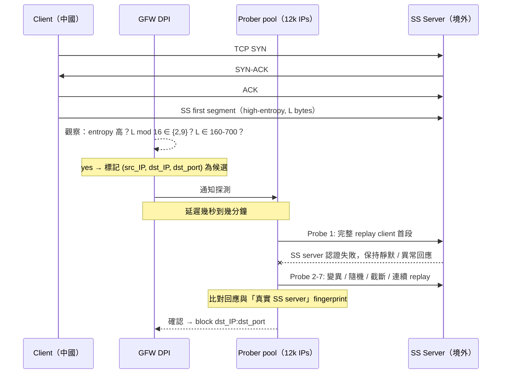

# 課堂 9.2 — GFW 對 Shadowsocks 的識別與封鎖：[[alice-bob-carol-ss-imc20]] 逐節精讀

## 學前知道
- 前置課：
  - [9.1 GFW 架構綜述](./9.1-gfw-architecture-overview.md)
  - [Part 7.2 Shadowsocks 完整解構](../part-7-proxy-protocols/7.2-shadowsocks.md)（待寫；本堂自包含核心 SS 機制）
  - [Part 3.x AEAD 與 entropy](../part-3-cryptography/)
- 預計閱讀時間：**55 分鐘**
- 必讀論文：Alice, Bob, Carol et al. *How China Detects and Blocks Shadowsocks.* IMC 2020 → [[alice-bob-carol-ss-imc20]]
- 必讀原始碼：
  - `shadowsocks-libev`: `src/server.c:on_recv_cb` — 失敗驗證後的 socket 行為
  - `outline-ss-server` (Jigsaw): `service/tcp.go:proxyConnection` — 30-second silent-hold 實作
  - `brdgrd`: `https://github.com/NullHypothesis/brdgrd` — TCP window-size rewriter，繞過 entropy/length 觸發

## 動機

Shadowsocks（SS）是 2017–2019 中國最廣用的代理。2019 年 5 月 GFW 開始大規模封鎖 SS。GFW Report 團隊（Alice/Bob/Carol）用 4 個月實驗逆向出 GFW 的完整偵測流水線。這篇 IMC 2020 論文是 **「對抗審查的可量測對手研究」典範**——每一個觀察都有 traffic capture + 可重現實驗 + 統計顯著性。

讀懂這篇 = 學會「**如何研究一個黑盒對手**」的方法論，本身就是 Part 9 後續所有研究的範本。

> **Failure framing**：論文的所有 workaround（brdgrd、AEAD silent-hold、Outline coalesce write）GFW 後來都 patched 或部分繞回。**2023 USENIX**（[[wu-fep-detection]]）顯示 GFW 把這套機制 generalise 為 FET 偵測，6 條 exempt 規則中 SS 觸發點變成一個 special case。**所以本堂不是「SS 怎麼防」的工程指南，而是 detector design 的 case study**。

---

## 核心概念

### 1. SS 協議本身為什麼像「亂碼」

複習 SS-AEAD（2017 後預設）的封包結構：

```
TCP first segment（client → server）:
+--------+--------------+----------+----------+--------------+-----+
|  salt  | enc(length)  | tag      | enc(data)| tag          | ... |
| 16 B   | 2 B          | 16 B     | length B | 16 B         |     |
+--------+--------------+----------+----------+--------------+-----+
其中 length = HKDF-Expand(salt, ...) 加密的下一個 record 長度
data 含 SOCKS5-like target address + 應用層 payload
```

整個 first segment **沒有任何 plaintext header**。所有 byte 都是密文，分佈接近 uniform random。

**這個「無 plaintext header」本身就是 fingerprint**。網際網路上 99 %+ 的 TCP 首包不是這樣：HTTP 有 `GET /`，TLS 有 `0x16 0x03 0x0X`，SSH 有 `SSH-2.0-`，FTP 有 `220 `，IMAP/SMTP/POP 也都有 ASCII banner。**只有 SS、VMess、obfs4 等加密代理的首包是「看起來隨機」的**。

> 本堂第一個 takeaway：**「看起來像隨機」不是隱藏，而是少數派的標記**。Wu 2023 把這個觀察形式化（lesson 9.7 詳）。

### 2. GFW 兩段式偵測



**關鍵設計**：兩段式分離把 **「便宜但 false positive 高的 passive」** 與 **「貴但精確的 active」** 解耦。

- Passive 階段每秒處理百 GbE，必須是 **stateless / per-packet**。
- Active 階段只對候選做，量級小 → 可以 stateful（記住 challenge 等待 response）。

### 3. Passive trigger 的精確條件

Alice et al. 透過大量實驗逆向出（IMC 2020 §4）：

**條件 A（length 9 mod 16）**：
- `L mod 16 == 9`
- `160 ≤ L ≤ 384`

**條件 B（length 2 mod 16）**：
- `L mod 16 == 2`
- `264 ≤ L ≤ 700`

**Entropy 條件**：byte 直方圖接近 uniform；具體 threshold 未公開但約等於 Shannon entropy `H(bytes) > 7.5 bits/byte`（隨機 byte stream 期望 8.0）。

**為什麼是這兩個 mod-class**？因為 SS-libev 預設 AEAD 設置下：

- `[salt(16) | enc_len(2) | tag_len(16) | enc_payload(N) | tag_payload(16)]`
- 整體長度 = `16 + 2 + 16 + N + 16 = 50 + N`
- 第一個 record 的 N 通常是 SOCKS5-like target address：`[atyp(1) | addr(4 or 16 or 1+len) | port(2)]` → IPv4 case `N=7` 給 `L=57`，DNS-host case `N=1+1+len+2`。
- 連續寫入第二個 record（即首個 application 數據塊）：`length L = 50 + 1 + 1 + 7 + 第二個record`。

實際 L mod 16 因 N 而定。Alice et al. 從巨量 capture 觀察到 mod={2,9} 的兩個 cluster。

**Outline 的 fix**：在 client 寫入時 **coalesce** 短期內的多個 record，讓 L 跳到 1000+ → mod-16 分佈幾乎均勻、長度也超出 trigger 範圍。

### 4. Active probing 的 7 個 family

| # | Probe 類型 | 構造 | 目的 |
|---|---|---|---|
| 1 | Verbatim replay | 完整 copy first segment | 看 server 對「合法」segment 的回應 |
| 2 | Single-byte mutation | 改 offset 0 一個 byte | tag 驗證失敗 |
| 3 | Multi-byte mutation | 改 1-12 byte 固定位置 | salt 或 enc_len 損壞 |
| 4 | Random 221-byte | 純 random | non-SS 對照 |
| 5 | Random length-matched | random，長度匹配 trigger | non-SS 對照 |
| 6 | Truncated replay | 只送前 N < L 個 byte | tag 不足 |
| 7 | Concatenated replays | 兩個 capture 連起來 | 觀察 server 是否處理第二段 |

**關鍵邏輯**：對 SS server 來說，probe 1-7 都會 **AEAD 驗證失敗**（因為 prober 不知道 client 與 server 的真實 PSK）。一個正確設計的 SS server **應該** 對所有 7 種都呈現相同行為：保持靜默、不回應、永不關閉。

**但 2019 年的 shadowsocks-libev 有 bug**：
- 對 probe type 6（truncated）：server 收到不完整 length 後等待，timeout → close（與 random 高 entropy 流量在「random TCP server」中的行為相同）。
- 對 probe type 7（concatenated）：server 處理第二段時的 timing 與真實 SS 不同。

這些 micro-behavior 的差異足以讓 prober **以 ~高置信度** 區分 SS server vs 普通 TCP server。

### 5. Prober 基礎設施

[[alice-bob-carol-ss-imc20]] §6 觀察到 **>12 000 個 source IP**，但 TCP timestamp 分析顯示：

- 所有 prober 的 TCP timestamp value 落在 **少數幾條 monotonic increasing sequence** 上。
- 同一秒內，不同 source IP 的 timestamp 線性相關 → 共享 kernel clock。
- Source port 集中在 Linux ephemeral range (32768–60999)。

**論證**：12000 個 IP 背後可能只有十幾台中央化主機，通過 **source-IP-spoofing**（GFW 的 in-path 位置容許）或 **NAT pool** 對外發出探測。這意味著：

1. 對協議設計者：**不要嘗試 IP-level rate limiting prober**——他們有無限 IP。
2. 對研究者：**可以從 timestamp clustering 把 12k IP 收斂到 N 個** central machine，作為 fingerprint。

**對比 [[ensafi-gfw-probing]] 的 2015 結果**：當時 prober 池小、可預測。2020 觀察到 prober pool 擴張了一個 order，但「central orchestration」這個 invariant 沒變。

### 6. brdgrd 的工作機制

`brdgrd`（Bridge Guard，Tor 開發的工具）的核心 trick：

> 在 server 端用 TCP window-size shrinking，讓 client 的 first record **被迫分成多個 TCP segment** 發送。

實作上 brdgrd 用 iptables hook，在 SYN-ACK 中把 `window scale` 設為 0、把 `window size` 設為小於 SS-libev 的首段大小（例如 100 bytes）。

**效果**：
- 原本 client 把 `salt|enc_len|tag|enc_payload|tag`（典型 200-500 bytes）放在一個 segment 發出。
- brdgrd 之後，client 必須分成 2-3 個 segment 發送。
- GFW 的 trigger 是「**第一個 data segment 的 length**」。第一個 segment 現在只有 ~100 bytes，落在 trigger 範圍外。

**為什麼 GFW 不直接重組 TCP 流再判斷**？因為這需要 per-flow stateful buffering，**at scale 太貴**。GFW 對 TLS 確實做了重組（為了讀 SNI），但 TLS 重組有明確的 ClientHello 邊界、有 length field。對 SS 來說，沒有邊界 → 重組多少 byte 才算「first record」？無解。

**brdgrd 的弱點**：純 server-side workaround，client 對此一無所知。client 的真實傳輸是 same。GFW 後續若 adapt（記住「每個流的前 N segment 總和」），brdgrd 就失效。

### 7. Outline 與 shadowsocks-libev 後續 fix

**Outline 1.0.10+**：
- 在 `service/tcp.go` 的 `proxyConnection` 中加 30-second silent-hold：失敗認證後保持 socket open 30 秒，不發任何 byte，不關閉。
- 對 probe type 1-6 統一回應「無回應」，使得 prober 無法區分 silent SS server vs 故障 TCP server vs 黑洞。
- 對 probe type 7 也包含在 silent-hold 內。

**shadowsocks-libev 2020+**：類似 30s silent-hold + AEAD-only mode + 拒絕 stream cipher 模式（後者更易被識別）。

**這些 fix 仍可能失效**（前瞻 9.7）：Wu 2023 的 FET 偵測不再依賴 active probing 確認 → 純被動 6 條 exempt 規則。SS 即使 silent-hold，也可能在 passive 階段就被標記。

---

## 與我們協議設計的關聯

把這篇論文的教訓轉成我們協議的硬約束：

1. **首包不能是「純高熵 200–700 bytes」**。設計選項：
   - (a) 包成 TLS ClientHello（REALITY pattern）
   - (b) 主動 split / pad 到 trigger 範圍之外
   - (c) 首包刻意低 entropy（含 ASCII-like masking byte）
2. **服務器對任意 garbage 必須 silent-hold + 跟 cover server 對齊**。MTProto 的「永遠讀，永不關」（[[frolov-probe-resistant-ndss20]]）是最安全的。
3. **應對 prober pool 不能依賴 IP-blocking**。應該記錄 `(prober_subnet, timestamp_cluster, port_range)` 三元組做 long-term 標記。
4. **首包之後的 byte sequence 必須 plausible**——光首包通過 trigger 不夠（lesson 9.7 詳）。

Part 11.4「首包設計」會用這 4 條當 derivation 起點。

---

## 動手

**目標**：在境外 VPS 上重現 [[alice-bob-carol-ss-imc20]] 的 passive trigger 觀察。

> ⚠️ 不要在你的「生產 SS server」上做——做完 `ss-server` instance 可能被加入 GFW IP blocklist 數天。用一個臨時 instance。

### 步驟
1. 在境外 VPS 開一個 ss-libev：
   ```bash
   ss-server -s 0.0.0.0 -p 25555 -k testkeydonotuseinprod -m chacha20-ietf-poly1305
   ```
2. 在境內 VPS（測試用，例如 Tencent Beijing region）裝 ss-libev client，連線、跑 HTTPS over SS 10 分鐘。
3. 同時在境外 VPS 跑 tcpdump：
   ```bash
   tcpdump -i any -w ss-probes.pcap 'port 25555 and not src 中國clientIP'
   ```
4. **預期**：5–60 分鐘內，會看到 12000+ probe-like TCP connect 從不同中國 IP 嘗試連 port 25555。每個都做 1-7 種 payload。
5. 用 `tshark` 或 Python (`scapy`) 解析，print 每個 probe 的：
   - source IP / source port
   - TCP timestamp value (TS val)
   - payload SHA256 + length
6. 把 TS val 對 (wall-clock-time) plot：應該看到幾條 cluster lines（同源主機）。

### 預期觀察
- 12000+ distinct source IPs。
- TS val 落在 ~5 條 monotonic line。
- Payload SHA256 應該分布在「7 個 cluster + 多個 unique replay」。
- Source port 高度集中於 32768–60999。

**輸出物**：放到 `assets/measurements/2026-ss-probe-replication/` 並 redact server IP；寫一份 `RESULTS.md` 對比 Alice et al. 的 2019–20 觀察與你的 2026 觀察。**如果 2026 已經改變了**（例如 probe 增多到 20k，或 TS clustering 變 N=20），這本身就是可發表的 measurement update。

---

## 自我檢查

1. 為什麼 SS-AEAD 的首包 length mod 16 集中在 {2, 9}？從協議結構推導出來。
2. 解釋 brdgrd 為什麼有效。為什麼 GFW 不直接重組 TCP 流？
3. Outline 的 30-second silent-hold 是針對 7 個 probe family 中的哪幾個？哪些 family 它 **無法** 防禦？
4. [[cao-tcp-side-channel]] 的 TCP timestamp side-channel 在這篇論文中如何被反向應用（censor → researcher）？
5. 如果你是 GFW 維護者，看到 Alice et al. 的 disclosure 後，最簡單的「不破壞既有資源」升級是什麼？提示：lesson 9.7 給出 GFW 實際採取的路線。
6. 對我們的協議：列出三個 SS 設計上的「不應該重蹈覆轍」項目，並對應 Part 11 哪一節會處理。

---

## 延伸閱讀

- Alice, Bob, Carol. *Talk at IMC'20*: `https://gfw.report/talks/imc20/en/` — slides 有更多視覺化
- Wang, Dong, Murdoch, Lindell. *Seeing Through Network-Protocol Obfuscation.* CCS 2015 — SS 之前的 obfs2/3 探測，這是 SS 探測的學術前身
- Yadav et al. *Where the Light Gets In: Analyzing Web Censorship Mechanisms in India.* IMC 2018 — 對比中國 vs 印度的 DPI 機制
- GFW Report blog. *Large-scale blocking of Shadowsocks: An update.* 2020-12 — 後續觀察
- shadowsocks-libev issues tracker（特別是 2019-2020 issue #2453 系列）

---

## 研究級補遺

### 1. 學界詞彙

| 中文/口語 | 學界標準 | 釋義 |
|---|---|---|
| 首包熵測試 | **first-packet entropy heuristic** | passive 識別「無 plaintext header」流量 |
| 主動探測族 | **probe family / probe class** | 同類但變異的探測集合 |
| 探測抗性 | **probe resistance** | 對 active probe 不洩漏身份 |
| 殘留封鎖 | **residual censorship** | 觸發後一段時間繼續封鎖 |
| 邊界主機 | **bridge / proxy server** | 抗審查服務器（Tor 用法為「bridge」） |
| 兩段式偵測 | **two-stage detection (passive→active)** | 先 cheap heuristic 再 expensive confirm |
| 中央化探測 | **centrally-orchestrated probing** | distributed source IPs 背後共享主機 |

### 2. 對手分類學精化

對 SS 偵測這個 specific subproblem：
- **GFW capability**：on-path passive (entropy/length stateless heuristic) + off-path active probing。
- **不需 in-path drop**——SS block 是事後 IP blocklist。
- **不需 ML**——hand-crafted heuristic 足夠（且 2019 年無公開 ML deployment 證據）。
- **Stateful**：probe scheduler 必須記住「在 t 時刻通知過 prober pool 對 (X, Y) 做 7-family」並收集 response。
- **計算限制**：per-flow `L mod 16` + entropy 計算每包 O(L)，at Tbps 仍可承受。

### 3. 形式化定義

**SS detection problem 的 game-based definition**：

$$
\mathsf{Adv}^{\mathsf{SS\text{-}det}}_{\mathcal{A}}(\kappa) = \Pr[\mathcal{A}(\mathbf{T}) = 1 \mid \mathbf{T} \text{ is SS}] - \Pr[\mathcal{A}(\mathbf{T}) = 1 \mid \mathbf{T} \text{ is non-SS}]
$$

其中 $\mathbf{T}$ 是一個 TCP flow 的 packet trace（含 timing），$\mathcal{A}$ 是一個 polynomial-time PPT 演算法。

[[alice-bob-carol-ss-imc20]] 的 detector 達到 $\mathsf{Adv} \geq 0.95$ 對 SS-libev default 設定。Outline + silent-hold 後 $\mathsf{Adv}$ 估計 **遞減到 ~0.6** （論文未給精確 number；後續 Wu 2023 給出 FET-extended 版本的數字）。

### 4. 我們協議的座標

| Part 11 子節 | 引用本堂內容 |
|---|---|
| 11.4 首包設計 | 必須避開 `L mod 16 ∈ {2,9}` × `entropy > 7.5` × `length ∈ trigger range` 的交集 |
| 11.6 服務器 fallback | REALITY-style 即可滿足 silent-hold 與 cover-mimicry；SS 30s silent-hold 不夠 |
| 11.7 流量形態 | 不能僅靠首包合規，後續流仍須 plausible cover |

### 5. 開放問題

1. **Outline silent-hold 在 2026 仍有效嗎？** 沒有公開 follow-up 測量。設計實驗。
2. **GFW 對 SS-2022 / shadow-tls 等新變體的反應**：v2ray 社群有零散觀察，沒有 peer-reviewed 文章。
3. **跨機制 correlation**：GFW 是否會 cross-correlate SS trigger 與 DNS / SNI events？
4. **Replay attack on prober**：若 server 對 probe 故意回應 misleading bytes，能否誘導 prober 誤分類非 SS server 為 SS（讓 GFW 浪費 IP blocklist 條目）？這是個 active research direction。
