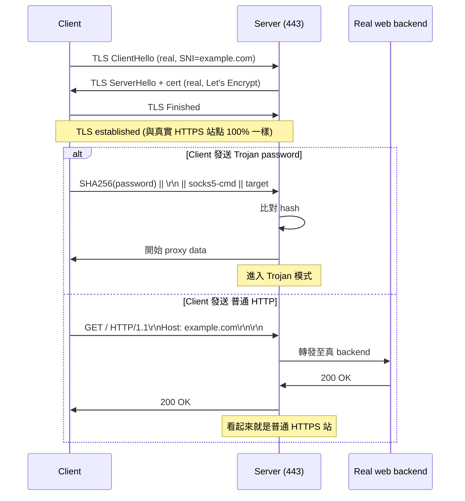

# 課堂 9.3 — GFW 對 Trojan 的識別嘗試：「真 TLS」的代價與漏點

## 學前知道
- 前置課：
  - [9.2 SS detection](./9.2-gfw-shadowsocks-detection.md)
  - [Part 4.3 TLS 1.3 完整握手](../part-4-tls-quic/4.3-tls13-handshake.md)（待寫；本堂回顧 ClientHello、ALPN、ECH 介面）
  - [Part 4.6 SNI 與 ECH](../part-4-tls-quic/4.6-sni-ech.md)（待寫；SNI 黑名單機制）
- 預計閱讀時間：**45 分鐘**
- 必讀論文：
  - Houmansadr, Brubaker, Shmatikov. *The Parrot is Dead: Observing Unobservable Network Communications.* IEEE S&P 2013 → [[houmansadr-parrot-is-dead]]
  - Frolov, Wampler, Wustrow. *Detecting Probe-resistant Proxies.* NDSS 2020 → [[frolov-probe-resistant-ndss20]]
  - Frolov & Wustrow. *The use of TLS in Censorship Circumvention.* NDSS 2019 → [[frolov-utls-ndss19]]
- 必讀原始碼：
  - `trojan-gfw/trojan`: `src/session/serversession.cpp:in_recv` — TLS 完成後的協議分歧
  - `trojan-go`: `tunnel/trojan/server.go` — Go 版同等邏輯
  - 對照 `nginx` 的 `ngx_http_request.c` — Trojan 設計目標模仿的真 backend
- 必讀社群觀察（不是 peer-reviewed，但是 primary observation 源）：
  - net4people/bbs 中 Trojan 相關 issue（2019–2023）
  - GFW Report 2022 blog post on Trojan + TLS-in-TLS

## 動機

Trojan 是 2019 trojan-gfw 開源的「**真 TLS 偽裝**」代理：client 用真正的 TLS（非自簽憑證、走 ACME）連到 server 的 443 port，TLS 內第一個 byte 區分「合法 Trojan 密碼」vs「普通 HTTP request」。**目標**：完全像一個 HTTPS 站點，連 ClientHello/ServerHello 都是真的。

**結果**：Trojan 在 2019–2021 「相對」抵禦 GFW。但 2021 後社群陸續觀察到 Trojan 被識別、IP 被封。為什麼？本堂從 [[houmansadr-parrot-is-dead]] 的理論視角解構「真 TLS 偽裝」的 fundamental 漏點。

> **Failure framing**：很多人認為 Trojan「失敗」是 GFW 升級了。**真實原因更深**——Trojan 從一開始就有 [[houmansadr-parrot-is-dead]] 預測的「**unobservability 漏洞**」，只是 2019 時 GFW 沒精力去打，後來打了。本堂目的：讓你看到 design-level 漏洞，而不是工程升級層面的 cat-and-mouse。

---

## 核心概念

### 1. Trojan 協議設計

**設計優點**：
- TLS layer 用真實憑證 + 真實 ALPN，**TLS 指紋完全合規**（[[frolov-utls-ndss19]]）。
- 對 active probe：直接送 garbage 進 server → server 走「Real backend」路徑，回應 nginx 預設頁面（404、403）。
- 對 SNI 黑名單：用未被封鎖的真實域名 SNI，繞過。

### 2. Trojan 的潛在 fingerprint（GFW 可以看到什麼）

#### (a) TLS-in-TLS 流量形態

Trojan-over-TLS 的 application data 結構：
- 客戶端：每次 TLS record 包 1 個 application 訊息（HTTP request、CONNECT 等）。
- 一般 HTTPS：瀏覽器先送 request（小 record），server 送 response（大 record，可能拆多個）。
- Trojan：**每個 record 都是 client→target 的密文，分布跟瀏覽器的 request-response 不同**。

具體訊號：
- **Burst pattern**：Trojan client 發大塊（上傳） vs 一般 HTTPS browsing 是「短上傳 + 長下載」。
- **Inter-record timing**：Trojan 的 application-layer Roundtrip 跟瀏覽器 page-load 不同。
- **Total flow size**：Trojan 流持續時間長、總量大；一般 HTTPS 流 < 30 秒就結束。

這些訊號就是「**TLS-in-TLS detection**」的核心特徵——GFW 不需要解密就能識別「這個 TLS 不是普通瀏覽」。Wu et al. *Sifter* (USENIX Security 2024) 與 Sippe et al. *Detecting TLS-in-TLS Tunneling* 系列已直接針對此攻擊面。

> **2026 GFW 是否部署此類分類？** OONI 與 GFW.report 沒有確切 IP-level evidence，但 Iran 已被觀察到對 Trojan 流量做疑似 ML-class block。中國方面，Trojan 通常活幾天到幾週就被 IP-block，可能由此類 ML 觸發。

#### (b) Server 對 garbage 的回應「不夠像」

Trojan 預設 fallback 是配置中的 `remote_addr`，通常是 `127.0.0.1:80` 的 nginx。但：
- **TLS-layer fallback 邏輯**：Trojan-go 收到 wrong password 才走 fallback。在收到 password 之前的 TLS handshake 已經完成。
- **問題**：實際 nginx HTTPS 是 TLS terminate 在 nginx 自己，cert 是 nginx 設置。但 Trojan-server 是 cert 設置由 Trojan 自己處理，**TLS session ticket、TLS heartbeat 等的處理可能與真 nginx 不同**。

[[frolov-probe-resistant-ndss20]] 的核心 trick 是：發送各種變異探測，觀察 timeout / FIN / RST / data-thresholds。對 Trojan 來說，可探測項目：

| Probe | 預期真 nginx 回應 | Trojan 實際回應 | 區分性 |
|---|---|---|---|
| 完整 HTTP GET | 200 / 404 | 200 / 404 via fallback | 低 |
| HTTP 但 header 異常 | 400 Bad Request | fallback 後 nginx 給 400 | 低 |
| TLS rehandshake (legacy) | 視 nginx 配置 | Trojan-go 不處理 → silent? | **高** |
| TLS 0-RTT early data | 取決於 nginx PSK 配置 | Trojan 通常不支援 | **高** |
| 壞 record 後跟正常 record | nginx 直接 abort | Trojan 視實作 | **中** |
| Client 不送 ALPN | nginx 走預設 | 同 | 低 |

**設計級漏洞**：Trojan 的 fallback 是「**HTTP application layer** fallback」，但 GFW 可以在 **TLS layer** 上做探測。Trojan-server 對 TLS-layer 異常的處理跟真 nginx 不同。

#### (c) 服務器端的 IP / 域名 ASN 不對

許多 Trojan 部署在 OVH、DigitalOcean、Vultr 等 hosting provider 上，**而真實 example.com 的 IP 通常不在這些 ASN**。

GFW 的 SNI 與 IP 對應關係檢查（passive）：
- 觀察 ClientHello SNI = `example.com`。
- 同時 cross-reference `example.com` 的 authoritative DNS resolution 結果。
- 若 `dst_IP` 不在 `example.com` 應有的 IP/CDN list → 標記為可疑。

這是 **「domain-IP correlation」** 信號——對純 Trojan 部署（自己的 cert + 自己的 IP）一打一個準。

> **REALITY 的 fix**（lesson 9.4）：強制要求 client 使用 GFW 不會 block 的 SNI（如 microsoft.com），且 server 端去 hand-off 真實 backend。從 IP/SNI 對應角度，REALITY 仍可能被識別，但 REALITY 的特殊性在於 cert 是 **借用** 真實 SNI 的 cert，使得對應更接近真。

### 3. 已觀察的 Trojan IP 封鎖案例

社群在 net4people/bbs 與 v2fly 論壇上的觀察（非 peer-reviewed，但是 primary observation）：

- **2021-08~10**：大規模 Trojan IP block，OVH 香港節點集中受害。觸發機制疑似 IP + SNI mismatch。
- **2022-Q3**：自簽憑證的 Trojan-go 部署被快速識別。隨後 Trojan-go 預設改為「不接受自簽」。
- **2023-Q2**：對於 TLS-in-TLS 流量形態，OONI 紀錄到「能完成 TLS 握手但 application data 在 X 分鐘後被 drop」的事件。
- **2024+**：Trojan 在 v2fly/Xray 社群已被視為「過時」，主流推 VLESS+REALITY。

### 4. 為什麼 [[houmansadr-parrot-is-dead]] 早就預測

論文的核心觀察（IEEE S&P 2013）：

> 「**完美的協議模仿是計算上不可行的**。被模仿協議 P 的 implementation 多樣性、行為複雜度、與環境的交互（DNS、ICMP、TCP 重傳模式），都無法被 mimicry tool 完全複製。」

論文列舉幾類 unobservability 漏洞：

1. **協議實作差異**：例如不同 SSH 版本的 banner、不同 TLS library 的 ClientHello 順序。
2. **行為差異**：例如真實 HTTPS 對 unexpected packet 的回應 vs proxy 的回應。
3. **多協議耦合**：真實 protocol 通常伴隨其他協議（HTTPS 有 DNS、OCSP、可能 H/3 alt-svc）；mimicry 缺。
4. **時序差異**：真實 P 有 P-specific timing；mimicry 不精確。

**Trojan 是「TLS-mimicry + HTTPS-fallback」**：第 1 條（TLS 實作）做得好，第 2、3、4 條都有漏。

### 5. Trojan 的後續演化：Shadow-TLS、Trojan-Killer 對抗

社群提出多種改進：

- **shadow-TLS**：在 Trojan 基礎上把流量再藏一層，讓 TLS-in-TLS 訊號變化。但被 [[frolov-probe-resistant-ndss20]] 級 TCP-layer 探測仍可能識別。
- **Trojan + WebSocket**：再加一層偽裝。對 GFW 增加 cost，但不解決基本問題。
- **VLESS+REALITY**：放棄「客戶端用真 TLS」這個假設，改為「**TLS 是 cover，handshake 借用真實 SNI**」。lesson 9.4 詳。

---

## 與我們協議設計的關聯

從 Trojan 的「失敗」中抽取的設計原則：

1. **「真 TLS」不等於 unobservable**。TLS-in-TLS 形態識別是 2024+ 必須假設的對手能力。
2. **fallback 必須在 TLS layer 處理 garbage**，不只是 application layer。
3. **服務器 IP 與 SNI 的 ASN 對應**是 GFW 可用的 cross-feature signal。我們的 deployment topology 必須考慮這個。
4. **避免「客戶端 → 服務器 → 真 backend」這種 reverse-proxy 形態**，因為 forward proxy（流量為主上行）vs reverse proxy（流量為主下行）的形態極不同。考慮「**handshake-stealing**」：服務器自己回應 TLS handshake（盜用真實 cert）但 application data 自己處理。

Part 11.4 + 11.5 會把這些寫成 design constraints。

---

## 動手

**任務**：用 TLS-in-TLS detection toy 模型測試你自己的 Trojan instance。

> ⚠️ 同樣警告——用臨時 instance，不要用你的生產 Trojan。

1. 部署 Trojan + nginx，使用 Let's Encrypt 真實 cert，SNI = 你的測試域名。
2. 部署一個 control nginx（同樣 cert、同樣 SNI），不接 Trojan，純 static page。
3. 從境外 client，做兩種測試：
   - 透過 Trojan tunnel HTTPS browse 一個大網站 5 分鐘。
   - 直接 HTTPS browse 同一站點 5 分鐘。
4. 在 server 端用 tcpdump 抓兩種流量。
5. 用 `tshark` 提取每個 TCP segment 的 `(timestamp, direction, size)`。
6. 計算特徵：
   - 流量總時長
   - 上下行 byte ratio
   - 平均 record size 上下行
   - Inter-arrival time 分布
7. 把兩種流量畫直方圖，視覺確認差別。
8. （bonus）丟到 scikit-learn 訓練一個 simple SVM，看 closed-world accuracy。

**預期**：簡單 SVM 應該能達 80–90% accuracy。這就是 GFW 的「ML 分類器」最簡單的 baseline 能力。

輸出：`assets/measurements/2026-trojan-tls-in-tls/`，redact IPs。

---

## 自我檢查

1. Trojan 的 fallback 為什麼在 TLS layer 漏掉？舉一個具體 TLS extension/feature 是 Trojan 沒處理但真 nginx 會處理的。
2. 為什麼 GFW 對 Trojan 用 IP-level block 而不是 RST 注入？
3. [[houmansadr-parrot-is-dead]] 的「協議模仿不可能」論點如何適用於 Trojan？舉三個 fundamental 漏點。
4. domain-IP correlation 信號為何對 Trojan 致命但對 CDN-fronted 流量無效？
5. 為什麼 shadow-TLS 不解決 [[frolov-probe-resistant-ndss20]] 揭示的 TCP-layer 探測問題？
6. 設計一個 active probe，能在 TLS handshake 完成後**不傳送 password** 的前提下區分 Trojan vs 真 nginx。

---

## 延伸閱讀

- trojan-gfw README + spec（GitHub `trojan-gfw/trojan`）
- trojan-go 文檔（GitHub `p4gefau1t/trojan-go`）
- GFW Report 2022-08 blog: *The Increasing Difficulty of Trojan*
- v2fly forum thread 「Trojan 是否還能用」 系列
- Sippe et al. *Detecting TLS-in-TLS via traffic analysis.* PoPETs 2024（最新針對性研究）

---

## 研究級補遺

### 1. 學界詞彙

| 中文 | 學界標準 | 說明 |
|---|---|---|
| 真 TLS 偽裝 | **legitimate-TLS tunneling** | 與「parrot」相對，用真實 cert 與標準握手 |
| 後備路徑 | **fallback** | 認證失敗後的 server 回應路徑 |
| TLS 內隧道 | **TLS-in-TLS / tunneling over TLS** | TLS 流量內承載另一個加密協議 |
| 域名-IP 對應 | **domain-IP correlation** | passive cross-feature 識別 |
| 偽裝即破 | **mimicry-is-fragile** | Houmansadr 論點 |

### 2. 對手分類學精化

對 Trojan 的對手能力刻畫：
- Capability: passive TLS-in-TLS shape analysis + active probing + IP/SNI cross-reference + ML on flow features.
- Knowledge: 完整 Trojan spec 公開，server 行為可預測。
- Adaptive: 可選擇用 active probe 確認，也可純被動。
- Resources: 對所有 outbound 443 TCP 流做 traffic-shape 分析仍計算可行（特別是 LSTM/transformer-based classifier）。

### 3. 形式化定義

**TLS-in-TLS detection problem**：
給定 TCP flow $\mathbf{T}$，dst port 443, 已知 server cert 為 $C$，判斷 application layer 是 (a) 直接 HTTPS 還是 (b) 內含另一加密協議。

定理（informal, Sippe et al.）：當 application layer 為 RPC-like 雙向 stream（如 Trojan、VMess），其 record-size 與 timing 分布與「browser HTML page load」分布 KL-divergence > 0，且在 sample size 充足時可區分。

### 4. 我們協議的座標

- **不採 Trojan 的「真 TLS terminate」結構**。
- 採 **REALITY-style「handshake stealing」**：server 在 TCP 上模擬一個真實 site 的 TLS handshake（用借用 cert），但 application data 由我們處理。Part 11.5 詳。
- **traffic-shape mitigation** 是 Part 10 整段主題。

### 5. 開放問題

1. 一個「**真 TLS + fallback 完美**」的代理是否可能？什麼程度的 fallback 對 [[frolov-probe-resistant-ndss20]] 級探測是 sufficient？
2. 用 Geneva-style GA 對 Trojan 自動探測：可發現多少 evasion-detection trick？
3. TLS-in-TLS 形態識別在 2026 的真實準確率（針對 latest Trojan-go）：尚無公開測量。設計 testbed 實驗（lesson 9.13）。
