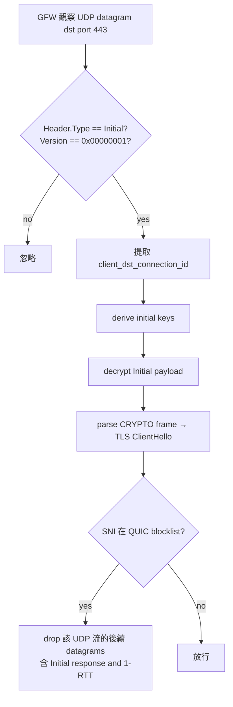

# 課堂 9.5 — GFW 對 QUIC / HTTP/3 的處理：[[zohaib-quic-sni-usenix25]] 拆解

## 學前知道
- 前置課：
  - [9.1 GFW 架構綜述](./9.1-gfw-architecture-overview.md)
  - [Part 4.7 QUIC v1 完整](../part-4-tls-quic/4.7-quic-v1.md)（待寫；本堂回顧 Initial packet、key derivation 必要部分）
  - [Part 4.9 HTTP/3 與 ALPN h3](../part-4-tls-quic/4.9-http3.md)（待寫）
- 預計閱讀時間：**50 分鐘**
- 必讀論文：Zohaib, A. et al. *Exposing and Circumventing SNI-based QUIC Censorship of the GFW.* USENIX Security 2025 → [[zohaib-quic-sni-usenix25]]
- 必讀 RFC：
  - RFC 9000 *QUIC* §17.2.2 (Initial Packet)
  - RFC 9001 *Using TLS to Secure QUIC* §5.2 (Initial Secrets and Keys)
- 必讀原始碼：
  - `quic-go` v0.52+: `internal/handshake/initial_aead.go` — Initial 加密 / 解密
  - `quic-go` v0.52: SNI-slicing 實作（具體 commit 在 2025-05 paper disclosure 之後）
  - `chromium/net/quic/`: PQ-key-share-related fragmentation

## 動機

QUIC 加密 ClientHello（含 SNI）在 Initial packet 內，但**加密密鑰由公開材料派生**（Destination Connection ID + version salt）。**2024 年 4 月 7 日**，GFW 開始大規模 decrypt QUIC Initial 並 SNI-block——這是 GFW 第一次 systematically 對 plaintext-encrypted-but-publicly-decryptable 流量 做 selective blocking。

研究意義：
- QUIC 是 IETF 標準、Cloudflare/Google/Apple 大力推、佔網際網路流量 30%+。GFW 對它的態度直接影響 H/3 全球部署速率。
- 對我們協議設計：QUIC-cover（如 Hysteria2、TUIC）的可行性與限制。

> **Failure framing**：到 2026-05 GFW 仍未 reassemble multi-datagram Initial。**但這是個 bug 不是 feature**——一旦 GFW patch（部分已於 2025-03 patch），所有依賴「fragment ClientHello」的 circumvention 都會失效。我們協議不能依賴此 bug。

---

## 核心概念

### 1. QUIC Initial packet 的密碼學

RFC 9001 §5.2 規定：

```
initial_secret = HKDF-Extract(initial_salt, client_dst_connection_id)
client_initial_secret = HKDF-Expand-Label(initial_secret, "client in", "", Hash.length)
key = HKDF-Expand-Label(client_initial_secret, "quic key", "", 16)
iv  = HKDF-Expand-Label(client_initial_secret, "quic iv", "", 12)
hp  = HKDF-Expand-Label(client_initial_secret, "quic hp", "", 16)
```

關鍵：
- `initial_salt` 是 RFC 寫死的常數（QUIC v1 是 `0x38762cf7f55934b34d179ae6a4c80cadccbb7f0a`）。
- `client_dst_connection_id` 在 packet header 中 **plaintext**。
- 因此任何 on-path observer 都能 **derive 相同 key**，**解密 Initial payload**（含 CRYPTO frame 中的 TLS ClientHello）。

**這個設計初衷不是隱私**——是 multi-path / load balancer 的 packet reflection 與 retry token 機制。對隱私來說，**QUIC Initial 等價於明文**。

### 2. QUIC ClientHello 的可變長度與 Padding 規則

RFC 9000 §14：

> Clients MUST ensure that UDP datagrams containing Initial packets have UDP payloads of at least 1200 bytes, padding with PADDING frames as necessary.

理由：防止反射攻擊 amplification。

實際分布（Chrome / Firefox 觀察）：
- 經典 Chrome `Hello`：SNI + 一些 extension → CRYPTO frame 大小 ~400 bytes → 加 PADDING 到 1200。
- 加 PQ key share (Kyber768Hybrid, since Chrome 124)：CRYPTO frame 可達 ~1500+ bytes → 必須跨多個 UDP datagram。
- 加 ECH (encrypted_client_hello extension)：再增加 ~400 bytes。

**這對 GFW 的影響極大**：當 ClientHello < 1 MTU 時，1 個 UDP datagram 包整個。**當 > 1 MTU 時，QUIC 必須把它放在多個 Initial packet (每個都有自己的 packet number) 並可能跨多個 UDP datagram**。

### 3. GFW 的 QUIC SNI 偵測管線

[[zohaib-quic-sni-usenix25]] 觀察：



**關鍵限制（GFW 的弱點）**：
- **只認 QUIC version 1（`0x00000001`）**。Version 2 (`0x6b3343cf`)、Draft versions、無效版本都不解密 → 放行。
- **不 reassemble 多 datagram 的 Initial**。如果 ClientHello 跨 2 個 datagram，GFW 只看到第一個 datagram 內的 CRYPTO frame fragment，看不到完整 SNI。

### 4. SNI-slicing：基於上述弱點的 circumvention

`quic-go` v0.52 (2025-05) 實作 SNI-slicing：

```
正常 Chrome ClientHello on QUIC v1:
[UDP datagram 1: Initial packet containing full ClientHello + PADDING]
SNI 在 datagram 1 內，GFW 能解密並 block

SNI-slicing 版本:
[UDP datagram 1: Initial packet, CRYPTO frame offset=0, len=N (SNI 前的 bytes)]
[UDP datagram 2: Initial packet, CRYPTO frame offset=N, len=M (含 SNI bytes)]
GFW 解密 datagram 1 看不到 SNI；不 reassemble；放行
```

實作細節：CRYPTO frame 支援 offset，可以片段化 TLS handshake message。Client 自由選擇切點，**SNI 必須跨切點**。

### 5. Version-negotiation 與 unknown-version 路線

[[zohaib-quic-sni-usenix25]] 另一個發現：

- Client 送 `version = 0xfafafafa`（未定義）→ Server 回 Version Negotiation packet 列出支援的版本。
- GFW 對 unknown version 不解密 → 第一個 datagram 通過。
- Client 接著用 server 支援的版本（可能是 v2 = `0x6b3343cf`）重新發起 Initial。
- **GFW 對 v2 不解密** → bypass。

**v2 vs v1 的選擇**：QUIC v2 是 RFC 9369（2023 標準化），語意與 v1 相同，**只是 salt 不同**。GFW 可隨時加上 v2 解密（trivial），但截至 2026-05 仍未做。原因可能是 v2 部署率低（< 1% 流量），打它的 collateral 邊際不值。

### 6. Hysteria2 / TUIC v5 的處境

兩者都跑在 QUIC 上但**不使用標準 ClientHello+ALPN h3**：
- Hysteria2 用自訂 ALPN（`hysteria2`）、自訂 cert 模式。
- TUIC v5 同樣自訂 ALPN（`tuic`）。

對 GFW QUIC SNI filter 的影響：
- GFW 解密 Initial，看到的 SNI 是配置中的（可以是任意域名）。如果 SNI 在 blocklist → block。
- 如果 SNI 不在 blocklist → 通過 SNI filter。但 **ALPN 識別** 是下一道——ALPN = `hysteria2` 顯然 abnormal。GFW 目前未報告對 ALPN 做 blocklist，但 trivially 可加。

對策（社群 2024-2025 觀察）：
- Hysteria2 / TUIC 改 ALPN 為 `h3` 或 `h3-29` 之類，混入 H/3 流量。
- 配合 SNI 用熱門域名（與 REALITY 同樣 trick）。
- 但 **後續 QUIC application data 形態** 顯然不是 H/3（沒有 H/3 frame、沒有 QPACK header）。GFW 一旦做 H/3 application-layer parser，能識別「ALPN=h3 但 frame 不符 H/3 spec」。

### 7. UDP rate-limiting & QoS

GFW 對 UDP 的處理還有一層：**UDP 限速**。中國 ISP / 國際出口對 UDP 普遍 QoS 較差，理由是「P2P / VoIP / 遊戲流量大但不重要」。

對 QUIC-cover 協議的影響：
- 即使 GFW 不主動 block，UDP path 在尖峰期 packet loss 5–20% 是常態。
- QUIC 有 loss recovery，但 user-experienced throughput 比 TCP 差。
- Hysteria2 的 BBR-aggressive congestion 在這種環境下優勢明顯（敢於把 BDP 推滿）。

**測量參考**：Yang Yang et al. 與後續工作報告 China 出口 UDP loss 中位數 8% 在尖峰、TCP loss < 1%。

### 8. WireGuard 的特例

WireGuard 走自訂 UDP protocol，不用 QUIC。GFW 對 WireGuard 的識別：
- **首包 fingerprint**：WireGuard handshake init message 是 148 bytes 的固定結構（type=0x01000000, sender_index, ephemeral, encrypted statics + payload, mac1, mac2）。
- **被動識別**：每 UDP flow 的首包是 148-byte type-0x01 → 高度識別性。
- **GFW 對 WireGuard 的歷史**：2017–2020 部分 ISP 已能 block；2021 後社群觀察到 endpoint IP 在大量 WireGuard handshake 後被 block。

**對策**（社群實踐）：
- `wstunnel` / `udp-over-tcp` 重新包裝。
- `wireguard-obfs`（不普及）。
- AmneziaWG（fork，加 random padding / fake handshake type）。

**研究意義**：WireGuard 設計上完全沒考慮 anti-censorship——它是 VPN protocol 不是 circumvention tool。**對我們協議**：自訂 UDP framing 必須假設首包就被 fingerprint。要么走標準 QUIC（讓 GFW 必須解密才能識別），要么 randomize 首包到 entropy-correct（[[wu-fep-detection]] 的 FET problem）。

---

## 與我們協議設計的關聯

把本堂結論轉化為設計約束：

1. **QUIC v1 cover 是目前可行的**，但 SNI-slicing trick 是 temporary。我們不能依賴它。
2. **QUIC v2 是短期 escape hatch**。可作為 fallback transport，但不能作為 primary。
3. **若用自訂 UDP 協議**：必須讓首包通過 [[wu-fep-detection]] 的 6 條 exempt 之一。實質上是：「首包必須長得像 STUN / DTLS / QUIC / WireGuard 之外的某種已知 UDP 協議」。
4. **ALPN 是 GFW 下一個可能的目標**。我們的 QUIC cover 必須用 `h3` 或 `h3-29` 之類標準 ALPN。
5. **UDP QoS** 是現實。設計要 tolerate 高 packet loss。BBR congestion control 是必需。
6. **AmneziaWG 模式**（WireGuard-with-random-padding）對 GFW 仍有 fingerprint 風險，不推薦純用。

Part 11.3「運輸層選擇」會詳細權衡 TCP-cover vs QUIC-cover。

---

## 動手

**任務**：在境外 VPS 跑 QUIC server，從境內測 SNI-slicing 是否仍有效。

> ⚠️ 用 disposable instance。SNI-slicing 在 2025-08+ 已被 GFW 部分 patch。

1. 境外 VPS：跑 `caddy-quic-experimental` 或自寫 quic-go server，cert SNI = `forbidden-domain.example`（先用 GFW.report blocklist 中已知 SNI 例如 `*.google.com`）。
2. 境內 client：
   - **Test A**：vanilla quic-go client，SNI=`google.com` → 預期 block。
   - **Test B**：quic-go v0.52+ with SNI-slicing enabled → 預期 bypass。
   - **Test C**：quic-go with version 2 → 預期 bypass。
   - **Test D**：quic-go with version negotiation hop → 預期 bypass。
3. 對每個 test 記錄：
   - 完成 handshake 機率（重試 10 次）。
   - 第一個 datagram 後 GFW 是否 drop 後續 UDP。
   - 如果 drop，drop 從第幾個 packet 開始。
4. 把結果寫成 measurement report。

**輸出**：`assets/measurements/2026-quic-gfw-state/`。

**注意**：每次測試 client port 要不同；GFW 對「同樣 4-tuple」可能有 residual blocking。

---

## 自我檢查

1. 為什麼 GFW 能解密 QUIC Initial？這對 TLS over QUIC 的「隱私」承諾意味著什麼？
2. SNI-slicing 為何 work？描述 GFW 必須補哪個能力才能 patch 此 bypass。
3. QUIC v2 與 v1 的密碼學差異具體是什麼？為何 GFW 跟不上？
4. 為什麼 WireGuard 首包易識別但 QUIC Initial 難？兩者都 plaintext-derivable，差別在哪？
5. Hysteria2 / TUIC 的「自訂 ALPN」是設計缺陷還是設計選擇？權衡是什麼？
6. 設計一個 traffic-shape test：在 ALPN=h3 但實際是 Hysteria2 的流上，能否區分於真實 H/3？

---

## 延伸閱讀

- RFC 9000, 9001 (QUIC v1 spec + TLS-QUIC integration)
- RFC 9369 (QUIC v2)
- IETF QUIC working group [meeting minutes 2024–2025](https://datatracker.ietf.org/wg/quic/)
- Chrome QUIC blog posts on Kyber768 / PQ key share rollout
- GFW Report blog 2024-04 onwards on QUIC observations

---

## 研究級補遺

### 1. 學界詞彙

| 中文 | 學界標準 | 說明 |
|---|---|---|
| Initial packet | **QUIC Initial** | RFC 9000 §17.2.2 |
| 起始密鑰 | **initial secret / initial keys** | RFC 9001 §5.2 派生 |
| 連線識別碼 | **destination connection ID (DCID)** | 首包公開字段 |
| 切片 | **SNI-slicing / CRYPTO-fragmentation** | 把 SNI 拆過 datagram 邊界 |
| 版本協商 | **version negotiation** | RFC 9000 §6 |
| 後量子混合 | **PQ hybrid key share** | Kyber768Hybrid (`X25519Kyber768Draft00`) |

### 2. 對手分類學精化

GFW QUIC censor 的能力：
- **Stateful Initial decryption**：必須對每個 QUIC flow 派生 keys（O(1) per packet）。
- **In-path drop**：能阻斷後續 datagram（[[zohaib-quic-sni-usenix25]] 觀察）。
- **Limit**：無 cross-datagram CRYPTO reassembly（截至 2026-05）。
- **Computational cost**：對 Tbps 級流量 decrypt + parse 在硬體加速下可行（AES-128-GCM 的速率 > 10 Gbps/core）。

### 3. 形式化定義

定義 `QUIC-SNI-decrypt(P)` 為 GFW 對 QUIC Initial packet $P$ 提取 SNI 的演算法。其安全性宣稱：

對任意 ClientHello $h$：
- $\Pr[\text{QUIC-SNI-decrypt}(P) \text{ extracts } SNI(h)] = 1$ 若 $h$ 完整在單一 datagram。
- $\Pr[...] = 0$ 若 $h$ 跨多個 datagram **且** GFW 不 reassemble。

這個第二條目前成立但「不 reassemble」是 implementation choice 不是 fundamental limit。

### 4. 我們協議的座標 / 取捨

| 設計選擇 | 學 | 改 |
|---|---|---|
| Transport | QUIC v1 + SNI 在大 cover | 加 ECH 雙重隱藏 SNI |
| Backup transport | QUIC v2 | + TCP cover fallback |
| ALPN | `h3` | + 真實 H/3 frame emulation |
| Padding | 標準 1200 | + 隨機 padding to 1280+ |

### 5. 必追資源

- [GFW Report QUIC paper page](https://gfw.report/publications/usenixsecurity25/en/)
- [gfw-report/usenixsecurity25-quic-sni artifact](https://github.com/gfw-report/usenixsecurity25-quic-sni)
- [quic-go 0.52 release notes](https://github.com/quic-go/quic-go/releases)
- [Chromium QUIC blog](https://chromium.googlesource.com/chromium/src/+/main/net/quic/)

### 6. 開放問題

1. 何時 GFW 會部署 cross-datagram reassembly？ 預估 2026-2027。設計 protocol 必須 ready。
2. 對 QUIC v2 / draft versions 何時 GFW 升級？ 觀察視窗。
3. ECH on QUIC（outer SNI 是 cover domain）的部署狀況：CDN 支援度。
4. UDP QoS 與 BBR-aggressive flow 的 interaction：在 GFW 環境下，aggressive flow 是否會被誤判為 attack 流量並 rate-limit？
